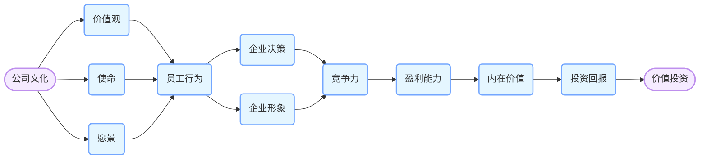

# 价值投资中的公司文化：软实力的重要性

> 关键词：价值投资、公司文化、软实力、企业竞争力、长期价值

> 摘要：本文旨在深入探讨价值投资中公司文化这一软实力的重要性。在价值投资领域，投资者往往关注公司的财务报表、市场份额等硬指标，而公司文化这一无形的软实力常常被忽视。然而，公司文化对企业的长期发展、竞争力塑造以及股东价值创造有着深远的影响。文章将从公司文化的核心概念出发，分析其与价值投资的联系，阐述其背后的原理和作用机制，通过数学模型和实际案例说明其在价值投资决策中的重要性，并探讨其在不同应用场景中的体现，最后对相关的学习资源、开发工具和论文著作进行推荐，总结未来发展趋势与挑战，解答常见问题。

## 1. 背景介绍 
### 1.1 目的和范围
本文的目的是全面剖析价值投资中公司文化这一软实力的重要性，帮助投资者认识到公司文化在投资决策中的关键作用。范围涵盖公司文化的基本概念、与价值投资的联系、其对企业发展和投资回报的影响机制，以及通过实际案例展示如何在投资实践中评估和运用公司文化这一因素。

### 1.2 预期读者
本文预期读者包括价值投资者、金融分析师、企业管理者、对价值投资和公司文化感兴趣的研究人员以及相关专业的学生。

### 1.3 文档结构概述
本文首先介绍背景信息，包括目的、预期读者和文档结构概述。接着阐述公司文化的核心概念以及与价值投资的联系，通过流程图展示其关系。然后深入讲解与公司文化相关的核心算法原理和具体操作步骤，用 Python 代码进行示例。再介绍相关的数学模型和公式，并举例说明。之后通过项目实战，展示代码实际案例并进行详细解释。接着探讨公司文化在实际应用场景中的体现。随后推荐相关的工具和资源，包括学习资源、开发工具框架和论文著作。最后总结未来发展趋势与挑战，解答常见问题并提供扩展阅读和参考资料。

### 1.4 术语表
#### 1.4.1 核心术语定义
- **价值投资**：一种投资策略，强调通过分析公司的内在价值，寻找被低估的股票，以长期持有为目标，获取稳定的投资回报。
- **公司文化**：企业在长期发展过程中形成的共同价值观、信仰、行为准则和工作方式的总和，它影响着企业的决策、员工行为和企业形象。
- **软实力**：相对于企业的硬实力（如资产、设备、资金等）而言，是一种无形的力量，包括公司文化、品牌形象、管理能力等，对企业的长期发展和竞争力具有重要影响。

#### 1.4.2 相关概念解释
- **企业文化落地**：将公司文化理念转化为实际行动和员工行为的过程，包括制定相应的制度、流程和激励措施，确保文化理念得到贯彻执行。
- **文化驱动的创新**：以公司文化为导向，鼓励员工进行创新，通过文化的激励和引导，激发员工的创造力和积极性，推动企业的创新发展。

#### 1.4.3 缩略词列表
无

## 2. 核心概念与联系 

### 公司文化的核心概念
公司文化是企业的灵魂，它由企业的价值观、使命、愿景等核心要素构成。价值观是公司文化的基石，它决定了企业在经营过程中所遵循的道德准则和行为规范。使命是企业存在的理由，它明确了企业的业务范围和目标客户。愿景则是企业对未来的期望和追求，它为企业的发展提供了方向和动力。

### 公司文化与价值投资的联系
公司文化对价值投资有着重要的影响。一方面，优秀的公司文化能够吸引和留住优秀的人才，提高员工的工作效率和创造力，从而提升企业的竞争力和盈利能力。另一方面，良好的公司文化有助于企业树立良好的品牌形象，增强客户的忠诚度和信任度，为企业的长期发展奠定基础。从价值投资的角度来看，具有优秀公司文化的企业往往具有更高的内在价值和更稳定的现金流，是价值投资者理想的投资对象。

### 文本示意图
公司文化由价值观、使命、愿景等要素构成，这些要素相互影响、相互作用，共同塑造了企业的文化氛围。公司文化通过影响员工行为、企业决策和企业形象，进而影响企业的竞争力和盈利能力。而企业的竞争力和盈利能力又直接关系到企业的内在价值和投资回报，这正是价值投资者所关注的核心内容。

### Mermaid 流程图


## 3. 核心算法原理 & 具体操作步骤 

### 核心算法原理
虽然公司文化是一种无形的软实力，但我们可以通过一些量化的方法来评估其对企业价值的影响。一种常见的方法是构建一个综合评价模型，将公司文化的各个要素进行量化，然后通过加权平均的方式计算出公司文化的综合得分。这个得分可以作为评估企业价值的一个重要参考指标。

### 具体操作步骤
1. **确定评价指标**：根据公司文化的核心要素，确定具体的评价指标，如价值观的践行程度、使命的明确性、愿景的吸引力等。
2. **收集数据**：通过问卷调查、访谈、案例分析等方式收集相关数据，了解企业员工对公司文化的认知和认同程度。
3. **量化指标**：对收集到的数据进行量化处理，将每个评价指标转化为具体的数值。
4. **确定权重**：根据各个评价指标的重要性，确定其在综合评价模型中的权重。
5. **计算综合得分**：将量化后的指标值乘以相应的权重，然后相加得到公司文化的综合得分。

### Python 源代码示例
```python
# 定义评价指标及其权重
evaluation_metrics = {
    "价值观践行程度": 0.3,
    "使命明确性": 0.2,
    "愿景吸引力": 0.2,
    "员工认同感": 0.15,
    "文化落地效果": 0.15
}

# 收集数据并量化指标（假设已经收集到数据并量化）
data = {
    "价值观践行程度": 8,
    "使命明确性": 7,
    "愿景吸引力": 9,
    "员工认同感": 8,
    "文化落地效果": 7
}

# 计算综合得分
total_score = 0
for metric, weight in evaluation_metrics.items():
    total_score += data[metric] * weight

print(f"公司文化综合得分: {total_score}")
```

## 4. 数学模型和公式 & 详细讲解 & 举例说明 

### 数学模型和公式
设公司文化的综合得分 $S$ 为各个评价指标得分 $x_i$ 与相应权重 $w_i$ 的加权和，即：
$$S = \sum_{i=1}^{n} w_i x_i$$
其中，$n$ 为评价指标的个数，$w_i$ 为第 $i$ 个评价指标的权重，且 $\sum_{i=1}^{n} w_i = 1$，$x_i$ 为第 $i$ 个评价指标的得分。

### 详细讲解
这个公式的原理是通过对各个评价指标进行加权平均，来综合评估公司文化的整体水平。权重的确定反映了各个评价指标在公司文化中的重要程度，得分则反映了企业在该指标上的表现。通过加权平均的方式，可以更全面、客观地评价公司文化的优劣。

### 举例说明
假设我们有三个评价指标：价值观践行程度、使命明确性和愿景吸引力，其权重分别为 0.4、0.3 和 0.3。某企业在这三个指标上的得分分别为 8、7 和 9，则该企业的公司文化综合得分 $S$ 为：
$$S = 0.4 \times 8 + 0.3 \times 7 + 0.3 \times 9$$
$$S = 3.2 + 2.1 + 2.7$$
$$S = 8$$
这表明该企业的公司文化整体水平较好。

## 5. 项目实战：代码实际案例和详细解释说明 

### 5.1  开发环境搭建
本项目使用 Python 进行开发，建议使用 Anaconda 来管理 Python 环境。以下是具体的环境搭建步骤：
1. **下载并安装 Anaconda**：从 Anaconda 官方网站（https://www.anaconda.com/products/individual）下载适合你操作系统的 Anaconda 安装包，并按照安装向导进行安装。
2. **创建虚拟环境**：打开 Anaconda Prompt（Windows）或终端（Linux/Mac），输入以下命令创建一个名为 `company_culture_analysis` 的虚拟环境：
```bash
conda create -n company_culture_analysis python=3.8
```
3. **激活虚拟环境**：输入以下命令激活虚拟环境：
```bash
conda activate company_culture_analysis
```

### 5.2  源代码详细实现和代码解读
```python
# 定义评价指标及其权重
evaluation_metrics = {
    "价值观践行程度": 0.3,
    "使命明确性": 0.2,
    "愿景吸引力": 0.2,
    "员工认同感": 0.15,
    "文化落地效果": 0.15
}

# 模拟收集数据并量化指标
def collect_data():
    data = {}
    for metric in evaluation_metrics.keys():
        score = float(input(f"请输入 {metric} 的得分 (0 - 10): "))
        data[metric] = score
    return data

# 计算综合得分
def calculate_total_score(data):
    total_score = 0
    for metric, weight in evaluation_metrics.items():
        total_score += data[metric] * weight
    return total_score

# 主程序
if __name__ == "__main__":
    print("开始进行公司文化评估...")
    data = collect_data()
    total_score = calculate_total_score(data)
    print(f"公司文化综合得分: {total_score}")
    if total_score >= 8:
        print("公司文化整体水平优秀！")
    elif total_score >= 6:
        print("公司文化整体水平良好。")
    else:
        print("公司文化有待提升。")
```
### 代码解读与分析
- **评价指标及其权重**：`evaluation_metrics` 字典定义了评价公司文化的五个指标及其相应的权重。
- **数据收集**：`collect_data` 函数通过用户输入的方式收集各个评价指标的得分，并将其存储在一个字典中。
- **综合得分计算**：`calculate_total_score` 函数根据前面介绍的数学模型和公式，计算公司文化的综合得分。
- **主程序**：在主程序中，首先调用 `collect_data` 函数收集数据，然后调用 `calculate_total_score` 函数计算综合得分，最后根据得分情况输出评价结果。

## 6. 实际应用场景 
### 投资决策
在价值投资中，投资者可以将公司文化的评估结果作为投资决策的重要参考因素。具有优秀公司文化的企业往往具有更高的内在价值和更稳定的现金流，投资这样的企业可以降低投资风险，提高投资回报。

### 企业管理
企业管理者可以通过评估公司文化，了解企业在文化建设方面的优势和不足，及时调整文化建设策略，提高员工的凝聚力和战斗力，促进企业的长期发展。

### 并购重组
在企业并购重组过程中，公司文化的兼容性是一个重要的考虑因素。如果两家企业的文化差异过大，可能会导致整合困难，影响企业的协同效应和价值创造。因此，在并购重组前，需要对双方的公司文化进行评估和整合。

### 品牌建设
优秀的公司文化有助于企业树立良好的品牌形象，增强客户的忠诚度和信任度。企业可以通过传播公司文化，塑造独特的品牌个性，提高品牌的市场竞争力。

## 7. 工具和资源推荐
### 7.1 学习资源推荐
#### 7.1.1 书籍推荐
- 《企业文化必读12篇》：全面介绍了企业文化的基本概念、理论和实践方法，是学习企业文化的经典著作。
- 《基业长青》：通过对世界上优秀企业的长期研究，揭示了企业保持卓越的秘诀，其中公司文化是重要的因素之一。
- 《从优秀到卓越》：探讨了企业如何从优秀走向卓越，强调了公司文化在企业转型中的关键作用。

#### 7.1.2 在线课程
- Coursera 上的 “企业文化与领导力” 课程：由知名商学院教授授课，系统讲解企业文化的相关知识和实践案例。
- edX 上的 “企业价值观与文化塑造” 课程：提供了丰富的学习资源和互动环节，帮助学员深入理解企业价值观和文化的重要性。

#### 7.1.3 技术博客和网站
- 哈佛商业评论（https://hbr.org/）：发表了许多关于企业文化、领导力和管理的前沿文章，具有很高的学术价值和实践指导意义。
- 麦肯锡季刊（https://www.mckinsey.com/）：提供了大量关于企业战略、组织管理和文化建设的研究报告和案例分析。

### 7.2 开发工具框架推荐
#### 7.2.1 IDE和编辑器
- PyCharm：一款功能强大的 Python 集成开发环境，提供了代码编辑、调试、版本控制等丰富的功能，适合 Python 开发。
- Visual Studio Code：一款轻量级的代码编辑器，支持多种编程语言，具有丰富的插件扩展功能，可用于快速开发和调试。

#### 7.2.2 调试和性能分析工具
- PDB：Python 自带的调试器，可以帮助开发者定位和解决代码中的问题。
- cProfile：Python 标准库中的性能分析工具，可以分析代码的运行时间和函数调用情况，帮助优化代码性能。

#### 7.2.3 相关框架和库
- Pandas：一个强大的数据处理和分析库，可用于处理和分析公司文化评估过程中收集到的数据。
- Matplotlib：一个常用的绘图库，可用于可视化公司文化评估结果，帮助更好地理解和展示数据。

### 7.3 相关论文著作推荐
#### 7.3.1 经典论文
- Schein, E. H. (1985). Organizational culture and leadership. Jossey-Bass. 该论文深入探讨了组织文化与领导力的关系，是组织文化领域的经典之作。
- Kotter, J. P., & Heskett, J. L. (1992). Corporate culture and performance. Free Press. 研究了企业文化对企业绩效的影响，为企业文化的研究提供了重要的理论和实证依据。

#### 7.3.2 最新研究成果
- 关注顶级学术期刊，如《Academy of Management Journal》、《Strategic Management Journal》等，这些期刊会发表关于企业文化、战略管理等领域的最新研究成果。

#### 7.3.3 应用案例分析
- 可以参考一些知名咨询公司的研究报告，如波士顿咨询公司（BCG）、贝恩公司（Bain & Company）等发布的关于企业文化建设和企业转型的案例分析，从中学习实践经验和最佳实践方法。

## 8. 总结：未来发展趋势与挑战
### 未来发展趋势
- **文化数字化**：随着信息技术的发展，企业将越来越多地利用数字化手段来传播和强化公司文化，如通过企业内部社交平台、在线学习系统等方式，提高员工对公司文化的认知和认同程度。
- **文化个性化**：不同的企业具有不同的发展阶段、业务特点和员工群体，未来公司文化将更加注重个性化定制，以满足企业的特定需求和员工的个性化发展。
- **文化全球化**：在全球化的背景下，企业的跨国经营和国际合作日益频繁，公司文化需要更加具有包容性和开放性，以适应不同文化背景的员工和客户。

### 挑战
- **文化变革的难度**：公司文化是企业长期发展过程中形成的，具有很强的稳定性和惯性，因此文化变革往往面临很大的阻力。如何有效地推动文化变革，是企业面临的一个重要挑战。
- **文化评估的准确性**：公司文化是一种无形的软实力，难以用精确的指标和方法进行评估。如何提高文化评估的准确性和可靠性，是当前研究的一个热点问题。
- **文化与战略的匹配**：公司文化应该与企业战略相匹配，以支持企业战略的实施和实现。然而，在实际操作中，文化与战略之间往往存在脱节的现象，如何实现文化与战略的有效对接，是企业需要解决的一个关键问题。

## 9. 附录：常见问题与解答
### 1. 如何判断一个企业的公司文化是否优秀？
可以从多个方面进行判断，如企业的价值观是否符合社会道德和行业规范，使命是否明确且具有吸引力，愿景是否具有前瞻性和可行性，员工是否对公司文化有高度的认同和践行等。此外，还可以参考企业的业绩表现、客户