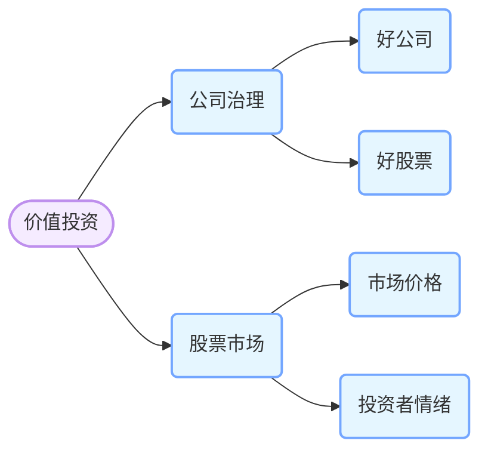

# 价值投资中的公司治理分析：好公司vs好股票

> 关键词：价值投资、公司治理、好公司、好股票、财务分析

> 摘要：本文围绕价值投资中公司治理分析这一核心，深入探讨了好公司与好股票之间的区别与联系。首先介绍了文章的背景信息，包括目的、预期读者、文档结构和相关术语。接着阐述了核心概念，剖析了公司治理、好公司、好股票的内涵及相互关系，并给出相应的示意图和流程图。详细讲解了核心算法原理，以财务比率分析为例给出Python代码。通过数学模型和公式进一步阐释了如何评估公司价值和股票价值。在项目实战部分，搭建了开发环境，给出实际代码并进行解读。探讨了实际应用场景，推荐了学习资源、开发工具和相关论文著作。最后总结了未来发展趋势与挑战，解答了常见问题，并提供了扩展阅读和参考资料。通过全面的分析，旨在帮助投资者更准确地理解好公司与好股票的差异，做出更明智的投资决策。

## 1. 背景介绍 
### 1.1 目的和范围
在价值投资领域，判断一家公司是否值得投资是一个复杂的过程。投资者往往面临一个困惑：好公司是否就意味着是好股票？本文章的目的在于深入分析价值投资中公司治理的各个方面，明确好公司与好股票之间的区别和联系，为投资者提供一套系统的分析方法和决策依据。文章的范围涵盖了公司治理的核心概念、评估公司和股票价值的算法原理、数学模型，以及实际应用案例等多个方面。

### 1.2 预期读者
本文预期读者主要包括对价值投资感兴趣的个人投资者、金融行业从业者、财务分析师、投资顾问以及相关领域的研究人员。这些读者希望通过对公司治理的分析，提升自己在价值投资方面的决策能力和专业知识。

### 1.3 文档结构概述
本文将按照以下结构展开：首先介绍核心概念，包括公司治理、好公司和好股票的定义和相互关系；接着讲解评估公司和股票价值的核心算法原理及具体操作步骤；然后通过数学模型和公式进一步阐述相关理论；在项目实战部分，给出实际代码案例并进行详细解释；探讨实际应用场景；推荐相关的学习资源、开发工具和论文著作；最后总结未来发展趋势与挑战，解答常见问题，并提供扩展阅读和参考资料。

### 1.4 术语表
#### 1.4.1 核心术语定义
- **价值投资**：一种投资策略，强调通过分析公司的基本面，如财务状况、经营业绩、行业前景等，寻找被低估的股票进行投资，以获取长期的投资回报。
- **公司治理**：指公司的管理和控制机制，包括董事会的组成和运作、股东权益保护、管理层激励与监督等方面，旨在确保公司的决策符合股东的利益，实现公司的长期稳定发展。
- **好公司**：通常指具有良好的财务状况、强大的竞争优势、优秀的管理层和良好的公司治理结构的公司，能够在长期内持续创造价值。
- **好股票**：指在市场上具有较高投资价值的股票，其价格可能低于其内在价值，或者具有较高的增长潜力，能够为投资者带来较好的回报。

#### 1.4.2 相关概念解释
- **财务分析**：通过对公司的财务报表（如资产负债表、利润表、现金流量表）进行分析，评估公司的财务状况、经营业绩和现金流量情况，为投资决策提供依据。
- **内在价值**：指股票的真实价值，是根据公司的基本面和未来现金流折现计算得出的价值，与股票的市场价格相对应。
- **估值模型**：用于估算股票内在价值的数学模型，常见的有股息折现模型、现金流折现模型等。

#### 1.4.3 缩略词列表
- **PE**：市盈率（Price-to-Earnings Ratio），指股票价格与每股收益的比率，用于衡量股票的估值水平。
- **PB**：市净率（Price-to-Book Ratio），指股票价格与每股净资产的比率，反映了市场对公司净资产的估值。
- **ROE**：净资产收益率（Return on Equity），指公司净利润与股东权益的比率，衡量了公司运用自有资本的效率。

## 2. 核心概念与联系 
### 核心概念原理
#### 公司治理
公司治理是公司运营的核心机制，它涉及到公司的各个层面，包括股东、董事会、管理层和其他利益相关者之间的关系。良好的公司治理结构能够确保公司的决策过程透明、公正，保护股东的权益，提高公司的运营效率和竞争力。例如，一个具有独立董事会的公司，能够更好地监督管理层的决策，避免管理层的自利行为，从而提高公司的长期价值。

#### 好公司
好公司通常具有以下特征：
- **强大的财务状况**：包括稳定的盈利能力、良好的资产负债结构和充足的现金流。例如，一家公司的净利润持续增长，资产负债率合理，现金流量充足，说明该公司具有较强的财务实力。
- **优秀的竞争优势**：如品牌优势、技术优势、成本优势等。例如，苹果公司凭借其强大的品牌影响力和先进的技术，在全球智能手机市场占据领先地位。
- **良好的公司治理**：健全的董事会结构、有效的管理层激励机制和完善的内部控制制度。例如，阿里巴巴通过合伙人制度，确保了公司的长期战略决策的稳定性和连续性。

#### 好股票
好股票是指在市场上具有较高投资价值的股票。判断一只股票是否为好股票，不仅要考虑公司的基本面，还要考虑股票的市场价格。如果一只股票的市场价格低于其内在价值，那么它可能是一只好股票。例如，当一家公司的业绩良好，但由于市场情绪等原因，其股票价格被低估时，投资者可以通过买入该股票获得潜在的投资回报。

### 架构的文本示意图
```plaintext
              价值投资
                 |
        +--------+--------+
        |                 |
    公司治理          股票市场
        |                 |
 +------+------+        +------+
 |             |        |      |
好公司        好股票    市场价格  投资者情绪
```

### Mermaid 流程图


## 3. 核心算法原理 & 具体操作步骤 
### 核心算法原理
在价值投资中，评估公司和股票价值的核心算法之一是财务比率分析。财务比率是通过对公司财务报表中的数据进行计算得出的比率，用于评估公司的财务状况、经营业绩和估值水平。常见的财务比率包括市盈率（PE）、市净率（PB）、净资产收益率（ROE）等。

### 具体操作步骤
#### 步骤1：收集公司财务报表数据
可以从公司的官方网站、证券交易所网站或专业的金融数据提供商处获取公司的资产负债表、利润表和现金流量表。

#### 步骤2：计算财务比率
以计算市盈率（PE）为例，计算公式为：
$$PE = \frac{股票价格}{每股收益}$$

#### 步骤3：分析财务比率
将计算得到的财务比率与同行业其他公司进行比较，评估公司的财务状况和估值水平。如果公司的市盈率低于同行业平均水平，可能意味着该公司的股票被低估。

### Python源代码详细阐述
```python
import pandas as pd

# 假设我们有以下数据
stock_price = 50  # 股票价格
earnings_per_share = 5  # 每股收益

# 计算市盈率
pe_ratio = stock_price / earnings_per_share

# 打印结果
print(f"该股票的市盈率为: {pe_ratio}")

# 假设我们有一个包含多个公司数据的DataFrame
data = {
    '公司名称': ['公司A', '公司B', '公司C'],
    '股票价格': [50, 60, 70],
    '每股收益': [5, 6, 7]
}
df = pd.DataFrame(data)

# 计算每个公司的市盈率
df['市盈率'] = df['股票价格'] / df['每股收益']

# 打印结果
print(df)
```

## 4. 数学模型和公式 & 详细讲解 & 举例说明 
### 股息折现模型（DDM）
股息折现模型是一种常用的估值模型，用于估算股票的内在价值。该模型的基本思想是，股票的价值等于其未来股息的现值之和。

#### 数学公式
$$V = \frac{D_1}{(1 + r)^1} + \frac{D_2}{(1 + r)^2} + \cdots + \frac{D_n}{(1 + r)^n}$$

其中，$V$ 表示股票的内在价值，$D_i$ 表示第 $i$ 期的股息，$r$ 表示折现率。

#### 详细讲解
- **股息**：指公司向股东分配的利润。股息的大小取决于公司的盈利状况和分红政策。
- **折现率**：反映了投资者对未来现金流的风险偏好。折现率越高，说明投资者对风险的要求越高，股票的内在价值就越低。

#### 举例说明
假设某公司预计明年每股股息为 2 元，以后每年股息增长率为 5%，投资者要求的折现率为 10%。则该股票的内在价值可以通过以下公式计算：
$$V = \frac{2}{(1 + 0.1)^1} + \frac{2\times(1 + 0.05)}{(1 + 0.1)^2} + \frac{2\times(1 + 0.05)^2}{(1 + 0.1)^3} + \cdots$$

这是一个无穷等比数列求和的问题，根据等比数列求和公式：
$$S = \frac{a_1}{1 - q}$$

其中，$a_1$ 表示首项，$q$ 表示公比。在本题中，$a_1 = \frac{2}{(1 + 0.1)^1}$，$q = \frac{1 + 0.05}{1 + 0.1}$。

则该股票的内在价值为：
$$V = \frac{\frac{2}{(1 + 0.1)^1}}{1 - \frac{1 + 0.05}{1 + 0.1}} = \frac{2}{0.1 - 0.05} = 40$$（元）

### 现金流折现模型（DCF）
现金流折现模型是一种更为全面的估值模型，它考虑了公司未来的自由现金流。自由现金流是指公司在满足了所有必要的资本支出后剩余的现金流量。

#### 数学公式
$$V = \frac{FCF_1}{(1 + r)^1} + \frac{FCF_2}{(1 + r)^2} + \cdots + \frac{FCF_n}{(1 + r)^n} + \frac{TV}{(1 + r)^n}$$

其中，$V$ 表示股票的内在价值，$FCF_i$ 表示第 $i$ 期的自由现金流，$r$ 表示折现率，$TV$ 表示终值。

#### 详细讲解
- **自由现金流**：是公司真正可以用于分配给股东或进行再投资的现金流量。计算自由现金流需要对公司的财务报表进行详细分析。
- **终值**：指公司在预测期结束后的价值。通常可以采用永续增长模型来估算终值。

#### 举例说明
假设某公司预计未来 5 年的自由现金流分别为 100 万元、120 万元、140 万元、160 万元和 180 万元，从第 6 年开始，自由现金流以 3% 的增长率永续增长。投资者要求的折现率为 10%。则该公司的内在价值可以通过以下步骤计算：

1. 计算前 5 年自由现金流的现值：
$$PV_1 = \frac{100}{(1 + 0.1)^1} + \frac{120}{(1 + 0.1)^2} + \frac{140}{(1 + 0.1)^3} + \frac{160}{(1 + 0.1)^4} + \frac{180}{(1 + 0.1)^5}$$

2. 计算第 6 年及以后自由现金流的终值：
$$TV = \frac{180\times(1 + 0.03)}{0.1 - 0.03}$$

3. 计算终值的现值：
$$PV_2 = \frac{TV}{(1 + 0.1)^5}$$

4. 计算公司的内在价值：
$$V = PV_1 + PV_2$$

通过以上计算，可以得到该公司的内在价值，进而判断其股票是否具有投资价值。

## 5. 项目实战：代码实际案例和详细解释说明 
### 5.1  开发环境搭建
#### 安装Python
首先，需要安装Python编程语言。可以从Python官方网站（https://www.python.org/downloads/）下载适合自己操作系统的Python版本，并按照安装向导进行安装。

#### 安装必要的库
在本项目中，需要使用到以下几个Python库：
- **pandas**：用于数据处理和分析。
- **numpy**：用于数值计算。
- **matplotlib**：用于数据可视化。

可以使用以下命令来安装这些库：
```sh
pip install pandas numpy matplotlib
```

### 5.2  源代码详细实现和代码解读
```python
import pandas as pd
import numpy as np
import matplotlib.pyplot as plt

# 模拟一家公司的财务数据
data = {
    '年份': [2016, 2017, 2018, 2019, 2020],
    '营业收入': [1000, 1200, 1300, 1500, 1600],
    '净利润': [100, 120, 130, 150, 160],
    '总资产': [500, 600, 700, 800, 900],
    '股东权益': [300, 350, 400, 450, 500]
}
df = pd.DataFrame(data)

# 计算财务比率
df['毛利率'] = (df['营业收入'] - df['净利润']) / df['营业收入']
df['净利率'] = df['净利润'] / df['营业收入']
df['资产负债率'] = 1 - df['股东权益'] / df['总资产']
df['净资产收益率'] = df['净利润'] / df['股东权益']

# 打印财务比率
print(df[['年份', '毛利率', '净利率', '资产负债率', '净资产收益率']])

# 绘制财务比率变化图
plt.figure(figsize=(10, 6))
plt.plot(df['年份'], df['毛利率'], label='毛利率')
plt.plot(df['年份'], df['净利率'], label='净利率')
plt.plot(df['年份'], df['资产负债率'], label='资产负债率')
plt.plot(df['年份'], df['净资产收益率'], label='净资产收益率')
plt.xlabel('年份')
plt.ylabel('比率')
plt.title('财务比率变化图')
plt.legend()
plt.grid(True)
plt.show()
```

### 5.3  代码解读与分析
#### 数据模拟
使用字典 `data` 模拟了一家公司 2016 - 2020 年的财务数据，包括营业收入、净利润、总资产和股东权益。然后使用 `pandas` 库的 `DataFrame` 函数将数据转换为数据框 `df`。

#### 财务比率计算
通过对数据框中的数据进行计算，得到了毛利率、净利率、资产负债率和净资产收益率等财务比率，并将这些比率添加到数据框中。

#### 数据可视化
使用 `matplotlib` 库绘制了财务比率随年份变化的折线图，直观地展示了公司财务状况的变化趋势。通过观察折线图，投资者可以快速了解公司的盈利能力、偿债能力和运营效率的变化情况。

## 6. 实际应用场景 
### 个人投资者
个人投资者在进行股票投资时，可以运用公司治理分析和价值投资的方法，筛选出具有投资价值的股票。通过分析公司的财务报表、公司治理结构和行业前景等因素，判断一家公司是否为好公司，以及其股票是否为好股票。例如，个人投资者可以关注那些具有稳定盈利能力、良好公司治理和较低估值的股票，长期持有以获取投资回报。

### 机构投资者
机构投资者如基金公司、保险公司等，通常会进行大规模的投资组合管理。他们可以利用公司治理分析和价值投资的方法，构建多元化的投资组合，降低投资风险。机构投资者会对大量的公司进行深入研究，选择那些在行业中具有竞争优势、公司治理良好的公司进行投资。例如，一些价值型基金通常会选择那些市盈率较低、净资产收益率较高的股票进行投资。

### 财务分析师
财务分析师的主要职责是对公司的财务状况和经营业绩进行分析和评估，为投资者提供投资建议。他们可以运用本文介绍的方法和工具，对公司的财务报表进行详细分析，计算各种财务比率和估值指标，评估公司的价值和投资风险。财务分析师还可以通过对公司治理结构的分析，判断公司的决策是否合理，管理层是否能够有效地执行公司战略。

### 公司管理层
公司管理层可以利用公司治理分析的方法，评估公司的治理结构和运营效率，发现公司存在的问题并及时进行改进。通过优化公司治理结构，提高公司的透明度和决策效率，增强投资者对公司的信心。例如，公司管理层可以加强董事会的独立性，完善管理层激励机制，提高公司的内部控制水平。

## 7. 工具和资源推荐
### 7.1 学习资源推荐
#### 7.1.1 书籍推荐
- 《聪明的投资者》（The Intelligent Investor）：作者本杰明·格雷厄姆（Benjamin Graham），被誉为价值投资的圣经，详细介绍了价值投资的基本理念和方法。
- 《巴菲特致股东的信：投资者和公司高管教程》（Letters to Shareholders of Berkshire Hathaway）：作者沃伦·巴菲特（Warren Buffett），通过巴菲特致股东的信，展示了他的投资哲学和公司治理理念。
- 《财务报表分析与证券定价》（Financial Statement Analysis and Security Valuation）：作者斯蒂芬·佩因曼（Stephen Penman），系统地介绍了财务报表分析的方法和技术，以及如何运用财务报表信息进行证券定价。

#### 7.1.2 在线课程
- Coursera上的“财务分析与决策”（Financial Analysis and Decision Making）课程：由宾夕法尼亚大学沃顿商学院的教授授课，介绍了财务报表分析、估值模型和投资决策等内容。
- edX上的“价值投资基础”（Foundations of Value Investing）课程：由哥伦比亚大学商学院的教授授课，讲解了价值投资的基本原理和实践方法。

#### 7.1.3 技术博客和网站
- 雪球网（https://xueqiu.com/）：国内知名的投资社区，提供了丰富的股票分析、投资策略和公司研究报告。
- Seeking Alpha（https://seekingalpha.com/）：全球领先的投资研究平台，提供了大量的股票分析文章和投资建议。

### 7.2 开发工具框架推荐
#### 7.2.1 IDE和编辑器
- PyCharm：一款专业的Python集成开发环境，提供了丰富的代码编辑、调试和项目管理功能。
- Jupyter Notebook：一种交互式的编程环境，适合进行数据分析和可视化。

#### 7.2.2 调试和性能分析工具
- pdb：Python自带的调试工具，可以帮助开发者定位和解决代码中的问题。
- cProfile：Python的性能分析工具，可以分析代码的运行时间和内存使用情况。

#### 7.2.3 相关框架和库
- pandas：用于数据处理和分析的Python库，提供了丰富的数据结构和数据操作方法。
- numpy：用于数值计算的Python库，提供了高效的数组操作和数学函数。
- matplotlib：用于数据可视化的Python库，支持多种图表类型的绘制。

### 7.3 相关论文著作推荐
#### 7.3.1 经典论文
- Jensen, M. C., & Meckling, W. H. (1976). Theory of the firm: Managerial behavior, agency costs and ownership structure. Journal of Financial Economics, 3(4), 305-360. 该论文提出了代理理论，探讨了公司管理层与股东之间的利益冲突问题。
- Fama, E. F., & French, K. R. (1992). The cross-section of expected stock returns. Journal of Finance, 47(2), 427-465. 该论文提出了三因子模型，用于解释股票收益率的横截面差异。

#### 7.3.2 最新研究成果
- 关注《Journal of Financial Economics》、《Review of Financial Studies》等顶级金融学术期刊，了解公司治理和价值投资领域的最新研究动态。

#### 7.3.3 应用案例分析
- 可以参考一些知名投资机构的研究报告和案例分析，如高盛、摩根士丹利等，学习他们在公司治理分析和价值投资方面的实践经验。

## 8. 总结：未来发展趋势与挑战
### 未来发展趋势
#### 数字化转型
随着信息技术的快速发展，公司治理和价值投资领域也将迎来数字化转型。投资者可以利用大数据、人工智能等技术，对公司的海量数据进行分析和挖掘，提高投资决策的准确性和效率。例如，通过分析社交媒体数据、新闻报道等非结构化数据，了解市场情绪和公司声誉，为投资决策提供参考。

#### 可持续投资
越来越多的投资者开始关注公司的社会责任和可持续发展能力。未来，可持续投资将成为价值投资的重要方向。投资者会更加注重公司的环境、社会和治理（ESG）表现，选择那些具有良好ESG记录的公司进行投资。例如，一些清洁能源、环保科技等领域的公司将受到更多投资者的青睐。

#### 国际化投资
随着全球经济一体化的深入发展，投资者的投资范围将不再局限于本国市场，而是逐渐向全球市场拓展。国际化投资可以帮助投资者分散风险，获取更多的投资机会。例如，中国投资者可以通过沪港通、深港通等渠道投资香港市场的股票，也可以通过QDII等方式投资海外市场的基金。

### 挑战
#### 数据质量和可靠性
在数字化时代，数据的质量和可靠性是投资者面临的重要挑战之一。由于数据来源广泛、数据格式多样，数据中可能存在错误、缺失或不一致等问题。投资者需要对数据进行清洗、预处理和验证，确保数据的准确性和可靠性。

#### 模型的局限性
虽然各种估值模型和分析方法可以为投资者提供一定的参考，但这些模型都存在一定的局限性。例如，股息折现模型和现金流折现模型都需要对未来的股息和现金流进行预测，而未来的情况是不确定的，预测结果可能存在较大的误差。投资者需要结合多种方法和因素进行综合分析，避免过度依赖单一模型。

#### 市场不确定性
股票市场受到宏观经济环境、政策变化、行业竞争等多种因素的影响，市场不确定性较大。投资者需要具备较强的风险意识和风险管理能力，合理配置资产，降低投资风险。例如，投资者可以通过分散投资、设置止损点等方式来应对市场不确定性。

## 9. 附录：常见问题与解答
### 问题1：好公司一定是好股票吗？
答：不一定。好公司通常具有良好的基本面和发展前景，但好股票还需要考虑市场价格因素。如果好公司的股票价格已经被市场高估，那么它可能不是一只好股票。投资者需要综合考虑公司的基本面和股票的市场价格，判断其是否具有投资价值。

### 问题2：如何判断一家公司的公司治理是否良好？
答：可以从以下几个方面判断一家公司的公司治理是否良好：
- **董事会结构**：董事会是否具有独立性，是否包含足够的独立董事。
- **管理层激励机制**：管理层的薪酬是否与公司的业绩挂钩，是否存在有效的激励措施。
- **信息披露**：公司是否及时、准确地披露财务信息和重大事项。
- **股东权益保护**：公司是否尊重股东的权利，是否采取措施保护股东的利益。

### 问题3：财务比率分析有哪些局限性？
答：财务比率分析虽然是一种常用的分析方法，但也存在一定的局限性：
- **会计政策差异**：不同公司可能采用不同的会计政策，导致财务数据缺乏可比性。
- **历史数据局限性**：财务比率分析主要基于历史数据，不能完全反映公司的未来发展情况。
- **行业差异**：不同行业的公司具有不同的财务特征，不能简单地将不同行业的公司进行比较。

### 问题4：如何选择适合自己的投资策略？
答：选择适合自己的投资策略需要考虑以下几个因素：
- **投资目标**：明确自己的投资目标，如短期获利、长期增值、资产保值等。
- **风险承受能力**：评估自己的风险承受能力，选择与之相匹配的投资策略。
- **投资经验和知识水平**：根据自己的投资经验和知识水平，选择适合自己的投资方式和工具。
- **市场环境**：关注市场环境的变化，灵活调整投资策略。

## 10. 扩展阅读 & 参考资料
### 扩展阅读
- 《证券分析》（Security Analysis）：本杰明·格雷厄姆的另一部经典著作，深入探讨了证券分析的理论和方法。
- 《穷查理宝典：查理·芒格的智慧箴言录》（Poor Charlie's Almanack: The Wit and Wisdom of Charles T. Munger）：介绍了查理·芒格的投资哲学和思维方式。
- 《漫步华尔街》（A Random Walk Down Wall Street）：作者伯顿·马尔基尔（Burton Malkiel），阐述了有效市场假说和随机漫步理论，对投资决策具有重要的启示作用。

### 参考资料
- 各公司的年度报告和财务报表。
- 证券交易所的公告和统计数据。
- 金融数据提供商如Wind、东方财富等提供的数据和研究报告。

作者：AI天才研究院/AI Genius Institute & 禅与计算机程序设计艺术 /Zen And The Art of Computer Programming