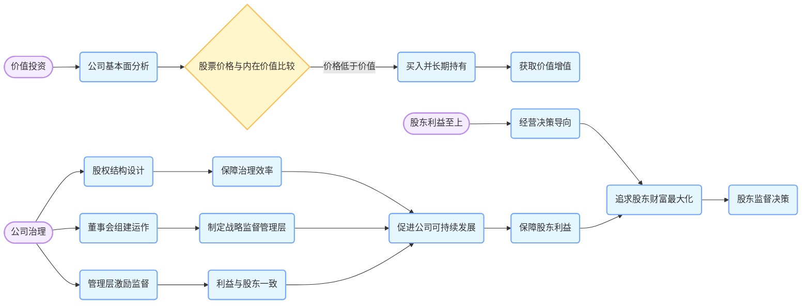

# 价值投资中的公司治理：股东利益至上

> 关键词：价值投资、公司治理、股东利益、利益平衡、长期价值

> 摘要：本文聚焦于价值投资中的公司治理，强调股东利益至上这一核心原则。首先介绍了研究的背景、目的、预期读者、文档结构和相关术语。接着阐述了公司治理、价值投资、股东利益等核心概念及其联系，并给出了相应的示意图和流程图。深入分析了核心算法原理，用 Python 代码模拟了股东利益最大化的相关计算。通过数学模型和公式进一步阐释了股东利益的量化和影响因素。在项目实战部分，搭建开发环境，给出源代码实现并进行详细解读。探讨了公司治理中股东利益至上原则在不同场景下的实际应用，推荐了学习资源、开发工具框架和相关论文著作。最后总结了未来发展趋势与挑战，解答常见问题，并提供扩展阅读和参考资料，旨在为价值投资和公司治理领域的研究者和实践者提供全面且深入的知识体系。

## 1. 背景介绍 
### 1.1 目的和范围
在当今复杂多变的金融市场环境下，价值投资作为一种长期且稳健的投资策略受到了广泛关注。而公司治理作为保障企业有效运作和可持续发展的关键因素，与价值投资紧密相连。本研究的目的在于深入探讨在价值投资理念下，公司治理中“股东利益至上”原则的内涵、实现方式及其重要性。研究范围涵盖了公司治理的各个层面，包括股权结构、董事会决策、管理层激励等方面，以及这些因素如何影响股东利益和价值投资的回报。

### 1.2 预期读者
本文预期读者包括金融投资领域的专业人士，如基金经理、分析师、投资顾问等，他们可以从本文中获取关于公司治理对价值投资影响的深入见解，为投资决策提供参考。同时，企业管理人员和公司治理专家也能从中了解股东利益至上原则在实际运营中的应用和挑战，优化公司治理结构。此外，对金融投资和公司治理感兴趣的学者和学生也可以将本文作为学习和研究的参考资料。

### 1.3 文档结构概述
本文共分为十个部分。第一部分为背景介绍，阐述了研究的目的、预期读者和文档结构。第二部分介绍核心概念与联系，明确公司治理、价值投资和股东利益等关键概念，并展示它们之间的关系。第三部分讲解核心算法原理和具体操作步骤，通过 Python 代码详细阐述相关计算过程。第四部分给出数学模型和公式，并进行详细讲解和举例说明。第五部分进行项目实战，包括开发环境搭建、源代码实现和代码解读。第六部分探讨实际应用场景，分析股东利益至上原则在不同情况下的应用。第七部分推荐学习资源、开发工具框架和相关论文著作。第八部分总结未来发展趋势与挑战。第九部分为附录，解答常见问题。第十部分提供扩展阅读和参考资料。

### 1.4 术语表
#### 1.4.1 核心术语定义
- **价值投资**：一种投资策略，通过对企业基本面的分析，寻找被低估的股票，以长期持有获取企业成长带来的价值增值。
- **公司治理**：指通过一套包括正式或非正式的、内部或外部的制度或机制来协调公司与所有利益相关者之间的利益关系，以保证公司决策的科学性，从而最终维护公司各方面的利益。
- **股东利益**：股东在公司中所享有的经济利益，包括股息分配、资本增值等。

#### 1.4.2 相关概念解释
- **股权结构**：指公司总股本中，不同性质的股份所占的比例及其相互关系。合理的股权结构有助于提高公司治理效率，保障股东利益。
- **董事会**：由股东大会选举产生的公司决策机构，负责制定公司战略、监督管理层等重要职责，对股东利益的保护起着关键作用。
- **管理层激励**：通过设计合理的薪酬体系和激励机制，使管理层的利益与股东利益相一致，促进管理层为实现股东利益最大化而努力工作。

#### 1.4.3 缩略词列表
- **ROE**：Return on Equity，净资产收益率，反映股东权益的收益水平。
- **EPS**：Earnings Per Share，每股收益，是衡量公司盈利能力的重要指标。

## 2. 核心概念与联系 

### 核心概念原理
#### 价值投资原理
价值投资的核心在于寻找被市场低估的股票，通过深入研究公司的基本面，如财务状况、行业地位、竞争优势等，评估公司的内在价值。当股票价格低于其内在价值时，投资者认为存在投资机会，买入股票并长期持有，等待市场发现公司的价值，从而实现资产的增值。价值投资者关注的是公司的长期发展潜力和盈利能力，而非短期的市场波动。

#### 公司治理原理
公司治理是一套协调公司各利益相关者关系的制度和机制。其目标是确保公司决策的科学性和公正性，提高公司的运营效率，保护股东和其他利益相关者的权益。公司治理涉及多个层面，包括股权结构设计、董事会的组建和运作、管理层的激励和监督等。合理的公司治理结构能够有效地防范内部人控制、利益输送等问题，促进公司的可持续发展。

#### 股东利益至上原理
股东利益至上是公司治理的一项重要原则。在公司的经营决策中，应以股东的利益为出发点和落脚点，追求股东财富的最大化。这意味着公司管理层应努力提高公司的盈利能力，增加股息分配，提升股票价格，为股东创造最大的回报。同时，股东通过股东大会等机制对公司的重大决策进行监督和表决，确保自身利益得到保障。

### 架构的文本示意图
```plaintext
价值投资
    |
    |----基于公司基本面分析
    |
    |----寻找被低估股票
    |
    |----长期持有获取价值增值
    |
公司治理
    |
    |----股权结构
    |       |
    |       |----合理设计保障治理效率
    |
    |----董事会
    |       |
    |       |----制定战略监督管理层
    |
    |----管理层激励
    |       |
    |       |----使利益与股东一致
    |
股东利益至上
    |
    |----经营决策以股东利益为导向
    |
    |----追求股东财富最大化
    |
    |----股东监督决策保障自身利益
```

### Mermaid 流程图


## 3. 核心算法原理 & 具体操作步骤 

### 核心算法原理
在价值投资和公司治理中，我们可以通过一些指标来评估股东利益和公司的价值。其中，净资产收益率（ROE）和每股收益（EPS）是两个重要的指标。ROE 反映了股东权益的收益水平，计算公式为：

$$ROE = \frac{净利润}{净资产} \times 100\%$$

EPS 则衡量了公司每股股票的盈利能力，计算公式为：

$$EPS = \frac{净利润}{发行在外普通股股数}$$

我们的目标是通过优化公司的经营决策，提高 ROE 和 EPS，从而实现股东利益的最大化。

### 具体操作步骤及 Python 代码实现
```python
# 步骤 1: 定义计算 ROE 和 EPS 的函数
def calculate_roe(net_income, net_assets):
    """
    计算净资产收益率 (ROE)
    :param net_income: 净利润
    :param net_assets: 净资产
    :return: ROE
    """
    return (net_income / net_assets) * 100

def calculate_eps(net_income, shares_outstanding):
    """
    计算每股收益 (EPS)
    :param net_income: 净利润
    :param shares_outstanding: 发行在外普通股股数
    :return: EPS
    """
    return net_income / shares_outstanding

# 步骤 2: 模拟公司的财务数据
net_income = 1000000  # 净利润为 100 万元
net_assets = 5000000  # 净资产为 500 万元
shares_outstanding = 200000  # 发行在外普通股股数为 20 万股

# 步骤 3: 计算 ROE 和 EPS
roe = calculate_roe(net_income, net_assets)
eps = calculate_eps(net_income, shares_outstanding)

# 步骤 4: 输出结果
print(f"净资产收益率 (ROE): {roe:.2f}%")
print(f"每股收益 (EPS): {eps:.2f} 元")
```

### 代码解释
上述代码首先定义了两个函数 `calculate_roe` 和 `calculate_eps`，分别用于计算 ROE 和 EPS。然后，模拟了公司的财务数据，包括净利润、净资产和发行在外普通股股数。接着，调用这两个函数计算 ROE 和 EPS，并将结果输出。通过这种方式，我们可以直观地了解公司的盈利能力和股东权益的收益水平。

## 4. 数学模型和公式 & 详细讲解 & 举例说明 

### 数学模型和公式
#### 净资产收益率 (ROE)
$$ROE = \frac{净利润}{净资产} \times 100\%$$

ROE 是衡量公司盈利能力和股东权益回报的重要指标。它反映了公司运用自有资本的效率，ROE 越高，说明公司为股东创造的价值越多。

#### 每股收益 (EPS)
$$EPS = \frac{净利润}{发行在外普通股股数}$$

EPS 表示每股股票所享有的公司净利润。EPS 越高，说明公司的盈利能力越强，股东从每股股票中获得的收益也越高。

#### 股东财富最大化模型
假设公司的股票价格为 $P$，发行在外普通股股数为 $N$，则股东财富 $W$ 可以表示为：

$$W = P \times N$$

公司管理层的目标是通过提高公司的盈利能力和市场竞争力，提升股票价格 $P$，从而实现股东财富 $W$ 的最大化。

### 详细讲解
#### ROE 的影响因素
ROE 受到多个因素的影响，包括净利润、净资产和资产周转率等。净利润的增加会直接提高 ROE，而净资产的增加则会降低 ROE。资产周转率反映了公司资产的运营效率，资产周转率越高，说明公司能够更有效地利用资产创造利润，从而提高 ROE。

#### EPS 的影响因素
EPS 主要受到净利润和发行在外普通股股数的影响。净利润的增加会提高 EPS，而发行在外普通股股数的增加则会降低 EPS。公司可以通过提高盈利能力、减少股本扩张等方式来提高 EPS。

#### 股东财富最大化的实现途径
要实现股东财富最大化，公司需要从多个方面入手。首先，要提高公司的盈利能力，通过优化产品结构、降低成本、拓展市场等方式增加净利润。其次，要合理管理资本结构，控制净资产的增长速度，提高 ROE。此外，公司还需要注重市场形象和品牌建设，提升投资者对公司的信心，从而推动股票价格的上涨。

### 举例说明
假设公司 A 的净利润为 200 万元，净资产为 1000 万元，发行在外普通股股数为 100 万股。则：

- ROE = $\frac{200}{1000} \times 100\% = 20\%$
- EPS = $\frac{200}{100} = 2$ 元

如果公司通过优化经营管理，使净利润增加到 300 万元，净资产不变，发行在外普通股股数也不变。则：

- ROE = $\frac{300}{1000} \times 100\% = 30\%$
- EPS = $\frac{300}{100} = 3$ 元

可以看出，随着净利润的增加，ROE 和 EPS 都得到了显著提高，公司为股东创造的价值也相应增加。

## 5. 项目实战：代码实际案例和详细解释说明 

### 5.1  开发环境搭建
#### 操作系统
可以选择 Windows、Linux 或 macOS 等主流操作系统。这里以 Windows 10 为例进行说明。

#### Python 安装
从 Python 官方网站（https://www.python.org/downloads/）下载 Python 3.x 版本的安装包，按照安装向导进行安装。安装过程中注意勾选“Add Python to PATH”选项，以便在命令行中可以直接使用 Python 命令。

#### 开发工具
推荐使用 PyCharm 作为开发工具。可以从 JetBrains 官方网站（https://www.jetbrains.com/pycharm/download/）下载 PyCharm Community 版本，该版本是免费的，适合初学者使用。安装完成后，打开 PyCharm，创建一个新的 Python 项目。

### 5.2  源代码详细实现和代码解读
```python
# 导入必要的库
import pandas as pd

# 步骤 1: 定义公司财务数据类
class CompanyFinancialData:
    def __init__(self, net_income, net_assets, shares_outstanding):
        """
        初始化公司财务数据
        :param net_income: 净利润
        :param net_assets: 净资产
        :param shares_outstanding: 发行在外普通股股数
        """
        self.net_income = net_income
        self.net_assets = net_assets
        self.shares_outstanding = shares_outstanding

    def calculate_roe(self):
        """
        计算净资产收益率 (ROE)
        :return: ROE
        """
        return (self.net_income / self.net_assets) * 100

    def calculate_eps(self):
        """
        计算每股收益 (EPS)
        :return: EPS
        """
        return self.net_income / self.shares_outstanding

# 步骤 2: 模拟公司财务数据
company_data = CompanyFinancialData(net_income=1500000, net_assets=6000000, shares_outstanding=250000)

# 步骤 3: 计算 ROE 和 EPS
roe = company_data.calculate_roe()
eps = company_data.calculate_eps()

# 步骤 4: 创建 DataFrame 存储结果
result_df = pd.DataFrame({
    '指标': ['净资产收益率 (ROE)', '每股收益 (EPS)'],
    '数值': [f'{roe:.2f}%', f'{eps:.2f} 元']
})

# 步骤 5: 输出结果
print(result_df)
```

### 代码解读与分析
#### 代码功能概述
上述代码实现了一个简单的公司财务数据分析程序，通过定义一个 `CompanyFinancialData` 类来存储公司的财务数据，并提供了计算 ROE 和 EPS 的方法。然后，模拟了公司的财务数据，计算 ROE 和 EPS，并将结果存储在一个 Pandas DataFrame 中进行输出。

#### 代码详细解读
- **导入必要的库**：导入 `pandas` 库，用于数据处理和结果展示。
- **定义 `CompanyFinancialData` 类**：该类包含三个属性：`net_income`（净利润）、`net_assets`（净资产）和 `shares_outstanding`（发行在外普通股股数）。同时，提供了 `calculate_roe` 和 `calculate_eps` 方法，分别用于计算 ROE 和 EPS。
- **模拟公司财务数据**：创建一个 `CompanyFinancialData` 类的实例，传入模拟的财务数据。
- **计算 ROE 和 EPS**：调用 `calculate_roe` 和 `calculate_eps` 方法计算 ROE 和 EPS。
- **创建 DataFrame 存储结果**：使用 `pandas` 的 `DataFrame` 类将计算结果存储在一个表格中，方便查看。
- **输出结果**：打印存储结果的 DataFrame。

#### 代码分析
通过将公司财务数据封装在一个类中，代码的可维护性和可扩展性得到了提高。同时，使用 `pandas` 库进行数据处理和展示，使结果更加直观清晰。在实际应用中，可以根据需要扩展 `CompanyFinancialData` 类，添加更多的财务指标计算方法，或者从外部数据源读取真实的财务数据进行分析。

## 6. 实际应用场景 
### 投资决策
在价值投资中，投资者可以通过分析公司的 ROE 和 EPS 等指标，评估公司的盈利能力和股东权益回报，从而做出投资决策。当公司的 ROE 和 EPS 持续增长，且高于同行业平均水平时，说明公司具有较强的竞争力和盈利能力，投资者可以考虑买入该公司的股票。例如，巴菲特在选择投资标的时，非常注重公司的 ROE，他倾向于投资那些 ROE 长期保持在 20% 以上的公司。

### 公司治理评估
公司治理机构和监管部门可以通过监测公司的 ROE 和 EPS 等指标，评估公司的治理效果。如果公司的 ROE 和 EPS 出现异常波动或持续下降，可能意味着公司存在治理问题，如管理层决策失误、内部利益输送等。此时，公司治理机构可以采取相应的措施，如调整管理层、优化股权结构等，以提高公司的治理水平和股东利益。

### 管理层激励
公司可以将 ROE 和 EPS 等指标纳入管理层的绩效考核体系，作为管理层薪酬和奖励的重要依据。当管理层通过提高公司的盈利能力和运营效率，使 ROE 和 EPS 得到提升时，他们可以获得相应的奖励。这样可以激励管理层为实现股东利益最大化而努力工作，同时也有助于解决管理层与股东之间的利益冲突问题。

### 企业战略规划
企业在制定战略规划时，可以以股东利益至上为原则，将提高 ROE 和 EPS 作为战略目标之一。通过分析市场需求、竞争态势和自身优势，制定合理的产品战略、市场战略和成本控制战略，以实现公司的可持续发展和股东财富的最大化。例如，企业可以通过技术创新、产品升级等方式提高产品附加值，从而增加净利润，提高 ROE 和 EPS。

## 7. 工具和资源推荐
### 7.1 学习资源推荐
#### 7.1.1 书籍推荐
- 《聪明的投资者》（The Intelligent Investor）：作者本杰明·格雷厄姆（Benjamin Graham）是价值投资理论的奠基人，这本书被誉为价值投资的圣经，详细介绍了价值投资的理念、方法和策略。
- 《巴菲特致股东的信》（Letters to Shareholders of Berkshire Hathaway）：由沃伦·巴菲特（Warren Buffett）撰写，书中包含了巴菲特多年来致股东的信件，阐述了他的投资哲学、公司治理理念和对经济形势的看法。
- 《公司治理》（Corporate Governance）：作者罗伯特·蒙克斯（Robert Monks）和内尔·米诺（Nell Minow）对公司治理的理论和实践进行了全面深入的探讨，是公司治理领域的经典著作。

#### 7.1.2 在线课程
- Coursera 上的“价值投资基础”（Fundamentals of Value Investing）课程：由哥伦比亚大学教授讲授，系统介绍了价值投资的基本原理、分析方法和实践案例。
- edX 上的“公司治理与董事会领导力”（Corporate Governance and Board Leadership）课程：该课程涵盖了公司治理的各个方面，包括股权结构、董事会运作、管理层激励等，帮助学员深入了解公司治理的理论和实践。

#### 7.1.3 技术博客和网站
- 雪球网（https://xueqiu.com/）：国内知名的投资交流社区，提供股票行情、公司财报、投资分析等丰富的信息，同时还有众多投资者分享自己的投资经验和见解。
- Seeking Alpha（https://seekingalpha.com/）：国外著名的投资研究网站，提供全球范围内的股票分析、财经新闻和投资策略等内容，是投资者获取信息和灵感的重要来源。

### 7.2 开发工具框架推荐
#### 7.2.1 IDE和编辑器
- PyCharm：功能强大的 Python 集成开发环境，提供代码编辑、调试、版本控制等丰富的功能，适合 Python 开发者使用。
- Visual Studio Code：轻量级的代码编辑器，支持多种编程语言，具有丰富的插件生态系统，可以通过安装 Python 相关插件来进行 Python 开发。

#### 7.2.2 调试和性能分析工具
- Py-Spy：一个用于分析 Python 程序性能的工具，可以实时监测 Python 程序的 CPU 使用率、函数调用时间等信息，帮助开发者找出性能瓶颈。
- PDB：Python 自带的调试器，可以在代码中设置断点，逐步执行代码，查看变量的值和程序的执行流程，方便调试程序。

#### 7.2.3 相关框架和库
- Pandas：用于数据处理和分析的 Python 库，提供了丰富的数据结构和数据操作方法，如 DataFrame、Series 等，方便进行财务数据的处理和分析。
- NumPy：Python 的数值计算库，提供了高效的多维数组对象和各种数学函数，可用于财务数据的计算和分析。

### 7.3 相关论文著作推荐
#### 7.3.1 经典论文
- Jensen, M. C., & Meckling, W. H. (1976). Theory of the firm: managerial behavior, agency costs and ownership structure. Journal of Financial Economics, 3(4), 305-360. 这篇论文提出了代理理论，阐述了管理层与股东之间的利益冲突问题，以及如何通过合理的公司治理结构来解决这些问题。
- Fama, E. F., & French, K. R. (1992). The cross-section of expected stock returns. The Journal of Finance, 47(2), 427-465. 该论文提出了 Fama-French 三因子模型，用于解释股票回报率的差异，对价值投资理论的发展产生了重要影响。

#### 7.3.2 最新研究成果
- 近年来，关于公司治理和价值投资的研究不断涌现。可以通过学术数据库，如 Web of Science、EBSCOhost 等，搜索相关的最新研究论文，了解该领域的前沿动态和研究成果。

#### 7.3.3 应用案例分析
- 一些知名的商业杂志和财经媒体，如《哈佛商业评论》（Harvard Business Review）、《财经》等，经常会发表一些关于公司治理和价值投资的应用案例分析文章，通过实际案例深入剖析公司治理和价值投资的实践经验和教训。

## 8. 总结：未来发展趋势与挑战
### 未来发展趋势
#### 数字化转型推动公司治理创新
随着信息技术的快速发展，公司治理将迎来数字化转型的浪潮。通过利用大数据、人工智能、区块链等技术，公司可以实现更加高效、透明的治理。例如，区块链技术可以用于股权登记和交易，提高股权管理的安全性和透明度；人工智能可以用于财务分析和风险预警，帮助管理层做出更加科学的决策。

#### 社会责任与股东利益的融合
未来，公司在追求股东利益最大化的同时，将更加注重社会责任的履行。消费者和投资者对企业的社会形象和环保表现越来越关注，企业需要在经济效益和社会效益之间找到平衡。一些研究表明，履行社会责任的企业往往能够获得更好的长期发展和股东回报。

#### 全球公司治理标准的趋同
随着经济全球化的深入发展，各国之间的经济联系日益紧密。为了促进跨国投资和企业的国际化发展，全球公司治理标准将逐渐趋同。国际组织和各国监管机构将加强合作，制定更加统一的公司治理准则和规范，提高全球公司治理的水平。

### 挑战
#### 利益相关者利益平衡难题
在公司治理中，股东利益至上并不意味着忽视其他利益相关者的利益。员工、供应商、客户、社区等利益相关者的利益也需要得到关注和保护。如何在满足股东利益的同时，平衡其他利益相关者的利益，是公司治理面临的一大挑战。

#### 新兴技术带来的治理风险
虽然数字化转型为公司治理带来了机遇，但也带来了新的风险。例如，大数据和人工智能技术可能会导致数据隐私泄露和算法偏见问题；区块链技术的应用也面临着监管和安全等方面的挑战。公司需要加强对新兴技术的管理和风险防范，确保公司治理的安全和稳定。

#### 国际竞争加剧对公司治理的要求提高
在全球化的背景下，企业面临着更加激烈的国际竞争。为了提高企业的竞争力，公司需要不断优化公司治理结构，提高治理效率。同时，不同国家和地区的法律、文化和市场环境存在差异，企业在跨国经营过程中需要适应不同的公司治理要求，这也增加了公司治理的难度。

## 9. 附录：常见问题与解答
### 问题 1：股东利益至上是否意味着可以忽视其他利益相关者的利益？
解答：股东利益至上并不意味着可以忽视其他利益相关者的利益。在现代公司治理中，各利益相关者的利益是相互关联的。如果忽视员工、供应商、客户等利益相关者的利益，可能会导致员工积极性下降、供应链不稳定、客户流失等问题，从而影响公司的长期发展和股东利益。因此，公司应该在追求股东利益最大化的同时，平衡好各利益相关者的利益关系。

### 问题 2：如何衡量股东利益是否得到了保障？
解答：可以通过一些财务指标来衡量股东利益是否得到了保障，如 ROE、EPS、股息率等。ROE 反映了股东权益的收益水平，EPS 衡量了每股股票的盈利能力，股息率则体现了股东从股息分配中获得的收益。此外，还可以观察公司的股票价格走势、市值变化等情况，综合评估股东利益的保障程度。

### 问题 3：在公司治理中，如何确保管理层的利益与股东利益一致？
解答：可以通过设计合理的管理层激励机制来确保管理层的利益与股东利益一致。例如，采用股票期权、限制性股票等股权激励方式，使管理层的薪酬与公司的业绩和股票价格挂钩。此外，还可以加强对管理层的监督和约束，建立健全的绩效考核体系和问责机制，促使管理层为实现股东利益最大化而努力工作。

### 问题 4：数字化转型对公司治理会产生哪些具体影响？
解答：数字化转型对公司治理会产生多方面的影响。在决策方面，大数据和人工智能技术可以提供更加准确和及时的信息支持，帮助管理层做出更加科学的决策。在监督方面，数字化技术可以实现对公司运营的实时监控，提高监督的效率和透明度。在沟通方面，数字化平台可以加强股东、管理层和其他利益相关者之间的沟通和互动，促进信息的共享和交流。

## 10. 扩展阅读 & 参考资料
### 扩展阅读
- 《金融炼金术》（The Alchemy of Finance）：作者乔治·索罗斯（George Soros）阐述了他的反身性理论，对金融市场和投资决策有独特的见解，有助于深入理解价值投资的市场环境。
- 《穷查理宝典》（Poor Charlie's Almanack）：收录了查理·芒格（Charlie Munger）的演讲和文章，包含了他的投资智慧、思维方式和人生哲学，对投资者和企业管理者有很大的启发。

### 参考资料
- 相关公司的年报和财务报表，可从证券交易所网站、公司官方网站等渠道获取。
- 学术期刊，如《金融研究》、《管理世界》等，发表了大量关于公司治理和价值投资的研究论文。
- 行业报告，如券商研究报告、咨询公司报告等，提供了行业动态、市场趋势和企业分析等方面的信息。

作者：AI天才研究院/AI Genius Institute & 禅与计算机程序设计艺术 /Zen And The Art of Computer Programming