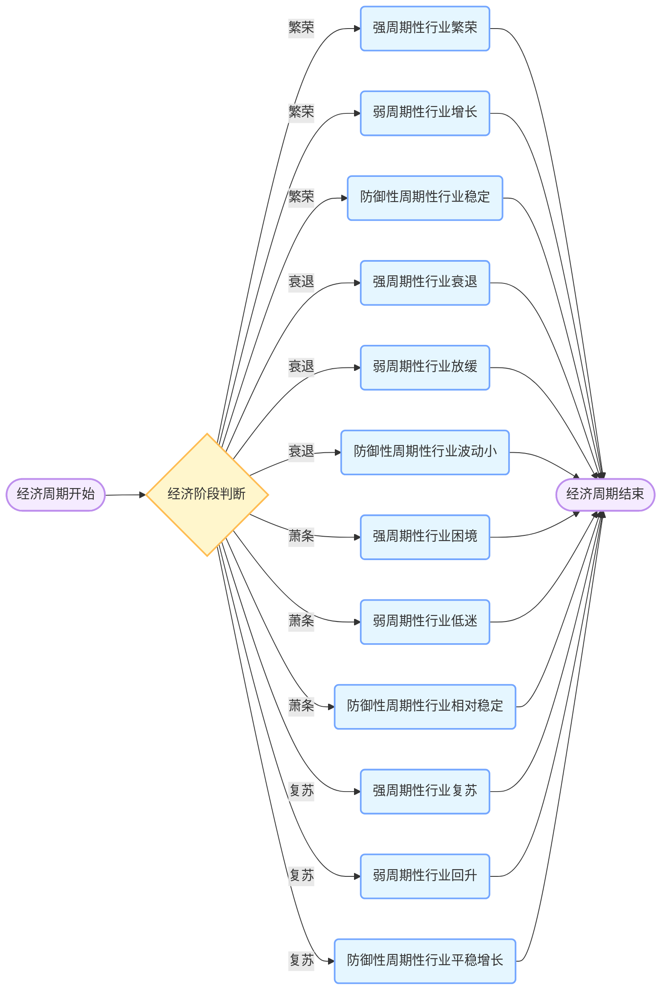

# 价值投资中的周期性行业分析

> 关键词：价值投资、周期性行业、行业分析、经济周期、投资策略

> 摘要：本文聚焦于价值投资领域中周期性行业的分析。通过深入探讨周期性行业的核心概念、运行原理、相关算法与数学模型，结合实际案例进行详细剖析，阐述了周期性行业在不同经济周期中的表现及特点。旨在帮助投资者更好地理解周期性行业，掌握分析方法和投资策略，以在价值投资中做出更明智的决策。同时，介绍了相关的学习资源、开发工具和研究成果，对周期性行业投资的未来发展趋势与挑战进行了总结，并提供常见问题解答和扩展阅读参考资料。

## 1. 背景介绍 
### 1.1 目的和范围
价值投资是一种通过深入分析公司基本面，寻找被低估的股票并长期持有的投资策略。而周期性行业在经济周期的不同阶段表现出显著的波动特征，对其进行分析对于价值投资者至关重要。本文的目的在于系统地介绍价值投资中周期性行业的分析方法和要点，涵盖周期性行业的定义、特点、影响因素、分析工具和投资策略等方面。通过对周期性行业的全面研究，帮助投资者识别周期性行业的投资机会，降低投资风险，提高投资回报率。

### 1.2 预期读者
本文的预期读者主要包括对价值投资感兴趣的个人投资者、金融从业者、投资分析师以及相关领域的研究人员。无论是初涉投资领域的新手，还是具有一定投资经验的专业人士，都可以从本文中获取关于周期性行业分析的有价值信息，提升对周期性行业的理解和投资能力。

### 1.3 文档结构概述
本文将按照以下结构展开：首先介绍周期性行业的核心概念和联系，包括其定义、分类、与经济周期的关系等，并通过示意图和流程图进行直观展示；接着阐述核心算法原理和具体操作步骤，使用Python代码进行详细说明；然后介绍相关的数学模型和公式，并结合实例进行讲解；之后通过项目实战，展示代码实际案例并进行详细解释；再探讨周期性行业的实际应用场景；推荐相关的学习资源、开发工具和研究成果；最后总结周期性行业投资的未来发展趋势与挑战，提供常见问题解答和扩展阅读参考资料。

### 1.4 术语表
#### 1.4.1 核心术语定义
- **价值投资**：一种基于公司内在价值进行投资的策略，投资者通过分析公司的财务状况、经营业绩、竞争优势等因素，寻找被市场低估的股票并长期持有，以获取投资回报。
- **周期性行业**：指那些经营业绩随着经济周期的盛衰而涨落的行业。在经济繁荣时期，这些行业的业务量和利润通常会大幅增长；而在经济衰退时期，业务量和利润则会显著下降。
- **经济周期**：指经济活动沿着经济发展的总体趋势所经历的有规律的扩张和收缩。一般分为繁荣、衰退、萧条和复苏四个阶段。
- **行业景气度**：反映行业发展状况和前景的综合指标，通常通过行业的生产、销售、利润等数据来衡量。

#### 1.4.2 相关概念解释
- **行业轮动**：指在经济周期的不同阶段，不同行业的表现会出现差异，投资者可以通过调整投资组合，将资金从表现不佳的行业转移到表现较好的行业，以获取更高的投资回报。
- **领先指标**：指那些在经济活动发生变化之前就会出现变动的指标，如消费者信心指数、采购经理人指数等。这些指标可以帮助投资者提前预测经济周期的变化，从而调整投资策略。
- **滞后指标**：指那些在经济活动发生变化之后才会出现变动的指标，如失业率、通货膨胀率等。这些指标可以帮助投资者验证经济周期的变化情况。

#### 1.4.3 缩略词列表
- **GDP**：国内生产总值（Gross Domestic Product），是衡量一个国家或地区经济活动总量的指标。
- **PMI**：采购经理人指数（Purchasing Managers' Index），是反映制造业和服务业活动状况的领先指标。
- **CPI**：消费者物价指数（Consumer Price Index），是衡量通货膨胀水平的指标。

## 2. 核心概念与联系 

### 2.1 周期性行业的定义和分类
周期性行业是指其经营业绩与经济周期密切相关的行业。根据其与经济周期的关联程度和表现特征，可将周期性行业分为以下几类：
- **强周期性行业**：如钢铁、有色金属、化工、汽车等行业。这些行业的产品需求与经济增长密切相关，在经济繁荣时期，基础设施建设、制造业生产等活动旺盛，对这些行业的产品需求大幅增加，企业的营业收入和利润也随之大幅增长；而在经济衰退时期，需求急剧下降，企业面临产能过剩、价格下跌等问题，业绩大幅下滑。
- **弱周期性行业**：如房地产、建材、家电等行业。这些行业的需求也受到经济周期的影响，但相对较弱。房地产市场的需求除了受经济增长影响外，还受到人口因素、政策调控等因素的影响；建材和家电行业的需求与房地产市场的发展密切相关，但也有一定的刚性需求支撑。
- **防御性周期性行业**：如公用事业、食品饮料、医药等行业。这些行业的产品需求相对稳定，受经济周期的影响较小，具有一定的防御性。即使在经济衰退时期，人们对这些行业的产品需求也不会大幅减少，企业的业绩相对稳定。

### 2.2 周期性行业与经济周期的关系
周期性行业的运行与经济周期密切相关，呈现出明显的周期性波动特征。在经济周期的不同阶段，周期性行业的表现如下：
- **繁荣阶段**：经济增长强劲，市场需求旺盛，企业的生产和销售规模扩大，产品价格上涨，利润大幅增加。强周期性行业的表现尤为突出，如钢铁、有色金属等行业的产能利用率提高，产品供不应求，企业的盈利能力大幅提升。
- **衰退阶段**：经济增长放缓，市场需求下降，企业的生产和销售规模缩小，产品价格下跌，利润减少。强周期性行业受到的冲击最大，如化工、汽车等行业的产能过剩问题凸显，企业面临巨大的经营压力。
- **萧条阶段**：经济陷入低迷，市场需求极度萎缩，企业的生产和销售活动几乎停滞，产品价格持续下跌，利润大幅亏损。大部分周期性行业都处于困境之中，企业纷纷采取减产、裁员等措施来应对危机。
- **复苏阶段**：经济开始回暖，市场需求逐渐恢复，企业的生产和销售规模逐步扩大，产品价格企稳回升，利润开始增加。周期性行业逐渐走出困境，强周期性行业的复苏迹象更为明显，如钢铁、有色金属等行业的产能利用率逐步提高，企业的盈利能力逐渐恢复。

### 2.3 核心概念原理和架构的文本示意图


该示意图展示了周期性行业与经济周期的关系。经济周期分为繁荣、衰退、萧条和复苏四个阶段，在不同阶段，周期性行业的表现呈现出相应的波动。强周期性行业的波动幅度较大，弱周期性行业的波动幅度相对较小，防御性周期性行业的波动幅度最小。

### 2.4 Mermaid 流程图


该流程图展示了经济周期不同阶段周期性行业的表现。根据经济阶段的判断，分别展示了强周期性行业、弱周期性行业和防御性周期性行业在繁荣、衰退、萧条和复苏阶段的不同状态，最终回到经济周期结束。

## 3. 核心算法原理 & 具体操作步骤 

### 3.1 行业景气度指标计算算法
行业景气度是衡量周期性行业发展状况的重要指标。常用的行业景气度指标包括行业产值增长率、销售收入增长率、利润增长率等。以下是使用Python代码计算行业景气度指标的示例：

```python
import pandas as pd

# 模拟行业数据
data = {
    '年份': [2015, 2016, 2017, 2018, 2019, 2020],
    '产值': [100, 120, 130, 150, 160, 180],
    '销售收入': [90, 110, 120, 140, 150, 170],
    '利润': [10, 15, 20, 25, 30, 35]
}

df = pd.DataFrame(data)

# 计算产值增长率
df['产值增长率'] = df['产值'].pct_change()

# 计算销售收入增长率
df['销售收入增长率'] = df['销售收入'].pct_change()

# 计算利润增长率
df['利润增长率'] = df['利润'].pct_change()

print(df)
```

### 3.2 算法原理讲解
上述代码的核心算法原理是使用`pct_change()`函数计算相邻年份数据的百分比变化，从而得到各指标的增长率。具体步骤如下：
1. 导入`pandas`库，用于数据处理和分析。
2. 模拟行业数据，创建一个包含年份、产值、销售收入和利润的DataFrame。
3. 使用`pct_change()`函数分别计算产值、销售收入和利润的增长率，并将结果添加到DataFrame中。
4. 打印计算结果。

### 3.3 具体操作步骤
1. 准备行业数据：收集周期性行业的相关数据，如产值、销售收入、利润等，并整理成表格形式。
2. 导入数据：将整理好的数据导入到Python中，可以使用`pandas`库的`read_csv()`函数读取CSV文件或`read_excel()`函数读取Excel文件。
3. 计算增长率：使用`pct_change()`函数计算各指标的增长率，并将结果添加到DataFrame中。
4. 分析结果：根据计算得到的增长率，分析行业的景气度变化趋势。如果增长率为正且呈上升趋势，说明行业处于景气状态；如果增长率为负或呈下降趋势，说明行业处于不景气状态。

## 4. 数学模型和公式 & 详细讲解 & 举例说明 

### 4.1 行业景气度指数模型
行业景气度指数是综合考虑多个行业指标计算得到的一个数值，用于反映行业的整体发展状况。常用的行业景气度指数计算方法是加权平均法，公式如下：

$$I = \sum_{i=1}^{n} w_i \times x_i$$

其中，$I$ 表示行业景气度指数，$w_i$ 表示第 $i$ 个指标的权重，$x_i$ 表示第 $i$ 个指标的数值，$n$ 表示指标的个数。

### 4.2 详细讲解
该公式的核心思想是将各个行业指标的数值按照其重要程度进行加权求和，得到一个综合的行业景气度指数。权重的确定需要根据各指标对行业发展的影响程度进行主观判断或通过统计分析方法进行确定。

### 4.3 举例说明
假设某周期性行业的景气度由产值增长率、销售收入增长率和利润增长率三个指标决定，各指标的权重分别为 0.3、0.3 和 0.4。已知该行业在某一年的产值增长率为 10%，销售收入增长率为 8%，利润增长率为 12%，则该行业的景气度指数为：

$$I = 0.3 \times 0.1 + 0.3 \times 0.08 + 0.4 \times 0.12 = 0.102$$

即该行业的景气度指数为 10.2%，说明该行业处于较为景气的状态。

## 5. 项目实战：代码实际案例和详细解释说明 

### 5.1 开发环境搭建
在进行周期性行业分析的项目实战之前，需要搭建相应的开发环境。以下是具体的搭建步骤：
1. 安装Python：从Python官方网站（https://www.python.org/downloads/）下载并安装Python 3.x版本。
2. 安装必要的库：使用`pip`命令安装`pandas`、`numpy`、`matplotlib`等必要的库。
```sh
pip install pandas numpy matplotlib
```
3. 选择开发工具：可以选择使用Jupyter Notebook、PyCharm等开发工具进行代码编写和调试。

### 5.2 源代码详细实现和代码解读
以下是一个完整的周期性行业分析项目实战代码示例：

```python
import pandas as pd
import numpy as np
import matplotlib.pyplot as plt

# 读取行业数据
data = pd.read_csv('industry_data.csv')

# 计算产值增长率
data['产值增长率'] = data['产值'].pct_change()

# 计算销售收入增长率
data['销售收入增长率'] = data['销售收入'].pct_change()

# 计算利润增长率
data['利润增长率'] = data['利润'].pct_change()

# 定义各指标的权重
weights = {
    '产值增长率': 0.3,
    '销售收入增长率': 0.3,
    '利润增长率': 0.4
}

# 计算行业景气度指数
data['行业景气度指数'] = (data['产值增长率'] * weights['产值增长率'] +
                        data['销售收入增长率'] * weights['销售收入增长率'] +
                        data['利润增长率'] * weights['利润增长率'])

# 绘制行业景气度指数折线图
plt.figure(figsize=(10, 6))
plt.plot(data['年份'], data['行业景气度指数'], marker='o')
plt.title('行业景气度指数变化趋势')
plt.xlabel('年份')
plt.ylabel('行业景气度指数')
plt.grid(True)
plt.show()
```

### 代码解读
1. **导入必要的库**：导入`pandas`、`numpy`和`matplotlib`库，分别用于数据处理、数值计算和数据可视化。
2. **读取行业数据**：使用`pandas`的`read_csv()`函数读取存储行业数据的CSV文件。
3. **计算各指标的增长率**：使用`pct_change()`函数计算产值、销售收入和利润的增长率，并将结果添加到DataFrame中。
4. **定义各指标的权重**：根据各指标对行业发展的影响程度，定义各指标的权重。
5. **计算行业景气度指数**：根据加权平均法的公式，计算行业景气度指数，并将结果添加到DataFrame中。
6. **绘制行业景气度指数折线图**：使用`matplotlib`库绘制行业景气度指数的折线图，直观展示行业景气度的变化趋势。

### 5.3 代码解读与分析
通过上述代码，我们可以完成周期性行业的分析任务，得到行业景气度指数并可视化其变化趋势。从代码中可以看出，核心步骤包括数据读取、指标计算、权重定义和指数计算。通过分析行业景气度指数的变化趋势，我们可以判断行业处于经济周期的哪个阶段，从而为投资决策提供参考。

## 6. 实际应用场景 
### 6.1 投资决策
在价值投资中，对周期性行业的分析可以帮助投资者做出更明智的投资决策。投资者可以根据行业景气度指数和经济周期的变化，选择在行业处于低谷时买入相关股票，在行业处于高峰时卖出股票，以获取更高的投资回报。例如，在经济衰退末期，强周期性行业的股价通常会受到严重打压，但此时行业的基本面可能已经开始好转，投资者可以提前布局，等待行业复苏带来的股价上涨。

### 6.2 行业研究
周期性行业分析对于行业研究人员来说也具有重要意义。通过对行业景气度指数、各指标增长率等数据的分析，研究人员可以深入了解行业的发展趋势、竞争格局和影响因素，为行业发展提供决策建议。例如，研究人员可以通过分析行业的产值增长率和利润增长率，判断行业的盈利能力和发展潜力，为企业的战略规划提供参考。

### 6.3 宏观经济分析
周期性行业的表现与宏观经济密切相关，因此对周期性行业的分析也可以为宏观经济分析提供重要参考。政府部门和经济研究机构可以通过监测周期性行业的景气度指数和各指标变化情况，及时了解宏观经济的运行状况，制定相应的宏观经济政策。例如，当周期性行业普遍处于低迷状态时，政府可以采取宽松的货币政策和财政政策，刺激经济增长，促进周期性行业的复苏。

## 7. 工具和资源推荐
### 7.1 学习资源推荐
#### 7.1.1 书籍推荐
- 《聪明的投资者》（The Intelligent Investor）：本杰明·格雷厄姆（Benjamin Graham）著，被誉为价值投资的圣经，详细介绍了价值投资的理念和方法。
- 《周期》（Mastering the Market Cycle）：霍华德·马克斯（Howard Marks）著，深入探讨了经济周期、市场周期和投资周期的规律和特点，对周期性行业投资具有重要的指导意义。
- 《证券分析》（Security Analysis）：本杰明·格雷厄姆和大卫·多德（David Dodd）著，经典的投资分析著作，对公司基本面分析和估值方法进行了系统阐述。

#### 7.1.2 在线课程
- Coursera上的“投资学原理”（Principles of Investing）课程：由哥伦比亚大学教授授课，涵盖了价值投资、资产定价、投资组合管理等方面的知识。
- edX上的“金融市场”（Financial Markets）课程：由耶鲁大学教授授课，介绍了金融市场的基本原理和投资策略。

#### 7.1.3 技术博客和网站
- 雪球（https://xueqiu.com/）：国内知名的投资社区，提供了丰富的股票分析、行业研究和投资策略分享。
- 东方财富网（https://www.eastmoney.com/）：提供全面的金融信息和数据服务，包括股票行情、财经新闻、行业研究报告等。

### 7.2 开发工具框架推荐
#### 7.2.1 IDE和编辑器
- PyCharm：功能强大的Python集成开发环境，提供了代码编辑、调试、版本控制等一系列功能，适合专业的Python开发者。
- Jupyter Notebook：交互式的开发环境，支持代码、文本、图表等多种形式的展示，适合数据探索和分析。

#### 7.2.2 调试和性能分析工具
- pdb：Python自带的调试工具，可以帮助开发者定位代码中的错误和问题。
- cProfile：Python的性能分析工具，可以分析代码的运行时间和函数调用情况，帮助开发者优化代码性能。

#### 7.2.3 相关框架和库
- pandas：强大的数据处理和分析库，提供了丰富的数据结构和函数，方便进行数据清洗、转换和分析。
- numpy：Python的数值计算库，提供了高效的数组操作和数学函数，是许多数据分析和机器学习库的基础。
- matplotlib：Python的绘图库，提供了丰富的绘图功能，可用于数据可视化。

### 7.3 相关论文著作推荐
#### 7.3.1 经典论文
- “The Equity Risk Premium: A Puzzle”（《股票风险溢价之谜》）：由拉杰尼什·梅赫拉（Rajnish Mehra）和爱德华·普雷斯科特（Edward C. Prescott）发表，探讨了股票市场的风险溢价问题，对投资理论和实践产生了深远影响。
- “Efficient Capital Markets: A Review of Theory and Empirical Work”（《有效资本市场：理论与实证研究综述》）：由尤金·法玛（Eugene F. Fama）发表，提出了有效市场假说，是现代金融理论的重要基石。

#### 7.3.2 最新研究成果
- 关注顶级金融学术期刊，如《Journal of Finance》、《Review of Financial Studies》等，这些期刊发表了许多关于价值投资、周期性行业分析等方面的最新研究成果。

#### 7.3.3 应用案例分析
- 一些知名投资机构的研究报告和案例分析，如巴菲特的伯克希尔·哈撒韦公司的年报和致股东信，提供了许多关于价值投资和周期性行业投资的实际案例和经验分享。

## 8. 总结：未来发展趋势与挑战
### 8.1 未来发展趋势
- **数字化转型加速**：随着信息技术的快速发展，周期性行业将加快数字化转型的步伐。通过引入大数据、人工智能、物联网等技术，企业可以实现生产过程的智能化、管理决策的科学化，提高生产效率和竞争力。
- **绿色发展成为主流**：在全球气候变化和环境保护的背景下，周期性行业将更加注重绿色发展。钢铁、化工等行业将加大节能减排、环保治理的力度，推动产业向绿色化、低碳化方向发展。
- **行业整合加剧**：为了应对市场竞争和经济周期的波动，周期性行业将出现更多的并购重组和行业整合。通过整合资源、优化产业结构，企业可以提高市场集中度和抗风险能力。

### 8.2 挑战
- **经济不确定性增加**：全球经济增长面临诸多不确定性因素，如贸易摩擦、地缘政治冲突、疫情反复等，这些因素将对周期性行业的发展带来较大的挑战。经济周期的波动可能更加频繁和剧烈，增加了投资者对周期性行业分析和投资决策的难度。
- **技术创新压力增大**：数字化转型和绿色发展要求周期性行业加快技术创新的步伐。企业需要投入大量的资金和人力进行研发，以跟上技术发展的潮流。同时，技术创新也带来了新的竞争格局，传统企业可能面临新兴企业的挑战。
- **政策监管加强**：为了促进经济的可持续发展和环境保护，政府将加强对周期性行业的政策监管。企业需要遵守更加严格的环保、安全等方面的法规要求，这将增加企业的运营成本和合规风险。

## 9. 附录：常见问题与解答
### 9.1 如何判断一个行业是否为周期性行业？
判断一个行业是否为周期性行业可以从以下几个方面入手：
- **与经济周期的相关性**：观察行业的经营业绩是否随着经济周期的盛衰而涨落。如果行业的业务量和利润在经济繁荣时期大幅增长，在经济衰退时期显著下降，则该行业很可能是周期性行业。
- **需求弹性**：周期性行业的产品需求通常具有较高的弹性，即需求对经济形势的变化较为敏感。例如，钢铁、汽车等行业的产品需求在经济繁荣时期会大幅增加，而在经济衰退时期则会急剧下降。
- **行业特点**：一些行业由于其自身的特点，具有明显的周期性特征。例如，房地产行业受经济周期、政策调控等因素的影响较大，呈现出明显的周期性波动。

### 9.2 周期性行业投资有哪些风险？
周期性行业投资存在以下风险：
- **经济周期风险**：周期性行业的业绩与经济周期密切相关，如果经济周期发生不利变化，行业的经营业绩将受到严重影响，投资者可能面临股价下跌和投资损失的风险。
- **产能过剩风险**：在经济繁荣时期，周期性行业往往会扩大产能以满足市场需求。但如果市场需求增长不及预期，就会出现产能过剩的问题，导致产品价格下跌、企业利润减少。
- **政策风险**：政府的宏观经济政策、产业政策等对周期性行业的发展具有重要影响。如果政策发生不利变化，如提高环保标准、加强行业监管等，可能会增加企业的运营成本，影响企业的盈利能力。

### 9.3 如何降低周期性行业投资的风险？
降低周期性行业投资风险可以采取以下措施：
- **分散投资**：将资金分散投资于不同的周期性行业和非周期性行业，以降低单一行业波动对投资组合的影响。
- **把握投资时机**：通过对经济周期和行业景气度的分析，选择在行业处于低谷时买入相关股票，在行业处于高峰时卖出股票，以获取更高的投资回报。
- **关注企业基本面**：选择具有良好基本面的企业进行投资，如具有较强的竞争力、稳定的盈利能力、合理的财务结构等。

## 10. 扩展阅读 & 参考资料
- 本杰明·格雷厄姆. 《聪明的投资者》. 人民邮电出版社.
- 霍华德·马克斯. 《周期》. 中信出版社.
- 尤金·法玛. “Efficient Capital Markets: A Review of Theory and Empirical Work”. 《Journal of Finance》.
- 雪球网. https://xueqiu.com/
- 东方财富网. https://www.eastmoney.com/

作者：AI天才研究院/AI Genius Institute & 禅与计算机程序设计艺术 /Zen And The Art of Computer Programming