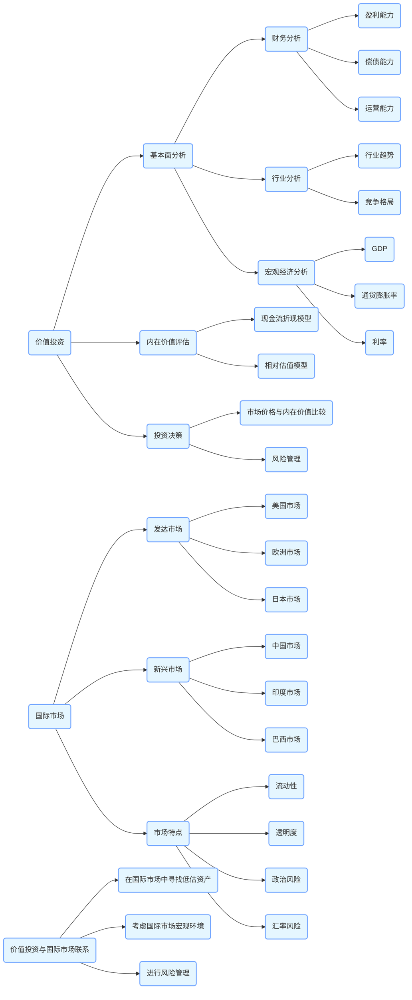

# 价值投资中的国际市场机会

> 关键词：价值投资、国际市场机会、财务分析、宏观经济、行业趋势

> 摘要：本文聚焦于价值投资领域，深入探讨国际市场所蕴含的机会。通过系统介绍价值投资的核心概念、核心算法原理以及相关数学模型，结合实际案例展示在国际市场运用价值投资策略的具体操作。同时分析了价值投资在不同国际市场的实际应用场景，推荐了相关的学习资源、开发工具和论文著作。最后对价值投资在国际市场的未来发展趋势与挑战进行总结，并提供常见问题解答和扩展阅读参考资料，旨在为投资者全面了解和把握国际市场的价值投资机会提供深入且实用的指导。

## 1. 背景介绍 
### 1.1 目的和范围
本文章的主要目的是帮助投资者全面认识价值投资在国际市场中的机会。随着全球经济一体化的发展，国际市场的联系日益紧密，投资者有更多机会将资金配置到不同国家和地区的资产上。然而，国际市场环境复杂多变，存在着不同的政治、经济、文化和法律等因素。本文将聚焦于价值投资理论在国际市场的应用，分析不同国家和地区市场的特点，探讨如何识别具有价值的投资标的，以及在投资过程中需要考虑的各种因素。范围涵盖了全球主要的股票市场、债券市场、大宗商品市场等，同时也会涉及到新兴市场和发达市场的不同投资机会。

### 1.2 预期读者
预期读者包括对价值投资感兴趣的个人投资者、专业投资机构的从业者、金融专业的学生以及研究人员等。对于个人投资者，希望通过本文了解如何在国际市场中运用价值投资策略，实现资产的保值增值；对于专业投资机构从业者，本文可以为他们提供新的投资思路和方法，以及对国际市场的深入分析；金融专业的学生和研究人员可以将本文作为学习和研究价值投资在国际市场应用的参考资料。

### 1.3 文档结构概述
本文首先介绍价值投资和国际市场的核心概念以及它们之间的联系，通过文本示意图和 Mermaid 流程图进行直观展示。接着阐述价值投资的核心算法原理和具体操作步骤，并用 Python 源代码详细说明。然后介绍相关的数学模型和公式，并举例说明其应用。在项目实战部分，给出实际案例和代码解读。之后分析价值投资在国际市场的实际应用场景。再推荐学习资源、开发工具和相关论文著作。最后总结价值投资在国际市场的未来发展趋势与挑战，提供常见问题解答和扩展阅读参考资料。

### 1.4 术语表
#### 1.4.1 核心术语定义
- **价值投资**：一种投资策略，强调通过对公司基本面的分析，寻找市场价格低于其内在价值的投资标的，以获取长期的投资回报。
- **内在价值**：公司未来现金流的现值，是衡量公司真实价值的重要指标。
- **国际市场**：指全球范围内的金融市场，包括股票市场、债券市场、外汇市场、大宗商品市场等。
- **新兴市场**：指那些经济发展较快、市场潜力较大但同时也面临较高风险的发展中国家或地区的市场。
- **发达市场**：指那些经济发展成熟、市场机制完善、监管严格的国家或地区的市场，如美国、欧洲、日本等。

#### 1.4.2 相关概念解释
- **财务分析**：通过对公司财务报表的分析，评估公司的盈利能力、偿债能力、运营能力等，为价值投资提供依据。
- **宏观经济分析**：研究宏观经济指标，如 GDP、通货膨胀率、利率等，以及宏观经济政策对国际市场的影响。
- **行业分析**：对不同行业的发展趋势、竞争格局、市场规模等进行分析，以确定具有投资价值的行业。
- **风险评估**：评估投资过程中可能面临的各种风险，如市场风险、信用风险、汇率风险等，并采取相应的措施进行风险管理。

#### 1.4.3 缩略词列表
- **PE**：市盈率（Price-to-Earnings Ratio），是指股票价格除以每股收益的比率，反映了市场对公司盈利的预期。
- **PB**：市净率（Price-to-Book Ratio），是指股票价格除以每股净资产的比率，反映了市场对公司净资产的估值。
- **ROE**：净资产收益率（Return on Equity），是指公司净利润与净资产的比率，反映了公司运用自有资本的效率。
- **GDP**：国内生产总值（Gross Domestic Product），是指一个国家或地区在一定时期内生产的所有最终产品和服务的市场价值总和。

## 2. 核心概念与联系 

### 价值投资核心原理
价值投资的核心原理基于本杰明·格雷厄姆（Benjamin Graham）和沃伦·巴菲特（Warren Buffett）等投资大师的理论。其基本思想是，股票或其他资产都有一个内在价值，这个内在价值是由公司的基本面因素决定的，如盈利能力、资产质量、现金流等。当市场价格低于内在价值时，就存在投资机会，因为市场价格最终会回归到内在价值。

### 国际市场特点
国际市场具有多样性和复杂性。不同国家和地区的市场受到不同的政治、经济、文化和法律等因素的影响。例如，美国市场是全球最大的股票市场，具有高度的流动性和透明度；新兴市场如中国、印度等具有较高的经济增长率和市场潜力，但同时也面临着较高的政治风险和市场波动。

### 两者联系
价值投资在国际市场中的应用，就是要在不同的市场环境中寻找那些被低估的资产。投资者需要考虑国际市场的宏观经济环境、行业发展趋势以及公司的基本面情况，以确定资产的内在价值。同时，由于国际市场存在汇率风险、政治风险等，投资者还需要进行风险管理，以确保投资组合的稳定性。

### 文本示意图
```plaintext
价值投资
|
|-- 基本面分析
|   |-- 财务分析
|   |   |-- 盈利能力
|   |   |-- 偿债能力
|   |   |-- 运营能力
|   |-- 行业分析
|   |   |-- 行业趋势
|   |   |-- 竞争格局
|   |-- 宏观经济分析
|       |-- GDP
|       |-- 通货膨胀率
|       |-- 利率
|
|-- 内在价值评估
|   |-- 现金流折现模型
|   |-- 相对估值模型
|
|-- 投资决策
|   |-- 市场价格与内在价值比较
|   |-- 风险管理

国际市场
|
|-- 发达市场
|   |-- 美国市场
|   |-- 欧洲市场
|   |-- 日本市场
|
|-- 新兴市场
|   |-- 中国市场
|   |-- 印度市场
|   |-- 巴西市场
|
|-- 市场特点
|   |-- 流动性
|   |-- 透明度
|   |-- 政治风险
|   |-- 汇率风险

价值投资与国际市场联系
|
|-- 在国际市场中寻找低估资产
|-- 考虑国际市场宏观环境
|-- 进行风险管理
```

### Mermaid 流程图


## 3. 核心算法原理 & 具体操作步骤 

### 核心算法原理

#### 现金流折现模型（DCF）
现金流折现模型是价值投资中常用的一种估值方法，其基本思想是将公司未来的现金流折现到当前时刻，以计算公司的内在价值。公式如下：
$$V = \sum_{t=1}^{n} \frac{CF_t}{(1 + r)^t} + \frac{TV}{(1 + r)^n}$$
其中，$V$ 表示公司的内在价值，$CF_t$ 表示第 $t$ 期的现金流，$r$ 表示折现率，$n$ 表示预测期数，$TV$ 表示终值。

#### 相对估值模型
相对估值模型是通过比较公司与同行业其他公司的估值指标，如市盈率（PE）、市净率（PB）等，来评估公司的价值。例如，市盈率估值法的公式为：
$$P = EPS \times PE$$
其中，$P$ 表示股票价格，$EPS$ 表示每股收益，$PE$ 表示市盈率。

### 具体操作步骤

#### 步骤 1：收集数据
收集公司的财务报表、行业数据、宏观经济数据等。可以通过金融数据提供商、公司官方网站、证券交易所等渠道获取数据。

#### 步骤 2：进行基本面分析
- **财务分析**：计算公司的盈利能力、偿债能力、运营能力等指标，如 ROE、资产负债率、存货周转率等。
- **行业分析**：研究行业的发展趋势、竞争格局、市场规模等。
- **宏观经济分析**：分析宏观经济指标，如 GDP、通货膨胀率、利率等对公司的影响。

#### 步骤 3：评估内在价值
- **现金流折现模型**：预测公司未来的现金流，确定折现率，计算公司的内在价值。
- **相对估值模型**：选择同行业的可比公司，计算可比公司的估值指标，然后根据公司的基本面情况调整估值指标，计算公司的价值。

#### 步骤 4：比较市场价格与内在价值
如果市场价格低于内在价值，则认为该资产被低估，存在投资机会；反之，则认为该资产被高估，不建议投资。

#### 步骤 5：进行风险管理
考虑国际市场的汇率风险、政治风险等，通过分散投资、套期保值等方式进行风险管理。

### Python 源代码实现

```python
import numpy as np

# 现金流折现模型
def dcf_model(cash_flows, discount_rate, terminal_value, n_periods):
    """
    现金流折现模型计算公司内在价值
    :param cash_flows: 每年的现金流列表
    :param discount_rate: 折现率
    :param terminal_value: 终值
    :param n_periods: 预测期数
    :return: 公司内在价值
    """
    present_values = []
    for t in range(1, n_periods + 1):
        present_value = cash_flows[t - 1] / ((1 + discount_rate) ** t)
        present_values.append(present_value)
    terminal_present_value = terminal_value / ((1 + discount_rate) ** n_periods)
    intrinsic_value = sum(present_values) + terminal_present_value
    return intrinsic_value

# 相对估值模型（市盈率估值法）
def pe_valuation(eps, pe_ratio):
    """
    市盈率估值法计算股票价格
    :param eps: 每股收益
    :param pe_ratio: 市盈率
    :return: 股票价格
    """
    stock_price = eps * pe_ratio
    return stock_price

# 示例数据
cash_flows = [100, 120, 140, 160, 180]
discount_rate = 0.1
terminal_value = 2000
n_periods = 5
eps = 5
pe_ratio = 15

# 计算内在价值
intrinsic_value = dcf_model(cash_flows, discount_rate, terminal_value, n_periods)
print(f"现金流折现模型计算的公司内在价值: {intrinsic_value}")

# 计算股票价格
stock_price = pe_valuation(eps, pe_ratio)
print(f"市盈率估值法计算的股票价格: {stock_price}")
```

## 4. 数学模型和公式 & 详细讲解 & 举例说明 

### 现金流折现模型（DCF）

#### 公式
$$V = \sum_{t=1}^{n} \frac{CF_t}{(1 + r)^t} + \frac{TV}{(1 + r)^n}$$

#### 详细讲解
- $V$：公司的内在价值，是我们要计算的目标值。
- $CF_t$：第 $t$ 期的现金流，反映了公司在该时期内产生的现金流入和流出的净额。现金流是公司实际的现金收支情况，比会计利润更能反映公司的财务状况。
- $r$：折现率，是投资者要求的最低回报率，也可以理解为资金的机会成本。折现率的选择需要考虑市场利率、公司的风险水平等因素。
- $n$：预测期数，是我们对公司未来现金流进行预测的时间段。预测期数的选择需要根据公司的行业特点、发展阶段等因素来确定。
- $TV$：终值，是预测期结束后公司的价值。终值的计算通常采用永续增长模型，公式为：
$$TV = \frac{CF_{n+1}}{r - g}$$
其中，$CF_{n+1}$ 是预测期结束后下一期的现金流，$g$ 是永续增长率。

#### 举例说明
假设一家公司未来 5 年的现金流分别为 100 万元、120 万元、140 万元、160 万元、180 万元，折现率为 10%，预测期结束后公司的现金流以 3% 的增长率永续增长。预测期结束后下一期的现金流为 $180 \times (1 + 3\%) = 185.4$ 万元。

首先计算终值：
$$TV = \frac{185.4}{0.1 - 0.03} = 2648.57$$（万元）

然后计算各期现金流的现值：
- 第 1 期现金流现值：$\frac{100}{(1 + 0.1)^1} = 90.91$（万元）
- 第 2 期现金流现值：$\frac{120}{(1 + 0.1)^2} = 99.17$（万元）
- 第 3 期现金流现值：$\frac{140}{(1 + 0.1)^3} = 105.18$（万元）
- 第 4 期现金流现值：$\frac{160}{(1 + 0.1)^4} = 109.28$（万元）
- 第 5 期现金流现值：$\frac{180}{(1 + 0.1)^5} = 111.77$（万元）

最后计算公司的内在价值：
$$V = 90.91 + 99.17 + 105.18 + 109.28 + 111.77 + \frac{2648.57}{(1 + 0.1)^5} = 1944.49$$（万元）

### 相对估值模型

#### 市盈率估值法
- **公式**：$P = EPS \times PE$
- **详细讲解**：$P$ 是股票价格，$EPS$ 是每股收益，反映了公司的盈利能力。$PE$ 是市盈率，是市场对公司盈利的预期。市盈率越高，说明市场对公司的未来发展越看好。
- **举例说明**：假设一家公司的每股收益为 5 元，同行业可比公司的平均市盈率为 15 倍。则该公司的股票价格为：$P = 5 \times 15 = 75$（元）

#### 市净率估值法
- **公式**：$P = BVPS \times PB$
- **详细讲解**：$P$ 是股票价格，$BVPS$ 是每股净资产，反映了公司的资产价值。$PB$ 是市净率，是市场对公司净资产的估值。市净率越低，说明公司的股票越便宜。
- **举例说明**：假设一家公司的每股净资产为 10 元，同行业可比公司的平均市净率为 2 倍。则该公司的股票价格为：$P = 10 \times 2 = 20$（元）

## 5. 项目实战：代码实际案例和详细解释说明 

### 5.1  开发环境搭建
- **Python 安装**：从 Python 官方网站（https://www.python.org/downloads/）下载并安装 Python 3.x 版本。
- **开发工具**：推荐使用 PyCharm 作为开发工具，它是一款功能强大的 Python IDE。可以从 JetBrains 官方网站（https://www.jetbrains.com/pycharm/download/）下载并安装。
- **第三方库安装**：使用以下命令安装所需的第三方库：
```bash
pip install pandas numpy yfinance matplotlib
```
- `pandas`：用于数据处理和分析。
- `numpy`：用于数值计算。
- `yfinance`：用于获取股票市场数据。
- `matplotlib`：用于数据可视化。

### 5.2  源代码详细实现和代码解读

```python
import yfinance as yf
import pandas as pd
import numpy as np
import matplotlib.pyplot as plt

# 步骤 1：获取股票数据
def get_stock_data(ticker, start_date, end_date):
    """
    获取指定股票在指定日期范围内的数据
    :param ticker: 股票代码
    :param start_date: 开始日期
    :param end_date: 结束日期
    :return: 股票数据 DataFrame
    """
    stock = yf.Ticker(ticker)
    data = stock.history(start=start_date, end=end_date)
    return data

# 步骤 2：计算财务指标
def calculate_financial_metrics(data):
    """
    计算股票的财务指标，如市盈率、市净率等
    :param data: 股票数据 DataFrame
    :return: 财务指标 DataFrame
    """
    # 假设我们可以从其他数据源获取每股收益和每股净资产
    # 这里简单模拟，实际应用中需要从财务报表中获取
    eps = 5
    bvps = 10
    data['PE'] = data['Close'] / eps
    data['PB'] = data['Close'] / bvps
    return data

# 步骤 3：价值评估
def value_evaluation(data, pe_ratio, pb_ratio):
    """
    根据市盈率和市净率进行价值评估
    :param data: 股票数据 DataFrame
    :param pe_ratio: 参考市盈率
    :param pb_ratio: 参考市净率
    :return: 评估结果 DataFrame
    """
    data['PE_Value'] = data['EPS'] * pe_ratio
    data['PB_Value'] = data['BVPS'] * pb_ratio
    data['Undervalued_PE'] = data['Close'] < data['PE_Value']
    data['Undervalued_PB'] = data['Close'] < data['PB_Value']
    return data

# 步骤 4：可视化
def visualize_data(data):
    """
    可视化股票价格和评估结果
    :param data: 股票数据 DataFrame
    """
    plt.figure(figsize=(12, 6))
    plt.plot(data['Close'], label='Stock Price')
    plt.plot(data['PE_Value'], label='PE Value')
    plt.plot(data['PB_Value'], label='PB Value')
    plt.title('Stock Price and Valuation')
    plt.xlabel('Date')
    plt.ylabel('Price')
    plt.legend()
    plt.show()

# 主函数
def main():
    ticker = 'AAPL'  # 苹果公司股票代码
    start_date = '2020-01-01'
    end_date = '2023-01-01'
    
    # 获取股票数据
    data = get_stock_data(ticker, start_date, end_date)
    
    # 计算财务指标
    data = calculate_financial_metrics(data)
    
    # 价值评估
    pe_ratio = 15
    pb_ratio = 2
    data = value_evaluation(data, pe_ratio, pb_ratio)
    
    # 可视化
    visualize_data(data)

if __name__ == "__main__":
    main()
```

### 5.3  代码解读与分析

#### 步骤 1：获取股票数据
使用 `yfinance` 库的 `Ticker` 类获取指定股票在指定日期范围内的历史数据。`history` 方法返回一个 `DataFrame` 对象，包含股票的开盘价、收盘价、最高价、最低价等信息。

#### 步骤 2：计算财务指标
在这个示例中，我们简单模拟了每股收益（EPS）和每股净资产（BVPS）的值。实际应用中，需要从公司的财务报表中获取这些数据。然后计算市盈率（PE）和市净率（PB）。

#### 步骤 3：价值评估
根据参考市盈率和市净率计算股票的理论价值。如果股票的收盘价低于理论价值，则认为该股票被低估。

#### 步骤 4：可视化
使用 `matplotlib` 库绘制股票价格、市盈率价值和市净率价值的折线图，直观展示股票价格和评估结果。

通过这个项目实战，我们可以看到如何运用价值投资的方法对股票进行评估，并通过可视化工具直观地展示评估结果。

## 6. 实际应用场景 

### 发达市场的价值投资机会
- **美国市场**：美国是全球最大的股票市场，拥有众多优质的上市公司。价值投资者可以通过分析公司的基本面，寻找那些被市场低估的股票。例如，在科技行业，一些具有创新能力和稳定现金流的公司，可能由于短期的市场波动而被低估，投资者可以抓住这些机会进行投资。
- **欧洲市场**：欧洲市场涵盖了多个国家和行业，具有丰富的投资机会。在一些传统行业，如汽车、机械制造等，一些公司具有悠久的历史和强大的技术实力，但可能由于宏观经济环境或行业竞争等因素而被低估。此外，欧洲的一些新兴行业，如可再生能源、生物技术等也具有较大的发展潜力。

### 新兴市场的价值投资机会
- **中国市场**：中国经济持续快速发展，拥有庞大的消费市场和不断提升的科技实力。在金融、消费、科技等行业，有许多具有竞争力的公司。随着中国资本市场的不断开放，越来越多的国际投资者关注中国市场的价值投资机会。例如，一些消费升级相关的公司，受益于中国居民收入水平的提高和消费观念的转变，具有较好的发展前景。
- **印度市场**：印度是世界上人口第二多的国家，具有巨大的市场潜力。近年来，印度的经济增长迅速，科技、金融、制造业等行业发展较快。价值投资者可以关注那些在印度市场具有竞争优势、盈利能力较强的公司。

### 大宗商品市场的价值投资机会
- **黄金市场**：黄金是一种重要的避险资产，其价格受到全球经济形势、地缘政治等因素的影响。当全球经济不稳定或地缘政治风险增加时，黄金的避险需求会上升，价格可能会上涨。价值投资者可以在黄金价格低估时进行投资。
- **原油市场**：原油是全球最重要的能源之一，其价格波动较大。原油价格受到供需关系、地缘政治、美元汇率等因素的影响。投资者可以通过分析这些因素，寻找原油价格低估的机会进行投资。

### 债券市场的价值投资机会
- **发达国家债券市场**：发达国家的债券市场通常具有较高的信用评级和稳定性。在经济衰退或市场动荡时期，投资者会倾向于购买债券以避险，导致债券价格上涨。价值投资者可以关注那些信用评级较高、收益率合理的债券。
- **新兴市场债券市场**：新兴市场债券的收益率通常较高，但同时也面临着较高的风险。投资者需要对新兴市场的宏观经济环境、政治稳定性等因素进行深入分析，选择那些具有投资价值的债券。

## 7. 工具和资源推荐
### 7.1 学习资源推荐
#### 7.1.1 书籍推荐
- 《聪明的投资者》（The Intelligent Investor）：本杰明·格雷厄姆（Benjamin Graham）著，被誉为价值投资的圣经，详细介绍了价值投资的理念和方法。
- 《证券分析》（Security Analysis）：本杰明·格雷厄姆（Benjamin Graham）和戴维·多德（David Dodd）著，是价值投资领域的经典著作，对证券分析的理论和实践进行了系统阐述。
- 《巴菲特致股东的信》（Letters to Shareholders of Berkshire Hathaway）：沃伦·巴菲特（Warren Buffett）著，通过巴菲特给股东的信，展现了他的投资哲学和方法。
- 《财务报表分析与证券定价》（Financial Statement Analysis and Security Valuation）：斯蒂芬·佩因曼（Stephen Penman）著，详细介绍了如何通过财务报表分析来评估公司的价值。

#### 7.1.2 在线课程
- Coursera 上的“投资学原理”（Principles of Investing）：由耶鲁大学教授罗伯特·席勒（Robert Shiller）授课，介绍了投资的基本原理和方法。
- edX 上的“价值投资入门”（Introduction to Value Investing）：由哥伦比亚大学商学院教授授课，系统讲解了价值投资的理论和实践。
- 中国大学 MOOC 上的“金融市场与金融机构”：介绍了金融市场的基本概念和运作机制，对理解价值投资的市场环境有帮助。

#### 7.1.3 技术博客和网站
- Seeking Alpha：提供全球金融市场的分析和评论，有许多专业投资者分享他们的投资观点和研究报告。
- Morningstar：提供基金、股票等金融产品的评级和分析，以及市场研究报告和投资建议。
- 雪球：国内知名的投资社区，投资者可以在上面交流投资经验、分享研究成果。

### 7.2 开发工具框架推荐
#### 7.2.1 IDE和编辑器
- PyCharm：功能强大的 Python IDE，提供代码编辑、调试、版本控制等功能，适合开发复杂的投资分析程序。
- Jupyter Notebook：交互式的开发环境，适合进行数据分析和可视化，方便投资者快速验证投资想法。
- Visual Studio Code：轻量级的代码编辑器，支持多种编程语言和插件扩展，可用于开发投资相关的脚本。

#### 7.2.2 调试和性能分析工具
- pdb：Python 自带的调试器，可用于调试 Python 代码，帮助投资者定位和解决代码中的问题。
- cProfile：Python 内置的性能分析工具，可用于分析代码的运行时间和性能瓶颈，优化投资分析程序的性能。
- Py-Spy：一个跨平台的 Python 性能分析工具，可以实时监控 Python 程序的性能，找出性能瓶颈。

#### 7.2.3 相关框架和库
- Pandas：用于数据处理和分析的 Python 库，提供了丰富的数据结构和函数，方便投资者处理和分析金融数据。
- Numpy：用于数值计算的 Python 库，提供了高效的数组和矩阵运算功能，是许多金融分析算法的基础。
- Scikit-learn：用于机器学习的 Python 库，可用于构建投资模型，如预测股票价格、评估风险等。
- Matplotlib：用于数据可视化的 Python 库，可用于绘制各种图表，直观展示投资分析结果。

### 7.3 相关论文著作推荐
#### 7.3.1 经典论文
- “The Capital Asset Pricing Model: A Theory of Market Equilibrium Under Conditions of Risk”（资本资产定价模型：风险条件下的市场均衡理论）：威廉·夏普（William Sharpe）著，提出了资本资产定价模型（CAPM），对现代金融理论的发展产生了深远影响。
- “Efficient Capital Markets: A Review of Theory and Empirical Work”（有效资本市场：理论与实证研究综述）：尤金·法玛（Eugene Fama）著，提出了有效市场假说，对理解市场效率和投资策略有重要意义。
- “The Cross - Section of Expected Stock Returns”（股票预期收益率的横截面分析）：尤金·法玛（Eugene Fama）和肯尼斯·弗伦奇（Kenneth French）著，提出了三因素模型，解释了股票收益率的差异。

#### 7.3.2 最新研究成果
- 关注顶尖金融学术期刊，如《Journal of Finance》（金融杂志）、《Review of Financial Studies》（金融研究评论）等，这些期刊会发表最新的金融研究成果，包括价值投资领域的研究。
- 参加金融学术会议，如美国金融协会（American Finance Association）年会等，了解最新的研究动态和前沿观点。

#### 7.3.3 应用案例分析
- 一些知名投资机构的研究报告和案例分析，如桥水基金（Bridgewater Associates）、伯克希尔·哈撒韦（Berkshire Hathaway）等，这些机构的投资实践和案例可以为投资者提供宝贵的经验和启示。
- 专业金融媒体和研究机构发布的投资案例分析，如彭博社（Bloomberg）、路透社（Reuters）等，会对一些重大的投资事件和案例进行深入分析。

## 8. 总结：未来发展趋势与挑战

### 未来发展趋势
- **全球化投资趋势加强**：随着全球经济一体化的深入发展，投资者将更加关注国际市场的投资机会。价值投资作为一种长期的投资策略，将在国际市场中发挥更大的作用。投资者将更加注重跨市场、跨行业的资产配置，以降低风险、提高收益。
- **科技与价值投资的融合**：科技的快速发展将为价值投资带来新的机遇和挑战。一方面，大数据、人工智能等技术可以帮助投资者更高效地收集和分析信息，提高投资决策的准确性。另一方面，科技行业的快速发展也将产生更多具有投资价值的公司，价值投资者需要不断学习和适应科技发展的趋势。
- **社会责任投资兴起**：越来越多的投资者开始关注企业的社会责任和可持续发展。在价值投资中，投资者将不仅关注公司的财务指标，还将考虑公司的环境、社会和治理（ESG）因素。具有良好 ESG 表现的公司将更受投资者青睐，这也将促使企业更加注重社会责任。

### 挑战
- **国际政治经济不确定性增加**：国际政治经济环境的不确定性是价值投资面临的主要挑战之一。贸易摩擦、地缘政治冲突、汇率波动等因素都可能对国际市场产生重大影响，增加投资的风险。投资者需要更加关注国际政治经济形势的变化，及时调整投资策略。
- **市场有效性提高**：随着信息传播的加速和投资者教育的普及，市场的有效性不断提高。这意味着寻找被低估的资产变得更加困难。价值投资者需要不断提高自己的分析能力和研究深度，以发现市场中的投资机会。
- **新兴市场风险**：新兴市场虽然具有较大的发展潜力，但同时也面临着较高的风险，如政治风险、货币风险、市场波动风险等。投资者在投资新兴市场时需要更加谨慎，充分评估风险，并采取相应的风险管理措施。

## 9. 附录：常见问题与解答

### 问题 1：价值投资适合所有投资者吗？
价值投资并不适合所有投资者。价值投资需要投资者具备一定的财务知识和分析能力，能够对公司的基本面进行深入研究。同时，价值投资是一种长期投资策略，需要投资者有耐心和定力，能够承受市场的短期波动。对于那些追求短期高收益、风险承受能力较低的投资者来说，价值投资可能不是最佳选择。

### 问题 2：如何确定公司的内在价值？
确定公司的内在价值是价值投资的核心问题。常用的方法包括现金流折现模型、相对估值模型等。现金流折现模型需要预测公司未来的现金流，并确定折现率，计算公司未来现金流的现值。相对估值模型则是通过比较公司与同行业其他公司的估值指标，如市盈率、市净率等，来评估公司的价值。在实际应用中，需要综合考虑多种因素，并结合自己的判断来确定公司的内在价值。

### 问题 3：国际市场投资面临哪些风险？
国际市场投资面临多种风险，主要包括：
- **政治风险**：不同国家的政治环境不同，政治不稳定、政策变化等因素可能对投资产生不利影响。
- **汇率风险**：国际投资涉及不同货币之间的兑换，汇率的波动可能导致投资收益的变化。
- **市场风险**：国际市场的波动较大，市场风险较高。不同国家和地区的市场具有不同的特点和风险水平。
- **法律风险**：不同国家的法律制度不同，投资者需要了解并遵守当地的法律法规，否则可能面临法律风险。

### 问题 4：如何进行风险管理？
进行风险管理可以采取以下措施：
- **分散投资**：将资金分散投资于不同的国家、行业和资产类别，降低单一投资的风险。
- **套期保值**：通过期货、期权等金融衍生品进行套期保值，对冲汇率风险、市场风险等。
- **定期评估和调整投资组合**：定期对投资组合进行评估，根据市场情况和自身的投资目标调整投资组合。
- **关注宏观经济和政治形势**：及时了解宏观经济和政治形势的变化，调整投资策略，降低风险。

## 10. 扩展阅读 & 参考资料
- 格雷厄姆, 多德. 证券分析[M]. 海南出版社, 2006.
- 巴菲特. 巴菲特致股东的信[M]. 机械工业出版社, 2014.
- 佩因曼. 财务报表分析与证券定价[M]. 中国人民大学出版社, 2012.
- 夏普. 投资学[M]. 中国人民大学出版社, 2012.
- Fama E F, French K R. The Cross - Section of Expected Stock Returns[J]. The Journal of Finance, 1992, 47(2): 427 - 465.
- Fama E F. Efficient Capital Markets: A Review of Theory and Empirical Work[J]. The Journal of Finance, 1970, 25(2): 383 - 417.
- Sharpe W F. Capital Asset Prices: A Theory of Market Equilibrium Under Conditions of Risk[J]. The Journal of Finance, 1964, 19(3): 425 - 442.
- Seeking Alpha. https://seekingalpha.com/
- Morningstar. https://www.morningstar.com/
- 雪球. https://xueqiu.com/

作者：AI天才研究院/AI Genius Institute & 禅与计算机程序设计艺术 /Zen And The Art of Computer Programming