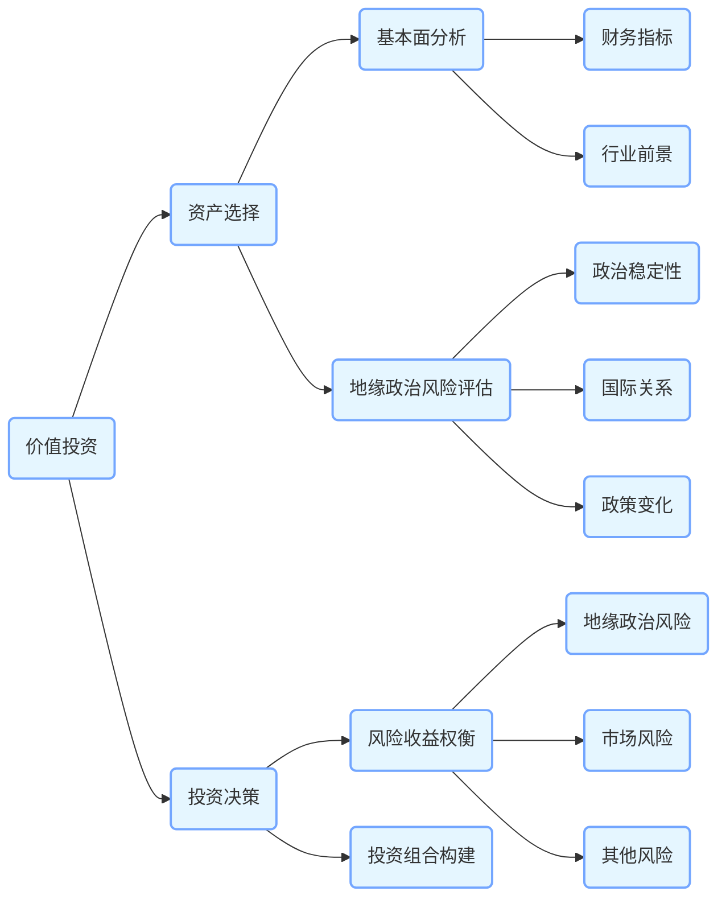

# 价值投资中的地缘政治风险评估

> 关键词：价值投资、地缘政治风险、风险评估、投资策略、政治经济分析

> 摘要：本文聚焦于价值投资领域中的地缘政治风险评估。详细阐述了地缘政治风险的核心概念及其与价值投资的紧密联系，深入剖析了用于评估该风险的核心算法原理，并结合数学模型和公式进行解释。通过实际案例展示了如何在项目实战中开展地缘政治风险评估，探讨了其在不同场景下的实际应用。同时，为读者推荐了相关的学习资源、开发工具框架以及论文著作。最后，总结了未来价值投资中地缘政治风险评估的发展趋势与挑战，并对常见问题进行了解答。

## 1. 背景介绍 
### 1.1 目的和范围
在全球经济一体化的大背景下，价值投资作为一种长期投资策略，受到了众多投资者的青睐。然而，地缘政治因素对投资市场的影响日益显著，地缘政治风险可能导致资产价格波动、投资回报受损。本文章的目的在于深入探讨价值投资中地缘政治风险评估的方法和技术，为投资者提供科学、有效的风险评估框架。文章的范围涵盖了地缘政治风险的概念、评估算法、数学模型、实际案例以及相关的工具和资源等方面。

### 1.2 预期读者
本文预期读者主要包括专业投资者、金融分析师、投资机构从业者、学术研究人员以及对价值投资和地缘政治风险感兴趣的爱好者。这些读者希望通过本文了解如何在价值投资决策中考虑地缘政治风险因素，提升投资决策的科学性和准确性。

### 1.3 文档结构概述
本文将按照以下结构展开：首先介绍地缘政治风险与价值投资的核心概念及其联系，通过文本示意图和 Mermaid 流程图进行直观展示；接着阐述核心算法原理，并给出具体的 Python 代码实现；然后介绍相关的数学模型和公式，并结合实际例子进行详细讲解；之后通过项目实战案例，展示如何在实际投资中进行地缘政治风险评估；再探讨地缘政治风险评估在不同场景下的实际应用；随后推荐相关的学习资源、开发工具框架和论文著作；最后总结未来发展趋势与挑战，解答常见问题，并提供扩展阅读和参考资料。

### 1.4 术语表
#### 1.4.1 核心术语定义
- **价值投资**：一种基于对股票内在价值的分析，通过寻找被低估的股票并长期持有，以获取超过市场平均回报的投资策略。
- **地缘政治风险**：由于地理位置、政治关系、国际关系等因素导致的政治、经济、社会等方面的不稳定，可能对投资产生不利影响的风险。
- **风险评估**：对可能影响投资目标实现的各种风险因素进行识别、分析和评价的过程。

#### 1.4.2 相关概念解释
- **政治稳定性**：一个国家或地区政治环境的稳定程度，包括政府的执政能力、政治制度的完善程度、社会秩序等方面。
- **国际关系**：不同国家之间的政治、经济、军事等方面的关系，国际关系的紧张或友好会对投资产生重要影响。
- **经济制裁**：一个国家或国际组织对另一个国家采取的经济限制措施，如贸易禁运、金融制裁等，可能导致被制裁国家的经济衰退和投资环境恶化。

#### 1.4.3 缩略词列表
- GDP：国内生产总值（Gross Domestic Product）
- FDI：外国直接投资（Foreign Direct Investment）

## 2. 核心概念与联系 
### 核心概念原理
价值投资的核心在于寻找被低估的资产，并长期持有以获取价值回归带来的收益。而地缘政治风险则是影响资产价值的重要外部因素之一。地缘政治风险可能通过多种途径影响投资，例如政治动荡可能导致企业生产经营受到干扰，经济制裁可能限制企业的市场和资源获取，国际关系紧张可能引发市场恐慌，导致资产价格下跌等。

### 架构的文本示意图
```plaintext
价值投资
|
|-- 资产选择
|   |-- 基本面分析
|   |   |-- 财务指标
|   |   |-- 行业前景
|   |
|   |-- 地缘政治风险评估
|       |-- 政治稳定性
|       |-- 国际关系
|       |-- 政策变化
|
|-- 投资决策
|   |-- 风险收益权衡
|   |   |-- 地缘政治风险
|   |   |-- 市场风险
|   |   |-- 其他风险
|   |
|   |-- 投资组合构建
```

### Mermaid 流程图


## 3. 核心算法原理 & 具体操作步骤 
### 核心算法原理
在价值投资中评估地缘政治风险，可以采用多因素综合评估模型。该模型综合考虑多个地缘政治因素，通过对每个因素进行量化评分，然后根据各因素的权重计算综合风险得分。

### 具体操作步骤
1. **确定评估因素**：包括政治稳定性、国际关系、政策变化等。
2. **设定评分标准**：为每个评估因素设定评分范围，例如 1 - 10 分，1 分表示风险极低，10 分表示风险极高。
3. **收集数据**：通过各种渠道收集与评估因素相关的数据，如新闻报道、政府报告、国际组织数据等。
4. **因素评分**：根据收集到的数据，对每个评估因素进行评分。
5. **确定因素权重**：根据各因素对投资的影响程度，确定每个因素的权重。
6. **计算综合风险得分**：将每个因素的评分乘以其权重，然后相加得到综合风险得分。

### Python 源代码实现
```python
# 定义评估因素和权重
factors = ['政治稳定性', '国际关系', '政策变化']
weights = [0.4, 0.3, 0.3]

# 定义评分函数
def score_factor(factor):
    if factor == '政治稳定性':
        # 示例评分逻辑，实际中应根据数据进行评分
        return 3
    elif factor == '国际关系':
        return 4
    elif factor == '政策变化':
        return 5

# 计算综合风险得分
total_score = 0
for i in range(len(factors)):
    score = score_factor(factors[i])
    total_score += score * weights[i]

print(f"综合风险得分: {total_score}")
```

## 4. 数学模型和公式 & 详细讲解 & 举例说明 
### 数学模型和公式
综合风险得分 $S$ 的计算公式为：
$$S = \sum_{i=1}^{n} w_i \times s_i$$
其中，$w_i$ 是第 $i$ 个评估因素的权重，$s_i$ 是第 $i$ 个评估因素的评分，$n$ 是评估因素的数量。

### 详细讲解
该公式的原理是将每个评估因素的评分乘以其权重，然后将所有因素的加权评分相加，得到综合风险得分。权重反映了每个因素对投资的重要程度，评分则反映了该因素的风险水平。通过这种方式，可以综合考虑多个地缘政治因素对投资的影响。

### 举例说明
假设我们有三个评估因素：政治稳定性、国际关系、政策变化，其权重分别为 0.4、0.3、0.3。对这三个因素的评分分别为 3、4、5。根据上述公式，综合风险得分 $S$ 为：
$$S = 0.4 \times 3 + 0.3 \times 4 + 0.3 \times 5 = 1.2 + 1.2 + 1.5 = 3.9$$
这意味着该投资面临的地缘政治风险处于中等水平。

## 5. 项目实战：代码实际案例和详细解释说明 
### 5.1  开发环境搭建
- **Python 环境**：建议使用 Python 3.7 及以上版本。可以从 Python 官方网站（https://www.python.org/downloads/）下载并安装。
- **开发工具**：推荐使用 PyCharm 作为集成开发环境（IDE），可以从 JetBrains 官方网站（https://www.jetbrains.com/pycharm/download/）下载并安装。
- **相关库**：需要安装 `pandas`、`numpy` 等库，用于数据处理和分析。可以使用以下命令进行安装：
```sh
pip install pandas numpy
```

### 5.2  源代码详细实现和代码解读
```python
import pandas as pd
import numpy as np

# 定义评估因素和权重
factors = ['政治稳定性', '国际关系', '政策变化']
weights = np.array([0.4, 0.3, 0.3])

# 模拟收集到的数据
data = {
    '国家': ['A 国', 'B 国', 'C 国'],
    '政治稳定性': [3, 6, 2],
    '国际关系': [4, 7, 3],
    '政策变化': [5, 8, 4]
}

# 创建 DataFrame
df = pd.DataFrame(data)

# 计算每个国家的综合风险得分
def calculate_risk_score(row):
    scores = np.array([row[factor] for factor in factors])
    return np.dot(weights, scores)

df['综合风险得分'] = df.apply(calculate_risk_score, axis=1)

# 输出结果
print(df)
```
### 代码解读与分析
1. **导入库**：导入 `pandas` 和 `numpy` 库，用于数据处理和数值计算。
2. **定义评估因素和权重**：定义了三个评估因素和对应的权重。
3. **模拟收集到的数据**：使用字典模拟收集到的不同国家的地缘政治数据。
4. **创建 DataFrame**：使用 `pandas` 的 `DataFrame` 类将数据转换为表格形式，方便进行处理和分析。
5. **计算综合风险得分**：定义了一个函数 `calculate_risk_score`，用于计算每个国家的综合风险得分。该函数通过 `numpy` 的 `dot` 函数计算加权评分的总和。
6. **输出结果**：将计算得到的综合风险得分添加到 `DataFrame` 中，并输出结果。

## 6. 实际应用场景 
### 跨国投资决策
在进行跨国投资时，投资者需要考虑目标国家的地缘政治风险。通过评估地缘政治风险，投资者可以选择风险较低的国家进行投资，或者采取相应的风险对冲措施。例如，在选择投资新兴市场时，投资者可以优先考虑政治稳定、国际关系友好、政策环境良好的国家。

### 行业投资分析
地缘政治风险对不同行业的影响程度不同。例如，能源行业可能受到地缘政治冲突和资源供应中断的影响较大，而消费品行业相对受影响较小。投资者在进行行业投资分析时，需要考虑地缘政治风险因素，选择受影响较小的行业进行投资。

### 投资组合管理
在地缘政治风险较高的时期，投资者可以通过调整投资组合的结构来降低风险。例如，增加防御性资产（如黄金、债券等）的比例，减少对地缘政治风险敏感的资产（如股票、新兴市场资产等）的投资。

## 7. 工具和资源推荐
### 7.1 学习资源推荐
#### 7.1.1 书籍推荐
- 《价值投资：从格雷厄姆到巴菲特》：介绍了价值投资的基本理论和方法，是价值投资领域的经典著作。
- 《地缘政治的世界》：深入探讨了地缘政治的基本概念、理论和实践，对理解地缘政治风险有很大帮助。
- 《投资风险管理》：系统介绍了投资风险管理的理论和方法，包括地缘政治风险评估。

#### 7.1.2 在线课程
- Coursera 上的“价值投资基础”课程：由知名教授授课，讲解了价值投资的基本原理和分析方法。
- edX 上的“地缘政治与全球经济”课程：介绍了地缘政治对全球经济和投资的影响。

#### 7.1.3 技术博客和网站
- Seeking Alpha：提供了丰富的投资分析和研究报告，包括地缘政治风险分析。
- Stratfor：专注于地缘政治分析，提供全球各地的地缘政治情报和研究报告。

### 7.2 开发工具框架推荐
#### 7.2.1 IDE和编辑器
- PyCharm：功能强大的 Python 集成开发环境，提供代码编辑、调试、版本控制等功能。
- Jupyter Notebook：交互式的编程环境，适合进行数据探索和分析。

#### 7.2.2 调试和性能分析工具
- PDB：Python 内置的调试器，可用于调试 Python 代码。
- cProfile：Python 内置的性能分析工具，可用于分析代码的性能瓶颈。

#### 7.2.3 相关框架和库
- Pandas：用于数据处理和分析的 Python 库，提供了丰富的数据结构和数据分析工具。
- Numpy：用于数值计算的 Python 库，提供了高效的数组和矩阵运算功能。

### 7.3 相关论文著作推荐
#### 7.3.1 经典论文
- “The Influence of Geopolitical Risks on Stock Market Returns”：研究了地缘政治风险对股票市场回报的影响。
- “Geopolitical Risk and Corporate Investment”：探讨了地缘政治风险对企业投资决策的影响。

#### 7.3.2 最新研究成果
- 可以关注顶级学术期刊，如《Journal of Finance》、《Review of Financial Studies》等，获取最新的地缘政治风险研究成果。

#### 7.3.3 应用案例分析
- 国际货币基金组织（IMF）和世界银行发布的报告中，经常包含地缘政治风险对不同国家和地区经济和投资的影响分析。

## 8. 总结：未来发展趋势与挑战
### 未来发展趋势
- **数据驱动的风险评估**：随着大数据和人工智能技术的发展，未来地缘政治风险评估将越来越依赖于数据驱动的方法。通过收集和分析大量的地缘政治数据，可以更准确地评估风险。
- **跨学科研究**：地缘政治风险评估涉及政治学、经济学、国际关系等多个学科领域。未来的研究将更加注重跨学科的融合，综合运用不同学科的理论和方法进行风险评估。
- **实时监测和预警**：为了及时应对地缘政治风险，未来的评估系统将具备实时监测和预警功能。通过实时跟踪地缘政治事件的发展，及时发出风险预警，帮助投资者做出决策。

### 挑战
- **数据质量和可用性**：地缘政治数据往往具有主观性和不确定性，数据质量和可用性是一个挑战。如何收集、整理和分析高质量的地缘政治数据是未来需要解决的问题。
- **模型的准确性和可靠性**：地缘政治风险评估模型的准确性和可靠性直接影响投资决策的效果。如何建立准确、可靠的评估模型，需要不断进行研究和改进。
- **地缘政治的复杂性和不确定性**：地缘政治事件具有复杂性和不确定性，很难准确预测。如何在复杂多变的地缘政治环境中进行有效的风险评估，是未来面临的最大挑战。

## 9. 附录：常见问题与解答
### 问题 1：地缘政治风险评估的结果是否准确可靠？
解答：地缘政治风险评估的结果具有一定的主观性和不确定性。评估结果受到数据质量、评估方法和模型等因素的影响。虽然我们可以采用科学的方法和模型进行评估，但仍然无法完全准确地预测地缘政治事件的发生和影响。因此，评估结果只能作为投资决策的参考，不能作为唯一的依据。

### 问题 2：如何获取地缘政治数据？
解答：可以通过多种渠道获取地缘政治数据，如新闻媒体、政府报告、国际组织数据、专业研究机构报告等。同时，也可以利用网络爬虫技术从互联网上收集相关数据。

### 问题 3：地缘政治风险评估对个人投资者有什么意义？
解答：地缘政治风险评估对个人投资者具有重要意义。通过了解地缘政治风险，个人投资者可以更好地选择投资标的，降低投资风险。例如，在地缘政治风险较高的时期，个人投资者可以减少对风险资产的投资，增加对防御性资产的配置。

## 10. 扩展阅读 & 参考资料
### 扩展阅读
- 《大国政治的悲剧》：深入探讨了国际关系中的大国政治逻辑，对理解地缘政治有很大帮助。
- 《金融炼金术》：乔治·索罗斯的著作，介绍了他的投资哲学和方法，对价值投资和风险管理有一定的启示。

### 参考资料
- 国际货币基金组织（IMF）官方网站：https://www.imf.org/
- 世界银行官方网站：https://www.worldbank.org/
- 联合国官方网站：https://www.un.org/

作者：AI天才研究院/AI Genius Institute & 禅与计算机程序设计艺术 /Zen And The Art of Computer Programming