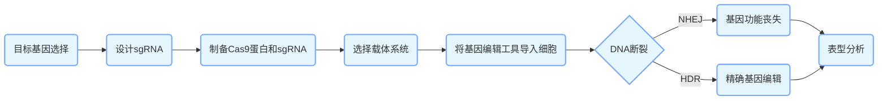

# 价值投资中的基因编辑技术机遇

> 关键词：价值投资、基因编辑技术、CRISPR、投资机遇、生物技术

> 摘要：本文旨在深入探讨价值投资领域中基因编辑技术所蕴含的机遇。首先介绍基因编辑技术的背景，包括其定义、发展历程和重要意义。接着详细阐述基因编辑技术的核心概念、算法原理、数学模型等理论知识。通过实际的项目实战案例，展示基因编辑技术在投资中的具体应用。分析基因编辑技术在不同领域的实际应用场景，为投资者提供参考。推荐相关的学习资源、开发工具和论文著作，帮助投资者更好地了解该领域。最后总结基因编辑技术的未来发展趋势与挑战，解答常见问题，并提供扩展阅读和参考资料，助力投资者把握基因编辑技术带来的价值投资机遇。

## 1. 背景介绍 
### 1.1 目的和范围
本文的目的是全面分析价值投资与基因编辑技术的结合点，为投资者揭示基因编辑技术领域的潜在投资机遇。范围涵盖基因编辑技术的基本原理、发展现状、应用场景，以及在价值投资中的具体考量因素。通过对相关理论和实际案例的研究，帮助投资者了解基因编辑技术的投资价值和风险，从而做出更明智的投资决策。

### 1.2 预期读者
本文的预期读者主要包括对价值投资感兴趣的投资者，无论是个人投资者还是机构投资者。同时，也适合从事生物技术、医药研发等领域的专业人士，以及关注科技发展趋势的研究人员。对于希望了解基因编辑技术在金融市场中应用的读者，本文也具有一定的参考价值。

### 1.3 文档结构概述
本文将按照以下结构进行阐述：首先介绍基因编辑技术的背景信息，包括目的、预期读者和文档结构概述等。接着深入探讨基因编辑技术的核心概念与联系，包括其原理和架构。然后详细讲解基因编辑技术的核心算法原理和具体操作步骤，并结合数学模型和公式进行说明。通过项目实战案例，展示基因编辑技术在实际投资中的应用。分析基因编辑技术的实际应用场景，为投资者提供更多的投资方向。推荐相关的工具和资源，帮助投资者更好地学习和研究基因编辑技术。最后总结基因编辑技术的未来发展趋势与挑战，解答常见问题，并提供扩展阅读和参考资料。

### 1.4 术语表
#### 1.4.1 核心术语定义
- **价值投资**：一种投资策略，强调通过分析资产的内在价值，以低于其内在价值的价格买入资产，并长期持有，等待资产价值回归或增长。
- **基因编辑技术**：指对生物体基因组特定目标基因进行修饰的技术，可实现对基因的插入、删除、替换等操作。
- **CRISPR/Cas9**：一种广泛应用的基因编辑技术，利用CRISPR序列和Cas9蛋白实现对特定基因的精准编辑。
- **生物技术**：应用生物学、化学和工程学的基本原理，利用生物体或其组成部分来生产有用物质或为人类提供服务的技术。
- **基因治疗**：通过对基因进行修饰或调控来治疗疾病的方法，是基因编辑技术的重要应用领域之一。

#### 1.4.2 相关概念解释
- **基因编辑的特异性**：指基因编辑技术能够准确地识别和作用于目标基因，而不影响其他非目标基因的特性。
- **脱靶效应**：基因编辑过程中，编辑工具在非目标基因位点产生的不必要的编辑现象，可能导致潜在的安全风险。
- **基因编辑载体**：用于将基因编辑工具（如CRISPR/Cas9）导入细胞的媒介，常见的有病毒载体、非病毒载体等。
- **生物技术产业**：以生物技术为核心，涵盖基因编辑、生物制药、生物农业等多个领域的产业集群。

#### 1.4.3 缩略词列表
- **CRISPR**：Clustered Regularly Interspaced Short Palindromic Repeats（成簇的规律间隔的短回文重复序列）
- **Cas**：CRISPR-associated（CRISPR相关）
- **sgRNA**：single guide RNA（单链引导RNA）
- **DNA**：Deoxyribonucleic acid（脱氧核糖核酸）
- **RNA**：Ribonucleic acid（核糖核酸）

## 2. 核心概念与联系 

### 基因编辑技术的原理
基因编辑技术的核心原理是通过特定的核酸酶识别并切割目标DNA序列，然后利用细胞自身的DNA修复机制实现对基因的修饰。目前，最常用的基因编辑技术是CRISPR/Cas9系统。

CRISPR/Cas9系统由CRISPR序列和Cas9蛋白组成。CRISPR序列是一段包含多个短重复序列和间隔序列的DNA片段，间隔序列来源于入侵细菌的病毒DNA。当细菌受到病毒感染时，会将病毒的DNA片段整合到CRISPR序列中，形成记忆。当再次受到相同病毒感染时，CRISPR序列会转录成crRNA（CRISPR RNA），与tracrRNA（trans - activating CRISPR RNA）结合形成复合物。该复合物引导Cas9蛋白识别并切割与crRNA互补的病毒DNA序列，从而实现对病毒的免疫防御。

在基因编辑应用中，科学家将crRNA和tracrRNA融合成单链引导RNA（sgRNA），设计sgRNA使其与目标基因序列互补。sgRNA引导Cas9蛋白结合到目标基因位点，Cas9蛋白的核酸酶活性将目标DNA双链切断。细胞会启动DNA修复机制，主要有两种修复方式：非同源末端连接（NHEJ）和同源重组修复（HDR）。NHEJ是一种快速但容易出错的修复方式，会在断裂处引入插入或缺失突变，导致基因功能丧失；HDR则可以在提供外源DNA模板的情况下，实现对目标基因的精确编辑，如基因替换、插入等。

### 基因编辑技术的架构

#### 文本示意图
基因编辑技术的架构可以分为三个主要部分：基因编辑工具、载体系统和细胞体系。

基因编辑工具：以CRISPR/Cas9为例，包括sgRNA和Cas9蛋白。sgRNA负责识别目标基因序列，Cas9蛋白负责切割DNA。

载体系统：用于将基因编辑工具导入细胞。常见的载体有病毒载体（如腺相关病毒AAV、慢病毒等）和非病毒载体（如脂质体、纳米颗粒等）。

细胞体系：可以是体外培养的细胞，也可以是体内的细胞。在体外培养细胞中进行基因编辑可以更方便地进行操作和研究，而在体内细胞中进行基因编辑则更接近实际的治疗应用。

#### Mermaid流程图


这个流程图展示了基因编辑技术的基本操作流程。首先选择目标基因，然后设计sgRNA，制备Cas9蛋白和sgRNA。接着选择合适的载体系统将基因编辑工具导入细胞，细胞内的DNA被切断后，通过NHEJ或HDR方式进行修复，最后进行表型分析，评估基因编辑的效果。

## 3. 核心算法原理 & 具体操作步骤 

### 核心算法原理

基因编辑技术中的算法主要涉及sgRNA的设计和脱靶效应预测。下面以Python代码为例，介绍sgRNA设计的基本思路。

#### sgRNA设计算法原理
sgRNA设计的关键是找到与目标基因序列互补且具有高特异性的RNA序列。一般来说，sgRNA的长度为20个核苷酸，并且在其3'端需要有一个PAM（Protospacer Adjacent Motif）序列，对于Cas9蛋白，常见的PAM序列是NGG（N代表任意核苷酸）。

以下是一个简单的Python代码示例，用于在给定的DNA序列中搜索可能的sgRNA序列：

```python
def find_sgRNA_sequences(dna_sequence):
    sgRNA_sequences = []
    pam_sequence = "NGG"
    for i in range(len(dna_sequence) - 22):
        potential_sgRNA = dna_sequence[i:i+20]
        next_three_bases = dna_sequence[i+20:i+23]
        if next_three_bases[1] == 'G' and next_three_bases[2] == 'G':
            sgRNA_sequences.append(potential_sgRNA)
    return sgRNA_sequences

# 示例DNA序列
dna = "ATGCATGCTAGCTAGCTAGCTAGCTAGCTAGCTAGCTAGCTAGC"
sgRNAs = find_sgRNA_sequences(dna)
print("找到的sgRNA序列：", sgRNAs)
```

### 具体操作步骤

#### 步骤1：目标基因选择
根据研究或治疗的目的，选择需要编辑的目标基因。可以通过查阅文献、数据库等方式确定目标基因的序列和功能。

#### 步骤2：sgRNA设计
使用上述算法或专业的sgRNA设计工具（如CRISPR Design Tool、CHOPCHOP等）设计与目标基因互补的sgRNA序列。在设计过程中，需要考虑sgRNA的特异性、活性等因素，尽量减少脱靶效应。

#### 步骤3：制备Cas9蛋白和sgRNA
可以通过基因克隆、蛋白质表达和纯化等技术制备Cas9蛋白。sgRNA可以通过体外转录的方法合成。

#### 步骤4：选择载体系统
根据细胞类型和实验目的选择合适的载体系统。如果是体外细胞实验，可以选择脂质体转染试剂将基因编辑工具导入细胞；如果是体内实验，可能需要使用病毒载体，如AAV或慢病毒。

#### 步骤5：将基因编辑工具导入细胞
按照所选载体系统的操作说明，将Cas9蛋白和sgRNA导入细胞。导入后，细胞内的DNA会被切断，并通过NHEJ或HDR方式进行修复。

#### 步骤6：检测基因编辑效果
可以使用PCR、测序等技术检测目标基因是否被成功编辑。通过比较编辑前后的基因序列，评估基因编辑的效率和特异性。

## 4. 数学模型和公式 & 详细讲解 & 举例说明 

### 脱靶效应预测的数学模型

脱靶效应是基因编辑技术面临的一个重要挑战，准确预测脱靶效应对于提高基因编辑的安全性至关重要。目前，有多种数学模型用于脱靶效应预测，其中一种常用的模型是基于序列相似性的模型。

#### 模型原理
该模型假设sgRNA与非目标DNA序列的相似性越高，脱靶的可能性就越大。可以通过计算sgRNA与非目标DNA序列的序列比对得分来评估脱靶风险。

#### 数学公式
设sgRNA序列为 $S_{sgRNA}$，非目标DNA序列为 $S_{non - target}$，序列比对得分可以使用Smith - Waterman算法计算。Smith - Waterman算法的得分矩阵 $M$ 定义如下：

设 $m$ 和 $n$ 分别为 $S_{sgRNA}$ 和 $S_{non - target}$ 的长度，$M(i,j)$ 表示 $S_{sgRNA}$ 的前 $i$ 个字符和 $S_{non - target}$ 的前 $j$ 个字符的最优比对得分。则有：

$M(0,j)=0$，$M(i,0)=0$

$M(i,j)=\max\left\{
\begin{array}{l}
M(i - 1,j - 1)+s(S_{sgRNA}[i],S_{non - target}[j])\\
M(i - 1,j)-d\\
M(i,j - 1)-d\\
0
\end{array}
\right.$

其中，$s(S_{sgRNA}[i],S_{non - target}[j])$ 是匹配得分，当 $S_{sgRNA}[i]=S_{non - target}[j]$ 时，$s(S_{sgRNA}[i],S_{non - target}[j])$ 为正得分；当 $S_{sgRNA}[i]\neq S_{non - target}[j]$ 时，$s(S_{sgRNA}[i],S_{non - target}[j])$ 为负得分。$d$ 是空位罚分。

最终的序列比对得分是 $M$ 矩阵中的最大值。

#### 举例说明
假设 $S_{sgRNA}=$ "ATGC"，$S_{non - target}=$ "ATGG"，匹配得分 $s(x,y)$ 定义为：当 $x = y$ 时，$s(x,y)=2$；当 $x\neq y$ 时，$s(x,y)= - 1$，空位罚分 $d = 1$。

初始化 $M$ 矩阵：

$M=\begin{bmatrix}
0&0&0&0&0\\
0&0&0&0&0\\
0&0&0&0&0\\
0&0&0&0&0\\
0&0&0&0&0
\end{bmatrix}$

计算 $M$ 矩阵的值：

$M(1,1)=\max\left\{
\begin{array}{l}
M(0,0)+s(A,A)=0 + 2=2\\
M(0,1)-d=0 - 1=-1\\
M(1,0)-d=0 - 1=-1\\
0
\end{array}
\right.=2$

$M(1,2)=\max\left\{
\begin{array}{l}
M(0,1)+s(A,T)=0-1=-1\\
M(0,2)-d=0 - 1=-1\\
M(1,1)-d=2 - 1=1\\
0
\end{array}
\right.=1$

以此类推，最终得到 $M$ 矩阵：

$M=\begin{bmatrix}
0&0&0&0&0\\
0&2&1&0&0\\
0&1&4&3&2\\
0&0&3&3&2\\
0&0&2&2&1
\end{bmatrix}$

序列比对得分是 $M$ 矩阵中的最大值，即 4。得分越高，说明sgRNA与非目标DNA序列的相似性越高，脱靶风险可能越大。

## 5. 项目实战：代码实际案例和详细解释说明 

### 5.1  开发环境搭建

#### 硬件环境
- 计算机：建议使用具有较高性能的台式机或笔记本电脑，CPU至少为Intel Core i5或同等性能，内存8GB以上。
- 存储设备：需要有足够的存储空间来存储数据和代码，建议硬盘容量为500GB以上。

#### 软件环境
- 操作系统：可以选择Windows、Linux或macOS操作系统。
- Python环境：安装Python 3.7以上版本，可以使用Anaconda来管理Python环境。
- 相关库：安装以下Python库：
    - `numpy`：用于数值计算。
    - `pandas`：用于数据处理和分析。
    - `biopython`：用于生物序列分析。

可以使用以下命令安装这些库：

```sh
pip install numpy pandas biopython
```

### 5.2  源代码详细实现和代码解读

以下是一个完整的基因编辑项目实战代码示例，用于在给定的DNA序列中搜索sgRNA序列，并计算其与非目标DNA序列的序列比对得分。

```python
import numpy as np
from Bio import pairwise2

def find_sgRNA_sequences(dna_sequence):
    sgRNA_sequences = []
    pam_sequence = "NGG"
    for i in range(len(dna_sequence) - 22):
        potential_sgRNA = dna_sequence[i:i+20]
        next_three_bases = dna_sequence[i+20:i+23]
        if next_three_bases[1] == 'G' and next_three_bases[2] == 'G':
            sgRNA_sequences.append(potential_sgRNA)
    return sgRNA_sequences

def calculate_sequence_alignment_score(sgRNA, non_target_dna):
    alignments = pairwise2.align.globalxx(sgRNA, non_target_dna)
    score = alignments[0].score
    return score

# 示例DNA序列
target_dna = "ATGCATGCTAGCTAGCTAGCTAGCTAGCTAGCTAGCTAGCTAGC"
non_target_dna = "ATGGATGCTAGCTAGCTAGCTAGCTAGCTAGCTAGCTAGCTAGC"

# 搜索sgRNA序列
sgRNAs = find_sgRNA_sequences(target_dna)

# 计算每个sgRNA与非目标DNA序列的比对得分
for sgRNA in sgRNAs:
    score = calculate_sequence_alignment_score(sgRNA, non_target_dna)
    print(f"sgRNA: {sgRNA}, 比对得分: {score}")
```

### 5.3  代码解读与分析

#### `find_sgRNA_sequences` 函数
该函数用于在给定的DNA序列中搜索可能的sgRNA序列。通过遍历DNA序列，检查每个位置是否存在符合条件的sgRNA序列（长度为20个核苷酸，且其后紧跟NGG PAM序列）。如果满足条件，则将该sgRNA序列添加到列表中并返回。

#### `calculate_sequence_alignment_score` 函数
该函数使用 `biopython` 库中的 `pairwise2.align.globalxx` 函数计算sgRNA与非目标DNA序列的全局序列比对得分。`globalxx` 函数使用简单的匹配得分（匹配为1，不匹配为0）和空位罚分（空位为0）进行比对。返回比对结果中的最高得分。

#### 主程序部分
首先定义了目标DNA序列和非目标DNA序列。然后调用 `find_sgRNA_sequences` 函数搜索目标DNA序列中的sgRNA序列。最后，对于每个找到的sgRNA序列，调用 `calculate_sequence_alignment_score` 函数计算其与非目标DNA序列的比对得分，并打印结果。

通过这个项目实战，我们可以了解如何在实际中应用基因编辑技术的相关算法，以及如何评估sgRNA的脱靶风险。

## 6. 实际应用场景 

### 基因治疗
基因编辑技术在基因治疗领域具有巨大的应用潜力。许多遗传性疾病是由单个基因突变引起的，通过基因编辑技术可以修复或替换这些突变基因，从而达到治疗疾病的目的。例如，镰状细胞贫血是一种常见的遗传性血液疾病，由血红蛋白基因的突变引起。科学家可以使用CRISPR/Cas9技术编辑患者造血干细胞中的突变基因，然后将编辑后的干细胞回输到患者体内，有望治愈该疾病。

### 生物制药
基因编辑技术可以用于开发新型药物。通过编辑细胞的基因，可以改变细胞的功能和代谢途径，从而生产出具有特定治疗效果的蛋白质药物。例如，利用基因编辑技术可以改造生产胰岛素的细胞，提高胰岛素的产量和质量，为糖尿病患者提供更好的治疗选择。

### 农业领域
在农业领域，基因编辑技术可以用于改良农作物的性状。通过编辑农作物的基因，可以提高农作物的抗病虫害能力、耐旱性、产量等。例如，科学家可以使用基因编辑技术编辑水稻的基因，使其具有抗稻瘟病的能力，减少农药的使用，提高水稻的产量和质量。

### 动物模型构建
基因编辑技术可以用于构建疾病动物模型。通过编辑动物的基因，使其模拟人类疾病的发生和发展过程，为研究疾病的发病机制和开发治疗方法提供重要的工具。例如，利用CRISPR/Cas9技术可以构建患有癌症、神经系统疾病等人类疾病的动物模型，帮助科学家更好地理解疾病的本质。

## 7. 工具和资源推荐
### 7.1 学习资源推荐
#### 7.1.1 书籍推荐
- 《基因编辑：从基础到临床》：本书系统地介绍了基因编辑技术的基本原理、发展历程、应用领域以及临床研究进展，适合初学者和专业人士阅读。
- 《生物技术概论》：全面涵盖了生物技术的各个方面，包括基因编辑技术、生物制药、生物信息学等，是一本很好的生物技术入门书籍。
- 《CRISPR - Cas系统：分子机制与应用》：深入探讨了CRISPR - Cas系统的分子机制和在基因编辑、基因调控等方面的应用，对于深入研究基因编辑技术具有重要的参考价值。

#### 7.1.2 在线课程
- Coursera上的“基因编辑技术与应用”课程：由知名高校的教授授课，内容涵盖基因编辑技术的原理、操作和应用，通过视频讲解、案例分析和在线作业等方式，帮助学习者掌握基因编辑技术的基本知识和技能。
- edX上的“生物技术前沿”课程：介绍了生物技术领域的最新研究成果和发展趋势，其中包括基因编辑技术的相关内容，适合对生物技术前沿感兴趣的学习者。

#### 7.1.3 技术博客和网站
- GenScript博客：提供了基因编辑技术的最新研究动态、实验技巧和应用案例等内容，是一个很好的学习和交流平台。
- CRISPR Journal：专注于CRISPR技术的研究和应用，发布了大量关于基因编辑技术的学术论文和评论文章，有助于了解该领域的最新研究进展。

### 7.2 开发工具框架推荐
#### 7.2.1 IDE和编辑器
- PyCharm：一款功能强大的Python集成开发环境，提供了代码编辑、调试、版本控制等功能，适合Python开发者使用。
- Jupyter Notebook：一种交互式的开发环境，可以在浏览器中编写和运行Python代码，支持代码、文本、图表等多种形式的展示，非常适合数据分析和科研工作。

#### 7.2.2 调试和性能分析工具
- pdb：Python自带的调试工具，可以帮助开发者在代码中设置断点、单步执行代码、查看变量值等，方便调试程序。
- cProfile：Python的性能分析工具，可以分析程序中各个函数的执行时间和调用次数，帮助开发者找出程序的性能瓶颈。

#### 7.2.3 相关框架和库
- biopython：一个用于生物信息学的Python库，提供了丰富的生物序列分析工具，如序列比对、基因注释等，方便开发者进行基因编辑技术相关的研究和开发。
- CRISPResso2：一个用于分析CRISPR基因编辑实验结果的软件工具，能够准确地检测基因编辑的效率和脱靶效应。

### 7.3 相关论文著作推荐
#### 7.3.1 经典论文
- "A programmable dual - RNA - guided DNA endonuclease in adaptive bacterial immunity"：该论文首次报道了CRISPR/Cas9系统的工作原理，为基因编辑技术的发展奠定了基础。
- "Genome engineering using the CRISPR - Cas9 system"：详细介绍了CRISPR/Cas9技术在基因组编辑中的应用方法和实验流程，是基因编辑领域的经典文献之一。

#### 7.3.2 最新研究成果
- 定期关注《Nature》、《Science》、《Cell》等顶级学术期刊，这些期刊经常发表基因编辑技术领域的最新研究成果，包括新的基因编辑工具、应用案例和临床研究进展等。

#### 7.3.3 应用案例分析
- 可以查阅一些专业的生物技术研究报告和案例分析，了解基因编辑技术在不同领域的实际应用情况和投资案例，为价值投资提供参考。

## 8. 总结：未来发展趋势与挑战

### 未来发展趋势
- **技术不断创新**：基因编辑技术将不断发展和创新，新的基因编辑工具和方法将不断涌现，提高基因编辑的效率和特异性。例如，近年来出现的碱基编辑技术和先导编辑技术，为基因编辑提供了更加精准和灵活的手段。
- **临床应用拓展**：随着技术的成熟和安全性的提高，基因编辑技术在临床治疗领域的应用将不断拓展。更多的遗传性疾病、癌症等重大疾病有望通过基因编辑技术得到有效治疗。
- **多学科融合**：基因编辑技术将与生物信息学、人工智能、材料科学等多学科进行深度融合。生物信息学可以帮助设计更高效的sgRNA序列，人工智能可以用于预测脱靶效应和优化基因编辑方案，材料科学可以开发更安全有效的基因编辑载体。
- **产业发展壮大**：基因编辑技术相关的产业将迎来快速发展，包括基因编辑服务、生物制药、农业生物技术等领域。投资机构对基因编辑技术的关注度将不断提高，推动产业的进一步壮大。

### 挑战
- **脱靶效应**：脱靶效应仍然是基因编辑技术面临的主要挑战之一。虽然已经有多种方法用于预测和减少脱靶效应，但如何完全避免脱靶效应仍然是一个亟待解决的问题。
- **伦理道德问题**：基因编辑技术涉及到人类生殖细胞的编辑，引发了一系列伦理道德问题。例如，对人类胚胎进行基因编辑可能会改变人类的基因库，带来不可预测的后果。如何在技术发展的同时，平衡科学进步和伦理道德的关系，是一个需要深入探讨的问题。
- **安全性和有效性评估**：基因编辑技术在临床应用前需要进行严格的安全性和有效性评估。目前，相关的评估标准和方法还不够完善，需要建立更加科学、规范的评估体系。
- **知识产权保护**：基因编辑技术的发展涉及到大量的知识产权问题。不同的研究团队和公司在基因编辑技术的专利申请和授权方面存在竞争和纠纷，如何合理保护知识产权，促进技术的创新和发展，也是一个需要解决的问题。

## 9. 附录：常见问题与解答

### 问题1：基因编辑技术是否会对人类健康造成潜在风险？
答：基因编辑技术存在一定的潜在风险，主要包括脱靶效应、免疫反应等。脱靶效应可能导致非目标基因的编辑，从而引发潜在的健康问题。免疫反应是指人体免疫系统对基因编辑工具（如病毒载体）产生的免疫反应，可能影响基因编辑的效果和安全性。然而，随着技术的不断发展，科学家们正在努力降低这些风险，例如通过优化基因编辑工具的设计、改进载体系统等方法。

### 问题2：基因编辑技术在农业领域的应用是否安全？
答：基因编辑技术在农业领域的应用具有一定的安全性。与传统的转基因技术相比，基因编辑技术主要是对作物自身的基因进行修饰，不引入外源基因，因此其安全性相对较高。在进行农业应用前，需要对基因编辑作物进行严格的安全性评估，包括对环境影响、食品安全性等方面的评估。只有经过评估证明安全的基因编辑作物才能进行商业化种植和销售。

### 问题3：基因编辑技术的投资风险有哪些？
答：基因编辑技术的投资风险主要包括技术风险、市场风险和政策风险。技术风险是指基因编辑技术可能存在的技术难题无法解决，如脱靶效应、安全性问题等，导致研发失败。市场风险是指基因编辑技术的产品或服务可能无法得到市场的认可，导致商业失败。政策风险是指政府可能出台相关政策限制基因编辑技术的发展和应用，影响投资回报。投资者在进行基因编辑技术投资时，需要充分了解这些风险，并进行合理的风险评估和管理。

## 10. 扩展阅读 & 参考资料
### 扩展阅读
- 《生命的未来：基因编辑与人类的进化》：探讨了基因编辑技术对人类社会和未来发展的影响，引发读者对基因编辑技术的深入思考。
- 《生物技术革命：从实验室到市场》：介绍了生物技术从研究到产业化的全过程，包括基因编辑技术在其中的应用和发展。

### 参考资料
- 相关的学术论文和研究报告，如《Nature》、《Science》、《Cell》等期刊上发表的关于基因编辑技术的论文。
- 政府和行业组织发布的相关政策文件和统计数据，如国家食品药品监督管理总局发布的关于基因治疗产品的审评政策。
- 专业的生物技术数据库和网站，如NCBI（National Center for Biotechnology Information）、Ensembl等，提供了丰富的基因序列和生物信息数据。

作者：AI天才研究院/AI Genius Institute & 禅与计算机程序设计艺术 /Zen And The Art of Computer Programming