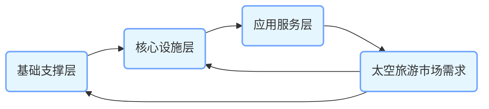

# 价值投资中的太空旅游基础设施分析

> 关键词：价值投资、太空旅游、基础设施、商业航天、投资潜力

> 摘要：本文聚焦于价值投资视角下的太空旅游基础设施。首先阐述太空旅游基础设施的背景，包括其目的、预期读者等。接着深入剖析核心概念，构建相关架构与流程图。详细讲解核心算法原理，用 Python 代码辅助说明。呈现数学模型与公式并举例。通过项目实战展示代码案例及解读。探讨实际应用场景，推荐相关工具和资源。最后总结太空旅游基础设施的未来发展趋势与挑战，为价值投资者提供全面且深入的参考，助力其把握太空旅游领域的投资机遇。

## 1. 背景介绍 
### 1.1 目的和范围
太空旅游作为新兴的商业领域，正逐渐展现出巨大的发展潜力。本分析的目的在于从价值投资的角度，全面评估太空旅游基础设施的现状、发展前景以及投资价值。范围涵盖了太空旅游涉及的各类基础设施，包括太空港、航天器、地面支持系统等，旨在为投资者提供深入的洞察和决策依据。

### 1.2 预期读者
本文预期读者主要包括价值投资者、金融分析师、商业航天从业者以及对太空旅游领域感兴趣的研究人员。对于价值投资者，本文将帮助他们识别太空旅游基础设施领域的投资机会和风险；金融分析师可从中获取专业的分析框架和数据支持；商业航天从业者能了解行业发展动态和基础设施需求；研究人员则可得到关于太空旅游基础设施的综合研究资料。

### 1.3 文档结构概述
本文将按照以下结构展开：首先介绍背景信息，让读者了解分析的目的和范围；接着阐述核心概念与联系，构建清晰的理论框架；详细讲解核心算法原理和具体操作步骤，用代码示例辅助理解；呈现数学模型和公式并举例说明；通过项目实战展示实际应用；探讨实际应用场景；推荐相关工具和资源；总结未来发展趋势与挑战；最后提供常见问题解答和扩展阅读参考资料。

### 1.4 术语表
#### 1.4.1 核心术语定义
- **价值投资**：一种基于公司内在价值进行投资决策的策略，投资者通过分析公司的基本面、财务状况等因素，寻找被低估的资产进行投资。
- **太空旅游**：指非专业宇航员乘坐航天器进入太空，进行观光、体验等活动的商业行为。
- **太空旅游基础设施**：支持太空旅游活动开展的各类设施和系统，包括太空港、航天器、地面测控中心、生命保障系统等。

#### 1.4.2 相关概念解释
- **商业航天**：以商业盈利为目的的航天活动，太空旅游是商业航天的重要应用领域之一。
- **太空经济**：指与太空活动相关的经济活动总和，包括太空探索、太空资源开发、太空旅游等多个领域。

#### 1.4.3 缩略词列表
- **NASA**：美国国家航空航天局（National Aeronautics and Space Administration）
- **ESA**：欧洲航天局（European Space Agency）
- **ULA**：联合发射联盟（United Launch Alliance）

## 2. 核心概念与联系 
### 核心概念原理
太空旅游基础设施是一个复杂的系统工程，它涉及多个领域的技术和资源。太空港是太空旅游的起点和终点，它需要具备航天器发射、降落、维护和补给等功能。航天器是承载游客进入太空的工具，需要具备高度的安全性、舒适性和可靠性。地面支持系统则负责对航天器进行跟踪、测控、通信等操作，确保太空旅游活动的顺利进行。

这些基础设施之间相互关联、相互依存。太空港的建设和运营需要航天器的支持，而航天器的正常运行又依赖于地面支持系统的保障。同时，太空旅游的市场需求也会反过来影响基础设施的建设和发展。例如，如果太空旅游市场需求增长迅速，就需要加快太空港的建设和航天器的研发，以满足更多游客的需求。

### 架构的文本示意图
太空旅游基础设施架构可以分为三个层次：底层是基础支撑层，包括土地、能源、通信等基础设施；中间层是核心设施层，包括太空港、航天器、地面支持系统等；上层是应用服务层，包括太空旅游运营商、旅行社等提供的各类服务。

### Mermaid 流程图


## 3. 核心算法原理 & 具体操作步骤 
### 核心算法原理
在价值投资中，评估太空旅游基础设施的投资价值需要综合考虑多个因素。我们可以使用多因素评估模型，通过对基础设施的建设成本、运营成本、预期收益、市场风险等因素进行量化分析，来确定其投资价值。

以下是一个简化的多因素评估模型的 Python 代码示例：

```python
import numpy as np

def multi_factor_evaluation(construction_cost, operation_cost, expected_revenue, market_risk):
    """
    多因素评估模型
    :param construction_cost: 建设成本
    :param operation_cost: 运营成本
    :param expected_revenue: 预期收益
    :param market_risk: 市场风险
    :return: 投资价值评分
    """
    # 定义各因素的权重
    weights = np.array([0.3, 0.2, 0.4, 0.1])
    factors = np.array([construction_cost, operation_cost, expected_revenue, market_risk])
    
    # 对市场风险进行反向处理，因为风险越高，投资价值越低
    factors[3] = 1 / factors[3] if factors[3] != 0 else 0
    
    # 计算投资价值评分
    score = np.dot(weights, factors)
    return score

# 示例数据
construction_cost = 100000000  # 建设成本为 1 亿美元
operation_cost = 10000000  # 运营成本为 1000 万美元
expected_revenue = 50000000  # 预期收益为 5000 万美元
market_risk = 0.2  # 市场风险为 20%

# 计算投资价值评分
score = multi_factor_evaluation(construction_cost, operation_cost, expected_revenue, market_risk)
print(f"投资价值评分: {score}")
```

### 具体操作步骤
1. **数据收集**：收集太空旅游基础设施的建设成本、运营成本、预期收益、市场风险等相关数据。
2. **数据预处理**：对收集到的数据进行清洗、整理和标准化处理，确保数据的准确性和一致性。
3. **因素权重确定**：根据专家意见或历史数据，确定各因素的权重。
4. **投资价值计算**：使用多因素评估模型，计算太空旅游基础设施的投资价值评分。
5. **决策分析**：根据投资价值评分，结合投资者的风险偏好和投资目标，做出投资决策。

## 4. 数学模型和公式 & 详细讲解 & 举例说明 
### 数学模型和公式
多因素评估模型的数学表达式为：

$$
V = \sum_{i=1}^{n} w_i \times f_i
$$

其中，$V$ 表示投资价值评分，$w_i$ 表示第 $i$ 个因素的权重，$f_i$ 表示第 $i$ 个因素的取值，$n$ 表示因素的数量。

### 详细讲解
- **因素权重 $w_i$**：各因素的权重反映了其在投资价值评估中的重要程度。权重的确定需要综合考虑多个因素，如市场环境、行业特点、投资者偏好等。
- **因素取值 $f_i$**：各因素的取值需要根据实际数据进行量化。例如，建设成本可以用货币金额表示，预期收益可以用未来现金流的现值表示，市场风险可以用风险系数表示。

### 举例说明
假设我们要评估一个太空港的投资价值，考虑以下四个因素：建设成本、运营成本、预期收益和市场风险。各因素的权重分别为 0.3、0.2、0.4 和 0.1，具体取值如下：
- 建设成本：$C = 200000000$ 美元
- 运营成本：$O = 20000000$ 美元
- 预期收益：$R = 80000000$ 美元
- 市场风险：$M = 0.15$

根据多因素评估模型，投资价值评分 $V$ 为：

$$
\begin{align*}
V &= 0.3 \times 200000000 + 0.2 \times 20000000 + 0.4 \times 80000000 + 0.1 \times \frac{1}{0.15}\\
&= 60000000 + 4000000 + 32000000 + \frac{1}{1.5}\\
&\approx 96000000 + 0.67\\
&= 96000000.67
\end{align*}
$$

这个评分可以帮助投资者评估该太空港的投资价值，从而做出决策。

## 5. 项目实战：代码实际案例和详细解释说明 
### 5.1  开发环境搭建
为了运行上述 Python 代码，我们需要搭建一个基本的开发环境。以下是具体步骤：
1. **安装 Python**：从 Python 官方网站（https://www.python.org/downloads/）下载并安装 Python 3.x 版本。
2. **安装集成开发环境（IDE）**：推荐使用 PyCharm 或 Visual Studio Code 作为 IDE。
3. **创建虚拟环境**：在命令行中使用以下命令创建虚拟环境：
```sh
python -m venv myenv
```
4. **激活虚拟环境**：在 Windows 系统中，使用以下命令激活虚拟环境：
```sh
myenv\Scripts\activate
```
在 Linux 或 macOS 系统中，使用以下命令激活虚拟环境：
```sh
source myenv/bin/activate
```
5. **安装必要的库**：在虚拟环境中，使用以下命令安装必要的库：
```sh
pip install numpy
```

### 5.2  源代码详细实现和代码解读
以下是完整的 Python 代码示例：

```python
import numpy as np

def multi_factor_evaluation(construction_cost, operation_cost, expected_revenue, market_risk):
    """
    多因素评估模型
    :param construction_cost: 建设成本
    :param operation_cost: 运营成本
    :param expected_revenue: 预期收益
    :param market_risk: 市场风险
    :return: 投资价值评分
    """
    # 定义各因素的权重
    weights = np.array([0.3, 0.2, 0.4, 0.1])
    factors = np.array([construction_cost, operation_cost, expected_revenue, market_risk])
    
    # 对市场风险进行反向处理，因为风险越高，投资价值越低
    factors[3] = 1 / factors[3] if factors[3] != 0 else 0
    
    # 计算投资价值评分
    score = np.dot(weights, factors)
    return score

# 示例数据
construction_cost = 100000000  # 建设成本为 1 亿美元
operation_cost = 10000000  # 运营成本为 1000 万美元
expected_revenue = 50000000  # 预期收益为 5000 万美元
market_risk = 0.2  # 市场风险为 20%

# 计算投资价值评分
score = multi_factor_evaluation(construction_cost, operation_cost, expected_revenue, market_risk)
print(f"投资价值评分: {score}")
```

代码解读：
1. **导入必要的库**：`import numpy as np` 导入了 NumPy 库，用于进行数值计算。
2. **定义多因素评估函数**：`multi_factor_evaluation` 函数接受四个参数：建设成本、运营成本、预期收益和市场风险。在函数内部，首先定义了各因素的权重，然后将各因素的取值存储在数组中。对市场风险进行反向处理，以反映风险与投资价值的负相关关系。最后，使用 `np.dot` 函数计算投资价值评分。
3. **示例数据**：定义了示例数据，包括建设成本、运营成本、预期收益和市场风险。
4. **计算投资价值评分**：调用 `multi_factor_evaluation` 函数计算投资价值评分，并将结果打印输出。

### 5.3  代码解读与分析
通过上述代码，我们可以看到多因素评估模型的实现过程。该模型通过综合考虑多个因素，对太空旅游基础设施的投资价值进行量化评估。在实际应用中，我们可以根据具体情况调整各因素的权重和取值，以提高评估的准确性。

同时，需要注意的是，该模型只是一个简化的示例，实际的投资评估可能需要考虑更多的因素和更复杂的模型。此外，市场风险的评估是一个相对主观的过程，需要结合专业的市场分析和判断。

## 6. 实际应用场景 
### 太空旅游运营商的基础设施投资决策
太空旅游运营商在规划和建设太空旅游基础设施时，需要进行投资决策。通过使用多因素评估模型，可以对不同的基础设施方案进行评估，选择投资价值最高的方案。例如，在选择太空港的建设地点时，可以考虑建设成本、运营成本、预期收益和市场风险等因素，评估不同地点的投资价值，从而做出最优决策。

### 投资者的投资组合配置
价值投资者在进行投资组合配置时，可能会考虑将太空旅游基础设施相关的资产纳入其中。通过对太空旅游基础设施的投资价值进行评估，可以确定其在投资组合中的比重。例如，如果某个太空旅游基础设施项目的投资价值评分较高，投资者可以适当增加对该项目的投资，以提高投资组合的整体收益。

### 政府部门的政策制定
政府部门在制定太空旅游相关政策时，需要考虑基础设施的建设和发展。通过对太空旅游基础设施的投资价值进行评估，可以为政策制定提供参考。例如，如果某个地区的太空旅游基础设施投资价值较高，政府可以加大对该地区的基础设施建设投入，以促进太空旅游产业的发展。

## 7. 工具和资源推荐
### 7.1 学习资源推荐
#### 7.1.1 书籍推荐
- 《商业航天：新经济的驱动力》：介绍了商业航天的发展现状、趋势和商业模式，对太空旅游基础设施的投资有一定的参考价值。
- 《太空经济：从理论到实践》：探讨了太空经济的概念、发展和应用，包括太空旅游等领域的内容。

#### 7.1.2 在线课程
- Coursera 上的“商业航天导论”课程：由专业的航天领域专家授课，介绍了商业航天的基本概念、技术和商业模式。
- edX 上的“太空旅游与太空经济”课程：深入探讨了太空旅游的发展现状、趋势和投资机会。

#### 7.1.3 技术博客和网站
- 航天爱好者网：提供了丰富的航天领域资讯和技术文章，包括太空旅游基础设施的相关内容。
- 商业航天观察：专注于商业航天领域的研究和报道，对太空旅游基础设施的投资分析有一定的参考价值。

### 7.2 开发工具框架推荐
#### 7.2.1 IDE和编辑器
- PyCharm：功能强大的 Python 集成开发环境，适合开发和调试 Python 代码。
- Visual Studio Code：轻量级的代码编辑器，支持多种编程语言，可通过安装插件扩展功能。

#### 7.2.2 调试和性能分析工具
- PySnooper：简单易用的 Python 调试工具，可帮助开发者快速定位代码中的问题。
- cProfile：Python 内置的性能分析工具，可用于分析代码的性能瓶颈。

#### 7.2.3 相关框架和库
- NumPy：用于进行数值计算的 Python 库，提供了高效的数组操作和数学函数。
- Pandas：用于数据处理和分析的 Python 库，可帮助开发者处理和分析太空旅游基础设施的相关数据。

### 7.3 相关论文著作推荐
#### 7.3.1 经典论文
- “The Economics of Space Tourism”：探讨了太空旅游的经济可行性和发展前景，对太空旅游基础设施的投资有重要的理论指导意义。
- “Spaceport Development and the Future of Space Tourism”：研究了太空港的建设和发展对太空旅游的影响，为太空旅游基础设施的规划提供了参考。

#### 7.3.2 最新研究成果
- 关注国际航天领域的学术期刊，如《Acta Astronautica》《Journal of Spacecraft and Rockets》等，获取太空旅游基础设施领域的最新研究成果。

#### 7.3.3 应用案例分析
- 分析国内外成功的太空旅游基础设施项目案例，如美国的太空探索技术公司（SpaceX）的星舰项目、蓝色起源公司（Blue Origin）的新谢泼德号项目等，了解其投资策略、技术创新和运营模式。

## 8. 总结：未来发展趋势与挑战
### 未来发展趋势
- **技术创新推动成本降低**：随着航天技术的不断创新，太空旅游基础设施的建设和运营成本有望逐步降低。例如，可重复使用航天器的研发和应用将大大降低发射成本，使得太空旅游更加经济可行。
- **市场需求增长**：随着人们生活水平的提高和对太空探索的兴趣增加，太空旅游的