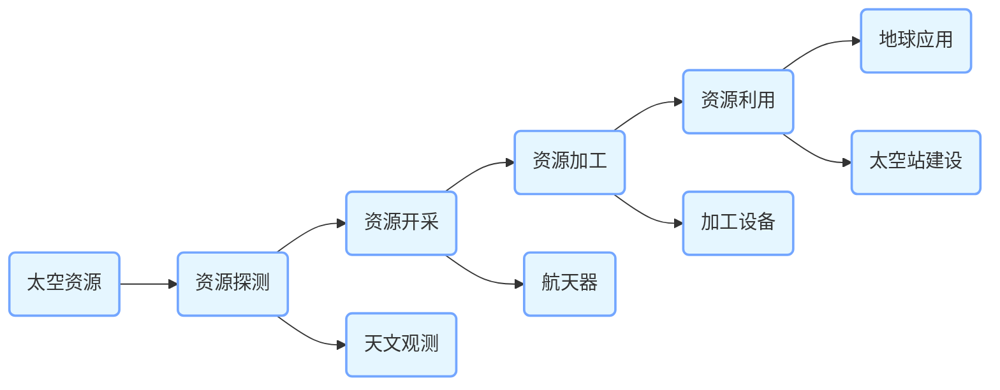

# 价值投资中的太空资源利用技术前景

> 关键词：价值投资、太空资源利用技术、前景分析、投资策略、资源开发

> 摘要：本文聚焦于价值投资视角下的太空资源利用技术前景。首先介绍了太空资源利用技术的背景，包括目的范围、预期读者等内容。接着阐述核心概念，分析其原理和架构，并给出相应的示意图与流程图。详细讲解了相关核心算法原理和具体操作步骤，通过Python代码进行展示。引入数学模型和公式并举例说明。通过项目实战，给出代码案例并进行详细解释。探讨了太空资源利用技术的实际应用场景，推荐了学习、开发工具和相关论文著作。最后总结了未来发展趋势与挑战，还设置了常见问题解答和扩展阅读参考资料，旨在为价值投资者提供全面且深入的太空资源利用技术前景分析。

## 1. 背景介绍 
### 1.1 目的和范围
随着地球资源的逐渐枯竭以及人类对资源需求的不断增长，太空资源利用技术成为了极具潜力的研究和发展领域。本文的目的在于从价值投资的角度深入剖析太空资源利用技术的前景，为投资者提供专业的分析和决策参考。范围涵盖了太空资源的种类、利用技术的原理和发展现状、相关的投资策略以及未来的发展趋势等方面。

### 1.2 预期读者
本文预期读者主要包括价值投资者，他们希望通过对新兴技术领域的研究，寻找具有长期投资价值的项目；太空技术爱好者，对太空资源利用的原理和发展动态感兴趣；以及相关领域的科研人员和从业者，期望从投资视角获取对技术发展的新见解。

### 1.3 文档结构概述
本文首先介绍太空资源利用技术的背景信息，包括目的、读者和结构等。接着阐述核心概念及其联系，通过示意图和流程图展示其原理和架构。详细讲解核心算法原理和具体操作步骤，结合Python代码进行说明。引入数学模型和公式并举例。通过项目实战给出代码案例并解读。探讨实际应用场景，推荐学习和开发工具以及相关论文著作。最后总结未来发展趋势与挑战，设置常见问题解答和扩展阅读参考资料。

### 1.4 术语表
#### 1.4.1 核心术语定义
- **价值投资**：一种基于对资产内在价值评估的投资策略，投资者通过分析资产的基本面，寻找被低估的资产进行投资，以获取长期的资本增值。
- **太空资源利用技术**：指人类为了满足自身的需求，对太空中的各种资源（如小行星矿产、月球土壤、太阳能等）进行勘探、开发、利用的一系列技术。
- **小行星采矿**：是太空资源利用的一种重要形式，指对小行星上的矿产资源（如金属、水等）进行探测、开采和运回地球或太空站的过程。

#### 1.4.2 相关概念解释
- **太空经济**：指与太空活动相关的所有经济活动的总和，包括太空资源利用、太空旅游、卫星通信等领域。太空资源利用技术是太空经济的重要组成部分。
- **可持续发展**：在满足当代人需求的同时，不损害后代人满足其自身需求的能力。太空资源利用技术的发展应遵循可持续发展的原则，确保资源的合理开发和利用。

#### 1.4.3 缩略词列表
- **NASA**：美国国家航空航天局（National Aeronautics and Space Administration）
- **ESA**：欧洲航天局（European Space Agency）

## 2. 核心概念与联系 
### 核心概念原理
太空资源利用技术的核心在于如何有效地获取、加工和利用太空中的资源。太空中存在着丰富的资源，如小行星上含有大量的金属（如铁、镍、钴等）和水，月球土壤中含有氦 - 3等可用于核聚变的燃料，以及太阳能等清洁能源。

以小行星采矿为例，其原理是首先通过天文观测和探测技术确定潜在的目标小行星，然后派遣航天器前往小行星，利用采矿设备将小行星上的矿产资源开采出来，并进行初步的加工和处理，最后将处理后的资源运回地球或用于太空站的建设和运营。

### 架构示意图


这个示意图展示了太空资源利用技术的整体架构。从太空资源出发，首先进行资源探测，这需要借助天文观测等手段。探测到资源后进行开采，开采过程依赖航天器等设备。开采出来的资源进行加工，使用专门的加工设备。最后加工后的资源可用于地球应用和太空站建设等方面。

## 3. 核心算法原理 & 具体操作步骤 
### 资源探测算法原理
在太空资源探测中，一个重要的算法是目标小行星的轨道预测算法。以下是一个简化的Python代码示例，用于模拟小行星轨道的预测：

```python
import numpy as np
import matplotlib.pyplot as plt

# 定义小行星轨道参数
a = 2.0  # 半长轴（天文单位）
e = 0.2  # 偏心率
i = np.radians(10)  # 轨道倾角
Omega = np.radians(30)  # 升交点赤经
omega = np.radians(45)  # 近心点角距
M0 = np.radians(60)  # 初始平近点角

# 定义时间范围
t = np.linspace(0, 10, 100)  # 时间（年）

# 计算平近点角
M = M0 + 2 * np.pi * t / np.sqrt(a**3)

# 迭代求解偏近点角
E = M.copy()
for _ in range(10):
    E = M + e * np.sin(E)

# 计算真近点角
nu = 2 * np.arctan2(np.sqrt(1 + e) * np.sin(E / 2), np.sqrt(1 - e) * np.cos(E / 2))

# 计算小行星在轨道平面内的位置
r = a * (1 - e**2) / (1 + e * np.cos(nu))
x_orbit = r * np.cos(nu)
y_orbit = r * np.sin(nu)

# 坐标转换到黄道坐标系
R1 = np.array([
    [np.cos(Omega), -np.sin(Omega), 0],
    [np.sin(Omega), np.cos(Omega), 0],
    [0, 0, 1]
])
R2 = np.array([
    [1, 0, 0],
    [0, np.cos(i), -np.sin(i)],
    [0, np.sin(i), np.cos(i)]
])
R3 = np.array([
    [np.cos(omega), -np.sin(omega), 0],
    [np.sin(omega), np.cos(omega), 0],
    [0, 0, 1]
])
R = np.dot(np.dot(R1, R2), R3)

x = []
y = []
z = []
for j in range(len(x_orbit)):
    pos_orbit = np.array([x_orbit[j], y_orbit[j], 0])
    pos_ecliptic = np.dot(R, pos_orbit)
    x.append(pos_ecliptic[0])
    y.append(pos_ecliptic[1])
    z.append(pos_ecliptic[2])

# 绘制小行星轨道
plt.figure(figsize=(10, 8))
plt.plot(x, y, label='Asteroid Orbit')
plt.xlabel('X (AU)')
plt.ylabel('Y (AU)')
plt.title('Asteroid Orbit Prediction')
plt.legend()
plt.grid(True)
plt.show()
```

### 具体操作步骤
1. **数据收集**：收集目标小行星的初始轨道参数，如半长轴、偏心率、轨道倾角等。这些参数可以通过天文观测获得。
2. **算法选择**：选择合适的轨道预测算法，如上述的迭代求解偏近点角的方法。
3. **代码实现**：使用编程语言（如Python）实现算法，进行轨道计算。
4. **结果分析**：对计算得到的轨道数据进行分析，确定小行星的位置和运动轨迹，为后续的资源探测和开采提供依据。

## 4. 数学模型和公式 & 详细讲解 & 举例说明 
### 开普勒定律
开普勒定律是描述行星运动的基本定律，同样适用于小行星的运动。

#### 开普勒第一定律（轨道定律）
行星绕太阳运动的轨道是一个椭圆，太阳位于椭圆的一个焦点上。椭圆的方程可以表示为：
$$r = \frac{a(1 - e^{2})}{1 + e\cos\nu}$$
其中，$r$ 是行星到太阳的距离，$a$ 是椭圆的半长轴，$e$ 是椭圆的偏心率，$\nu$ 是真近点角。

#### 开普勒第二定律（面积定律）
行星和太阳的连线在相等的时间内扫过相等的面积。用数学公式表示为：
$$\frac{dA}{dt}=\frac{1}{2}r^{2}\frac{d\nu}{dt}=\text{常数}$$
其中，$A$ 是行星和太阳连线扫过的面积，$t$ 是时间。

#### 开普勒第三定律（周期定律）
行星绕太阳公转的周期的平方与椭圆轨道半长轴的立方成正比。即：
$$T^{2}=k a^{3}$$
其中，$T$ 是行星的公转周期，$k$ 是一个与太阳质量有关的常数。

### 举例说明
假设我们要计算一个小行星的公转周期。已知该小行星的半长轴 $a = 2$ 天文单位（AU），根据开普勒第三定律，对于太阳系内的天体，$k = 1$（当 $T$ 以年为单位，$a$ 以天文单位为单位时）。则该小行星的公转周期为：
$$T=\sqrt{a^{3}}=\sqrt{2^{3}}=\sqrt{8}\approx 2.83\text{ 年}$$

## 5. 项目实战：代码实际案例和详细解释说明 
### 5.1  开发环境搭建
- **操作系统**：推荐使用Linux或Mac OS系统，因为它们对科学计算和编程有更好的支持。
- **编程语言**：Python，它具有丰富的科学计算库，如NumPy、SciPy和Matplotlib等。
- **安装依赖库**：使用以下命令安装所需的库：
```sh
pip install numpy scipy matplotlib
```

### 5.2  源代码详细实现和代码解读
以下是一个完整的小行星资源探测模拟代码示例：

```python
import numpy as np
import matplotlib.pyplot as plt

# 定义小行星参数
asteroid_mass = 1e10  # 小行星质量（kg）
asteroid_radius = 1000  # 小行星半径（m）
asteroid_density = asteroid_mass / ((4/3) * np.pi * asteroid_radius**3)  # 小行星密度（kg/m^3）

# 定义探测器参数
detector_mass = 1000  # 探测器质量（kg）
detector_speed = 10000  # 探测器速度（m/s）

# 模拟探测器接近小行星的过程
time_steps = 1000
time = np.linspace(0, 10000, time_steps)
distance = []
current_distance = 1e7  # 初始距离（m）
for t in time:
    current_distance -= detector_speed * (t / time_steps)
    distance.append(current_distance)

# 计算引力作用
G = 6.67430e-11  # 引力常数（m^3 kg^-1 s^-2）
force = []
for d in distance:
    f = G * asteroid_mass * detector_mass / d**2
    force.append(f)

# 绘制距离和引力随时间的变化曲线
plt.figure(figsize=(12, 6))

plt.subplot(1, 2, 1)
plt.plot(time, distance)
plt.xlabel('Time (s)')
plt.ylabel('Distance to Asteroid (m)')
plt.title('Distance vs Time')

plt.subplot(1, 2, 2)
plt.plot(time, force)
plt.xlabel('Time (s)')
plt.ylabel('Gravitational Force (N)')
plt.title('Gravitational Force vs Time')

plt.tight_layout()
plt.show()
```

### 代码解读与分析
- **参数定义**：首先定义了小行星和探测器的参数，如质量、半径、速度等。
- **模拟过程**：通过循环模拟探测器接近小行星的过程，计算每个时间步的距离。
- **引力计算**：根据万有引力定律计算探测器和小行星之间的引力。
- **绘图**：使用Matplotlib库绘制距离和引力随时间的变化曲线，直观展示探测器接近小行星的过程中距离和引力的变化情况。

## 6. 实际应用场景 
### 太空站建设
太空资源利用技术可以为太空站的建设提供必要的材料和能源。例如，从小行星上开采的金属可以用于制造太空站的结构部件，而水可以分解为氢和氧，用于提供推进剂和生命支持系统所需的氧气。

### 地球资源补充
随着地球资源的逐渐枯竭，太空资源可以作为地球资源的补充。例如，小行星上的金属矿产可以运回地球，用于工业生产。

### 深空探测和星际旅行
太空资源利用技术可以支持深空探测和星际旅行任务。在太空中获取资源可以减少从地球携带大量物资的需求，降低任务成本和风险。例如，在火星基地建设中，可以利用火星上的资源（如二氧化碳、水冰等）生产燃料和氧气。

## 7. 工具和资源推荐
### 7.1 学习资源推荐
#### 7.1.1 书籍推荐
- 《太空资源：小行星、彗星和月球的探索与开发》：全面介绍了太空资源的种类、探测和开发技术。
- 《天体力学基础》：深入讲解了天体运动的基本原理和数学模型，对于理解太空资源利用中的轨道计算等问题有很大帮助。

#### 7.1.2 在线课程
- Coursera上的“太空探索与技术”课程：由知名大学的教授授课，涵盖了太空资源利用、航天工程等多个方面的知识。
- edX上的“天体力学与航天动力学”课程：专注于天体力学的理论和应用，提供了丰富的案例和实践项目。

#### 7.1.3 技术博客和网站
- NASA官方网站：提供了大量关于太空探索和资源利用的最新研究成果和项目信息。
- 太空探索技术公司（SpaceX）的博客：分享了他们在航天技术和太空资源利用方面的实践经验和创新成果。

### 7.2 开发工具框架推荐
#### 7.2.1 IDE和编辑器
- PyCharm：功能强大的Python集成开发环境，提供了代码编辑、调试、版本控制等一系列功能。
- Jupyter Notebook：交互式的编程环境，适合进行数据分析和可视化，对于太空资源利用中的数据处理和模拟非常有用。

#### 7.2.2 调试和性能分析工具
- PDB：Python自带的调试工具，可以帮助开发者定位代码中的错误。
- cProfile：用于分析Python代码的性能，找出性能瓶颈。

#### 7.2.3 相关框架和库
- NumPy：用于高效的数值计算，在太空资源利用中的轨道计算、数据处理等方面有广泛应用。
- SciPy：提供了丰富的科学计算算法，如优化算法、积分算法等。
- Matplotlib：用于数据可视化，将计算结果以图表的形式直观展示。

### 7.3 相关论文著作推荐
#### 7.3.1 经典论文
- “The Economic Potential of Asteroid Mining”：探讨了小行星采矿的经济可行性和潜在价值。
- “Lunar Resources and Their Utilization”：研究了月球资源的种类和利用方法。

#### 7.3.2 最新研究成果
- 关注《行星科学杂志》《宇航学报》等学术期刊，获取太空资源利用技术的最新研究进展。

#### 7.3.3 应用案例分析
- 分析NASA的小行星探测任务和SpaceX的火星探索计划等实际案例，了解太空资源利用技术在实际项目中的应用和挑战。

## 8. 总结：未来发展趋势与挑战
### 未来发展趋势
- **技术创新加速**：随着科技的不断进步，太空资源利用技术将不断创新，如更高效的采矿设备、更精确的资源探测技术等。
- **商业化进程加快**：越来越多的商业公司将参与到太空资源利用领域，推动太空经济的发展。
- **国际合作加强**：太空资源利用是一个全球性的挑战，需要各国之间加强合作，共同开发和利用太空资源。

### 挑战
- **技术难题**：目前太空资源利用技术还面临许多技术难题，如小行星的精确捕获和开采、资源的高效加工和运输等。
- **法律和政策问题**：太空资源的所有权和开发权等法律和政策问题尚未明确，需要国际社会共同制定相关的规则和标准。
- **成本高昂**：太空资源利用项目的成本非常高昂，需要大量的资金投入和长期的研发。

## 9. 附录：常见问题与解答
### 问题1：太空资源利用技术的投资风险大吗？
解答：太空资源利用技术的投资风险相对较大。一方面，该领域技术还不够成熟，存在许多技术难题需要攻克；另一方面，项目的成本高昂，回报周期长。但是，如果技术取得突破，太空资源利用将具有巨大的商业价值。

### 问题2：普通人可以参与太空资源利用技术的投资吗？
解答：普通人可以通过投资相关的上市公司股票、基金等方式间接参与太空资源利用技术的投资。不过，在投资前需要充分了解该领域的风险和收益情况，做好风险评估。

### 问题3：太空资源利用技术对环境有影响吗？
解答：太空资源利用技术本身对地球环境的直接影响较小。但是，在太空资源开采和运输过程中，如果操作不当，可能会对太空环境造成一定的影响，如产生太空垃圾等。因此，需要制定相应的环保措施和规范。

## 10. 扩展阅读 & 参考资料
- 齐奥尔科夫斯基，《利用喷气装置探索宇宙空间》
- 戈达德，《到达极高空的方法》
- 奥伯特，《飞往星际空间的火箭》
- 科罗廖夫，苏联航天事业的发展相关资料
- 布劳恩，美国航天事业发展及相关技术研究资料

作者：AI天才研究院/AI Genius Institute & 禅与计算机程序设计艺术 /Zen And The Art of Computer Programming