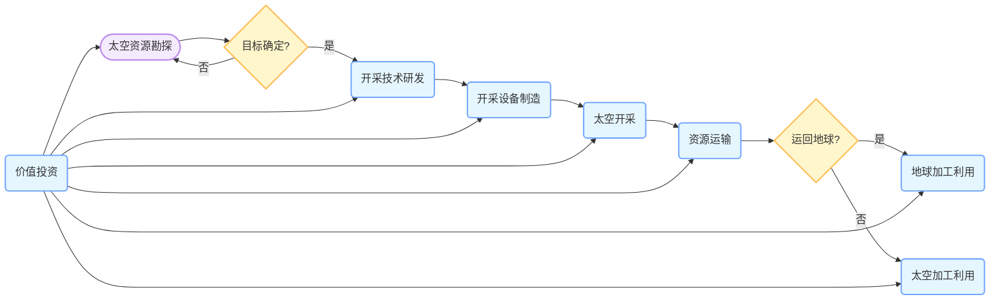

# 价值投资中的太空采矿技术发展趋势

> 关键词：价值投资、太空采矿技术、发展趋势、资源开发、商业前景

> 摘要：本文聚焦于价值投资视角下的太空采矿技术发展趋势。首先介绍了太空采矿技术的背景，包括其目的、预期读者等内容。接着阐述了太空采矿技术的核心概念与联系，详细讲解了核心算法原理及具体操作步骤，运用数学模型和公式进行深入分析并举例说明。通过项目实战案例，展示了太空采矿技术相关代码的实现与解读。探讨了太空采矿技术的实际应用场景，推荐了相关的工具和资源。最后总结了未来发展趋势与挑战，解答了常见问题并提供了扩展阅读和参考资料，旨在为投资者和相关从业者全面了解太空采矿技术的价值和发展方向提供参考。

## 1. 背景介绍 
### 1.1 目的和范围
太空采矿技术作为一个新兴且极具潜力的领域，吸引了众多投资者的目光。本文章的目的在于从价值投资的角度深入剖析太空采矿技术的发展趋势，帮助投资者更好地理解该领域的投资价值和风险。范围涵盖太空采矿技术的基本原理、核心算法、数学模型、实际应用场景以及未来发展前景等多个方面。

### 1.2 预期读者
本文预期读者主要包括对太空采矿技术有投资意向的投资者，希望了解该领域技术发展动态的科研人员，以及对太空资源开发感兴趣的行业从业者和爱好者。

### 1.3 文档结构概述
本文首先介绍太空采矿技术的背景信息，包括目的、读者和文档结构等。接着阐述核心概念与联系，通过文本示意图和 Mermaid 流程图展示其原理和架构。详细讲解核心算法原理和具体操作步骤，并给出 Python 源代码示例。运用数学模型和公式对太空采矿技术进行深入分析并举例说明。通过项目实战展示代码实现和解读。探讨实际应用场景，推荐相关工具和资源。最后总结未来发展趋势与挑战，解答常见问题并提供扩展阅读和参考资料。

### 1.4 术语表
#### 1.4.1 核心术语定义
- **太空采矿技术**：指在地球大气层以外的宇宙空间中，对小行星、月球等天体上的矿产资源进行勘探、开采和利用的一系列技术。
- **价值投资**：一种基于对资产内在价值的评估，通过长期投资获取资产增值收益的投资策略。
- **小行星资源**：小行星上蕴含的各种矿产资源，如铁、镍、钴、铂族金属等。
- **太空机器人**：用于在太空环境中执行各种任务，如勘探、开采等的机器人。

#### 1.4.2 相关概念解释
- **近地小行星**：轨道与地球轨道接近的小行星，由于其相对较近的距离，成为太空采矿的重要目标之一。
- **原位资源利用（ISRU）**：在太空中直接利用当地资源，减少从地球运输物资的需求，提高太空任务的经济性和可持续性。

#### 1.4.3 缩略词列表
- **ISRU**：原位资源利用（In-Situ Resource Utilization）
- **NASA**：美国国家航空航天局（National Aeronautics and Space Administration）

## 2. 核心概念与联系 
太空采矿技术涉及多个学科领域，其核心概念包括太空资源勘探、开采、运输和利用等环节。下面通过文本示意图和 Mermaid 流程图来展示其原理和架构。

### 文本示意图
太空采矿技术的核心概念与联系可以用以下方式描述：
太空资源勘探是太空采矿的第一步，通过天文观测、遥感等技术手段，确定具有开采价值的天体目标。一旦确定目标，就需要进行开采技术的研发和设备的制造，包括太空机器人、开采工具等。开采出的资源需要通过运输系统运回地球或在太空中进行加工利用。在整个过程中，原位资源利用技术可以提高资源的利用效率，降低成本。同时，价值投资贯穿于太空采矿技术的各个环节，投资者需要评估项目的技术可行性、经济可行性和市场前景等因素，以确定投资价值。

### Mermaid 流程图


## 3. 核心算法原理 & 具体操作步骤 
### 核心算法原理
太空采矿技术中的一个重要算法是小行星轨道预测算法，用于确定小行星的轨道参数，以便选择合适的开采时机和轨道。下面是一个简单的小行星轨道预测算法的 Python 实现：

```python
import numpy as np
from scipy.integrate import odeint

# 定义小行星运动的微分方程
def asteroid_ode(y, t, mu):
    """
    y: 状态向量 [x, y, z, vx, vy, vz]
    t: 时间
    mu: 引力常数
    """
    x, y, z, vx, vy, vz = y
    r = np.sqrt(x**2 + y**2 + z**2)
    dxdt = vx
    dydt = vy
    dzdt = vz
    dvxdt = -mu * x / r**3
    dvydt = -mu * y / r**3
    dvzdt = -mu * z / r**3
    return [dxdt, dydt, dzdt, dvxdt, dvydt, dvzdt]

# 初始条件
x0 = 1.0e9  # 初始位置 x
y0 = 0.0
z0 = 0.0
vx0 = 0.0  # 初始速度 vx
vy0 = 2000.0
vz0 = 0.0
y0 = [x0, y0, z0, vx0, vy0, vz0]

# 引力常数
mu = 3.986e14  # 地球引力常数

# 时间范围
t = np.linspace(0, 365 * 24 * 3600, 1000)  # 一年的时间

# 求解微分方程
solution = odeint(asteroid_ode, y0, t, args=(mu,))

# 提取位置信息
x = solution[:, 0]
y = solution[:, 1]
z = solution[:, 2]

# 打印结果
for i in range(len(t)):
    print(f"时间: {t[i] / (24 * 3600)} 天, 位置: ({x[i]}, {y[i]}, {z[i]})")
```

### 具体操作步骤
1. **数据收集**：收集小行星的初始位置、速度等观测数据。
2. **模型选择**：选择合适的轨道预测模型，如上述的微分方程模型。
3. **参数确定**：确定模型中的参数，如引力常数等。
4. **求解方程**：使用数值方法求解微分方程，得到小行星在不同时间的位置和速度。
5. **结果分析**：分析预测结果，确定小行星的轨道特性，为开采任务提供决策依据。

## 4. 数学模型和公式 & 详细讲解 & 举例说明 
### 数学模型
太空采矿技术中的轨道预测问题可以用牛顿万有引力定律来描述。牛顿万有引力定律的数学表达式为：

$$F = G\frac{m_1m_2}{r^2}$$

其中，$F$ 是两个物体之间的引力，$G$ 是万有引力常数，$m_1$ 和 $m_2$ 是两个物体的质量，$r$ 是两个物体之间的距离。

对于小行星的运动，根据牛顿第二定律 $F = ma$，可以得到小行星的运动方程：

$$\ddot{\mathbf{r}} = -\frac{\mu}{r^3}\mathbf{r}$$

其中，$\mathbf{r}$ 是小行星的位置向量，$\mu = GM$ 是引力常数，$M$ 是中心天体（如地球）的质量。

### 详细讲解
上述运动方程是一个二阶常微分方程，可以通过数值方法求解。在 Python 代码中，我们使用 `odeint` 函数来求解这个微分方程。`odeint` 函数是 SciPy 库中的一个求解常微分方程的函数，它的基本用法是：

```python
solution = odeint(func, y0, t, args)
```

其中，`func` 是定义的微分方程函数，`y0` 是初始条件，`t` 是时间范围，`args` 是传递给微分方程函数的额外参数。

### 举例说明
假设我们要预测一个小行星在地球引力场中的运动。已知小行星的初始位置为 $(1.0\times10^9, 0, 0)$ 米，初始速度为 $(0, 2000, 0)$ 米/秒，地球的引力常数 $\mu = 3.986\times10^{14}$ 米$^3$/秒$^2$。我们可以使用上述的 Python 代码来预测小行星在一年时间内的运动轨迹。

运行代码后，我们可以得到小行星在不同时间的位置信息，通过绘制这些位置信息，我们可以直观地看到小行星的运动轨迹。

## 5. 项目实战：代码实际案例和详细解释说明 
### 5.1  开发环境搭建
要运行上述的 Python 代码，需要安装以下库：
- **NumPy**：用于数值计算。
- **SciPy**：用于求解常微分方程。

可以使用以下命令来安装这些库：

```sh
pip install numpy scipy
```

### 5.2  源代码详细实现和代码解读
```python
import numpy as np
from scipy.integrate import odeint

# 定义小行星运动的微分方程
def asteroid_ode(y, t, mu):
    """
    y: 状态向量 [x, y, z, vx, vy, vz]
    t: 时间
    mu: 引力常数
    """
    x, y, z, vx, vy, vz = y
    r = np.sqrt(x**2 + y**2 + z**2)
    dxdt = vx
    dydt = vy
    dzdt = vz
    dvxdt = -mu * x / r**3
    dvydt = -mu * y / r**3
    dvzdt = -mu * z / r**3
    return [dxdt, dydt, dzdt, dvxdt, dvydt, dvzdt]

# 初始条件
x0 = 1.0e9  # 初始位置 x
y0 = 0.0
z0 = 0.0
vx0 = 0.0  # 初始速度 vx
vy0 = 2000.0
vz0 = 0.0
y0 = [x0, y0, z0, vx0, vy0, vz0]

# 引力常数
mu = 3.986e14  # 地球引力常数

# 时间范围
t = np.linspace(0, 365 * 24 * 3600, 1000)  # 一年的时间

# 求解微分方程
solution = odeint(asteroid_ode, y0, t, args=(mu,))

# 提取位置信息
x = solution[:, 0]
y = solution[:, 1]
z = solution[:, 2]

# 打印结果
for i in range(len(t)):
    print(f"时间: {t[i] / (24 * 3600)} 天, 位置: ({x[i]}, {y[i]}, {z[i]})")
```

### 代码解读与分析
1. **导入库**：导入 `numpy` 和 `scipy.integrate` 库，用于数值计算和求解常微分方程。
2. **定义微分方程**：`asteroid_ode` 函数定义了小行星的运动方程，根据牛顿万有引力定律和牛顿第二定律推导得到。
3. **设置初始条件**：设置小行星的初始位置和速度，以及地球的引力常数。
4. **设置时间范围**：使用 `np.linspace` 函数生成一年时间内的时间点。
5. **求解微分方程**：使用 `odeint` 函数求解微分方程，得到小行星在不同时间的状态向量。
6. **提取位置信息**：从求解结果中提取小行星的位置信息。
7. **打印结果**：打印小行星在不同时间的位置信息。

## 6. 实际应用场景 
太空采矿技术具有广阔的实际应用场景，主要包括以下几个方面：
### 资源开发
小行星和月球等天体上蕴含着丰富的矿产资源，如铁、镍、钴、铂族金属等。通过太空采矿技术，可以将这些资源开采并运回地球，满足地球上日益增长的资源需求。

### 太空基础设施建设
在太空中建设空间站、太空望远镜等基础设施需要大量的材料和资源。太空采矿技术可以在太空中直接获取这些资源，减少从地球运输物资的成本和风险。

### 能源利用
一些小行星上可能含有丰富的氢、氦等能源资源。通过太空采矿技术，可以将这些能源资源开采并利用，为太空探索和太空开发提供能源支持。

### 科学研究
太空采矿技术可以为科学研究提供更多的样本和数据。通过对小行星和月球等天体的采样和分析，可以深入了解太阳系的形成和演化过程。

## 7. 工具和资源推荐
### 7.1 学习资源推荐
#### 7.1.1 书籍推荐
- 《太空资源开发》：全面介绍了太空资源的种类、分布和开发技术，是学习太空采矿技术的重要参考书籍。
- 《天体力学基础》：讲解了天体运动的基本原理和方法，对于理解太空采矿技术中的轨道预测问题有很大帮助。

#### 7.1.2 在线课程
- Coursera 上的“太空探索技术”课程：由知名高校的教授授课，涵盖了太空采矿技术的多个方面。
- edX 上的“天体力学与航天动力学”课程：深入讲解了天体力学的基本理论和应用，对于学习太空采矿技术的轨道预测算法有很大帮助。

#### 7.1.3 技术博客和网站
- NASA 官方网站：提供了大量关于太空探索和太空采矿技术的最新研究成果和新闻资讯。
- 中国国家航天局官方网站：发布了中国在太空探索领域的最新进展和研究成果。

### 7.2 开发工具框架推荐
#### 7.2.1 IDE和编辑器
- PyCharm：一款功能强大的 Python 集成开发环境，适合开发太空采矿技术相关的 Python 代码。
- Visual Studio Code：一款轻量级的代码编辑器，支持多种编程语言，可用于开发和调试太空采矿技术相关的代码。

#### 7.2.2 调试和性能分析工具
- PySnooper：一个简单易用的 Python 调试工具，可以帮助开发者快速定位代码中的问题。
- cProfile：Python 内置的性能分析工具，可以分析代码的性能瓶颈。

#### 7.2.3 相关框架和库
- NumPy：用于数值计算，是太空采矿技术中进行轨道预测等数值计算的重要库。
- SciPy：提供了丰富的科学计算工具，如求解常微分方程、优化算法等。

### 7.3 相关论文著作推荐
#### 7.3.1 经典论文
- “The Economic Potential of Asteroid Mining”：探讨了小行星采矿的经济潜力和可行性。
- “Orbit Determination and Prediction of Near - Earth Asteroids”：研究了近地小行星的轨道确定和预测方法。

#### 7.3.2 最新研究成果
- 每年在国际宇航大会（IAC）上发表的关于太空采矿技术的最新研究论文。
- 《Acta Astronautica》等航天领域的学术期刊上发表的相关研究成果。

#### 7.3.3 应用案例分析
- 对已经实施的太空探索任务中涉及的资源勘探和利用技术进行案例分析，如阿波罗计划中对月球资源的研究和利用。

## 8. 总结：未来发展趋势与挑战
### 未来发展趋势
- **技术创新**：随着科技的不断进步，太空采矿技术将不断创新和发展。例如，更先进的太空机器人技术将提高开采效率，更精确的轨道预测算法将降低开采风险。
- **商业合作**：太空采矿技术的商业化趋势将越来越明显，各国政府和企业之间的合作将更加紧密。通过商业合作，可以共享资源和技术，降低成本，提高太空采矿项目的成功率。
- **多元化应用**：太空采矿技术的应用领域将不断拓展，除了资源开发和太空基础设施建设外，还将在能源利用、科学研究等领域发挥重要作用。

### 挑战
- **技术难题**：太空采矿技术面临着许多技术难题，如太空环境的复杂性、资源勘探和开采技术的难度等。解决这些技术难题需要大量的研发投入和时间。
- **法律和政策**：目前，太空