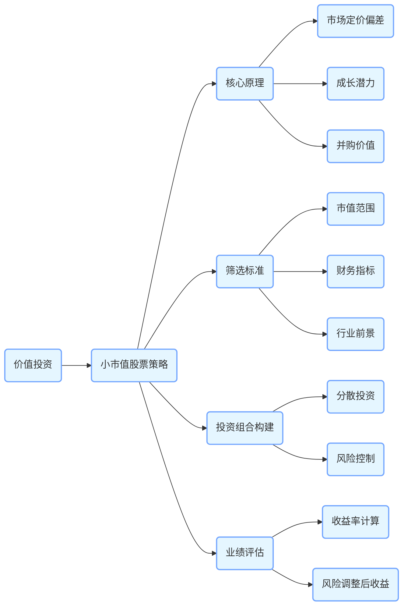

# 价值投资中的小市值股票策略

> 关键词：价值投资、小市值股票策略、财务分析、风险管理、市场效率

> 摘要：本文深入探讨了价值投资领域中的小市值股票策略。首先介绍了该策略的背景，包括目的、预期读者、文档结构和相关术语。接着阐述了小市值股票的核心概念及其与价值投资的联系，并通过示意图和流程图展示其架构。详细讲解了核心算法原理，结合 Python 代码进行具体操作步骤的说明。运用数学模型和公式对策略进行量化分析，并举例说明。通过项目实战，从开发环境搭建到源代码实现和解读，全面呈现策略的实际应用。分析了小市值股票策略的实际应用场景，推荐了学习、开发工具和相关论文著作。最后总结了未来发展趋势与挑战，解答常见问题并提供扩展阅读和参考资料，旨在为投资者提供全面、深入的小市值股票策略指导。

## 1. 背景介绍 
### 1.1 目的和范围
价值投资一直是金融投资领域的重要理念，旨在寻找被市场低估的股票并长期持有以获取超额收益。小市值股票策略作为价值投资的一种特殊形式，聚焦于市值相对较小的公司股票。本文章的目的在于深入剖析小市值股票策略的原理、方法和应用，帮助投资者更好地理解和运用这一策略。范围涵盖了小市值股票的定义、筛选标准、核心算法、数学模型、实际案例以及相关工具和资源等方面。

### 1.2 预期读者
本文预期读者包括对价值投资感兴趣的个人投资者、金融机构的投资分析师、基金经理以及相关领域的研究人员。无论您是初涉投资领域的新手，还是经验丰富的专业人士，都能从本文中获取有价值的信息和见解。

### 1.3 文档结构概述
本文将按照以下结构进行阐述：首先介绍小市值股票策略的核心概念和与价值投资的联系；接着详细讲解核心算法原理和具体操作步骤，并给出 Python 代码示例；然后运用数学模型和公式对策略进行量化分析，并举例说明；通过项目实战展示策略的实际应用；分析小市值股票策略的实际应用场景；推荐相关的学习资源、开发工具和论文著作；最后总结未来发展趋势与挑战，解答常见问题并提供扩展阅读和参考资料。

### 1.4 术语表
#### 1.4.1 核心术语定义
- **价值投资**：一种投资策略，通过分析股票的内在价值，寻找被市场低估的股票进行投资，以获取长期的资本增值。
- **小市值股票**：通常指市值相对较小的公司股票。市值的划分标准可能因市场和研究目的而异，一般来说，在国内 A 股市场，市值低于 50 亿元的股票可视为小市值股票。
- **市值**：指一家上市公司的发行股份按市场价格计算出来的股票总价值，计算公式为：市值 = 每股价格 × 发行股份总数。
- **内在价值**：股票所代表的公司的真实价值，通常通过对公司的财务状况、盈利能力、行业前景等因素进行分析来评估。

#### 1.4.2 相关概念解释
- **市场效率**：指市场价格反映所有可用信息的程度。在有效市场中，股票价格能够及时、准确地反映公司的内在价值；而在非有效市场中，股票价格可能会偏离其内在价值，为价值投资者提供了获取超额收益的机会。
- **财务分析**：通过对公司的财务报表（如资产负债表、利润表、现金流量表）进行分析，评估公司的财务状况、盈利能力、偿债能力等，为投资决策提供依据。
- **风险管理**：在投资过程中，通过采取一系列措施（如分散投资、设置止损点等）来降低投资风险，确保投资组合的稳定性和安全性。

#### 1.4.3 缩略词列表
- **PE**：市盈率（Price-to-Earnings Ratio），指股票价格除以每股收益的比率，反映了市场对公司盈利的预期。
- **PB**：市净率（Price-to-Book Ratio），指股票价格除以每股净资产的比率，反映了市场对公司净资产的估值。
- **ROE**：净资产收益率（Return on Equity），指公司净利润与净资产的比率，反映了公司运用自有资本的效率。

## 2. 核心概念与联系 
### 核心概念原理
小市值股票策略基于以下几个核心原理：

#### 市场定价偏差
由于小市值公司通常受到的市场关注度较低，研究覆盖不足，其股票价格可能更容易偏离其内在价值。这为价值投资者提供了发现被低估股票的机会。例如，一些小市值公司可能拥有独特的技术、产品或市场地位，但由于规模较小，尚未被市场充分认识和挖掘，导致其股票价格被低估。

#### 成长潜力
小市值公司往往具有较大的成长潜力。相对于大市值公司，小市值公司在业务拓展、市场份额增长等方面具有更大的灵活性和空间。一旦公司的业务取得突破，其业绩和股价可能会实现大幅增长。例如，一些新兴行业的小市值公司，随着行业的快速发展和自身竞争力的提升，有可能成长为行业的领军企业。

#### 并购价值
小市值公司可能成为大公司并购的对象。大公司为了实现业务扩张、技术整合等目的，可能会收购小市值公司。在并购过程中，小市值公司的股东通常能够获得一定的溢价收益。

### 架构的文本示意图
```plaintext
价值投资
|
|-- 小市值股票策略
|   |
|   |-- 核心原理
|   |   |-- 市场定价偏差
|   |   |-- 成长潜力
|   |   |-- 并购价值
|   |
|   |-- 筛选标准
|   |   |-- 市值范围
|   |   |-- 财务指标
|   |   |-- 行业前景
|   |
|   |-- 投资组合构建
|   |   |-- 分散投资
|   |   |-- 风险控制
|   |
|   |-- 业绩评估
|       |-- 收益率计算
|       |-- 风险调整后收益
```

### Mermaid 流程图


## 3. 核心算法原理 & 具体操作步骤 
### 核心算法原理
小市值股票策略的核心算法主要包括股票筛选和投资组合构建两个部分。

#### 股票筛选
股票筛选的目的是从众多小市值股票中选出具有投资价值的股票。常用的筛选指标包括市值、市盈率（PE）、市净率（PB）、净资产收益率（ROE）等。具体筛选标准如下：
- **市值范围**：选择市值低于一定阈值的股票，如 50 亿元。
- **市盈率（PE）**：选择 PE 低于行业平均水平的股票，以确保股票具有较低的估值。
- **市净率（PB）**：选择 PB 低于行业平均水平的股票，以确保股票的净资产得到合理估值。
- **净资产收益率（ROE）**：选择 ROE 高于行业平均水平的股票，以确保公司具有较强的盈利能力。

#### 投资组合构建
投资组合构建的目的是通过分散投资降低风险，提高投资组合的稳定性和收益性。常用的投资组合构建方法包括等权重法、市值加权法等。具体操作步骤如下：
- **确定投资组合的股票数量**：根据投资者的风险承受能力和投资目标，确定投资组合中包含的股票数量，一般建议为 10 - 20 只。
- **计算每只股票的权重**：根据投资组合构建方法，计算每只股票在投资组合中的权重。
- **买入股票**：按照计算得到的权重，买入相应数量的股票。

### 具体操作步骤
以下是使用 Python 实现小市值股票策略的具体操作步骤：

```python
import pandas as pd
import tushare as ts

# 设置 tushare token
ts.set_token('your_token')
pro = ts.pro_api()

# 步骤 1：获取股票基本信息
def get_stock_basic():
    data = pro.stock_basic(exchange='', list_status='L', fields='ts_code,symbol,name,area,industry,market,list_date')
    return data

# 步骤 2：筛选小市值股票
def filter_small_cap_stocks(data, cap_threshold=50):
    # 获取市值数据
    df_daily_basic = pro.daily_basic(ts_code='', trade_date='', fields='ts_code,total_mv')
    # 合并数据
    merged_data = pd.merge(data, df_daily_basic, on='ts_code')
    # 筛选小市值股票
    small_cap_stocks = merged_data[merged_data['total_mv'] < cap_threshold]
    return small_cap_stocks

# 步骤 3：筛选具有投资价值的股票
def filter_valuable_stocks(small_cap_stocks):
    # 获取财务数据
    financial_data = []
    for ts_code in small_cap_stocks['ts_code']:
        df_income = pro.income(ts_code=ts_code, fields='ts_code,end_date,total_revenue,n_income')
        df_balance = pro.balancesheet(ts_code=ts_code, fields='ts_code,end_date,total_assets,total_liab')
        df_cashflow = pro.cashflow(ts_code=ts_code, fields='ts_code,end_date,net_cashflow_oper_act')
        # 合并财务数据
        merged_financial_data = pd.merge(df_income, df_balance, on=['ts_code', 'end_date'])
        merged_financial_data = pd.merge(merged_financial_data, df_cashflow, on=['ts_code', 'end_date'])
        financial_data.append(merged_financial_data)
    financial_data = pd.concat(financial_data)
    # 计算财务指标
    financial_data['pe'] = financial_data['total_mv'] / financial_data['n_income']
    financial_data['pb'] = financial_data['total_mv'] / (financial_data['total_assets'] - financial_data['total_liab'])
    financial_data['roe'] = financial_data['n_income'] / (financial_data['total_assets'] - financial_data['total_liab'])
    # 筛选具有投资价值的股票
    valuable_stocks = financial_data[(financial_data['pe'] < financial_data['pe'].mean()) &
                                      (financial_data['pb'] < financial_data['pb'].mean()) &
                                      (financial_data['roe'] > financial_data['roe'].mean())]
    return valuable_stocks

# 步骤 4：构建投资组合
def build_portfolio(valuable_stocks, num_stocks=10):
    # 等权重法构建投资组合
    portfolio = valuable_stocks.sample(num_stocks)
    portfolio['weight'] = 1 / num_stocks
    return portfolio

# 主函数
def main():
    # 获取股票基本信息
    stock_basic = get_stock_basic()
    # 筛选小市值股票
    small_cap_stocks = filter_small_cap_stocks(stock_basic)
    # 筛选具有投资价值的股票
    valuable_stocks = filter_valuable_stocks(small_cap_stocks)
    # 构建投资组合
    portfolio = build_portfolio(valuable_stocks)
    print(portfolio)

if __name__ == "__main__":
    main()
```

### 代码解释
1. **获取股票基本信息**：使用 tushare 库的 `stock_basic` 函数获取所有上市股票的基本信息，包括股票代码、名称、行业等。
2. **筛选小市值股票**：使用 tushare 库的 `daily_basic` 函数获取所有股票的市值数据，将其与股票基本信息合并，筛选出市值低于 50 亿元的股票。
3. **筛选具有投资价值的股票**：使用 tushare 库的 `income`、`balancesheet` 和 `cashflow` 函数获取每只小市值股票的财务数据，计算市盈率（PE）、市净率（PB）和净资产收益率（ROE）等财务指标，筛选出 PE 低于行业平均水平、PB 低于行业平均水平且 ROE 高于行业平均水平的股票。
4. **构建投资组合**：使用等权重法从具有投资价值的股票中随机选择 10 只股票，构建投资组合，并计算每只股票的权重。

## 4. 数学模型和公式 & 详细讲解 & 举例说明 
### 数学模型和公式
#### 市盈率（PE）
市盈率（PE）是指股票价格除以每股收益的比率，计算公式为：
$$PE = \frac{P}{EPS}$$
其中，$P$ 为股票价格，$EPS$ 为每股收益。

#### 市净率（PB）
市净率（PB）是指股票价格除以每股净资产的比率，计算公式为：
$$PB = \frac{P}{BVPS}$$
其中，$P$ 为股票价格，$BVPS$ 为每股净资产。

#### 净资产收益率（ROE）
净资产收益率（ROE）是指公司净利润与净资产的比率，计算公式为：
$$ROE = \frac{Net\ Income}{Equity}$$
其中，$Net\ Income$ 为公司净利润，$Equity$ 为公司净资产。

#### 投资组合收益率
投资组合收益率是指投资组合中所有股票收益率的加权平均值，计算公式为：
$$R_p = \sum_{i=1}^{n} w_i R_i$$
其中，$R_p$ 为投资组合收益率，$w_i$ 为第 $i$ 只股票在投资组合中的权重，$R_i$ 为第 $i$ 只股票的收益率。

#### 风险调整后收益
风险调整后收益是指考虑了投资组合风险后的收益，常用的风险调整后收益指标包括夏普比率（Sharpe Ratio）、特雷诺比率（Treynor Ratio）等。

夏普比率的计算公式为：
$$Sharpe\ Ratio = \frac{R_p - R_f}{\sigma_p}$$
其中，$R_p$ 为投资组合收益率，$R_f$ 为无风险收益率，$\sigma_p$ 为投资组合的标准差。

### 详细讲解
#### 市盈率（PE）
市盈率是衡量股票估值的重要指标之一。一般来说，市盈率越低，股票的估值越低，投资价值越高。但是，市盈率也受到公司盈利增长预期、行业竞争等因素的影响。例如，一些新兴行业的公司由于具有较高的盈利增长预期，其市盈率可能会相对较高。

#### 市净率（PB）
市净率是衡量股票净资产估值的重要指标之一。一般来说，市净率越低，股票的净资产估值越低，投资价值越高。但是，市净率也受到公司资产质量、行业特点等因素的影响。例如，一些重资产行业的公司由于其资产规模较大，市净率可能会相对较高。

#### 净资产收益率（ROE）
净资产收益率是衡量公司盈利能力的重要指标之一。一般来说，净资产收益率越高，公司的盈利能力越强，投资价值越高。但是，净资产收益率也受到公司财务杠杆、行业竞争等因素的影响。例如，一些高杠杆公司可能会通过增加负债来提高净资产收益率，但同时也会增加公司的财务风险。

#### 投资组合收益率
投资组合收益率反映了投资组合的整体收益水平。通过分散投资，可以降低投资组合的风险，提高投资组合的稳定性和收益性。例如，一个投资组合中包含了多只不同行业、不同市值的股票，当某只股票的表现不佳时，其他股票的表现可能会弥补其损失，从而降低投资组合的整体风险。

#### 风险调整后收益
风险调整后收益考虑了投资组合的风险因素，能够更准确地反映投资组合的绩效。夏普比率是最常用的风险调整后收益指标之一，它衡量了投资组合每承担一单位风险所获得的超额收益。夏普比率越高，投资组合的绩效越好。

### 举例说明
假设我们有一个投资组合，包含了三只股票：A、B、C，其权重分别为 0.3、0.4、0.3，收益率分别为 10%、15%、20%，无风险收益率为 3%，投资组合的标准差为 15%。

#### 投资组合收益率
根据投资组合收益率的计算公式，可得：
$$R_p = 0.3 \times 10\% + 0.4 \times 15\% + 0.3 \times 20\% = 15\%$$

#### 夏普比率
根据夏普比率的计算公式，可得：
$$Sharpe\ Ratio = \frac{15\% - 3\%}{15\%} = 0.8$$

这意味着该投资组合每承担一单位风险所获得的超额收益为 0.8。

## 5. 项目实战：代码实际案例和详细解释说明 
### 5.1  开发环境搭建
#### 安装 Python
首先，需要安装 Python 环境。可以从 Python 官方网站（https://www.python.org/downloads/）下载适合自己操作系统的 Python 安装包，并按照安装向导进行安装。

#### 安装必要的库
使用以下命令安装必要的 Python 库：
```sh
pip install pandas tushare
```
其中，`pandas` 是一个用于数据处理和分析的库，`tushare` 是一个用于获取金融数据的库。

#### 获取 tushare token
在使用 tushare 库之前，需要注册一个 tushare 账号，并获取一个 token。可以登录 tushare 官方网站（https://tushare.pro/）进行注册，注册成功后，在个人中心获取 token。

### 5.2  源代码详细实现和代码解读
以下是完整的源代码：

```python
import pandas as pd
import tushare as ts

# 设置 tushare token
ts.set_token('your_token')
pro = ts.pro_api()

# 步骤 1：获取股票基本信息
def get_stock_basic():
    data = pro.stock_basic(exchange='', list_status='L', fields='ts_code,symbol,name,area,industry,market,list_date')
    return data

# 步骤 2：筛选小市值股票
def filter_small_cap_stocks(data, cap_threshold=50):
    # 获取市值数据
    df_daily_basic = pro.daily_basic(ts_code='', trade_date='', fields='ts_code,total_mv')
    # 合并数据
    merged_data = pd.merge(data, df_daily_basic, on='ts_code')
    # 筛选小市值股票
    small_cap_stocks = merged_data[merged_data['total_mv'] < cap_threshold]
    return small_cap_stocks

# 步骤 3：筛选具有投资价值的股票
def filter_valuable_stocks(small_cap_stocks):
    # 获取财务数据
    financial_data = []
    for ts_code in small_cap_stocks['ts_code']:
        df_income = pro.income(ts_code=ts_code, fields='ts_code,end_date,total_revenue,n_income')
        df_balance = pro.balancesheet(ts_code=ts_code, fields='ts_code,end_date,total_assets,total_liab')
        df_cashflow = pro.cashflow(ts_code=ts_code, fields='ts_code,end_date,net_cashflow_oper_act')
        # 合并财务数据
        merged_financial_data = pd.merge(df_income, df_balance, on=['ts_code', 'end_date'])
        merged_financial_data = pd.merge(merged_financial_data, df_cashflow, on=['ts_code', 'end_date'])
        financial_data.append(merged_financial_data)
    financial_data = pd.concat(financial_data)
    # 计算财务指标
    financial_data['pe'] = financial_data['total_mv'] / financial_data['n_income']
    financial_data['pb'] = financial_data['total_mv'] / (financial_data['total_assets'] - financial_data['total_liab'])
    financial_data['roe'] = financial_data['n_income'] / (financial_data['total_assets'] - financial_data['total_liab'])
    # 筛选具有投资价值的股票
    valuable_stocks = financial_data[(financial_data['pe'] < financial_data['pe'].mean()) &
                                      (financial_data['pb'] < financial_data['pb'].mean()) &
                                      (financial_data['roe'] > financial_data['roe'].mean())]
    return valuable_stocks

# 步骤 4：构建投资组合
def build_portfolio(valuable_stocks, num_stocks=10):
    # 等权重法构建投资组合
    portfolio = valuable_stocks.sample(num_stocks)
    portfolio['weight'] = 1 / num_stocks
    return portfolio

# 主函数
def main():
    # 获取股票基本信息
    stock_basic = get_stock_basic()
    # 筛选小市值股票
    small_cap_stocks = filter_small_cap_stocks(stock_basic)
    # 筛选具有投资价值的股票
    valuable_stocks = filter_valuable_stocks(small_cap_stocks)
    # 构建投资组合
    portfolio = build_portfolio(valuable_stocks)
    print(portfolio)

if __name__ == "__main__":
    main()
```

### 代码解读
1. **导入必要的库**：导入 `pandas` 和 `tushare` 库，用于数据处理和获取金融数据。
2. **设置 tushare token**：使用 `ts.set_token` 函数设置 tushare token，以便使用 tushare 库的接口。
3. **获取股票基本信息**：定义 `get_stock_basic` 函数，使用 `pro.stock_basic` 函数获取所有上市股票的基本信息。
4. **筛选小市值股票**：定义 `filter_small_cap_stocks` 函数，使用 `pro.daily_basic` 函数获取所有股票的市值数据，将其与股票基本信息合并，筛选出市值低于 50 亿元的股票。
5. **筛选具有投资价值的股票**：定义 `filter_valuable_stocks` 函数，使用 `pro.income`、`pro.balancesheet` 和 `pro.cashflow` 函数获取每只小市值股票的财务数据，计算市盈率（PE）、市净率（PB）和净资产收益率（ROE）等财务指标，筛选出 PE 低于行业平均水平、PB 低于行业平均水平且 ROE 高于行业平均水平的股票。
6. **构建投资组合**：定义 `build_portfolio` 函数，使用等权重法从具有投资价值的股票中随机选择 10 只股票，构建投资组合，并计算每只股票的权重。
7. **主函数**：定义 `main` 函数，依次调用上述函数，完成股票筛选和投资组合构建，并打印投资组合信息。

### 5.3  代码解读与分析
#### 优点
- **数据获取方便**：使用 tushare 库可以方便地获取金融数据，减少了数据收集和处理的工作量。
- **逻辑清晰**：代码结构清晰，将每个步骤封装成独立的函数，便于理解和维护。
- **可扩展性强**：可以根据需要对筛选标准和投资组合构建方法进行调整和扩展，以适应不同的投资需求。

#### 缺点
- **数据更新问题**：tushare 库的数据更新频率可能无法满足实时投资的需求，需要定期手动更新数据。
- **筛选标准单一**：代码中使用的筛选标准较为简单，可能无法全面评估股票的投资价值。可以考虑引入更多的财务指标和非财务指标进行综合评估。
- **缺乏风险控制**：代码中没有考虑投资组合的风险控制问题，可能会导致投资组合的风险过高。可以考虑引入风险控制指标（如夏普比率、最大回撤等）进行风险控制。

## 6. 实际应用场景 
### 个人投资者
对于个人投资者来说，小市值股票策略可以作为一种补充投资策略，帮助他们在价值投资的基础上获取更高的收益。个人投资者可以根据自己的风险承受能力和投资目标，选择适合自己的小市值股票进行投资。例如，一个风险承受能力较高的个人投资者可以选择投资一些具有较高成长潜力的小市值股票；而一个风险承受能力较低的个人投资者可以选择投资一些估值较低、业绩稳定的小市值股票。

### 基金经理
对于基金经理来说，小市值股票策略可以作为一种投资组合的组成部分，帮助他们实现投资组合的多元化和风险分散。基金经理可以通过筛选具有投资价值的小市值股票，构建一个小市值股票投资组合，并将其与其他投资组合（如大市值股票投资组合、债券投资组合等）进行搭配，以实现投资组合的最优配置。

### 研究机构
对于研究机构来说，小市值股票策略可以作为一种研究对象，帮助他们深入了解小市值股票的市场表现和投资价值。研究机构可以通过对小市值股票的历史数据进行分析和挖掘，建立小市值股票投资模型，并对模型的有效性进行验证和评估。同时，研究机构还可以通过对小市值股票的行业分布、财务状况等因素进行分析，为投资者提供投资建议和决策参考。

## 7. 工具和资源推荐
### 7.1 学习资源推荐
#### 7.1.1 书籍推荐
- 《聪明的投资者》（The Intelligent Investor）：本杰明·格雷厄姆（Benjamin Graham）著，被誉为价值投资的圣经，书中详细介绍了价值投资的理念、方法和策略。
- 《怎样选择成长股》（Common Stocks and Uncommon Profits）：菲利普·费雪（Philip Fisher）著，书中介绍了如何通过深入研究公司的基本面，选择具有成长潜力的股票。
- 《小市值股票投资策略》（Small Cap Investing）：大卫·德雷曼（David Dreman）著，书中详细介绍了小市值股票投资的原理、方法和策略，以及如何通过小市值股票投资获取超额收益。

#### 7.1.2 在线课程
- Coursera 上的《投资学原理》（Principles of Investing）：该课程由耶鲁大学教授罗伯特·席勒（Robert Shiller）主讲，介绍了投资学的基本原理和方法，包括价值投资、技术分析、资产配置等。
- edX 上的《金融市场》（Financial Markets）：该课程由耶鲁大学教授罗伯特·席勒（Robert Shiller）主讲，介绍了金融市场的基本原理和运作机制，包括股票市场、债券市场、期货市场等。
- 网易云课堂上的《价值投资实战教程》：该课程由国内知名投资专家主讲，介绍了价值投资的理念、方法和策略，以及如何通过价值投资实现财富增值。

#### 7.1.3 技术博客和网站
- 雪球网（https://xueqiu.com/）：国内知名的投资社区，提供股票、基金、债券等金融产品的行情、分析和讨论。
- 东方财富网（https://www.eastmoney.com/）：国内知名的金融门户网站，提供股票、基金、债券等金融产品的行情、分析和研究报告。
- Seeking Alpha（https://seekingalpha.com/）：国外知名的投资研究网站，提供股票、基金、债券等金融产品的分析和评论。

### 7.2 开发工具框架推荐
#### 7.2.1 IDE和编辑器
- PyCharm：一款专业的 Python IDE，提供代码编辑、调试、版本控制等功能，适合开发 Python 项目。
- Jupyter Notebook：一款交互式笔记本，支持 Python、R 等多种编程语言，适合进行数据处理、分析和可视化。
- Visual Studio Code：一款轻量级的代码编辑器，支持多种编程语言和插件扩展，适合开发各种类型的项目。

#### 7.2.2 调试和性能分析工具
- pdb：Python 自带的调试工具，支持单步执行、断点调试等功能，适合调试 Python 代码。
- cProfile：Python 自带的性能分析工具，支持统计函数调用时间、函数调用次数等信息，适合分析 Python 代码的性能瓶颈。
- Py-Spy：一款轻量级的 Python 性能分析工具，支持实时分析 Python 代码的性能瓶颈，适合分析生产环境中的 Python 代码。

#### 7.2.3 相关框架和库
- Pandas：一个用于数据处理和分析的 Python 库，提供了 DataFrame、Series 等数据结构，支持数据清洗、转换、分析等操作。
- NumPy：一个用于科学计算的 Python 库，提供了多维数组对象、线性代数、傅里叶变换等功能，适合进行数值计算和数据分析。
- Scikit-learn：一个用于机器学习的 Python 库，提供了分类、回归、聚类等机器学习算法，适合进行数据挖掘和机器学习任务。

### 7.3 相关论文著作推荐
#### 7.3.1 经典论文
- Banz, Rolf W. "The relationship between return and market value of common stocks." Journal of Financial Economics 9.1 (1981): 3-18. 该论文首次提出了小市值股票效应，即小市值股票的平均收益率高于大市值股票。
- Fama, Eugene F., and Kenneth R. French. "The cross-section of expected stock returns." Journal of Finance 47.2 (1992): 427-465. 该论文提出了 Fama-French 三因子模型，认为股票的收益率不仅与市场风险有关，还与市值和账面市值比有关。

#### 7.3.2 最新研究成果
- Hou, Kewei, Chen Xue, and Lu Zhang. "Replicating anomalies." Review of Financial Studies 30.6 (2017): 1969-2003. 该论文对各种股票市场异常现象进行了复制和验证，发现小市值股票效应在不同市场和不同时间段都存在。
- Stambaugh, Robert F., and Yu Yuan. "Mispricing factors." Journal of Financial Economics 119.1 (2016): 1-22. 该论文提出了 Mispricing 因子模型，认为股票的收益率不仅与市场风险、市值和账面市值比有关，还与股票的错误定价程度有关。

#### 7.3.3 应用案例分析
- Asness, Clifford S., Andrea Frazzini, and Lasse Heje Pedersen. "Quality minus junk." Review of Accounting Studies 21.1 (2016): 34-71. 该论文通过实证研究发现，投资于高质量股票（如高盈利能力、低财务杠杆等）可以获得更高的收益率，同时降低投资组合的风险。
- Green, Timothy C., and Juhani T. Linnainmaa. "Replicating anomaly portfolios using daily data." Journal of Financial Economics 126.2 (2017): 261-284. 该论文通过使用日度数据对各种股票市场异常现象进行了复制和验证，发现小市值股票效应在日度数据中也存在。

## 8. 总结：未来发展趋势与挑战
### 未来发展趋势
#### 数据驱动的投资决策
随着金融科技的发展和大数据技术的应用，未来小市值股票策略将更加依赖于数据驱动的投资决策。投资者可以通过收集和分析大量的金融数据、非金融数据（如社交媒体数据、新闻数据等），挖掘小市值股票的投资价值，提高投资决策的准确性和效率。

#### 多因子模型的应用
未来小市值股票策略将更加注重多因子模型的应用。除了市值、市盈率、市净率等传统因子外，投资者还可以考虑引入更多的因子（如质量因子、动量因子、流动性因子等），构建更加复杂和有效的投资模型，以提高投资组合的收益和风险控制能力。

#### 全球市场的拓展
随着全球经济一体化的发展和金融市场的互联互通，未来小市值股票策略将不再局限于国内市场，而是向全球市场拓展。投资者可以通过投资海外小市值股票，实现投资组合的多元化和风险分散，获取更高的收益。

### 挑战
#### 数据质量和可靠性
数据质量和可靠性是数据驱动的投资决策的关键。在收集和分析金融数据、非金融数据时，投资者需要确保数据的准确性、完整性和及时性，避免因数据质量问题导致投资决策失误。

#### 模型的有效性和稳定性
多因子模型的有效性和稳定性是投资组合收益和风险控制的关键。在构建和应用多因子模型时，投资者需要对模型进行严格的回测和验证，确保模型在不同市场环境和不同时间段都具有良好的表现。

#### 市场风险和政策风险
小市值股票市场通常具有较高的波动性和不确定性，投资者需要面对市场风险和政策风险。在投资小市值股票时，投资者需要制定合理的投资策略和风险控制措施，降低投资组合的风险。

## 9. 附录：常见问题与解答
### 问题 1：小市值股票策略适合所有投资者吗？
解答：小市值股票策略并不适合所有投资者。小市值股票通常具有较高的波动性和不确定性，投资风险相对较高。因此，该策略更适合风险承受能力较高、投资期限较长的投资者。对于风险承受能力较低、投资期限较短的投资者，建议选择更为稳健的投资策略。

### 问题 2：如何选择合适的小市值股票？
解答：选择合适的小市值股票需要综合考虑多个因素，包括市值、市盈率、市净率、净资产收益率、行业前景等。一般来说，可以选择市值较小、估值较低、盈利能力较强、行业前景较好的小市值股票。同时，还需要对公司的基本面进行深入研究，了解公司的业务模式、竞争优势、管理团队等情况。

### 问题 3：小市值股票策略的投资期限应该多长？
解答：小市值股票策略的投资期限通常较长，建议至少持有 3 - 5 年。这是因为小市值股票的成长需要一定的时间，而且市场对小市值股票的认知和估值也需要一定的时间来调整。在投资期限内，投资者需要保持耐心，避免因短期市场波动而频繁买卖股票。

### 问题 4：如何控制小市值股票策略的投资风险？
解答：控制小市值股票策略的投资风险可以从以下几个方面入手：
- **分散投资**：通过投资多只不同行业、不同市值的小市值股票，降低投资组合的风险。
- **设置止损点**：在投资小市值股票时，设置合理的止损点，当股票价格下跌到一定程度时，及时卖出股票，避免损失进一步扩大。
- **定期调整投资组合**：根据市场情况和公司基本面的变化，定期调整投资组合，卖出表现不佳的股票，买入表现较好的股票。

## 10. 扩展阅读 & 参考资料
### 扩展阅读
- 《金融炼金术》（The Alchemy of Finance）：乔治·索罗斯（George Soros）著，书中介绍了索罗斯的投资哲学和投资方法，以及他对金融市场的独特见解。
- 《非理性繁荣》（Irrational Exuberance）：罗伯特·席勒（Robert Shiller）著，书中分析了股票市场、房地产市场等金融市场的泡沫现象，以及投资者的非理性行为。
- 《黑天鹅》（The Black Swan）：纳西姆·尼古拉斯·塔勒布（Nassim Nicholas Taleb）著，书中介绍了黑天鹅事件的概念和影响，以及如何应对黑天鹅事件。

### 参考资料
- 维基百科（https://en.wikipedia.org/）：提供了各种金融术语和概念的详细解释。
- 金融时报（https://www.ft.com/）：提供了全球金融市场的最新消息和分析。
- 彭博社（https://www.bloomberg.com/）：提供了全球金融市场的实时行情和数据。

作者：AI天才研究院/AI Genius Institute & 禅与计算机程序设计艺术 /Zen And The Art of Computer Programming