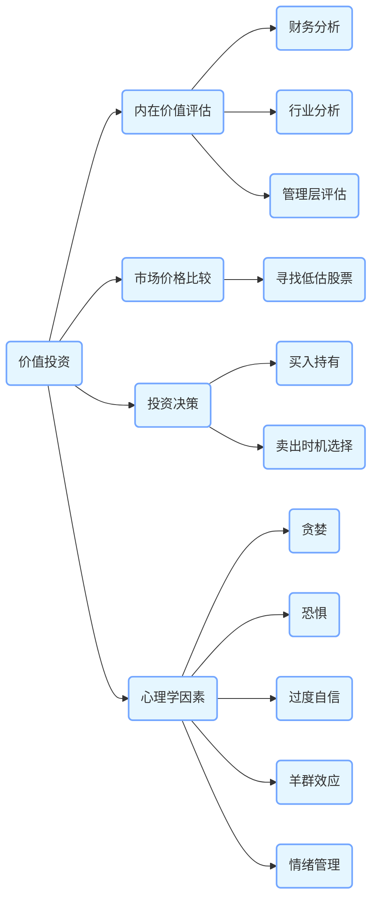

# 价值投资中的心理学：克服人性弱点

> 关键词：价值投资、心理学、人性弱点、投资决策、情绪管理

> 摘要：本文聚焦于价值投资领域中的心理学因素，深入探讨了投资者在价值投资过程中面临的各种人性弱点，如贪婪、恐惧、过度自信等。通过详细分析这些人性弱点对投资决策的影响，阐述了如何运用心理学原理来克服这些弱点，从而做出更理性、更明智的投资决策。文章结合具体的数学模型、实际案例以及相关工具和资源，全面且系统地为投资者提供了应对价值投资中心理学挑战的方法和策略，旨在帮助投资者提升投资绩效，实现长期稳定的投资回报。

## 1. 背景介绍 
### 1.1 目的和范围
在价值投资领域，投资者往往面临着诸多挑战，其中人性弱点对投资决策的影响不容忽视。本文章的目的在于深入剖析价值投资中的心理学因素，揭示投资者常见的人性弱点及其对投资结果的影响，并提供切实可行的方法来克服这些弱点。范围涵盖了价值投资的基本概念、心理学原理在投资中的应用、核心算法和数学模型的介绍、实际案例分析以及相关工具和资源的推荐等方面，旨在为投资者提供一个全面且深入的价值投资心理学指南。

### 1.2 预期读者
本文预期读者主要包括对价值投资感兴趣的个人投资者、金融从业者、投资顾问以及对心理学与投资交叉领域研究感兴趣的学者和研究人员。无论是初涉投资领域的新手，还是经验丰富的专业投资者，都能从本文中获取有价值的信息和启示，以提升自己的投资决策能力和风险管理水平。

### 1.3 文档结构概述
本文将按照以下结构展开：首先介绍价值投资和相关心理学的背景知识，包括术语和概念的解释；接着阐述核心概念及其联系，通过文本示意图和 Mermaid 流程图进行直观展示；然后详细讲解核心算法原理和具体操作步骤，并结合 Python 代码进行说明；随后介绍数学模型和公式，并举例说明其应用；通过实际项目案例展示如何在实践中运用这些知识；探讨价值投资的实际应用场景；推荐相关的学习资源、开发工具和论文著作；最后总结价值投资中克服人性弱点的未来发展趋势与挑战，并提供常见问题的解答和扩展阅读参考资料。

### 1.4 术语表
#### 1.4.1 核心术语定义
- **价值投资**：一种投资策略，基于对股票内在价值的分析，寻找价格低于其内在价值的股票进行投资，以获取长期的资本增值。
- **人性弱点**：指人类在认知、情感和行为方面存在的一些固有缺陷，如贪婪、恐惧、过度自信、羊群效应等，这些弱点会影响投资者的决策过程。
- **投资决策**：投资者在面对各种投资机会时，根据自身的投资目标、风险承受能力和市场情况等因素，选择合适的投资标的和投资时机的过程。
- **情绪管理**：投资者通过认知和调节自己的情绪，避免情绪对投资决策产生负面影响，保持理性和冷静的投资态度。

#### 1.4.2 相关概念解释
- **内在价值**：股票所代表的企业的真实价值，通常通过对企业的财务状况、盈利能力、市场竞争力等因素进行分析和评估来确定。
- **市场效率**：指市场价格反映所有可用信息的程度。在有效市场中，股票价格能够及时、准确地反映其内在价值；而在无效市场中，股票价格可能会偏离其内在价值，为价值投资者提供投资机会。
- **风险承受能力**：投资者在投资过程中能够承受的最大损失程度，取决于投资者的财务状况、投资目标、投资经验和心理因素等。

#### 1.4.3 缩略词列表
- **PE**：市盈率（Price-to-Earnings Ratio），是指股票价格与每股收益的比率，用于衡量股票的估值水平。
- **PB**：市净率（Price-to-Book Ratio），是指股票价格与每股净资产的比率，用于衡量股票的账面价值与市场价格之间的关系。
- **ROE**：净资产收益率（Return on Equity），是指企业净利润与净资产的比率，用于衡量企业运用自有资本的效率和盈利能力。

## 2. 核心概念与联系 

### 价值投资的核心概念
价值投资的核心在于寻找被市场低估的股票，即股票的市场价格低于其内在价值。投资者通过对企业的基本面进行深入分析，包括财务报表、行业前景、管理层能力等，来评估企业的内在价值。当市场价格低于内在价值时，投资者认为该股票具有投资价值，从而买入并持有，等待市场价格回归内在价值，实现资本增值。

### 心理学与价值投资的联系
心理学在价值投资中起着至关重要的作用。投资者的情绪和认知偏差会影响他们对市场的判断和投资决策。例如，贪婪会使投资者在股票价格上涨时过度追高，忽视风险；恐惧会使投资者在股票价格下跌时盲目抛售，错过投资机会。此外，过度自信、羊群效应等心理因素也会导致投资者做出不理性的投资决策。因此，了解和掌握心理学原理，克服人性弱点，是价值投资者取得成功的关键。

### 核心概念原理和架构的文本示意图
```plaintext
价值投资
|
|-- 内在价值评估
|   |-- 财务分析
|   |-- 行业分析
|   |-- 管理层评估
|
|-- 市场价格比较
|   |-- 寻找低估股票
|
|-- 投资决策
|   |-- 买入持有
|   |-- 卖出时机选择
|
|-- 心理学因素
|   |-- 贪婪
|   |-- 恐惧
|   |-- 过度自信
|   |-- 羊群效应
|   |-- 情绪管理
```

### Mermaid 流程图


## 3. 核心算法原理 & 具体操作步骤 

### 内在价值评估算法原理
内在价值评估是价值投资的核心环节，常用的方法有现金流折现法（DCF）和相对估值法。

#### 现金流折现法（DCF）原理
现金流折现法的基本思想是将企业未来的现金流按照一定的折现率折现到当前，得到企业的内在价值。其公式为：
$$V = \sum_{t=1}^{n} \frac{CF_t}{(1 + r)^t} + \frac{TV}{(1 + r)^n}$$
其中，$V$ 表示企业的内在价值，$CF_t$ 表示第 $t$ 期的现金流，$r$ 表示折现率，$n$ 表示预测期数，$TV$ 表示终值。

#### 相对估值法原理
相对估值法是通过比较同行业其他企业的估值指标，如市盈率（PE）、市净率（PB）等，来评估目标企业的价值。其基本公式为：
$$V = P \times E$$
其中，$V$ 表示企业的内在价值，$P$ 表示可比企业的平均估值倍数，$E$ 表示目标企业的盈利指标（如每股收益）。

### 具体操作步骤
#### 步骤 1：数据收集
收集目标企业的财务报表、行业数据、宏观经济数据等相关信息。

#### 步骤 2：财务分析
对目标企业的财务报表进行分析，包括盈利能力、偿债能力、运营能力等方面的指标计算和分析。以下是一个简单的 Python 代码示例，用于计算企业的净资产收益率（ROE）：
```python
def calculate_roe(net_income, shareholders_equity):
    """
    计算净资产收益率（ROE）
    :param net_income: 净利润
    :param shareholders_equity: 股东权益
    :return: ROE
    """
    return net_income / shareholders_equity

# 示例数据
net_income = 1000000
shareholders_equity = 5000000

roe = calculate_roe(net_income, shareholders_equity)
print(f"净资产收益率（ROE）: {roe * 100:.2f}%")
```

#### 步骤 3：行业分析
分析目标企业所处的行业环境，包括行业增长率、竞争格局、政策环境等。

#### 步骤 4：内在价值评估
根据财务分析和行业分析的结果，选择合适的估值方法（如 DCF 法或相对估值法），计算目标企业的内在价值。以下是一个简单的相对估值法的 Python 代码示例：
```python
def relative_valuation(comparable_pe, target_eps):
    """
    相对估值法计算企业内在价值
    :param comparable_pe: 可比企业平均市盈率
    :param target_eps: 目标企业每股收益
    :return: 企业内在价值
    """
    return comparable_pe * target_eps

# 示例数据
comparable_pe = 20
target_eps = 5

intrinsic_value = relative_valuation(comparable_pe, target_eps)
print(f"企业内在价值: {intrinsic_value}")
```

#### 步骤 5：市场价格比较
将计算得到的内在价值与目标企业的市场价格进行比较，判断股票是否被低估。

#### 步骤 6：投资决策
如果股票被低估，且符合投资者的投资目标和风险承受能力，则可以考虑买入；如果股票被高估，则可以考虑卖出或不买入。

## 4. 数学模型和公式 & 详细讲解 & 举例说明 

### 现金流折现法（DCF）详细讲解
现金流折现法的核心在于预测企业未来的现金流和选择合适的折现率。

#### 现金流预测
现金流预测是 DCF 法的关键步骤，需要考虑企业的业务模式、市场前景、竞争优势等因素。通常，预测期可以分为短期、中期和长期。短期预测可以基于企业的历史数据和当前的业务情况进行；中期和长期预测则需要考虑行业的发展趋势和企业的战略规划。

#### 折现率选择
折现率反映了投资者对投资风险的要求，通常使用加权平均资本成本（WACC）作为折现率。WACC 的计算公式为：
$$WACC = w_d \times r_d \times (1 - T) + w_e \times r_e$$
其中，$w_d$ 表示债务资本的权重，$r_d$ 表示债务资本的成本，$T$ 表示企业所得税税率，$w_e$ 表示股权资本的权重，$r_e$ 表示股权资本的成本。

#### 终值计算
终值是指预测期结束后企业的价值，通常使用永续增长模型进行计算。永续增长模型的公式为：
$$TV = \frac{CF_{n+1}}{r - g}$$
其中，$TV$ 表示终值，$CF_{n+1}$ 表示预测期结束后第 1 期的现金流，$r$ 表示折现率，$g$ 表示永续增长率。

#### 举例说明
假设某企业未来 5 年的现金流预测如下：
| 年份 | 现金流（万元） |
|------|----------------|
| 1    | 100            |
| 2    | 120            |
| 3    | 140            |
| 4    | 160            |
| 5    | 180            |

预测期结束后，企业的现金流将以 3% 的永续增长率增长。折现率为 10%。

首先，计算预测期内现金流的现值：
$$PV_1 = \frac{100}{(1 + 0.1)^1} = 90.91$$
$$PV_2 = \frac{120}{(1 + 0.1)^2} = 99.17$$
$$PV_3 = \frac{140}{(1 + 0.1)^3} = 105.18$$
$$PV_4 = \frac{160}{(1 + 0.1)^4} = 109.28$$
$$PV_5 = \frac{180}{(1 + 0.1)^5} = 111.73$$

然后，计算终值：
$$CF_{6} = 180 \times (1 + 0.03) = 185.4$$
$$TV = \frac{185.4}{0.1 - 0.03} = 2648.57$$
$$PV_{TV} = \frac{2648.57}{(1 + 0.1)^5} = 1643.54$$

最后，计算企业的内在价值：
$$V = PV_1 + PV_2 + PV_3 + PV_4 + PV_5 + PV_{TV} = 90.91 + 99.17 + 105.18 + 109.28 + 111.73 + 1643.54 = 2159.81$$

### 相对估值法详细讲解
相对估值法的关键在于选择合适的可比企业和估值指标。

#### 可比企业选择
可比企业应该与目标企业在行业、规模、业务模式、财务状况等方面具有相似性。通常，可以通过筛选同行业的上市公司来确定可比企业。

#### 估值指标选择
常用的估值指标有市盈率（PE）、市净率（PB）、市销率（PS）等。不同的估值指标适用于不同的行业和企业类型。例如，市盈率适用于盈利稳定的企业；市净率适用于资产密集型企业；市销率适用于尚未盈利但具有较高增长潜力的企业。

#### 举例说明
假设某行业有 3 家可比企业，其市盈率分别为 18、20、22。目标企业的每股收益为 3 元。

首先，计算可比企业的平均市盈率：
$$\bar{PE} = \frac{18 + 20 + 22}{3} = 20$$

然后，使用相对估值法计算目标企业的内在价值：
$$V = \bar{PE} \times EPS = 20 \times 3 = 60$$

## 5. 项目实战：代码实际案例和详细解释说明 

### 5.1  开发环境搭建
为了实现价值投资中的相关算法，我们可以使用 Python 编程语言，并结合一些常用的数据分析库，如 Pandas、Numpy 等。以下是开发环境搭建的步骤：

#### 步骤 1：安装 Python
可以从 Python 官方网站（https://www.python.org/downloads/）下载并安装最新版本的 Python。

#### 步骤 2：安装必要的库
打开命令行工具，使用以下命令安装 Pandas 和 Numpy：
```sh
pip install pandas numpy
```

### 5.2  源代码详细实现和代码解读
以下是一个完整的 Python 代码示例，用于实现相对估值法和现金流折现法：
```python
import pandas as pd
import numpy as np

def calculate_roe(net_income, shareholders_equity):
    """
    计算净资产收益率（ROE）
    :param net_income: 净利润
    :param shareholders_equity: 股东权益
    :return: ROE
    """
    return net_income / shareholders_equity

def relative_valuation(comparable_pe, target_eps):
    """
    相对估值法计算企业内在价值
    :param comparable_pe: 可比企业平均市盈率
    :param target_eps: 目标企业每股收益
    :return: 企业内在价值
    """
    return comparable_pe * target_eps

def dcf_valuation(cash_flows, discount_rate, growth_rate):
    """
    现金流折现法计算企业内在价值
    :param cash_flows: 未来现金流列表
    :param discount_rate: 折现率
    :param growth_rate: 永续增长率
    :return: 企业内在价值
    """
    n = len(cash_flows)
    pv_cash_flows = []
    for i, cf in enumerate(cash_flows):
        pv = cf / ((1 + discount_rate) ** (i + 1))
        pv_cash_flows.append(pv)
    
    terminal_cash_flow = cash_flows[-1] * (1 + growth_rate)
    terminal_value = terminal_cash_flow / (discount_rate - growth_rate)
    pv_terminal_value = terminal_value / ((1 + discount_rate) ** n)
    
    intrinsic_value = sum(pv_cash_flows) + pv_terminal_value
    return intrinsic_value

# 示例数据
net_income = 1000000
shareholders_equity = 5000000
comparable_pe = 20
target_eps = 5
cash_flows = [100, 120, 140, 160, 180]
discount_rate = 0.1
growth_rate = 0.03

# 计算 ROE
roe = calculate_roe(net_income, shareholders_equity)
print(f"净资产收益率（ROE）: {roe * 100:.2f}%")

# 相对估值法计算内在价值
intrinsic_value_relative = relative_valuation(comparable_pe, target_eps)
print(f"相对估值法计算的企业内在价值: {intrinsic_value_relative}")

# 现金流折现法计算内在价值
intrinsic_value_dcf = dcf_valuation(cash_flows, discount_rate, growth_rate)
print(f"现金流折现法计算的企业内在价值: {intrinsic_value_dcf:.2f}")
```

### 5.3  代码解读与分析
#### 代码功能概述
该代码实现了三个主要功能：计算净资产收益率（ROE）、使用相对估值法计算企业内在价值和使用现金流折现法计算企业内在价值。

#### 代码详细解读
- `calculate_roe` 函数：接受净利润和股东权益作为输入，返回净资产收益率。
- `relative_valuation` 函数：接受可比企业平均市盈率和目标企业每股收益作为输入，返回企业的内在价值。
- `dcf_valuation` 函数：接受未来现金流列表、折现率和永续增长率作为输入，返回企业的内在价值。首先计算预测期内现金流的现值，然后计算终值的现值，最后将两者相加得到企业的内在价值。

#### 代码分析
通过该代码，我们可以方便地计算企业的关键财务指标和内在价值，为投资决策提供参考。同时，代码的模块化设计使得代码易于维护和扩展。

## 6. 实际应用场景 
### 个人投资者
个人投资者可以运用价值投资中的心理学知识和相关算法，克服人性弱点，做出更理性的投资决策。例如，通过对企业内在价值的评估，避免盲目跟风投资热门股票，而是选择被市场低估的优质股票进行长期投资。同时，学会管理自己的情绪，在市场波动时保持冷静，不被贪婪和恐惧所左右。

### 机构投资者
机构投资者在进行大规模投资时，更需要考虑价值投资中的心理学因素。通过建立科学的投资决策流程和风险管理制度，减少人为因素的干扰，提高投资绩效。例如，机构投资者可以利用量化投资模型，结合心理学原理，筛选出具有投资价值的股票组合，实现资产的优化配置。

### 投资顾问
投资顾问可以将价值投资中的心理学知识传授给客户，帮助客户了解自己的投资心理和行为模式，制定适合自己的投资策略。同时，投资顾问可以运用相关算法和工具，为客户提供专业的投资建议和风险评估，提高客户的投资满意度和忠诚度。

## 7. 工具和资源推荐
### 7.1 学习资源推荐
#### 7.1.1 书籍推荐
- 《聪明的投资者》（The Intelligent Investor）：本杰明·格雷厄姆（Benjamin Graham）著，被誉为价值投资的圣经，详细阐述了价值投资的理念和方法。
- 《巴菲特致股东的信：投资者和公司高管教程》（Letters to Shareholders of Berkshire Hathaway）：沃伦·巴菲特（Warren Buffett）著，通过巴菲特写给股东的信，展示了他的投资哲学和经验。
- 《思考，快与慢》（Thinking, Fast and Slow）：丹尼尔·卡尼曼（Daniel Kahneman）著，介绍了人类思维的两种模式，以及认知偏差对决策的影响，对理解投资中的心理学有很大帮助。

#### 7.1.2 在线课程
- Coursera 上的“价值投资基础”（Fundamentals of Value Investing）课程：由知名商学院教授授课，系统讲解价值投资的理论和实践。
- Udemy 上的“投资心理学：克服情绪偏差”（Investment Psychology: Overcoming Emotional Biases）课程：专门针对投资中的心理学问题进行讲解和分析。

#### 7.1.3 技术博客和网站
- 雪球网（https://xueqiu.com/）：国内知名的投资社区，提供股票分析、投资策略分享等内容，用户可以与其他投资者交流经验和看法。
- Seeking Alpha（https://seekingalpha.com/）：国外知名的投资研究网站，提供大量的股票分析报告和投资观点。

### 7.2 开发工具框架推荐
#### 7.2.1 IDE和编辑器
- PyCharm：一款专业的 Python 集成开发环境，具有强大的代码编辑、调试和分析功能。
- Jupyter Notebook：一种交互式的编程环境，适合进行数据分析和模型开发，支持 Python、R 等多种编程语言。

#### 7.2.2 调试和性能分析工具
- PySnooper：一个简单易用的 Python 调试工具，可以自动记录函数的执行过程和变量的值。
- cProfile：Python 内置的性能分析工具，可以帮助开发者找出代码中的性能瓶颈。

#### 7.2.3 相关框架和库
- Pandas：一个强大的数据分析库，提供了丰富的数据结构和数据处理功能，方便进行财务数据的分析和处理。
- Numpy：一个用于科学计算的 Python 库，提供了高效的数组操作和数学函数，是许多数据分析和机器学习库的基础。

### 7.3 相关论文著作推荐
#### 7.3.1 经典论文
- “The Security Market Line: Some Empirical Tests”（资本资产定价模型的实证检验）：由威廉·夏普（William Sharpe）等人发表，对现代投资组合理论和资本资产定价模型进行了实证研究。
- “Behavioral Finance: A Review”（行为金融学综述）：对行为金融学的发展历程、理论模型和实证研究进行了全面的综述。

#### 7.3.2 最新研究成果
- “The Impact of Investor Sentiment on Stock Prices”（投资者情绪对股票价格的影响）：探讨了投资者情绪在股票市场中的作用和影响机制。
- “Overconfidence and Investment Decisions”（过度自信与投资决策）：研究了过度自信心理对投资者决策的影响，并提出了相应的对策。

#### 7.3.3 应用案例分析
- “Value Investing in Emerging Markets: A Case Study”（新兴市场中的价值投资案例分析）：通过具体案例分析，展示了价值投资在新兴市场中的应用和效果。
- “How to Overcome Behavioral Biases in Investment: A Practical Guide”（如何克服投资中的行为偏差：实用指南）：结合实际案例，提供了克服投资中常见行为偏差的方法和策略。

## 8. 总结：未来发展趋势与挑战
### 未来发展趋势
- **量化投资与心理学的融合**：随着大数据和人工智能技术的发展，量化投资将与心理学更加紧密地结合。通过对投资者行为数据的分析和挖掘，开发更加精准的量化投资模型，提高投资决策的科学性和准确性。
- **智能投顾的普及**：智能投顾将利用价值投资和心理学知识，为投资者提供个性化的投资建议和资产配置方案。智能投顾具有成本低、效率高、服务个性化等优点，将逐渐成为投资者的重要选择。
- **行为金融学的深入研究**：行为金融学将继续深入研究投资者的心理和行为模式，揭示更多的认知偏差和行为规律。这将为价值投资提供更加坚实的理论基础，帮助投资者更好地克服人性弱点。

### 挑战
- **数据质量和隐私问题**：量化投资和智能投顾需要大量的投资者行为数据，数据的质量和隐私保护成为关键问题。如何确保数据的准确性、完整性和安全性，是未来发展需要解决的重要挑战。
- **投资者教育和意识提升**：虽然价值投资和心理学知识越来越受到关注，但仍有许多投资者缺乏相关的知识和意识。如何加强投资者教育，提高投资者的心理素质和投资能力，是促进价值投资健康发展的重要任务。
- **市场环境的复杂性**：金融市场受到宏观经济、政策法规、国际形势等多种因素的影响，市场环境日益复杂。投资者需要不断学习和适应市场变化，提高应对风险的能力。

## 9. 附录：常见问题与解答
### 问题 1：价值投资一定能赚钱吗？
价值投资并不保证一定能赚钱。价值投资是一种基于企业内在价值的投资策略，虽然从长期来看，价值投资具有较高的成功概率，但市场价格的波动是不可预测的，可能会导致股票价格在短期内偏离其内在价值。此外，企业的经营状况也可能发生变化，影响其内在价值。因此，投资者在进行价值投资时，需要做好风险管理，分散投资，避免过度集中投资于某一只股票。

### 问题 2：如何判断自己是否存在投资中的人性弱点？
可以通过以下几个方面来判断自己是否存在投资中的人性弱点：
- **情绪反应**：在股票价格上涨时，是否会感到兴奋和贪婪，想要追高买入；在股票价格下跌时，是否会感到恐惧和焦虑，想要盲目抛售。
- **决策过程**：在做出投资决策时，是否会受到他人的影响，盲目跟风；是否会过度自信，忽视风险。
- **投资结果**：回顾自己的投资历史，是否经常做出错误的投资决策，导致投资损失。

### 问题 3：如何克服投资中的贪婪和恐惧情绪？
可以通过以下方法来克服投资中的贪婪和恐惧情绪：
- **制定投资计划**：在投资前，制定明确的投资计划，包括投资目标、投资策略、风险控制等方面的内容。在投资过程中，严格按照投资计划执行，避免受到情绪的影响。
- **学习投资知识**：通过学习价值投资的理论和方法，了解股票市场的运行规律，提高自己的投资能力和信心。当对投资有了更深入的了解时，就不容易被情绪所左右。
- **进行情绪管理**：学会识别自己的情绪状态，当出现贪婪或恐惧情绪时，及时采取措施进行调整。例如，可以通过深呼吸、冥想等方式来放松自己，保持冷静和理性。

## 10. 扩展阅读 & 参考资料
### 扩展阅读
- 《金融炼金术》（The Alchemy of Finance）：乔治·索罗斯（George Soros）著，介绍了索罗斯的反身性理论和投资哲学。
- 《黑天鹅：如何应对不可预知的未来》（The Black Swan: The Impact of the Highly Improbable）：纳西姆·尼古拉斯·塔勒布（Nassim Nicholas Taleb）著，探讨了极端事件对金融市场的影响。

### 参考资料
- 本杰明·格雷厄姆. 《聪明的投资者》. 人民邮电出版社.
- 沃伦·巴菲特. 《巴菲特致股东的信：投资者和公司高管教程》. 机械工业出版社.
- 丹尼尔·卡尼曼. 《思考，快与慢》. 中信出版社.

作者：AI天才研究院/AI Genius Institute & 禅与计算机程序设计艺术 /Zen And The Art of Computer Programming