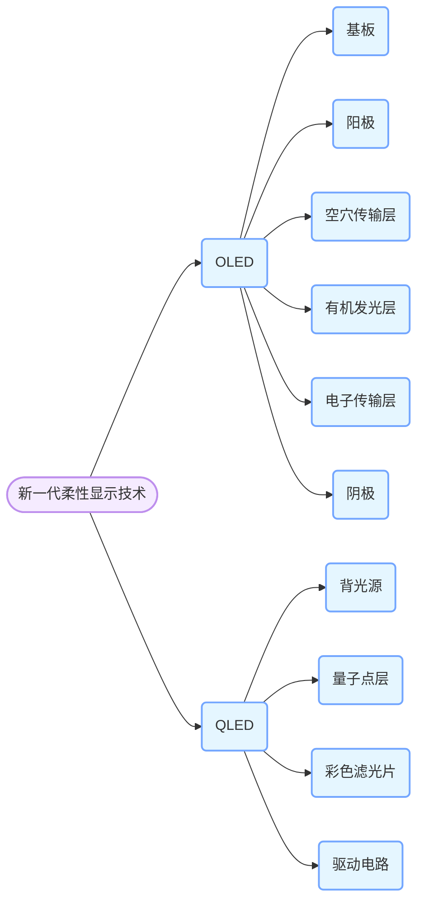

# 价值投资中的新一代柔性显示技术前景

> 关键词：价值投资、新一代柔性显示技术、市场前景、技术原理、应用场景

> 摘要：本文聚焦于价值投资视角下的新一代柔性显示技术前景。首先介绍了相关背景知识，包括目的范围、预期读者等。接着深入剖析核心概念与联系，阐述技术原理和架构，并通过 Python 代码详细讲解核心算法。运用数学模型和公式对技术进行量化分析，结合实际案例说明其应用。探讨了该技术在多个领域的实际应用场景，推荐了学习、开发所需的工具和资源，以及相关论文著作。最后总结了未来发展趋势与挑战，为价值投资者和技术爱好者提供全面的参考，助力其深入了解新一代柔性显示技术并做出合理决策。

## 1. 背景介绍 
### 1.1 目的和范围
本文章旨在从价值投资的角度全面分析新一代柔性显示技术的前景。一方面，为价值投资者提供关于该技术的深入洞察，包括技术原理、市场潜力、发展趋势等方面的信息，帮助他们评估投资该技术相关企业的可行性和潜在回报。另一方面，也为技术开发者、行业研究者等提供一个综合的参考，促进对新一代柔性显示技术的进一步研究和应用。文章的范围涵盖了新一代柔性显示技术的各个方面，从核心概念、算法原理到实际应用场景，以及与之相关的工具、资源和研究成果。

### 1.2 预期读者
本文的预期读者主要包括以下几类人群：
1. **价值投资者**：希望通过了解新一代柔性显示技术的前景，寻找有潜力的投资项目，实现资产的增值。
2. **技术开发者**：对新一代柔性显示技术感兴趣，希望深入了解其技术原理和实现方法，为技术的创新和应用提供思路。
3. **行业研究者**：关注显示技术领域的发展动态，希望通过本文获取关于新一代柔性显示技术的最新研究成果和市场趋势。
4. **企业管理者**：在考虑企业的战略规划和技术布局时，需要了解新一代柔性显示技术的发展前景，以便做出合理的决策。

### 1.3 文档结构概述
本文将按照以下结构进行组织：
1. **背景介绍**：阐述文章的目的和范围、预期读者、文档结构概述以及相关术语表。
2. **核心概念与联系**：介绍新一代柔性显示技术的核心概念、原理和架构，并通过文本示意图和 Mermaid 流程图进行直观展示。
3. **核心算法原理 & 具体操作步骤**：详细讲解核心算法原理，并使用 Python 源代码进行具体实现和说明。
4. **数学模型和公式 & 详细讲解 & 举例说明**：运用数学模型和公式对新一代柔性显示技术进行量化分析，并通过具体例子进行说明。
5. **项目实战：代码实际案例和详细解释说明**：通过实际项目案例，展示新一代柔性显示技术的开发过程，包括开发环境搭建、源代码实现和代码解读。
6. **实际应用场景**：探讨新一代柔性显示技术在不同领域的实际应用场景。
7. **工具和资源推荐**：推荐学习、开发所需的工具和资源，以及相关的论文著作。
8. **总结：未来发展趋势与挑战**：总结新一代柔性显示技术的未来发展趋势，并分析可能面临的挑战。
9. **附录：常见问题与解答**：解答读者在阅读过程中可能遇到的常见问题。
10. **扩展阅读 & 参考资料**：提供相关的扩展阅读材料和参考资料，方便读者进一步深入研究。

### 1.4 术语表
#### 1.4.1 核心术语定义
1. **新一代柔性显示技术**：指具有可弯曲、可折叠、可卷曲等特性的显示技术，相较于传统显示技术，能够提供更加灵活多样的显示形式和应用场景。
2. **价值投资**：一种投资策略，通过对企业的基本面进行分析，寻找被低估的股票或其他投资标的，以获取长期的投资回报。
3. **有机发光二极管（OLED）**：一种基于有机材料的发光二极管，是新一代柔性显示技术中常用的显示器件，具有自发光、对比度高、视角广等优点。
4. **量子点发光二极管（QLED）**：一种基于量子点材料的发光二极管，在显示领域具有色彩鲜艳、寿命长等优势，也是新一代柔性显示技术的重要发展方向之一。

#### 1.4.2 相关概念解释
1. **柔性基板**：新一代柔性显示技术中使用的可弯曲的基板材料，通常采用塑料、金属箔等材料，为显示器件提供支撑和保护。
2. **驱动电路**：用于控制显示器件发光的电路，包括像素驱动电路和扫描驱动电路等，确保显示器件能够正常显示图像。
3. **封装技术**：为了保护显示器件免受外界环境的影响，需要采用封装技术将显示器件密封起来，常用的封装技术包括薄膜封装和玻璃封装等。

#### 1.4.3 缩略词列表
1. **OLED**：Organic Light-Emitting Diode（有机发光二极管）
2. **QLED**：Quantum Dot Light-Emitting Diode（量子点发光二极管）
3. **AMOLED**：Active-Matrix Organic Light-Emitting Diode（有源矩阵有机发光二极管）
4. **LTPS**：Low-Temperature Poly-Silicon（低温多晶硅）

## 2. 核心概念与联系 
### 2.1 新一代柔性显示技术的核心概念
新一代柔性显示技术是指能够实现可弯曲、可折叠、可卷曲等形态变化的显示技术。与传统的刚性显示技术相比，柔性显示技术具有更大的灵活性和适应性，可以应用于更多的场景。目前，主要的柔性显示技术包括有机发光二极管（OLED）和量子点发光二极管（QLED）。

OLED 是一种基于有机材料的发光二极管，具有自发光、对比度高、视角广、响应速度快等优点。OLED 显示器件由有机发光层、电子传输层、空穴传输层等组成，当电流通过这些层时，有机材料会发光，从而实现图像显示。由于 OLED 可以在柔性基板上制备，因此可以实现柔性显示。

QLED 是一种基于量子点材料的发光二极管，量子点是一种纳米级的半导体颗粒，具有独特的光学性质。QLED 显示器件在背光源和彩色滤光片之间加入了量子点层，通过量子点的发光来实现彩色显示。QLED 具有色彩鲜艳、寿命长等优点，也是新一代柔性显示技术的重要发展方向之一。

### 2.2 技术原理和架构
#### 2.2.1 OLED 技术原理和架构
OLED 的技术原理基于有机材料的电致发光现象。当在 OLED 器件的阳极和阴极之间施加电压时，空穴从阳极注入到空穴传输层，电子从阴极注入到电子传输层。空穴和电子在有机发光层中相遇并复合，释放出能量，使有机材料发光。

OLED 的架构主要包括基板、阳极、空穴传输层、有机发光层、电子传输层、阴极等部分。基板通常采用柔性塑料或玻璃，为整个器件提供支撑。阳极一般采用透明导电氧化物（如 ITO），用于注入空穴。空穴传输层和电子传输层分别用于传输空穴和电子，提高器件的发光效率。有机发光层是 OLED 器件的核心部分，决定了器件的发光颜色和亮度。阴极则用于注入电子。

#### 2.2.2 QLED 技术原理和架构
QLED 的技术原理基于量子点的光致发光现象。当量子点受到外界光的激发时，会吸收光子并跃迁到高能级，然后再回到低能级，释放出特定波长的光。在 QLED 显示器件中，背光源发出的蓝光激发量子点层中的量子点，使其发出红、绿等颜色的光，通过彩色滤光片实现彩色显示。

QLED 的架构主要包括背光源、量子点层、彩色滤光片、驱动电路等部分。背光源通常采用蓝光 LED，为量子点提供激发光。量子点层由不同尺寸的量子点组成，不同尺寸的量子点发出不同颜色的光。彩色滤光片用于过滤不需要的光，提高显示的色彩纯度。驱动电路用于控制背光源和量子点层的工作。

### 2.3 文本示意图
```plaintext
新一代柔性显示技术
├── OLED
│   ├── 基板
│   ├── 阳极
│   ├── 空穴传输层
│   ├── 有机发光层
│   ├── 电子传输层
│   └── 阴极
├── QLED
│   ├── 背光源
│   ├── 量子点层
│   ├── 彩色滤光片
│   └── 驱动电路
```

### 2.4 Mermaid 流程图


## 3. 核心算法原理 & 具体操作步骤 
### 3.1 核心算法原理
在新一代柔性显示技术中，一个重要的算法是像素驱动算法，用于控制每个像素的发光强度和颜色，以实现高质量的图像显示。下面以 OLED 为例，介绍像素驱动算法的原理。

OLED 像素驱动算法的核心是根据输入的图像数据，精确控制每个像素的电流或电压，从而实现不同的发光亮度和颜色。常见的像素驱动算法包括脉冲宽度调制（PWM）和模拟驱动两种。

#### 3.1.1 脉冲宽度调制（PWM）
PWM 是一种通过改变脉冲信号的占空比来控制平均功率的方法。在 OLED 显示中，PWM 用于控制每个像素的发光时间，从而实现不同的亮度。具体来说，PWM 信号的高电平时间表示像素发光的时间，低电平时间表示像素不发光的时间。通过调整高电平时间和低电平时间的比例（即占空比），可以改变像素的平均发光亮度。

#### 3.1.2 模拟驱动
模拟驱动是通过直接控制像素的电流或电压来实现不同的发光亮度。在模拟驱动中，根据输入的图像数据，为每个像素提供相应的电流或电压，使像素发光。模拟驱动的优点是可以实现更精确的亮度控制，但对驱动电路的要求较高。

### 3.2 具体操作步骤
下面使用 Python 代码实现一个简单的 PWM 像素驱动算法示例：

```python
# 定义 PWM 像素驱动类
class PWMPixelDriver:
    def __init__(self, total_time, max_brightness):
        # 总时间
        self.total_time = total_time
        # 最大亮度
        self.max_brightness = max_brightness

    def calculate_duty_cycle(self, brightness):
        # 计算占空比
        if brightness < 0:
            brightness = 0
        elif brightness > self.max_brightness:
            brightness = self.max_brightness
        duty_cycle = brightness / self.max_brightness
        return duty_cycle

    def drive_pixel(self, brightness):
        # 驱动像素
        duty_cycle = self.calculate_duty_cycle(brightness)
        high_time = duty_cycle * self.total_time
        low_time = self.total_time - high_time
        print(f"像素发光时间: {high_time} 单位时间, 像素不发光时间: {low_time} 单位时间")

# 创建 PWM 像素驱动对象
driver = PWMPixelDriver(total_time=100, max_brightness=255)

# 输入亮度值
brightness = 128

# 驱动像素
driver.drive_pixel(brightness)
```

### 3.3 代码解释
1. **类定义**：定义了一个 `PWMPixelDriver` 类，用于实现 PWM 像素驱动功能。该类的构造函数接受两个参数：`total_time` 表示总时间，`max_brightness` 表示最大亮度。
2. **计算占空比**：`calculate_duty_cycle` 方法根据输入的亮度值计算占空比。占空比的计算公式为：$占空比 = \frac{亮度}{最大亮度}$。
3. **驱动像素**：`drive_pixel` 方法根据计算得到的占空比，计算像素的发光时间和不发光时间，并输出结果。
4. **创建对象和调用方法**：创建 `PWMPixelDriver` 类的对象，并输入一个亮度值，调用 `drive_pixel` 方法驱动像素。

## 4. 数学模型和公式 & 详细讲解 & 举例说明 
### 4.1 亮度与占空比的关系
在 PWM 像素驱动算法中，亮度与占空比之间存在线性关系。设亮度为 $B$，最大亮度为 $B_{max}$，占空比为 $D$，则它们之间的关系可以表示为：

$$D = \frac{B}{B_{max}}$$

其中，$D$ 的取值范围为 $[0, 1]$，$B$ 的取值范围为 $[0, B_{max}]$。

### 4.2 发光时间和不发光时间的计算
设总时间为 $T$，占空比为 $D$，则像素的发光时间 $T_{on}$ 和不发光时间 $T_{off}$ 可以通过以下公式计算：

$$T_{on} = D \times T$$

$$T_{off} = T - T_{on} = (1 - D) \times T$$

### 4.3 举例说明
假设总时间 $T = 100$ 单位时间，最大亮度 $B_{max} = 255$，输入的亮度值 $B = 128$。

首先，计算占空比 $D$：

$$D = \frac{B}{B_{max}} = \frac{128}{255} \approx 0.502$$

然后，计算发光时间 $T_{on}$ 和不发光时间 $T_{off}$：

$$T_{on} = D \times T = 0.502 \times 100 = 50.2$$

$$T_{off} = T - T_{on} = 100 - 50.2 = 49.8$$

这意味着在 100 单位时间内，像素发光时间约为 50.2 单位时间，不发光时间约为 49.8 单位时间。

## 5. 项目实战：代码实际案例和详细解释说明 
### 5.1 开发环境搭建
#### 5.1.1 硬件环境
- **开发板**：选择一款支持 OLED 显示的开发板，如 Arduino 开发板或 Raspberry Pi 开发板。
- **OLED 显示屏**：选择合适的 OLED 显示屏，如 128x64 分辨率的 I2C OLED 显示屏。
- **连接线**：使用合适的连接线将开发板和 OLED 显示屏连接起来。

#### 5.1.2 软件环境
- **Python 环境**：安装 Python 3.x 版本。
- **开发工具**：选择合适的开发工具，如 PyCharm 或 Visual Studio Code。
- **OLED 驱动库**：安装相应的 OLED 驱动库，如 `Adafruit_SSD1306` 库。

### 5.2 源代码详细实现和代码解读
以下是一个使用 Raspberry Pi 和 `Adafruit_SSD1306` 库驱动 128x64 分辨率 I2C OLED 显示屏的 Python 代码示例：

```python
import time
import Adafruit_SSD1306
from PIL import Image
from PIL import ImageDraw
from PIL import ImageFont

# Raspberry Pi pin configuration:
RST = None  # on the PiOLED this pin isnt used

# 128x64 display with hardware I2C:
disp = Adafruit_SSD1306.SSD1306_128_64(rst=RST)

# Initialize library.
disp.begin()

# Clear display.
disp.clear()
disp.display()

# Create blank image for drawing.
# Make sure to create image with mode '1' for 1-bit color.
width = disp.width
height = disp.height
image = Image.new('1', (width, height))

# Get drawing object to draw on image.
draw = ImageDraw.Draw(image)

# Draw a black filled box to clear the image.
draw.rectangle((0, 0, width, height), outline=0, fill=0)

# Draw some shapes.
# First define some constants to allow easy resizing of shapes.
padding = -2
top = padding
bottom = height - padding
# Move left to right keeping track of the current x position for drawing shapes.
x = 0

# Load default font.
font = ImageFont.load_default()

while True:
    # Draw a black filled box to clear the image.
    draw.rectangle((0, 0, width, height), outline=0, fill=0)

    # Write two lines of text.
    draw.text((x, top), "Hello,", font=font, fill=255)
    draw.text((x, top + 8), "World!", font=font, fill=255)

    # Display image.
    disp.image(image)
    disp.display()
    time.sleep(1)
```

### 5.3 代码解读与分析
1. **导入必要的库**：导入 `Adafruit_SSD1306` 库用于驱动 OLED 显示屏，导入 `PIL` 库用于图像处理。
2. **初始化显示屏**：创建 `Adafruit_SSD1306.SSD1306_128_64` 对象，并调用 `begin()` 方法初始化显示屏。
3. **清屏**：调用 `clear()` 方法清除显示屏上的内容，并调用 `display()` 方法更新显示。
4. **创建图像和绘图对象**：使用 `PIL` 库创建一个空白图像，并获取绘图对象。
5. **绘制文本**：在图像上绘制文本，使用 `draw.text()` 方法。
6. **显示图像**：将绘制好的图像显示在 OLED 显示屏上，使用 `disp.image()` 方法和 `disp.display()` 方法。
7. **循环显示**：使用 `while True` 循环不断更新显示内容，每次显示后暂停 1 秒。

## 6. 实际应用场景 
### 6.1 消费电子领域
#### 6.1.1 智能手机
新一代柔性显示技术在智能手机领域具有巨大的应用潜力。柔性显示屏可以实现可折叠、可弯曲的设计，使智能手机具有更大的屏幕尺寸和更灵活的使用方式。例如，折叠屏智能手机可以在展开时提供更大的屏幕用于观看视频、浏览网页等，在折叠时则便于携带。

#### 6.1.2 智能手表
柔性显示屏可以使智能手表的屏幕更加贴合手腕，提供更好的佩戴体验。同时，可弯曲的屏幕还可以实现更多的交互方式，如弯曲屏幕进行菜单操作等。

#### 6.1.3 平板电脑
柔性显示技术可以使平板电脑实现可折叠或可卷曲的设计，方便用户携带和使用。折叠后的平板电脑可以像书本一样携带，展开后则可以提供更大的屏幕用于工作和娱乐。

### 6.2 汽车电子领域
#### 6.2.1 仪表盘
柔性显示屏可以使汽车仪表盘具有更加个性化的设计和更高的显示效果。例如，可弯曲的仪表盘可以根据驾驶员的视角进行调整，提供更好的视觉体验。

#### 6.2.2 中控显示屏
柔性中控显示屏可以实现更多的形态变化，如可折叠、可伸缩等，为汽车内饰设计带来更多的创意和可能性。

#### 6.2.3 抬头显示（HUD）
柔性显示技术可以使 HUD 更加轻薄、灵活，提高显示效果和安装的便利性。

### 6.3 智能家居领域
#### 6.3.1 智能家电
柔性显示屏可以应用于智能家电上，如智能冰箱、智能洗衣机等。通过在家电表面安装柔性显示屏，可以实现更多的交互功能，如显示菜谱、设置参数等。

#### 6.3.2 智能窗帘
柔性显示屏可以集成到智能窗帘中，实现窗帘的智能控制和信息显示。例如，在窗帘上显示天气信息、时间等。

#### 6.3.3 智能镜子
柔性显示屏可以使智能镜子具有更多的功能，如显示健康数据、化妆教程等。用户可以通过触摸屏幕与镜子进行交互。

### 6.4 医疗领域
#### 6.4.1 医疗监测设备
柔性显示屏可以应用于医疗监测设备上，如智能手环、智能贴片等。这些设备可以实时监测患者的生命体征，并通过柔性显示屏显示数据，方便医生和患者查看。

#### 6.4.2 手术导航系统
柔性显示屏可以为手术导航系统提供更加灵活的显示方式。例如，可弯曲的显示屏可以根据手术操作的需要进行调整，为医生提供更好的视觉支持。

#### 6.4.3 康复治疗设备
柔性显示屏可以应用于康复治疗设备上，如智能康复手套、智能康复鞋垫等。这些设备可以通过柔性显示屏显示康复训练的指导信息和患者的康复数据。

## 7. 工具和资源推荐
### 7.1 学习资源推荐
#### 7.1.1 书籍推荐
1. 《柔性显示技术》：全面介绍了柔性显示技术的原理、制造工艺和应用领域，是学习柔性显示技术的经典书籍。
2. 《有机发光二极管显示技术》：深入探讨了 OLED 显示技术的相关知识，包括材料、器件结构、驱动电路等方面。
3. 《量子点显示技术》：详细介绍了量子点显示技术的原理、发展现状和未来趋势，对于了解 QLED 显示技术具有重要的参考价值。

#### 7.1.2 在线课程
1. Coursera 上的“显示技术基础”课程：由知名高校的教授授课，系统介绍了显示技术的基本原理和发展趋势。
2. edX 上的“柔性电子技术”课程：重点讲解了柔性电子技术的相关知识，包括柔性显示技术、柔性传感器等。
3. 中国大学 MOOC 上的“光电显示技术”课程：结合实际案例，介绍了光电显示技术的原理、制造工艺和应用。

#### 7.1.3 技术博客和网站
1. Display Daily：提供显示技术领域的最新新闻、技术文章和市场分析。
2. OLED-Info：专注于 OLED 显示技术的专业网站，包含 OLED 技术的详细介绍、产品评测和市场动态。
3. 半导体行业观察：关注半导体和显示技术领域的发展，提供行业内的深度分析和报道。

### 7.2 开发工具框架推荐
#### 7.2.1 IDE和编辑器
1. PyCharm：一款功能强大的 Python 集成开发环境，适合用于开发基于 Python 的柔性显示项目。
2. Visual Studio Code：一款轻量级的代码编辑器，支持多种编程语言和插件扩展，可用于开发各种类型的柔性显示项目。
3. Eclipse：一款开源的集成开发环境，广泛应用于软件开发领域，可用于开发基于 Java 或 C/C++ 的柔性显示项目。

#### 7.2.2 调试和性能分析工具
1. Logic Analyzer：用于分析数字电路中的信号波形，可用于调试柔性显示驱动电路。
2. Oscilloscope：用于观察电信号的波形和参数，可用于检测柔性显示器件的电压、电流等信号。
3. Profiler：用于分析程序的性能，找出程序中的瓶颈和优化点，可用于优化柔性显示应用程序的性能。

#### 7.2.3 相关框架和库
1. Adafruit_SSD1306：用于驱动 SSD1306 系列 OLED 显示屏的 Python 库，提供了简单易用的 API。
2. MicroPython：一种轻量级的 Python 实现，可用于在微控制器上开发柔性显示应用程序。
3. Qt：一个跨平台的应用程序开发框架，支持多种显示设备，可用于开发具有图形界面的柔性显示应用程序。

### 7.3 相关论文著作推荐
#### 7.3.1 经典论文
1. “Highly efficient organic light-emitting diodes from delayed fluorescence”：该论文提出了一种基于延迟荧光的高效 OLED 技术，为 OLED 的发展奠定了重要基础。
2. “Colloidal quantum dot light-emitting devices”：详细介绍了量子点发光二极管的原理和制备方法，对 QLED 技术的发展具有重要影响。
3. “Flexible organic light-emitting diodes and displays”：探讨了柔性 OLED 的技术挑战和发展前景，为柔性显示技术的研究提供了重要的参考。

#### 7.3.2 最新研究成果
1. 在 IEEE Transactions on Electron Devices、Advanced Materials 等期刊上发表的关于新一代柔性显示技术的研究论文，涵盖了材料、器件、工艺等多个方面的最新研究成果。
2. 国际显示周（SID Display Week）、国际信息显示学会（SID）年会等学术会议上的研究报告，展示了柔性显示技术领域的最新研究动态。

#### 7.3.3 应用案例分析
1. 各大科技公司发布的关于柔性显示产品的技术白皮书和应用案例，如三星、华为等公司的折叠屏手机产品介绍。
2. 市场研究机构发布的关于柔性显示技术市场应用的报告，分析了柔性显示技术在不同领域的应用现状和发展趋势。

## 8. 总结：未来发展趋势与挑战
### 8.1 未来发展趋势
#### 8.1.1 更高的分辨率和显示质量
随着技术的不断进步，新一代柔性显示技术将实现更高的分辨率和更好的显示质量。例如，8K 甚至更高分辨率的柔性显示屏将逐渐普及，为用户带来更加清晰、逼真的视觉体验。

#### 8.1.2 更广泛的应用场景
除了现有的消费电子、汽车电子、智能家居等领域，新一代柔性显示技术还将拓展到更多的应用场景，如可穿戴设备、智能服装、虚拟现实/增强现实等。

#### 8.1.3 与其他技术的融合
柔性显示技术将与人工智能、物联网、5G 等技术深度融合，实现更加智能化、互联化的应用。例如，柔性显示屏可以作为智能设备的交互界面，与其他设备进行数据共享和交互。

#### 8.1.4 更低的成本和更高的良品率
随着制造工艺的不断改进和规模效应的显现，新一代柔性显示技术的成本将逐渐降低，良品率将不断提高。这将使得柔性显示产品更加普及，推动市场的快速发展。

### 8.2 挑战
#### 8.2.1 技术挑战
- **材料性能**：目前，柔性显示技术所使用的材料在柔韧性、稳定性、寿命等方面还存在一定的不足，需要进一步研发高性能的材料。
- **制造工艺**：柔性显示器件的制造工艺较为复杂，需要解决诸如柔性基板的制备、多层薄膜的沉积、封装技术等问题，以提高产品的良品率和可靠性。
- **驱动电路**：随着柔性显示器件的分辨率和尺寸不断增加，对驱动电路的要求也越来越高。需要开发出更加高效、稳定的驱动电路，以满足柔性显示的需求。

#### 8.2.2 市场挑战
- **市场接受度**：由于柔性显示产品的价格相对较高，消费者对其认知和接受度还需要进一步提高。需要加强市场推广和宣传，提高消费者对柔性显示产品的了解和认可。
- **竞争压力**：随着柔性显示技术的发展，市场竞争日益激烈。各大厂商纷纷加大研发投入，推出各种柔性显示产品。如何在激烈的市场竞争中脱颖而出，是企业面临的重要挑战。

#### 8.2.3 标准和规范挑战
目前，柔性显示技术的标准和规范还不够完善，不同厂商的产品在接口、性能、质量等方面存在一定的差异。需要建立统一的标准和规范，促进柔性显示技术的健康发展。

## 9. 附录：常见问题与解答
### 9.1 新一代柔性显示技术与传统显示技术相比有哪些优势？
新一代柔性显示技术与传统显示技术相比，具有以下优势：
1. **可弯曲、可折叠、可卷曲**：能够实现更加灵活多样的显示形式和应用场景，如折叠屏手机、可卷曲电视等。
2. **轻薄便携**：柔性显示屏通常采用塑料等轻薄材料，重量轻、厚度薄，便于携带和安装。
3. **视角广**：具有更宽的视角，无论从哪个角度观看，都能获得较好的显示效果。
4. **响应速度快**：能够快速响应图像变化，减少残影和拖影现象，适合显示动态画面。

### 9.2 新一代柔性显示技术的主要类型有哪些？
新一代柔性显示技术的主要类型包括有机发光二极管（OLED）和量子点发光二极管（QLED）。OLED 具有自发光、对比度高、视角广等优点，是目前应用最广泛的柔性显示技术。QLED 则具有色彩鲜艳、寿命长等优势，是新一代柔性显示技术的重要发展方向之一。

### 9.3 新一代柔性显示技术在实际应用中面临哪些问题？
新一代柔性显示技术在实际应用中面临以下问题：
1. **成本较高**：目前，柔性显示器件的制造工艺较为复杂，成本相对较高，导致产品价格较贵，限制了市场的普及。
2. **寿命问题**：柔性显示器件的寿命相对较短，尤其是在频繁弯曲和折叠的情况下，容易出现损坏和老化现象。
3. **可靠性问题**：由于柔性显示器件的结构较为复杂，在实际应用中容易出现可靠性问题，如显示不均匀、闪烁等。

### 9.4 如何选择适合的新一代柔性显示技术产品？
在选择适合的新一代柔性显示技术产品时，可以考虑以下因素：
1. **应用场景**：根据自己的使用需求和场景，选择适合的产品类型，如智能手机、智能手表、平板电脑等。
2. **显示效果**：关注产品的分辨率、对比度、色彩还原度等显示指标，选择显示效果好的产品。
3. **柔韧性和耐用性**：对于需要频繁弯曲和折叠的产品，要关注其柔韧性和耐用性，选择质量可靠的产品。
4. **价格**：根据自己的预算，选择价格合适的产品。

## 10. 扩展阅读 & 参考资料
### 10.1 扩展阅读
1. 《柔性电子学：基础与应用》：深入介绍了柔性电子学的相关知识，包括柔性显示技术、柔性传感器、柔性能源等方面。
2. 《显示技术创新与产业发展》：探讨了显示技术的创新趋势和产业发展前景，对了解新一代柔性显示技术的发展具有重要的参考价值。
3. 《智能显示技术与应用》：介绍了智能显示技术的原理、应用和发展趋势，包括柔性显示技术在智能设备中的应用。

### 10.2 参考资料
1. 国际显示周（SID Display Week）官方网站：提供了显示技术领域的最新研究成果和行业动态。
2. 国际信息显示学会（SID）官方网站：发布了显示技术领域的学术论文、标准和规范等资料。
3. 各大科技公司的官方网站：如三星、华为、苹果等公司的官方网站，提供了他们在柔性显示技术方面的产品介绍和技术资料。

作者：AI天才研究院/AI Genius Institute & 禅与计算机程序设计艺术 /Zen And The Art of Computer Programming