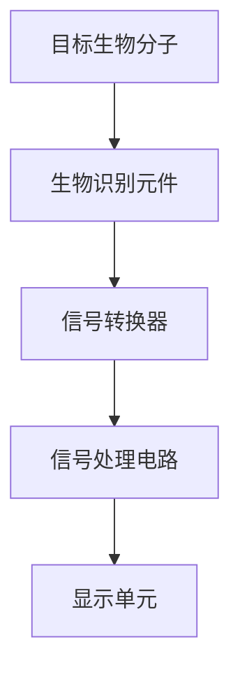

# 价值投资中的新一代生物传感器技术前景

> 关键词：价值投资、新一代生物传感器技术、市场前景、技术原理、应用场景

> 摘要：本文聚焦于价值投资视角下新一代生物传感器技术的前景。首先介绍了文章的背景，包括目的、预期读者、文档结构和相关术语。接着阐述了生物传感器的核心概念、工作原理和架构，通过Mermaid流程图展示其工作流程。详细讲解了核心算法原理，并用Python代码进行说明。引入数学模型和公式，结合实际例子帮助理解。通过项目实战，展示了开发环境搭建、源代码实现和代码解读。分析了生物传感器在医疗健康、环境监测等实际应用场景。推荐了学习资源、开发工具框架和相关论文著作。最后总结了该技术的未来发展趋势与挑战，解答常见问题，并提供扩展阅读和参考资料，为价值投资者和相关技术人员提供全面的技术分析和市场洞察。

## 1. 背景介绍 
### 1.1 目的和范围
本文章旨在从价值投资的角度深入分析新一代生物传感器技术的前景。价值投资强调对资产内在价值的评估，而新一代生物传感器技术作为新兴的科技领域，具有巨大的发展潜力和投资价值。我们将探讨该技术的核心概念、原理、应用场景，以及在市场中的发展趋势和潜在风险，为投资者提供全面的信息和决策依据。文章的范围涵盖了生物传感器技术的基础知识、技术发展动态、实际应用案例以及相关的市场分析。

### 1.2 预期读者
本文的预期读者主要包括价值投资者、金融分析师、生物传感器技术的研发人员、相关行业的创业者以及对新兴科技领域感兴趣的人士。对于投资者来说，希望通过本文了解生物传感器技术的投资价值和潜在回报；研发人员可以从中获取技术发展的新趋势和创新思路；创业者能够找到商业机会和市场切入点；而普通读者则可以对这一前沿技术有更深入的认识。

### 1.3 文档结构概述
本文将按照以下结构进行阐述：首先介绍生物传感器的核心概念和工作原理，包括相关的架构和流程图；接着详细讲解核心算法原理，并给出Python代码示例；引入数学模型和公式，通过具体例子加深理解；进行项目实战，展示开发环境搭建、源代码实现和代码解读；分析生物传感器在不同领域的实际应用场景；推荐学习资源、开发工具框架和相关论文著作；最后总结该技术的未来发展趋势与挑战，解答常见问题，并提供扩展阅读和参考资料。

### 1.4 术语表
#### 1.4.1 核心术语定义
- **生物传感器**：是一种对生物物质敏感并将其浓度转换为电信号进行检测的仪器。它由生物识别元件和信号转换器组成，能够特异性地识别目标生物分子，并将其与生物分子之间的相互作用转化为可测量的电信号、光学信号等。
- **价值投资**：一种投资策略，通过对资产的内在价值进行评估，寻找被低估的资产进行投资，以获取长期的投资回报。价值投资者关注资产的基本面，如盈利能力、现金流、资产负债表等，而不仅仅是市场价格的波动。
- **新一代生物传感器技术**：指近年来发展起来的具有更高灵敏度、特异性、稳定性和集成度的生物传感器技术，包括纳米技术、微流控技术、生物芯片技术等在生物传感器中的应用。

#### 1.4.2 相关概念解释
- **生物识别元件**：是生物传感器的关键组成部分，能够特异性地识别目标生物分子。常见的生物识别元件包括酶、抗体、核酸、细胞等。它们与目标生物分子之间的相互作用具有高度的特异性，如酶与底物的特异性结合、抗体与抗原的特异性识别等。
- **信号转换器**：将生物识别元件与目标生物分子之间的相互作用转化为可测量的信号。常见的信号转换方式包括电化学、光学、压电等。例如，电化学信号转换器可以将生物反应产生的电流、电位变化转换为电信号进行检测。
- **纳米技术**：研究尺寸在1 - 100纳米范围内的物质的性质和应用的技术。在生物传感器中，纳米技术可以用于制备纳米材料作为生物识别元件或信号转换器，提高传感器的灵敏度和性能。

#### 1.4.3 缩略词列表
- **FET**：Field - Effect Transistor，场效应晶体管
- **SPR**：Surface Plasmon Resonance，表面等离子体共振
- **MEMS**：Micro - Electro - Mechanical Systems，微机电系统

## 2. 核心概念与联系 

### 2.1 生物传感器的工作原理
生物传感器的基本工作原理是利用生物识别元件对目标生物分子的特异性识别作用，将生物分子的浓度或活性信息转化为可测量的信号。具体来说，当目标生物分子与生物识别元件结合时，会引起生物识别元件的物理或化学性质发生变化，这种变化通过信号转换器转换为电信号、光学信号等，然后经过信号处理和分析，得到目标生物分子的浓度或活性信息。

### 2.2 生物传感器的架构
一个典型的生物传感器主要由生物识别元件、信号转换器、信号处理电路和显示单元组成。生物识别元件直接与目标生物分子接触，进行特异性识别；信号转换器将生物识别元件与目标生物分子之间的相互作用转化为电信号或其他可测量的信号；信号处理电路对信号进行放大、滤波、数字化等处理；显示单元将处理后的信号以直观的方式显示出来，如数字、图表等。

下面是生物传感器工作流程的Mermaid流程图：


### 2.3 新一代生物传感器技术的特点
新一代生物传感器技术具有以下特点：
- **高灵敏度**：能够检测到极低浓度的目标生物分子，例如在疾病早期诊断中，可以检测到血液中微量的生物标志物。
- **高特异性**：只对特定的目标生物分子产生响应，减少了其他物质的干扰，提高了检测的准确性。
- **快速响应**：能够在短时间内完成检测，满足实时监测的需求。
- **集成化和微型化**：采用微纳加工技术，将生物传感器的各个组成部分集成在一个微小的芯片上，实现小型化和便携化。
- **多功能化**：可以同时检测多种目标生物分子，提供更全面的信息。

## 3. 核心算法原理 & 具体操作步骤 

### 3.1 核心算法原理
在生物传感器中，一个常见的算法是基于电化学信号的定量分析算法。以安培型生物传感器为例，其基本原理是通过测量生物反应产生的电流来确定目标生物分子的浓度。假设生物反应产生的电流 $I$ 与目标生物分子的浓度 $C$ 之间存在线性关系，即：

$I = kC + b$

其中，$k$ 是灵敏度系数，$b$ 是截距。通过对已知浓度的标准样品进行测量，得到一系列的电流值，然后使用线性回归算法来确定 $k$ 和 $b$ 的值。

### 3.2 Python代码实现
以下是一个简单的Python代码示例，用于实现基于线性回归的生物传感器数据处理：

```python
import numpy as np
from sklearn.linear_model import LinearRegression

# 已知的目标生物分子浓度
concentrations = np.array([1, 2, 3, 4, 5]).reshape(-1, 1)
# 对应的测量电流值
currents = np.array([2.1, 4.2, 6.3, 8.4, 10.5])

# 创建线性回归模型
model = LinearRegression()
# 拟合数据
model.fit(concentrations, currents)

# 获取灵敏度系数和截距
k = model.coef_[0]
b = model.intercept_

print(f"灵敏度系数 k: {k}")
print(f"截距 b: {b}")

# 预测未知浓度的目标生物分子的电流值
unknown_concentration = np.array([6]).reshape(-1, 1)
predicted_current = model.predict(unknown_concentration)
print(f"未知浓度为 6 时的预测电流值: {predicted_current[0]}")
```

### 3.3 具体操作步骤
1. **数据采集**：使用生物传感器对已知浓度的标准样品进行测量，记录对应的电流值。
2. **数据预处理**：将采集到的数据进行整理，将浓度值和电流值分别存储在数组中。
3. **模型训练**：使用线性回归算法对数据进行拟合，得到灵敏度系数和截距。
4. **预测**：对于未知浓度的目标生物分子，使用训练好的模型预测其对应的电流值。

## 4. 数学模型和公式 & 详细讲解 & 举例说明 

### 4.1 线性回归模型
线性回归是一种广泛应用于数据分析和预测的统计模型，其基本形式为：

$y = \beta_0 + \beta_1x + \epsilon$

其中，$y$ 是因变量（在生物传感器中可以是测量的电流值），$x$ 是自变量（可以是目标生物分子的浓度），$\beta_0$ 是截距，$\beta_1$ 是斜率（即灵敏度系数），$\epsilon$ 是误差项。

### 4.2 最小二乘法求解参数
在实际应用中，通常使用最小二乘法来求解线性回归模型的参数 $\beta_0$ 和 $\beta_1$。最小二乘法的目标是使预测值与实际值之间的误差平方和最小，即：

$S(\beta_0, \beta_1)=\sum_{i = 1}^{n}(y_i - (\beta_0+\beta_1x_i))^2$

通过对 $S(\beta_0, \beta_1)$ 分别求关于 $\beta_0$ 和 $\beta_1$ 的偏导数，并令其等于 0，可以得到：

$\frac{\partial S}{\partial \beta_0}=-2\sum_{i = 1}^{n}(y_i - (\beta_0+\beta_1x_i)) = 0$

$\frac{\partial S}{\partial \beta_1}=-2\sum_{i = 1}^{n}x_i(y_i - (\beta_0+\beta_1x_i)) = 0$

解上述方程组，可以得到：

$\beta_1=\frac{\sum_{i = 1}^{n}(x_i-\bar{x})(y_i - \bar{y})}{\sum_{i = 1}^{n}(x_i-\bar{x})^2}$

$\beta_0=\bar{y}-\beta_1\bar{x}$

其中，$\bar{x}=\frac{1}{n}\sum_{i = 1}^{n}x_i$，$\bar{y}=\frac{1}{n}\sum_{i = 1}^{n}y_i$。

### 4.3 举例说明
假设我们有以下生物传感器测量数据：

| 目标生物分子浓度 ($x$) | 测量电流值 ($y$) |
| --- | --- |
| 1 | 2 |
| 2 | 4 |
| 3 | 6 |
| 4 | 8 |
| 5 | 10 |

首先计算 $\bar{x}$ 和 $\bar{y}$：

$\bar{x}=\frac{1 + 2+3+4+5}{5}=3$

$\bar{y}=\frac{2 + 4+6+8+10}{5}=6$

然后计算 $\beta_1$：

$\sum_{i = 1}^{5}(x_i-\bar{x})(y_i - \bar{y})=(1 - 3)(2 - 6)+(2 - 3)(4 - 6)+(3 - 3)(6 - 6)+(4 - 3)(8 - 6)+(5 - 3)(10 - 6)$

$=(-2)\times(-4)+(-1)\times(-2)+0\times0 + 1\times2+2\times4$

$=8 + 2+0+2+8 = 20$

$\sum_{i = 1}^{5}(x_i-\bar{x})^2=(1 - 3)^2+(2 - 3)^2+(3 - 3)^2+(4 - 3)^2+(5 - 3)^2$

$=(-2)^2+(-1)^2+0^2+1^2+2^2=4 + 1+0+1+4 = 10$

$\beta_1=\frac{20}{10}=2$

最后计算 $\beta_0$：

$\beta_0=6 - 2\times3=0$

所以，线性回归方程为 $y = 2x$，即灵敏度系数 $k = 2$，截距 $b = 0$。

## 5. 项目实战：代码实际案例和详细解释说明 

### 5.1  开发环境搭建
要进行生物传感器数据处理的项目实战，我们需要搭建以下开发环境：
- **编程语言**：Python，它具有丰富的科学计算和数据分析库。
- **开发工具**：可以选择使用Jupyter Notebook，它提供了一个交互式的开发环境，方便代码的编写、调试和展示。
- **相关库**：需要安装 `numpy`、`pandas`、`scikit - learn` 等库。可以使用以下命令进行安装：

```sh
pip install numpy pandas scikit-learn
```

### 5.2  源代码详细实现和代码解读
以下是一个更完整的Python代码示例，用于生物传感器数据的处理和分析：

```python
import numpy as np
import pandas as pd
from sklearn.linear_model import LinearRegression
import matplotlib.pyplot as plt

# 模拟生物传感器测量数据
data = {
    'Concentration': [1, 2, 3, 4, 5],
    'Current': [2.1, 4.2, 6.3, 8.4, 10.5]
}
df = pd.DataFrame(data)

# 提取自变量和因变量
X = df['Concentration'].values.reshape(-1, 1)
y = df['Current'].values

# 创建线性回归模型
model = LinearRegression()
# 拟合数据
model.fit(X, y)

# 获取灵敏度系数和截距
k = model.coef_[0]
b = model.intercept_

print(f"灵敏度系数 k: {k}")
print(f"截距 b: {b}")

# 预测未知浓度的目标生物分子的电流值
unknown_concentration = np.array([6]).reshape(-1, 1)
predicted_current = model.predict(unknown_concentration)
print(f"未知浓度为 6 时的预测电流值: {predicted_current[0]}")

# 绘制数据点和拟合直线
plt.scatter(X, y, color='blue', label='Data Points')
plt.plot(X, model.predict(X), color='red', linewidth=2, label='Fitted Line')
plt.xlabel('Concentration')
plt.ylabel('Current')
plt.title('Bio - sensor Data Analysis')
plt.legend()
plt.show()
```

### 代码解读与分析
1. **数据模拟**：使用 `pandas` 库创建一个包含目标生物分子浓度和测量电流值的DataFrame对象。
2. **数据提取**：从DataFrame中提取自变量（浓度）和因变量（电流），并将自变量转换为二维数组。
3. **模型创建和拟合**：使用 `scikit - learn` 库的 `LinearRegression` 类创建线性回归模型，并使用 `fit` 方法对数据进行拟合。
4. **参数获取和预测**：使用 `coef_` 和 `intercept_` 属性获取灵敏度系数和截距，然后使用 `predict` 方法对未知浓度的目标生物分子的电流值进行预测。
5. **数据可视化**：使用 `matplotlib` 库绘制数据点和拟合直线，直观地展示数据的分布和拟合效果。

## 6. 实际应用场景 
### 6.1 医疗健康领域
- **疾病诊断**：新一代生物传感器可以检测血液、尿液等生物样本中的生物标志物，如蛋白质、核酸、细胞因子等，用于疾病的早期诊断和筛查。例如，检测肿瘤标志物可以帮助早期发现癌症；检测血糖、血脂等指标可以用于糖尿病、心血管疾病的诊断和监测。
- **药物研发**：在药物研发过程中，生物传感器可以用于监测药物与生物分子之间的相互作用，评估药物的疗效和安全性。例如，通过检测药物对细胞的影响，筛选出具有潜在治疗价值的药物。
- **健康监测**：可穿戴式生物传感器可以实时监测人体的生理参数，如心率、血压、体温等，为个人健康管理提供数据支持。例如，智能手环、智能手表等设备中集成了生物传感器，方便人们随时了解自己的健康状况。

### 6.2 环境监测领域
- **水质监测**：生物传感器可以检测水中的污染物，如重金属、农药、微生物等，实时监测水质状况。例如，利用酶生物传感器检测水中的酚类化合物，具有灵敏度高、响应快的特点。
- **空气质量监测**：通过检测空气中的有害气体和生物气溶胶，生物传感器可以评估空气质量。例如，使用纳米材料修饰的生物传感器检测空气中的甲醛、苯等有害气体。
- **土壤监测**：生物传感器可以检测土壤中的养分、污染物等，为农业生产和环境保护提供数据支持。例如，检测土壤中的氮、磷、钾等养分含量，指导合理施肥。

### 6.3 食品工业领域
- **食品安全检测**：生物传感器可以检测食品中的有害物质，如农药残留、兽药残留、微生物污染等，保障食品安全。例如，使用免疫传感器检测牛奶中的抗生素残留。
- **食品质量控制**：通过检测食品中的成分和品质指标，生物传感器可以实现食品质量的快速检测和控制。例如，检测食品中的糖分、酸度、蛋白质含量等。

## 7. 工具和资源推荐
### 7.1 学习资源推荐
#### 7.1.1 书籍推荐
- 《生物传感器原理与应用》：全面介绍了生物传感器的基本原理、分类、设计和应用，是学习生物传感器的经典教材。
- 《纳米生物传感器》：重点介绍了纳米技术在生物传感器中的应用，包括纳米材料的制备、性质和应用，以及纳米生物传感器的设计和性能。
- 《生物医学传感器原理与设计》：结合生物医学工程的背景，详细介绍了生物医学传感器的原理、设计和应用，适合从事生物医学领域的读者阅读。

#### 7.1.2 在线课程
- Coursera上的“Bioelectronics and Biosensors”课程：由知名高校的教授授课，系统地介绍了生物电子学和生物传感器的基础知识和前沿技术。
- edX上的“Biosensors: From Fundamentals to Applications”课程：涵盖了生物传感器的基本原理、设计和应用，通过实际案例和实验操作加深学生的理解。

#### 7.1.3 技术博客和网站
- 生物谷（https://www.bioon.com.cn/）：提供生物科技领域的最新资讯、研究成果和技术应用，包括生物传感器的相关内容。
- 传感器专家网（https://www.sensorexpert.com.cn/）：专注于传感器技术的介绍和应用，有大量关于生物传感器的技术文章和产品信息。

### 7.2 开发工具框架推荐
#### 7.2.1 IDE和编辑器
- Jupyter Notebook：是一个交互式的开发环境，支持Python、R等多种编程语言，适合进行数据分析和模型开发。
- PyCharm：是一款专业的Python集成开发环境，提供了丰富的代码编辑、调试和分析功能，适合大规模的Python项目开发。

#### 7.2.2 调试和性能分析工具
- `pdb`：Python自带的调试工具，可以在代码中设置断点，逐行调试代码，方便查找和解决问题。
- `cProfile`：Python的性能分析工具，可以统计代码的执行时间和函数调用次数，帮助优化代码性能。

#### 7.2.3 相关框架和库
- `numpy`：是Python的一个基础科学计算库，提供了高效的数组操作和数学函数，是生物传感器数据处理的重要工具。
- `pandas`：是一个数据处理和分析库，提供了灵活的数据结构和数据操作方法，方便对生物传感器数据进行整理和分析。
- `scikit - learn`：是一个机器学习库，提供了丰富的机器学习算法和工具，可用于生物传感器数据的建模和预测。

### 7.3 相关论文著作推荐
#### 7.3.1 经典论文
- “Biosensors: Sense and Sensibility”：发表于《Nature》杂志，全面综述了生物传感器的发展历程、原理和应用，是生物传感器领域的经典论文。
- “Nanomaterial - Based Electrochemical Biosensors for Biomedical Applications”：介绍了纳米材料在电化学生物传感器中的应用，为纳米生物传感器的研究提供了重要的理论基础。

#### 7.3.2 最新研究成果
- 可以通过IEEE Xplore、ACM Digital Library、ScienceDirect等学术数据库搜索最新的生物传感器研究成果，关注领域内的前沿技术和创新应用。

#### 7.3.3 应用案例分析
- 一些专业的生物医学期刊和会议论文集中会有生物传感器在实际应用中的案例分析，如《Journal of Biomedical and Health Informatics》、《IEEE Sensors Journal》等。

## 8. 总结：未来发展趋势与挑战
### 8.1 未来发展趋势
- **集成化和微型化**：新一代生物传感器将朝着集成化和微型化的方向发展，将多个生物传感器集成在一个微小的芯片上，实现多功能检测和实时监测。例如，开发可穿戴式的集成生物传感器设备，能够同时检测多种生理参数。
- **智能化**：引入人工智能和机器学习算法，实现生物传感器数据的智能分析和处理。例如，通过深度学习算法对生物传感器数据进行模式识别和分类，提高疾病诊断的准确性和效率。
- **与其他技术的融合**：生物传感器将与纳米技术、微流控技术、生物技术等其他技术深度融合，开发出具有更高性能和功能的生物传感器。例如，结合纳米技术和微流控技术，实现生物分子的快速分离和检测。
- **拓展应用领域**：除了医疗健康、环境监测和食品工业等传统领域，生物传感器将在更多领域得到应用，如农业、生物能源、生物安全等。例如，在农业领域，用于检测农作物的病虫害和养分状况。

### 8.2 挑战
- **灵敏度和特异性**：进一步提高生物传感器的灵敏度和特异性，以满足对微量生物分子和复杂生物样本的检测需求，仍然是一个挑战。
- **稳定性和可靠性**：生物传感器在长期使用过程中，需要保持良好的稳定性和可靠性，避免受到环境因素和生物样本的影响。
- **成本和可扩展性**：降低生物传感器的生产成本，提高生产效率，实现大规模生产和应用，是推广生物传感器技术的关键。
- **伦理和法律问题**：随着生物传感器在医疗健康等领域的广泛应用，涉及到个人隐私保护、数据安全等伦理和法律问题，需要建立相应的法规和制度来规范。

## 9. 附录：常见问题与解答
### 9.1 生物传感器的检测限是多少？
生物传感器的检测限取决于多种因素，如生物识别元件的性能、信号转换器的灵敏度、检测方法等。一般来说，新一代生物传感器的检测限可以达到纳摩尔（nM）甚至皮摩尔（pM）级别。

### 9.2 生物传感器的使用寿命有多长？
生物传感器的使用寿命受到多种因素的影响，如生物识别元件的稳定性、使用环境、保存条件等。一般来说，电化学生物传感器的使用寿命在几个月到一年左右，而光学生物传感器的使用寿命可能更长。

### 9.3 如何选择适合的生物传感器？
选择适合的生物传感器需要考虑以下因素：检测目标、检测灵敏度、特异性、响应时间、成本、使用环境等。例如，如果需要检测微量的生物标志物，应选择灵敏度高的生物传感器；如果需要在复杂的生物样本中进行检测，应选择特异性好的生物传感器。

## 10. 扩展阅读 & 参考资料
### 10.1 扩展阅读
- 《人工智能与生物传感器的融合发展》
- 《生物传感器在精准医疗中的应用前景》

### 10.2 参考资料
- 相关的学术论文和研究报告
- 生物传感器制造商的产品说明书和技术文档
- 行业标准和规范

作者：AI天才研究院/AI Genius Institute & 禅与计算机程序设计艺术 /Zen And The Art of Computer Programming