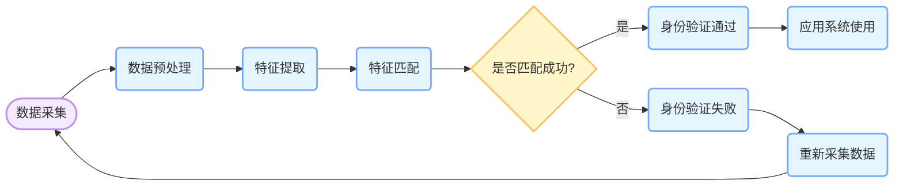

# 价值投资中的新一代生物识别技术前景

> 关键词：价值投资、新一代生物识别技术、市场前景、技术原理、应用场景

> 摘要：本文聚焦于价值投资视角下新一代生物识别技术的前景。首先介绍了生物识别技术的背景，包括目的、预期读者等内容。接着深入剖析核心概念与联系，阐述其原理和架构，并通过Mermaid流程图直观展示。详细讲解了核心算法原理及具体操作步骤，辅以Python代码说明。引入数学模型和公式进行深入分析，并举例解释。通过项目实战案例，对代码实现和解读进行详细探讨。列举了该技术的实际应用场景，推荐了相关学习资源、开发工具框架和论文著作。最后总结了未来发展趋势与挑战，还包含常见问题解答和扩展阅读参考资料，旨在为价值投资者全面呈现新一代生物识别技术的潜力与投资价值。

## 1. 背景介绍 
### 1.1 目的和范围
本文章旨在从价值投资的角度全面分析新一代生物识别技术的前景。一方面，深入探讨新一代生物识别技术的核心原理、算法、数学模型等技术层面的内容，让读者对该技术有深入的理解；另一方面，结合实际应用场景和市场情况，评估其商业价值和投资潜力，为价值投资者提供决策参考。范围涵盖了新一代生物识别技术的多个方面，包括指纹识别、人脸识别、虹膜识别、静脉识别等主流技术，以及相关的开发工具、学习资源和研究成果。

### 1.2 预期读者
本文的预期读者主要包括价值投资者，他们希望通过了解新一代生物识别技术的发展趋势和市场前景，寻找有潜力的投资项目；技术开发者，他们对生物识别技术的原理、算法和实现细节感兴趣，希望从中获取技术灵感和开发经验；行业研究人员，他们需要对生物识别技术的整体情况进行深入研究，为行业发展提供参考和建议。

### 1.3 文档结构概述
本文将按照以下结构展开：首先介绍新一代生物识别技术的背景信息，包括目的、预期读者和文档结构等；接着阐述核心概念与联系，通过文本示意图和Mermaid流程图展示技术原理和架构；然后详细讲解核心算法原理及具体操作步骤，使用Python代码进行说明；引入数学模型和公式进行深入分析，并举例解释；通过项目实战案例，对代码实现和解读进行详细探讨；列举该技术的实际应用场景；推荐相关学习资源、开发工具框架和论文著作；最后总结未来发展趋势与挑战，包含常见问题解答和扩展阅读参考资料。

### 1.4 术语表
#### 1.4.1 核心术语定义
- **生物识别技术**：通过计算机与光学、声学、生物传感器和生物统计学原理等高科技手段密切结合，利用人体固有的生理特性，如指纹、脸象、虹膜等和行为特征，如笔迹、声音、步态等进行个人身份的鉴定。
- **价值投资**：一种常见的投资方式，专门寻找价格低估的证券。不同于成长型投资人，价值型投资人偏好本益比、帐面价值或其他价值衡量基准偏低的股票。
- **新一代生物识别技术**：在传统生物识别技术基础上，融合了人工智能、大数据、云计算等新兴技术，具有更高的准确性、安全性和便捷性的生物识别技术。

#### 1.4.2 相关概念解释
- **特征提取**：从生物特征数据中提取出能够代表个体特征的关键信息，如指纹的细节特征、人脸的关键点特征等。
- **特征匹配**：将提取的特征与预先存储的特征模板进行比对，计算相似度得分，以确定是否为同一人。
- **活体检测**：用于判断生物特征是否来自真实的活体，防止使用照片、视频、模型等伪造生物特征进行欺诈。

#### 1.4.3 缩略词列表
- **AI**：Artificial Intelligence，人工智能
- **ML**：Machine Learning，机器学习
- **DL**：Deep Learning，深度学习
- **SDK**：Software Development Kit，软件开发工具包

## 2. 核心概念与联系 

### 核心概念原理
新一代生物识别技术主要基于人体的生理特征和行为特征进行身份识别。以下是几种常见的生物识别技术的原理：

#### 指纹识别
指纹是人类手指末端皮肤上的凹凸纹路，其纹路细节特征具有唯一性和稳定性。指纹识别技术通过光学、电容、超声波等传感器采集指纹图像，然后对图像进行预处理，包括去噪、增强、细化等操作，提取指纹的细节特征点，如断点、分叉点等，最后将提取的特征与预先存储的指纹模板进行匹配，判断是否为同一指纹。

#### 人脸识别
人脸识别技术利用摄像头采集人脸图像，首先进行人脸检测，确定人脸在图像中的位置和大小，然后进行人脸特征提取，通常采用深度学习算法，如卷积神经网络（CNN），提取人脸的关键点特征和纹理特征等，最后将提取的特征与预先存储的人脸模板进行比对，判断是否为同一人。

#### 虹膜识别
虹膜是眼睛瞳孔周围的环形区域，其纹理特征具有高度的唯一性和稳定性。虹膜识别技术通过近红外摄像头采集虹膜图像，对图像进行预处理，包括定位、归一化、增强等操作，提取虹膜的纹理特征，最后将提取的特征与预先存储的虹膜模板进行匹配。

#### 静脉识别
静脉识别技术利用近红外光照射手指或手掌，由于静脉中的血红蛋白对近红外光有吸收作用，因此可以通过摄像头采集到静脉的图像。对采集到的静脉图像进行预处理，提取静脉的特征，最后将提取的特征与预先存储的静脉模板进行匹配。

### 架构的文本示意图
```plaintext
新一代生物识别技术架构
|-- 数据采集层
|   |-- 指纹传感器
|   |-- 摄像头（用于人脸、虹膜识别）
|   |-- 近红外摄像头（用于静脉识别）
|-- 数据预处理层
|   |-- 图像去噪
|   |-- 图像增强
|   |-- 特征提取
|-- 特征匹配层
|   |-- 模板库
|   |-- 匹配算法
|-- 应用层
|   |-- 门禁系统
|   |-- 支付系统
|   |-- 安防监控系统
```

### Mermaid流程图


## 3. 核心算法原理 & 具体操作步骤 

### 指纹识别算法原理及Python代码示例
指纹识别的核心算法包括指纹特征提取和特征匹配。这里我们以细节特征点提取为例，使用Python的OpenCV库进行简单的实现。

```python
import cv2
import numpy as np

def fingerprint_feature_extraction(image_path):
    # 读取指纹图像
    image = cv2.imread(image_path, 0)
    # 图像增强
    enhanced_image = cv2.equalizeHist(image)
    # 二值化处理
    _, binary_image = cv2.threshold(enhanced_image, 127, 255, cv2.THRESH_BINARY)
    # 细化处理
    skeleton = cv2.ximgproc.thinning(binary_image)
    # 查找细节特征点
    contours, _ = cv2.findContours(skeleton.copy(), cv2.RETR_EXTERNAL, cv2.CHAIN_APPROX_SIMPLE)
    feature_points = []
    for contour in contours:
        M = cv2.moments(contour)
        if M["m00"]!= 0:
            cX = int(M["m10"] / M["m00"])
            cY = int(M["m01"] / M["m00"])
            feature_points.append((cX, cY))
    return feature_points

# 示例调用
image_path = 'fingerprint.jpg'
feature_points = fingerprint_feature_extraction(image_path)
print("提取的指纹特征点数量:", len(feature_points))
```

### 操作步骤
1. **数据采集**：使用指纹传感器采集指纹图像。
2. **数据预处理**：对采集到的指纹图像进行去噪、增强、二值化等处理，提高图像质量。
3. **特征提取**：通过细化处理提取指纹的细节特征点。
4. **特征匹配**：将提取的特征点与预先存储的指纹模板进行匹配，计算相似度得分。

### 人脸识别算法原理及Python代码示例
人脸识别的核心算法包括人脸检测和人脸特征提取。这里我们使用OpenCV的Haar级联分类器进行人脸检测，使用深度学习库`face_recognition`进行人脸特征提取。

```python
import cv2
import face_recognition

def face_detection_and_feature_extraction(image_path):
    # 读取图像
    image = cv2.imread(image_path)
    # 人脸检测
    face_locations = face_recognition.face_locations(image)
    # 人脸特征提取
    face_encodings = face_recognition.face_encodings(image, face_locations)
    return face_encodings

# 示例调用
image_path = 'face.jpg'
face_encodings = face_detection_and_feature_extraction(image_path)
print("检测到的人脸数量:", len(face_encodings))
```

### 操作步骤
1. **数据采集**：使用摄像头采集人脸图像。
2. **人脸检测**：使用Haar级联分类器或深度学习算法检测图像中的人脸位置。
3. **人脸特征提取**：使用深度学习模型提取人脸的特征向量。
4. **特征匹配**：将提取的特征向量与预先存储的人脸模板进行比对，计算相似度得分。

## 4. 数学模型和公式 & 详细讲解 & 举例说明 

### 相似度计算模型
在生物识别技术中，特征匹配通常通过计算特征之间的相似度来判断是否为同一人。常见的相似度计算方法包括欧氏距离、余弦相似度等。

#### 欧氏距离
欧氏距离是最常用的距离度量方法之一，用于计算两个向量之间的直线距离。假设有两个特征向量 $\mathbf{x}=(x_1,x_2,\cdots,x_n)$ 和 $\mathbf{y}=(y_1,y_2,\cdots,y_n)$，它们之间的欧氏距离 $d(\mathbf{x},\mathbf{y})$ 定义为：
$$d(\mathbf{x},\mathbf{y})=\sqrt{\sum_{i=1}^{n}(x_i - y_i)^2}$$

在生物识别中，如果两个特征向量的欧氏距离小于某个阈值，则认为它们是匹配的。

#### 余弦相似度
余弦相似度用于衡量两个向量之间的夹角余弦值，反映了两个向量的方向相似性。假设有两个特征向量 $\mathbf{x}$ 和 $\mathbf{y}$，它们之间的余弦相似度 $cosine(\mathbf{x},\mathbf{y})$ 定义为：
$$cosine(\mathbf{x},\mathbf{y})=\frac{\mathbf{x}\cdot\mathbf{y}}{\|\mathbf{x}\|\|\mathbf{y}\|}=\frac{\sum_{i=1}^{n}x_iy_i}{\sqrt{\sum_{i=1}^{n}x_i^2}\sqrt{\sum_{i=1}^{n}y_i^2}}$$

余弦相似度的值越接近1，表示两个向量越相似。

### 举例说明
假设我们有两个指纹特征向量 $\mathbf{x}=(1, 2, 3)$ 和 $\mathbf{y}=(2, 3, 4)$，分别计算它们的欧氏距离和余弦相似度。

#### 欧氏距离计算
$$d(\mathbf{x},\mathbf{y})=\sqrt{(1 - 2)^2+(2 - 3)^2+(3 - 4)^2}=\sqrt{1 + 1 + 1}=\sqrt{3}\approx1.732$$

#### 余弦相似度计算
$$\mathbf{x}\cdot\mathbf{y}=1\times2 + 2\times3 + 3\times4 = 2 + 6 + 12 = 20$$
$$\|\mathbf{x}\|=\sqrt{1^2 + 2^2 + 3^2}=\sqrt{1 + 4 + 9}=\sqrt{14}\approx3.742$$
$$\|\mathbf{y}\|=\sqrt{2^2 + 3^2 + 4^2}=\sqrt{4 + 9 + 16}=\sqrt{29}\approx5.385$$
$$cosine(\mathbf{x},\mathbf{y})=\frac{20}{3.742\times5.385}\approx0.993$$

## 5. 项目实战：代码实际案例和详细解释说明 

### 5.1  开发环境搭建
#### 指纹识别项目
- **操作系统**：Windows 10 或 Linux（如 Ubuntu）
- **Python 版本**：Python 3.7 及以上
- **依赖库**：OpenCV、NumPy
- **安装命令**：
```bash
pip install opencv-python numpy
```

#### 人脸识别项目
- **操作系统**：Windows 10 或 Linux（如 Ubuntu）
- **Python 版本**：Python 3.7 及以上
- **依赖库**：OpenCV、face_recognition
- **安装命令**：
```bash
pip install opencv-python face_recognition
```

### 5.2  源代码详细实现和代码解读
#### 指纹识别项目
```python
import cv2
import numpy as np

def fingerprint_feature_extraction(image_path):
    # 读取指纹图像
    image = cv2.imread(image_path, 0)
    # 图像增强
    enhanced_image = cv2.equalizeHist(image)
    # 二值化处理
    _, binary_image = cv2.threshold(enhanced_image, 127, 255, cv2.THRESH_BINARY)
    # 细化处理
    skeleton = cv2.ximgproc.thinning(binary_image)
    # 查找细节特征点
    contours, _ = cv2.findContours(skeleton.copy(), cv2.RETR_EXTERNAL, cv2.CHAIN_APPROX_SIMPLE)
    feature_points = []
    for contour in contours:
        M = cv2.moments(contour)
        if M["m00"]!= 0:
            cX = int(M["m10"] / M["m00"])
            cY = int(M["m01"] / M["m00"])
            feature_points.append((cX, cY))
    return feature_points

# 示例调用
image_path = 'fingerprint.jpg'
feature_points = fingerprint_feature_extraction(image_path)
print("提取的指纹特征点数量:", len(feature_points))
```

**代码解读**：
1. **图像读取**：使用`cv2.imread`函数读取指纹图像，以灰度模式读取（参数为 0）。
2. **图像增强**：使用`cv2.equalizeHist`函数对图像进行直方图均衡化，增强图像的对比度。
3. **二值化处理**：使用`cv2.threshold`函数将图像转换为二值图像，阈值为 127。
4. **细化处理**：使用`cv2.ximgproc.thinning`函数对二值图像进行细化处理，提取指纹的骨架。
5. **细节特征点查找**：使用`cv2.findContours`函数查找骨架图像中的轮廓，然后计算每个轮廓的质心，作为细节特征点。

#### 人脸识别项目
```python
import cv2
import face_recognition

def face_detection_and_feature_extraction(image_path):
    # 读取图像
    image = cv2.imread(image_path)
    # 人脸检测
    face_locations = face_recognition.face_locations(image)
    # 人脸特征提取
    face_encodings = face_recognition.face_encodings(image, face_locations)
    return face_encodings

# 示例调用
image_path = 'face.jpg'
face_encodings = face_detection_and_feature_extraction(image_path)
print("检测到的人脸数量:", len(face_encodings))
```

**代码解读**：
1. **图像读取**：使用`cv2.imread`函数读取图像。
2. **人脸检测**：使用`face_recognition.face_locations`函数检测图像中的人脸位置。
3. **人脸特征提取**：使用`face_recognition.face_encodings`函数提取检测到的人脸的特征向量。

### 5.3  代码解读与分析
#### 指纹识别项目
- **优点**：代码简单易懂，使用了常见的图像处理库 OpenCV，能够快速提取指纹的细节特征点。
- **缺点**：该代码只是一个简单的示例，没有考虑到指纹图像的噪声、旋转等问题，实际应用中需要更复杂的预处理和特征匹配算法。

#### 人脸识别项目
- **优点**：使用了`face_recognition`库，该库封装了深度学习模型，能够准确地检测人脸和提取人脸特征，代码实现简单。
- **缺点**：`face_recognition`库在处理大规模数据时可能会较慢，且对图像的质量要求较高。

## 6. 实际应用场景 
### 安防领域
- **门禁系统**：新一代生物识别技术可以用于办公楼、住宅小区、实验室等场所的门禁系统，通过指纹、人脸识别等方式验证人员身份，提高门禁的安全性和便捷性。
- **安防监控**：在公共场所安装人脸识别摄像头，实时监控人员的出入情况，与警方的数据库进行比对，及时发现可疑人员。

### 金融领域
- **支付系统**：生物识别技术可以用于移动支付、网上银行等场景，通过指纹、人脸识别等方式进行身份验证，确保支付的安全性。
- **身份验证**：在金融机构开户、办理业务时，使用生物识别技术进行身份验证，防止身份冒用和欺诈行为。

### 交通领域
- **机场安检**：在机场安检过程中，使用人脸识别技术快速验证旅客的身份，提高安检效率。
- **地铁、公交票务系统**：通过指纹、人脸识别等方式实现无接触式票务系统，提高乘车的便捷性。

### 教育领域
- **校园门禁**：学校可以使用生物识别技术作为校园门禁系统，确保学生和教职工的安全。
- **考试身份验证**：在考试中使用人脸识别技术验证考生的身份，防止作弊行为。

## 7. 工具和资源推荐
### 7.1 学习资源推荐
#### 7.1.1 书籍推荐
- 《数字图像处理（第3版）》：全面介绍了数字图像处理的基本原理和方法，包括图像增强、滤波、特征提取等内容，对于理解生物识别技术中的图像处理部分有很大帮助。
- 《深度学习》：由 Ian Goodfellow、Yoshua Bengio 和 Aaron Courville 合著，是深度学习领域的经典教材，涵盖了卷积神经网络、循环神经网络等内容，对于理解人脸识别、虹膜识别等深度学习算法有重要意义。
- 《生物特征识别技术》：系统介绍了生物识别技术的原理、算法和应用，包括指纹识别、人脸识别、虹膜识别等多种生物识别技术。

#### 7.1.2 在线课程
- Coursera 上的“Deep Learning Specialization”：由 Andrew Ng 教授主讲，深入讲解了深度学习的原理和应用，包括卷积神经网络、循环神经网络等内容。
- edX 上的“Introduction to Artificial Intelligence”：介绍了人工智能的基本概念和方法，包括机器学习、深度学习等内容，对于理解生物识别技术中的人工智能算法有帮助。
- 中国大学MOOC上的“数字图像处理”：由国内知名高校的教授主讲，系统介绍了数字图像处理的基本原理和方法。

#### 7.1.3 技术博客和网站
- Medium：上面有很多关于生物识别技术、人工智能、深度学习等领域的技术文章和研究成果。
- Towards Data Science：专注于数据科学和机器学习领域，有很多关于生物识别技术算法和应用的文章。
- 开源中国：国内知名的开源技术社区，有很多关于生物识别技术的开源项目和技术分享。

### 7.2 开发工具框架推荐
#### 7.2.1 IDE和编辑器
- PyCharm：一款专业的 Python 集成开发环境，提供了丰富的代码编辑、调试、版本控制等功能，适合开发生物识别技术相关的 Python 项目。
- Visual Studio Code：一款轻量级的代码编辑器，支持多种编程语言，有丰富的插件扩展，可用于开发生物识别技术项目。

#### 7.2.2 调试和性能分析工具
- Py-Spy：一个用于 Python 程序的性能分析工具，可以帮助开发者找出程序中的性能瓶颈。
- OpenCV Debugger：OpenCV 提供的调试工具，可用于调试图像处理相关的代码。

#### 7.2.3 相关框架和库
- OpenCV：一个开源的计算机视觉库，提供了丰富的图像处理和计算机视觉算法，可用于生物识别技术中的图像预处理、特征提取等步骤。
- TensorFlow：由 Google 开发的开源深度学习框架，可用于开发人脸识别、虹膜识别等深度学习算法。
- PyTorch：一个开源的深度学习框架，具有简洁易用的特点，广泛应用于学术界和工业界。

### 7.3 相关论文著作推荐
#### 7.3.1 经典论文
- “DeepFace: Closing the Gap to Human-Level Performance in Face Verification”：提出了一种基于深度学习的人脸识别算法，在人脸识别领域取得了重要突破。
- “Fingerprint Classification Using Minutiae Features”：介绍了基于细节特征点的指纹分类算法，是指纹识别领域的经典论文。
- “Iris Recognition: An Emerging Biometric Technology”：系统介绍了虹膜识别技术的原理、算法和应用，是虹膜识别领域的重要文献。

#### 7.3.2 最新研究成果
- 每年在计算机视觉领域的顶级会议（如 CVPR、ICCV、ECCV 等）上都会有关于生物识别技术的最新研究成果发表，可以关注这些会议的论文。
- 学术期刊如 IEEE Transactions on Pattern Analysis and Machine Intelligence、ACM Transactions on Intelligent Systems and Technology 等也会发表生物识别技术的最新研究成果。

#### 7.3.3 应用案例分析
- 可以关注一些知名企业（如苹果、华为、阿里巴巴等）在生物识别技术应用方面的案例分析，了解生物识别技术在实际应用中的效果和挑战。
- 一些行业报告和研究机构（如 Gartner、IDC 等）也会发布生物识别技术的应用案例和市场分析报告。

## 8. 总结：未来发展趋势与挑战
### 未来发展趋势
#### 多模态生物识别技术融合
单一的生物识别技术可能存在一定的局限性，如指纹识别容易受到手指污渍、磨损的影响，人脸识别在光照条件不佳时准确率会下降。未来，多模态生物识别技术将成为发展趋势，将指纹、人脸、虹膜、静脉等多种生物识别技术融合在一起，提高识别的准确性和安全性。

#### 与人工智能、物联网的深度融合
随着人工智能和物联网技术的发展，生物识别技术将与它们深度融合。例如，在智能家居中，通过人脸识别技术实现自动开门、自动调节家居设备等功能；在智能交通中，通过生物识别技术实现车辆的个性化设置和安全驾驶。

#### 应用场景的不断拓展
生物识别技术的应用场景将不断拓展，除了安防、金融、交通、教育等领域，还将在医疗、零售、娱乐等领域得到广泛应用。例如，在医疗领域，通过生物识别技术实现患者身份的准确识别，提高医疗服务的安全性和效率。

### 挑战
#### 安全和隐私问题
生物识别数据属于个人敏感信息，一旦泄露可能会给个人带来严重的安全和隐私风险。因此，如何保障生物识别数据的安全和隐私是一个亟待解决的问题。需要采用加密技术、访问控制技术等手段，确保生物识别数据在采集、存储、传输和使用过程中的安全性。

#### 环境适应性问题
生物识别技术在不同的环境条件下可能会受到影响，如光照、温度、湿度等因素会影响人脸识别、虹膜识别的准确性。因此，需要提高生物识别技术的环境适应性，开发出能够在复杂环境下稳定工作的生物识别系统。

#### 算法的鲁棒性和可解释性问题
目前，一些生物识别技术采用了深度学习算法，这些算法虽然在识别准确率上取得了很大的提高，但存在鲁棒性和可解释性问题。例如，深度学习模型容易受到对抗攻击的影响，而且模型的决策过程难以解释。因此，需要提高生物识别算法的鲁棒性和可解释性，确保生物识别系统的可靠性和安全性。

## 9. 附录：常见问题与解答
### 生物识别技术的准确率有多高？
生物识别技术的准确率受到多种因素的影响，如生物特征的质量、采集设备的性能、算法的优劣等。一般来说，指纹识别的准确率可以达到 98% 以上，人脸识别的准确率在理想条件下可以达到 99% 以上，虹膜识别的准确率可以达到 99.9% 以上。

### 生物识别技术安全吗？
生物识别技术本身具有较高的安全性，因为每个人的生物特征都是独一无二的。但是，生物识别数据的安全和隐私问题需要引起重视。在实际应用中，需要采用加密技术、访问控制技术等手段，确保生物识别数据的安全性。

### 生物识别技术会取代传统的身份验证方式吗？
生物识别技术具有便捷、安全等优点，在很多领域已经逐渐取代了传统的身份验证方式。但是，在一些特殊情况下，传统的身份验证方式仍然有其存在的价值。因此，未来生物识别技术和传统的身份验证方式可能会并存，相互补充。

### 生物识别技术的成本高吗？
生物识别技术的成本随着技术的发展和市场的竞争逐渐降低。目前，一些常见的生物识别设备（如指纹识别传感器、人脸识别摄像头等）的价格已经比较亲民，可以广泛应用于各种领域。

## 10. 扩展阅读 & 参考资料
### 扩展阅读
- 《人工智能时代的生物识别技术》：深入探讨了人工智能时代生物识别技术的发展趋势和应用前景。
- 《生物识别技术的法律与伦理问题研究》：分析了生物识别技术在法律和伦理方面存在的问题，并提出了相应的解决方案。

### 参考资料
- [OpenCV官方文档](https://docs.opencv.org/)
- [TensorFlow官方文档](https://www.tensorflow.org/api_docs)
- [PyTorch官方文档](https://pytorch.org/docs/stable/index.html)
- [face_recognition库文档](https://face-recognition.readthedocs.io/en/latest/)

作者：AI天才研究院/AI Genius Institute & 禅与计算机程序设计艺术 /Zen And The Art of Computer Programming