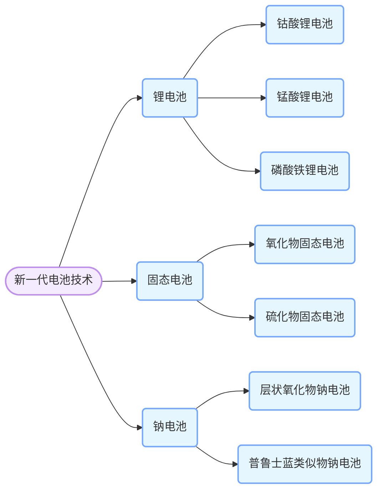

# 价值投资中的新一代电池技术分析

> 关键词：价值投资、新一代电池技术、锂电池、固态电池、钠电池、电池技术原理、投资分析

> 摘要：本文聚焦于价值投资视角下的新一代电池技术。首先介绍了文章的背景信息，包括目的、预期读者、文档结构和相关术语。接着阐述了新一代电池技术的核心概念与联系，详细讲解了常见电池技术的原理和架构。通过Python代码深入分析了核心算法原理及操作步骤，并给出了相应的数学模型和公式。以实际项目为例，展示了新一代电池技术在开发环境搭建、代码实现与解读方面的内容。探讨了新一代电池技术的实际应用场景，推荐了相关的学习资源、开发工具框架和论文著作。最后总结了新一代电池技术的未来发展趋势与挑战，解答了常见问题，并提供了扩展阅读和参考资料，旨在为价值投资者提供全面的新一代电池技术分析。

## 1. 背景介绍 
### 1.1 目的和范围
在当今社会，能源问题日益突出，电池技术作为能源存储和转换的关键环节，受到了广泛的关注。新一代电池技术的发展不仅关系到电动汽车、便携式电子设备等行业的进步，也对可再生能源的大规模应用起着至关重要的作用。对于价值投资者来说，准确把握新一代电池技术的发展趋势和投资价值，能够在投资决策中获得优势。本文的目的就是从价值投资的角度，对新一代电池技术进行全面深入的分析，涵盖常见的锂电池、固态电池、钠电池等技术，探讨其技术原理、市场前景和投资潜力。

### 1.2 预期读者
本文预期读者主要包括对价值投资感兴趣的个人投资者、金融机构的投资分析师、电池技术相关行业的从业者以及对能源和科技领域有研究需求的科研人员。对于个人投资者，本文可以帮助他们了解新一代电池技术的投资价值，为投资决策提供参考；对于投资分析师，可作为研究报告的资料来源，进一步深入分析市场趋势；对于行业从业者，有助于他们把握技术发展方向，调整企业战略；对于科研人员，能为其研究提供不同的视角和思路。

### 1.3 文档结构概述
本文共分为十个部分。第一部分为背景介绍，阐述了文章的目的、预期读者、文档结构和术语表。第二部分讲解核心概念与联系，介绍新一代电池技术的原理和架构，并给出相应的示意图和流程图。第三部分通过Python代码详细阐述核心算法原理和具体操作步骤。第四部分给出数学模型和公式，并进行详细讲解和举例说明。第五部分以实际项目为例，介绍开发环境搭建、源代码实现和代码解读。第六部分探讨新一代电池技术的实际应用场景。第七部分推荐相关的学习资源、开发工具框架和论文著作。第八部分总结未来发展趋势与挑战。第九部分为附录，解答常见问题。第十部分提供扩展阅读和参考资料。

### 1.4 术语表
#### 1.4.1 核心术语定义
- **价值投资**：一种投资策略，投资者通过分析资产的内在价值，寻找被低估的投资标的，以长期持有获取价值回归带来的收益。
- **新一代电池技术**：区别于传统电池技术，具有更高能量密度、更长使用寿命、更好安全性等优点的新型电池技术，如固态电池、钠电池等。
- **能量密度**：电池单位体积或单位质量所能存储的能量，是衡量电池性能的重要指标之一。
- **循环寿命**：电池在一定充放电条件下，能够经受的充放电循环次数，反映了电池的使用寿命。

#### 1.4.2 相关概念解释
- **锂电池**：以锂金属或锂合金为负极材料，使用非水电解质溶液的电池。根据正极材料的不同，可分为钴酸锂、锰酸锂、磷酸铁锂等多种类型。
- **固态电池**：采用固态电解质替代传统液态电解质的电池，具有更高的安全性和能量密度。
- **钠电池**：以钠为电极活性物质的电池，由于钠资源丰富，成本较低，具有广阔的应用前景。

#### 1.4.3 缩略词列表
- **LIB**：Lithium-ion Battery，锂离子电池
- **SSB**：Solid State Battery，固态电池
- **SIB**：Sodium-ion Battery，钠电池

## 2. 核心概念与联系 

### 2.1 锂电池原理
锂电池的工作原理基于锂离子在正负极之间的嵌入和脱嵌过程。在充电时，锂离子从正极材料中脱嵌，通过电解质向负极移动，并嵌入负极材料中；放电时，锂离子则从负极材料中脱嵌，通过电解质向正极移动，同时产生电流。以常见的钴酸锂（$LiCoO_2$）锂电池为例，其正极为钴酸锂，负极为石墨。充电时的化学反应式为：
$LiCoO_2 \rightleftharpoons Li_{1 - x}CoO_2 + xLi^+ + xe^-$
$C + xLi^+ + xe^- \rightleftharpoons Li_xC$
放电时的化学反应式则相反。

### 2.2 固态电池原理
固态电池采用固态电解质替代传统的液态电解质。固态电解质具有良好的离子传导性和稳定性，能够有效提高电池的安全性和能量密度。在固态电池中，锂离子在固态电解质中的传导机制与在液态电解质中有所不同。固态电解质通常具有特定的晶体结构，锂离子通过晶格中的空位或缺陷进行传导。固态电池的正极和负极材料与锂电池类似，但由于固态电解质的存在，电池的结构和性能发生了很大的变化。

### 2.3 钠电池原理
钠电池的工作原理与锂电池相似，也是基于钠离子在正负极之间的嵌入和脱嵌过程。由于钠与锂属于同一主族元素，具有相似的化学性质，但钠资源更为丰富，成本更低。钠电池的正极材料通常有层状过渡金属氧化物、普鲁士蓝类似物等，负极材料可以是硬碳等。充电时，钠离子从正极材料中脱嵌，通过电解质向负极移动，并嵌入负极材料中；放电时，钠离子则从负极材料中脱嵌，通过电解质向正极移动，同时产生电流。

### 2.4 核心概念架构示意图


### 2.5 核心概念联系
锂电池是目前应用最为广泛的电池技术，具有较高的能量密度和较好的循环性能。然而，传统锂电池使用液态电解质，存在安全隐患，如过充、过热等情况下可能引发燃烧或爆炸。固态电池通过采用固态电解质，有效解决了锂电池的安全问题，同时提高了能量密度，被认为是未来电池技术的发展方向之一。钠电池则凭借其丰富的钠资源和较低的成本，在大规模储能等领域具有独特的优势。与锂电池相比，钠电池的能量密度相对较低，但在一些对成本敏感的应用场景中具有竞争力。这三种电池技术相互补充，共同推动着电池技术的发展。

## 3. 核心算法原理 & 具体操作步骤 

### 3.1 电池容量计算算法原理
电池容量是衡量电池存储电量的重要指标，通常用安培小时（Ah）表示。在实际应用中，我们可以通过测量电池的充放电电流和时间来计算电池的容量。假设电池在充电或放电过程中，电流保持恒定为 $I$（单位：A），充电或放电时间为 $t$（单位：h），则电池的容量 $C$ 可以通过以下公式计算：
$C = I \times t$

### 3.2 Python 代码实现
```python
def calculate_battery_capacity(current, time):
    """
    计算电池容量
    :param current: 电流（A）
    :param time: 时间（h）
    :return: 电池容量（Ah）
    """
    capacity = current * time
    return capacity

# 示例：假设电流为 2A，充电时间为 5h
current = 2
time = 5
capacity = calculate_battery_capacity(current, time)
print(f"电池容量为: {capacity} Ah")
```
### 3.3 代码解释
上述代码定义了一个名为 `calculate_battery_capacity` 的函数，该函数接受两个参数：电流 `current` 和时间 `time`。在函数内部，根据电池容量的计算公式 $C = I \times t$ 计算电池容量，并将结果返回。最后，我们给出了一个示例，假设电流为 2A，充电时间为 5h，调用 `calculate_battery_capacity` 函数计算电池容量，并将结果打印输出。

### 3.4 电池能量密度计算算法原理
电池能量密度是指电池单位体积或单位质量所能存储的能量，通常用瓦时每升（Wh/L）或瓦时每千克（Wh/kg）表示。电池的能量 $E$ 可以通过电池的电压 $V$（单位：V）和容量 $C$（单位：Ah）计算得到：
$E = V \times C$
假设电池的体积为 $V_{battery}$（单位：L）或质量为 $m_{battery}$（单位：kg），则电池的体积能量密度 $ED_{vol}$ 和质量能量密度 $ED_{mass}$ 可以分别通过以下公式计算：
$ED_{vol} = \frac{E}{V_{battery}}$
$ED_{mass} = \frac{E}{m_{battery}}$

### 3.5 Python 代码实现
```python
def calculate_battery_energy(voltage, capacity):
    """
    计算电池能量
    :param voltage: 电压（V）
    :param capacity: 容量（Ah）
    :return: 电池能量（Wh）
    """
    energy = voltage * capacity
    return energy

def calculate_volume_energy_density(energy, volume):
    """
    计算电池体积能量密度
    :param energy: 电池能量（Wh）
    :param volume: 电池体积（L）
    :return: 电池体积能量密度（Wh/L）
    """
    energy_density = energy / volume
    return energy_density

def calculate_mass_energy_density(energy, mass):
    """
    计算电池质量能量密度
    :param energy: 电池能量（Wh）
    :param mass: 电池质量（kg）
    :return: 电池质量能量密度（Wh/kg）
    """
    energy_density = energy / mass
    return energy_density

# 示例：假设电池电压为 3.7V，容量为 5Ah，体积为 0.5L，质量为 0.2kg
voltage = 3.7
capacity = 5
volume = 0.5
mass = 0.2

# 计算电池能量
energy = calculate_battery_energy(voltage, capacity)
print(f"电池能量为: {energy} Wh")

# 计算电池体积能量密度
volume_energy_density = calculate_volume_energy_density(energy, volume)
print(f"电池体积能量密度为: {volume_energy_density} Wh/L")

# 计算电池质量能量密度
mass_energy_density = calculate_mass_energy_density(energy, mass)
print(f"电池质量能量密度为: {mass_energy_density} Wh/kg")
```
### 3.6 代码解释
上述代码定义了三个函数：`calculate_battery_energy` 用于计算电池的能量，`calculate_volume_energy_density` 用于计算电池的体积能量密度，`calculate_mass_energy_density` 用于计算电池的质量能量密度。在示例中，我们假设电池电压为 3.7V，容量为 5Ah，体积为 0.5L，质量为 0.2kg，依次调用这三个函数计算电池的能量、体积能量密度和质量能量密度，并将结果打印输出。

## 4. 数学模型和公式 & 详细讲解 & 举例说明 

### 4.1 电池充放电过程的数学模型
在电池充放电过程中，电池的电压、电流和容量之间存在一定的关系。根据电池的等效电路模型，我们可以用以下公式描述电池的充放电过程：
$V = E - I \times R$
其中，$V$ 是电池的端电压（单位：V），$E$ 是电池的电动势（单位：V），$I$ 是电池的充放电电流（单位：A），$R$ 是电池的内阻（单位：$\Omega$）。

### 4.2 公式详细讲解
- **电动势 $E$**：是电池在没有电流通过时的开路电压，它反映了电池内部化学反应的热力学特性。不同类型的电池具有不同的电动势，例如，锂离子电池的电动势一般在 3.0 - 4.2V 之间。
- **内阻 $R$**：是电池内部电阻的总和，包括电解质电阻、电极电阻和接触电阻等。内阻的大小会影响电池的充放电效率和发热情况，内阻越大，电池在充放电过程中的能量损耗就越大，发热也越严重。

### 4.3 举例说明
假设一个锂离子电池的电动势 $E = 3.7V$，内阻 $R = 0.1\Omega$，当电池以 $I = 2A$ 的电流放电时，根据公式 $V = E - I \times R$，可以计算出电池的端电压：
$V = 3.7 - 2 \times 0.1 = 3.5V$
这意味着在放电过程中，由于电池内阻的存在，电池的端电压会比电动势低。

### 4.4 电池循环寿命的数学模型
电池的循环寿命与电池的充放电深度（DOD）密切相关。一般来说，充放电深度越深，电池的循环寿命越短。根据经验公式，电池的循环寿命 $N$ 与充放电深度 $DOD$ 之间的关系可以用以下幂函数表示：
$N = k \times DOD^{-n}$
其中，$k$ 和 $n$ 是与电池类型和材料有关的常数。

### 4.5 公式详细讲解
- **常数 $k$**：反映了电池在充放电深度为 100% 时的循环寿命。不同类型的电池，$k$ 值不同，一般来说，性能较好的电池 $k$ 值较大。
- **常数 $n$**：表示充放电深度对循环寿命的影响程度。$n$ 值越大，说明充放电深度对循环寿命的影响越显著。

### 4.6 举例说明
假设某锂离子电池的 $k = 1000$，$n = 1.5$，当充放电深度 $DOD = 80\%$ 时，根据公式 $N = k \times DOD^{-n}$，可以计算出电池的循环寿命：
$N = 1000 \times (0.8)^{-1.5} \approx 1562$（次）
这意味着该电池在充放电深度为 80% 时，大约可以经受 1562 次充放电循环。

## 5. 项目实战：代码实际案例和详细解释说明 

### 5.1  开发环境搭建
#### 5.1.1 安装 Python
首先，我们需要安装 Python 编程语言。可以从 Python 官方网站（https://www.python.org/downloads/）下载适合自己操作系统的 Python 安装包，并按照安装向导进行安装。在安装过程中，建议勾选“Add Python to PATH”选项，这样可以方便在命令行中使用 Python。

#### 5.1.2 安装开发工具
为了方便编写和运行 Python 代码，我们可以选择一个合适的开发工具。推荐使用 PyCharm，它是一款功能强大的 Python 集成开发环境（IDE）。可以从 JetBrains 官方网站（https://www.jetbrains.com/pycharm/download/）下载 PyCharm 社区版（免费）或专业版（付费），并按照安装向导进行安装。

#### 5.1.3 创建虚拟环境
为了避免不同项目之间的依赖冲突，我们可以使用 Python 的虚拟环境。在命令行中，使用以下命令创建一个新的虚拟环境：
```bash
python -m venv battery_project_env
```
然后激活虚拟环境：
- 在 Windows 系统中，使用以下命令激活虚拟环境：
```bash
battery_project_env\Scripts\activate
```
- 在 Linux 或 macOS 系统中，使用以下命令激活虚拟环境：
```bash
source battery_project_env/bin/activate
```

#### 5.1.4 安装依赖库
在本项目中，我们主要使用 Python 的基本库进行开发，无需额外安装其他依赖库。

### 5.2  源代码详细实现和代码解读
#### 5.2.1 项目需求
我们要实现一个简单的电池性能分析程序，该程序可以计算电池的容量、能量、能量密度和循环寿命，并根据输入的参数输出分析结果。

#### 5.2.2 源代码实现
```python
# 计算电池容量
def calculate_battery_capacity(current, time):
    """
    计算电池容量
    :param current: 电流（A）
    :param time: 时间（h）
    :return: 电池容量（Ah）
    """
    capacity = current * time
    return capacity

# 计算电池能量
def calculate_battery_energy(voltage, capacity):
    """
    计算电池能量
    :param voltage: 电压（V）
    :param capacity: 容量（Ah）
    :return: 电池能量（Wh）
    """
    energy = voltage * capacity
    return energy

# 计算电池体积能量密度
def calculate_volume_energy_density(energy, volume):
    """
    计算电池体积能量密度
    :param energy: 电池能量（Wh）
    :param volume: 电池体积（L）
    :return: 电池体积能量密度（Wh/L）
    """
    energy_density = energy / volume
    return energy_density

# 计算电池质量能量密度
def calculate_mass_energy_density(energy, mass):
    """
    计算电池质量能量密度
    :param energy: 电池能量（Wh）
    :param mass: 电池质量（kg）
    :return: 电池质量能量密度（Wh/kg）
    """
    energy_density = energy / mass
    return energy_density

# 计算电池循环寿命
def calculate_battery_cycle_life(k, dod, n):
    """
    计算电池循环寿命
    :param k: 常数
    :param dod: 充放电深度
    :param n: 常数
    :return: 电池循环寿命（次）
    """
    cycle_life = k * (dod ** -n)
    return cycle_life

# 主函数
def main():
    # 输入电池参数
    current = float(input("请输入电池的充放电电流（A）: "))
    time = float(input("请输入电池的充放电时间（h）: "))
    voltage = float(input("请输入电池的电压（V）: "))
    volume = float(input("请输入电池的体积（L）: "))
    mass = float(input("请输入电池的质量（kg）: "))
    k = float(input("请输入电池循环寿命公式中的常数 k: "))
    dod = float(input("请输入电池的充放电深度（0 - 1 之间）: "))
    n = float(input("请输入电池循环寿命公式中的常数 n: "))

    # 计算电池容量
    capacity = calculate_battery_capacity(current, time)
    print(f"电池容量为: {capacity} Ah")

    # 计算电池能量
    energy = calculate_battery_energy(voltage, capacity)
    print(f"电池能量为: {energy} Wh")

    # 计算电池体积能量密度
    volume_energy_density = calculate_volume_energy_density(energy, volume)
    print(f"电池体积能量密度为: {volume_energy_density} Wh/L")

    # 计算电池质量能量密度
    mass_energy_density = calculate_mass_energy_density(energy, mass)
    print(f"电池质量能量密度为: {mass_energy_density} Wh/kg")

    # 计算电池循环寿命
    cycle_life = calculate_battery_cycle_life(k, dod, n)
    print(f"电池循环寿命为: {cycle_life} 次")

if __name__ == "__main__":
    main()
```
#### 5.2.3 代码解读
- **函数定义**：代码中定义了五个函数，分别用于计算电池容量、电池能量、电池体积能量密度、电池质量能量密度和电池循环寿命。这些函数的实现基于前面章节中介绍的数学公式。
- **主函数 `main`**：在主函数中，通过 `input` 函数获取用户输入的电池参数，包括充放电电流、充放电时间、电压、体积、质量、常数 $k$、充放电深度和常数 $n$。然后依次调用各个计算函数，计算电池的容量、能量、能量密度和循环寿命，并将结果打印输出。
- **程序入口**：使用 `if __name__ == "__main__":` 语句确保代码作为脚本运行时，主函数 `main` 会被调用。

### 5.3  代码解读与分析
#### 5.3.1 代码优点
- **模块化设计**：将不同的计算功能封装成独立的函数，提高了代码的可读性和可维护性。
- **用户交互性**：通过 `input` 函数获取用户输入的电池参数，使得程序可以根据不同的电池情况进行计算，具有较好的灵活性。
- **注释清晰**：代码中添加了详细的注释，解释了每个函数的功能和参数含义，方便其他开发者理解和使用。

#### 5.3.2 代码不足
- **错误处理**：代码没有对用户输入进行有效的错误处理，例如，如果用户输入的参数不是有效的数字，程序会抛出异常。
- **功能扩展**：程序的功能相对简单，只实现了基本的电池性能计算。可以进一步扩展功能，例如添加电池成本计算、不同电池技术的比较等。

#### 5.3.3 改进建议
- **添加错误处理**：在获取用户输入时，使用 `try-except` 语句捕获可能的异常，并提示用户重新输入有效的参数。
- **功能扩展**：可以添加更多的计算功能，例如根据电池的能量密度和成本计算性价比，或者比较不同类型电池的性能指标等。

## 6. 实际应用场景 
### 6.1 电动汽车领域
新一代电池技术在电动汽车领域具有巨大的应用潜力。锂电池作为目前电动汽车的主流电池技术，已经得到了广泛的应用。然而，随着电动汽车对续航里程和安全性的要求不断提高，固态电池和钠电池等新一代电池技术逐渐受到关注。固态电池具有更高的能量密度和更好的安全性，能够有效提高电动汽车的续航里程和安全性。钠电池则凭借其较低的成本，在一些对成本敏感的电动汽车市场中具有竞争力。例如，一些城市公交车和物流车等对成本较为敏感的应用场景，钠电池可能是一个不错的选择。

### 6.2 便携式电子设备领域
在便携式电子设备领域，如智能手机、平板电脑和笔记本电脑等，锂电池一直占据主导地位。新一代电池技术的发展可以进一步提高便携式电子设备的性能。例如，固态电池的高能量密度可以使便携式电子设备的电池容量更大，从而延长设备的续航时间。同时，固态电池的安全性也可以有效避免因电池过热或短路等问题引发的安全事故，提高用户的使用体验。

### 6.3 可再生能源储能领域
可再生能源如太阳能、风能等具有间歇性和波动性的特点，需要通过储能系统来实现稳定的电力输出。新一代电池技术在可再生能源储能领域具有重要的应用价值。锂电池已经在一些小型的可再生能源储能项目中得到了应用，但在大规模储能方面，钠电池和固态电池具有更大的优势。钠电池的成本较低，可以降低储能系统的建设成本；固态电池的高能量密度和长循环寿命可以提高储能系统的效率和可靠性。例如，在一些大型的太阳能电站和风力发电厂中，使用钠电池或固态电池作为储能设备，可以有效解决可再生能源的间歇性问题，提高能源的利用率。

### 6.4 智能电网领域
智能电网需要具备高效的储能系统来实现电力的平衡和调节。新一代电池技术可以为智能电网提供更好的储能解决方案。例如，固态电池的快速充放电性能可以满足智能电网对储能系统快速响应的要求，提高电网的稳定性和可靠性。钠电池的低成本和大规模储能能力可以降低智能电网的建设和运营成本，促进智能电网的发展。

## 7. 工具和资源推荐
### 7.1 学习资源推荐
#### 7.1.1 书籍推荐
- 《电池技术原理与应用》：本书全面介绍了各种电池技术的原理、结构、性能和应用，包括锂电池、固态电池、钠电池等，是学习电池技术的经典教材。
- 《电化学储能技术》：该书系统地阐述了电化学储能的基本原理、技术发展和应用现状，对新一代电池技术在储能领域的应用进行了深入探讨。
- 《电动汽车电池技术》：聚焦于电动汽车电池技术的发展，介绍了锂电池、固态电池等在电动汽车中的应用和挑战，适合对电动汽车电池技术感兴趣的读者。

#### 7.1.2 在线课程
- Coursera 上的“Battery Technology and Applications”：该课程由知名大学的教授授课，涵盖了电池技术的基本原理、发展趋势和应用领域，通过视频讲解、作业和讨论等方式，帮助学员深入了解电池技术。
- edX 上的“Electrochemical Energy Storage”：课程介绍了电化学储能的基本概念、电池技术和超级电容器等内容，提供了丰富的学习资源和实验案例，有助于学员掌握电化学储能的相关知识。

#### 7.1.3 技术博客和网站
- Battery University：该网站提供了丰富的电池技术知识和信息，包括电池的工作原理、充放电管理、电池测试等方面的内容，是学习电池技术的重要资源。
- CleanTechnica：专注于清洁能源和可持续发展领域，经常发布关于新一代电池技术的最新研究成果和应用案例，对了解电池技术的发展趋势有很大帮助。

### 7.2 开发工具框架推荐
#### 7.2.1 IDE和编辑器
- PyCharm：功能强大的 Python 集成开发环境，提供了代码编辑、调试、版本控制等一系列功能，适合开发电池技术相关的 Python 程序。
- Visual Studio Code：轻量级的代码编辑器，支持多种编程语言，具有丰富的插件扩展功能，可以方便地进行电池技术相关代码的开发和调试。

#### 7.2.2 调试和性能分析工具
- Py-Spy：用于分析 Python 程序的性能，通过采样的方式获取程序的运行时间和调用栈信息，帮助开发者找出程序中的性能瓶颈。
- cProfile：Python 内置的性能分析工具，可以统计程序中各个函数的调用次数和运行时间，为优化程序性能提供依据。

#### 7.2.3 相关框架和库
- NumPy：Python 的数值计算库，提供了高效的多维数组对象和各种数学函数，在电池技术的数值计算和数据分析中具有广泛的应用。
- Pandas：用于数据处理和分析的 Python 库，提供了灵活的数据结构和数据操作方法，方便对电池实验数据进行处理和分析。

### 7.3 相关论文著作推荐
#### 7.3.1 经典论文
- “Li-ion Batteries: Fundamentals and Applications”：该论文系统地介绍了锂离子电池的基本原理、材料和应用，是锂离子电池领域的经典之作。
- “A Perspective on Solid-State Batteries for Automotive Applications”：探讨了固态电池在汽车应用中的前景和挑战，对固态电池的发展具有重要的指导意义。
- “Sodium-Ion Batteries: Present and Future”：全面综述了钠电池的研究现状和发展趋势，为钠电池的研究和应用提供了重要的参考。

#### 7.3.2 最新研究成果
- 在 Nature、Science、Journal of the American Chemical Society 等顶级学术期刊上，经常发表关于新一代电池技术的最新研究成果。可以通过这些期刊的官方网站或学术数据库（如 Web of Science、Scopus 等）搜索相关论文。
- 参加国际电池学术会议（如 International Battery Seminar & Exhibit），可以了解到新一代电池技术的最新研究动态和前沿成果。

#### 7.3.3 应用案例分析
- 一些知名企业（如特斯拉、比亚迪等）的技术报告和研究论文中，会介绍他们在电池技术应用方面的案例和经验。可以通过企业的官方网站或相关的行业报告获取这些信息。
- 一些咨询机构（如 BloombergNEF、Wood Mackenzie 等）会发布关于电池技术市场和应用的研究报告，对分析新一代电池技术的应用案例和市场趋势具有重要的参考价值。

## 8. 总结：未来发展趋势与挑战
### 8.1 未来发展趋势
#### 8.1.1 高能量密度化
提高电池的能量密度是新一代电池技术发展的重要趋势。随着电动汽车和便携式电子设备对续航里程的要求不断提高，以及可再生能源储能对储能容量的需求增加，高能量密度的电池技术将具有更大的市场需求。固态电池和锂硫电池等新型电池技术具有较高的能量密度潜力，未来有望得到更广泛的应用。

#### 8.1.2 安全性提升
电池的安全性是一个至关重要的问题，特别是在电动汽车和储能领域。新一代电池技术将更加注重安全性的提升，例如采用固态电解质、改进电池结构和热管理系统等。固态电池由于其固态电解质的特性，具有更好的安全性，将成为未来电池技术发展的一个重要方向。

#### 8.1.3 成本降低
降低电池成本是推动电池技术大规模应用的关键因素之一。钠电池由于其丰富的钠资源和较低的成本，在大规模储能等领域具有广阔的应用前景。同时，随着锂电池技术的不断发展和规模化生产，锂电池的成本也在逐渐降低。未来，通过材料创新、工艺改进和规模化生产等手段，电池成本有望进一步降低。

#### 8.1.4 智能化发展
随着物联网和人工智能技术的发展，电池也将朝着智能化方向发展。智能电池可以实时监测电池的状态（如电压、电流、温度等），并通过数据分析和算法优化电池的充放电策略，提高电池的性能和使用寿命。同时，智能电池还可以与其他设备进行通信和协同工作，实现更高效的能源管理。

### 8.2 挑战
#### 8.2.1 技术难题
新一代电池技术在研发和应用过程中面临着许多技术难题。例如，固态电池的固态电解质离子传导率较低、界面稳定性差等问题，限制了其大规模应用；钠电池的能量密度和循环寿命有待进一步提高。解决这些技术难题需要大量的研发投入和时间。

#### 8.2.2 产业化挑战
将实验室的研究成果转化为大规模的产业化生产是一个巨大的挑战。新一代电池技术在产业化过程中需要解决工艺优化、质量控制、成本降低等问题。同时，还需要建立完善的产业链和配套设施，以确保产品的供应和市场的需求。

#### 8.2.3 市场竞争
随着电池技术的发展，市场竞争日益激烈。不同类型的电池技术在不同的应用场景中具有各自的优势和劣势，企业需要在技术研发、产品性能、成本控制等方面不断提升竞争力，以在市场中占据一席之地。

#### 8.2.4 政策和标准
电池技术的发展需要政策的支持和引导。政府需要制定相关的政策，鼓励企业加大研发投入，推动电池技术的创新和产业化发展。同时，还需要建立完善的标准和规范，确保电池产品的质量和安全性。

## 9. 附录：常见问题与解答
### 9.1 新一代电池技术与传统电池技术相比有哪些优势？
新一代电池技术如固态电池、钠电池等与传统电池技术相比，具有更高的能量密度、更好的安全性、更长的循环寿命和更低的成本等优势。例如，固态电池采用固态电解质，避免了传统锂电池液态电解质的安全隐患；钠电池由于钠资源丰富，成本较低，在大规模储能领域具有竞争力。

### 9.2 固态电池什么时候能够大规模应用？
固态电池目前仍处于研发和试验阶段，要实现大规模应用还需要解决一些技术难题，如固态电解质的离子传导率、界面稳定性等。预计在未来 5 - 10 年内，随着技术的不断进步和成本的降低，固态电池有望在电动汽车和储能等领域得到大规模应用。

### 9.3 钠电池能否完全替代锂电池？
钠电池和锂电池各有优缺点，在不同的应用场景中具有各自的优势。钠电池由于成本较低，在大规模储能等对成本敏感的领域具有竞争力；而锂电池具有较高的能量密度和较好的循环性能，在电动汽车和便携式电子设备等领域仍然占据主导地位。因此，钠电池不太可能完全替代锂电池，而是与锂电池相互补充，共同满足不同领域的需求。

### 9.4 如何评估新一代电池技术的投资价值？
评估新一代电池技术的投资价值需要综合考虑多个因素，包括技术的成熟度、市场需求、竞争态势、成本效益等。可以关注相关企业的研发进展、产品性能和市场份额，分析行业的发展趋势和政策环境。同时，还可以参考专业机构的研究报告和分析师的意见。

### 9.5 新一代电池技术的发展对环境有什么影响？
新一代电池技术的发展对环境既有积极影响也有挑战。一方面，高能量密度的电池技术可以提高能源利用效率，减少对传统化石能源的依赖，从而降低碳排放；另一方面，电池的生产和回收过程可能会对环境造成一定的影响，如原材料开采、废弃物处理等。因此，需要加强电池生产和回收过程的环境管理，推动绿色电池技术的发展。

## 10. 扩展阅读 & 参考资料
### 10.1 扩展阅读
- 《Advanced Batteries: Materials Science Aspects》：本书深入探讨了先进电池材料的科学原理和应用，对新一代电池技术的材料研究具有重要的参考价值。
- 《Energy Storage for Sustainable Microgrids》：聚焦于可持续微电网中的储能技术，介绍了各种电池技术在微电网中的应用和优化策略。
- 《The Future of Energy Storage》：展望了能源储能的未来发展趋势，分析了新一代电池技术在能源转型中的作用和挑战。

### 10.2 参考资料
- 各电池技术相关企业的官方网站和技术报告，如特斯拉、宁德时代、比亚迪等。
- 国际电池学术会议（如 International Battery Seminar & Exhibit）的会议论文集。
- 学术数据库（如 Web of Science、Scopus、IEEE Xplore 等）中关于新一代电池技术的研究论文。

作者：AI天才研究院/AI Genius Institute & 禅与计算机程序设计艺术 /Zen And The Art of Computer Programming