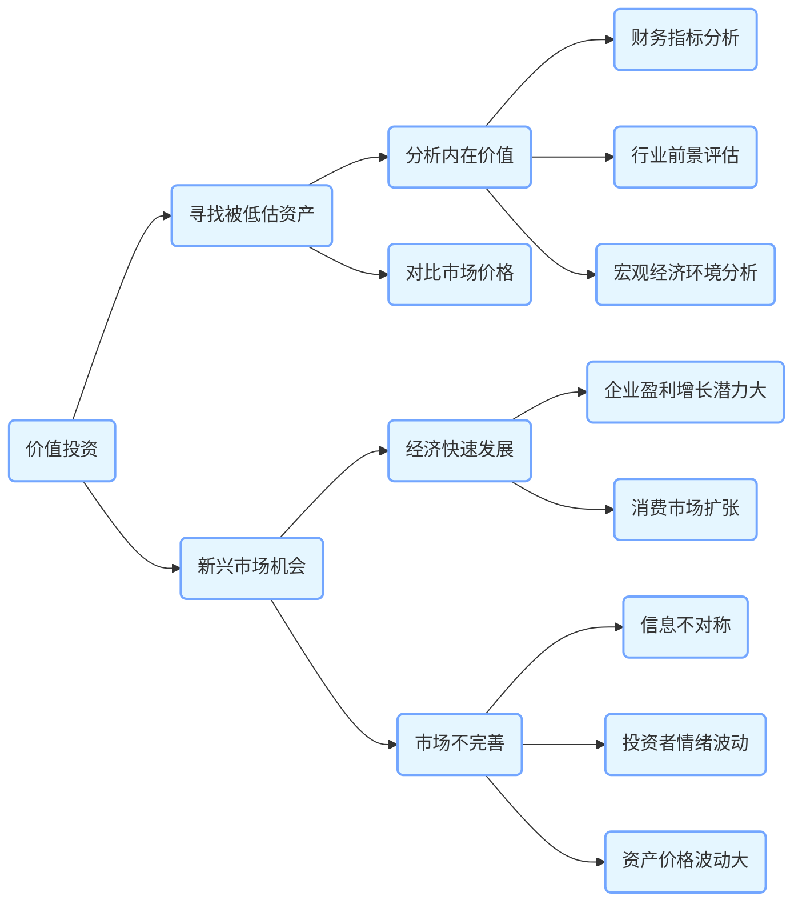

# 价值投资中的新兴市场机会

> 关键词：价值投资、新兴市场、投资机会、风险评估、市场分析

> 摘要：本文深入探讨了价值投资在新兴市场中的机会。通过对新兴市场的背景介绍，阐述了其核心概念以及与价值投资的联系。详细讲解了适用于新兴市场价值投资的核心算法原理和具体操作步骤，借助数学模型和公式进行分析，并给出实际案例。同时介绍了新兴市场价值投资的实际应用场景、相关工具和资源，最后总结了未来发展趋势与挑战，为投资者在新兴市场进行价值投资提供全面的指导。

## 1. 背景介绍 
### 1.1 目的和范围
本文章的目的在于深入剖析价值投资在新兴市场所蕴含的机会。新兴市场在全球经济格局中扮演着愈发重要的角色，其独特的经济发展模式、市场特征为价值投资者带来了不同于成熟市场的机遇。我们将研究范围界定在新兴市场的各类资产，包括但不限于股票、债券、房地产等，通过对这些资产的价值分析，探寻价值投资的切入点和潜在回报。

### 1.2 预期读者
本文预期读者主要包括专业的投资者，如基金经理、证券分析师等，他们需要深入了解新兴市场的价值投资机会以制定投资策略。同时，也适合对投资有兴趣的个人投资者，帮助他们在新兴市场中寻找合适的投资标的，提升投资收益。此外，金融研究人员和学者也可以从本文中获取关于新兴市场价值投资的研究思路和数据参考。

### 1.3 文档结构概述
本文将首先介绍新兴市场的核心概念以及与价值投资的联系，通过文本示意图和 Mermaid 流程图进行清晰展示。接着详细阐述适用于新兴市场价值投资的核心算法原理，并给出具体操作步骤，辅以 Python 源代码进行说明。然后运用数学模型和公式对新兴市场价值投资进行分析，并举例说明。之后通过项目实战，展示代码实际案例并进行详细解释。再介绍新兴市场价值投资的实际应用场景，推荐相关的工具和资源。最后总结新兴市场价值投资的未来发展趋势与挑战，提供常见问题解答和扩展阅读参考资料。

### 1.4 术语表
#### 1.4.1 核心术语定义
- **价值投资**：是一种投资策略，投资者通过分析资产的内在价值，寻找价格低于内在价值的投资标的，以期望在资产价格回归内在价值时获得收益。
- **新兴市场**：指的是那些经济发展速度较快、市场潜力较大，但市场成熟度相对较低的国家或地区的金融市场。这些市场通常具有较高的波动性和增长潜力。
- **内在价值**：是资产本身所具有的价值，它基于资产的基本面因素，如公司的盈利能力、现金流、资产负债状况等进行评估。

#### 1.4.2 相关概念解释
- **市盈率（P/E）**：是股票价格与每股收益的比率，用于衡量股票的估值水平。较低的市盈率可能意味着股票被低估，具有投资价值。
- **市净率（P/B）**：是股票价格与每股净资产的比率，反映了市场对公司净资产的估值。市净率较低的股票可能更具投资吸引力。
- **新兴市场国家**：通常包括亚洲的一些发展中国家（如中国、印度等）、拉丁美洲的部分国家（如巴西、墨西哥等）、非洲的一些经济体以及东欧的一些国家。

#### 1.4.3 缩略词列表
- **GDP**：国内生产总值，是衡量一个国家或地区经济总量的重要指标。
- **FDI**：外国直接投资，指外国投资者对本国企业进行的直接投资，反映了国际资本对本国市场的信心和兴趣。
- **EPS**：每股收益，是公司净利润与发行在外普通股股数的比率，反映了公司的盈利能力。

## 2. 核心概念与联系 

### 核心概念原理
价值投资的核心原理是寻找被市场低估的资产。在新兴市场中，由于市场信息不对称、投资者情绪波动较大以及经济发展的不确定性等因素，资产价格可能会出现较大的波动，从而产生更多被低估的机会。新兴市场的经济往往处于快速发展阶段，企业的盈利增长潜力较大，这为价值投资提供了良好的基础。

新兴市场的特点包括较高的经济增长率、不断完善的市场制度、丰富的自然资源和庞大的消费市场等。这些特点使得新兴市场中的企业具有更大的发展空间，但同时也伴随着较高的风险，如政治风险、汇率风险、市场流动性风险等。

### 架构的文本示意图
```plaintext
价值投资
|
|-- 寻找被低估资产
|   |
|   |-- 分析内在价值
|   |   |
|   |   |-- 财务指标分析（市盈率、市净率等）
|   |   |-- 行业前景评估
|   |   |-- 宏观经济环境分析
|   |
|   |-- 对比市场价格
|
|-- 新兴市场机会
|   |
|   |-- 经济快速发展
|   |   |
|   |   |-- 企业盈利增长潜力大
|   |   |-- 消费市场扩张
|   |
|   |-- 市场不完善
|   |   |
|   |   |-- 信息不对称
|   |   |-- 投资者情绪波动
|   |   |-- 资产价格波动大
```

### Mermaid 流程图


## 3. 核心算法原理 & 具体操作步骤 

### 核心算法原理
在新兴市场进行价值投资，我们可以采用基于财务指标的筛选算法。主要思路是通过计算股票的市盈率、市净率等指标，筛选出被低估的股票。同时，结合企业的盈利增长率、现金流状况等因素进行综合评估。

### 具体操作步骤
1. **数据收集**：收集新兴市场中上市公司的财务数据，包括营业收入、净利润、每股收益、每股净资产等。
2. **指标计算**：根据收集到的数据，计算市盈率（P/E）、市净率（P/B）、盈利增长率等指标。
3. **筛选股票**：设定市盈率和市净率的阈值，筛选出市盈率低于行业平均水平且市净率较低的股票。
4. **综合评估**：对筛选出的股票进行综合评估，考虑企业的行业前景、竞争优势、管理团队等因素。
5. **投资决策**：根据综合评估结果，决定是否投资该股票。

### Python 源代码实现
```python
import pandas as pd

# 模拟收集到的财务数据
data = {
    '股票代码': ['000001', '000002', '000003'],
    '每股收益': [1.2, 0.8, 1.5],
    '每股净资产': [8, 6, 10],
    '股票价格': [10, 8, 12],
    '盈利增长率': [0.2, 0.1, 0.3]
}

df = pd.DataFrame(data)

# 计算市盈率和市净率
df['市盈率'] = df['股票价格'] / df['每股收益']
df['市净率'] = df['股票价格'] / df['每股净资产']

# 设定阈值
pe_threshold = 10
pb_threshold = 1.5

# 筛选股票
selected_stocks = df[(df['市盈率'] < pe_threshold) & (df['市净率'] < pb_threshold)]

# 综合评估（这里简单按照盈利增长率排序）
selected_stocks = selected_stocks.sort_values(by='盈利增长率', ascending=False)

print(selected_stocks)
```

### 代码解释
1. **数据收集**：使用字典模拟收集到的财务数据，并将其转换为 Pandas 数据框。
2. **指标计算**：通过股票价格除以每股收益计算市盈率，股票价格除以每股净资产计算市净率。
3. **筛选股票**：使用布尔索引筛选出市盈率低于 10 且市净率低于 1.5 的股票。
4. **综合评估**：按照盈利增长率对筛选出的股票进行排序，盈利增长率越高的股票排在越前面。

## 4. 数学模型和公式 & 详细讲解 & 举例说明 

### 市盈率（P/E）
市盈率是衡量股票估值的重要指标，其计算公式为：
$$P/E = \frac{股票价格}{每股收益}$$

#### 详细讲解
市盈率反映了投资者为获取公司每一元盈利所愿意支付的价格。较低的市盈率可能意味着股票被低估，具有投资价值。但需要注意的是，不同行业的市盈率水平可能存在较大差异，因此在使用市盈率进行估值时，需要与同行业的平均市盈率进行比较。

#### 举例说明
假设某新兴市场股票的价格为 20 元，每股收益为 2 元，则该股票的市盈率为：
$$P/E = \frac{20}{2} = 10$$
如果该行业的平均市盈率为 15，则该股票的市盈率低于行业平均水平，可能被低估。

### 市净率（P/B）
市净率是衡量股票相对于净资产的估值指标，其计算公式为：
$$P/B = \frac{股票价格}{每股净资产}$$

#### 详细讲解
市净率反映了市场对公司净资产的估值。较低的市净率可能意味着股票被低估，尤其是对于那些资产质量较好的公司。但同样需要注意不同行业的市净率水平差异。

#### 举例说明
假设某新兴市场股票的价格为 15 元，每股净资产为 10 元，则该股票的市净率为：
$$P/B = \frac{15}{10} = 1.5$$
如果该行业的平均市净率为 2，则该股票的市净率低于行业平均水平，可能具有投资价值。

### 盈利增长率（g）
盈利增长率反映了公司盈利的增长速度，其计算公式为：
$$g = \frac{本期净利润 - 上期净利润}{上期净利润}$$

#### 详细讲解
盈利增长率是评估公司成长潜力的重要指标。较高的盈利增长率意味着公司具有较好的发展前景，可能会带来更高的投资回报。但盈利增长率也受到多种因素的影响，如市场竞争、行业周期等。

#### 举例说明
假设某公司上期净利润为 1000 万元，本期净利润为 1200 万元，则该公司的盈利增长率为：
$$g = \frac{1200 - 1000}{1000} = 0.2 = 20\%$$

### 内在价值评估模型（股息贴现模型）
股息贴现模型是一种常用的股票内在价值评估模型，其基本公式为：
$$V = \frac{D_1}{r - g}$$
其中，$V$ 表示股票的内在价值，$D_1$ 表示下一期预计股息，$r$ 表示必要收益率，$g$ 表示股息增长率。

#### 详细讲解
该模型假设股票的价值等于其未来股息的现值之和。必要收益率是投资者要求的最低回报率，股息增长率反映了公司股息的增长速度。如果股票的市场价格低于其内在价值，则该股票被低估，具有投资价值。

#### 举例说明
假设某新兴市场股票下一期预计股息为 1 元，必要收益率为 10%，股息增长率为 5%，则该股票的内在价值为：
$$V = \frac{1}{0.1 - 0.05} = 20$$
如果该股票的市场价格为 15 元，则该股票被低估，具有投资价值。

## 5. 项目实战：代码实际案例和详细解释说明 

### 5.1  开发环境搭建
- **Python 安装**：从 Python 官方网站（https://www.python.org/downloads/）下载并安装 Python 3.x 版本。
- **库安装**：使用以下命令安装所需的 Python 库：
```bash
pip install pandas numpy requests beautifulsoup4
```
- **数据获取**：可以使用 `requests` 和 `beautifulsoup4` 库从财经网站上获取新兴市场上市公司的财务数据。

### 5.2  源代码详细实现和代码解读
```python
import requests
from bs4 import BeautifulSoup
import pandas as pd

# 定义获取财务数据的函数
def get_financial_data(url):
    response = requests.get(url)
    soup = BeautifulSoup(response.text, 'html.parser')
    # 假设财务数据在表格中，这里简单示例获取表格数据
    table = soup.find('table')
    rows = table.find_all('tr')
    data = []
    for row in rows:
        cols = row.find_all('td')
        cols = [col.text.strip() for col in cols]
        data.append(cols)
    df = pd.DataFrame(data[1:], columns=data[0])
    return df

# 定义筛选股票的函数
def select_stocks(df, pe_threshold, pb_threshold):
    df['每股收益'] = pd.to_numeric(df['每股收益'], errors='coerce')
    df['每股净资产'] = pd.to_numeric(df['每股净资产'], errors='coerce')
    df['股票价格'] = pd.to_numeric(df['股票价格'], errors='coerce')
    df['市盈率'] = df['股票价格'] / df['每股收益']
    df['市净率'] = df['股票价格'] / df['每股净资产']
    selected_stocks = df[(df['市盈率'] < pe_threshold) & (df['市净率'] < pb_threshold)]
    return selected_stocks

# 主函数
def main():
    url = 'https://example.com/financial_data'  # 替换为实际的财经网站 URL
    df = get_financial_data(url)
    pe_threshold = 10
    pb_threshold = 1.5
    selected_stocks = select_stocks(df, pe_threshold, pb_threshold)
    print(selected_stocks)

if __name__ == "__main__":
    main()
```

### 代码解读与分析
1. **`get_financial_data` 函数**：该函数使用 `requests` 库发送 HTTP 请求获取财经网站上的财务数据，然后使用 `BeautifulSoup` 库解析 HTML 页面，提取表格数据并转换为 Pandas 数据框。
2. **`select_stocks` 函数**：该函数对获取到的财务数据进行处理，将每股收益、每股净资产和股票价格转换为数值类型，计算市盈率和市净率，然后根据设定的阈值筛选出被低估的股票。
3. **`main` 函数**：主函数调用 `get_financial_data` 函数获取财务数据，设定市盈率和市净率的阈值，调用 `select_stocks` 函数筛选股票，并打印筛选结果。

需要注意的是，上述代码中的财经网站 URL 是示例，实际使用时需要替换为真实的财经网站 URL，并且需要根据网站的 HTML 结构调整数据提取代码。

## 6. 实际应用场景 
### 股票投资
在新兴市场进行股票投资时，价值投资策略可以帮助投资者筛选出被低估的股票。通过分析公司的财务指标、行业前景等因素，选择具有投资价值的股票进行长期投资。例如，在中国、印度等新兴市场国家，一些新兴行业的公司虽然目前市值较小，但具有较高的成长潜力，通过价值投资可以挖掘这些公司的投资机会。

### 债券投资
新兴市场的债券市场也存在价值投资机会。一些新兴市场国家的政府债券或企业债券由于市场认知不足、信用评级较低等原因，可能会出现价格低估的情况。投资者可以通过分析债券的信用风险、利率水平等因素，选择具有投资价值的债券进行投资。

### 房地产投资
新兴市场的房地产市场往往具有较大的发展潜力。随着经济的发展和城市化进程的加快，房地产需求不断增加。投资者可以通过价值投资的方法，分析房地产项目的地理位置、周边配套设施、开发商实力等因素，选择具有投资价值的房地产项目进行投资。

### 跨境投资
对于国际投资者来说，新兴市场提供了跨境投资的机会。通过在不同的新兴市场国家进行资产配置，可以分散投资风险，获取更高的投资回报。例如，一些国际基金经理会将一部分资金投资于新兴市场的股票、债券等资产，以实现资产的多元化配置。

## 7. 工具和资源推荐
### 7.1 学习资源推荐
#### 7.1.1 书籍推荐
- 《聪明的投资者》（The Intelligent Investor）：本杰明·格雷厄姆（Benjamin Graham）著，价值投资的经典之作，介绍了价值投资的基本原理和方法。
- 《证券分析》（Security Analysis）：本杰明·格雷厄姆和戴维·多德（David Dodd）著，详细阐述了证券分析的理论和方法，对价值投资具有重要的指导意义。
- 《新兴市场的投资机会》（Investing in Emerging Markets）：介绍了新兴市场的投资特点、风险和机会，为投资者在新兴市场进行投资提供了实用的建议。

#### 7.1.2 在线课程
- Coursera 平台上的“价值投资基础”课程：由知名商学院教授授课，系统讲解价值投资的理论和实践。
- Udemy 平台上的“新兴市场投资策略”课程：介绍了新兴市场的投资环境和投资策略，帮助投资者了解新兴市场的投资机会。

#### 7.1.3 技术博客和网站
- Seeking Alpha：提供全球金融市场的分析和评论，包括新兴市场的投资机会和研究报告。
- Bloomberg：全球知名的财经媒体，提供新兴市场的实时行情、经济数据和分析报道。
- 雪球网：国内知名的投资社区，有很多投资者分享新兴市场的投资经验和研究成果。

### 7.2 开发工具框架推荐
#### 7.2.1 IDE和编辑器
- PyCharm：功能强大的 Python 集成开发环境，支持代码调试、自动补全、版本控制等功能，适合开发价值投资相关的 Python 程序。
- Jupyter Notebook：交互式的开发环境，适合进行数据探索和分析，方便展示代码和分析结果。

#### 7.2.2 调试和性能分析工具
- pdb：Python 自带的调试工具，可以帮助开发者调试 Python 代码，定位和解决问题。
- cProfile：Python 的性能分析工具，可以分析 Python 程序的性能瓶颈，优化代码性能。

#### 7.2.3 相关框架和库
- Pandas：用于数据处理和分析的 Python 库，提供了高效的数据结构和数据操作方法，适合处理新兴市场的财务数据。
- NumPy：Python 的数值计算库，提供了高性能的多维数组对象和数学函数，用于进行数值计算和统计分析。
- Scikit-learn：用于机器学习的 Python 库，提供了各种机器学习算法和工具，可用于对新兴市场的投资数据进行建模和预测。

### 7.3 相关论文著作推荐
#### 7.3.1 经典论文
- “The Cross - Section of Expected Stock Returns”（Eugene F. Fama 和 Kenneth R. French 著）：提出了著名的 Fama - French 三因子模型，对股票收益的横截面进行了深入研究，为价值投资提供了理论基础。
- “Efficient Capital Markets: A Review of Theory and Empirical Work”（Eugene F. Fama 著）：阐述了有效市场假说，对金融市场的效率和投资策略产生了深远影响。

#### 7.3.2 最新研究成果
- 一些顶尖学术期刊如《Journal of Finance》《Review of Financial Studies》等会发表关于新兴市场投资的最新研究成果，投资者可以关注这些期刊获取前沿的研究信息。

#### 7.3.3 应用案例分析
- 一些知名投资机构的研究报告和案例分析，如桥水基金、贝莱德等，会分享他们在新兴市场的投资实践和经验教训，投资者可以从中学习和借鉴。

## 8. 总结：未来发展趋势与挑战
### 未来发展趋势
- **经济持续增长**：新兴市场国家的经济有望继续保持较快的增长速度，随着城市化进程的加快、中产阶级的壮大和消费市场的升级，新兴市场的企业将迎来更多的发展机遇，为价值投资提供更广阔的空间。
- **金融市场开放**：越来越多的新兴市场国家将进一步开放金融市场，吸引更多的国际资本流入。这将提高市场的流动性和效率，也为价值投资者提供了更多的投资选择。
- **科技创新驱动**：新兴市场国家在科技创新领域的投入不断增加，一些新兴产业如人工智能、新能源、电子商务等有望快速发展。价值投资者可以关注这些领域的优质企业，分享科技创新带来的红利。

### 挑战
- **政治风险**：新兴市场国家的政治环境相对不稳定，政治事件如选举、政策调整等可能会对市场产生较大的影响。投资者需要密切关注政治动态，评估政治风险对投资的影响。
- **汇率风险**：新兴市场国家的货币汇率波动较大，汇率变动可能会影响投资者的实际收益。投资者需要采取适当的汇率风险管理措施，如使用外汇衍生品进行套期保值。
- **市场波动**：新兴市场的市场波动通常比成熟市场更大，投资者需要具备较强的风险承受能力和心理素质。同时，需要合理配置资产，分散投资风险。
- **信息不对称**：新兴市场的信息披露制度可能不够完善，投资者获取信息的难度较大。这需要投资者加强对信息的收集和分析能力，提高投资决策的准确性。

## 9. 附录：常见问题与解答
### 问题 1：新兴市场的价值投资风险是否比成熟市场更高？
答：一般来说，新兴市场的价值投资风险相对较高。新兴市场的经济和政治环境相对不稳定，市场制度不够完善，信息不对称问题较为严重，这些因素都增加了投资的风险。但同时，新兴市场也具有较高的增长潜力，通过合理的投资策略和风险控制，投资者可以在新兴市场获得较高的投资回报。

### 问题 2：如何评估新兴市场的政治风险？
答：评估新兴市场的政治风险可以从以下几个方面入手：
- 政治稳定性：关注国家的政治体制、政党竞争、社会秩序等因素，评估政治环境的稳定性。
- 政策变化：了解政府的经济政策、产业政策、税收政策等的变化情况，评估政策变化对企业和市场的影响。
- 国际关系：关注新兴市场国家与其他国家的国际关系，特别是与主要贸易伙伴和投资来源国的关系，评估国际关系变化对经济和市场的影响。

### 问题 3：在新兴市场进行价值投资需要注意哪些方面？
答：在新兴市场进行价值投资需要注意以下几个方面：
- 深入研究：对新兴市场的经济、政治、文化等环境进行深入研究，了解市场的特点和规律。
- 风险控制：合理配置资产，分散投资风险，避免过度集中投资。
- 信息收集：加强对新兴市场企业的信息收集和分析，提高投资决策的准确性。
- 长期投资：新兴市场的投资需要有耐心，坚持长期投资的理念，避免短期波动的影响。

### 问题 4：如何选择新兴市场的投资标的？
答：选择新兴市场的投资标的可以从以下几个方面考虑：
- 财务指标：分析企业的市盈率、市净率、盈利增长率等财务指标，选择被低估且具有良好盈利前景的企业。
- 行业前景：关注新兴市场的新兴行业和具有发展潜力的行业，选择行业前景较好的企业。
- 竞争优势：评估企业的竞争优势，如品牌优势、技术优势、成本优势等，选择具有核心竞争力的企业。
- 管理团队：考察企业的管理团队的能力和经验，选择管理团队优秀的企业。

## 10. 扩展阅读 & 参考资料
### 扩展阅读
- 《投资中最简单的事》：邱国鹭著，介绍了价值投资的简单方法和实践经验。
- 《金融炼金术》（The Alchemy of Finance）：乔治·索罗斯（George Soros）著，阐述了反身性理论，对金融市场的运行机制有独特的见解。
- 《黑天鹅：如何应对不可预知的未来》（The Black Swan: The Impact of the Highly Improbable）：纳西姆·尼古拉斯·塔勒布（Nassim Nicholas Taleb）著，提醒投资者关注市场中的不确定性和黑天鹅事件。

### 参考资料
- 各国政府发布的经济数据和统计报告，如中国国家统计局、美国商务部等发布的数据。
- 国际金融机构的研究报告，如国际货币基金组织（IMF）、世界银行等发布的报告。
- 财经媒体的报道和分析文章，如《金融时报》《华尔街日报》等。

作者：AI天才研究院/AI Genius Institute & 禅与计算机程序设计艺术 /Zen And The Art of Computer Programming