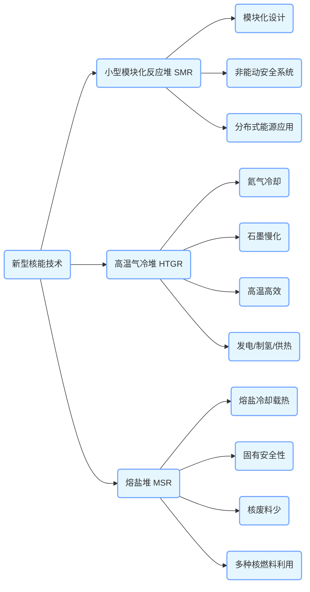

# 价值投资中的新型核能技术分析

> 关键词：价值投资、新型核能技术、核能原理、投资分析、应用场景

> 摘要：本文围绕价值投资视角下的新型核能技术展开深入分析。首先介绍了文章的背景，包括目的、预期读者、文档结构和相关术语。接着阐述了新型核能技术的核心概念、原理及架构，并以流程图呈现。详细讲解了核心算法原理，结合 Python 代码说明。同时给出了相关数学模型和公式，并举例解释。通过项目实战，展示代码实现和解读。探讨了新型核能技术的实际应用场景，推荐了学习资源、开发工具和相关论文著作。最后总结其未来发展趋势与挑战，解答常见问题并提供扩展阅读和参考资料，旨在为价值投资者提供全面的新型核能技术分析，辅助投资决策。

## 1. 背景介绍 
### 1.1 目的和范围
随着全球对清洁能源的需求日益增长，核能作为一种高效、稳定的能源形式，正受到越来越多的关注。传统核能技术在安全性、核废料处理等方面存在一定的问题，而新型核能技术有望解决这些难题，成为未来能源发展的重要方向。本文的目的在于从价值投资的角度，对新型核能技术进行全面深入的分析，评估其投资潜力和风险，为投资者提供决策参考。

文章的范围涵盖新型核能技术的核心概念、原理、算法、数学模型，通过实际案例展示其在项目中的应用，探讨其实际应用场景，并推荐相关的学习资源、开发工具和研究论文，帮助投资者更好地理解和把握新型核能技术的投资机会。

### 1.2 预期读者
本文的预期读者主要包括以下几类人群：
1. **价值投资者**：希望寻找具有长期投资价值的项目，对新型能源技术感兴趣，希望通过了解新型核能技术的发展趋势和投资潜力，做出合理的投资决策。
2. **能源行业从业者**：包括核能领域的科研人员、工程师、企业管理人员等，他们需要了解新型核能技术的最新进展和市场动态，以便在工作中做出更明智的决策。
3. **金融分析师**：负责对能源行业进行研究和分析，为投资机构和客户提供专业的投资建议，需要深入了解新型核能技术的技术特点和经济价值。
4. **政策制定者**：关注能源政策的制定和调整，需要了解新型核能技术的发展前景和对能源结构的影响，以便制定科学合理的能源政策。

### 1.3 文档结构概述
本文将按照以下结构进行组织：
1. **背景介绍**：阐述文章的目的、预期读者、文档结构和相关术语。
2. **核心概念与联系**：介绍新型核能技术的核心概念、原理和架构，通过文本示意图和 Mermaid 流程图进行展示。
3. **核心算法原理 & 具体操作步骤**：讲解新型核能技术中的核心算法原理，结合 Python 代码进行详细说明。
4. **数学模型和公式 & 详细讲解 & 举例说明**：给出新型核能技术相关的数学模型和公式，并进行详细讲解和举例说明。
5. **项目实战：代码实际案例和详细解释说明**：通过实际项目案例，展示新型核能技术的代码实现和详细解释。
6. **实际应用场景**：探讨新型核能技术在不同领域的实际应用场景。
7. **工具和资源推荐**：推荐学习新型核能技术的相关资源、开发工具和研究论文。
8. **总结：未来发展趋势与挑战**：总结新型核能技术的未来发展趋势和面临的挑战。
9. **附录：常见问题与解答**：解答读者在阅读过程中可能遇到的常见问题。
10. **扩展阅读 & 参考资料**：提供相关的扩展阅读材料和参考资料。

### 1.4 术语表
#### 1.4.1 核心术语定义
- **新型核能技术**：指相对于传统核能技术而言，在安全性、经济性、可持续性等方面有显著改进的核能技术，如小型模块化反应堆（SMR）、高温气冷堆、熔盐堆等。
- **价值投资**：一种投资策略，通过对资产的内在价值进行评估，寻找被低估的资产进行投资，以获取长期稳定的收益。
- **核裂变**：重原子核（如铀 - 235、钚 - 239 等）在中子的轰击下分裂成两个或多个轻原子核，并释放出大量能量的过程。
- **核聚变**：轻原子核（如氢的同位素氘和氚）在极高温度和压力下聚合成较重的原子核，并释放出巨大能量的过程。
- **反应堆**：一种能够实现可控核裂变或核聚变反应的装置，用于产生热能、电能等。

#### 1.4.2 相关概念解释
- **固有安全性**：新型核能技术的一个重要特性，指反应堆在设计上具有内在的安全机制，即使在发生事故的情况下，也能自动停止反应，避免堆芯熔毁和放射性物质泄漏。
- **核废料处理**：指对核电站产生的放射性废料进行处理和处置的过程，包括废料的固化、储存和最终处置等环节。
- **能量密度**：指单位质量或单位体积的能源所蕴含的能量，核能具有极高的能量密度，是其他能源的数百倍甚至数千倍。

#### 1.4.3 缩略词列表
- **SMR**：Small Modular Reactor，小型模块化反应堆
- **HTGR**：High - Temperature Gas - Cooled Reactor，高温气冷堆
- **MSR**：Molten Salt Reactor，熔盐堆
- **IAEA**：International Atomic Energy Agency，国际原子能机构

## 2. 核心概念与联系 

### 新型核能技术的核心概念
新型核能技术主要包括小型模块化反应堆（SMR）、高温气冷堆（HTGR）和熔盐堆（MSR）等。

#### 小型模块化反应堆（SMR）
SMR 是一种小型的、可预制的反应堆，通常功率在 300 兆瓦以下。它具有模块化设计的特点，可以在工厂中进行预制，然后运输到现场进行组装，大大缩短了建设周期和成本。SMR 还具有较高的安全性，采用了多种先进的安全技术，如非能动安全系统等。

#### 高温气冷堆（HTGR）
HTGR 以氦气作为冷却剂，石墨作为慢化剂，具有高温、高效、安全等优点。它的出口温度可以达到 700 - 1000℃，可以用于发电、制氢、供热等多个领域。HTGR 的燃料元件采用了包覆颗粒燃料，具有良好的耐高温和抗辐射性能，能够有效防止放射性物质泄漏。

#### 熔盐堆（MSR）
MSR 采用熔盐作为冷却剂和核燃料的载体，具有固有安全性高、核废料产生少、可利用多种核燃料等优点。熔盐堆的熔盐在常温下为固体，在反应堆运行时为液体，具有良好的传热性能和化学稳定性。当反应堆发生事故时，熔盐可以自动排出堆芯，避免堆芯熔毁。

### 核心概念的联系
这些新型核能技术虽然在技术特点和应用领域上有所不同，但都围绕着提高核能的安全性、经济性和可持续性这一核心目标。它们都采用了先进的设计理念和技术手段，以解决传统核能技术存在的问题。例如，SMR 的模块化设计可以降低建设成本和风险，HTGR 的高温特性可以提高能源利用效率，MSR 的固有安全性可以减少事故发生的可能性。

### 核心概念原理和架构的文本示意图
```plaintext
新型核能技术
|-- 小型模块化反应堆（SMR）
|   |-- 模块化设计
|   |-- 非能动安全系统
|   |-- 适用于分布式能源
|-- 高温气冷堆（HTGR）
|   |-- 氦气冷却
|   |-- 石墨慢化
|   |-- 高温高效
|   |-- 用于发电、制氢、供热
|-- 熔盐堆（MSR）
|   |-- 熔盐冷却和载热
|   |-- 固有安全性
|   |-- 核废料少
|   |-- 多种核燃料利用
```

### Mermaid 流程图


## 3. 核心算法原理 & 具体操作步骤 

### 核反应堆功率控制算法原理
在核反应堆中，需要精确控制反应堆的功率，以确保其安全稳定运行。一种常用的功率控制算法是基于比例 - 积分 - 微分（PID）控制器的算法。

#### PID 控制器原理
PID 控制器根据系统的误差（设定值与实际值之差）来计算控制量，其计算公式为：
$u(t)=K_p e(t)+K_i\int_{0}^{t}e(\tau)d\tau + K_d\frac{de(t)}{dt}$
其中，$u(t)$ 是控制量，$e(t)$ 是误差，$K_p$ 是比例系数，$K_i$ 是积分系数，$K_d$ 是微分系数。

#### 具体操作步骤
1. **设定功率目标值**：根据实际需求，设定反应堆的目标功率值 $P_{set}$。
2. **测量实际功率值**：通过功率传感器测量反应堆的实际功率值 $P_{actual}$。
3. **计算误差**：计算目标功率值与实际功率值之差，即 $e = P_{set}-P_{actual}$。
4. **计算控制量**：根据 PID 控制器的公式计算控制量 $u$。
5. **调整控制棒位置**：根据控制量 $u$ 调整控制棒的位置，以改变反应堆的反应性，从而控制反应堆的功率。

### Python 代码实现
```python
import time

class PIDController:
    def __init__(self, Kp, Ki, Kd):
        self.Kp = Kp
        self.Ki = Ki
        self.Kd = Kd
        self.integral = 0
        self.prev_error = 0

    def update(self, setpoint, current_value):
        error = setpoint - current_value
        self.integral += error
        derivative = error - self.prev_error
        output = self.Kp * error + self.Ki * self.integral + self.Kd * derivative
        self.prev_error = error
        return output

# 模拟反应堆功率控制
if __name__ == "__main__":
    # 设定 PID 参数
    Kp = 0.5
    Ki = 0.1
    Kd = 0.2
    pid = PIDController(Kp, Ki, Kd)

    # 设定目标功率
    setpoint_power = 500  # MW
    current_power = 100  # MW

    # 模拟控制过程
    for i in range(20):
        control_signal = pid.update(setpoint_power, current_power)
        # 简单模拟控制棒调整对功率的影响
        current_power += control_signal * 0.1
        print(f"Step {i}: Control Signal = {control_signal:.2f}, Current Power = {current_power:.2f} MW")
        time.sleep(0.1)
```

### 代码解释
1. **PIDController 类**：实现了 PID 控制器的基本功能，包括初始化 PID 参数、更新控制量等。
2. **update 方法**：根据设定值和当前值计算误差，并根据 PID 公式计算控制量。
3. **主程序**：设定 PID 参数、目标功率和初始功率，然后模拟控制过程，通过不断调整控制棒位置来改变反应堆的功率。

## 4. 数学模型和公式 & 详细讲解 & 举例说明 

### 核裂变反应的数学模型
核裂变反应的基本原理是重原子核在中子的轰击下分裂成两个或多个轻原子核，并释放出大量能量和中子。可以用以下数学模型来描述核裂变反应的过程。

#### 中子通量方程
中子通量 $\phi(\vec{r},E,t)$ 表示单位时间、单位面积上通过的中子数，它满足以下中子输运方程：
$\frac{1}{v}\frac{\partial\phi(\vec{r},E,t)}{\partial t}+\vec{\Omega}\cdot\nabla\phi(\vec{r},E,t)+\Sigma_t(\vec{r},E)\phi(\vec{r},E,t)=\int_{0}^{\infty}dE'\int_{4\pi}d\Omega'\Sigma_s(\vec{r},E'\rightarrow E,\Omega'\cdot\Omega)\phi(\vec{r},E',t)+\frac{\chi(E)}{4\pi}\int_{0}^{\infty}dE'\nu(E')\Sigma_f(\vec{r},E')\phi(\vec{r},E',t)+S(\vec{r},E,t)$
其中，$v$ 是中子速度，$\vec{\Omega}$ 是中子运动方向，$\Sigma_t$ 是总宏观截面，$\Sigma_s$ 是散射宏观截面，$\Sigma_f$ 是裂变宏观截面，$\chi(E)$ 是裂变中子能谱，$\nu(E)$ 是每次裂变产生的平均中子数，$S(\vec{r},E,t)$ 是外源中子源项。

#### 详细讲解
- 方程左边第一项：表示中子通量随时间的变化率。
- 方程左边第二项：表示中子的输运项，描述中子在空间中的运动。
- 方程左边第三项：表示中子的吸收和散射损失。
- 方程右边第一项：表示散射中子的贡献。
- 方程右边第二项：表示裂变产生的中子贡献。
- 方程右边第三项：表示外源中子的贡献。

#### 举例说明
假设一个简单的均匀反应堆，没有外源中子，且中子速度和截面都是常数。此时，中子通量方程可以简化为：
$\frac{1}{v}\frac{\partial\phi(t)}{\partial t}+\Sigma_t\phi(t)=\Sigma_s\phi(t)+\frac{\chi}{4\pi}\nu\Sigma_f\phi(t)$
令 $k_{eff}=\frac{\nu\Sigma_f}{\Sigma_t-\Sigma_s}$ 为有效增殖系数，则方程可以进一步简化为：
$\frac{1}{v}\frac{\partial\phi(t)}{\partial t}=(k_{eff}-1)\frac{\Sigma_t}{k_{eff}}\phi(t)$
解这个一阶线性微分方程，得到：
$\phi(t)=\phi(0)e^{(k_{eff}-1)\frac{\Sigma_t}{k_{eff}}vt}$
当 $k_{eff}>1$ 时，中子通量随时间指数增长，反应堆处于超临界状态；当 $k_{eff}=1$ 时，中子通量保持不变，反应堆处于临界状态；当 $k_{eff}<1$ 时，中子通量随时间指数衰减，反应堆处于次临界状态。

### 核能发电的能量转换效率公式
核能发电的过程是将核裂变产生的热能通过蒸汽轮机转化为机械能，再通过发电机转化为电能。能量转换效率 $\eta$ 可以用以下公式表示：
$\eta=\frac{W_{e}}{Q_{th}}$
其中，$W_{e}$ 是发电机输出的电能，$Q_{th}$ 是核反应堆产生的热能。

#### 详细讲解
- 核反应堆产生的热能 $Q_{th}$ 可以通过测量反应堆的功率和运行时间来计算，即 $Q_{th}=P_{th}\times t$，其中 $P_{th}$ 是反应堆的热功率，$t$ 是运行时间。
- 发电机输出的电能 $W_{e}$ 可以通过测量发电机的电功率和运行时间来计算，即 $W_{e}=P_{e}\times t$，其中 $P_{e}$ 是发电机的电功率。

#### 举例说明
假设一个核反应堆的热功率为 3000 MW，发电机的电功率为 1000 MW，运行时间为 1 小时。则核反应堆产生的热能为：
$Q_{th}=3000\times1 = 3000$ MWh
发电机输出的电能为：
$W_{e}=1000\times1 = 1000$ MWh
能量转换效率为：
$\eta=\frac{1000}{3000}\approx0.333 = 33.3\%$

## 5. 项目实战：代码实际案例和详细解释说明 

### 5.1  开发环境搭建
#### 操作系统
可以选择 Linux 系统（如 Ubuntu）或 Windows 系统。Linux 系统在开发和科研领域应用广泛，具有良好的稳定性和开源生态；Windows 系统则具有操作简单、易于上手的特点。

#### Python 环境
安装 Python 3.x 版本，可以从 Python 官方网站（https://www.python.org/downloads/）下载安装包进行安装。安装完成后，建议使用虚拟环境管理工具（如 virtualenv 或 conda）来创建和管理项目的 Python 环境。

#### 安装依赖库
在项目中，可能需要使用一些科学计算和数据分析库，如 NumPy、SciPy 等。可以使用以下命令进行安装：
```sh
pip install numpy scipy
```

### 5.2  源代码详细实现和代码解读
#### 项目背景
假设我们要模拟一个简单的核反应堆功率控制过程，使用 PID 控制器来控制反应堆的功率。

#### 源代码实现
```python
import numpy as np
import matplotlib.pyplot as plt

class PIDController:
    def __init__(self, Kp, Ki, Kd):
        self.Kp = Kp
        self.Ki = Ki
        self.Kd = Kd
        self.integral = 0
        self.prev_error = 0

    def update(self, setpoint, current_value):
        error = setpoint - current_value
        self.integral += error
        derivative = error - self.prev_error
        output = self.Kp * error + self.Ki * self.integral + self.Kd * derivative
        self.prev_error = error
        return output

# 模拟反应堆功率控制
if __name__ == "__main__":
    # 设定 PID 参数
    Kp = 0.5
    Ki = 0.1
    Kd = 0.2
    pid = PIDController(Kp, Ki, Kd)

    # 设定目标功率
    setpoint_power = 500  # MW
    current_power = 100  # MW

    # 模拟控制过程
    time_steps = 100
    power_history = [current_power]
    for i in range(time_steps):
        control_signal = pid.update(setpoint_power, current_power)
        # 简单模拟控制棒调整对功率的影响
        current_power += control_signal * 0.1
        power_history.append(current_power)

    # 绘制功率变化曲线
    plt.plot(np.arange(time_steps + 1), power_history)
    plt.axhline(y=setpoint_power, color='r', linestyle='--', label='Setpoint Power')
    plt.xlabel('Time Steps')
    plt.ylabel('Power (MW)')
    plt.title('Nuclear Reactor Power Control')
    plt.legend()
    plt.show()
```

#### 代码解读
1. **PIDController 类**：实现了 PID 控制器的基本功能，包括初始化 PID 参数、更新控制量等。
2. **update 方法**：根据设定值和当前值计算误差，并根据 PID 公式计算控制量。
3. **主程序**：
    - 设定 PID 参数、目标功率和初始功率。
    - 模拟控制过程，通过不断调整控制棒位置来改变反应堆的功率，并记录功率变化历史。
    - 使用 matplotlib 库绘制功率变化曲线，直观展示反应堆功率的控制过程。

### 5.3  代码解读与分析
#### 控制效果分析
从绘制的功率变化曲线可以看出，随着时间的推移，反应堆的功率逐渐接近目标功率。PID 控制器通过不断调整控制棒位置，使得误差逐渐减小，最终实现了对反应堆功率的稳定控制。

#### 参数调整
PID 控制器的性能很大程度上取决于 $K_p$、$K_i$ 和 $K_d$ 三个参数的选择。如果 $K_p$ 过大，系统可能会出现超调现象；如果 $K_i$ 过大，系统可能会出现积分饱和现象；如果 $K_d$ 过大，系统可能会对噪声过于敏感。因此，需要根据实际情况对这些参数进行调整，以达到最佳的控制效果。

## 6. 实际应用场景 
### 发电领域
新型核能技术在发电领域具有广阔的应用前景。小型模块化反应堆（SMR）可以作为分布式能源，为偏远地区、海岛等提供电力供应。高温气冷堆（HTGR）具有高温高效的特点，可以用于建设大型核电站，提高发电效率。熔盐堆（MSR）可以利用多种核燃料，减少核废料的产生，是一种可持续的发电技术。

### 工业供热领域
高温气冷堆和熔盐堆的高温特性使其非常适合用于工业供热。它们可以为化工、冶金、建材等行业提供高温蒸汽或热水，替代传统的化石能源供热方式，减少碳排放。

### 海水淡化领域
核能发电产生的余热可以用于海水淡化。通过将核反应堆与海水淡化装置相结合，可以实现能源的综合利用，提高能源利用效率。同时，核能海水淡化技术可以为沿海地区提供稳定的淡水资源，缓解水资源短缺问题。

### 制氢领域
高温气冷堆的高温可以用于热化学循环制氢，这是一种高效、清洁的制氢方法。通过利用核能产生的高温，将水分解为氢气和氧气，可以为燃料电池汽车、氢能源储能等领域提供氢气燃料。

## 7. 工具和资源推荐
### 7.1 学习资源推荐
#### 7.1.1 书籍推荐
- 《核能工程概论》：全面介绍了核能工程的基本原理、技术和应用，是学习核能技术的入门书籍。
- 《核反应堆物理分析》：深入讲解了核反应堆的物理原理和分析方法，适合有一定基础的读者学习。
- 《新型核能系统》：详细介绍了各种新型核能技术的原理、特点和发展趋势，是了解新型核能技术的重要参考书籍。

#### 7.1.2 在线课程
- Coursera 平台上的“Nuclear Energy Engineering”课程：由知名高校的教授授课，系统介绍了核能工程的基础知识和前沿技术。
- edX 平台上的“Introduction to Nuclear Energy”课程：通过视频讲座、案例分析等方式，让学习者了解核能的原理、应用和安全问题。

#### 7.1.3 技术博客和网站
- 国际原子能机构（IAEA）官方网站（https://www.iaea.org/）：提供了全球核能领域的最新政策、法规、技术和安全信息。
- 中国核能行业协会官方网站（http://www.cnnea.org.cn/）：发布了中国核能行业的发展动态、技术成果和政策解读等信息。

### 7.2 开发工具框架推荐
#### 7.2.1 IDE和编辑器
- PyCharm：一款功能强大的 Python 集成开发环境，提供了代码编辑、调试、版本控制等功能，适合开发 Python 项目。
- Visual Studio Code：一款轻量级的代码编辑器，支持多种编程语言，具有丰富的插件生态系统，可以根据需要安装各种插件来扩展功能。

#### 7.2.2 调试和性能分析工具
- pdb：Python 自带的调试工具，可以在代码中设置断点，逐步执行代码，查看变量的值和程序的执行流程。
- cProfile：Python 的性能分析工具，可以统计程序中各个函数的执行时间和调用次数，帮助开发者找出程序的性能瓶颈。

#### 7.2.3 相关框架和库
- NumPy：Python 的科学计算库，提供了高效的多维数组对象和各种数学函数，是进行数值计算和数据分析的基础库。
- SciPy：基于 NumPy 的科学计算库，提供了更多的科学计算工具，如优化算法、积分计算、信号处理等。

### 7.3 相关论文著作推荐
#### 7.3.1 经典论文
- “The Physics of Nuclear Reactors”：该论文系统阐述了核反应堆的物理原理和计算方法，是核反应堆物理领域的经典之作。
- “Advanced Nuclear Reactor Designs”：介绍了各种先进核反应堆的设计理念和技术特点，对新型核能技术的发展具有重要的指导意义。

#### 7.3.2 最新研究成果
- 在《Nuclear Science and Engineering》、《Progress in Nuclear Energy》等学术期刊上发表的关于新型核能技术的研究论文，反映了该领域的最新研究成果和发展趋势。

#### 7.3.3 应用案例分析
- 国际原子能机构（IAEA）发布的关于新型核能技术应用案例的报告，通过实际案例分析了新型核能技术在不同领域的应用效果和经济效益。

## 8. 总结：未来发展趋势与挑战
### 未来发展趋势
1. **技术创新加速**：随着科技的不断进步，新型核能技术将不断创新和发展。例如，核聚变技术有望取得重大突破，实现可控核聚变发电，为人类提供几乎无限的清洁能源。
2. **小型化和模块化**：小型模块化反应堆（SMR）将得到更广泛的应用，其模块化设计可以降低建设成本和风险，提高项目的灵活性和可扩展性。
3. **多用途应用**：新型核能技术将不仅用于发电，还将在工业供热、海水淡化、制氢等领域得到广泛应用，实现能源的综合利用。
4. **国际合作加强**：核能技术的发展需要大量的资金、技术和人才投入，国际合作将成为推动新型核能技术发展的重要力量。各国将在技术研发、安全监管、人才培养等方面加强合作，共同应对能源和环境挑战。

### 挑战
1. **安全问题**：尽管新型核能技术在安全性方面有了显著提高，但核安全仍然是公众关注的焦点。如何确保反应堆的安全运行，防止核事故的发生，是新型核能技术发展面临的首要挑战。
2. **核废料处理**：核废料的处理和处置是核能发展的一大难题。如何安全、有效地处理和处置核废料，减少其对环境和人类健康的影响，是新型核能技术需要解决的重要问题。
3. **公众接受度**：由于历史上发生过一些核事故，公众对核能的安全性存在一定的担忧。如何提高公众对新型核能技术的了解和信任，增强公众接受度，是新型核能技术推广应用的关键。
4. **政策和法规**：核能行业受到严格的政策和法规监管。如何制定科学合理的政策和法规，促进新型核能技术的发展，同时保障核安全和公众利益，是政府面临的重要任务。

## 9. 附录：常见问题与解答
### 新型核能技术安全吗？
新型核能技术在设计上采用了多种先进的安全技术，如非能动安全系统、固有安全性设计等，大大提高了反应堆的安全性。在发生事故的情况下，反应堆能够自动停止反应，避免堆芯熔毁和放射性物质泄漏。同时，严格的安全监管和质量控制措施也确保了新型核能技术的安全运行。

### 新型核能技术的成本高吗？
小型模块化反应堆（SMR）由于采用了模块化设计，可以在工厂中进行预制，然后运输到现场进行组装，大大缩短了建设周期和成本。高温气冷堆和熔盐堆等新型核能技术在提高发电效率、减少核废料产生等方面具有优势，从长远来看，也具有较好的经济性。

### 新型核能技术会产生核废料吗？
新型核能技术可以减少核废料的产生。例如，熔盐堆可以利用多种核燃料，对核燃料的利用率更高，产生的核废料相对较少。同时，一些新型核能技术还可以对核废料进行再处理，提取其中的有用核素，进一步减少核废料的数量。

### 如何提高公众对新型核能技术的接受度？
提高公众对新型核能技术的接受度需要从多个方面入手。首先，要加强科普宣传，让公众了解新型核能技术的原理、安全性和优势。其次，要建立透明、公开的信息交流机制，及时向公众发布核安全信息和项目进展情况。最后，要加强国际合作，分享核能发展的经验和成果，增强公众对核能的信心。

## 10. 扩展阅读 & 参考资料
### 扩展阅读
- 《核能的未来：从愿景到现实》：探讨了核能在未来能源体系中的地位和作用，以及新型核能技术的发展前景。
- 《核安全文化：理念与实践》：介绍了核安全文化的概念、内涵和实践经验，对保障核能安全具有重要的指导意义。

### 参考资料
- 国际原子能机构（IAEA）相关报告和文件
- 中国国家能源局发布的核能发展规划和政策文件
- 相关学术期刊上发表的研究论文

作者：AI天才研究院/AI Genius Institute & 禅与计算机程序设计艺术 /Zen And The Art of Computer Programming