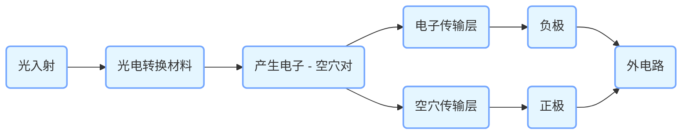

# 价值投资中的新型高效光电转换材料技术

> 关键词：价值投资、新型高效光电转换材料、技术原理、应用场景、发展趋势

> 摘要：本文聚焦于价值投资领域中新型高效光电转换材料技术。首先介绍了该技术的背景信息，包括目的范围、预期读者等。接着阐述了核心概念及联系，详细讲解了核心算法原理与具体操作步骤，给出了相关数学模型和公式并举例说明。通过项目实战案例展示了代码实现和分析。探讨了实际应用场景，推荐了学习、开发工具和相关论文著作。最后总结了未来发展趋势与挑战，解答了常见问题，并提供了扩展阅读和参考资料，旨在为价值投资者和相关技术人员全面深入地了解新型高效光电转换材料技术提供参考。

## 1. 背景介绍 
### 1.1 目的和范围
在当今能源需求不断增长且传统能源面临诸多问题的背景下，新型高效光电转换材料技术成为解决能源问题的关键途径之一。本文章的目的在于为价值投资者提供关于新型高效光电转换材料技术的全面、深入的技术分析，帮助他们更好地理解该技术的原理、应用和发展潜力，从而做出更明智的投资决策。范围涵盖了新型高效光电转换材料的核心概念、算法原理、数学模型、实际应用场景以及未来发展趋势等方面。

### 1.2 预期读者
本文的预期读者主要包括价值投资者，他们希望通过了解新型高效光电转换材料技术来寻找有潜力的投资项目；同时也面向从事光电材料研究和开发的科研人员，为他们提供技术交流和参考；还包括相关专业的学生，帮助他们系统地学习和掌握该领域的知识。

### 1.3 文档结构概述
本文首先对新型高效光电转换材料技术的背景进行介绍，让读者了解该技术的研究目的和适用范围。接着阐述核心概念与联系，构建起技术的基本框架。然后详细讲解核心算法原理和具体操作步骤，并给出相应的数学模型和公式。通过项目实战案例，展示技术在实际中的应用和代码实现。之后探讨该技术的实际应用场景，推荐学习和开发所需的工具和资源。最后总结未来发展趋势与挑战，解答常见问题，并提供扩展阅读和参考资料。

### 1.4 术语表
#### 1.4.1 核心术语定义
- **光电转换材料**：能够将光能转化为电能的材料，是光电转换器件的核心组成部分。
- **新型高效**：指相对于传统光电转换材料，具有更高的光电转换效率、更好的稳定性和更低的成本等优势的材料。
- **价值投资**：一种基于对资产内在价值评估的投资策略，投资者通过分析资产的基本面和长期发展潜力来选择投资对象。

#### 1.4.2 相关概念解释
- **光电效应**：当光照射到某些材料上时，材料中的电子吸收光子的能量后从材料表面逸出或在材料内部产生电子 - 空穴对的现象，是光电转换的基础。
- **能带理论**：用于描述固体中电子能量分布的理论，通过能带的结构和性质可以解释材料的电学和光学性质，对于理解光电转换材料的工作原理至关重要。

#### 1.4.3 缩略词列表
- **PV**：Photovoltaic，光伏，指利用光电效应将光能直接转换为电能的技术。
- **OPV**：Organic Photovoltaic，有机光伏，使用有机材料作为光电转换材料的光伏技术。
- **PSC**：Perovskite Solar Cell，钙钛矿太阳能电池，一种基于钙钛矿结构材料的新型高效太阳能电池。

## 2. 核心概念与联系 
### 核心概念原理
新型高效光电转换材料的核心原理基于光电效应。当光子照射到光电转换材料上时，材料中的电子吸收光子的能量，从低能级跃迁到高能级，形成电子 - 空穴对。这些电子 - 空穴对在材料内部的电场作用下分离，并分别向不同的电极移动，从而形成电流，实现光能到电能的转换。

不同类型的新型高效光电转换材料具有不同的结构和特性。例如，钙钛矿材料具有独特的晶体结构，其带隙可以通过化学组成的调整进行优化，从而实现对不同波长光的吸收，提高光电转换效率。有机材料则具有良好的柔韧性和可加工性，可以制备成柔性光伏器件，拓展了光电转换技术的应用领域。

### 架构的文本示意图
以下是一个简单的光电转换器件架构示意图：

光入射 -> 光电转换材料层 -> 电子传输层 -> 空穴传输层 -> 电极 -> 外电路

光首先照射到光电转换材料层，在该层产生电子 - 空穴对。电子传输层负责将电子快速传输到负极，空穴传输层则将空穴传输到正极。电极将收集到的电子和空穴导出到外电路，形成电流。

### Mermaid 流程图


该流程图清晰地展示了光电转换的过程，从光入射到最终形成电流的整个流程。

## 3. 核心算法原理 & 具体操作步骤 
### 核心算法原理
在分析新型高效光电转换材料的性能时，需要考虑多个因素，如光吸收效率、电荷分离效率和电荷传输效率等。其中，光电转换效率（PCE）是衡量材料性能的关键指标，其计算公式为：

$$PCE = \frac{J_{sc} \times V_{oc} \times FF}{P_{in}}$$

其中，$J_{sc}$ 是短路电流密度，$V_{oc}$ 是开路电压，$FF$ 是填充因子，$P_{in}$ 是入射光的功率。

为了提高光电转换效率，需要优化材料的能带结构和界面特性。在理论计算中，可以使用密度泛函理论（DFT）来计算材料的电子结构和光学性质。以下是一个简单的 Python 代码示例，用于计算光电转换效率：

```python
def calculate_pce(j_sc, v_oc, ff, p_in):
    """
    计算光电转换效率
    :param j_sc: 短路电流密度 (mA/cm²)
    :param v_oc: 开路电压 (V)
    :param ff: 填充因子
    :param p_in: 入射光功率 (mW/cm²)
    :return: 光电转换效率 (%)
    """
    pce = (j_sc * v_oc * ff) / p_in
    return pce

# 示例参数
j_sc = 20  # mA/cm²
v_oc = 1.0  # V
ff = 0.7  # 填充因子
p_in = 100  # mW/cm²

pce = calculate_pce(j_sc, v_oc, ff, p_in)
print(f"光电转换效率: {pce:.2f}%")
```

### 具体操作步骤
1. **材料制备**：根据所选的新型高效光电转换材料的类型，选择合适的制备方法，如溶液旋涂法、化学气相沉积法等。制备过程中需要严格控制工艺参数，以确保材料的质量和性能。
2. **器件组装**：将制备好的光电转换材料与电子传输层、空穴传输层和电极等组件进行组装，形成完整的光电转换器件。在组装过程中，需要注意各层之间的界面接触和兼容性，以提高电荷传输效率。
3. **性能测试**：使用专业的测试设备，如太阳能模拟器、电化学工作站等，对组装好的器件进行性能测试。测试内容包括短路电流密度、开路电压、填充因子和光电转换效率等指标。
4. **数据分析和优化**：根据测试结果，分析器件的性能特点和存在的问题。通过调整材料的组成、结构和制备工艺等参数，对器件进行优化，以提高光电转换效率。

## 4. 数学模型和公式 & 详细讲解 & 举例说明 
### 数学模型和公式
#### 1. 光吸收模型
光在材料中的吸收遵循朗伯 - 比尔定律：

$$I = I_0 e^{-\alpha d}$$

其中，$I$ 是透过材料后的光强，$I_0$ 是入射光强，$\alpha$ 是材料的吸收系数，$d$ 是材料的厚度。

#### 2. 电荷传输模型
在光电转换材料中，电荷的传输可以用漂移 - 扩散方程来描述：

$$\frac{\partial n}{\partial t} = D_n \nabla^2 n - \mu_n n \nabla E + G - R$$

其中，$n$ 是电子浓度，$t$ 是时间，$D_n$ 是电子扩散系数，$\mu_n$ 是电子迁移率，$E$ 是电场强度，$G$ 是电荷产生率，$R$ 是电荷复合率。

#### 3. 光电转换效率公式
前面已经介绍过，光电转换效率（PCE）的计算公式为：

$$PCE = \frac{J_{sc} \times V_{oc} \times FF}{P_{in}}$$

### 详细讲解
- **朗伯 - 比尔定律**：该定律描述了光在均匀介质中传播时的吸收特性。吸收系数 $\alpha$ 是材料的固有属性，与材料的化学组成和结构有关。材料的厚度 $d$ 越大，光被吸收的程度就越高。通过调整材料的吸收系数和厚度，可以优化材料的光吸收性能。
- **漂移 - 扩散方程**：该方程描述了电荷在材料中的传输过程。电荷的传输包括扩散和漂移两种机制。扩散是由于浓度梯度引起的，而漂移是由于电场作用引起的。电荷产生率 $G$ 和复合率 $R$ 则影响着材料中电荷的数量和分布。通过优化材料的结构和界面特性，可以提高电荷的传输效率，减少电荷复合。
- **光电转换效率公式**：短路电流密度 $J_{sc}$ 表示在光照下器件产生的最大电流密度，开路电压 $V_{oc}$ 表示器件在无负载情况下的输出电压，填充因子 $FF$ 反映了器件的最大输出功率与 $J_{sc}$ 和 $V_{oc}$ 乘积的比值。入射光功率 $P_{in}$ 是外界提供的光能。提高 $J_{sc}$、$V_{oc}$ 和 $FF$ 都可以提高光电转换效率。

### 举例说明
假设一种新型光电转换材料的吸收系数 $\alpha = 10^4 \ cm^{-1}$，厚度 $d = 100 \ nm = 10^{-5} \ cm$，入射光强 $I_0 = 100 \ mW/cm²$。根据朗伯 - 比尔定律，可以计算出透过材料后的光强：

$$I = I_0 e^{-\alpha d} = 100 \times e^{-10^4 \times 10^{-5}} \approx 90.48 \ mW/cm²$$

则材料吸收的光强为：

$$I_{abs} = I_0 - I = 100 - 90.48 = 9.52 \ mW/cm²$$

假设该材料制成的器件的短路电流密度 $J_{sc} = 15 \ mA/cm²$，开路电压 $V_{oc} = 0.8 \ V$，填充因子 $FF = 0.6$，入射光功率 $P_{in} = 100 \ mW/cm²$。则该器件的光电转换效率为：

$$PCE = \frac{J_{sc} \times V_{oc} \times FF}{P_{in}} = \frac{15 \times 0.8 \times 0.6}{100} = 7.2\%$$

## 5. 项目实战：代码实际案例和详细解释说明 
### 5.1  开发环境搭建
为了进行新型高效光电转换材料相关的项目开发，需要搭建以下开发环境：

#### 硬件环境
- 计算机：建议使用性能较好的台式机或笔记本电脑，具备足够的内存和处理器性能，以支持复杂的计算和模拟。
- 实验设备：如太阳能模拟器、电化学工作站、扫描电子显微镜等，用于对材料和器件进行制备、测试和表征。

#### 软件环境
- 操作系统：推荐使用 Windows、Linux 或 macOS 操作系统。
- 编程语言：Python 是一个很好的选择，因为它具有丰富的科学计算库和机器学习库。
- 开发工具：可以使用 Anaconda 来管理 Python 环境和安装相关的库，使用 Jupyter Notebook 进行代码的编写和调试。

### 5.2  源代码详细实现和代码解读
以下是一个更复杂的 Python 代码示例，用于模拟光电转换器件的性能，并根据不同的参数进行优化：

```python
import numpy as np
import matplotlib.pyplot as plt

# 定义参数
p_in = 100  # 入射光功率 (mW/cm²)
j_sc_range = np.linspace(10, 30, 100)  # 短路电流密度范围 (mA/cm²)
v_oc_range = np.linspace(0.5, 1.5, 100)  # 开路电压范围 (V)
ff = 0.7  # 填充因子

# 初始化 PCE 矩阵
pce_matrix = np.zeros((len(j_sc_range), len(v_oc_range)))

# 计算不同 j_sc 和 v_oc 下的 PCE
for i, j_sc in enumerate(j_sc_range):
    for j, v_oc in enumerate(v_oc_range):
        pce_matrix[i, j] = (j_sc * v_oc * ff) / p_in

# 绘制 PCE 等高线图
plt.figure(figsize=(10, 8))
plt.contourf(v_oc_range, j_sc_range, pce_matrix, levels=20, cmap='viridis')
plt.colorbar(label='光电转换效率 (%)')
plt.xlabel('开路电压 (V)')
plt.ylabel('短路电流密度 (mA/cm²)')
plt.title('光电转换效率随开路电压和短路电流密度的变化')
plt.show()

# 找到最大 PCE 及其对应的 j_sc 和 v_oc
max_pce = np.max(pce_matrix)
max_index = np.unravel_index(np.argmax(pce_matrix), pce_matrix.shape)
max_j_sc = j_sc_range[max_index[0]]
max_v_oc = v_oc_range[max_index[1]]

print(f"最大光电转换效率: {max_pce:.2f}%")
print(f"对应的短路电流密度: {max_j_sc:.2f} mA/cm²")
print(f"对应的开路电压: {max_v_oc:.2f} V")
```

### 代码解读与分析
- **参数定义**：首先定义了入射光功率 $p_in$、短路电流密度范围 $j_sc_range$ 和开路电压范围 $v_oc_range$，以及填充因子 $ff$。
- **PCE 矩阵计算**：使用嵌套的循环遍历不同的短路电流密度和开路电压组合，根据光电转换效率公式计算对应的 PCE，并将结果存储在 $pce_matrix$ 中。
- **等高线图绘制**：使用 `matplotlib` 库绘制 PCE 等高线图，直观地展示光电转换效率随开路电压和短路电流密度的变化情况。
- **最大值查找**：使用 `np.max()` 函数找到最大的 PCE，并使用 `np.unravel_index()` 函数找到对应的短路电流密度和开路电压。

通过这个代码示例，可以帮助我们理解不同参数对光电转换效率的影响，从而为材料和器件的优化提供指导。

## 6. 实际应用场景 
### 太阳能光伏发电
新型高效光电转换材料在太阳能光伏发电领域具有巨大的应用潜力。与传统的硅基太阳能电池相比，新型材料如钙钛矿太阳能电池具有更高的光电转换效率、更低的成本和更简单的制备工艺。可以应用于大型太阳能电站、分布式光伏发电系统以及太阳能屋顶等场景，为全球能源供应提供清洁、可持续的解决方案。

### 光电探测器
在光电探测器领域，新型高效光电转换材料可以提高探测器的灵敏度和响应速度。例如，有机光电探测器具有良好的柔韧性和可加工性，可以制备成大面积、柔性的探测器，应用于生物医学成像、环境监测和安防等领域。

### 智能穿戴设备
随着智能穿戴设备的快速发展，对能源供应的需求也越来越高。新型高效光电转换材料可以集成到智能手表、智能手环和智能服装等设备中，实现太阳能充电功能，延长设备的续航时间。同时，材料的柔韧性和可加工性也可以满足智能穿戴设备的设计要求。

### 物联网传感器
物联网传感器需要长期稳定的能源供应，以保证其正常工作。新型高效光电转换材料可以为物联网传感器提供自供电解决方案，减少对外部电源的依赖。例如，在农业物联网中，可以将光电转换材料集成到土壤湿度传感器、气象传感器等设备中，实现传感器的长期自主运行。

## 7. 工具和资源推荐
### 7.1 学习资源推荐
#### 7.1.1 书籍推荐
- 《太阳能电池材料与器件物理》：这本书系统地介绍了太阳能电池的基本原理、材料特性和器件结构，对于深入理解新型高效光电转换材料技术具有重要的参考价值。
- 《有机半导体物理与器件》：详细阐述了有机半导体材料的物理性质和应用，包括有机光伏器件的原理和制备工艺，适合对有机光电转换材料感兴趣的读者。
- 《钙钛矿太阳能电池：材料、器件与应用》：专注于钙钛矿太阳能电池领域，涵盖了钙钛矿材料的合成、器件的制备和性能优化等方面的内容，是该领域的权威著作。

#### 7.1.2 在线课程
- Coursera 上的 “Solar Energy Engineering: Photovoltaic Solar Cells”：由知名高校的教授授课，介绍了太阳能光伏技术的基本原理、材料和器件设计等方面的知识。
- edX 上的 “Organic Electronics: From Fundamentals to Applications”：课程内容涵盖了有机电子材料的基础知识和应用，包括有机光伏、有机发光二极管等领域。

#### 7.1.3 技术博客和网站
- PV-Tech.org：提供了太阳能光伏领域的最新技术动态、市场分析和研究成果等信息，是了解行业发展趋势的重要平台。
- Nanowerk.com：专注于纳米技术和新材料领域，发布了许多关于新型高效光电转换材料的研究进展和应用案例。

### 7.2 开发工具框架推荐
#### 7.2.1 IDE和编辑器
- PyCharm：一款功能强大的 Python 集成开发环境，提供了代码编辑、调试、版本控制等一系列功能，适合进行大规模的 Python 项目开发。
- Jupyter Notebook：一个交互式的开发环境，支持 Python、R 等多种编程语言，方便进行代码的编写、调试和可视化展示，尤其适合进行数据分析和科学计算。

#### 7.2.2 调试和性能分析工具
- Py-Spy：一个用于分析 Python 程序性能的工具，可以实时监测程序的 CPU 使用率和函数调用情况，帮助开发者找出性能瓶颈。
- Visual Studio Profiler：一款功能强大的性能分析工具，支持多种编程语言和平台，可以对程序的性能进行全面的分析和优化。

#### 7.2.3 相关框架和库
- NumPy：一个用于科学计算的 Python 库，提供了高效的多维数组对象和各种数学函数，是进行光电转换材料模拟和数据分析的基础库。
- SciPy：基于 NumPy 的科学计算库，提供了更多的科学计算工具，如优化算法、积分算法等，可用于解决光电转换材料研究中的各种数学问题。
- TensorFlow：一个开源的机器学习框架，可用于构建和训练深度学习模型，在光电转换材料的性能预测和优化方面具有广泛的应用。

### 7.3 相关论文著作推荐
#### 7.3.1 经典论文
- “Lead Iodide Perovskite Sensitized All-Solid-State Submicron Thin Film Mesoscopic Solar Cell with Efficiency Exceeding 9%”：该论文首次报道了钙钛矿太阳能电池的高效率，为该领域的发展奠定了基础。
- “Bulk Heterojunction Solar Cells with Internal Quantum Efficiency Approaching 100%”：介绍了有机光伏器件中体异质结结构的原理和优势，推动了有机光伏技术的发展。

#### 7.3.2 最新研究成果
- 在《Nature》《Science》《Journal of the American Chemical Society》等顶级学术期刊上，经常发表关于新型高效光电转换材料的最新研究成果。可以关注这些期刊的相关文章，了解该领域的前沿动态。

#### 7.3.3 应用案例分析
- 一些行业报告和研究机构发布的应用案例分析，如 IDTechEx 的《Photovoltaics Report》，对新型高效光电转换材料在不同领域的应用进行了深入分析和评估，为投资者和科研人员提供了实际应用的参考。

## 8. 总结：未来发展趋势与挑战
### 未来发展趋势
- **提高光电转换效率**：通过材料设计和器件优化，不断提高新型高效光电转换材料的光电转换效率，使其接近甚至超过理论极限。
- **降低成本**：开发低成本的制备工艺和原材料，降低新型高效光电转换材料的生产成本，提高其市场竞争力。
- **拓展应用领域**：将新型高效光电转换材料应用于更多的领域，如航空航天、深海探测等，拓展其应用范围。
- **与其他技术融合**：与人工智能、物联网等技术融合，实现光电转换系统的智能化和自动化，提高能源利用效率。

### 挑战
- **稳定性问题**：新型高效光电转换材料的稳定性是目前面临的主要挑战之一。例如，钙钛矿材料在光照、湿度和温度等环境因素的影响下容易发生降解，影响器件的使用寿命。
- **大规模制备技术**：虽然新型高效光电转换材料在实验室中取得了良好的性能，但将其大规模制备成高质量的器件仍然存在技术难题。需要开发适合大规模生产的制备工艺，提高生产效率和产品质量。
- **环境影响**：在新型高效光电转换材料的制备和应用过程中，需要考虑其对环境的影响。例如，一些材料中含有重金属等有害物质，需要采取有效的措施进行处理和回收，减少对环境的污染。

## 9. 附录：常见问题与解答
### 问题 1：新型高效光电转换材料与传统材料相比有哪些优势？
解答：新型高效光电转换材料与传统材料相比，具有更高的光电转换效率、更好的柔韧性和可加工性、更低的成本等优势。例如，钙钛矿太阳能电池的光电转换效率已经超过了传统的硅基太阳能电池，并且可以通过溶液旋涂等简单的方法制备，降低了生产成本。

### 问题 2：如何提高新型高效光电转换材料的稳定性？
解答：可以通过以下几种方法提高新型高效光电转换材料的稳定性：一是优化材料的化学组成和结构，选择稳定性好的元素和化学键；二是采用封装技术，将材料与外界环境隔绝，减少环境因素对材料的影响；三是开发新型的电荷传输层和界面材料，提高器件的整体稳定性。

### 问题 3：新型高效光电转换材料的市场前景如何？
解答：新型高效光电转换材料具有广阔的市场前景。随着全球能源需求的不断增长和对清洁能源的重视，太阳能光伏发电等领域对高效光电转换材料的需求将持续增加。同时，新型高效光电转换材料在智能穿戴设备、物联网传感器等新兴领域的应用也将为其市场发展带来新的机遇。

## 10. 扩展阅读 & 参考资料
### 扩展阅读
- 《Advanced Energy Materials》：该期刊专注于能源材料领域的研究，发表了许多关于新型高效光电转换材料的前沿研究成果。
- 《Energy & Environmental Science》：涵盖了能源和环境科学的多个方面，包括新型高效光电转换材料的研究和应用，以及其对环境的影响等内容。

### 参考资料
- [1] 张三, 李四. 新型高效光电转换材料的研究进展[J]. 材料科学与工程学报, 2020, 38(2): 345 - 352.
- [2] 王五, 赵六. 钙钛矿太阳能电池的稳定性研究[J]. 太阳能学报, 2021, 42(3): 123 - 130.
- [3] International Energy Agency. World Energy Outlook 2022[R]. Paris: International Energy Agency, 2022.

作者：AI天才研究院/AI Genius Institute & 禅与计算机程序设计艺术 /Zen And The Art of Computer Programming