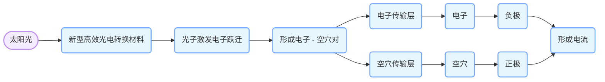

# 价值投资中的新型高效光电转换材料技术

> 关键词：价值投资、新型高效光电转换材料、技术原理、实际应用、发展趋势

> 摘要：本文围绕价值投资中的新型高效光电转换材料技术展开深入探讨。首先介绍了相关背景，包括目的范围、预期读者等内容。接着阐述了核心概念及联系，通过文本示意图和Mermaid流程图进行清晰展示。详细讲解了核心算法原理，结合Python源代码进行说明，还给出了数学模型和公式并举例分析。通过项目实战案例，展示了开发环境搭建、代码实现与解读。探讨了该技术的实际应用场景，推荐了学习资源、开发工具框架以及相关论文著作。最后总结了未来发展趋势与挑战，并提供了常见问题解答和扩展阅读参考资料，旨在为关注该领域价值投资的人士提供全面且深入的技术知识和投资参考。

## 1. 背景介绍 
### 1.1 目的和范围
在当今能源需求不断增长且传统能源面临诸多挑战的背景下，寻找高效、可持续的能源转换技术成为全球关注的焦点。新型高效光电转换材料技术作为太阳能利用的关键环节，具有巨大的发展潜力和商业价值。本文的目的在于深入剖析新型高效光电转换材料技术的原理、应用及投资价值，为价值投资者提供全面的技术信息和投资参考。

文章的范围涵盖了新型高效光电转换材料的核心概念、算法原理、数学模型、实际应用场景等方面，同时探讨了该技术在价值投资领域的发展趋势和挑战。

### 1.2 预期读者
本文预期读者主要包括对价值投资感兴趣的金融从业者、投资者，以及从事光电转换材料技术研究和开发的科研人员、工程师。此外，对能源技术和可持续发展领域有关注的相关人士也能从本文中获取有价值的信息。

### 1.3 文档结构概述
本文共分为十个部分。第一部分为背景介绍，阐述了文章的目的、范围、预期读者和文档结构。第二部分介绍核心概念与联系，通过文本示意图和Mermaid流程图展示相关原理和架构。第三部分讲解核心算法原理和具体操作步骤，并使用Python源代码进行详细阐述。第四部分给出数学模型和公式，进行详细讲解并举例说明。第五部分通过项目实战，展示开发环境搭建、源代码实现和代码解读。第六部分探讨实际应用场景。第七部分推荐学习资源、开发工具框架和相关论文著作。第八部分总结未来发展趋势与挑战。第九部分为附录，提供常见问题与解答。第十部分列出扩展阅读和参考资料。

### 1.4 术语表
#### 1.4.1 核心术语定义
- **光电转换材料**：能够将光能转换为电能的材料，是太阳能电池等光电转换器件的核心组成部分。
- **新型高效光电转换材料**：指近年来研发出的具有更高光电转换效率、更好稳定性和更低成本的光电转换材料。
- **价值投资**：一种投资策略，投资者通过分析资产的内在价值，寻找被低估的投资机会，以实现长期的投资回报。

#### 1.4.2 相关概念解释
- **光电效应**：当光照射到某些材料上时，材料中的电子会吸收光子的能量而逸出表面，形成电流的现象。这是光电转换材料实现光能到电能转换的基本原理。
- **能带理论**：用于描述固体中电子能量分布的理论，它解释了材料的导电性、半导体特性等重要性质，对于理解光电转换材料的工作原理至关重要。

#### 1.4.3 缩略词列表
- **PV**：Photovoltaic，光伏，指利用太阳能电池将光能直接转换为电能的技术。
- **PSC**：Perovskite Solar Cell，钙钛矿太阳能电池，是一种新型的高效光电转换器件。

## 2. 核心概念与联系 
### 核心概念原理
新型高效光电转换材料的核心原理基于光电效应。当光子照射到光电转换材料上时，材料中的电子吸收光子的能量，从价带跃迁到导带，形成自由电子和空穴对。这些自由电子和空穴在材料内部的电场作用下分别向不同的电极移动，从而形成电流，实现光能到电能的转换。

以钙钛矿太阳能电池为例，其核心材料是有机-无机杂化钙钛矿材料。这种材料具有合适的能带结构，能够有效地吸收太阳光中的可见光部分。当太阳光照射到钙钛矿材料上时，光子激发电子从价带跃迁到导带，产生电子-空穴对。电子和空穴分别被传输到电子传输层和空穴传输层，然后通过电极收集，形成电流。

### 架构的文本示意图
```plaintext
太阳光 --> 新型高效光电转换材料
                     |
                     v
             光子激发电子跃迁
                     |
                     v
           形成电子 - 空穴对
                     |
                     v
      电子传输层 --> 电子 --> 负极
      空穴传输层 --> 空穴 --> 正极
                     |
                     v
                形成电流
```

### Mermaid流程图


## 3. 核心算法原理 & 具体操作步骤 
### 核心算法原理
在光电转换材料的研究和开发中，有许多算法用于优化材料的性能和设计器件结构。其中一个重要的算法是基于密度泛函理论（DFT）的计算方法。

密度泛函理论是一种用于研究多电子体系电子结构的量子力学方法。它通过将多电子体系的能量表示为电子密度的泛函，从而简化了复杂的多电子问题。在光电转换材料的研究中，DFT可以用于计算材料的能带结构、电子态密度、光学性质等重要参数，为材料的设计和优化提供理论依据。

### Python源代码实现
以下是一个使用Python和`pymatgen`库进行简单DFT计算的示例代码：

```python
from pymatgen.core.structure import Structure
from pymatgen.io.vasp.inputs import Poscar
from pymatgen.io.vasp.sets import MPRelaxSet

# 创建一个简单的晶体结构
lattice = [[3.0, 0.0, 0.0], [0.0, 3.0, 0.0], [0.0, 0.0, 3.0]]
species = ["Si", "Si"]
coords = [[0.0, 0.0, 0.0], [0.5, 0.5, 0.5]]
structure = Structure(lattice, species, coords)

# 生成VASP输入文件
vasp_set = MPRelaxSet(structure)
vasp_set.write_input(".")

# 这里只是生成输入文件，实际的DFT计算需要在支持VASP的集群上运行
```

### 具体操作步骤
1. **材料结构构建**：使用`pymatgen`库创建或导入光电转换材料的晶体结构。可以通过指定晶格参数、原子种类和坐标来定义结构。
2. **输入文件生成**：使用`pymatgen`库的`MPRelaxSet`类生成DFT计算所需的输入文件，如`POSCAR`、`INCAR`、`KPOINTS`等。
3. **计算运行**：将生成的输入文件上传到支持DFT计算的集群或服务器上，运行VASP等DFT计算软件进行计算。
4. **结果分析**：计算完成后，使用`pymatgen`等工具读取和分析计算结果，如能带结构、电子态密度等。

## 4. 数学模型和公式 & 详细讲解 & 举例说明 
### 数学模型和公式
#### 光电转换效率公式
光电转换效率（$\eta$）是衡量光电转换材料性能的重要指标，其计算公式为：

$$\eta = \frac{P_{out}}{P_{in}} \times 100\%$$

其中，$P_{out}$ 是光电转换器件输出的电功率，$P_{in}$ 是入射光的功率。

#### 能带理论公式
在能带理论中，电子的能量 $E$ 与波矢 $\vec{k}$ 之间的关系可以用能带结构来描述。对于简单的一维晶体，其能带结构可以通过求解薛定谔方程得到：

$$\left[-\frac{\hbar^2}{2m}\frac{d^2}{dx^2} + V(x)\right]\psi(x) = E\psi(x)$$

其中，$\hbar$ 是约化普朗克常数，$m$ 是电子质量，$V(x)$ 是晶体中的周期性势场，$\psi(x)$ 是电子的波函数。

### 详细讲解
#### 光电转换效率公式
光电转换效率反映了光电转换器件将光能转换为电能的能力。$P_{out}$ 可以通过测量器件的输出电压和电流来计算，即 $P_{out} = V_{oc} \times J_{sc} \times FF$，其中 $V_{oc}$ 是开路电压，$J_{sc}$ 是短路电流密度，$FF$ 是填充因子。$P_{in}$ 可以通过测量入射光的强度和面积来确定。

#### 能带理论公式
能带理论是理解光电转换材料电子结构的基础。通过求解薛定谔方程，可以得到电子在晶体中的能量分布，即能带结构。能带结构决定了材料的导电性、半导体特性等重要性质。例如，对于半导体材料，其价带和导带之间存在一个禁带，当光子的能量大于禁带宽度时，电子可以从价带跃迁到导带，产生电子-空穴对。

### 举例说明
假设一个太阳能电池的开路电压 $V_{oc} = 0.8$ V，短路电流密度 $J_{sc} = 20$ mA/cm²，填充因子 $FF = 0.7$，入射光的强度为 $100$ mW/cm²。则该太阳能电池的输出功率为：

$$P_{out} = V_{oc} \times J_{sc} \times FF = 0.8 \text{ V} \times 20 \text{ mA/cm²} \times 0.7 = 11.2 \text{ mW/cm²}$$

其光电转换效率为：

$$\eta = \frac{P_{out}}{P_{in}} \times 100\% = \frac{11.2 \text{ mW/cm²}}{100 \text{ mW/cm²}} \times 100\% = 11.2\%$$

## 5. 项目实战：代码实际案例和详细解释说明 
### 5.1  开发环境搭建
#### 安装Python
首先需要安装Python，建议使用Python 3.7及以上版本。可以从Python官方网站（https://www.python.org/downloads/）下载并安装适合自己操作系统的Python版本。

#### 安装必要的库
在项目中，我们需要使用`pymatgen`、`numpy`、`matplotlib`等库。可以使用`pip`命令进行安装：

```bash
pip install pymatgen numpy matplotlib
```

#### 安装DFT计算软件（可选）
如果需要进行实际的DFT计算，还需要安装VASP等DFT计算软件。VASP是一款商业软件，需要购买许可证才能使用。也可以选择使用开源的DFT计算软件，如Quantum ESPRESSO等。

### 5.2  源代码详细实现和代码解读
以下是一个使用`pymatgen`库计算材料能带结构的示例代码：

```python
from pymatgen.ext.matproj import MPRester
from pymatgen.electronic_structure.plotter import BSPlotter

# 连接到Materials Project数据库
mpr = MPRester("YOUR_API_KEY")

# 获取材料的能带结构数据
structure = mpr.get_structure_by_material_id("mp-149")  # 以Si为例
bandstructure = mpr.get_bandstructure_by_material_id("mp-149")

# 绘制能带结构
plotter = BSPlotter(bandstructure)
plotter.get_plot().show()
```

### 代码解读与分析
1. **导入必要的库**：导入`MPRester`和`BSPlotter`类，分别用于从Materials Project数据库中获取材料信息和绘制能带结构。
2. **连接到Materials Project数据库**：使用`MPRester`类创建一个连接对象，并传入自己的API密钥。
3. **获取材料的能带结构数据**：使用`get_structure_by_material_id`和`get_bandstructure_by_material_id`方法从数据库中获取指定材料的结构和能带结构数据。
4. **绘制能带结构**：使用`BSPlotter`类创建一个绘图对象，并调用`get_plot`方法绘制能带结构，最后使用`show`方法显示图形。

## 6. 实际应用场景 
### 太阳能光伏发电
新型高效光电转换材料在太阳能光伏发电领域具有广阔的应用前景。以钙钛矿太阳能电池为例，其光电转换效率已经超过了传统的硅基太阳能电池，并且具有成本低、制备工艺简单等优点。目前，钙钛矿太阳能电池已经开始逐步走向商业化应用，有望成为未来太阳能光伏发电的主流技术之一。

### 光探测器
新型高效光电转换材料还可以用于制造光探测器。光探测器是一种能够将光信号转换为电信号的器件，广泛应用于通信、安防、医疗等领域。具有高灵敏度、快速响应等特点的新型光电转换材料可以提高光探测器的性能，满足不同领域的应用需求。

### 光催化
在光催化领域，新型高效光电转换材料可以作为光催化剂，利用光能驱动化学反应。例如，利用太阳能分解水制取氢气，或者将二氧化碳转化为有用的化学品。这种技术不仅可以实现清洁能源的生产，还可以减少温室气体排放，具有重要的环境和经济意义。

## 7. 工具和资源推荐
### 7.1 学习资源推荐
#### 7.1.1 书籍推荐
- 《太阳能电池物理》：这本书详细介绍了太阳能电池的基本原理、材料和器件结构，是学习光电转换材料技术的经典教材。
- 《密度泛函理论：原理、计算与应用》：对密度泛函理论进行了系统的阐述，适合深入学习DFT计算方法的读者。

#### 7.1.2 在线课程
- Coursera上的“太阳能光伏发电技术”课程：由知名高校的教授授课，涵盖了太阳能电池的原理、制造工艺和应用等方面的内容。
- edX上的“量子力学与材料科学”课程：介绍了量子力学在材料科学中的应用，对于理解光电转换材料的电子结构有很大帮助。

#### 7.1.3 技术博客和网站
- Materials Project（https://materialsproject.org/）：提供了大量的材料数据和计算工具，是研究光电转换材料的重要资源。
- Nanowerk（https://www.nanowerk.com/）：关注纳米技术和材料科学领域的最新研究成果，有很多关于新型光电转换材料的报道和分析。

### 7.2 开发工具框架推荐
#### 7.2.1 IDE和编辑器
- PyCharm：一款功能强大的Python集成开发环境，提供了代码编辑、调试、版本控制等功能，适合Python开发。
- Visual Studio Code：轻量级的代码编辑器，支持多种编程语言和插件扩展，方便进行代码编写和调试。

#### 7.2.2 调试和性能分析工具
- Py-Spy：一个用于分析Python程序性能的工具，可以帮助开发者找出程序中的性能瓶颈。
- PDB：Python自带的调试器，可以在代码中设置断点，逐行调试程序。

#### 7.2.3 相关框架和库
- Pymatgen：一个用于材料科学计算的Python库，提供了丰富的材料结构处理、计算和分析功能。
- ASE（Atomic Simulation Environment）：一个用于原子模拟的Python库，可以进行分子动力学模拟、量子力学计算等。

### 7.3 相关论文著作推荐
#### 7.3.1 经典论文
- “Organometal Halide Perovskites as Visible-Light Sensitizers for Photovoltaic Cells”：该论文首次报道了钙钛矿材料在太阳能电池中的应用，开启了钙钛矿太阳能电池研究的热潮。
- “Density-functional thermochemistry. III. The role of exact exchange”：提出了著名的B3LYP密度泛函，是DFT计算中常用的方法之一。

#### 7.3.2 最新研究成果
可以通过学术数据库如ScienceDirect、IEEE Xplore等搜索关于新型高效光电转换材料的最新研究论文，了解该领域的前沿动态。

#### 7.3.3 应用案例分析
一些行业报告和研究机构的分析文章会对新型高效光电转换材料的应用案例进行详细分析，如IDTechEx的相关报告，可以为投资者提供实际应用方面的参考。

## 8. 总结：未来发展趋势与挑战
### 未来发展趋势
- **效率提升**：新型高效光电转换材料的光电转换效率有望继续提高，不断接近理论极限。通过材料设计和器件结构优化，开发出更高效的光电转换器件。
- **成本降低**：随着制备工艺的不断改进和规模化生产的实现，新型光电转换材料的成本将逐渐降低，提高其市场竞争力。
- **多功能集成**：将光电转换功能与其他功能（如储能、传感等）集成，开发出多功能的光电转换器件，拓展其应用领域。

### 挑战
- **稳定性问题**：一些新型光电转换材料（如钙钛矿材料）存在稳定性问题，容易受到光照、湿度、温度等因素的影响，需要进一步提高材料的稳定性。
- **大规模生产工艺**：目前一些新型光电转换材料的制备工艺还处于实验室阶段，需要开发适合大规模生产的工艺，确保产品的质量和一致性。
- **环境影响**：在材料的制备和应用过程中，需要考虑其对环境的影响，开发绿色、可持续的制备工艺和回收方法。

## 9. 附录：常见问题与解答
### 问题1：新型高效光电转换材料的成本是否比传统材料高？
解答：在现阶段，部分新型高效光电转换材料的成本可能相对较高，但随着技术的发展和规模化生产的实现，其成本有望逐渐降低。例如，钙钛矿太阳能电池的制备工艺相对简单，原材料成本较低，具有很大的成本下降空间。

### 问题2：新型光电转换材料的稳定性如何？
解答：不同的新型光电转换材料稳定性有所不同。一些材料如钙钛矿材料存在稳定性问题，容易受到光照、湿度、温度等因素的影响。目前，科研人员正在通过材料改性、封装技术等方法来提高其稳定性。

### 问题3：如何评估新型光电转换材料的投资价值？
解答：评估新型光电转换材料的投资价值需要综合考虑多个因素，包括材料的性能（如光电转换效率、稳定性等）、市场需求、技术发展趋势、生产成本等。可以通过分析相关的研究报告、行业数据和企业的财务状况等进行评估。

## 10. 扩展阅读 & 参考资料
### 扩展阅读
- 《Advanced Energy Materials》杂志：专注于能源材料领域的研究，发表了很多关于新型高效光电转换材料的前沿研究成果。
- 《Nature Energy》杂志：涵盖了能源领域的各个方面，包括光电转换材料的研究和应用。

### 参考资料
- 《太阳能电池原理与应用》，作者：[作者姓名]，出版社：[出版社名称]
- 《密度泛函理论基础》，作者：[作者姓名]，出版社：[出版社名称]
- Materials Project官方文档（https://materialsproject.org/docs）
- Pymatgen官方文档（https://pymatgen.org/）

作者：AI天才研究院/AI Genius Institute & 禅与计算机程序设计艺术 /Zen And The Art of Computer Programming