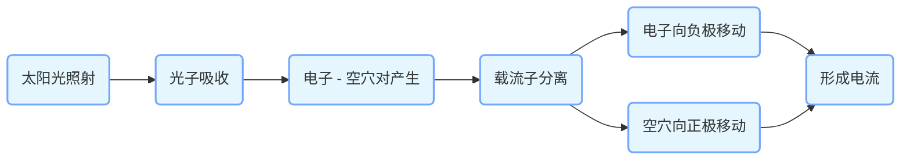

# 价值投资中的新型高效太阳能电池技术

> 关键词：价值投资、新型高效太阳能电池技术、光伏产业、电池原理、应用场景

> 摘要：本文围绕价值投资中的新型高效太阳能电池技术展开，旨在深入剖析该技术的核心原理、算法机制、数学模型等内容，并通过实际项目案例进行详细解读。同时探讨其在不同场景下的应用，推荐相关的学习资源、开发工具和研究论文，最后对该技术的未来发展趋势与挑战进行总结。帮助投资者和技术爱好者全面了解新型高效太阳能电池技术，为价值投资决策和技术研究提供有价值的参考。

## 1. 背景介绍 
### 1.1 目的和范围
本文章的目的在于全面介绍新型高效太阳能电池技术在价值投资领域的相关情况。一方面，为投资者提供关于该技术的详细信息，帮助他们评估投资价值和风险；另一方面，为技术开发者和研究者提供技术原理、算法、应用案例等方面的参考。范围涵盖新型高效太阳能电池技术的基本概念、核心原理、算法实现、数学模型、实际应用场景以及相关的学习资源和研究成果等。

### 1.2 预期读者
预期读者包括对价值投资感兴趣的投资者，他们希望通过了解新型高效太阳能电池技术来寻找有潜力的投资项目；从事太阳能电池技术研究和开发的专业人员，他们可以从文章中获取技术创新和应用的灵感；以及相关领域的学生和爱好者，用于学习和了解该领域的前沿知识。

### 1.3 文档结构概述
本文将按照以下结构展开：首先介绍新型高效太阳能电池技术的核心概念和联系，包括原理和架构的文本示意图以及 Mermaid 流程图；接着详细阐述核心算法原理和具体操作步骤，并使用 Python 源代码进行说明；然后介绍相关的数学模型和公式，并举例说明；通过项目实战部分展示代码实际案例和详细解释；探讨该技术的实际应用场景；推荐学习资源、开发工具和相关论文著作；最后总结未来发展趋势与挑战，并提供常见问题解答和扩展阅读参考资料。

### 1.4 术语表
#### 1.4.1 核心术语定义
- **价值投资**：一种投资策略，投资者通过分析资产的内在价值，寻找被低估的资产进行投资，期望在长期获得超过市场平均水平的回报。
- **新型高效太阳能电池技术**：区别于传统太阳能电池技术，具有更高的光电转换效率、更好的稳定性和更低的成本等优势的太阳能电池技术。
- **光电转换效率**：太阳能电池将光能转化为电能的效率，是衡量太阳能电池性能的重要指标。
- **光伏产业**：利用太阳能电池将太阳能转化为电能的产业，包括太阳能电池的研发、生产、销售和应用等环节。

#### 1.4.2 相关概念解释
- **半导体材料**：在新型高效太阳能电池中，半导体材料起着关键作用。半导体具有介于导体和绝缘体之间的导电性能，通过掺杂等工艺可以改变其电学性质，从而实现光能到电能的转换。
- **异质结结构**：一种常见的新型高效太阳能电池结构，由不同类型的半导体材料组成，能够提高载流子的分离和传输效率，从而提高电池的光电转换效率。
- **钙钛矿材料**：近年来备受关注的一种新型半导体材料，具有优异的光电性能，在太阳能电池领域具有巨大的应用潜力。

#### 1.4.3 缩略词列表
- **HJT**：Heterojunction with Intrinsic Thin-layer，异质结太阳能电池。
- **PERC**：Passivated Emitter and Rear Cell，钝化发射极和背接触电池。
- **PSC**：Perovskite Solar Cell，钙钛矿太阳能电池。

## 2. 核心概念与联系 
### 2.1 新型高效太阳能电池技术原理
新型高效太阳能电池技术的核心原理是基于半导体材料的光电效应。当太阳光照射到太阳能电池表面时，光子的能量被半导体材料吸收，产生电子 - 空穴对。这些电子和空穴在电池内部的电场作用下分离，并分别向电池的正负电极移动，从而形成电流。

以异质结太阳能电池（HJT）为例，其结构通常由本征非晶硅层、掺杂非晶硅层和晶体硅衬底组成。本征非晶硅层起到钝化晶体硅表面的作用，减少表面复合，提高载流子的寿命。掺杂非晶硅层形成 p - n 结，产生内建电场，促进电子和空穴的分离。

### 2.2 核心概念架构的文本示意图
```plaintext
新型高效太阳能电池技术
|-- 电池结构
|   |-- 异质结结构（HJT）
|   |   |-- 本征非晶硅层
|   |   |-- 掺杂非晶硅层
|   |   |-- 晶体硅衬底
|   |-- 钙钛矿结构（PSC）
|   |   |-- 钙钛矿光吸收层
|   |   |-- 电子传输层
|   |   |-- 空穴传输层
|-- 工作原理
|   |-- 光电效应
|   |   |-- 光子吸收
|   |   |-- 电子 - 空穴对产生
|   |   |-- 载流子分离
|   |   |-- 电流形成
|-- 性能指标
|   |-- 光电转换效率
|   |-- 开路电压
|   |-- 短路电流
|   |-- 填充因子
```

### 2.3 Mermaid 流程图


## 3. 核心算法原理 & 具体操作步骤 
### 3.1 核心算法原理
在新型高效太阳能电池技术中，一个重要的算法是对电池性能的模拟和优化。以光电转换效率的计算为例，其基本原理是基于半导体物理中的一些方程，如泊松方程、连续性方程等。

泊松方程描述了半导体内部的电场分布，其表达式为：
$$\nabla^2\psi = -\frac{\rho}{\epsilon}$$
其中，$\psi$ 是静电势，$\rho$ 是电荷密度，$\epsilon$ 是半导体材料的介电常数。

连续性方程描述了载流子的产生、复合和传输过程，对于电子和空穴分别有：
$$\frac{\partial n}{\partial t} = G - R + \nabla \cdot (D_n\nabla n - \mu_n n \nabla \psi)$$
$$\frac{\partial p}{\partial t} = G - R + \nabla \cdot (D_p\nabla p + \mu_p p \nabla \psi)$$
其中，$n$ 和 $p$ 分别是电子和空穴的浓度，$G$ 是载流子的产生率，$R$ 是载流子的复合率，$D_n$ 和 $D_p$ 分别是电子和空穴的扩散系数，$\mu_n$ 和 $\mu_p$ 分别是电子和空穴的迁移率。

通过联立这些方程，并结合边界条件和初始条件，可以求解出半导体内部的载流子分布和电场分布，进而计算出电池的光电转换效率。

### 3.2 具体操作步骤
以下是使用 Python 实现一个简单的太阳能电池光电转换效率计算的具体操作步骤：

```python
import numpy as np

# 定义常量
q = 1.6e-19  # 电子电荷（C）
k = 1.38e-23  # 玻尔兹曼常数（J/K）
T = 300  # 温度（K）
Eg = 1.12  # 硅的禁带宽度（eV）
n_i = 1.5e10  # 本征载流子浓度（cm^-3）

# 定义电池参数
V_oc = 0.6  # 开路电压（V）
J_sc = 30  # 短路电流密度（mA/cm^2）
FF = 0.8  # 填充因子

# 计算光电转换效率
P_in = 100  # 入射光功率（mW/cm^2）
J_sc_A = J_sc * 1e-3  # 短路电流密度转换为 A/cm^2
eta = (V_oc * J_sc_A * FF) / P_in

print(f"光电转换效率: {eta * 100:.2f}%")
```

### 3.3 代码解释
1. **常量定义**：定义了电子电荷 $q$、玻尔兹曼常数 $k$、温度 $T$、硅的禁带宽度 $Eg$ 和本征载流子浓度 $n_i$ 等常量。
2. **电池参数定义**：定义了开路电压 $V_{oc}$、短路电流密度 $J_{sc}$ 和填充因子 $FF$ 等电池参数。
3. **光电转换效率计算**：根据公式 $\eta = \frac{V_{oc} \times J_{sc} \times FF}{P_{in}}$ 计算光电转换效率，其中 $P_{in}$ 是入射光功率。
4. **结果输出**：将计算得到的光电转换效率以百分比的形式输出。

## 4. 数学模型和公式 & 详细讲解 & 举例说明 
### 4.1 开路电压公式
开路电压 $V_{oc}$ 是太阳能电池在无负载情况下的输出电压，其计算公式为：
$$V_{oc} = \frac{kT}{q} \ln\left(\frac{J_{sc}}{J_0} + 1\right)$$
其中，$J_0$ 是反向饱和电流密度。

详细讲解：开路电压主要取决于电池的材料特性和光照强度。当光照强度增加时，短路电流密度 $J_{sc}$ 增加，从而导致开路电压 $V_{oc}$ 增加。反向饱和电流密度 $J_0$ 与电池的材料和结构有关，通常希望 $J_0$ 尽可能小，以提高开路电压。

举例说明：假设某太阳能电池的反向饱和电流密度 $J_0 = 1e-12$ A/cm²，短路电流密度 $J_{sc} = 30$ mA/cm²，温度 $T = 300$ K，则开路电压为：
```python
import numpy as np

q = 1.6e-19
k = 1.38e-23
T = 300
J_0 = 1e-12
J_sc = 30e-3

V_oc = (k * T / q) * np.log(J_sc / J_0 + 1)
print(f"开路电压: {V_oc:.3f} V")
```

### 4.2 短路电流公式
短路电流 $J_{sc}$ 是太阳能电池在短路情况下的输出电流密度，其计算公式为：
$$J_{sc} = q \int_0^{\infty} \eta(\lambda) \Phi(\lambda) d\lambda$$
其中，$\eta(\lambda)$ 是电池的光谱响应，$\Phi(\lambda)$ 是入射光的光谱分布。

详细讲解：短路电流主要取决于入射光的强度和电池的光谱响应。光谱响应表示电池对不同波长光的吸收和转换能力，理想情况下，电池的光谱响应应该与太阳光谱相匹配，以提高短路电流。

举例说明：假设已知电池的光谱响应 $\eta(\lambda)$ 和入射光的光谱分布 $\Phi(\lambda)$，可以通过数值积分的方法计算短路电流。以下是一个简单的示例：
```python
import numpy as np
from scipy.integrate import quad

q = 1.6e-19

# 定义光谱响应和入射光光谱分布
def eta(lambda_):
    return 0.8 * np.exp(-(lambda_ - 500)**2 / 100**2)

def Phi(lambda_):
    return 1e17 * np.exp(-(lambda_ - 550)**2 / 150**2)

# 定义被积函数
def integrand(lambda_):
    return q * eta(lambda_) * Phi(lambda_)

# 进行数值积分
result, _ = quad(integrand, 0, np.inf)
J_sc = result
print(f"短路电流: {J_sc * 1e3:.3f} mA/cm²")
```

### 4.3 填充因子公式
填充因子 $FF$ 是衡量太阳能电池最大输出功率与开路电压和短路电流乘积之比的一个参数，其计算公式为：
$$FF = \frac{V_{mpp} \times J_{mpp}}{V_{oc} \times J_{sc}}$$
其中，$V_{mpp}$ 和 $J_{mpp}$ 分别是电池的最大功率点电压和最大功率点电流密度。

详细讲解：填充因子反映了电池的输出特性曲线的形状，理想情况下，填充因子应该接近 1。填充因子受到电池的串联电阻、并联电阻等因素的影响，串联电阻越大，填充因子越小；并联电阻越小，填充因子也越小。

举例说明：假设某太阳能电池的开路电压 $V_{oc} = 0.6$ V，短路电流密度 $J_{sc} = 30$ mA/cm²，最大功率点电压 $V_{mpp} = 0.5$ V，最大功率点电流密度 $J_{mpp} = 25$ mA/cm²，则填充因子为：
```python
V_oc = 0.6
J_sc = 30e-3
V_mpp = 0.5
J_mpp = 25e-3

FF = (V_mpp * J_mpp) / (V_oc * J_sc)
print(f"填充因子: {FF:.3f}")
```

## 5. 项目实战：代码实际案例和详细解释说明 
### 5.1  开发环境搭建
为了进行新型高效太阳能电池技术的项目开发，需要搭建相应的开发环境。以下是具体的搭建步骤：

#### 5.1.1 安装 Python
Python 是一种广泛使用的编程语言，在科学计算和数据分析领域有着丰富的库和工具。可以从 Python 官方网站（https://www.python.org/downloads/）下载并安装 Python。建议安装 Python 3.7 及以上版本。

#### 5.1.2 安装必要的库
在 Python 中，有一些常用的库可以用于太阳能电池技术的开发，如 NumPy、SciPy、Matplotlib 等。可以使用以下命令来安装这些库：
```sh
pip install numpy scipy matplotlib
```

#### 5.1.3 安装开发工具
可以选择使用 PyCharm、Jupyter Notebook 等开发工具来进行代码的编写和调试。PyCharm 是一款专业的 Python 集成开发环境，提供了丰富的功能和工具；Jupyter Notebook 是一个交互式的开发环境，适合进行代码的演示和数据分析。

### 5.2  源代码详细实现和代码解读
以下是一个完整的太阳能电池性能模拟的 Python 代码示例：

```python
import numpy as np
import matplotlib.pyplot as plt

# 定义常量
q = 1.6e-19  # 电子电荷（C）
k = 1.38e-23  # 玻尔兹曼常数（J/K）
T = 300  # 温度（K）
Eg = 1.12  # 硅的禁带宽度（eV）
n_i = 1.5e10  # 本征载流子浓度（cm^-3）

# 定义电池参数
J_0 = 1e-12  # 反向饱和电流密度（A/cm²）
J_sc = 30e-3  # 短路电流密度（A/cm²）
Rs = 0.1  # 串联电阻（Ω·cm²）
Rsh = 1000  # 并联电阻（Ω·cm²）

# 定义电压范围
V = np.linspace(0, 0.7, 100)

# 计算电流密度
J = np.zeros_like(V)
for i in range(len(V)):
    J[i] = J_sc - J_0 * (np.exp(q * (V[i] + J[i] * Rs) / (k * T)) - 1) - (V[i] + J[i] * Rs) / Rsh

# 计算功率密度
P = V * J

# 找到最大功率点
P_max_index = np.argmax(P)
V_mpp = V[P_max_index]
J_mpp = J[P_max_index]
P_max = P[P_max_index]

# 计算开路电压和短路电流
V_oc = (k * T / q) * np.log(J_sc / J_0 + 1)
J_sc_calculated = J[0]

# 计算填充因子
FF = P_max / (V_oc * J_sc_calculated)

# 计算光电转换效率
P_in = 100e-3  # 入射光功率（W/cm²）
eta = P_max / P_in

# 绘制 I-V 曲线和 P-V 曲线
plt.figure(figsize=(12, 6))

plt.subplot(1, 2, 1)
plt.plot(V, J * 1e3, label='I-V Curve')
plt.scatter(V_mpp, J_mpp * 1e3, color='red', label='MPP')
plt.xlabel('Voltage (V)')
plt.ylabel('Current Density (mA/cm²)')
plt.title('I-V Curve of Solar Cell')
plt.legend()

plt.subplot(1, 2, 2)
plt.plot(V, P * 1e3, label='P-V Curve')
plt.scatter(V_mpp, P_max * 1e3, color='red', label='MPP')
plt.xlabel('Voltage (V)')
plt.ylabel('Power Density (mW/cm²)')
plt.title('P-V Curve of Solar Cell')
plt.legend()

plt.tight_layout()
plt.show()

print(f"开路电压: {V_oc:.3f} V")
print(f"短路电流密度: {J_sc_calculated * 1e3:.3f} mA/cm²")
print(f"最大功率点电压: {V_mpp:.3f} V")
print(f"最大功率点电流密度: {J_mpp * 1e3:.3f} mA/cm²")
print(f"最大功率密度: {P_max * 1e3:.3f} mW/cm²")
print(f"填充因子: {FF:.3f}")
print(f"光电转换效率: {eta * 100:.2f}%")
```

### 5.3  代码解读与分析
#### 5.3.1 常量和参数定义
首先定义了一些常量，如电子电荷 $q$、玻尔兹曼常数 $k$、温度 $T$ 等，以及电池的参数，如反向饱和电流密度 $J_0$、短路电流密度 $J_{sc}$、串联电阻 $Rs$ 和并联电阻 $Rsh$ 等。

#### 5.3.2 电压范围定义
使用 `np.linspace` 函数定义了一个电压范围 $V$，用于计算不同电压下的电流密度。

#### 5.3.3 电流密度计算
通过迭代的方法计算不同电压下的电流密度 $J$，考虑了串联电阻和并联电阻的影响。具体公式为：
$$J = J_{sc} - J_0 \left(\exp\left(\frac{q(V + J R_s)}{kT}\right) - 1\right) - \frac{V + J R_s}{R_{sh}}$$

#### 5.3.4 功率密度计算
根据电压和电流密度计算功率密度 $P = V \times J$。

#### 5.3.5 最大功率点查找
使用 `np.argmax` 函数找到功率密度的最大值对应的索引，从而得到最大功率点的电压 $V_{mpp}$、电流密度 $J_{mpp}$ 和功率密度 $P_{max}$。

#### 5.3.6 开路电压和短路电流计算
根据公式计算开路电压 $V_{oc}$ 和短路电流密度 $J_{sc}$。

#### 5.3.7 填充因子和光电转换效率计算
根据最大功率点的电压、电流密度和开路电压、短路电流密度计算填充因子 $FF$，并根据最大功率密度和入射光功率计算光电转换效率 $\eta$。

#### 5.3.8 绘制曲线
使用 `matplotlib` 库绘制 I-V 曲线和 P-V 曲线，并标记出最大功率点。

## 6. 实际应用场景 
### 6.1 分布式光伏发电
新型高效太阳能电池技术在分布式光伏发电领域有着广泛的应用。分布式光伏发电系统通常安装在建筑物的屋顶、工厂的厂房等场所，将太阳能转化为电能供自身使用或并入电网。新型高效太阳能电池具有更高的光电转换效率，可以在有限的安装面积内产生更多的电能，提高了分布式光伏发电系统的经济性和实用性。

### 6.2 大型光伏电站
在大型光伏电站中，新型高效太阳能电池技术可以显著提高电站的发电效率和发电量。大型光伏电站通常占地面积较大，采用新型高效太阳能电池可以减少电池板的使用数量，降低建设成本和运维成本。同时，高效电池的稳定性和可靠性也能够保证电站的长期稳定运行。

### 6.3 太阳能电动汽车
太阳能电动汽车是未来汽车发展的一个重要方向。新型高效太阳能电池可以集成在汽车的车身表面，为汽车提供额外的电能，延长汽车的续航里程。由于汽车的安装空间有限，需要电池具有较高的光电转换效率和轻薄的结构，新型高效太阳能电池技术正好满足了这些需求。

### 6.4 太空应用
在太空领域，太阳能是航天器的主要能源来源。新型高效太阳能电池具有高能量密度、轻量化等优点，非常适合用于太空航天器的电源系统。例如，卫星、空间站等航天器都可以使用新型高效太阳能电池来提供电力，保证航天器的正常运行。

## 7. 工具和资源推荐
### 7.1 学习资源推荐
#### 7.1.1 书籍推荐
- 《太阳能光伏发电技术与应用》：本书系统地介绍了太阳能光伏发电的基本原理、电池技术、系统设计和应用案例等内容，适合初学者和专业人员阅读。
- 《半导体物理与器件》：深入讲解了半导体物理的基本理论和器件原理，对于理解新型高效太阳能电池的工作原理有很大的帮助。
- 《钙钛矿太阳能电池：材料、器件与应用》：专门介绍了钙钛矿太阳能电池的相关知识，包括材料特性、器件制备和应用前景等。

#### 7.1.2 在线课程
- Coursera 上的“Solar Energy Engineering: Photovoltaic Solar Power”：由知名高校的教授授课，涵盖了太阳能光伏技术的各个方面，包括电池原理、系统设计和优化等。
- edX 上的“Introduction to Solar Energy”：介绍了太阳能的基本知识和应用技术，适合对太阳能领域感兴趣的初学者。

#### 7.1.3 技术博客和网站
- PV Tech：提供了全球光伏产业的最新资讯、技术进展和市场动态，是了解光伏行业的重要渠道。
- IEEE Xplore：收录了大量的电气和电子工程领域的学术论文，包括太阳能电池技术方面的研究成果。

### 7.2 开发工具框架推荐
#### 7.2.1 IDE和编辑器
- PyCharm：一款功能强大的 Python 集成开发环境，提供了代码编辑、调试、版本控制等丰富的功能，适合专业的 Python 开发者。
- Jupyter Notebook：一个交互式的开发环境，支持代码、文本、图像等多种元素的混合编写，非常适合进行代码的演示和数据分析。

#### 7.2.2 调试和性能分析工具
- Py-Spy：一个用于分析 Python 程序性能的工具，可以实时监测程序的 CPU 使用率和函数调用情况，帮助开发者找出性能瓶颈。
- PDB：Python 自带的调试器，可以在代码中设置断点，逐步执行代码，方便调试程序。

#### 7.2.3 相关框架和库
- NumPy：一个用于科学计算的 Python 库，提供了高效的数组操作和数学函数，是太阳能电池性能模拟和数据分析的基础库。
- SciPy：基于 NumPy 的科学计算库，提供了优化、积分、插值等多种算法，可用于太阳能电池模型的求解和优化。
- Matplotlib：一个用于绘制图表和可视化数据的 Python 库，可以绘制 I-V 曲线、P-V 曲线等，直观展示太阳能电池的性能。

### 7.3 相关论文著作推荐
#### 7.3.1 经典论文
- “The Path to 25% Silicon Solar Cell Efficiency: History of Silicon Cell Evolution”：回顾了硅基太阳能电池的发展历程，分析了提高电池效率的关键因素和技术路线。
- “Perovskite Solar Cells: From Materials to Devices”：对钙钛矿太阳能电池的材料特性、器件结构和性能进行了全面的综述。

#### 7.3.2 最新研究成果
可以通过学术数据库如 IEEE Xplore、ScienceDirect、Web of Science 等搜索关于新型高效太阳能电池技术的最新研究论文，了解该领域的前沿动态和研究热点。

#### 7.3.3 应用案例分析
- 国际可再生能源机构（IRENA）发布的相关报告，包含了全球范围内太阳能光伏项目的应用案例和分析，对于了解新型高效太阳能电池技术的实际应用具有重要的参考价值。
- 一些光伏企业的官方网站也会发布他们的项目案例和技术成果，如隆基绿能、晶科能源等。

## 8. 总结：未来发展趋势与挑战
### 8.1 未来发展趋势
#### 8.1.1 更高的光电转换效率
随着材料科学和器件工艺的不断进步，新型高效太阳能电池的光电转换效率将不断提高。例如，钙钛矿太阳能电池的实验室效率已经突破了 25%，未来有望进一步提高到 30% 以上。

#### 8.1.2 更低的成本
降低成本是太阳能电池技术发展的重要目标之一。通过优化材料制备工艺、提高生产规模和自动化程度等方式，新型高效太阳能电池的制造成本将不断降低，从而提高其在能源市场中的竞争力。

#### 8.1.3 多样化的应用场景
除了传统的光伏发电领域，新型高效太阳能电池技术将在更多的领域得到应用，如可穿戴设备、智能家居、物联网等。这些应用场景对电池的轻薄化、柔性化和集成化提出了更高的要求，也将推动太阳能电池技术的不断创新。

#### 8.1.4 与其他能源技术的融合
未来，新型高效太阳能电池技术将与其他能源技术如储能技术、智能电网等进行深度融合，形成更加高效、稳定的能源系统。例如，太阳能电池与储能电池的结合可以实现对太阳能的有效存储和利用，提高能源的供应可靠性。

### 8.2 挑战
#### 8.2.1 材料稳定性和耐久性
一些新型太阳能电池材料如钙钛矿材料存在稳定性和耐久性问题，容易受到光照、湿度、温度等环境因素的影响而发生性能衰减。解决材料的稳定性和耐久性问题是新型高效太阳能电池技术商业化应用的关键。

#### 8.2.2 大规模生产工艺
虽然新型高效太阳能电池在实验室中取得了很好的性能，但要实现大规模生产还面临着许多工艺上的挑战。例如，如何保证电池的一致性和良品率，如何降低生产成本等。

#### 8.2.3 标准和认证体系不完善
随着新型高效太阳能电池技术的不断发展，现有的标准和认证体系可能无法满足其需求。建立完善的标准和认证体系，对于保证产品质量和市场规范具有重要意义。

#### 8.2.4 市场竞争压力
太阳能光伏市场竞争激烈，新型高效太阳能电池技术需要在性能、成本等方面具有明显的优势才能在市场中立足。同时，还需要应对来自传统能源和其他可再生能源的竞争。

## 9. 附录：常见问题与解答
### 9.1 新型高效太阳能电池技术与传统太阳能电池技术有什么区别？
新型高效太阳能电池技术通常具有更高的光电转换效率、更好的稳定性和更低的成本等优势。与传统太阳能电池技术相比，新型技术采用了新的材料和结构，如异质结结构、钙钛矿材料等，能够更有效地吸收太阳光并将其转化为电能。

### 9.2 新型高效太阳能电池的成本是否很高？
在早期阶段，新型高效太阳能电池的研发和生产成本可能相对较高。但随着技术的不断成熟和生产规模的扩大，成本将逐渐降低。例如，钙钛矿太阳能电池的制备工艺相对简单，有望在未来实现大规模低成本生产。

### 9.3 新型高效太阳能电池在实际应用中存在哪些问题？
新型高效太阳能电池在实际应用中可能存在材料稳定性和耐久性问题，以及大规模生产工艺不成熟等问题。此外，还需要解决与现有电网的兼容性问题，以及如何提高电池的安全性和可靠性等。

### 9.4 如何评估新型高效太阳能电池的投资价值？
评估新型高效太阳能电池的投资价值需要考虑多个因素，如电池的光电转换效率、成本、稳定性、市场需求等。同时，还需要关注相关技术的发展趋势和政策环境，以及企业的研发实力和市场竞争力等。

## 10. 扩展阅读 & 参考资料
- 《光伏产业发展白皮书》
- 《太阳能电池物理》
- IEEE Transactions on Electron Devices 期刊上关于太阳能电池技术的研究论文
- 国际可再生能源机构（IRENA）的官方报告

作者：AI天才研究院/AI Genius Institute & 禅与计算机程序设计艺术 /Zen And The Art of Computer Programming