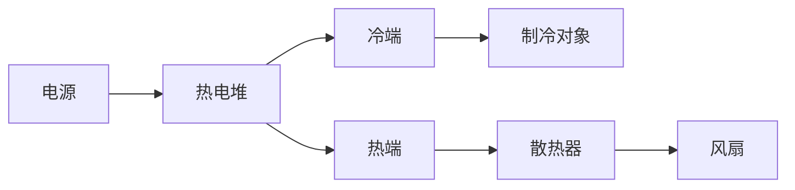

# 价值投资中的新型高效热电制冷材料技术

> 关键词：价值投资、新型高效热电制冷材料、材料技术、制冷原理、投资前景

> 摘要：本文聚焦于价值投资领域中新型高效热电制冷材料技术。首先介绍了该技术的背景，包括目的范围、预期读者等。接着阐述了核心概念与联系，通过示意图和流程图展示其原理架构。详细讲解了核心算法原理与操作步骤，结合Python代码说明。运用数学模型和公式进一步剖析，辅以举例。通过项目实战案例，从开发环境搭建到代码实现与解读进行了详细说明。探讨了实际应用场景，推荐了学习资源、开发工具框架和相关论文著作。最后总结了未来发展趋势与挑战，提供常见问题解答和扩展阅读参考资料，旨在为投资者和技术研究者全面了解该技术提供有价值的信息。

## 1. 背景介绍 
### 1.1 目的和范围
在当今能源问题日益突出的背景下，制冷技术在众多领域都有着广泛的应用，而传统制冷技术存在效率低下、对环境有一定影响等问题。新型高效热电制冷材料技术的出现为解决这些问题提供了新的途径。本文的目的在于深入探讨这种技术，从技术原理、实际应用到价值投资等多个方面进行分析，为相关投资者和技术人员提供全面的参考。范围涵盖了新型高效热电制冷材料的基本概念、核心算法、数学模型、项目实战以及实际应用场景等内容。

### 1.2 预期读者
本文预期读者包括对价值投资感兴趣的投资者，他们希望通过了解新型高效热电制冷材料技术来寻找有潜力的投资项目；从事热电制冷材料研究的科研人员，可从本文中获取技术原理和最新研究动态；相关专业的学生，有助于他们系统学习该领域的知识；以及制冷行业的从业者，能为其技术升级和产品创新提供思路。

### 1.3 文档结构概述
本文首先介绍背景信息，让读者对新型高效热电制冷材料技术有初步了解。接着阐述核心概念与联系，使读者掌握其基本原理和架构。然后详细讲解核心算法原理和具体操作步骤，并结合Python代码进行说明。运用数学模型和公式进一步剖析技术本质，通过举例加深理解。通过项目实战展示代码的实际应用和详细解读。探讨实际应用场景，为技术的落地提供方向。推荐学习资源、开发工具框架和相关论文著作，方便读者深入学习。最后总结未来发展趋势与挑战，提供常见问题解答和扩展阅读参考资料。

### 1.4 术语表
#### 1.4.1 核心术语定义
- **热电制冷**：基于热电效应，通过电流的作用实现热量的定向传递，从而达到制冷的目的。
- **热电材料**：能够将热能和电能相互转换的材料，是热电制冷技术的核心组成部分。
- **优值系数（ZT）**：衡量热电材料性能的重要指标，$ZT=\frac{S^{2}\sigma T}{\kappa}$，其中$S$为塞贝克系数，$\sigma$为电导率，$T$为绝对温度，$\kappa$为热导率。

#### 1.4.2 相关概念解释
- **塞贝克效应**：两种不同导体或半导体组成的回路中，当两个接点处的温度不同时，回路中会产生电动势，这种现象称为塞贝克效应。
- **帕尔帖效应**：当电流通过两种不同导体或半导体组成的接点时，接点处会产生吸热或放热现象，这就是帕尔帖效应，热电制冷主要基于此效应。

#### 1.4.3 缩略词列表
- **ZT**：优值系数（Figure of Merit）
- **TEC**：热电制冷器（Thermoelectric Cooler）

## 2. 核心概念与联系 
### 核心概念原理
热电制冷的核心原理基于帕尔帖效应。当有电流通过由两种不同热电材料组成的回路时，在两个接点处会分别出现吸热和放热现象。具体来说，当电子从一种材料进入另一种材料时，会发生能量的转移，从而导致热量的吸收或释放。

假设我们有两种热电材料$A$和$B$，将它们连接成一个回路，并通以电流$I$。在接点$1$处，电子从材料$A$进入材料$B$，如果电子在材料$B$中的能量状态低于在材料$A$中的能量状态，那么电子会释放能量，表现为接点$1$处放热；而在接点$2$处，电子从材料$B$进入材料$A$，若电子在材料$A$中的能量状态高于在材料$B$中的能量状态，电子会吸收能量，表现为接点$2$处吸热，从而实现制冷效果。

### 架构的文本示意图
以下是热电制冷系统的基本架构：

电源提供直流电，电流通过热电材料组成的热电堆。热电堆由多个热电单元串联或并联而成，每个热电单元由两种不同的热电材料组成。在热电堆的一侧，由于帕尔帖效应会吸收热量，形成冷端；而在另一侧则会释放热量，形成热端。为了提高制冷效率，通常会在冷端和热端分别设置散热装置，如散热器和风扇。冷端的低温可以用于冷却需要制冷的物体，如电子设备、传感器等。

### Mermaid 流程图


该流程图展示了热电制冷系统的工作流程。电源为热电堆提供能量，热电堆产生冷端和热端。冷端用于冷却制冷对象，热端通过散热器和风扇将热量散发出去。

## 3. 核心算法原理 & 具体操作步骤 
### 核心算法原理
热电制冷的核心算法主要涉及到对热电材料性能的评估和制冷系统的设计。其中，优值系数$ZT$是评估热电材料性能的关键指标，其计算公式为$ZT=\frac{S^{2}\sigma T}{\kappa}$。

在实际应用中，我们需要根据具体的制冷需求和工作条件，选择合适的热电材料，并设计热电堆的结构。例如，通过计算不同热电材料的$ZT$值，选择$ZT$值较高的材料，以提高制冷效率。

### 具体操作步骤及Python代码实现
以下是一个简单的Python代码示例，用于计算热电材料的优值系数：

```python
# 定义函数计算优值系数
def calculate_zt(S, sigma, T, kappa):
    """
    计算热电材料的优值系数ZT
    :param S: 塞贝克系数
    :param sigma: 电导率
    :param T: 绝对温度
    :param kappa: 热导率
    :return: 优值系数ZT
    """
    ZT = (S ** 2 * sigma * T) / kappa
    return ZT

# 示例参数
S = 0.2  # 塞贝克系数，单位：V/K
sigma = 1000  # 电导率，单位：S/m
T = 300  # 绝对温度，单位：K
kappa = 1  # 热导率，单位：W/(m*K)

# 计算优值系数
zt_value = calculate_zt(S, sigma, T, kappa)
print(f"热电材料的优值系数ZT为: {zt_value}")
```

在上述代码中，我们定义了一个函数`calculate_zt`，用于计算热电材料的优值系数。函数接受四个参数：塞贝克系数`S`、电导率`sigma`、绝对温度`T`和热导率`kappa`。通过将这些参数代入公式$ZT=\frac{S^{2}\sigma T}{\kappa}$，计算出优值系数$ZT$。最后，我们给出了一组示例参数，并调用函数计算优值系数，将结果打印输出。

## 4. 数学模型和公式 & 详细讲解 & 举例说明 
### 数学模型和公式
#### 优值系数公式
$ZT=\frac{S^{2}\sigma T}{\kappa}$

详细讲解：
- 塞贝克系数$S$：反映了热电材料在温度梯度下产生电动势的能力，单位为$V/K$。$S$值越大，说明材料在相同温度差下产生的电动势越大。
- 电导率$\sigma$：表示材料传导电流的能力，单位为$S/m$。较高的电导率意味着材料能够更有效地传导电流，减少电能损耗。
- 绝对温度$T$：单位为$K$，温度对热电效应有重要影响。一般来说，在一定范围内，温度升高，热电效应会增强。
- 热导率$\kappa$：表示材料传导热量的能力，单位为$W/(m\cdot K)$。较低的热导率可以减少热量在材料内部的传递，提高制冷效率。

#### 制冷功率公式
$Q_c = \alpha IT - \frac{1}{2}I^{2}R - K\Delta T$

其中，$Q_c$为制冷功率，$\alpha$为帕尔帖系数，$I$为电流，$T$为冷端温度，$R$为热电堆的电阻，$K$为热导，$\Delta T$为冷热端的温度差。

### 举例说明
假设我们有一种热电材料，其塞贝克系数$S = 0.2 V/K$，电导率$\sigma = 1000 S/m$，热导率$\kappa = 1 W/(m\cdot K)$，工作温度$T = 300 K$。

首先，计算优值系数$ZT$：
$ZT=\frac{S^{2}\sigma T}{\kappa}=\frac{(0.2)^{2}\times1000\times300}{1}=12000$

这表明该热电材料在这种条件下具有较好的热电性能。

接下来，假设我们使用该材料制作的热电堆，帕尔帖系数$\alpha = 0.3 V$，电流$I = 2 A$，冷端温度$T = 273 K$，热电堆电阻$R = 1 \Omega$，热导$K = 0.5 W/K$，冷热端温度差$\Delta T = 20 K$。

计算制冷功率$Q_c$：
$Q_c=\alpha IT-\frac{1}{2}I^{2}R - K\Delta T$
$=0.3\times2\times273-\frac{1}{2}\times2^{2}\times1 - 0.5\times20$
$=163.8 - 2 - 10$
$=151.8 W$

这意味着该热电堆在给定条件下能够提供$151.8 W$的制冷功率。

## 5. 项目实战：代码实际案例和详细解释说明 
### 5.1  开发环境搭建
#### 硬件环境
- 开发板：可以选择树莓派等开发板，用于控制热电制冷系统。
- 热电制冷器（TEC）：根据具体需求选择合适的型号和规格。
- 传感器：如温度传感器，用于实时监测冷热端的温度。
- 电源模块：为热电制冷器和开发板提供稳定的电源。

#### 软件环境
- 操作系统：可以选择Raspbian等适用于树莓派的操作系统。
- 编程语言：Python，因其简单易用且具有丰富的库。
- 开发工具：可以使用Thonny等Python集成开发环境。

### 5.2  源代码详细实现和代码解读
以下是一个基于树莓派控制热电制冷器的Python代码示例：

```python
import RPi.GPIO as GPIO
import time

# 定义GPIO引脚
TEC_PIN = 18

# 初始化GPIO
GPIO.setmode(GPIO.BCM)
GPIO.setup(TEC_PIN, GPIO.OUT)

# 定义制冷函数
def cool_on():
    GPIO.output(TEC_PIN, GPIO.HIGH)
    print("热电制冷器开启")

# 定义停止制冷函数
def cool_off():
    GPIO.output(TEC_PIN, GPIO.LOW)
    print("热电制冷器关闭")

try:
    # 开启制冷
    cool_on()
    # 制冷一段时间
    time.sleep(60)
    # 停止制冷
    cool_off()

except KeyboardInterrupt:
    print("程序终止")
finally:
    # 清理GPIO
    GPIO.cleanup()
```

代码解读：
- 导入必要的库：`RPi.GPIO`用于控制树莓派的GPIO引脚，`time`用于实现时间延迟。
- 定义GPIO引脚：将热电制冷器连接到树莓派的GPIO 18引脚。
- 初始化GPIO：设置GPIO模式为BCM模式，并将引脚设置为输出模式。
- 定义制冷函数`cool_on`：将引脚电平设置为高电平，开启热电制冷器。
- 定义停止制冷函数`cool_off`：将引脚电平设置为低电平，关闭热电制冷器。
- 在`try`块中，首先调用`cool_on`函数开启制冷，然后使用`time.sleep(60)`让制冷器工作60秒，最后调用`cool_off`函数停止制冷。
- `except KeyboardInterrupt`用于捕获用户按下Ctrl+C的中断信号，确保程序可以正常终止。
- `finally`块用于清理GPIO资源，避免引脚状态混乱。

### 5.3  代码解读与分析
该代码实现了一个简单的热电制冷器控制程序。通过控制树莓派的GPIO引脚输出电平，实现了热电制冷器的开启和关闭。在实际应用中，可以根据需要添加温度传感器，实时监测温度，并根据温度变化自动控制热电制冷器的工作状态，以提高制冷效率和稳定性。

## 6. 实际应用场景 
### 电子设备冷却
随着电子设备性能的不断提升，散热问题日益突出。新型高效热电制冷材料技术可以用于电子设备的冷却，如计算机CPU、GPU等。通过将热电制冷器集成到电子设备中，可以快速有效地降低设备温度，提高设备的性能和稳定性。

### 医疗设备制冷
在医疗领域，许多设备需要精确的温度控制，如血液分析仪、疫苗储存设备等。热电制冷技术具有制冷速度快、温度控制精度高的优点，可以满足医疗设备的制冷需求，确保医疗设备的正常运行。

### 汽车空调系统
传统汽车空调系统存在能耗高、体积大等问题。新型高效热电制冷材料技术可以为汽车空调系统提供一种新的解决方案。热电制冷器具有结构简单、无制冷剂等优点，可以降低汽车的能耗，提高能源利用效率。

### 食品保鲜
在食品运输和储存过程中，需要保持一定的低温环境来保证食品的新鲜度。热电制冷技术可以应用于食品保鲜设备中，如冷藏箱、保鲜柜等，为食品提供稳定的低温环境。

## 7. 工具和资源推荐
### 7.1 学习资源推荐
#### 7.1.1 书籍推荐
- 《热电材料与器件》：全面介绍了热电材料的基本原理、制备方法和应用领域，是学习热电材料的经典书籍。
- 《制冷技术原理》：系统阐述了制冷技术的基本原理和方法，对于理解热电制冷技术有很大的帮助。

#### 7.1.2 在线课程
- Coursera上的“Thermoelectric Materials and Devices”课程：由知名高校的教授授课，讲解了热电材料的最新研究成果和应用。
- edX上的“Refrigeration and Air Conditioning”课程：介绍了制冷和空调技术的基本原理和设计方法。

#### 7.1.3 技术博客和网站
- 中国制冷学会官网：提供了制冷领域的最新研究动态和行业信息。
- 热电材料研究论坛：聚集了众多热电材料领域的专家和学者，分享了最新的研究成果和技术经验。

### 7.2 开发工具框架推荐
#### 7.2.1 IDE和编辑器
- Thonny：适用于Python初学者的集成开发环境，具有简单易用的界面和丰富的调试功能。
- PyCharm：专业的Python集成开发环境，提供了强大的代码编辑、调试和项目管理功能。

#### 7.2.2 调试和性能分析工具
- 示波器：用于监测电信号的波形和参数，帮助调试热电制冷系统的电路。
- 功率分析仪：可以测量热电制冷器的功率消耗和效率，进行性能分析。

#### 7.2.3 相关框架和库
- RPi.GPIO：用于树莓派的GPIO控制，方便实现热电制冷器的控制。
- NumPy和SciPy：用于数值计算和科学计算，在热电材料性能评估和制冷系统设计中具有重要应用。

### 7.3 相关论文著作推荐
#### 7.3.1 经典论文
- “High-performance bulk thermoelectrics with all-scale hierarchical architectures”：该论文提出了一种全尺度分级结构的热电材料设计方法，显著提高了热电材料的性能。
- “Thermoelectric materials, phenomena, and applications: A bird's eye view”：对热电材料的基本原理、现象和应用进行了全面的综述。

#### 7.3.2 最新研究成果
- 关注《Nature Materials》、《Science》等顶级学术期刊，及时了解热电材料领域的最新研究进展。
- 参加国际热电会议（International Conference on Thermoelectrics），获取最新的研究成果和行业动态。

#### 7.3.3 应用案例分析
- 分析一些成功的热电制冷技术应用案例，如某品牌电子设备采用热电制冷技术后的性能提升情况，从中学习实际应用中的经验和方法。

## 8. 总结：未来发展趋势与挑战
### 未来发展趋势
- 高性能热电材料的研发：不断提高热电材料的优值系数$ZT$，开发出具有更高制冷效率的材料。
- 集成化和微型化：将热电制冷技术与其他技术集成，实现系统的微型化和智能化，满足更多领域的需求。
- 绿色环保：研发无铅、无汞等环保型热电材料，减少对环境的污染。

### 挑战
- 材料成本高：目前高性能热电材料的制备成本较高，限制了其大规模应用。
- 制冷效率有待提高：尽管热电制冷技术有了很大的发展，但与传统制冷技术相比，制冷效率仍然较低。
- 理论研究不足：对于热电材料的微观结构和热电效应的本质，还需要进一步深入研究。

## 9. 附录：常见问题与解答
### 问题1：新型高效热电制冷材料技术与传统制冷技术相比有哪些优势？
解答：新型高效热电制冷材料技术具有结构简单、无制冷剂、制冷速度快、温度控制精度高、可实现微型化等优势，对环境友好，且适用于一些特殊场合。

### 问题2：如何提高热电材料的优值系数$ZT$？
解答：可以通过优化材料的成分和微观结构，提高塞贝克系数$S$和电导率$\sigma$，同时降低热导率$\kappa$来提高优值系数$ZT$。

### 问题3：热电制冷技术的应用前景如何？
解答：热电制冷技术在电子设备冷却、医疗设备制冷、汽车空调系统、食品保鲜等领域具有广阔的应用前景。随着技术的不断发展和成本的降低，其应用范围将不断扩大。

## 10. 扩展阅读 & 参考资料
### 扩展阅读
- 了解其他新型制冷技术，如磁制冷、声制冷等，对比不同制冷技术的优缺点。
- 关注能源领域的发展动态，探讨热电制冷技术在能源存储和利用方面的潜在应用。

### 参考资料
- 相关学术论文和研究报告
- 行业标准和规范
- 设备制造商的产品说明书和技术文档

作者：AI天才研究院/AI Genius Institute & 禅与计算机程序设计艺术 /Zen And The Art of Computer Programming