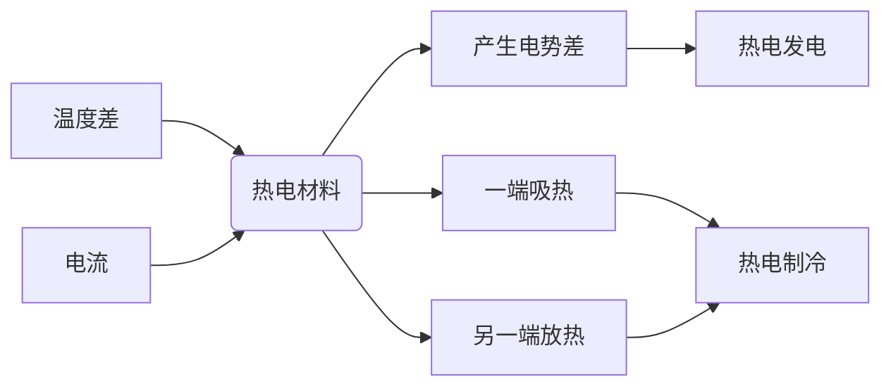

# 价值投资中的新型高效热电材料技术前景

> 关键词：价值投资、新型高效热电材料、技术前景、能源转换、市场潜力

> 摘要：本文围绕价值投资视角下的新型高效热电材料技术前景展开探讨。首先介绍了新型高效热电材料的背景，包括其目的、预期读者等信息。接着阐述了核心概念与联系，深入分析了相关原理和架构。通过Python代码详细讲解了核心算法原理及具体操作步骤，并给出数学模型和公式。结合项目实战，提供了代码实际案例及详细解释。同时探讨了该技术的实际应用场景，推荐了相关工具和资源。最后总结了未来发展趋势与挑战，解答常见问题并列出扩展阅读和参考资料，旨在为投资者和相关从业者全面呈现新型高效热电材料技术的投资价值和发展潜力。

## 1. 背景介绍 
### 1.1 目的和范围
新型高效热电材料技术在当今能源领域具有重要意义。其目的在于开发能够更高效地实现热能与电能相互转换的材料，以满足日益增长的能源需求和节能减排的要求。范围涵盖了材料的研发、制备、性能测试以及在不同领域的应用探索。通过研究新型高效热电材料，有望解决传统能源转换过程中的效率低下、环境污染等问题，为可持续能源发展提供新的途径。

### 1.2 预期读者
本文的预期读者包括价值投资者、材料科学研究人员、能源领域工程师、相关企业管理者以及对新型能源技术感兴趣的爱好者。对于价值投资者来说，了解新型高效热电材料技术前景有助于发现潜在的投资机会；研究人员可以从技术原理和发展趋势中获取灵感；工程师能将其应用到实际项目中；企业管理者可据此制定战略规划；爱好者则能拓宽知识面，了解前沿科技动态。

### 1.3 文档结构概述
本文首先介绍背景信息，让读者对新型高效热电材料技术有初步认识。接着阐述核心概念与联系，帮助读者理解技术的基本原理和架构。然后详细讲解核心算法原理和具体操作步骤，通过Python代码进行说明。之后给出数学模型和公式，加深读者对技术的理论理解。再通过项目实战展示代码实际案例及详细解释。随后探讨实际应用场景，让读者了解技术的实际用途。接着推荐相关工具和资源，方便读者进一步学习和研究。最后总结未来发展趋势与挑战，解答常见问题并列出扩展阅读和参考资料，为读者提供全面的信息。

### 1.4 术语表
#### 1.4.1 核心术语定义
- **热电材料**：是一种能将热能和电能相互转换的功能材料。当材料两端存在温度差时，会产生电动势（塞贝克效应）；反之，当有电流通过材料时，会产生温度差（帕尔帖效应）。
- **热电优值（ZT）**：是衡量热电材料性能的重要指标，它综合考虑了材料的电导率、塞贝克系数和热导率。ZT值越高，材料的热电转换效率越高。
- **能源转换效率**：指热电材料将热能转换为电能或电能转换为热能的效率，反映了材料在能源转换过程中的性能表现。

#### 1.4.2 相关概念解释
- **塞贝克效应**：由德国物理学家托马斯·约翰·塞贝克发现，当两种不同的导体或半导体连接成回路，且两个连接点处于不同温度时，回路中会产生电动势，从而形成电流。
- **帕尔帖效应**：由法国物理学家让·查尔斯·阿塔纳斯·帕尔帖发现，当有电流通过两种不同导体或半导体组成的回路时，在两个连接点处会分别出现吸热和放热现象。

#### 1.4.3 缩略词列表
- **ZT**：热电优值（Thermoelectric Figure of Merit）
- **TE**：热电（Thermoelectric）

## 2. 核心概念与联系 
### 2.1 热电材料的工作原理
热电材料的工作基于塞贝克效应和帕尔帖效应。塞贝克效应是热电发电的基础，当热电材料两端存在温度差时，材料内部的载流子（电子或空穴）会从高温端向低温端扩散，从而在两端形成电势差。帕尔帖效应则用于热电制冷，当有电流通过热电材料时，载流子会在材料中传输，在一端吸收热量，在另一端释放热量，实现制冷或制热的效果。

### 2.2 热电优值（ZT）的意义
热电优值（ZT）是衡量热电材料性能的关键指标，其计算公式为：
$$ZT = \frac{S^{2}\sigma T}{\kappa}$$
其中，$S$ 是塞贝克系数，反映了材料产生热电势的能力；$\sigma$ 是电导率，衡量材料导电的能力；$T$ 是绝对温度；$\kappa$ 是热导率，代表材料传导热量的能力。ZT值越高，说明材料在热电转换方面的性能越好，能够更高效地实现热能与电能的转换。

### 2.3 核心概念的联系
塞贝克效应和帕尔帖效应是热电材料工作的基础，而热电优值（ZT）则是对热电材料性能的量化评估。通过优化材料的塞贝克系数、电导率和热导率，可以提高ZT值，从而提升热电材料的能源转换效率。同时，材料的微观结构、化学成分等因素会影响这些性能参数，因此在研发新型高效热电材料时，需要综合考虑这些因素之间的相互关系。

### 2.4 原理和架构的文本示意图
热电材料的工作原理可以用以下文本示意图表示：

当热电材料两端存在温度差时，热端的载流子获得能量，向冷端扩散，形成电子流或空穴流，从而在两端产生电势差，实现热电发电。反之，当有电流通过热电材料时，载流子在材料中传输，在一端吸收热量，在另一端释放热量，实现热电制冷。

### 2.5 Mermaid流程图


## 3. 核心算法原理 & 具体操作步骤 
### 3.1 热电材料性能预测算法原理
在研发新型高效热电材料时，需要对材料的性能进行预测，以筛选出具有潜力的材料。一种常用的方法是基于机器学习算法，通过对大量已知热电材料的性能数据进行学习，建立预测模型。以下是一个基于Python的简单线性回归模型示例，用于预测热电材料的热电优值（ZT）：

```python
import numpy as np
from sklearn.linear_model import LinearRegression
from sklearn.model_selection import train_test_split
from sklearn.metrics import mean_squared_error

# 假设我们有一些已知的热电材料数据，包括塞贝克系数、电导率、热导率和ZT值
# 这里使用随机生成的数据作为示例
np.random.seed(0)
n_samples = 100
# 生成塞贝克系数、电导率、热导率数据
X = np.random.rand(n_samples, 3)
# 生成ZT值，假设ZT值与塞贝克系数、电导率、热导率存在线性关系
y = 2 * X[:, 0] + 3 * X[:, 1] - 1 * X[:, 2] + np.random.randn(n_samples) * 0.1

# 划分训练集和测试集
X_train, X_test, y_train, y_test = train_test_split(X, y, test_size=0.2, random_state=0)

# 创建线性回归模型
model = LinearRegression()

# 训练模型
model.fit(X_train, y_train)

# 预测测试集数据
y_pred = model.predict(X_test)

# 计算均方误差
mse = mean_squared_error(y_test, y_pred)
print(f"均方误差: {mse}")
```

### 3.2 具体操作步骤
1. **数据收集**：收集大量已知热电材料的性能数据，包括塞贝克系数、电导率、热导率、ZT值等。
2. **数据预处理**：对收集到的数据进行清洗、归一化等预处理操作，以提高模型的训练效果。
3. **模型选择**：根据数据特点和任务需求，选择合适的机器学习模型，如线性回归、决策树、神经网络等。
4. **模型训练**：将预处理后的数据划分为训练集和测试集，使用训练集对模型进行训练。
5. **模型评估**：使用测试集对训练好的模型进行评估，计算评估指标，如均方误差、决定系数等。
6. **模型优化**：根据评估结果，对模型进行优化，如调整模型参数、增加数据量等。
7. **性能预测**：使用优化后的模型对未知热电材料的性能进行预测，筛选出具有潜力的材料。

## 4. 数学模型和公式 & 详细讲解 & 举例说明 
### 4.1 热电优值（ZT）公式
热电优值（ZT）的计算公式为：
$$ZT = \frac{S^{2}\sigma T}{\kappa}$$
其中，$S$ 是塞贝克系数，单位为 $\mathrm{V/K}$；$\sigma$ 是电导率，单位为 $\mathrm{S/m}$；$T$ 是绝对温度，单位为 $\mathrm{K}$；$\kappa$ 是热导率，单位为 $\mathrm{W/(m \cdot K)}$。

### 4.2 详细讲解
- **塞贝克系数（S）**：塞贝克系数反映了材料产生热电势的能力。当材料两端存在温度差时，塞贝克系数越大，产生的热电势就越大。塞贝克系数的大小与材料的化学成分、晶体结构等因素有关。
- **电导率（$\sigma$）**：电导率衡量材料导电的能力。电导率越高，材料内部的载流子（电子或空穴）越容易移动，从而在热电转换过程中能够更有效地传输电荷。
- **热导率（$\kappa$）**：热导率代表材料传导热量的能力。在热电转换过程中，我们希望材料的热导率越低越好，这样可以减少热量的散失，提高能源转换效率。
- **绝对温度（T）**：绝对温度对热电优值（ZT）有重要影响。一般来说，随着温度的升高，热电优值（ZT）也会增加，但不同材料的温度依赖性不同。

### 4.3 举例说明
假设一种热电材料的塞贝克系数 $S = 200 \times 10^{-6} \mathrm{V/K}$，电导率 $\sigma = 10^{4} \mathrm{S/m}$，热导率 $\kappa = 1 \mathrm{W/(m \cdot K)}$，温度 $T = 300 \mathrm{K}$，则该材料的热电优值（ZT）为：
$$ZT = \frac{(200 \times 10^{-6})^{2} \times 10^{4} \times 300}{1} = 1.2$$

## 5. 项目实战：代码实际案例和详细解释说明 
### 5.1  开发环境搭建
1. **安装Python**：从Python官方网站（https://www.python.org/downloads/）下载并安装Python 3.x版本。
2. **安装必要的库**：使用pip命令安装所需的库，如numpy、scikit-learn等。
```bash
pip install numpy scikit-learn
```
3. **选择开发工具**：可以选择使用Jupyter Notebook、PyCharm等开发工具进行代码编写和调试。

### 5.2  源代码详细实现和代码解读
以下是一个更完整的基于Python的热电材料性能预测项目示例：

```python
import numpy as np
from sklearn.linear_model import LinearRegression
from sklearn.model_selection import train_test_split
from sklearn.metrics import mean_squared_error, r2_score
import matplotlib.pyplot as plt

# 生成模拟数据
np.random.seed(0)
n_samples = 200
# 生成塞贝克系数、电导率、热导率数据
X = np.random.rand(n_samples, 3)
# 生成ZT值，假设ZT值与塞贝克系数、电导率、热导率存在线性关系
y = 2 * X[:, 0] + 3 * X[:, 1] - 1 * X[:, 2] + np.random.randn(n_samples) * 0.1

# 划分训练集和测试集
X_train, X_test, y_train, y_test = train_test_split(X, y, test_size=0.2, random_state=0)

# 创建线性回归模型
model = LinearRegression()

# 训练模型
model.fit(X_train, y_train)

# 预测测试集数据
y_pred = model.predict(X_test)

# 计算评估指标
mse = mean_squared_error(y_test, y_pred)
r2 = r2_score(y_test, y_pred)
print(f"均方误差: {mse}")
print(f"决定系数: {r2}")

# 绘制预测结果与真实值的散点图
plt.scatter(y_test, y_pred)
plt.xlabel('真实值')
plt.ylabel('预测值')
plt.title('热电材料ZT值预测结果')
plt.show()
```

### 5.3  代码解读与分析
1. **数据生成**：使用`np.random.rand`函数生成模拟的塞贝克系数、电导率、热导率数据，并根据线性关系生成对应的ZT值。
2. **数据划分**：使用`train_test_split`函数将数据划分为训练集和测试集，其中测试集占总数据的20%。
3. **模型创建与训练**：创建线性回归模型`LinearRegression`，并使用训练集数据对模型进行训练。
4. **模型预测与评估**：使用训练好的模型对测试集数据进行预测，并计算均方误差和决定系数，评估模型的性能。
5. **结果可视化**：使用`matplotlib`库绘制预测结果与真实值的散点图，直观展示模型的预测效果。

## 6. 实际应用场景 
### 6.1 工业余热回收
在工业生产过程中，会产生大量的余热，这些余热如果直接排放到环境中，不仅浪费能源，还会造成环境污染。新型高效热电材料可以将工业余热转换为电能，实现能源的回收利用。例如，在钢铁、化工、水泥等行业的生产过程中，利用热电材料将高温废气、废渣中的热量转换为电能，为工厂的部分设备供电，降低能源消耗和生产成本。

### 6.2 汽车尾气发电
汽车尾气中含有大量的热能，通过在汽车尾气排放系统中安装热电发电装置，可以将尾气中的热能转换为电能，为汽车的电子设备供电，如车载空调、音响等，从而提高汽车的能源利用效率，减少燃油消耗和尾气排放。

### 6.3 电子设备散热与供电
在电子设备中，如电脑CPU、手机芯片等，工作时会产生大量的热量。利用热电材料的制冷和发电功能，可以实现电子设备的散热和供电。一方面，通过热电制冷模块将电子设备产生的热量散发出去，保证设备的正常运行；另一方面，利用热电发电模块将部分热量转换为电能，为电子设备的其他部件供电，延长设备的续航时间。

### 6.4 航空航天领域
在航空航天领域，对能源的高效利用和设备的可靠性要求极高。新型高效热电材料可以用于航天器的电源系统，利用航天器表面与宇宙空间的温度差进行热电发电，为航天器的电子设备提供稳定的电力供应。同时，热电制冷模块可以用于航天器的热管理系统，保证航天器内部设备的温度稳定。

## 7. 工具和资源推荐
### 7.1 学习资源推荐
#### 7.1.1 书籍推荐
- 《热电材料与器件》：本书系统介绍了热电材料的基本原理、制备方法、性能测试以及应用领域，是学习热电材料的经典教材。
- 《材料科学基础》：全面介绍了材料科学的基本概念、理论和方法，对于理解热电材料的微观结构和性能关系有很大帮助。

#### 7.1.2 在线课程
- Coursera平台上的“Materials Science and Engineering”课程：由知名高校教授授课，内容涵盖材料科学的各个方面，包括热电材料的相关知识。
- edX平台上的“Introduction to Thermoelectric Materials”课程：专门介绍热电材料的原理、性能和应用，适合初学者学习。

#### 7.1.3 技术博客和网站
- 材料人网（https://www.cailiaoren.com/）：提供材料科学领域的最新研究成果、行业动态和技术资讯，包括热电材料的相关内容。
- 科学网（https://www.sciencenet.cn/）：汇集了众多科研人员的博客和论文，有很多关于热电材料的前沿研究和学术讨论。

### 7.2 开发工具框架推荐
#### 7.2.1 IDE和编辑器
- PyCharm：一款功能强大的Python集成开发环境，提供代码编辑、调试、版本控制等功能，适合Python项目的开发。
- Jupyter Notebook：一种交互式的开发环境，支持代码、文本、图表等多种元素的展示，方便进行数据探索和模型训练。

#### 7.2.2 调试和性能分析工具
- pdb：Python自带的调试工具，可以帮助开发者定位代码中的问题。
- cProfile：Python的性能分析工具，可以分析代码的运行时间和函数调用情况，帮助优化代码性能。

#### 7.2.3 相关框架和库
- numpy：Python的数值计算库，提供高效的数组操作和数学函数，在热电材料性能预测中用于数据处理和计算。
- scikit-learn：Python的机器学习库，提供了丰富的机器学习算法和工具，如线性回归、决策树、神经网络等，可用于热电材料性能预测模型的构建和训练。

### 7.3 相关论文著作推荐
#### 7.3.1 经典论文
- "High-performance bulk thermoelectrics with