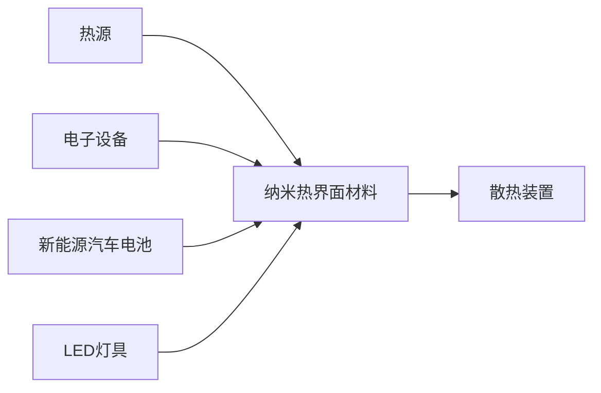

# 价值投资中的新型高效热管理纳米材料技术

> 关键词：价值投资、新型高效热管理、纳米材料技术、热传导、市场应用

> 摘要：本文聚焦于价值投资视角下的新型高效热管理纳米材料技术。从背景介绍出发，阐述了该技术在当今科技发展中的重要性以及预期读者和文档结构。详细讲解了核心概念与联系，包括纳米材料热管理的原理和架构。深入剖析了核心算法原理及操作步骤，并给出相应的 Python 代码示例。通过数学模型和公式进一步阐释其内在规律。结合项目实战，展示代码实现与解读。探讨了该技术的实际应用场景，推荐了学习、开发相关的工具和资源，包括书籍、在线课程、开发框架等。最后总结了其未来发展趋势与挑战，解答常见问题并提供扩展阅读与参考资料，旨在为关注该领域的投资者和技术人员提供全面而深入的指导。

## 1. 背景介绍 
### 1.1 目的和范围
在当今科技飞速发展的时代，电子设备、新能源汽车等领域对热管理的需求日益增长。传统的热管理材料已经难以满足高性能设备的散热要求，新型高效热管理纳米材料技术应运而生。本文的目的在于深入探讨该技术在价值投资领域的应用，分析其技术原理、市场潜力以及投资价值。范围涵盖从纳米材料热管理的基础概念到实际应用案例，再到相关的工具资源和未来发展趋势。

### 1.2 预期读者
本文预期读者包括对价值投资感兴趣的投资者，他们希望了解新兴技术领域的投资机会；从事热管理材料研究和开发的科研人员，可从中获取最新的技术动态和研究思路；电子设备、新能源汽车等行业的工程师和技术管理人员，有助于他们在产品设计和生产中应用新型热管理材料。

### 1.3 文档结构概述
本文首先介绍新型高效热管理纳米材料技术的背景知识，包括目的、预期读者和文档结构。接着阐述核心概念与联系，分析其原理和架构。然后详细讲解核心算法原理和具体操作步骤，并给出 Python 代码示例。通过数学模型和公式进一步说明其内在规律。结合实际项目，展示代码实现和解读。探讨该技术的实际应用场景，推荐相关的学习、开发工具和资源。最后总结未来发展趋势与挑战，解答常见问题并提供扩展阅读和参考资料。

### 1.4 术语表
#### 1.4.1 核心术语定义
- **价值投资**：一种投资策略，通过分析资产的内在价值，寻找被低估的投资标的，以获取长期稳定的回报。
- **新型高效热管理纳米材料**：具有特殊纳米结构和性能，能够更有效地进行热量传导和散热的材料。
- **热传导**：热量从高温区域向低温区域传递的过程。
- **纳米材料**：至少有一维尺寸处于纳米量级（1 - 100 纳米）的材料。

#### 1.4.2 相关概念解释
- **热管理**：通过采用各种技术和材料，对系统或设备的温度进行控制和调节，以保证其正常运行和性能稳定。
- **纳米技术**：在纳米尺度上对物质进行研究和操控的技术，可赋予材料独特的物理和化学性质。

#### 1.4.3 缩略词列表
- **CNT**：Carbon Nanotube，碳纳米管
- **GNPs**：Graphene Nanoplatelets，石墨烯纳米片

## 2. 核心概念与联系 

### 核心概念原理
新型高效热管理纳米材料技术的核心在于利用纳米材料独特的物理和化学性质来提高热传导效率。纳米材料具有较大的比表面积和量子尺寸效应，这些特性使得热量在纳米材料中的传递方式与传统材料有所不同。

例如，碳纳米管（CNT）具有优异的热导率，其独特的一维管状结构为声子（热量传递的主要载体）提供了高效的传输通道。声子在碳纳米管中可以进行长距离的无散射传输，从而大大提高了热传导效率。

石墨烯纳米片（GNPs）也具有出色的热性能。石墨烯是由碳原子组成的二维蜂窝状晶格结构，其碳原子之间通过共价键连接，形成了高度有序的晶体结构。这种结构使得声子能够在平面内快速传播，从而使石墨烯具有极高的热导率。

### 架构示意图

在这个架构中，热源（如电子设备、新能源汽车电池、LED 灯具等）产生的热量首先通过纳米热界面材料传递，纳米热界面材料利用其高效的热传导性能将热量快速传递到散热装置，从而实现对热源的有效散热。

### 联系分析
纳米热界面材料与热源和散热装置之间存在着紧密的联系。纳米热界面材料的性能直接影响着热量从热源传递到散热装置的效率。如果纳米热界面材料的热导率高、接触热阻小，那么热量就能更快速地从热源传递出去，从而降低热源的温度，提高设备的性能和稳定性。

同时，散热装置的设计和性能也会影响纳米热界面材料的效果。一个高效的散热装置能够及时将从纳米热界面材料传递过来的热量散发出去，进一步提高整个热管理系统的效率。

## 3. 核心算法原理 & 具体操作步骤 

### 核心算法原理
在热管理纳米材料技术中，一个重要的算法是热传导模型的建立。热传导过程可以用傅里叶定律来描述：

$$q = -k\nabla T$$

其中，$q$ 是热流密度（单位时间内通过单位面积的热量），$k$ 是热导率，$\nabla T$ 是温度梯度。

为了计算纳米材料中的热传导，我们可以采用有限差分法。有限差分法是一种数值计算方法，它将连续的空间和时间离散化，将偏微分方程转化为代数方程进行求解。

### 具体操作步骤
以下是使用有限差分法计算一维热传导问题的具体步骤：

1. **定义问题参数**：包括材料的热导率 $k$、长度 $L$、初始温度分布 $T_0(x)$、边界条件等。
2. **离散化空间和时间**：将材料的长度 $L$ 划分为 $N$ 个网格，每个网格的长度为 $\Delta x = L/N$；将时间划分为 $M$ 个时间步，每个时间步的长度为 $\Delta t$。
3. **建立差分方程**：根据傅里叶定律和能量守恒定律，建立一维热传导的差分方程。对于内部节点 $i$，差分方程可以表示为：

$$T_{i}^{n + 1}=T_{i}^{n}+\frac{k\Delta t}{\rho c(\Delta x)^2}(T_{i + 1}^{n}-2T_{i}^{n}+T_{i - 1}^{n})$$

其中，$T_{i}^{n}$ 表示第 $n$ 个时间步、第 $i$ 个节点的温度，$\rho$ 是材料的密度，$c$ 是材料的比热容。

4. **处理边界条件**：根据实际问题的边界条件，对边界节点的差分方程进行特殊处理。例如，对于固定温度边界条件，直接将边界节点的温度设置为给定值。
5. **迭代求解**：从初始温度分布开始，按照差分方程进行迭代计算，直到达到指定的时间步。

### Python 代码实现
```python
import numpy as np
import matplotlib.pyplot as plt

# 定义问题参数
L = 1.0  # 材料长度
N = 100  # 空间网格数
dx = L / N  # 空间步长
T0 = 100.0  # 初始温度
T_left = 100.0  # 左边界温度
T_right = 0.0  # 右边界温度
k = 1.0  # 热导率
rho = 1.0  # 密度
c = 1.0  # 比热容
dt = 0.001  # 时间步长
M = 1000  # 时间步数

# 初始化温度数组
T = np.full(N, T0)
T[0] = T_left
T[-1] = T_right

# 迭代求解
for n in range(M):
    Tn = T.copy()
    for i in range(1, N - 1):
        T[i] = Tn[i] + (k * dt / (rho * c * dx**2)) * (Tn[i + 1] - 2 * Tn[i] + Tn[i - 1])

# 绘制温度分布曲线
x = np.linspace(0, L, N)
plt.plot(x, T)
plt.xlabel('Position (m)')
plt.ylabel('Temperature (°C)')
plt.title('One-Dimensional Heat Conduction')
plt.show()
```

### 代码解释
- 首先，我们定义了问题的参数，包括材料的长度、空间网格数、初始温度、边界温度、热导率、密度、比热容、时间步长和时间步数。
- 然后，我们初始化温度数组，并将边界节点的温度设置为给定值。
- 在迭代求解过程中，我们使用一个嵌套的循环，外层循环控制时间步，内层循环控制空间节点。对于每个内部节点，根据差分方程更新其温度。
- 最后，我们使用 `matplotlib` 库绘制温度分布曲线。

## 4. 数学模型和公式 & 详细讲解 & 举例说明 

### 傅里叶定律
傅里叶定律是热传导的基本定律，它描述了热流密度与温度梯度之间的关系：

$$q = -k\nabla T$$

其中，$q$ 是热流密度（单位：$W/m^2$），$k$ 是热导率（单位：$W/(m\cdot K)$），$\nabla T$ 是温度梯度（单位：$K/m$）。负号表示热量从高温区域向低温区域传递。

### 一维热传导方程
在一维情况下，傅里叶定律可以表示为：

$$q = -k\frac{dT}{dx}$$

根据能量守恒定律，单位时间内流入某一微元体的热量等于该微元体内部能量的增加率。对于一维热传导问题，可得到一维热传导方程：

$$\rho c\frac{\partial T}{\partial t}=k\frac{\partial^2 T}{\partial x^2}$$

其中，$\rho$ 是材料的密度（单位：$kg/m^3$），$c$ 是材料的比热容（单位：$J/(kg\cdot K)$），$t$ 是时间（单位：$s$），$x$ 是空间坐标（单位：$m$）。

### 有限差分法离散化
为了使用有限差分法求解一维热传导方程，我们将空间和时间离散化。空间坐标 $x$ 被划分为 $N$ 个网格，节点坐标为 $x_i = i\Delta x$，其中 $i = 0, 1, \cdots, N$，$\Delta x = L/N$ 是空间步长；时间 $t$ 被划分为 $M$ 个时间步，时间点为 $t_n = n\Delta t$，其中 $n = 0, 1, \cdots, M$，$\Delta t$ 是时间步长。

对于内部节点 $i$，温度对时间的偏导数可以用向前差分近似：

$$\frac{\partial T}{\partial t}\approx\frac{T_{i}^{n + 1}-T_{i}^{n}}{\Delta t}$$

温度对空间的二阶偏导数可以用中心差分近似：

$$\frac{\partial^2 T}{\partial x^2}\approx\frac{T_{i + 1}^{n}-2T_{i}^{n}+T_{i - 1}^{n}}{(\Delta x)^2}$$

将上述近似代入一维热传导方程，得到差分方程：

$$T_{i}^{n + 1}=T_{i}^{n}+\frac{k\Delta t}{\rho c(\Delta x)^2}(T_{i + 1}^{n}-2T_{i}^{n}+T_{i - 1}^{n})$$

### 举例说明
假设我们有一个长度为 $L = 1m$ 的均匀杆，其热导率 $k = 1W/(m\cdot K)$，密度 $\rho = 1kg/m^3$，比热容 $c = 1J/(kg\cdot K)$。杆的初始温度为 $T_0 = 100^{\circ}C$，左边界温度保持为 $T_left = 100^{\circ}C$，右边界温度保持为 $T_right = 0^{\circ}C$。

我们将杆划分为 $N = 100$ 个网格，时间步长 $\Delta t = 0.001s$，迭代 $M = 1000$ 个时间步。使用上述差分方程进行迭代计算，最终可以得到杆在不同位置的温度分布。

通过计算结果可以看出，随着时间的推移，杆的温度逐渐从初始的均匀分布向满足边界条件的稳定分布变化。在这个过程中，热量从高温的左边界向低温的右边界传递，体现了热传导的过程。

## 5. 项目实战：代码实际案例和详细解释说明 

### 5.1  开发环境搭建
为了运行上述的 Python 代码，我们需要搭建相应的开发环境。以下是具体步骤：

1. **安装 Python**：从 Python 官方网站（https://www.python.org/downloads/）下载并安装 Python 3.x 版本。
2. **安装必要的库**：我们需要安装 `numpy` 和 `matplotlib` 库。可以使用 `pip` 命令进行安装：
```sh
pip install numpy matplotlib
```
3. **选择开发工具**：可以选择使用 PyCharm、Jupyter Notebook 等开发工具。如果选择 PyCharm，从 JetBrains 官方网站（https://www.jetbrains.com/pycharm/download/）下载并安装；如果选择 Jupyter Notebook，可以使用 `pip` 命令安装：
```sh
pip install jupyter
```

### 5.2  源代码详细实现和代码解读
```python
import numpy as np
import matplotlib.pyplot as plt

# 定义问题参数
L = 1.0  # 材料长度
N = 100  # 空间网格数
dx = L / N  # 空间步长
T0 = 100.0  # 初始温度
T_left = 100.0  # 左边界温度
T_right = 0.0  # 右边界温度
k = 1.0  # 热导率
rho = 1.0  # 密度
c = 1.0  # 比热容
dt = 0.001  # 时间步长
M = 1000  # 时间步数

# 初始化温度数组
T = np.full(N, T0)
T[0] = T_left
T[-1] = T_right

# 迭代求解
for n in range(M):
    Tn = T.copy()
    for i in range(1, N - 1):
        T[i] = Tn[i] + (k * dt / (rho * c * dx**2)) * (Tn[i + 1] - 2 * Tn[i] + Tn[i - 1])

# 绘制温度分布曲线
x = np.linspace(0, L, N)
plt.plot(x, T)
plt.xlabel('Position (m)')
plt.ylabel('Temperature (°C)')
plt.title('One-Dimensional Heat Conduction')
plt.show()
```

### 代码解读与分析
- **导入库**：使用 `import numpy as np` 和 `import matplotlib.pyplot as plt` 导入 `numpy` 和 `matplotlib` 库，分别用于数值计算和绘图。
- **定义问题参数**：定义了材料的长度、空间网格数、初始温度、边界温度、热导率、密度、比热容、时间步长和时间步数。
- **初始化温度数组**：使用 `np.full(N, T0)` 初始化温度数组，并将边界节点的温度设置为给定值。
- **迭代求解**：使用嵌套循环进行迭代计算。外层循环控制时间步，内层循环控制空间节点。在每次迭代中，根据差分方程更新内部节点的温度。
- **绘制温度分布曲线**：使用 `np.linspace(0, L, N)` 生成空间坐标数组，然后使用 `plt.plot(x, T)` 绘制温度分布曲线，并添加坐标轴标签和标题。

### 结果分析
运行上述代码后，我们可以得到一个一维热传导的温度分布曲线。从曲线中可以看出，热量从高温的左边界向低温的右边界传递，随着时间的推移，温度分布逐渐趋于稳定。通过调整参数，如热导率、时间步长等，可以观察到不同参数对热传导过程的影响。

## 6. 实际应用场景 
### 电子设备领域
在电子设备中，如智能手机、电脑、平板电脑等，随着芯片性能的不断提高，其发热量也越来越大。新型高效热管理纳米材料技术可以用于制造热界面材料，如导热硅脂、导热垫片等，将芯片产生的热量快速传递到散热装置，从而降低芯片温度，提高设备的性能和稳定性。

例如，苹果公司在其新款 iPhone 中采用了石墨烯散热技术，利用石墨烯的高导热性能，有效降低了手机的发热问题，提升了用户体验。

### 新能源汽车领域
新能源汽车的电池系统在充放电过程中会产生大量的热量，如果不能及时有效地散热，会影响电池的性能和寿命，甚至引发安全问题。新型高效热管理纳米材料技术可以应用于电池热管理系统，如使用碳纳米管复合材料制作电池散热片，提高电池的散热效率，保证电池在适宜的温度范围内工作。

例如，特斯拉公司在其电动汽车的电池热管理系统中采用了先进的热管理技术，其中可能就包括了新型纳米材料的应用，以确保电池的安全和性能。

### LED 照明领域
LED 灯具在工作过程中也会产生热量，过高的温度会影响 LED 的发光效率和寿命。新型高效热管理纳米材料技术可以用于制造 LED 散热外壳，提高灯具的散热性能，延长 LED 的使用寿命。

例如，一些高端 LED 灯具采用了纳米陶瓷散热材料，这种材料具有良好的热导率和绝缘性能，能够有效地将 LED 产生的热量散发出去。

### 航空航天领域
在航空航天领域，电子设备和发动机等部件在工作过程中会产生极高的热量，对热管理提出了极高的要求。新型高效热管理纳米材料技术可以用于制造航空航天设备的热防护材料和散热装置，保证设备在极端环境下的正常运行。

例如，航天器的热防护系统可能会采用纳米复合材料，这种材料具有轻质、高强度和高隔热性能的特点，能够有效地保护航天器免受高温的影响。

## 7. 工具和资源推荐
### 7.1 学习资源推荐
#### 7.1.1 书籍推荐
- 《纳米材料科学与技术》：本书系统地介绍了纳米材料的基本概念、制备方法、性能特点和应用领域，是学习纳米材料技术的经典教材。
- 《热传导》：全面阐述了热传导的基本理论、数学模型和数值计算方法，对于深入理解热管理技术具有重要的参考价值。
- 《价值投资实战手册》：从投资的角度出发，介绍了价值投资的基本理念、分析方法和实战技巧，有助于投资者在热管理纳米材料技术领域寻找投资机会。

#### 7.1.2 在线课程
- Coursera 上的“Nanomaterials and Nanotechnology”课程：由知名高校的教授授课，内容涵盖纳米材料的制备、性能和应用等方面。
- edX 上的“Heat Transfer”课程：详细讲解了热传导、热对流和热辐射的基本原理和计算方法。
- 中国大学 MOOC 上的“投资学”课程：介绍了投资的基本概念、理论和方法，帮助学习者建立价值投资的思维方式。

#### 7.1.3 技术博客和网站
- Nanowerk（https://www.nanowerk.com/）：提供纳米技术领域的最新研究成果、市场动态和行业新闻。
- Thermal Management Today（https://www.thermalmanagementtoday.com/）：专注于热管理技术的专业网站，涵盖热传导、散热设计等方面的内容。
- Seeking Alpha（https://seekingalpha.com/）：一个投资研究平台，提供各种行业的投资分析和研究报告，对于价值投资有很大的帮助。

### 7.2 开发工具框架推荐
#### 7.2.1 IDE和编辑器
- PyCharm：一款专业的 Python 集成开发环境，具有代码编辑、调试、自动补全、代码分析等功能，适合开发热管理纳米材料技术相关的 Python 代码。
- Jupyter Notebook：一个交互式的开发环境，支持 Python、R 等多种编程语言，方便进行代码编写、数据分析和可视化。
- Visual Studio Code：一款轻量级的代码编辑器，支持多种编程语言和插件扩展，可用于开发和调试热管理相关的代码。

#### 7.2.2 调试和性能分析工具
- Py-Spy：一个用于 Python 代码性能分析的工具，可以实时监测代码的运行状态，找出性能瓶颈。
- cProfile：Python 标准库中的性能分析模块，可以统计代码中各个函数的执行时间和调用次数。
- gprof2dot：一个将性能分析结果转换为可视化图形的工具，方便用户直观地分析代码的性能。

#### 7.2.3 相关框架和库
- NumPy：一个用于科学计算的 Python 库，提供了高效的数组操作和数学函数，是热管理纳米材料技术中数值计算的基础库。
- SciPy：一个基于 NumPy 的科学计算库，提供了优化、积分、插值等多种算法，可用于热传导模型的求解。
- Matplotlib：一个用于数据可视化的 Python 库，可以绘制各种类型的图表，如温度分布曲线、热流密度图等。

### 7.3 相关论文著作推荐
#### 7.3.1 经典论文
- “Thermal Conductivity of Carbon Nanotubes”：该论文详细研究了碳纳米管的热导率，揭示了其独特的热传导机制。
- “Graphene: Status and Prospects”：全面介绍了石墨烯的制备方法、物理性质和应用前景，是石墨烯领域的经典论文。
- “Value Investing: The Use of Historical Financial Statement Information to Separate Winners from Losers”：阐述了价值投资的基本理论和方法，对于在热管理纳米材料技术领域进行投资分析具有重要的指导意义。

#### 7.3.2 最新研究成果
- 关注《Nature Nanotechnology》、《Science》、《Advanced Materials》等国际顶级学术期刊，这些期刊经常发表热管理纳米材料技术领域的最新研究成果。
- 参加相关的国际学术会议，如 NanoTech、Thermal Management Conference 等，与行业内的专家和学者交流最新的研究进展。

#### 7.3.3 应用案例分析
- 研究一些成功应用新型高效热管理纳米材料技术的企业案例，如苹果公司、特斯拉公司等，分析其技术应用的策略和效果。
- 参考一些投资研究机构发布的行业报告，了解热管理纳米材料技术在不同行业的应用现状和市场前景。

## 8. 总结：未来发展趋势与挑战
### 未来发展趋势
- **高性能化**：未来新型高效热管理纳米材料将不断追求更高的热导率、更低的热阻和更好的稳定性，以满足日益增长的高性能设备的散热需求。
- **多功能化**：纳米材料不仅要具备高效的热传导性能，还将集成其他功能，如电磁屏蔽、防水防潮、防火阻燃等，实现材料的多功能化。
- **智能化**：热管理系统将朝着智能化方向发展，能够根据设备的工作状态和环境条件自动调节散热策略，提高热管理的效率和精准度。
- **产业化加速**：随着技术的不断成熟和成本的降低，新型高效热管理纳米材料技术将加速产业化进程，在更多的领域得到广泛应用。

### 挑战
- **制备工艺复杂**：纳米材料的制备工艺通常比较复杂，需要高精度的设备和严格的实验条件，这增加了材料的制备成本和难度。
- **性能稳定性问题**：纳米材料的性能容易受到外界环境因素的影响，如温度、湿度、压力等，如何保证材料在不同环境下的性能稳定性是一个亟待解决的问题。
- **标准和规范缺失**：目前，新型高效热管理纳米材料技术领域还缺乏统一的标准和规范，这给材料的研发、生产和应用带来了一定的困难。
- **市场竞争激烈**：随着该领域的发展，市场竞争将日益激烈，企业需要不断创新和提高产品质量，以在市场中占据一席之地。

## 9. 附录：常见问题与解答
### 问题 1：新型高效热管理纳米材料的成本高吗？
解答：目前，由于纳米材料的制备工艺复杂，需要高精度的设备和严格的实验条件，其成本相对较高。但随着技术的不断进步和规模化生产的实现，成本有望逐渐降低。

### 问题 2：纳米材料的热传导性能受哪些因素影响？
解答：纳米材料的热传导性能受多种因素影响，包括材料的晶体结构、缺陷密度、界面热阻、尺寸效应等。例如，晶体结构越有序，声子的散射就越小，热传导性能就越好；缺陷密度增加会导致声子散射加剧，降低热传导性能。

### 问题 3：新型高效热管理纳米材料技术在投资领域的风险有哪些？
解答：投资该领域存在一定的风险，主要包括技术研发风险、市场竞争风险、政策法规风险等。技术研发可能面临失败的风险，市场竞争可能导致产品价格下降和市场份额减少，政策法规的变化也可能对行业发展产生不利影响。

### 问题 4：如何评估新型高效热管理纳米材料的性能？
解答：评估纳米材料的性能通常需要综合考虑多个指标，如热导率、热阻、比热容、密度等。可以采用实验测试和数值模拟相结合的方法进行评估。实验测试可以使用热导率测试仪、差示扫描量热仪等设备；数值模拟可以使用有限元分析软件等工具。

## 10. 扩展阅读 & 参考资料
### 扩展阅读
- 《纳米技术与新能源》：介绍了纳米技术在新能源领域的应用，包括太阳能、风能、电池等方面，与热管理纳米材料技术有一定的关联。
- 《价值投资的秘密》：深入探讨了价值投资的理论和实践，对于在热管理纳米材料技术领域进行投资决策有一定的启发。
- 《热管理技术前沿》：关注热管理技术的最新发展动态和研究成果，为进一步了解该领域提供了丰富的信息。

### 参考资料
- 相关的学术论文和研究报告，如《Journal of Nanomaterials》、《Thermal Science and Engineering Progress》等期刊上的文章。
- 企业的技术白皮书和产品说明书，了解新型高效热管理纳米材料的实际应用情况。
- 行业协会和研究机构发布的统计数据和市场分析报告，掌握该领域的市场规模、发展趋势等信息。

作者：AI天才研究院/AI Genius Institute & 禅与计算机程序设计艺术 /Zen And The Art of Computer Programming