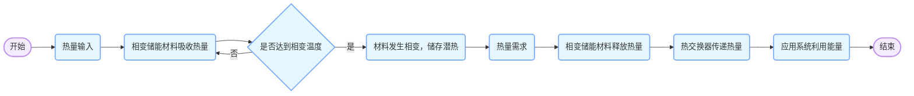

# 价值投资中的新型高效相变储能材料技术

> 关键词：价值投资、新型高效相变储能材料、储能技术、材料原理、应用场景

> 摘要：本文围绕价值投资中的新型高效相变储能材料技术展开深入探讨。首先介绍了该主题的背景，包括目的、预期读者、文档结构和相关术语。接着阐述了新型高效相变储能材料的核心概念、原理和架构，并给出示意图和流程图。详细讲解了核心算法原理及具体操作步骤，结合数学模型和公式进行说明。通过项目实战案例，展示了该技术在实际开发中的应用。分析了其实际应用场景，推荐了学习、开发相关的工具和资源，最后总结了未来发展趋势与挑战，还提供了常见问题解答和扩展阅读参考资料，旨在为价值投资者和相关技术人员提供全面而深入的技术知识和投资参考。

## 1. 背景介绍 
### 1.1 目的和范围
在当今能源领域，储能技术的发展对于能源的有效利用和可持续发展至关重要。新型高效相变储能材料技术作为储能领域的前沿技术，具有巨大的应用潜力和投资价值。本文的目的在于深入剖析该技术的原理、应用和投资前景，为价值投资者和相关技术人员提供全面而系统的知识。范围涵盖了新型高效相变储能材料的基本概念、核心算法、数学模型、实际应用案例，以及相关的学习资源和开发工具等方面。

### 1.2 预期读者
本文的预期读者主要包括以下几类人群：
- **价值投资者**：希望了解新型高效相变储能材料技术的投资价值和市场前景，以便做出合理的投资决策。
- **科研人员**：从事储能材料研究的科研工作者，期望通过本文获取该领域的最新技术进展和研究思路。
- **工程师和技术人员**：在能源、建筑、电子等行业工作的工程师和技术人员，希望将新型高效相变储能材料技术应用到实际项目中。
- **学生和爱好者**：对储能技术和材料科学感兴趣的学生和爱好者，通过阅读本文可以了解该领域的基础知识和发展动态。

### 1.3 文档结构概述
本文将按照以下结构进行阐述：
- **核心概念与联系**：介绍新型高效相变储能材料的基本概念、原理和架构，并给出示意图和流程图。
- **核心算法原理 & 具体操作步骤**：详细讲解该技术的核心算法原理，并通过Python源代码进行说明。
- **数学模型和公式 & 详细讲解 & 举例说明**：建立数学模型，推导相关公式，并通过具体例子进行解释。
- **项目实战：代码实际案例和详细解释说明**：通过实际项目案例，展示新型高效相变储能材料技术的开发过程和应用效果。
- **实际应用场景**：分析该技术在不同领域的实际应用场景和优势。
- **工具和资源推荐**：推荐相关的学习资源、开发工具和论文著作。
- **总结：未来发展趋势与挑战**：总结新型高效相变储能材料技术的未来发展趋势和面临的挑战。
- **附录：常见问题与解答**：解答读者在阅读过程中可能遇到的常见问题。
- **扩展阅读 & 参考资料**：提供相关的扩展阅读材料和参考资料，方便读者进一步深入学习。

### 1.4 术语表
#### 1.4.1 核心术语定义
- **相变储能材料**：能够在特定温度下发生相变，并在相变过程中吸收或释放大量热量的材料。常见的相变包括固 - 液、液 - 气等。
- **潜热**：相变过程中材料吸收或释放的热量，与材料的质量和相变焓有关。
- **相变焓**：单位质量的材料在相变过程中吸收或释放的热量，是衡量相变储能材料性能的重要指标之一。
- **过冷度**：材料在冷却过程中，实际结晶温度低于理论结晶温度的差值。过冷度会影响相变储能材料的性能和稳定性。

#### 1.4.2 相关概念解释
- **储能密度**：单位体积或单位质量的储能材料能够储存的能量，反映了储能材料的储能能力。
- **热导率**：材料传导热量的能力，对于相变储能材料来说，热导率影响着热量的传递速度和储能效率。
- **循环稳定性**：相变储能材料在多次相变循环过程中，其性能保持稳定的能力。循环稳定性是评估材料使用寿命和可靠性的重要指标。

#### 1.4.3 缩略词列表
- **PCM**：Phase Change Material，相变储能材料
- **LHTES**：Latent Heat Thermal Energy Storage，潜热热能储存

## 2. 核心概念与联系 
### 核心概念原理
新型高效相变储能材料的核心原理基于材料的相变特性。当材料发生相变时，会吸收或释放大量的潜热，从而实现热能的储存和释放。例如，固 - 液相变过程中，材料从固态转变为液态时吸收热量，而从液态转变为固态时释放热量。这种潜热储能方式具有储能密度高、温度恒定等优点。

常见的相变储能材料包括有机相变材料（如石蜡、脂肪酸等）、无机相变材料（如盐类水合物等）和复合相变材料。不同类型的相变储能材料具有不同的相变温度、相变焓和热导率等性能参数，适用于不同的应用场景。

### 架构的文本示意图
```plaintext
                          新型高效相变储能材料系统
                              ┌─────────────────┐
                              │  相变储能材料   │
                              └─────────────────┘
                                      │
                                      │  热量传递
                                      ▼
                              ┌─────────────────┐
                              │  热交换器       │
                              └─────────────────┘
                                      │
                                      │  能量输出
                                      ▼
                              ┌─────────────────┐
                              │  应用系统       │
                              └─────────────────┘
```

### Mermaid 流程图


## 3. 核心算法原理 & 具体操作步骤 
### 核心算法原理
在相变储能材料的研究和应用中，需要对材料的热性能进行模拟和预测。一个常用的算法是基于热传导方程的有限差分法。热传导方程描述了材料内部温度随时间和空间的变化关系，其一般形式为：

$$\frac{\partial T}{\partial t}=\alpha\nabla^{2}T$$

其中，$T$ 是温度，$t$ 是时间，$\alpha$ 是热扩散系数，$\nabla^{2}T$ 是温度的拉普拉斯算子。

### 具体操作步骤
下面通过Python代码详细阐述使用有限差分法求解热传导方程的具体步骤：

```python
import numpy as np
import matplotlib.pyplot as plt

# 定义参数
L = 1.0  # 材料长度
T0 = 20.0  # 初始温度
T_left = 100.0  # 左边界温度
T_right = 20.0  # 右边界温度
alpha = 0.1  # 热扩散系数
dx = 0.01  # 空间步长
dt = 0.001  # 时间步长
t_end = 1.0  # 模拟结束时间

# 计算网格点数
nx = int(L / dx) + 1
nt = int(t_end / dt)

# 初始化温度数组
T = np.full(nx, T0)
T[0] = T_left
T[-1] = T_right

# 有限差分法迭代求解
for n in range(nt):
    Tn = T.copy()
    for i in range(1, nx - 1):
        T[i] = Tn[i] + alpha * dt / dx**2 * (Tn[i + 1] - 2 * Tn[i] + Tn[i - 1])

# 绘制温度分布曲线
x = np.linspace(0, L, nx)
plt.plot(x, T)
plt.xlabel('位置 (m)')
plt.ylabel('温度 (°C)')
plt.title('相变储能材料温度分布')
plt.show()
```

### 代码解释
1. **参数定义**：定义了材料的长度、初始温度、边界温度、热扩散系数、空间步长、时间步长和模拟结束时间等参数。
2. **网格点数计算**：根据空间步长和材料长度计算网格点数，根据时间步长和模拟结束时间计算迭代次数。
3. **温度数组初始化**：初始化温度数组，并设置边界条件。
4. **有限差分法迭代求解**：使用有限差分法对热传导方程进行迭代求解，更新每个时间步的温度分布。
5. **结果绘制**：绘制最终的温度分布曲线，直观展示材料内部的温度变化情况。

## 4. 数学模型和公式 & 详细讲解 & 举例说明 
### 热传导方程
热传导方程是描述热量在材料中传递的基本方程，其一般形式为：

$$\rho c_p\frac{\partial T}{\partial t}=\nabla\cdot(k\nabla T)+Q$$

其中，$\rho$ 是材料的密度，$c_p$ 是材料的比热容，$k$ 是材料的热导率，$Q$ 是内部热源。

### 有限差分法离散化
为了使用有限差分法求解热传导方程，需要将其在空间和时间上进行离散化。对于一维热传导问题，空间离散化可以使用中心差分格式：

$$\frac{\partial^2 T}{\partial x^2}\approx\frac{T_{i + 1}^n - 2T_i^n + T_{i - 1}^n}{\Delta x^2}$$

时间离散化可以使用显式差分格式：

$$\frac{\partial T}{\partial t}\approx\frac{T_i^{n + 1} - T_i^n}{\Delta t}$$

将上述离散化格式代入热传导方程，得到有限差分方程：

$$T_i^{n + 1}=T_i^n+\frac{\alpha\Delta t}{\Delta x^2}(T_{i + 1}^n - 2T_i^n + T_{i - 1}^n)+\frac{Q_i^n\Delta t}{\rho c_p}$$

其中，$\alpha = \frac{k}{\rho c_p}$ 是热扩散系数。

### 举例说明
假设有一个长度为 $L = 1m$ 的相变储能材料棒，初始温度为 $T_0 = 20^{\circ}C$，左边界温度保持为 $T_{left} = 100^{\circ}C$，右边界温度保持为 $T_{right} = 20^{\circ}C$。材料的密度 $\rho = 1000kg/m^3$，比热容 $c_p = 1000J/(kg\cdot^{\circ}C)$，热导率 $k = 1W/(m\cdot^{\circ}C)$。使用上述有限差分法求解该材料棒在 $t = 1s$ 时的温度分布。

首先，计算热扩散系数 $\alpha = \frac{k}{\rho c_p}=\frac{1}{1000\times1000}=1\times10^{-6}m^2/s$。

然后，根据给定的空间步长 $\Delta x = 0.01m$ 和时间步长 $\Delta t = 0.001s$，计算网格点数 $nx = \frac{L}{\Delta x}+1 = 101$ 和迭代次数 $nt = \frac{t}{\Delta t}=1000$。

最后，使用上述Python代码进行求解，得到材料棒在 $t = 1s$ 时的温度分布曲线。

## 5. 项目实战：代码实际案例和详细解释说明 
### 5.1  开发环境搭建
为了实现基于新型高效相变储能材料技术的项目，需要搭建相应的开发环境。以下是具体的搭建步骤：

#### 安装Python
Python是一种广泛使用的编程语言，在科学计算和数据分析领域具有强大的功能。可以从Python官方网站（https://www.python.org/downloads/）下载并安装Python 3.x版本。

#### 安装必要的库
在Python环境中，需要安装一些必要的库来实现热传导模拟和数据可视化。可以使用pip命令进行安装：

```sh
pip install numpy matplotlib
```

#### 选择开发工具
可以选择使用集成开发环境（IDE）如PyCharm，或者文本编辑器如VS Code来编写和运行Python代码。

### 5.2  源代码详细实现和代码解读
以下是一个更完整的基于有限差分法的相变储能材料热传导模拟代码：

```python
import numpy as np
import matplotlib.pyplot as plt

# 定义材料参数
L = 1.0  # 材料长度 (m)
T0 = 20.0  # 初始温度 (°C)
T_left = 100.0  # 左边界温度 (°C)
T_right = 20.0  # 右边界温度 (°C)
rho = 1000.0  # 材料密度 (kg/m^3)
cp = 1000.0  # 材料比热容 (J/(kg·°C))
k = 1.0  # 材料热导率 (W/(m·°C))
alpha = k / (rho * cp)  # 热扩散系数 (m^2/s)

# 定义模拟参数
dx = 0.01  # 空间步长 (m)
dt = 0.001  # 时间步长 (s)
t_end = 1.0  # 模拟结束时间 (s)

# 计算网格点数和迭代次数
nx = int(L / dx) + 1
nt = int(t_end / dt)

# 初始化温度数组
T = np.full(nx, T0)
T[0] = T_left
T[-1] = T_right

# 有限差分法迭代求解
for n in range(nt):
    Tn = T.copy()
    for i in range(1, nx - 1):
        T[i] = Tn[i] + alpha * dt / dx**2 * (Tn[i + 1] - 2 * Tn[i] + Tn[i - 1])

# 绘制温度分布曲线
x = np.linspace(0, L, nx)
plt.plot(x, T)
plt.xlabel('位置 (m)')
plt.ylabel('温度 (°C)')
plt.title('相变储能材料温度分布')
plt.show()
```

### 代码解读与分析
1. **材料参数定义**：定义了材料的长度、初始温度、边界温度、密度、比热容和热导率等参数，并计算了热扩散系数。
2. **模拟参数定义**：定义了空间步长、时间步长和模拟结束时间，并计算了网格点数和迭代次数。
3. **温度数组初始化**：初始化温度数组，并设置边界条件。
4. **有限差分法迭代求解**：使用有限差分法对热传导方程进行迭代求解，更新每个时间步的温度分布。
5. **结果绘制**：绘制最终的温度分布曲线，直观展示材料内部的温度变化情况。

通过对代码的分析，可以发现有限差分法是一种简单而有效的数值求解方法，但需要注意时间步长和空间步长的选择，以保证数值解的稳定性。

## 6. 实际应用场景 
新型高效相变储能材料技术在多个领域具有广泛的应用前景，以下是一些具体的应用场景：

### 建筑领域
在建筑领域，相变储能材料可以用于墙体、屋顶和地板等结构中，实现建筑物的热能储存和调节。例如，将相变储能材料与建筑材料复合制成相变墙板，当室内温度升高时，相变材料吸收热量并发生相变，储存热能；当室内温度降低时，相变材料释放热量，从而减少建筑物的能耗，提高室内的舒适度。

### 太阳能热利用领域
在太阳能热利用系统中，相变储能材料可以用于储存太阳能热量，解决太阳能的间歇性问题。例如，在太阳能热水器中，将相变储能材料作为储热介质，可以在白天吸收太阳能热量并储存起来，在晚上或阴天释放热量，保证热水的供应。

### 电子设备散热领域
在电子设备散热领域，相变储能材料可以用于吸收电子设备产生的热量，降低设备的温度。例如，在电脑CPU散热器中，将相变储能材料涂覆在散热片表面，当CPU温度升高时，相变材料吸收热量并发生相变，从而有效地降低CPU的温度，提高设备的性能和可靠性。

### 冷链物流领域
在冷链物流领域，相变储能材料可以用于保持货物的低温环境。例如，在冷藏运输车辆和冷藏集装箱中，使用相变储能材料作为蓄冷介质，可以在制冷设备停机时，通过相变材料释放冷量，维持货物的低温状态，减少制冷设备的能耗和运行成本。

## 7. 工具和资源推荐
### 7.1 学习资源推荐
#### 7.1.1 书籍推荐
- 《储能材料》：全面介绍了各种储能材料的原理、性能和应用，包括相变储能材料。
- 《热传导》：深入讲解了热传导的基本理论和数值计算方法，对于理解相变储能材料的热性能模拟有很大帮助。
- 《材料科学基础》：介绍了材料的结构、性能和制备方法，为学习相变储能材料提供了基础理论知识。

#### 7.1.2 在线课程
- Coursera上的“Energy Storage Technologies”课程：系统介绍了各种储能技术，包括相变储能技术的原理和应用。
- edX上的“Thermal Energy Storage”课程：专门针对热能储存技术进行讲解，包括相变储能材料的热性能分析和设计。

#### 7.1.3 技术博客和网站
- 中国储能网（https://www.escn.com.cn/）：提供了储能领域的最新技术动态、市场信息和政策法规。
- 材料人网（https://www.cailiaoren.com/）：专注于材料科学领域的技术交流和知识分享，有很多关于相变储能材料的研究成果和应用案例。

### 7.2 开发工具框架推荐
#### 7.2.1 IDE和编辑器
- PyCharm：一款专业的Python集成开发环境，具有代码编辑、调试、自动补全等功能，适合Python开发。
- VS Code：一款轻量级的文本编辑器，支持多种编程语言，通过安装Python扩展可以实现Python代码的开发和调试。

#### 7.2.2 调试和性能分析工具
- IPython：一个交互式的Python shell，支持代码调试和性能分析，方便对Python代码进行测试和优化。
- cProfile：Python内置的性能分析工具，可以分析代码的运行时间和函数调用次数，帮助找出代码中的性能瓶颈。

#### 7.2.3 相关框架和库
- NumPy：一个用于科学计算的Python库，提供了高效的数组操作和数学函数，是进行热传导模拟的基础库。
- Matplotlib：一个用于数据可视化的Python库，可以绘制各种类型的图表，方便展示模拟结果。

### 7.3 相关论文著作推荐
#### 7.3.1 经典论文
- "Review on thermal energy storage with phase change materials and applications"：一篇关于相变储能材料的综述论文，系统介绍了相变储能材料的分类、性能和应用。
- "A review of materials, heat transfer and phase change problem formulation for latent heat thermal energy storage systems"：对潜热热能储存系统的材料、热传递和相变问题进行了详细的综述和分析。

#### 7.3.2 最新研究成果
- 在《Journal of Energy Storage》、《Energy Conversion and Management》等期刊上搜索关于新型高效相变储能材料的最新研究论文，了解该领域的前沿动态。

#### 7.3.3 应用案例分析
- 查阅相关的会议论文集和技术报告，了解相变储能材料在实际项目中的应用案例和经验教训。

## 8. 总结：未来发展趋势与挑战
### 未来发展趋势
- **高性能材料研发**：未来将继续研发具有更高相变焓、更合适相变温度和更好循环稳定性的新型高效相变储能材料，以满足不同领域的应用需求。
- **复合化与多功能化**：将相变储能材料与其他功能材料复合，开发具有多种功能的复合材料，如具有储能、保温、防火等功能的建筑材料。
- **智能化应用**：结合传感器、控制器等技术，实现相变储能系统的智能化控制和管理，提高储能效率和系统的可靠性。
- **大规模应用推广**：随着技术的不断成熟和成本的降低，相变储能材料技术将在建筑、能源、交通等领域得到更广泛的应用和推广。

### 挑战
- **材料成本**：目前，一些高性能的相变储能材料成本较高，限制了其大规模应用。需要进一步研究和开发低成本的材料制备工艺，降低材料成本。
- **热导率改善**：大多数相变储能材料的热导率较低，导致热量传递速度慢，影响储能效率。需要采取有效的方法提高材料的热导率，如添加高导热填料、制备多孔结构材料等。
- **循环稳定性**：在多次相变循环过程中，相变储能材料可能会出现性能衰减和泄漏等问题，影响材料的使用寿命和可靠性。需要研究提高材料循环稳定性的方法，如封装技术、添加剂改性等。
- **标准和规范缺失**：目前，相变储能材料技术的相关标准和规范还不够完善，导致产品质量参差不齐。需要加快制定相关的标准和规范，促进产业的健康发展。

## 9. 附录：常见问题与解答
### 问题1：相变储能材料的储能密度与哪些因素有关？
答：相变储能材料的储能密度与材料的相变焓和密度有关。相变焓越大，材料在相变过程中吸收或释放的热量就越多，储能密度也就越高；材料的密度越大，单位体积内的材料质量就越大，储能密度也会相应提高。

### 问题2：如何选择合适的相变储能材料？
答：选择合适的相变储能材料需要考虑以下几个因素：
- **相变温度**：根据具体的应用场景，选择相变温度合适的材料。例如，在建筑领域，一般选择相变温度在20 - 30°C之间的材料。
- **相变焓**：相变焓越大，储能能力越强，应选择相变焓较高的材料。
- **热导率**：热导率越高，热量传递速度越快，应选择热导率较高的材料，以提高储能效率。
- **循环稳定性**：材料在多次相变循环过程中性能应保持稳定，避免出现性能衰减和泄漏等问题。
- **成本**：考虑材料的成本，选择性价比高的材料。

### 问题3：有限差分法求解热传导方程有哪些优缺点？
答：有限差分法求解热传导方程的优点包括：
- **简单易懂**：有限差分法的原理和实现过程相对简单，易于理解和掌握。
- **计算效率高**：对于简单的一维和二维热传导问题，有限差分法的计算效率较高。
- **适用性广**：可以处理不同边界条件和内部热源的热传导问题。

缺点包括：
- **数值稳定性问题**：时间步长和空间步长的选择不当可能会导致数值解不稳定，出现振荡或发散现象。
- **精度有限**：有限差分法是一种近似求解方法，其精度受到网格分辨率和差分格式的影响。
- **处理复杂几何形状困难**：对于复杂几何形状的热传导问题，有限差分法的网格划分和边界处理较为困难。

## 10. 扩展阅读 & 参考资料
### 扩展阅读
- 《储能技术与应用》：进一步深入探讨了各种储能技术的原理、应用和发展趋势。
- 《材料物理性能》：详细介绍了材料的物理性能，包括热性能、电性能等，有助于深入理解相变储能材料的性能和原理。

### 参考资料
- 相关学术期刊上的研究论文，如《Journal of Materials Chemistry A》、《Applied Energy》等。
- 国际能源署（IEA）发布的储能技术报告和政策文件。
- 国内外相关企业和研究机构的技术资料和产品手册。

作者：AI天才研究院/AI Genius Institute & 禅与计算机程序设计艺术 /Zen And The Art of Computer Programming