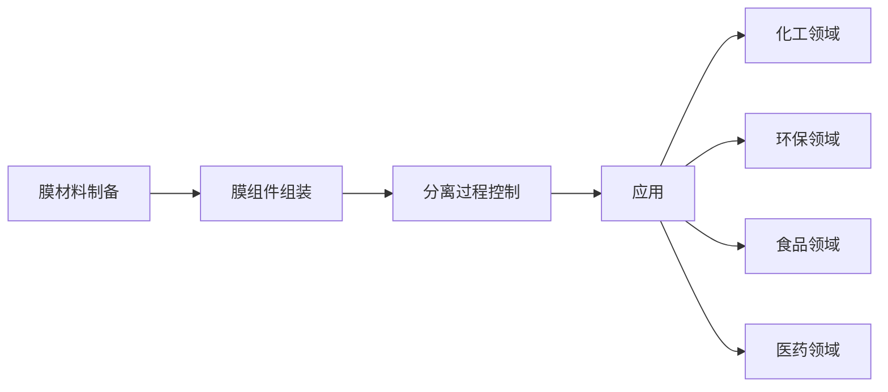

# 价值投资中的新型高效膜分离材料技术

> 关键词：价值投资、新型高效膜分离材料、技术原理、应用场景、发展趋势

> 摘要：本文围绕价值投资中的新型高效膜分离材料技术展开深入探讨。首先介绍了该技术的背景，包括目的范围、预期读者等内容。接着阐述了新型高效膜分离材料的核心概念与联系，详细讲解其核心算法原理和具体操作步骤，并通过数学模型和公式进行理论支撑。通过项目实战案例，具体展示了该技术的代码实现和应用。分析了其实际应用场景，推荐了相关的工具和资源。最后总结了该技术未来的发展趋势与挑战，为价值投资者和相关技术人员提供全面且深入的参考。

## 1. 背景介绍 
### 1.1 目的和范围
新型高效膜分离材料技术在众多领域展现出巨大的应用潜力，如化工、环保、食品、医药等行业。本文章的目的在于深入剖析该技术的原理、应用及投资价值，为投资者和技术人员提供全面的信息。范围涵盖了新型高效膜分离材料的基本概念、技术原理、实际应用案例以及相关的工具资源等方面。通过对这些内容的探讨，帮助读者更好地理解该技术，从而在价值投资决策中做出更明智的选择。

### 1.2 预期读者
本文预期读者主要包括以下几类人群：一是价值投资者，他们希望通过了解新型高效膜分离材料技术的发展前景和投资价值，寻找具有潜力的投资项目；二是相关行业的技术人员，如化学工程、材料科学等领域的工程师和研究人员，他们需要深入了解该技术的原理和应用，以推动技术的创新和发展；三是对科技领域感兴趣的普通读者，他们希望通过本文初步了解新型高效膜分离材料技术的基本知识和应用场景。

### 1.3 文档结构概述
本文共分为十个部分。第一部分为背景介绍，阐述了文章的目的、预期读者、文档结构概述和术语表。第二部分介绍核心概念与联系，包括核心概念原理和架构的文本示意图以及 Mermaid 流程图。第三部分讲解核心算法原理和具体操作步骤，并通过 Python 源代码详细阐述。第四部分介绍数学模型和公式，并进行详细讲解和举例说明。第五部分是项目实战，包括开发环境搭建、源代码详细实现和代码解读。第六部分分析实际应用场景。第七部分推荐相关的工具和资源，包括学习资源、开发工具框架和相关论文著作。第八部分总结未来发展趋势与挑战。第九部分是附录，解答常见问题。第十部分提供扩展阅读和参考资料。

### 1.4 术语表
#### 1.4.1 核心术语定义
- **膜分离技术**：利用膜对混合物中各组分的选择透过性差异，实现分离、提纯和浓缩的过程。
- **新型高效膜分离材料**：具有特殊结构和性能，能够高效、选择性地分离混合物中不同组分的材料。
- **价值投资**：一种基于对资产内在价值的评估，寻找被低估的投资机会，以获取长期收益的投资策略。

#### 1.4.2 相关概念解释
- **选择性透过性**：膜对不同物质的透过能力不同，只允许某些物质通过，而阻止其他物质的特性。
- **分离系数**：衡量膜分离性能的指标，定义为两种物质在膜两侧的浓度比之比。
- **通量**：单位时间内通过单位面积膜的物质的量，反映膜的分离效率。

#### 1.4.3 缩略词列表
- **RO**：Reverse Osmosis，反渗透
- **UF**：Ultrafiltration，超滤
- **NF**：Nanofiltration，纳滤
- **MF**：Microfiltration，微滤

## 2. 核心概念与联系 
### 核心概念原理
新型高效膜分离材料技术的核心在于利用膜的选择性透过性实现混合物的分离。膜是一种具有特殊结构的材料，其内部存在各种微观孔道或特殊的化学官能团。这些结构和官能团决定了膜对不同物质的亲和性和透过能力。例如，在反渗透膜中，膜的致密结构可以阻止大部分溶质分子通过，而只允许水分子通过，从而实现水的净化和脱盐。

在超滤膜中，膜的孔径大小在一定范围内，能够截留大分子物质，如蛋白质、胶体等，而允许小分子物质和溶剂通过。纳滤膜的孔径介于反渗透膜和超滤膜之间，对某些特定的离子和小分子有机物具有较好的截留效果。微滤膜的孔径较大，主要用于截留悬浮颗粒、细菌等较大的物质。

### 架构的文本示意图
新型高效膜分离材料技术的架构可以分为膜材料制备、膜组件组装、分离过程控制和应用四个部分。

- **膜材料制备**：通过化学合成、物理改性等方法制备具有特定结构和性能的膜材料。
- **膜组件组装**：将制备好的膜材料组装成各种形式的膜组件，如平板膜组件、中空纤维膜组件等。
- **分离过程控制**：根据不同的应用需求，控制分离过程的操作条件，如压力、温度、流量等。
- **应用**：将膜组件应用于不同的领域，实现混合物的分离和提纯。

### Mermaid 流程图


## 3. 核心算法原理 & 具体操作步骤 
### 核心算法原理
在膜分离过程中，常用的算法原理包括传质理论和吸附 - 解吸理论。

传质理论主要基于菲克定律，描述物质在膜中的扩散过程。菲克第一定律表示物质的扩散通量 $J$ 与浓度梯度 $\frac{dc}{dx}$ 成正比，其数学表达式为：

$J = -D\frac{dc}{dx}$

其中，$D$ 为扩散系数，与膜材料的性质、温度等因素有关。

吸附 - 解吸理论认为，物质在膜表面的吸附和解吸过程对膜分离性能有重要影响。物质首先吸附在膜表面，然后通过膜内部的孔道或分子间隙扩散到膜的另一侧，最后解吸进入另一侧的流体中。

### 具体操作步骤
以下是一个基于 Python 实现的简单膜分离过程模拟示例，假设我们要模拟一个反渗透膜对盐水的分离过程。

```python
import numpy as np

# 定义参数
# 初始盐水浓度 (mol/L)
initial_concentration = 1.0
# 膜的截留率
rejection_rate = 0.9
# 渗透通量 (L/(m^2·h))
flux = 10
# 膜面积 (m^2)
membrane_area = 1
# 处理时间 (h)
time = 1

# 计算透过膜的溶质通量
solute_flux = (1 - rejection_rate) * initial_concentration * flux

# 计算透过膜的溶质总量
solute_amount = solute_flux * membrane_area * time

# 计算剩余溶质总量
remaining_solute_amount = initial_concentration * membrane_area * flux * time - solute_amount

# 计算剩余盐水浓度
remaining_concentration = remaining_solute_amount / (membrane_area * flux * time)

print(f"初始盐水浓度: {initial_concentration} mol/L")
print(f"处理后盐水浓度: {remaining_concentration} mol/L")
```

### 代码解释
1. **参数定义**：定义了初始盐水浓度、膜的截留率、渗透通量、膜面积和处理时间等参数。
2. **溶质通量计算**：根据截留率计算透过膜的溶质通量。
3. **溶质总量计算**：根据溶质通量、膜面积和处理时间计算透过膜的溶质总量。
4. **剩余溶质总量计算**：通过初始溶质总量减去透过膜的溶质总量得到剩余溶质总量。
5. **剩余盐水浓度计算**：根据剩余溶质总量和处理后的溶液体积计算剩余盐水浓度。

## 4. 数学模型和公式 & 详细讲解 & 举例说明 
### 传质模型
在膜分离过程中，传质过程是关键。除了菲克第一定律外，还有菲克第二定律，用于描述非稳态扩散过程。菲克第二定律的数学表达式为：

$\frac{\partial c}{\partial t}=D\frac{\partial^{2} c}{\partial x^{2}}$

其中，$c$ 为溶质浓度，$t$ 为时间，$x$ 为空间坐标。

### 分离系数模型
分离系数 $\alpha$ 是衡量膜分离性能的重要指标，对于两种组分 A 和 B，分离系数的定义为：

$\alpha=\frac{y_{A}/y_{B}}{x_{A}/x_{B}}$

其中，$y_{A}$ 和 $y_{B}$ 分别为透过膜的组分 A 和 B 的摩尔分数，$x_{A}$ 和 $x_{B}$ 分别为原料液中组分 A 和 B 的摩尔分数。

### 举例说明
假设原料液中含有组分 A 和 B，其摩尔分数分别为 $x_{A}=0.6$ 和 $x_{B}=0.4$。透过膜后，组分 A 和 B 的摩尔分数分别为 $y_{A}=0.8$ 和 $y_{B}=0.2$。则分离系数为：

$\alpha=\frac{0.8/0.2}{0.6/0.4}=\frac{4}{1.5}\approx2.67$

这表明膜对组分 A 和 B 具有一定的分离能力，分离系数越大，分离效果越好。

## 5. 项目实战：代码实际案例和详细解释说明 
### 5.1  开发环境搭建
为了实现一个更复杂的膜分离过程模拟项目，我们可以使用 Python 语言，并借助一些科学计算库，如 NumPy、SciPy 等。以下是开发环境搭建的步骤：

1. **安装 Python**：从 Python 官方网站（https://www.python.org/downloads/）下载并安装 Python 3.x 版本。
2. **安装虚拟环境**：使用 `venv` 模块创建虚拟环境，打开终端或命令提示符，执行以下命令：

```sh
python -m venv myenv
```

3. **激活虚拟环境**：
    - 在 Windows 系统中，执行以下命令：

```sh
myenv\Scripts\activate
```

    - 在 Linux 或 macOS 系统中，执行以下命令：

```sh
source myenv/bin/activate
```

4. **安装依赖库**：在激活的虚拟环境中，使用 `pip` 安装 NumPy 和 SciPy 库：

```sh
pip install numpy scipy
```

### 5.2  源代码详细实现和代码解读
以下是一个模拟超滤过程的 Python 代码示例：

```python
import numpy as np
from scipy.integrate import odeint

# 定义超滤过程的参数
# 初始溶液体积 (L)
initial_volume = 10
# 初始溶质浓度 (mol/L)
initial_concentration = 1.0
# 膜的截留率
rejection_rate = 0.9
# 渗透通量 (L/(m^2·h))
flux = 10
# 膜面积 (m^2)
membrane_area = 1
# 时间范围 (h)
time_points = np.linspace(0, 1, 100)

# 定义超滤过程的微分方程
def ultrafiltration_ode(y, t):
    volume, concentration = y
    # 计算透过膜的溶质通量
    solute_flux = (1 - rejection_rate) * concentration * flux * membrane_area
    # 计算体积变化率
    dVdt = -flux * membrane_area
    # 计算浓度变化率
    dCdt = -solute_flux / volume
    return [dVdt, dCdt]

# 初始条件
initial_conditions = [initial_volume, initial_concentration]

# 求解微分方程
solution = odeint(ultrafiltration_ode, initial_conditions, time_points)

# 提取体积和浓度随时间的变化
volumes = solution[:, 0]
concentrations = solution[:, 1]

# 打印结果
for i in range(len(time_points)):
    print(f"时间: {time_points[i]} h, 体积: {volumes[i]} L, 浓度: {concentrations[i]} mol/L")
```

### 5.3  代码解读与分析
1. **参数定义**：定义了超滤过程的初始参数，包括初始溶液体积、初始溶质浓度、膜的截留率、渗透通量、膜面积和时间范围。
2. **微分方程定义**：定义了一个函数 `ultrafiltration_ode`，用于描述超滤过程中体积和浓度的变化率。
3. **初始条件设置**：设置了初始溶液的体积和浓度作为初始条件。
4. **微分方程求解**：使用 `scipy.integrate.odeint` 函数求解微分方程，得到体积和浓度随时间的变化。
5. **结果输出**：打印出不同时间点的体积和浓度值。

通过这个代码示例，我们可以模拟超滤过程中溶液体积和溶质浓度的变化，从而更好地理解超滤过程的原理和性能。

## 6. 实际应用场景 
### 化工领域
在化工领域，新型高效膜分离材料技术可用于分离和提纯各种化工产品。例如，在石油化工中，利用膜分离技术可以实现原油的脱盐、脱水和脱硫，提高原油的质量和加工效率。在精细化工中，膜分离技术可以用于分离和提纯各种有机化合物，如药物中间体、香料等，提高产品的纯度和质量。

### 环保领域
在环保领域，膜分离技术可用于污水处理、废气净化和资源回收等方面。例如，在污水处理中，超滤、纳滤和反渗透膜可以去除水中的悬浮物、有机物、重金属离子等污染物，实现水资源的回用。在废气净化中，膜分离技术可以分离和回收废气中的有用成分，如二氧化碳、氢气等，减少环境污染。

### 食品领域
在食品领域，膜分离技术可用于食品的浓缩、提纯和除菌等方面。例如，在乳制品加工中，超滤膜可以分离和浓缩牛奶中的蛋白质和乳糖，提高乳制品的品质和营养价值。在果汁加工中，微滤膜可以去除果汁中的悬浮物和微生物，延长果汁的保质期。

### 医药领域
在医药领域，膜分离技术可用于药物的分离、提纯和制备等方面。例如，在抗生素生产中，超滤膜可以分离和提纯抗生素，提高抗生素的纯度和收率。在生物制药中，膜分离技术可以用于细胞培养、蛋白质分离和纯化等过程，提高生物药物的质量和产量。

## 7. 工具和资源推荐
### 7.1 学习资源推荐
#### 7.1.1 书籍推荐
- 《膜分离技术基础》：系统介绍了膜分离技术的基本原理、膜材料的制备和应用等方面的知识。
- 《膜科学与技术》：全面阐述了膜科学的理论和实践，包括膜的传输机理、膜过程的设计和优化等内容。
- 《化工分离过程》：介绍了各种化工分离技术，其中包括膜分离技术，对膜分离技术的原理和应用有详细的讲解。

#### 7.1.2 在线课程
- Coursera 平台上的“膜分离技术”课程：由知名高校的教授授课，内容涵盖膜分离技术的基本原理、膜材料的制备和应用等方面。
- edX 平台上的“Advanced Membrane Science and Technology”课程：深入探讨了膜科学与技术的前沿领域，适合有一定基础的学习者。

#### 7.1.3 技术博客和网站
- 膜技术网（https://www.membranetec.cn/）：提供膜分离技术的最新资讯、技术文章和产品信息等。
- 中国膜工业协会官网（https://www.membrane.org.cn/）：发布膜工业的政策法规、行业动态和技术标准等内容。

### 7.2 开发工具框架推荐
#### 7.2.1 IDE和编辑器
- PyCharm：一款专业的 Python 集成开发环境，具有代码编辑、调试、版本控制等功能，适合开发膜分离过程模拟项目。
- Visual Studio Code：一款轻量级的代码编辑器，支持多种编程语言，通过安装相关插件可以实现 Python 代码的开发和调试。

#### 7.2.2 调试和性能分析工具
- `pdb`：Python 自带的调试工具，可以在代码中设置断点，逐步执行代码，查看变量的值和程序的执行流程。
- `cProfile`：Python 标准库中的性能分析工具，可以统计程序中各个函数的执行时间和调用次数，帮助优化代码性能。

#### 7.2.3 相关框架和库
- NumPy：一个用于科学计算的 Python 库，提供了高效的数组操作和数学函数，可用于膜分离过程模拟中的数值计算。
- SciPy：一个基于 NumPy 的科学计算库，提供了各种科学计算工具，如积分、优化、插值等，可用于求解膜分离过程中的微分方程。

### 7.3 相关论文著作推荐
#### 7.3.1 经典论文
- “Membrane-based separation processes: Principles, applications, and recent developments”：系统介绍了膜分离过程的原理、应用和最新发展动态。
- “Advances in membrane materials for water treatment: A review”：综述了用于水处理的膜材料的研究进展。

#### 7.3.2 最新研究成果
- 关注《Journal of Membrane Science》《Separation and Purification Technology》等国际知名期刊，了解膜分离技术的最新研究成果。

#### 7.3.3 应用案例分析
- 查阅相关企业的技术报告和案例分析，了解膜分离技术在实际工程中的应用效果和经验教训。

## 8. 总结：未来发展趋势与挑战
### 未来发展趋势
- **高性能膜材料的研发**：未来将不断研发具有更高选择性、通量和稳定性的膜材料，以满足不同领域的需求。
- **膜分离技术与其他技术的耦合**：将膜分离技术与生物技术、电化学技术等相结合，开发出更高效、更环保的分离工艺。
- **智能化膜分离系统的发展**：利用人工智能、物联网等技术，实现膜分离过程的自动化控制和优化，提高膜分离系统的运行效率和可靠性。

### 挑战
- **膜污染问题**：膜污染是影响膜分离技术应用的关键问题之一，如何有效解决膜污染问题，提高膜的使用寿命和分离性能，是未来需要攻克的难题。
- **膜材料的成本问题**：目前一些高性能膜材料的成本较高，限制了膜分离技术的大规模应用。降低膜材料的成本，提高膜分离技术的经济性，是未来发展的重要方向。
- **标准和规范的不完善**：膜分离技术的标准和规范还不够完善，需要进一步建立和完善相关的标准和规范，以保证膜分离产品的质量和安全性。

## 9. 附录：常见问题与解答
### 1. 膜分离技术与传统分离技术相比有哪些优势？
膜分离技术与传统分离技术相比，具有以下优势：
- **高效节能**：膜分离过程通常在常温下进行，不需要加热或冷却，能耗较低。
- **选择性高**：膜可以根据物质的大小、形状、电荷等特性进行选择性分离，分离效果好。
- **操作简单**：膜分离设备结构简单，操作方便，易于实现自动化控制。
- **无污染**：膜分离过程不使用化学试剂，不会产生二次污染。

### 2. 如何选择合适的膜分离材料？
选择合适的膜分离材料需要考虑以下因素：
- **分离对象**：根据分离对象的性质，如物质的大小、形状、电荷等，选择具有合适孔径和表面性质的膜材料。
- **操作条件**：考虑操作过程的温度、压力、pH 值等条件，选择能够耐受这些条件的膜材料。
- **分离效率**：根据分离要求，选择具有较高通量和分离系数的膜材料。
- **成本**：在满足分离要求的前提下，选择成本较低的膜材料。

### 3. 膜污染的原因有哪些？如何预防和处理膜污染？
膜污染的原因主要包括以下几个方面：
- **物理污染**：悬浮颗粒、胶体等物质在膜表面沉积，导致膜通量下降。
- **化学污染**：水中的有机物、无机物等与膜发生化学反应，导致膜性能下降。
- **生物污染**：微生物在膜表面生长繁殖，形成生物膜，导致膜通量下降。

预防和处理膜污染的方法主要包括以下几个方面：
- **预处理**：对原料液进行预处理，去除其中的悬浮颗粒、胶体等物质，减少膜污染的发生。
- **优化操作条件**：控制操作过程的温度、压力、流量等条件，避免膜污染的发生。
- **膜清洗**：定期对膜进行清洗，去除膜表面的污染物，恢复膜的性能。
- **膜改性**：对膜进行改性，提高膜的抗污染性能。

## 10. 扩展阅读 & 参考资料
### 扩展阅读
- 《膜技术与应用》：进一步深入介绍膜技术的应用案例和最新研究进展。
- 《膜过程原理与应用》：详细讲解膜过程的原理和各种应用场景。

### 参考资料
- 相关的学术论文和研究报告，为本文的技术原理和发展趋势提供了理论支持。
- 行业标准和规范，确保了本文中技术内容的准确性和实用性。

作者：AI天才研究院/AI Genius Institute & 禅与计算机程序设计艺术 /Zen And The Art of Computer Programming