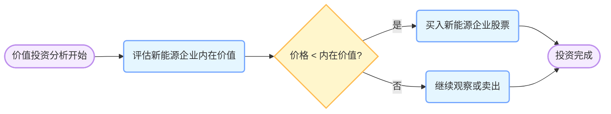

# 价值投资中的新能源革命分析

> 关键词：价值投资、新能源革命、能源转型、投资策略、市场趋势

> 摘要：本文深入探讨了价值投资视角下的新能源革命。详细介绍了新能源革命的背景、核心概念，阐述了相关的算法原理、数学模型。通过实际项目案例分析了新能源领域价值投资的具体操作和代码实现。同时探讨了新能源革命在实际中的应用场景，推荐了相关的学习资源、开发工具和论文著作。最后对新能源革命在价值投资领域的未来发展趋势与挑战进行了总结，并解答了常见问题。

## 1. 背景介绍 
### 1.1 目的和范围
在全球能源转型的大背景下，新能源革命正以前所未有的速度推进。价值投资作为一种长期、稳健的投资策略，在新能源领域有着独特的应用和潜力。本文旨在从价值投资的角度出发，深入分析新能源革命带来的机遇和挑战，探讨如何在新能源领域运用价值投资策略实现资产的增值。研究范围涵盖了新能源的主要类型，如太阳能、风能、水能、生物能等，以及相关的产业链上下游企业。

### 1.2 预期读者
本文的预期读者包括对价值投资和新能源领域感兴趣的投资者、金融分析师、行业研究人员以及相关专业的学生。希望通过本文的分析，能为他们在新能源投资决策、行业研究等方面提供有价值的参考。

### 1.3 文档结构概述
本文将首先介绍新能源革命相关的核心概念及其联系，然后阐述在价值投资中分析新能源项目的核心算法原理和具体操作步骤。接着通过数学模型和公式对投资决策进行量化分析，并举例说明。之后给出项目实战案例，包括开发环境搭建、源代码实现和代码解读。再探讨新能源革命在实际中的应用场景，推荐相关的学习资源、开发工具和论文著作。最后总结新能源革命在价值投资领域的未来发展趋势与挑战，解答常见问题，并提供扩展阅读和参考资料。

### 1.4 术语表
#### 1.4.1 核心术语定义
- **价值投资**：一种基于对资产内在价值的分析，通过寻找价格低于内在价值的资产进行投资，以获取长期稳定收益的投资策略。
- **新能源革命**：指以太阳能、风能、水能、生物能等可再生能源逐步取代传统化石能源的能源变革过程。
- **内在价值**：资产在未来所能产生的现金流的现值总和。
- **折现率**：将未来现金流折算为现值时所使用的利率。

#### 1.4.2 相关概念解释
- **能源转型**：从传统的高碳、不可再生能源向低碳、可再生能源的转变过程，是新能源革命的重要体现。
- **产业链上下游**：新能源产业链包括上游的原材料供应、中游的设备制造和下游的能源生产与应用等环节。
- **投资组合**：投资者将资金分散投资于多种不同资产，以降低风险、提高收益的一种投资方式。

#### 1.4.3 缩略词列表
- **PV**：Photovoltaic，光伏发电
- **EV**：Electric Vehicle，电动汽车
- **ESG**：Environmental, Social and Governance，环境、社会和治理

## 2. 核心概念与联系 
### 核心概念原理
#### 价值投资原理
价值投资的核心在于对资产内在价值的评估。投资者通过分析公司的财务状况、行业前景、竞争优势等因素，估算出公司的内在价值。当股票价格低于内在价值时，认为该股票具有投资价值，从而进行买入操作；当股票价格高于内在价值时，则考虑卖出。其基本原理是基于市场的非理性波动，相信价格最终会回归价值。

#### 新能源革命原理
新能源革命的动力来自于对传统化石能源的可持续性担忧以及对环境保护的需求。新能源具有可再生、清洁的特点，能够减少碳排放，缓解能源危机。随着技术的不断进步和成本的降低，新能源在能源市场中的份额逐渐增加，逐渐取代传统能源。

### 架构的文本示意图
```plaintext
价值投资 - 内在价值评估 - 财务分析 - 行业分析 - 竞争优势分析
            |
            |
新能源革命 - 可再生能源 - 太阳能 - 风能 - 水能 - 生物能
            |
            |
投资决策 - 价值判断 - 价格与内在价值比较 - 买入/卖出决策
```

### Mermaid 流程图


## 3. 核心算法原理 & 具体操作步骤 
### 核心算法原理
在价值投资中，常用的评估新能源企业内在价值的方法是现金流折现法（DCF）。该方法的基本思想是将企业未来各期的自由现金流按照一定的折现率折现到当前时刻，得到企业的内在价值。

### Python 源代码实现
```python
import numpy as np

def dcf_valuation(free_cash_flows, discount_rate):
    """
    现金流折现法计算企业内在价值
    :param free_cash_flows: 未来各期的自由现金流列表
    :param discount_rate: 折现率
    :return: 企业内在价值
    """
    n = len(free_cash_flows)
    present_values = []
    for i in range(n):
        pv = free_cash_flows[i] / ((1 + discount_rate) ** (i + 1))
        present_values.append(pv)
    intrinsic_value = np.sum(present_values)
    return intrinsic_value

# 示例数据
free_cash_flows = [100, 120, 150, 180, 200]  # 未来 5 年的自由现金流
discount_rate = 0.1  # 折现率为 10%

intrinsic_value = dcf_valuation(free_cash_flows, discount_rate)
print(f"企业内在价值: {intrinsic_value}")
```

### 具体操作步骤
1. **预测自由现金流**：分析新能源企业的业务模式、市场前景、财务状况等因素，预测未来各期的自由现金流。这需要对企业的收入、成本、资本支出等进行详细的分析和预测。
2. **确定折现率**：折现率反映了投资者对投资风险的要求。通常可以使用资本资产定价模型（CAPM）来确定折现率，考虑无风险利率、市场风险溢价和企业的贝塔系数等因素。
3. **计算内在价值**：将预测的自由现金流按照确定的折现率折现到当前时刻，求和得到企业的内在价值。
4. **比较价格与内在价值**：将计算得到的内在价值与企业当前的股票价格进行比较。如果股票价格低于内在价值，认为该股票具有投资价值；反之，则不具有投资价值。

## 4. 数学模型和公式 & 详细讲解 & 举例说明 
### 现金流折现法公式
现金流折现法的基本公式为：
$$
V = \sum_{t=1}^{n} \frac{FCF_t}{(1 + r)^t}
$$
其中，$V$ 表示企业的内在价值，$FCF_t$ 表示第 $t$ 期的自由现金流，$r$ 表示折现率，$n$ 表示预测的期数。

### 详细讲解
- **自由现金流（FCF）**：是指企业在满足了所有运营成本和资本支出后剩余的现金流量。它反映了企业实际可用于分配给股东或进行再投资的现金数量。计算自由现金流通常需要从企业的净利润出发，加上非现金支出（如折旧、摊销等），减去营运资本的增加和资本支出。
- **折现率（r）**：是投资者对投资所要求的回报率，它考虑了资金的时间价值和投资的风险。折现率越高，未来现金流的现值越低，企业的内在价值也就越低。
- **期数（n）**：是指预测自由现金流的时间范围。通常可以根据企业的发展阶段和行业特点来确定预测期数，一般为 5 - 10 年。

### 举例说明
假设一家新能源企业未来 5 年的自由现金流分别为 100 万元、120 万元、150 万元、180 万元和 200 万元，折现率为 10%。根据现金流折现法公式计算企业的内在价值：
$$
\begin{align*}
V &= \frac{100}{(1 + 0.1)^1} + \frac{120}{(1 + 0.1)^2} + \frac{150}{(1 + 0.1)^3} + \frac{180}{(1 + 0.1)^4} + \frac{200}{(1 + 0.1)^5}\\
&= \frac{100}{1.1} + \frac{120}{1.21} + \frac{150}{1.331} + \frac{180}{1.4641} + \frac{200}{1.61051}\\
&\approx 90.91 + 99.17 + 112.69 + 122.94 + 124.18\\
&= 549.89 \text{（万元）}
\end{align*}
$$
如果该企业当前的市场价值低于 549.89 万元，则从价值投资的角度来看，该企业具有投资价值。

## 5. 项目实战：代码实际案例和详细解释说明 
### 5.1  开发环境搭建
#### 安装 Python
首先需要安装 Python 编程语言。可以从 Python 官方网站（https://www.python.org/downloads/）下载适合自己操作系统的 Python 安装包，并按照安装向导进行安装。

#### 安装必要的库
在命令行中使用以下命令安装所需的库：
```sh
pip install numpy pandas matplotlib
```
- `numpy`：用于数值计算。
- `pandas`：用于数据处理和分析。
- `matplotlib`：用于数据可视化。

### 5.2  源代码详细实现和代码解读
```python
import numpy as np
import pandas as pd
import matplotlib.pyplot as plt

# 模拟新能源企业的财务数据
years = np.arange(2023, 2028)
free_cash_flows = np.array([100, 120, 150, 180, 200])
discount_rate = 0.1

# 计算各年的现值
present_values = []
for i in range(len(free_cash_flows)):
    pv = free_cash_flows[i] / ((1 + discount_rate) ** (i + 1))
    present_values.append(pv)

# 计算内在价值
intrinsic_value = np.sum(present_values)

# 创建 DataFrame 存储数据
data = {
    'Year': years,
    'Free Cash Flow': free_cash_flows,
    'Present Value': present_values
}
df = pd.DataFrame(data)

# 打印结果
print(df)
print(f"企业内在价值: {intrinsic_value}")

# 绘制自由现金流和现值的折线图
plt.figure(figsize=(10, 6))
plt.plot(df['Year'], df['Free Cash Flow'], label='Free Cash Flow')
plt.plot(df['Year'], df['Present Value'], label='Present Value')
plt.xlabel('Year')
plt.ylabel('Amount')
plt.title('Free Cash Flow and Present Value over Time')
plt.legend()
plt.grid(True)
plt.show()
```

### 代码解读与分析
1. **数据模拟**：使用 `numpy` 数组模拟新能源企业未来 5 年的自由现金流和折现率。
2. **现值计算**：通过循环计算各年自由现金流的现值，并将其存储在 `present_values` 列表中。
3. **内在价值计算**：使用 `numpy` 的 `sum` 函数计算所有现值的总和，得到企业的内在价值。
4. **数据存储**：使用 `pandas` 的 `DataFrame` 存储各年的年份、自由现金流和现值，方便后续的数据处理和展示。
5. **结果打印**：打印 `DataFrame` 和企业的内在价值。
6. **数据可视化**：使用 `matplotlib` 绘制自由现金流和现值随时间变化的折线图，直观地展示数据的变化趋势。

## 6. 实际应用场景 
### 新能源发电项目投资
在新能源发电项目中，如太阳能电站、风力发电场等，价值投资可以帮助投资者评估项目的可行性和潜在收益。通过分析项目的建设成本、运营成本、发电效率、电价政策等因素，预测项目未来的自由现金流，进而计算项目的内在价值。如果项目的内在价值高于投资成本，则该项目具有投资价值。

### 新能源汽车产业链投资
新能源汽车产业链包括电池制造、整车生产、充电桩建设等环节。价值投资者可以通过分析产业链上各企业的财务状况、技术实力、市场份额等因素，评估企业的内在价值。例如，对于电池制造企业，可以关注其电池技术的先进性、生产成本、产能规划等；对于整车生产企业，可以关注其品牌影响力、车型竞争力、销售渠道等。

### 能源转型投资基金
能源转型投资基金通过投资新能源领域的企业和项目，实现资产的增值。基金经理可以运用价值投资策略，筛选出具有投资价值的新能源企业和项目，构建投资组合。同时，通过对投资组合的动态管理，及时调整投资策略，以适应市场的变化。

## 7. 工具和资源推荐
### 7.1 学习资源推荐
#### 7.1.1 书籍推荐
- 《聪明的投资者》（The Intelligent Investor）：本杰明·格雷厄姆（Benjamin Graham）的经典著作，介绍了价值投资的基本理念和方法。
- 《巴菲特致股东的信》（Letters to Shareholders of Berkshire Hathaway）：沃伦·巴菲特（Warren Buffett）每年写给股东的信，包含了他的投资哲学和经验。
- 《新能源技术与应用》：系统介绍了新能源的种类、技术原理和应用场景，适合对新能源领域感兴趣的读者。

#### 7.1.2 在线课程
- Coursera 上的“投资学原理”（Principles of Investment）课程：由知名大学教授授课，涵盖了价值投资、资产定价等内容。
- edX 上的“新能源与可持续发展”（Renewable Energy and Sustainable Development）课程：介绍了新能源的发展现状和未来趋势，以及在可持续发展中的作用。

#### 7.1.3 技术博客和网站
- Seeking Alpha：提供了大量的金融分析文章和投资建议，包括对新能源企业的分析。
- CleanTechnica：专注于清洁能源领域的新闻和分析，及时报道新能源行业的最新动态。

### 7.2 开发工具框架推荐
#### 7.2.1 IDE和编辑器
- PyCharm：功能强大的 Python 集成开发环境，提供了代码编辑、调试、版本控制等功能。
- Jupyter Notebook：交互式的编程环境，适合进行数据分析和可视化，方便快速验证代码和展示结果。

#### 7.2.2 调试和性能分析工具
- pdb：Python 自带的调试工具，可以帮助开发者定位代码中的错误。
- cProfile：Python 的性能分析工具，可以分析代码的运行时间和函数调用情况，帮助优化代码性能。

#### 7.2.3 相关框架和库
- scikit-learn：用于机器学习的 Python 库，提供了各种机器学习算法和工具，可用于新能源数据的分析和预测。
- TensorFlow：开源的深度学习框架，可用于构建和训练深度学习模型，解决新能源领域的复杂问题。

### 7.3 相关论文著作推荐
#### 7.3.1 经典论文
- “The Capital Asset Pricing Model: Theory and Evidence”：介绍了资本资产定价模型（CAPM）的理论和实证研究，对确定折现率具有重要的参考价值。
- “Valuation of Renewable Energy Projects under Uncertainty”：研究了在不确定性条件下新能源项目的估值方法。

#### 7.3.2 最新研究成果
- 关注《Renewable Energy》、《Energy Economics》等期刊上的最新研究论文，了解新能源领域的前沿研究成果。

#### 7.3.3 应用案例分析
- 《新能源投资案例集》：收集了多个新能源投资项目的案例，分析了项目的投资决策过程和收益情况。

## 8. 总结：未来发展趋势与挑战
### 未来发展趋势
- **技术创新推动成本下降**：随着新能源技术的不断创新，如太阳能电池效率的提高、风力发电机技术的改进等，新能源的生产成本将继续下降，进一步提高其市场竞争力。
- **能源存储技术的突破**：能源存储技术是新能源大规模应用的关键。未来，随着电池技术、储能系统的不断发展，能源存储成本将降低，解决新能源间歇性和波动性的问题，促进新能源的大规模消纳。
- **政策支持持续加强**：全球各国政府对新能源的支持力度将继续加大，出台更多的优惠政策和补贴措施，推动新能源市场的发展。
- **产业融合发展**：新能源与其他产业的融合将越来越深入，如新能源汽车与智能交通、能源互联网的融合，将创造出更多的商业机会和发展空间。

### 挑战
- **市场波动风险**：新能源市场受政策、技术、市场需求等多种因素的影响，市场波动较大。投资者需要具备较强的风险承受能力和风险管理能力。
- **技术迭代风险**：新能源技术发展迅速，企业如果不能及时跟上技术迭代的步伐，可能会面临被市场淘汰的风险。
- **政策不确定性**：虽然政府对新能源的支持力度较大，但政策的变化也可能对新能源市场产生重大影响。投资者需要密切关注政策的变化，及时调整投资策略。
- **竞争加剧**：随着新能源市场的不断发展，越来越多的企业进入该领域，市场竞争将日益激烈。企业需要不断提高自身的核心竞争力，才能在市场中立足。

## 9. 附录：常见问题与解答
### 问题 1：如何准确预测新能源企业的自由现金流？
答：预测新能源企业的自由现金流需要综合考虑多个因素。首先，要对企业的业务模式进行深入分析，了解其收入来源和成本结构。其次，关注行业的发展趋势和市场需求，预测企业未来的市场份额和销售收入。此外，还需要考虑企业的资本支出计划、营运资本需求等因素。可以参考企业的历史财务数据、行业研究报告、专家意见等，结合自己的分析和判断，进行合理的预测。

### 问题 2：折现率的确定有哪些方法？
答：常见的确定折现率的方法有以下几种：
- **资本资产定价模型（CAPM）**：$r = R_f + \beta \times (R_m - R_f)$，其中 $r$ 表示折现率，$R_f$ 表示无风险利率，$\beta$ 表示企业的贝塔系数，$R_m$ 表示市场收益率。
- **加权平均资本成本（WACC）**：考虑企业的债务成本和股权成本，根据企业的资本结构进行加权平均计算。
- **行业平均收益率**：参考同行业其他企业的平均收益率来确定折现率。

### 问题 3：价值投资在新能源领域的局限性有哪些？
答：价值投资在新能源领域的局限性主要包括：
- **技术不确定性**：新能源技术发展迅速，难以准确评估企业的技术前景和竞争力，可能导致对企业内在价值的评估出现偏差。
- **市场变化快**：新能源市场受政策、市场需求等因素的影响较大，市场变化迅速，价值投资强调长期投资，可能无法及时适应市场的变化。
- **新兴企业估值困难**：新能源领域有很多新兴企业，这些企业可能还处于亏损阶段，缺乏历史财务数据，难以使用传统的价值投资方法进行估值。

## 10. 扩展阅读 & 参考资料
### 扩展阅读
- 《能源转型：从化石能源到可再生能源》
- 《新能源金融：理论与实践》
- 《可持续投资：ESG 视角下的价值创造》

### 参考资料
- 相关企业的年报和财务报表
- 行业研究机构发布的研究报告
- 政府部门发布的能源政策和统计数据

作者：AI天才研究院/AI Genius Institute & 禅与计算机程序设计艺术 /Zen And The Art of Computer Programming