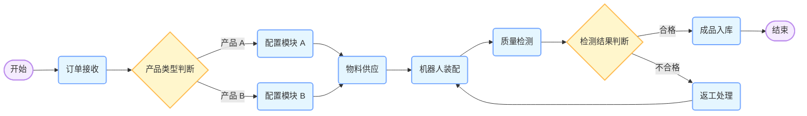

# 价值投资中的智能制造柔性装配线分析

> 关键词：价值投资、智能制造、柔性装配线、投资分析、制造业升级

> 摘要：本文聚焦于价值投资视角下的智能制造柔性装配线。首先介绍了相关背景，包括目的、预期读者等内容。接着阐述了智能制造柔性装配线的核心概念与联系，详细讲解了其核心算法原理及具体操作步骤，并通过数学模型和公式进行了理论支撑。通过项目实战案例，展示了柔性装配线在实际开发中的环境搭建、代码实现与解读。同时探讨了其实际应用场景，推荐了相关的学习资源、开发工具框架以及论文著作。最后总结了未来发展趋势与挑战，还提供了常见问题解答及扩展阅读参考资料，旨在为价值投资者和制造业从业者深入理解和运用智能制造柔性装配线提供全面而深入的指导。

## 1. 背景介绍 
### 1.1 目的和范围
在当今全球制造业竞争日益激烈的背景下，智能制造成为了推动产业升级的关键力量。价值投资作为一种长期、稳健的投资策略，关注的是企业的内在价值和长期发展潜力。智能制造柔性装配线作为智能制造的核心组成部分，其高效、灵活的特点能够显著提升企业的生产效率和产品质量，进而增强企业的竞争力和盈利能力。

本文的目的在于从价值投资的角度出发，深入分析智能制造柔性装配线的技术原理、应用场景、投资价值以及未来发展趋势。通过对相关理论和实际案例的研究，为价值投资者提供决策依据，同时也为制造业企业在引入和应用柔性装配线提供技术参考。

本文的范围涵盖了智能制造柔性装配线的各个方面，包括核心概念、算法原理、数学模型、项目实战、应用场景等。同时，还将探讨与价值投资相关的因素，如投资回报率、风险评估等。

### 1.2 预期读者
本文的预期读者主要包括以下几类人群：
1. **价值投资者**：希望了解智能制造领域的投资机会，特别是柔性装配线相关项目的投资价值和风险。
2. **制造业企业管理者**：对引入智能制造技术，提升企业生产效率和竞争力感兴趣，关注柔性装配线的技术原理和应用案例。
3. **技术研发人员**：从事智能制造、自动化控制等领域的研发工作，希望深入了解柔性装配线的核心算法和技术细节。
4. **高校师生**：学习智能制造、工业工程等相关专业，对柔性装配线的理论和实践有研究需求。

### 1.3 文档结构概述
本文将按照以下结构进行组织：
1. **背景介绍**：阐述本文的目的、预期读者、文档结构概述和术语表。
2. **核心概念与联系**：介绍智能制造柔性装配线的核心概念、原理和架构，并通过示意图和流程图进行说明。
3. **核心算法原理 & 具体操作步骤**：详细讲解柔性装配线的核心算法原理，并使用 Python 源代码进行具体操作步骤的阐述。
4. **数学模型和公式 & 详细讲解 & 举例说明**：建立柔性装配线的数学模型，给出相关公式，并通过具体例子进行详细讲解。
5. **项目实战：代码实际案例和详细解释说明**：通过一个实际项目案例，展示柔性装配线的开发环境搭建、源代码实现和代码解读。
6. **实际应用场景**：探讨智能制造柔性装配线在不同行业的实际应用场景。
7. **工具和资源推荐**：推荐与柔性装配线相关的学习资源、开发工具框架和论文著作。
8. **总结：未来发展趋势与挑战**：总结智能制造柔性装配线的未来发展趋势和面临的挑战。
9. **附录：常见问题与解答**：解答读者在阅读本文过程中可能遇到的常见问题。
10. **扩展阅读 & 参考资料**：提供进一步深入学习和研究的扩展阅读资料和参考文献。

### 1.4 术语表
#### 1.4.1 核心术语定义
1. **智能制造**：一种基于新一代信息技术，贯穿于设计、生产、管理、服务等制造活动各个环节，具有信息深度自感知、智慧优化自决策、精准控制自执行等功能的先进制造过程、系统与模式的总称。
2. **柔性装配线**：一种能够根据不同产品的装配要求，快速调整装配工艺和设备布局，实现多种产品混线生产的自动化装配系统。
3. **价值投资**：一种通过对企业的基本面进行分析，寻找被低估的股票或项目，长期持有以获取价值回归和企业成长收益的投资策略。
4. **工业物联网（IIoT）**：将工业领域的设备、传感器、机器等通过网络连接起来，实现数据的采集、传输和分析，以提高生产效率和质量的技术。
5. **机器人视觉**：利用计算机视觉技术，使机器人能够感知和识别周围环境中的物体和特征，从而实现自动化操作的技术。

#### 1.4.2 相关概念解释
1. **自动化装配**：使用自动化设备和技术，按照预定的工艺和流程，将零部件组装成完整产品的过程。
2. **模块化设计**：将产品或系统分解为多个独立的模块，每个模块具有特定的功能和接口，通过组合不同的模块可以实现不同的产品或系统配置。
3. **实时数据采集**：在生产过程中，实时获取设备状态、生产数据等信息，以便及时进行监控和决策。
4. **智能调度算法**：根据生产任务的优先级、设备状态、物料供应等因素，自动优化生产调度计划，提高生产效率的算法。

#### 1.4.3 缩略词列表
1. **PLC**：可编程逻辑控制器（Programmable Logic Controller）
2. **AGV**：自动导引车（Automated Guided Vehicle）
3. **CNC**：计算机数字控制（Computer Numerical Control）
4. **AI**：人工智能（Artificial Intelligence）
5. **ML**：机器学习（Machine Learning）

## 2. 核心概念与联系 

### 核心概念原理
智能制造柔性装配线是智能制造的重要组成部分，它融合了自动化技术、信息技术、人工智能等多种先进技术，旨在实现高效、灵活、智能化的产品装配过程。

其核心原理基于以下几个方面：
1. **模块化设计**：将装配线划分为多个独立的模块，每个模块负责完成特定的装配任务。这些模块可以根据不同的产品需求进行快速组合和调整，实现生产线的柔性化。
2. **工业物联网**：通过传感器和网络技术，将装配线上的设备、物料和人员连接起来，实现数据的实时采集和传输。这些数据可以用于设备状态监测、生产过程优化和质量控制等方面。
3. **机器人技术**：引入工业机器人进行装配操作，机器人具有高精度、高速度和灵活性的特点，能够适应不同产品的装配要求。机器人可以通过编程实现自动化操作，提高装配效率和质量。
4. **智能调度算法**：根据生产任务的优先级、设备状态和物料供应情况，自动生成最优的生产调度计划。智能调度算法可以实时调整生产计划，以应对生产过程中的突发情况，提高生产线的整体效率。

### 架构的文本示意图
智能制造柔性装配线的架构可以分为以下几个层次：
1. **设备层**：包括各种装配设备，如机器人、PLC、AGV、CNC 机床等。这些设备负责完成具体的装配任务，并通过传感器采集设备状态和生产数据。
2. **控制层**：主要由 PLC 和工业计算机组成，负责对设备层的设备进行控制和协调。控制层接收来自管理层的生产指令，并将其转化为设备的具体操作指令。
3. **管理层**：通过工业物联网平台，对生产过程进行实时监控和管理。管理层可以根据生产数据进行分析和决策，优化生产调度计划，提高生产效率和质量。
4. **决策层**：基于大数据分析和人工智能技术，对企业的生产战略和投资决策进行支持。决策层可以根据市场需求和企业的发展目标，制定长期的生产规划和投资计划。

### Mermaid 流程图


该流程图展示了智能制造柔性装配线的基本生产流程。首先，系统接收订单，然后根据产品类型配置相应的装配模块。接着，进行物料供应和机器人装配操作，装配完成后进行质量检测。如果检测合格，产品入库；如果不合格，则进行返工处理，直到产品合格为止。

## 3. 核心算法原理 & 具体操作步骤 

### 核心算法原理
智能制造柔性装配线中涉及到多个核心算法，以下是几个重要算法的原理介绍：

#### 智能调度算法
智能调度算法的目标是根据生产任务的优先级、设备状态和物料供应情况，自动生成最优的生产调度计划。常见的智能调度算法包括遗传算法、模拟退火算法和粒子群算法等。

以遗传算法为例，其基本原理是模拟生物进化过程中的遗传和变异机制，通过不断迭代优化，寻找最优解。具体步骤如下：
1. **编码**：将生产调度问题的解表示为染色体，每个染色体由多个基因组成，每个基因代表一个生产任务的调度安排。
2. **初始化种群**：随机生成一组染色体作为初始种群。
3. **适应度评估**：根据生产调度的目标函数，计算每个染色体的适应度值。适应度值越高，表示该染色体对应的调度方案越优。
4. **选择操作**：根据染色体的适应度值，选择一部分染色体作为父代，用于繁殖下一代。
5. **交叉操作**：对选择的父代染色体进行交叉操作，生成新的子代染色体。
6. **变异操作**：对子代染色体进行变异操作，引入新的基因，增加种群的多样性。
7. **更新种群**：用子代染色体替换父代染色体，形成新的种群。
8. **终止条件判断**：如果满足终止条件（如达到最大迭代次数或适应度值不再提高），则停止迭代，输出最优解；否则，返回步骤 3。

#### 路径规划算法
路径规划算法用于为 AGV 等移动设备规划最优的行驶路径，以提高物料运输效率。常见的路径规划算法包括 Dijkstra 算法、A* 算法和蚁群算法等。

以 A* 算法为例，其基本原理是在搜索过程中，综合考虑从起点到当前节点的实际代价和从当前节点到目标节点的估计代价，选择代价最小的节点进行扩展。具体步骤如下：
1. **初始化**：将起点加入开放列表，开放列表用于存储待扩展的节点。
2. **选择节点**：从开放列表中选择代价最小的节点作为当前节点。
3. **扩展节点**：对当前节点的相邻节点进行扩展，计算每个相邻节点的代价，并将其加入开放列表。
4. **更新代价**：如果相邻节点已经在开放列表中，且新的代价更小，则更新其代价和父节点。
5. **判断目标**：如果当前节点是目标节点，则搜索结束，根据父节点回溯生成路径；否则，返回步骤 2。
6. **移除节点**：将当前节点从开放列表中移除，加入关闭列表，关闭列表用于存储已经扩展过的节点。

### 具体操作步骤（Python 源代码）

#### 智能调度算法（遗传算法）
```python
import random

# 定义生产任务数量和染色体长度
num_tasks = 5
chromosome_length = num_tasks

# 初始化种群
def initialize_population(population_size):
    population = []
    for _ in range(population_size):
        chromosome = list(range(num_tasks))
        random.shuffle(chromosome)
        population.append(chromosome)
    return population

# 适应度评估函数
def fitness_function(chromosome):
    # 这里简单假设适应度为任务顺序的总和
    return sum(chromosome)

# 选择操作
def selection(population):
    fitness_values = [fitness_function(chromosome) for chromosome in population]
    total_fitness = sum(fitness_values)
    probabilities = [fitness / total_fitness for fitness in fitness_values]
    selected_index = random.choices(range(len(population)), weights=probabilities)[0]
    return population[selected_index]

# 交叉操作
def crossover(parent1, parent2):
    crossover_point = random.randint(1, chromosome_length - 1)
    child1 = parent1[:crossover_point] + [gene for gene in parent2 if gene not in parent1[:crossover_point]]
    child2 = parent2[:crossover_point] + [gene for gene in parent1 if gene not in parent2[:crossover_point]]
    return child1, child2

# 变异操作
def mutation(chromosome):
    index1, index2 = random.sample(range(chromosome_length), 2)
    chromosome[index1], chromosome[index2] = chromosome[index2], chromosome[index1]
    return chromosome

# 遗传算法主函数
def genetic_algorithm(population_size, generations):
    population = initialize_population(population_size)
    for _ in range(generations):
        new_population = []
        for _ in range(population_size // 2):
            parent1 = selection(population)
            parent2 = selection(population)
            child1, child2 = crossover(parent1, parent2)
            child1 = mutation(child1)
            child2 = mutation(child2)
            new_population.extend([child1, child2])
        population = new_population
    best_chromosome = max(population, key=fitness_function)
    return best_chromosome

# 运行遗传算法
population_size = 100
generations = 200
best_schedule = genetic_algorithm(population_size, generations)
print("最优调度方案:", best_schedule)
```

#### 路径规划算法（A* 算法）
```python
import heapq

# 定义地图和节点类
grid = [
    [0, 0, 0, 0],
    [0, 1, 0, 0],
    [0, 0, 0, 0],
    [0, 0, 0, 0]
]
start = (0, 0)
goal = (3, 3)

class Node:
    def __init__(self, position, g=0, h=0, parent=None):
        self.position = position
        self.g = g
        self.h = h
        self.f = g + h
        self.parent = parent

    def __lt__(self, other):
        return self.f < other.f

# 启发式函数（曼哈顿距离）
def heuristic(a, b):
    return abs(a[0] - b[0]) + abs(a[1] - b[1])

# A* 算法主函数
def a_star(grid, start, goal):
    open_list = []
    closed_set = set()
    start_node = Node(start, 0, heuristic(start, goal))
    heapq.heappush(open_list, start_node)

    while open_list:
        current_node = heapq.heappop(open_list)
        if current_node.position == goal:
            path = []
            while current_node:
                path.append(current_node.position)
                current_node = current_node.parent
            return path[::-1]

        closed_set.add(current_node.position)
        neighbors = [(current_node.position[0] + dx, current_node.position[1] + dy) for dx, dy in [(0, 1), (0, -1), (1, 0), (-1, 0)]]
        for neighbor in neighbors:
            if 0 <= neighbor[0] < len(grid) and 0 <= neighbor[1] < len(grid[0]) and grid[neighbor[0]][neighbor[1]] == 0 and neighbor not in closed_set:
                tentative_g = current_node.g + 1
                neighbor_node = Node(neighbor, tentative_g, heuristic(neighbor, goal), current_node)
                for i, node in enumerate(open_list):
                    if node.position == neighbor and tentative_g < node.g:
                        open_list[i] = neighbor_node
                        heapq.heapify(open_list)
                        break
                else:
                    heapq.heappush(open_list, neighbor_node)

    return None

# 运行 A* 算法
path = a_star(grid, start, goal)
print("最优路径:", path)
```

## 4. 数学模型和公式 & 详细讲解 & 举例说明 

### 智能调度算法的数学模型
智能调度问题可以抽象为一个组合优化问题，目标是在满足一定约束条件下，最小化或最大化某个目标函数。以生产调度为例，假设存在 $n$ 个生产任务 $T = \{T_1, T_2, \cdots, T_n\}$，每个任务有一个处理时间 $p_i$ 和一个截止时间 $d_i$，目标是找到一个任务的调度顺序 $\sigma = (\sigma_1, \sigma_2, \cdots, \sigma_n)$，使得总延迟时间最小。

#### 目标函数
总延迟时间可以表示为：
$$
Z(\sigma) = \sum_{i = 1}^{n} \max\{0, C_{\sigma_i} - d_{\sigma_i}\}
$$
其中，$C_{\sigma_i}$ 表示任务 $\sigma_i$ 的完成时间。

#### 约束条件
1. 每个任务只能在其开始时间之后开始处理。
2. 同一时间内，每个设备只能处理一个任务。
3. 任务的处理顺序必须满足工艺要求。

### 路径规划算法的数学模型
路径规划问题可以看作是在一个图 $G = (V, E)$ 中寻找从起点 $s$ 到目标点 $t$ 的最短路径。其中，$V$ 是图的节点集合，$E$ 是图的边集合，每条边 $(u, v) \in E$ 有一个权重 $w(u, v)$ 表示从节点 $u$ 到节点 $v$ 的代价。

#### 目标函数
最短路径的目标是最小化从起点到目标点的总代价：
$$
\min \sum_{(u, v) \in P} w(u, v)
$$
其中，$P$ 是从起点到目标点的路径。

#### 约束条件
1. 路径必须从起点开始，到目标点结束。
2. 路径中的每个节点和边必须在图中存在。

### 举例说明
#### 智能调度算法举例
假设有 3 个生产任务，其处理时间和截止时间如下表所示：

| 任务编号 | 处理时间 $p_i$ | 截止时间 $d_i$ |
| ---- | ---- | ---- |
| 1 | 2 | 5 |
| 2 | 3 | 6 |
| 3 | 1 | 3 |

假设初始的调度顺序为 $(1, 2, 3)$，则任务 1 的完成时间 $C_1 = 2$，延迟时间 $L_1 = \max\{0, 2 - 5\} = 0$；任务 2 的完成时间 $C_2 = 2 + 3 = 5$，延迟时间 $L_2 = \max\{0, 5 - 6\} = 0$；任务 3 的完成时间 $C_3 = 5 + 1 = 6$，延迟时间 $L_3 = \max\{0, 6 - 3\} = 3$。总延迟时间 $Z = 0 + 0 + 3 = 3$。

通过遗传算法等智能调度算法，可以找到更优的调度顺序，如 $(3, 1, 2)$，此时任务 3 的完成时间 $C_3 = 1$，延迟时间 $L_3 = \max\{0, 1 - 3\} = 0$；任务 1 的完成时间 $C_1 = 1 + 2 = 3$，延迟时间 $L_1 = \max\{0, 3 - 5\} = 0$；任务 2 的完成时间 $C_2 = 3 + 3 = 6$，延迟时间 $L_2 = \max\{0, 6 - 6\} = 0$。总延迟时间 $Z = 0 + 0 + 0 = 0$，明显优于初始调度顺序。

#### 路径规划算法举例
考虑一个简单的 4x4 网格地图，其中 `0` 表示可通行区域，`1` 表示障碍物，起点为 $(0, 0)$，目标点为 $(3, 3)$。

使用 A* 算法进行路径规划，首先将起点加入开放列表，然后不断扩展节点，计算每个节点的代价。最终找到的最优路径可能为 `[(0, 0), (0, 1), (0, 2), (0, 3), (1, 3), (2, 3), (3, 3)]`，总代价为 6。

## 5. 项目实战：代码实际案例和详细解释说明 

### 5.1  开发环境搭建
为了实现一个简单的智能制造柔性装配线模拟系统，我们需要搭建以下开发环境：

#### 硬件环境
1. **计算机**：用于运行开发代码和模拟系统。建议配置为 Intel Core i5 及以上处理器，8GB 及以上内存。
2. **开发板（可选）**：如果需要进行实际的硬件控制，可以选择一款适合的开发板，如 Arduino、Raspberry Pi 等。

#### 软件环境
1. **操作系统**：推荐使用 Windows 10 或 Ubuntu 20.04 等主流操作系统。
2. **Python 环境**：安装 Python 3.7 及以上版本，并配置好相应的开发环境。可以使用 Anaconda 来管理 Python 环境。
3. **开发工具**：推荐使用 PyCharm 作为 Python 开发工具，它提供了丰富的代码编辑、调试和运行功能。
4. **相关库**：安装必要的 Python 库，如 `numpy`、`matplotlib` 等，用于数据处理和可视化。可以使用 `pip` 进行安装：
```sh
pip install numpy matplotlib
```

### 5.2  源代码详细实现和代码解读
以下是一个简单的智能制造柔性装配线模拟系统的 Python 代码实现：

```python
import random
import time

# 定义装配任务类
class AssemblyTask:
    def __init__(self, task_id, processing_time):
        self.task_id = task_id
        self.processing_time = processing_time

    def __str__(self):
        return f"Task {self.task_id} (Processing Time: {self.processing_time})"

# 定义装配站类
class AssemblyStation:
    def __init__(self, station_id):
        self.station_id = station_id
        self.current_task = None
        self.remaining_time = 0

    def assign_task(self, task):
        self.current_task = task
        self.remaining_time = task.processing_time
        print(f"Station {self.station_id} assigned Task {task.task_id}")

    def process_task(self):
        if self.current_task:
            self.remaining_time -= 1
            if self.remaining_time == 0:
                print(f"Station {self.station_id} completed Task {self.current_task.task_id}")
                self.current_task = None

# 定义柔性装配线类
class FlexibleAssemblyLine:
    def __init__(self, num_stations):
        self.stations = [AssemblyStation(i) for i in range(num_stations)]
        self.task_queue = []

    def add_task(self, task):
        self.task_queue.append(task)
        print(f"Task {task.task_id} added to the queue")

    def schedule_tasks(self):
        for station in self.stations:
            if not station.current_task and self.task_queue:
                next_task = self.task_queue.pop(0)
                station.assign_task(next_task)

    def run(self):
        while self.task_queue or any(station.current_task for station in self.stations):
            self.schedule_tasks()
            for station in self.stations:
                station.process_task()
            time.sleep(1)

# 主程序
if __name__ == "__main__":
    # 创建柔性装配线，包含 3 个装配站
    assembly_line = FlexibleAssemblyLine(num_stations=3)

    # 生成一些装配任务
    tasks = [AssemblyTask(i, random.randint(1, 5)) for i in range(5)]

    # 将任务添加到装配线的任务队列中
    for task in tasks:
        assembly_line.add_task(task)

    # 运行装配线
    assembly_line.run()
```

### 5.3  代码解读与分析
#### 装配任务类（`AssemblyTask`）
该类表示一个装配任务，包含任务 ID 和处理时间两个属性。`__str__` 方法用于方便打印任务信息。

#### 装配站类（`AssemblyStation`）
该类表示一个装配站，包含装配站 ID、当前任务和剩余处理时间三个属性。`assign_task` 方法用于将一个任务分配给该装配站，并初始化剩余处理时间。`process_task` 方法用于处理当前任务，每调用一次，剩余处理时间减 1，当剩余处理时间为 0 时，表示任务完成。

#### 柔性装配线类（`FlexibleAssemblyLine`）
该类表示一个柔性装配线，包含多个装配站和一个任务队列。`add_task` 方法用于将一个任务添加到任务队列中。`schedule_tasks` 方法用于将任务队列中的任务分配给空闲的装配站。`run` 方法是装配线的主运行方法，它会不断调度任务并处理任务，直到任务队列和所有装配站都为空。

#### 主程序
在主程序中，我们首先创建了一个包含 3 个装配站的柔性装配线，然后生成了 5 个随机处理时间的装配任务，并将它们添加到任务队列中。最后，调用 `run` 方法运行装配线。

通过这个简单的模拟系统，我们可以看到柔性装配线是如何根据任务的情况动态分配任务到各个装配站，并完成装配任务的。

## 6. 实际应用场景 
智能制造柔性装配线在多个行业都有广泛的应用，以下是一些常见的应用场景：

### 汽车制造业
在汽车制造过程中，柔性装配线可以实现多种车型的混线生产。不同车型的零部件可能有所不同，通过模块化设计和智能调度算法，装配线可以快速调整装配工艺和设备布局，适应不同车型的生产需求。例如，大众汽车的一些工厂采用了柔性装配线，能够在同一条生产线上生产多种不同型号的汽车，大大提高了生产效率和灵活性。

### 电子制造业
电子产品更新换代快，产品种类繁多。柔性装配线可以满足电子制造业对多品种、小批量生产的需求。例如，手机生产过程中，需要对不同型号的手机进行组装，柔性装配线可以通过机器人视觉技术准确识别零部件，并进行快速、精确的装配。苹果公司的代工厂富士康就广泛应用了柔性装配线技术，提高了手机生产的效率和质量。

### 家电制造业
家电产品的种类和款式也非常丰富，柔性装配线可以帮助家电制造企业实现高效的生产。例如，冰箱、洗衣机等家电的装配过程中，柔性装配线可以根据不同产品的规格和要求，自动调整装配参数和流程。海尔等家电企业在智能制造升级过程中，引入了柔性装配线，提升了产品的生产效率和个性化定制能力。

### 医疗器械制造业
医疗器械的生产对精度和质量要求极高，同时产品种类也较多。柔性装配线可以确保医疗器械的装配过程准确、稳定，并且能够快速响应不同产品的生产需求。例如，在心脏起搏器、血糖仪等医疗器械的生产中，柔性装配线可以通过高精度的机器人和传感器，实现零部件的精确装配和质量检测。

### 航空航天制造业
航空航天产品通常具有高度的复杂性和定制化要求。柔性装配线可以满足航空航天制造业对复杂零部件装配和高精度生产的需求。例如，飞机发动机的装配过程中，需要对大量的零部件进行精确组装，柔性装配线可以通过智能调度和自动化操作，提高装配效率和质量，确保发动机的性能和安全性。

## 7. 工具和资源推荐
### 7.1 学习资源推荐
#### 7.1.1 书籍推荐
1. 《智能制造：数字化转型之道》：本书全面介绍了智能制造的概念、技术和应用，包括工业物联网、人工智能、大数据等方面的内容，对于理解智能制造柔性装配线的整体架构和技术原理有很大帮助。
2. 《机器人学导论》：详细介绍了机器人的运动学、动力学、控制等方面的知识，对于学习柔性装配线中机器人的应用和编程有重要参考价值。
3. 《生产与运作管理》：涵盖了生产计划、调度、质量管理等生产运作领域的核心知识，有助于深入理解柔性装配线的生产管理和优化方法。

#### 7.1.2 在线课程
1. Coursera 上的“智能制造基础”课程：由知名高校的教授授课，系统介绍了智能制造的基本概念、技术和应用案例，课程内容丰富，讲解详细。
2. edX 上的“工业物联网”课程：重点讲解了工业物联网的体系结构、通信技术和数据处理方法，对于理解柔性装配线中的工业物联网应用有很大帮助。
3. Udemy 上的“Python 机器学习实战”课程：通过实际案例介绍了 Python 在机器学习领域的应用，对于学习柔性装配线中的智能调度算法和数据分析有一定的参考价值。

#### 7.1.3 技术博客和网站
1. 中国智能制造网：提供了大量关于智能制造的新闻、技术文章和案例分析，是了解智能制造行业动态和技术发展的重要平台。
2. 机器之心：专注于人工智能和机器学习领域的技术博客，经常发布关于智能制造、机器人等方面的前沿技术和研究成果。
3. 开源中国：汇聚了众多开源项目和技术文章，对于学习柔性装配线中的开源软件和技术有很大帮助。

### 7.2 开发工具框架推荐
#### 7.2.1 IDE和编辑器
1. PyCharm：一款功能强大的 Python 集成开发环境，提供了代码编辑、调试、版本控制等丰富的功能，适合开发柔性装配线的模拟系统和控制程序。
2. Visual Studio Code：一款轻量级的代码编辑器，支持多种编程语言和插件扩展，具有良好的用户体验和开发效率。
3. Arduino IDE：如果需要进行硬件开发，Arduino IDE 是一个不错的选择，它提供了简单易用的开发环境，适合初学者和快速原型开发。

#### 7.2.2 调试和性能分析工具
1. Py-Spy：一个用于 Python 代码性能分析的工具，可以实时监测 Python 程序的 CPU 使用率和函数调用情况，帮助开发者找出性能瓶颈。
2. GDB：一款强大的调试工具，支持多种编程语言，可以用于调试 C、C++ 等语言编写的柔性装配线控制程序。
3. Wireshark：一款网络协议分析工具，可以用于分析工业物联网中的网络通信数据，帮助开发者排查网络故障和优化网络性能。

#### 7.2.3 相关框架和库
1. ROS（Robot Operating System）：一个开源的机器人操作系统，提供了丰富的机器人开发工具和库，包括机器人运动控制、传感器驱动、视觉处理等方面的功能，适合开发柔性装配线中的机器人应用。
2. TensorFlow：一个开源的机器学习框架，提供了丰富的深度学习模型和工具，可用于开发柔性装配线中的智能调度算法和质量检测模型。
3. NumPy 和 Pandas：Python 中用于数据处理和分析的常用库，可用于处理和分析柔性装配线中的生产数据。

### 7.3 相关论文著作推荐
#### 7.3.1 经典论文
1. "Flexible Manufacturing Systems: A Review"：该论文对柔性制造系统的概念、技术和应用进行了全面的综述，是研究柔性装配线的经典文献之一。
2. "Genetic Algorithms in Scheduling Problems"：介绍了遗传算法在调度问题中的应用，对于理解智能调度算法在柔性装配线中的应用有重要参考价值。
3. "Path Planning Algorithms for Mobile Robots"：详细介绍了移动机器人的路径规划算法，包括 Dijkstra 算法、A* 算法等，是学习柔性装配线中路径规划技术的重要论文。

#### 7.3.2 最新研究成果
1. "Deep Learning for Quality Inspection in Flexible Assembly Lines"：探讨了深度学习技术在柔性装配线质量检测中的应用，展示了深度学习在提高装配质量和效率方面的潜力。
2. "Multi-Agent Systems for Intelligent Scheduling in Flexible Manufacturing"：研究了多智能体系统在柔性制造智能调度中的应用，提出了一种新的调度算法和策略。
3. "Internet of Things Enabled Flexible Assembly Lines: A Review"：对基于工业物联网的柔性装配线进行了综述，分析了工业物联网在柔性装配线中的应用现状和发展趋势。

#### 7.3.3 应用案例分析
1. "Case Study: Implementation of a Flexible Assembly Line in an Automotive Manufacturing Plant"：通过一个汽车制造工厂的实际案例，介绍了柔性装配线的实施过程和效果评估。
2. "Application of Flexible Assembly Lines in the Electronics Industry: A Case Study"：以电子行业为例，分析了柔性装配线在提高生产效率和产品质量方面的应用案例。
3. "Case Study: Using AI in a Flexible Assembly Line for Medical Device Manufacturing"：介绍了人工智能技术在医疗器械制造柔性装配线中的应用案例，展示了 AI 在提高装配精度和质量控制方面的作用。

## 8. 总结：未来发展趋势与挑战
### 未来发展趋势
1. **智能化程度不断提高**：随着人工智能、机器学习等技术的不断发展，智能制造柔性装配线将更加智能化。智能调度算法将更加精准和高效，能够实时根据生产情况进行动态调整；机器人将具备更强的自主学习和决策能力，能够更好地适应复杂多变的生产环境。
2. **与工业物联网深度融合**：工业物联网将为柔性装配线提供更强大的数据支持和通信能力。通过实时采集和分析设备状态、生产数据等信息，实现对生产过程的全面监控和优化。同时，工业物联网还将促进供应链的协同和集成，提高整个产业链的效率。
3. **个性化定制生产成为主流**：消费者对产品的个性化需求越来越高，柔性装配线将能够更好地满足这一需求。通过模块化设计和快速换线技术，实现多品种、小批量的个性化定制生产，提高企业的市场竞争力。
4. **绿色制造理念的融入**：未来的柔性装配线将更加注重环保和可持续发展。采用节能设备和工艺，减少能源消耗和废弃物排放；优化生产流程，提高资源利用率，实现绿色制造的目标。

### 挑战
1. **技术集成难度大**：智能制造柔性装配线涉及到自动化技术、信息技术、人工智能等多个领域的技术，如何将这些技术进行有效的集成和协同工作是一个挑战。不同技术之间的兼容性、数据交互等问题需要得到妥善解决。
2. **数据安全与隐私问题**：随着工业物联网的发展，柔性装配线中的数据量将大幅增加，这些数据包含了企业的核心生产信息和客户的隐私数据。如何保障数据的安全和隐私，防止数据泄露和恶意攻击，是企业面临的重要问题。
3. **人才短缺**：智能制造柔性装配线的开发、维护和管理需要具备跨学科知识和技能的人才，如自动化工程师、软件工程师、数据分析师等。目前，这类复合型人才相对短缺，企业在人才招聘和培养方面面临一定的困难。
4. **投资成本高**：引入智能制造柔性装配线需要大量的资金投入，包括设备采购、系统集成、人员培训等方面的费用。对于一些中小企业来说，高昂的投资成本可能成为其实施智能制造升级的障碍。

## 9. 附录：常见问题与解答
### 问题 1：智能制造柔性装配线与传统装配线有什么区别？
答：传统装配线通常是为特定产品设计的，生产线布局和工艺相对固定，难以适应产品的变化。而智能制造柔性装配线具有高度的灵活性和可重构性，能够根据不同产品的需求快速调整装配工艺和设备布局，实现多种产品的混线生产。此外，智能制造柔性装配线还融入了自动化技术、信息技术和人工智能等先进技术，能够实现生产过程的智能化监控和优化。

### 问题 2：如何评估智能制造柔性装配线的投资价值？
答：评估智能制造柔性装配线的投资价值可以从以下几个方面考虑：
1. **生产效率提升**：计算引入柔性装配线后生产效率的提高程度，包括产量增加、生产周期缩短等方面。
2. **产品质量改善**：评估柔性装配线对产品质量的提升效果，如降低次品率、提高产品一致性等。
3. **成本降低**：分析引入柔性装配线后在人力成本、物料成本、能源成本等方面的降低情况。
4. **市场竞争力增强**：考虑柔性装配线对企业市场竞争力的提升作用，如能够快速响应市场需求、满足客户个性化定制要求等。
5. **投资回报率**：通过计算投资回报率（ROI）等指标，评估投资的经济效益。

### 问题 3：智能制造柔性装配线对操作人员的技能要求高吗？
答：智能制造柔性装配线对操作人员的技能要求相对较高。操作人员需要具备一定的自动化技术、信息技术和机械知识，能够熟练操作和维护装配线上的设备和系统。此外，由于柔性装配线的智能化程度较高，操作人员还需要具备一定的数据分析和问题解决能力，能够根据生产数据进行实时监控和决策。企业可以通过培训和技能提升计划，帮助操作人员适应新的工作要求。

### 问题 4：智能制造柔性装配线在实施过程中可能会遇到哪些问题？
答：在实施智能制造柔性装配线过程中，可能会遇到以下问题：
1. **技术难题**：如设备集成、通信协议不兼容、软件系统开发等方面的问题。
2. **人员抵触**：操作人员可能对新的技术和工作方式不适应，产生抵触情绪，影响项目的实施进度。
3. **数据管理问题**：如何有效地采集、存储和分析生产数据，确保数据的准确性和及时性，是一个挑战。
4. **维护和保养**：柔性装配线中的设备和系统较为复杂，需要专业的维护和保养人员，否则可能会影响设备的正常运行。
5. **项目管理**：实施智能制造柔性装配线是一个复杂的项目，需要进行有效的项目管理，包括进度控制、质量保证、成本管理等方面。

## 10. 扩展阅读 & 参考资料
### 扩展阅读
1. 《工业 4.0：即将来袭的第四次工业革命》：深入探讨了工业 4.0 的概念、技术和发展趋势，对于理解智能制造柔性装配线所处的时代背景和发展方向有很大帮助。
2. 《智能工厂：数字化转型的实践与案例》：通过大量的实际案例，介绍了智能工厂的建设和运营经验，其中包含了很多关于柔性装配线的应用案例和实践经验。
3. 《人工智能时代的制造业转型》：分析了人工智能技术在制造业中的应用和影响，对于学习柔性装配线中的智能算法和决策技术有一定的启发。

### 参考资料
1. 中国智能制造发展报告：由相关机构发布的关于中国智能制造发展的权威报告，包含了大量的行业数据和分析，为本文的研究提供了重要的参考依据。
2. 国际标准组织（ISO）发布的智能制造相关标准：如 ISO 15745、ISO 62264 等，这些标准规范了智能制造的术语、体系结构和接口等方面的内容，对于理解和实施智能制造柔性装配线具有重要的指导意义。
3. 相关学术期刊和会议论文：如《IEEE Transactions on Automation Science and Engineering》、《Journal of Manufacturing Systems》等，这些期刊和会议论文发表了大量关于智能制造、柔性装配线等领域的最新研究成果和技术进展。

作者：AI天才研究院/AI Genius Institute & 禅与计算机程序设计艺术 /Zen And The Art of Computer Programming