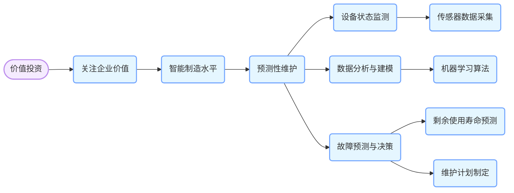

# 价值投资中的智能制造预测性维护分析

> 关键词：价值投资、智能制造、预测性维护、数据分析、机器学习

> 摘要：本文聚焦于价值投资领域中智能制造预测性维护这一关键话题。详细探讨了预测性维护的核心概念、算法原理、数学模型等内容，通过实际案例展示其在智能制造中的应用。分析了预测性维护在价值投资中的重要性，包括降低成本、提高生产效率等方面。同时，提供了学习该领域所需的工具和资源推荐，最后对未来发展趋势与挑战进行总结，并解答常见问题，为价值投资者和智能制造从业者提供全面而深入的参考。

## 1. 背景介绍 
### 1.1 目的和范围
本文章旨在深入剖析价值投资视角下的智能制造预测性维护。目的在于帮助价值投资者理解预测性维护在智能制造中的重要性及其对企业价值的影响，为投资决策提供技术层面的依据。同时，也为智能制造领域的从业者提供关于预测性维护的全面技术指导。范围涵盖预测性维护的核心概念、算法原理、数学模型、实际应用案例，以及相关的工具和资源推荐等方面。

### 1.2 预期读者
本文的预期读者主要包括两类人群。一类是价值投资者，他们希望通过了解智能制造中的预测性维护技术，评估企业的运营效率和潜在价值，从而做出更明智的投资决策。另一类是智能制造领域的工程师、技术人员和管理人员，他们可以从本文中获取预测性维护的技术细节和实践经验，提升企业的生产管理水平。

### 1.3 文档结构概述
本文将按照以下结构展开：首先介绍智能制造预测性维护的核心概念及其与价值投资的联系；接着详细阐述预测性维护的核心算法原理和具体操作步骤，并用 Python 代码进行示例；然后讲解相关的数学模型和公式，并举例说明；之后通过实际项目案例展示预测性维护的具体实现和代码解读；再介绍预测性维护的实际应用场景；提供学习该领域所需的工具和资源推荐；最后总结未来发展趋势与挑战，解答常见问题，并列出扩展阅读和参考资料。

### 1.4 术语表
#### 1.4.1 核心术语定义
- **价值投资**：一种投资策略，投资者通过分析企业的内在价值，寻找被低估的股票进行投资，以期在长期获得稳定的回报。
- **智能制造**：一种基于信息技术和先进制造技术的新型制造模式，通过智能化的设备、系统和管理方式，实现生产过程的自动化、柔性化和智能化。
- **预测性维护**：利用数据分析、机器学习等技术，对设备的运行状态进行实时监测和预测，提前发现设备潜在的故障风险，并在故障发生前进行维护，从而降低设备维修成本，提高生产效率。

#### 1.4.2 相关概念解释
- **设备状态监测**：通过安装在设备上的传感器，实时采集设备的运行数据，如温度、振动、压力等，以便及时了解设备的运行状态。
- **故障诊断**：根据设备状态监测数据，运用各种分析方法和算法，判断设备是否存在故障，并确定故障的类型和位置。
- **剩余使用寿命预测**：基于设备的历史运行数据和当前状态，预测设备在未来一段时间内还能正常运行的时间。

#### 1.4.3 缩略词列表
- **AI**：Artificial Intelligence，人工智能
- **ML**：Machine Learning，机器学习
- **IoT**：Internet of Things，物联网
- **RUL**：Remaining Useful Life，剩余使用寿命

## 2. 核心概念与联系 

### 2.1 智能制造与预测性维护的概念

智能制造是制造业发展的必然趋势，它融合了物联网、大数据、人工智能等先进技术，实现了生产过程的智能化管理。在智能制造系统中，设备是核心组成部分，设备的正常运行对于保证生产效率和产品质量至关重要。

预测性维护是智能制造中的一项关键技术，它通过对设备运行数据的实时监测和分析，提前预测设备可能出现的故障，并采取相应的维护措施。与传统的定期维护和事后维护相比，预测性维护具有明显的优势。定期维护可能会导致过度维护，增加维护成本；事后维护则会导致设备停机时间过长，影响生产效率。而预测性维护可以根据设备的实际运行状态进行维护，降低维护成本，提高设备的可靠性和可用性。

### 2.2 预测性维护与价值投资的联系

从价值投资的角度来看，预测性维护对企业的价值具有重要影响。一方面，预测性维护可以降低企业的生产成本。通过提前预测设备故障，避免设备突然停机，减少因停机造成的生产损失；同时，合理安排维护计划，避免过度维护，降低维护成本。另一方面，预测性维护可以提高企业的生产效率和产品质量。设备的稳定运行可以保证生产过程的连续性和稳定性，提高生产效率；同时，及时发现和解决设备故障，可以避免因设备问题导致的产品质量问题，提高产品的合格率和市场竞争力。因此，具备先进预测性维护技术的企业，其运营效率和盈利能力通常更高，企业的内在价值也更大，更值得价值投资者关注。

### 2.3 核心概念原理和架构的文本示意图

```plaintext
价值投资
|
|-- 关注企业价值
|   |
|   |-- 智能制造水平
|       |
|       |-- 预测性维护
|           |
|           |-- 设备状态监测
|           |   |
|           |   |-- 传感器数据采集
|           |
|           |-- 数据分析与建模
|           |   |
|           |   |-- 机器学习算法
|           |
|           |-- 故障预测与决策
|               |
|               |-- 剩余使用寿命预测
|               |-- 维护计划制定
```

### 2.4 Mermaid 流程图



## 3. 核心算法原理 & 具体操作步骤 

### 3.1 核心算法原理

在预测性维护中，常用的机器学习算法包括决策树、支持向量机、神经网络等。这里以神经网络中的长短期记忆网络（LSTM）为例，介绍其原理。

LSTM 是一种特殊的循环神经网络（RNN），它能够处理序列数据中的长期依赖关系。在预测性维护中，设备的运行数据通常是按时间顺序采集的，具有明显的序列特征，因此 LSTM 非常适合用于设备故障预测。

LSTM 单元包含三个门：输入门、遗忘门和输出门。输入门决定了当前输入信息中有多少可以进入细胞状态；遗忘门决定了细胞状态中哪些信息需要被遗忘；输出门决定了细胞状态中有多少信息可以输出到下一个时间步。

### 3.2 具体操作步骤

#### 步骤 1：数据采集
使用传感器采集设备的运行数据，如温度、振动、压力等。数据采集的频率应根据设备的运行特点和维护需求进行合理设置。

#### 步骤 2：数据预处理
对采集到的数据进行清洗、归一化等预处理操作，以提高数据的质量和可用性。清洗操作包括去除噪声数据、处理缺失值等；归一化操作将数据缩放到一个固定的范围内，如 [0, 1]。

#### 步骤 3：特征工程
从预处理后的数据中提取有用的特征，如均值、方差、最大值、最小值等。特征工程的目的是将原始数据转换为适合机器学习算法处理的特征向量。

#### 步骤 4：模型训练
使用预处理和特征工程后的数据训练 LSTM 模型。在训练过程中，需要将数据划分为训练集和验证集，通过验证集来评估模型的性能，并调整模型的参数。

#### 步骤 5：模型预测
使用训练好的模型对设备的未来运行状态进行预测，判断设备是否存在故障风险，并预测设备的剩余使用寿命。

### 3.3 Python 源代码实现

```python
import numpy as np
import pandas as pd
from sklearn.preprocessing import MinMaxScaler
from tensorflow.keras.models import Sequential
from tensorflow.keras.layers import LSTM, Dense

# 步骤 1：数据采集（这里假设已经有一个 CSV 文件存储了设备运行数据）
data = pd.read_csv('device_data.csv')

# 步骤 2：数据预处理
scaler = MinMaxScaler()
scaled_data = scaler.fit_transform(data)

# 步骤 3：特征工程
# 这里简单地将数据划分为输入特征和目标变量
sequence_length = 10
X = []
y = []
for i in range(len(scaled_data) - sequence_length):
    X.append(scaled_data[i:i+sequence_length])
    y.append(scaled_data[i+sequence_length])
X = np.array(X)
y = np.array(y)

# 步骤 4：模型训练
model = Sequential()
model.add(LSTM(50, return_sequences=True, input_shape=(sequence_length, X.shape[2])))
model.add(LSTM(50, return_sequences=False))
model.add(Dense(25))
model.add(Dense(X.shape[2]))

model.compile(optimizer='adam', loss='mean_squared_error')
model.fit(X, y, batch_size=32, epochs=50)

# 步骤 5：模型预测
last_sequence = scaled_data[-sequence_length:]
last_sequence = np.reshape(last_sequence, (1, sequence_length, X.shape[2]))
prediction = model.predict(last_sequence)
prediction = scaler.inverse_transform(prediction)
print("预测结果：", prediction)
```

## 4. 数学模型和公式 & 详细讲解 & 举例说明 

### 4.1 LSTM 单元的数学模型

LSTM 单元的数学模型可以用以下公式表示：

遗忘门：
$$
f_t = \sigma(W_f[h_{t-1}, x_t] + b_f)
$$

输入门：
$$
i_t = \sigma(W_i[h_{t-1}, x_t] + b_i)
$$

细胞状态更新：
$$
\tilde{C}_t = \tanh(W_C[h_{t-1}, x_t] + b_C)
$$
$$
C_t = f_t \odot C_{t-1} + i_t \odot \tilde{C}_t
$$

输出门：
$$
o_t = \sigma(W_o[h_{t-1}, x_t] + b_o)
$$
$$
h_t = o_t \odot \tanh(C_t)
$$

其中，$f_t$ 是遗忘门的输出，$i_t$ 是输入门的输出，$\tilde{C}_t$ 是候选细胞状态，$C_t$ 是当前细胞状态，$o_t$ 是输出门的输出，$h_t$ 是当前隐藏状态，$x_t$ 是当前输入，$h_{t-1}$ 是上一个时间步的隐藏状态，$W_f$、$W_i$、$W_C$、$W_o$ 是权重矩阵，$b_f$、$b_i$、$b_C$、$b_o$ 是偏置向量，$\sigma$ 是 sigmoid 函数，$\tanh$ 是双曲正切函数，$\odot$ 表示逐元素相乘。

### 4.2 详细讲解

- **遗忘门**：遗忘门决定了细胞状态中哪些信息需要被遗忘。它接收上一个时间步的隐藏状态 $h_{t-1}$ 和当前输入 $x_t$，通过 sigmoid 函数将其映射到 [0, 1] 区间，输出值越接近 1 表示保留该信息，越接近 0 表示遗忘该信息。
- **输入门**：输入门决定了当前输入信息中有多少可以进入细胞状态。它同样接收 $h_{t-1}$ 和 $x_t$，通过 sigmoid 函数输出一个 [0, 1] 区间的值。同时，通过双曲正切函数生成候选细胞状态 $\tilde{C}_t$。
- **细胞状态更新**：细胞状态 $C_t$ 的更新是通过遗忘门和输入门共同完成的。首先，将上一个时间步的细胞状态 $C_{t-1}$ 乘以遗忘门的输出 $f_t$，表示遗忘一部分信息；然后，将候选细胞状态 $\tilde{C}_t$ 乘以输入门的输出 $i_t$，表示加入一部分新信息。
- **输出门**：输出门决定了细胞状态中有多少信息可以输出到下一个时间步。它接收 $h_{t-1}$ 和 $x_t$，通过 sigmoid 函数输出一个 [0, 1] 区间的值，然后将其与细胞状态的双曲正切值相乘，得到当前隐藏状态 $h_t$。

### 4.3 举例说明

假设我们有一个简单的 LSTM 单元，输入维度为 3，隐藏维度为 2。在某个时间步 $t$，输入 $x_t = [0.1, 0.2, 0.3]$，上一个时间步的隐藏状态 $h_{t-1} = [0.4, 0.5]$。

首先，计算遗忘门的输出：
$$
W_f = \begin{bmatrix}
0.1 & 0.2 & 0.3 & 0.4 \\
0.5 & 0.6 & 0.7 & 0.8
\end{bmatrix}
$$
$$
b_f = \begin{bmatrix}
0.1 \\
0.2
\end{bmatrix}
$$
$$
[h_{t-1}, x_t] = \begin{bmatrix}
0.4 & 0.5 & 0.1 & 0.2 & 0.3
\end{bmatrix}
$$
$$
W_f[h_{t-1}, x_t]^T + b_f = \begin{bmatrix}
0.1\times0.4 + 0.2\times0.5 + 0.3\times0.1 + 0.4\times0.2 + 0.1 \\
0.5\times0.4 + 0.6\times0.5 + 0.7\times0.1 + 0.8\times0.2 + 0.2
\end{bmatrix} = \begin{bmatrix}
0.35 \\
0.83
\end{bmatrix}
$$
$$
f_t = \sigma\begin{bmatrix}
0.35 \\
0.83
\end{bmatrix} = \begin{bmatrix}
\frac{1}{1 + e^{-0.35}} \\
\frac{1}{1 + e^{-0.83}}
\end{bmatrix} \approx \begin{bmatrix}
0.587 \\
0.794
\end{bmatrix}
$$

按照同样的方法，可以计算输入门、细胞状态更新和输出门的输出，最终得到当前隐藏状态 $h_t$。

## 5. 项目实战：代码实际案例和详细解释说明 

### 5.1  开发环境搭建

#### 步骤 1：安装 Python
首先，需要安装 Python 环境。建议使用 Python 3.7 及以上版本，可以从 Python 官方网站（https://www.python.org/downloads/）下载并安装。

#### 步骤 2：安装必要的库
使用以下命令安装项目所需的库：
```bash
pip install numpy pandas scikit-learn tensorflow
```

#### 步骤 3：准备数据
假设我们有一个 CSV 文件 `device_data.csv`，其中包含设备的运行数据。数据文件的格式如下：
```plaintext
timestamp,temperature,pressure,vibration
2023-01-01 00:00:00,25.0,100.0,0.5
2023-01-01 00:01:00,25.1,100.1,0.6
...
```

### 5.2  源代码详细实现和代码解读

```python
import numpy as np
import pandas as pd
from sklearn.preprocessing import MinMaxScaler
from tensorflow.keras.models import Sequential
from tensorflow.keras.layers import LSTM, Dense

# 步骤 1：数据采集
data = pd.read_csv('device_data.csv')
# 去除时间戳列
data = data.drop('timestamp', axis=1)

# 步骤 2：数据预处理
scaler = MinMaxScaler()
scaled_data = scaler.fit_transform(data)

# 步骤 3：特征工程
sequence_length = 10
X = []
y = []
for i in range(len(scaled_data) - sequence_length):
    X.append(scaled_data[i:i+sequence_length])
    y.append(scaled_data[i+sequence_length])
X = np.array(X)
y = np.array(y)

# 步骤 4：模型训练
model = Sequential()
model.add(LSTM(50, return_sequences=True, input_shape=(sequence_length, X.shape[2])))
model.add(LSTM(50, return_sequences=False))
model.add(Dense(25))
model.add(Dense(X.shape[2]))

model.compile(optimizer='adam', loss='mean_squared_error')
model.fit(X, y, batch_size=32, epochs=50)

# 步骤 5：模型预测
last_sequence = scaled_data[-sequence_length:]
last_sequence = np.reshape(last_sequence, (1, sequence_length, X.shape[2]))
prediction = model.predict(last_sequence)
prediction = scaler.inverse_transform(prediction)
print("预测结果：", prediction)
```

### 代码解读：
- **数据采集**：使用 `pandas` 库的 `read_csv` 函数读取 CSV 文件中的设备运行数据，并去除时间戳列。
- **数据预处理**：使用 `MinMaxScaler` 对数据进行归一化处理，将数据缩放到 [0, 1] 区间。
- **特征工程**：将数据划分为输入特征和目标变量。每个输入特征是一个长度为 `sequence_length` 的序列，目标变量是该序列之后的下一个时间步的数据。
- **模型训练**：使用 `Sequential` 模型构建一个 LSTM 网络，包含两个 LSTM 层和两个全连接层。使用 `adam` 优化器和均方误差损失函数进行模型训练。
- **模型预测**：取最后一个长度为 `sequence_length` 的序列作为输入，使用训练好的模型进行预测，并将预测结果反归一化，得到实际的预测值。

### 5.3  代码解读与分析

#### 数据处理部分
数据采集和预处理是整个预测性维护流程的基础。通过读取 CSV 文件和去除时间戳列，我们得到了用于模型训练的原始数据。归一化处理可以将不同特征的数据统一到相同的尺度上，避免某些特征对模型训练的影响过大。

#### 特征工程部分
将数据划分为输入特征和目标变量是为了让模型学习到序列数据中的时间依赖关系。通过构建长度为 `sequence_length` 的输入序列，模型可以根据历史数据预测未来的设备状态。

#### 模型构建部分
LSTM 网络的结构设计是根据问题的复杂度和数据的特点进行的。两个 LSTM 层可以更好地捕捉序列数据中的长期依赖关系，全连接层用于将 LSTM 层的输出转换为最终的预测结果。

#### 模型训练和预测部分
使用 `adam` 优化器和均方误差损失函数可以有效地训练模型。在训练过程中，通过多次迭代调整模型的参数，使得模型的预测结果与真实值之间的误差最小化。最后，使用训练好的模型对未来的设备状态进行预测。

## 6. 实际应用场景 

### 6.1 制造业
在制造业中，预测性维护可以应用于各种生产设备，如机床、机器人、自动化生产线等。通过对设备的运行状态进行实时监测和预测，提前发现设备潜在的故障风险，及时安排维护计划，避免设备突然停机，减少生产损失。例如，在汽车制造企业中，预测性维护可以帮助企业提高生产线的可靠性和稳定性，提高汽车的生产效率和质量。

### 6.2 能源行业
在能源行业，预测性维护可以应用于发电设备、输电设备和配电设备等。例如，对风力发电机组的齿轮箱、发电机等关键部件进行预测性维护，可以提前发现部件的磨损和故障，及时更换部件，避免机组停机，提高发电效率。同时，对输电线路和变压器等设备进行预测性维护，可以保障电网的安全稳定运行。

### 6.3 交通运输业
在交通运输业，预测性维护可以应用于飞机、火车、汽车等交通工具。例如，对飞机发动机的运行状态进行实时监测和预测，提前发现发动机的潜在故障，及时进行维护和维修，保障飞行安全。对火车的转向架、制动系统等关键部件进行预测性维护，可以提高火车的运行可靠性和安全性。

### 6.4 医疗行业
在医疗行业，预测性维护可以应用于医疗设备，如 CT 扫描仪、核磁共振成像仪等。通过对医疗设备的运行状态进行监测和预测，提前发现设备的故障风险，及时进行维护和维修，保障医疗设备的正常运行，提高医疗服务的质量和效率。

## 7. 工具和资源推荐
### 7.1 学习资源推荐
#### 7.1.1 书籍推荐
- 《Python 机器学习》：本书详细介绍了 Python 在机器学习领域的应用，包括数据预处理、特征工程、模型训练和评估等方面的内容，适合初学者入门。
- 《深度学习》：由 Ian Goodfellow、Yoshua Bengio 和 Aaron Courville 三位深度学习领域的专家撰写，是深度学习领域的经典教材，涵盖了深度学习的基本原理、算法和应用。
- 《预测性维护：从数据到决策》：本书专门介绍了预测性维护的相关技术和方法，包括数据采集、数据分析、故障诊断和维护决策等方面的内容，适合对预测性维护感兴趣的读者深入学习。

#### 7.1.2 在线课程
- Coursera 上的 “机器学习” 课程：由斯坦福大学的 Andrew Ng 教授授课，是机器学习领域的经典课程，涵盖了机器学习的基本概念、算法和应用。
- edX 上的 “深度学习基础” 课程：由微软研究院的专家授课，介绍了深度学习的基本原理和算法，以及如何使用 TensorFlow 等深度学习框架进行模型开发。
- Udemy 上的 “预测性维护实战” 课程：该课程通过实际案例介绍了预测性维护的整个流程，包括数据采集、数据分析、模型训练和维护决策等方面的内容，适合有一定编程基础的读者学习。

#### 7.1.3 技术博客和网站
- Medium：Medium 上有许多关于机器学习、深度学习和预测性维护的技术博客文章，作者来自不同的领域和公司，可以从中获取最新的技术动态和实践经验。
- Towards Data Science：这是一个专注于数据科学和机器学习的网站，提供了大量的技术文章、教程和案例分析，适合对数据科学和机器学习感兴趣的读者阅读。
- Kaggle：Kaggle 是一个数据科学竞赛平台，上面有许多关于预测性维护的竞赛和数据集，可以通过参加竞赛和分析数据集来提高自己的技术水平。

### 7.2 开发工具框架推荐
#### 7.2.1 IDE和编辑器
- PyCharm：PyCharm 是一款专门为 Python 开发设计的集成开发环境，具有代码编辑、调试、版本控制等功能，适合开发大型的 Python 项目。
- Jupyter Notebook：Jupyter Notebook 是一个交互式的开发环境，支持 Python、R 等多种编程语言，可以方便地进行数据探索、模型开发和结果展示。
- Visual Studio Code：Visual Studio Code 是一款轻量级的代码编辑器，支持多种编程语言和插件扩展，具有丰富的代码编辑和调试功能，适合快速开发和调试 Python 代码。

#### 7.2.2 调试和性能分析工具
- TensorBoard：TensorBoard 是 TensorFlow 提供的一个可视化工具，可以用于可视化模型的训练过程、网络结构和性能指标等信息，帮助开发者调试和优化模型。
- Py-Spy：Py-Spy 是一个用于分析 Python 程序性能的工具，可以实时监测 Python 程序的 CPU 使用率、函数调用时间等信息，帮助开发者找出程序中的性能瓶颈。
- Scikit-learn 的 GridSearchCV：GridSearchCV 是 Scikit-learn 提供的一个用于模型参数调优的工具，可以通过网格搜索的方式自动寻找最优的模型参数，提高模型的性能。

#### 7.2.3 相关框架和库
- TensorFlow：TensorFlow 是一个开源的深度学习框架，由 Google 开发，支持多种深度学习算法和模型，具有高效的计算性能和丰富的工具库，适合开发大规模的深度学习模型。
- PyTorch：PyTorch 是另一个开源的深度学习框架，由 Facebook 开发，具有动态图和易于使用的特点，适合快速开发和实验深度学习模型。
- Scikit-learn：Scikit-learn 是一个开源的机器学习库，提供了丰富的机器学习算法和工具，包括数据预处理、特征工程、模型训练和评估等方面的功能，适合开发传统的机器学习模型。

### 7.3 相关论文著作推荐
#### 7.3.1 经典论文
- “Long Short-Term Memory”：这篇论文由 Sepp Hochreiter 和 Jürgen Schmidhuber 于 1997 年发表，首次提出了长短期记忆网络（LSTM）的概念，是深度学习领域的经典论文之一。
- “Gradient-based learning applied to document recognition”：这篇论文由 Yann LeCun、Léon Bottou、Yoshua Bengio 和 Patrick Haffner 于 1998 年发表，介绍了卷积神经网络（CNN）在手写数字识别中的应用，为卷积神经网络的发展奠定了基础。
- “Deep Residual Learning for Image Recognition”：这篇论文由 Kaiming He、Xiangyu Zhang、Shaoqing Ren 和 Jian Sun 于 2015 年发表，提出了残差网络（ResNet）的概念，解决了深度神经网络训练中的梯度消失和梯度爆炸问题，是计算机视觉领域的重要论文之一。

#### 7.3.2 最新研究成果
- 近年来，随着人工智能和物联网技术的发展，预测性维护领域涌现出了许多新的研究成果。例如，一些研究将深度学习与强化学习相结合，用于优化维护决策；一些研究利用物联网技术实现设备的实时监测和数据传输。可以通过学术搜索引擎（如 Google Scholar、IEEE Xplore 等）查找最新的研究论文。

#### 7.3.3 应用案例分析
- 许多企业和研究机构都发布了关于预测性维护的应用案例分析报告。例如，通用电气（GE）公司发布了关于航空发动机预测性维护的案例分析报告，介绍了如何利用数据分析和机器学习技术提高航空发动机的可靠性和维护效率。可以通过企业官网、行业报告网站等渠道查找相关的应用案例分析。

## 8. 总结：未来发展趋势与挑战

### 8.1 未来发展趋势

#### 智能化程度不断提高
随着人工智能技术的不断发展，预测性维护系统的智能化程度将不断提高。未来的预测性维护系统将能够自动学习和适应不同设备的运行特点和故障模式，实现更加精准的故障预测和维护决策。

#### 与物联网深度融合
物联网技术的发展为预测性维护提供了更加丰富的数据来源。未来，预测性维护系统将与物联网深度融合，实现设备的实时监测和数据传输。通过对大量设备运行数据的分析和挖掘，可以发现更多的潜在故障风险，提高设备的可靠性和可用性。

#### 云平台和大数据分析的应用
云平台和大数据分析技术的应用将使得预测性维护系统更加高效和便捷。企业可以将设备运行数据存储在云端，利用大数据分析技术进行实时处理和分析。同时，云平台还可以提供共享的模型和算法，降低企业的开发成本和技术门槛。

#### 跨领域融合
预测性维护将与其他领域进行更深入的融合，如工业互联网、智能制造、智慧城市等。通过跨领域融合，可以实现资源的共享和优化配置，提高整个社会的生产效率和资源利用效率。

### 8.2 挑战

#### 数据质量和安全问题
预测性维护系统依赖于大量的设备运行数据，数据的质量和安全直接影响到系统的性能和可靠性。如何保证数据的准确性、完整性和安全性是一个亟待解决的问题。

#### 模型的可解释性
深度学习模型在预测性维护中取得了很好的效果，但这些模型往往是黑盒模型，缺乏可解释性。在实际应用中，用户需要了解模型的决策过程和依据，以便做出合理的维护决策。因此，如何提高模型的可解释性是一个重要的挑战。

#### 技术人才短缺
预测性维护涉及到人工智能、机器学习、数据分析等多个领域的知识和技术，需要具备跨学科知识和技能的专业人才。目前，该领域的技术人才短缺，制约了预测性维护技术的推广和应用。

#### 标准和规范不完善
目前，预测性维护领域的标准和规范还不完善，不同企业和机构采用的方法和技术存在差异，导致数据的兼容性和互操作性较差。因此，需要制定统一的标准和规范，促进预测性维护技术的健康发展。

## 9. 附录：常见问题与解答

### 问题 1：预测性维护需要采集哪些类型的数据？
答：预测性维护需要采集设备的运行数据，常见的数据类型包括温度、振动、压力、电流、电压等。不同类型的设备需要采集的数据可能会有所不同，具体应根据设备的特点和维护需求进行选择。

### 问题 2：如何选择合适的机器学习算法进行预测性维护？
答：选择合适的机器学习算法需要考虑多个因素，如数据的特点、问题的复杂度、模型的可解释性等。对于序列数据，如设备的运行数据，长短期记忆网络（LSTM）、门控循环单元（GRU）等循环神经网络算法通常比较适合。对于非序列数据，可以考虑使用决策树、支持向量机、随机森林等传统机器学习算法。

### 问题 3：预测性维护系统的实施成本高吗？
答：预测性维护系统的实施成本包括硬件成本、软件成本、人力成本等。硬件成本主要包括传感器、数据采集设备等；软件成本主要包括数据分析软件、机器学习模型开发工具等；人力成本主要包括数据采集人员、数据分析人员、模型开发人员等。实施成本的高低取决于系统的规模和复杂度。一般来说，随着技术的发展和应用的普及，预测性维护系统的实施成本会逐渐降低。

### 问题 4：预测性维护系统的准确率如何保证？
答：保证预测性维护系统的准确率需要从多个方面入手。首先，要保证数据的质量，包括数据的准确性、完整性和一致性。其次，要选择合适的机器学习算法和模型，并进行充分的训练和优化。此外，还需要对模型进行评估和验证，不断调整模型的参数和结构，提高模型的准确率。

### 问题 5：预测性维护系统可以应用于所有类型的设备吗？
答：预测性维护系统可以应用于大多数类型的设备，但并不是所有设备都适合采用预测性维护技术。一些简单的、低成本的设备可能不值得投入大量的资源进行预测性维护。此外，一些设备的故障模式比较复杂，难以通过数据分析和机器学习技术进行准确预测。因此，在应用预测性维护技术之前，需要对设备进行评估，判断是否适合采用该技术。

## 10. 扩展阅读 & 参考资料

### 扩展阅读
- 《工业物联网：从边缘到云的智能制造》：本书介绍了工业物联网的相关技术和应用，包括传感器技术、数据传输技术、云计算技术等，以及如何将工业物联网技术应用于智能制造领域。
- 《人工智能：现代方法》：这是一本人工智能领域的经典教材，涵盖了人工智能的基本概念、算法和应用，包括搜索算法、机器学习、自然语言处理等方面的内容。
- 《大数据时代：生活、工作与思维的大变革》：本书介绍了大数据的概念、特点和应用，以及大数据对社会、经济和生活的影响。

### 参考资料
- IEEE Transactions on Industrial Informatics：这是 IEEE 旗下的一本关于工业信息学的学术期刊，发表了许多关于预测性维护、智能制造等领域的研究论文。
- ACM SIGKDD：ACM SIGKDD 是数据挖掘领域的顶级学术会议，每年都会发表许多关于数据分析、机器学习等方面的研究成果。
- 工业互联网产业联盟（AII）：工业互联网产业联盟是我国工业互联网领域的重要组织，发布了许多关于工业互联网、预测性维护等方面的研究报告和标准规范。

作者：AI天才研究院/AI Genius Institute & 禅与计算机程序设计艺术 /Zen And The Art of Computer Programming