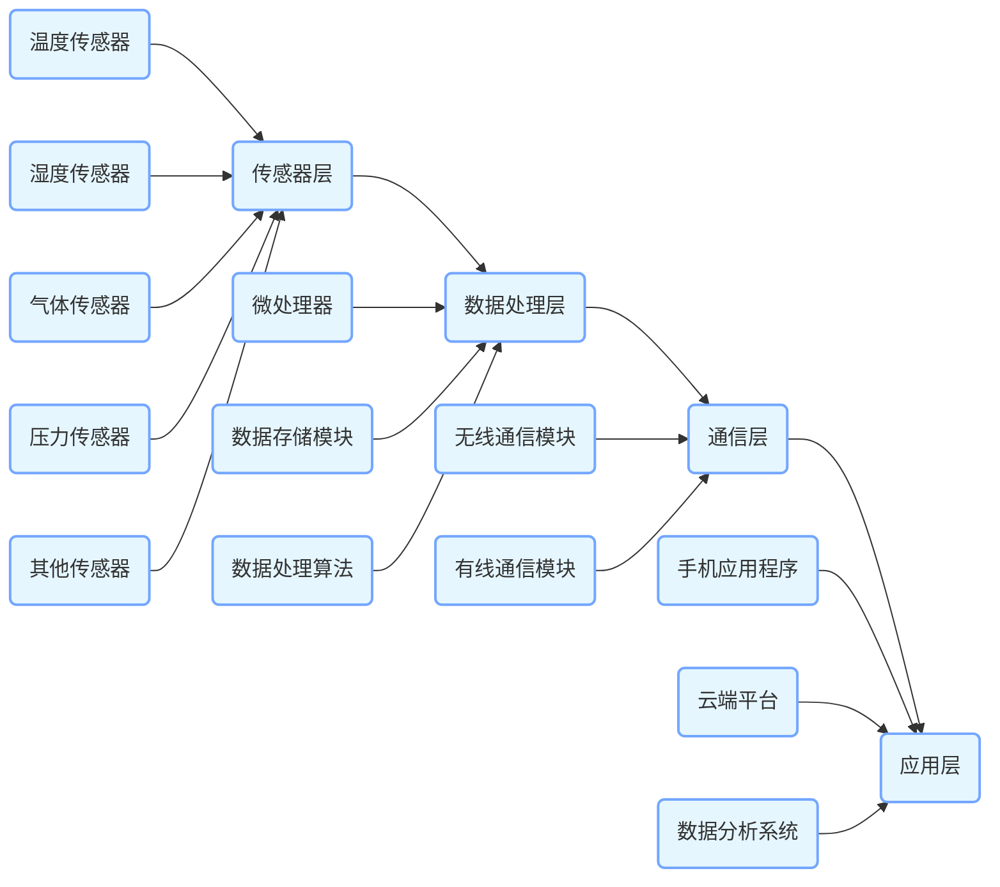

# 价值投资中的智能包装技术发展趋势

> 关键词：价值投资、智能包装技术、发展趋势、市场应用、技术创新

> 摘要：本文聚焦于价值投资领域中智能包装技术的发展趋势。首先介绍了研究的背景、目的、预期读者以及文档结构等内容。接着阐述了智能包装技术的核心概念与联系，包括其原理和架构，并通过 Mermaid 流程图进行直观展示。深入分析了核心算法原理及具体操作步骤，借助 Python 源代码详细说明。同时给出了相关的数学模型和公式，并举例进行讲解。通过项目实战案例，详细展示了开发环境搭建、源代码实现及解读。探讨了智能包装技术在实际中的应用场景，推荐了学习资源、开发工具框架以及相关论文著作。最后总结了未来发展趋势与挑战，还提供了常见问题解答和扩展阅读参考资料，旨在为投资者和技术人员全面了解智能包装技术在价值投资中的情况提供参考。

## 1. 背景介绍 
### 1.1 目的和范围
价值投资强调寻找被低估的资产并长期持有，以获取稳定的回报。智能包装技术作为近年来快速发展的新兴领域，在提升产品附加值、保障产品质量、改善用户体验等方面具有巨大潜力。本文章的目的在于深入探讨智能包装技术在价值投资中的发展趋势，分析其市场前景、技术创新方向以及投资机会与风险。范围涵盖智能包装技术的各个方面，包括其核心概念、算法原理、数学模型、实际应用场景等，并结合具体的项目实战案例进行详细分析。

### 1.2 预期读者
本文的预期读者主要包括价值投资者、金融分析师、智能包装技术领域的研发人员、企业家以及对该领域感兴趣的学生和研究人员。投资者可以通过本文了解智能包装技术的发展趋势，评估其投资价值；研发人员可以获取技术创新的思路和方向；企业家可以把握市场机遇，制定企业发展战略；学生和研究人员可以作为学习和研究的参考资料。

### 1.3 文档结构概述
本文将按照以下结构进行阐述：首先介绍智能包装技术的背景信息，包括目的、预期读者和文档结构概述等；接着讲解核心概念与联系，通过文本示意图和 Mermaid 流程图展示其原理和架构；然后深入分析核心算法原理和具体操作步骤，使用 Python 源代码详细说明；随后给出相关的数学模型和公式，并举例进行讲解；通过项目实战案例，详细介绍开发环境搭建、源代码实现及解读；探讨智能包装技术的实际应用场景；推荐学习资源、开发工具框架以及相关论文著作；最后总结未来发展趋势与挑战，提供常见问题解答和扩展阅读参考资料。

### 1.4 术语表
#### 1.4.1 核心术语定义
- **价值投资**：一种投资策略，通过分析资产的内在价值，寻找被市场低估的资产进行投资，以获取长期稳定的回报。
- **智能包装技术**：将传感器、通信技术、微处理器等集成到包装中，使包装具有感知、记录、通信等功能，能够实时监测产品的状态、环境信息等，并与外界进行交互的技术。
- **传感器**：一种能够感知物理量、化学量或生物量等信息，并将其转换为电信号或其他可测量信号的装置。
- **物联网（IoT）**：通过各种信息传感器、射频识别技术、全球定位系统、红外感应器、激光扫描器等各种装置与技术，实时采集任何需要监控、连接、互动的物体或过程，采集其声、光、热、电、力学、化学、生物、位置等各种需要的信息，通过各类可能的网络接入，实现物与物、物与人的泛在连接，实现对物品和过程的智能化感知、识别和管理。

#### 1.4.2 相关概念解释
- **智能包装的类型**：主要包括智能传感包装、智能指示包装和智能交互包装。智能传感包装能够实时监测产品的质量、环境条件等信息；智能指示包装通过颜色变化、标签显示等方式指示产品的状态；智能交互包装则允许用户与包装进行互动，获取产品的相关信息。
- **大数据分析**：对海量数据进行采集、存储、管理、分析和可视化等处理，以发现数据中的规律、模式和趋势，为决策提供支持。在智能包装技术中，大数据分析可以用于处理传感器采集到的大量数据，挖掘有价值的信息。

#### 1.4.3 缩略词列表
- **IoT**：Internet of Things（物联网）
- **RFID**：Radio Frequency Identification（射频识别）
- **NFC**：Near Field Communication（近场通信）

## 2. 核心概念与联系 
智能包装技术的核心是将传感器、通信模块和微处理器等集成到传统包装中，使其具有智能化的功能。以下是智能包装技术的原理和架构的文本示意图：

```plaintext
智能包装系统
|-- 传感器层
|   |-- 温度传感器
|   |-- 湿度传感器
|   |-- 气体传感器
|   |-- 压力传感器
|   |-- 其他传感器
|-- 数据处理层
|   |-- 微处理器
|   |-- 数据存储模块
|   |-- 数据处理算法
|-- 通信层
|   |-- 无线通信模块（如 Wi-Fi、蓝牙、LoRa 等）
|   |-- 有线通信模块（如 Ethernet 等）
|-- 应用层
|   |-- 手机应用程序
|   |-- 云端平台
|   |-- 数据分析系统
```

下面是对应的 Mermaid 流程图：



在这个架构中，传感器层负责实时采集产品和环境的相关信息，如温度、湿度、气体浓度等。数据处理层对传感器采集到的数据进行处理和存储，通过数据处理算法提取有价值的信息。通信层将处理后的数据传输到应用层，应用层则为用户提供可视化界面和数据分析功能，用户可以通过手机应用程序或云端平台实时查看产品的状态和相关信息。

## 3. 核心算法原理 & 具体操作步骤 
### 核心算法原理
智能包装技术中常用的核心算法包括数据滤波算法、数据融合算法和异常检测算法等。下面以数据滤波算法中的移动平均滤波算法为例进行详细讲解。

移动平均滤波算法是一种简单而有效的平滑滤波算法，它通过计算一定时间窗口内数据的平均值来消除数据中的噪声和波动。假设我们有一个时间序列数据 $x_1, x_2, \cdots, x_n$，移动平均滤波算法的公式为：

$$
y_i = \frac{1}{N} \sum_{j = i - N + 1}^{i} x_j
$$

其中，$y_i$ 是滤波后的第 $i$ 个数据点，$N$ 是时间窗口的大小。

### 具体操作步骤
以下是使用 Python 实现移动平均滤波算法的代码：

```python
import numpy as np

def moving_average_filter(data, window_size):
    """
    移动平均滤波算法实现
    :param data: 输入的时间序列数据
    :param window_size: 时间窗口的大小
    :return: 滤波后的时间序列数据
    """
    filtered_data = []
    for i in range(len(data)):
        if i < window_size - 1:
            # 前 window_size - 1 个数据点，直接使用原始数据
            filtered_data.append(data[i])
        else:
            # 计算窗口内数据的平均值
            window = data[i - window_size + 1:i + 1]
            average = np.mean(window)
            filtered_data.append(average)
    return np.array(filtered_data)

# 示例数据
data = np.array([1, 2, 3, 4, 5, 6, 7, 8, 9, 10])
window_size = 3

# 进行滤波处理
filtered_data = moving_average_filter(data, window_size)

print("原始数据:", data)
print("滤波后的数据:", filtered_data)
```

### 代码解释
1. **函数定义**：`moving_average_filter` 函数接受两个参数，`data` 是输入的时间序列数据，`window_size` 是时间窗口的大小。
2. **初始化空列表**：`filtered_data` 用于存储滤波后的时间序列数据。
3. **遍历数据**：对于前 `window_size - 1` 个数据点，直接将其添加到 `filtered_data` 中；对于后续的数据点，计算当前窗口内数据的平均值，并将其添加到 `filtered_data` 中。
4. **返回结果**：将 `filtered_data` 转换为 NumPy 数组并返回。

## 4. 数学模型和公式 & 详细讲解 & 举例说明 
### 数学模型和公式
在智能包装技术中，除了上述的移动平均滤波算法外，还有一些其他重要的数学模型和公式。例如，在传感器数据融合中，常用的加权平均融合算法的公式为：

$$
y = \sum_{i = 1}^{n} w_i x_i
$$

其中，$y$ 是融合后的结果，$x_i$ 是第 $i$ 个传感器的测量值，$w_i$ 是第 $i$ 个传感器的权重，且满足 $\sum_{i = 1}^{n} w_i = 1$。

### 详细讲解
加权平均融合算法的核心思想是根据各个传感器的可靠性和准确性为其分配不同的权重，然后将各个传感器的测量值进行加权求和得到融合后的结果。权重的选择通常需要根据传感器的性能指标、历史数据等因素进行确定。

### 举例说明
假设我们有三个温度传感器，它们的测量值分别为 $x_1 = 25^{\circ}C$，$x_2 = 26^{\circ}C$，$x_3 = 24^{\circ}C$，根据传感器的性能评估，我们为它们分配的权重分别为 $w_1 = 0.4$，$w_2 = 0.3$，$w_3 = 0.3$。则融合后的温度值为：

$$
y = 0.4 \times 25 + 0.3 \times 26 + 0.3 \times 24 = 25^{\circ}C
$$

通过加权平均融合算法，我们可以综合考虑多个传感器的测量结果，提高测量的准确性和可靠性。

## 5. 项目实战：代码实际案例和详细解释说明 
### 5.1  开发环境搭建
本项目实战以一个简单的智能温度监测包装系统为例，开发环境搭建步骤如下：

1. **硬件设备**：选择一款支持 Wi-Fi 通信的开发板，如 ESP8266，以及一个温度传感器，如 DHT11。
2. **软件环境**：安装 Arduino IDE 开发环境，用于编写和上传代码到开发板。同时，安装相关的库文件，如 DHT 传感器库和 ESP8266WiFi 库。

### 5.2  源代码详细实现和代码解读
以下是实现智能温度监测包装系统的源代码：

```cpp
#include <DHT.h>
#include <ESP8266WiFi.h>

#define DHTPIN D2     // 温度传感器连接的引脚
#define DHTTYPE DHT11 // 温度传感器类型

DHT dht(DHTPIN, DHTTYPE);

const char* ssid = "your_SSID";
const char* password = "your_PASSWORD";
const char* serverName = "your_server_IP";
const int serverPort = 80;

WiFiClient client;

void setup() {
  Serial.begin(115200);
  dht.begin();

  // 连接 Wi-Fi
  WiFi.begin(ssid, password);
  while (WiFi.status()!= WL_CONNECTED) {
    delay(1000);
    Serial.println("Connecting to WiFi...");
  }
  Serial.println("Connected to WiFi");
}

void loop() {
  // 读取温度值
  float temperature = dht.readTemperature();

  if (!isnan(temperature)) {
    Serial.print("Temperature: ");
    Serial.print(temperature);
    Serial.println(" °C");

    // 连接到服务器
    if (client.connect(serverName, serverPort)) {
      // 发送 HTTP 请求
      String postData = "temperature=" + String(temperature);
      client.println("POST /data HTTP/1.1");
      client.println("Host: " + String(serverName));
      client.println("Content-Type: application/x-www-form-urlencoded");
      client.println("Content-Length: " + String(postData.length()));
      client.println();
      client.println(postData);

      // 等待服务器响应
      while (client.available()) {
        String line = client.readStringUntil('\n');
        Serial.println(line);
      }

      client.stop();
    } else {
      Serial.println("Connection to server failed");
    }
  }

  delay(5000); // 每 5 秒读取一次温度值
}
```

### 代码解读与分析
1. **头文件包含**：包含 DHT 传感器库和 ESP8266WiFi 库，用于读取温度值和连接 Wi-Fi。
2. **全局变量定义**：定义温度传感器连接的引脚和类型，以及 Wi-Fi 网络的 SSID 和密码，服务器的 IP 地址和端口号。
3. **`setup` 函数**：初始化串口通信和温度传感器，连接到 Wi-Fi 网络。
4. **`loop` 函数**：
    - 读取温度值，并检查是否读取成功。
    - 如果读取成功，将温度值发送到服务器。
    - 等待服务器响应，并打印响应信息。
    - 断开与服务器的连接。
    - 每 5 秒重复一次上述操作。

通过这个项目实战，我们可以实现一个简单的智能温度监测包装系统，实时将温度数据上传到服务器，方便用户远程监控。

## 6. 实际应用场景 
智能包装技术在多个领域都有广泛的应用场景，以下是一些常见的应用场景：

### 食品行业
- **质量监测**：通过在食品包装中集成温度、湿度和气体传感器，实时监测食品的储存环境和质量变化。例如，对于新鲜肉类和海鲜产品，温度和湿度的控制非常重要，智能包装可以及时发出警报，提醒商家采取措施，防止食品变质。
- **追溯系统**：利用 RFID 或 NFC 技术，消费者可以通过扫描包装上的标签，获取食品的产地、生产日期、保质期、运输过程等详细信息，实现食品的全程追溯，提高消费者对食品安全的信心。

### 医药行业
- **药品监管**：智能包装可以监测药品的储存温度和湿度，确保药品在运输和储存过程中的质量稳定。同时，通过智能标签可以记录药品的开封时间和使用情况，提醒患者按时服药。
- **防伪溯源**：采用先进的防伪技术，如二维码、射频识别等，防止假药流入市场。消费者可以通过扫描包装上的防伪码，验证药品的真伪，并获取药品的相关信息。

### 物流行业
- **货物跟踪**：在物流包装中安装 GPS 定位器和传感器，实时跟踪货物的位置、运输状态和环境条件。物流企业可以通过云端平台监控货物的运输情况，及时调整运输路线和策略，提高物流效率和安全性。
- **库存管理**：利用智能包装技术实现库存的自动化管理。通过 RFID 标签，仓库管理人员可以快速准确地盘点库存，提高库存管理的效率和准确性。

## 7. 工具和资源推荐
### 7.1 学习资源推荐
#### 7.1.1 书籍推荐
- 《物联网技术与应用》：全面介绍了物联网的基本概念、技术原理和应用案例，对于理解智能包装技术中的物联网部分有很大帮助。
- 《传感器技术》：详细讲解了各种传感器的工作原理、特性和应用，是学习智能包装技术中传感器部分的重要参考书籍。
- 《Python 数据分析实战》：Python 是智能包装技术中常用的数据分析工具，这本书通过实际案例介绍了 Python 在数据分析中的应用，对于掌握智能包装技术中的数据分析部分非常有用。

#### 7.1.2 在线课程
- Coursera 上的 “物联网基础” 课程：由知名高校的教授授课，系统地介绍了物联网的相关知识和技术，包括传感器、通信协议、云计算等方面的内容。
- edX 上的 “传感器技术与应用” 课程：深入讲解了传感器的原理、设计和应用，通过实验和案例让学员更好地掌握传感器技术。
- Udemy 上的 “Python 数据分析入门” 课程：适合初学者学习 Python 数据分析，课程内容包括数据处理、数据可视化、机器学习等方面的基础知识。

#### 7.1.3 技术博客和网站
- 物联网智库（https://www.iot101.com/）：提供物联网领域的最新技术动态、行业分析和应用案例，对于了解智能包装技术的发展趋势和市场需求有很大帮助。
- 传感器技术网（https://www.sensorexpert.com.cn/）：专注于传感器技术的研究和应用，提供传感器的产品信息、技术资料和解决方案。
- Python 官方文档（https://docs.python.org/）：学习 Python 的权威资料，包含了 Python 的语法、标准库和第三方库的详细文档。

### 7.2 开发工具框架推荐
#### 7.2.1 IDE和编辑器
- Arduino IDE：适用于开发基于 Arduino 平台的智能包装项目，具有简单易用、开发效率高的特点。
- Visual Studio Code：一款功能强大的开源代码编辑器，支持多种编程语言和插件扩展，可用于开发智能包装技术中的数据分析和算法实现部分。
- PyCharm：专业的 Python 集成开发环境，提供代码调试、代码分析、版本控制等功能，适合开发复杂的 Python 项目。

#### 7.2.2 调试和性能分析工具
- Serial Monitor：Arduino IDE 自带的串口监视器工具，可用于调试和监控开发板与计算机之间的串口通信。
- Wireshark：一款开源的网络协议分析工具，可用于分析智能包装系统中的网络通信数据，帮助排查网络故障和优化网络性能。
- Profiler：Python 中的性能分析工具，如 cProfile 和 line_profiler，可用于分析 Python 代码的性能瓶颈，优化代码的执行效率。

#### 7.2.3 相关框架和库
- DHT 传感器库：用于读取 DHT 系列温度和湿度传感器的数据，简化了传感器的使用。
- ESP8266WiFi 库：支持 ESP8266 开发板连接 Wi-Fi 网络，实现无线通信功能。
- Pandas：Python 中用于数据处理和分析的强大库，提供了丰富的数据结构和数据分析工具。
- Matplotlib：Python 中用于数据可视化的库，可绘制各种类型的图表，帮助用户直观地展示数据分析结果。

### 7.3 相关论文著作推荐
#### 7.3.1 经典论文
- “Internet of Things: A Survey”：全面介绍了物联网的概念、体系结构、关键技术和应用领域，是物联网领域的经典论文之一。
- “Smart Packaging Technologies for Food Applications: A Review”：综述了智能包装技术在食品领域的应用现状和发展趋势，对于了解智能包装技术在食品行业的应用有重要参考价值。
- “Sensor Fusion Techniques: A Review”：对传感器融合技术进行了系统的综述，介绍了各种传感器融合算法和方法，为智能包装技术中的传感器融合提供了理论基础。

#### 7.3.2 最新研究成果
- 通过 Google Scholar 等学术搜索引擎，可以搜索到智能包装技术领域的最新研究成果。关注相关的学术会议和期刊，如 IEEE Internet of Things Journal、Journal of Food Engineering 等，及时了解该领域的前沿动态。

#### 7.3.3 应用案例分析
- 一些行业报告和案例分析文档可以提供智能包装技术在实际应用中的具体案例和经验教训。例如，一些咨询公司发布的关于智能包装市场的研究报告，以及企业发布的智能包装解决方案案例等。

## 8. 总结：未来发展趋势与挑战
### 未来发展趋势
- **技术融合**：智能包装技术将与物联网、大数据、人工智能等技术进一步融合，实现更强大的功能和更智能化的管理。例如，通过人工智能算法对传感器采集到的数据进行深度分析，预测产品的质量变化和使用寿命。
- **环保可持续**：随着环保意识的提高，智能包装技术将更加注重环保和可持续发展。开发可降解、可回收的智能包装材料，减少对环境的污染。
- **个性化定制**：消费者对产品的个性化需求越来越高，智能包装技术将能够实现个性化定制。例如，根据消费者的喜好和需求，在包装上显示不同的信息和图案。
- **跨行业应用**：智能包装技术将不再局限于食品、医药、物流等传统行业，还将拓展到更多领域，如化妆品、电子产品等。

### 挑战
- **成本问题**：目前智能包装技术的成本较高，限制了其大规模应用。降低智能包装的成本，提高其性价比，是推广智能包装技术的关键。
- **标准规范**：智能包装技术涉及多个领域和行业，缺乏统一的标准规范。制定相关的标准规范，确保智能包装系统的兼容性和互操作性，是促进智能包装技术发展的重要保障。
- **数据安全**：智能包装系统会产生大量的敏感数据，如产品信息、消费者信息等。保障数据的安全和隐私，防止数据泄露和滥用，是智能包装技术面临的重要挑战。

## 9. 附录：常见问题与解答
### 问题 1：智能包装技术的投资回报率如何评估？
解答：评估智能包装技术的投资回报率需要考虑多个因素，包括设备采购成本、研发成本、运营成本、市场需求和产品附加值等。可以通过建立财务模型，预测智能包装技术实施后的收入增长和成本节约情况，计算投资回报率。同时，还需要考虑市场竞争、技术更新换代等因素对投资回报率的影响。

### 问题 2：智能包装技术在不同行业的应用有哪些差异？
解答：不同行业对智能包装技术的需求和应用场景有所不同。例如，食品行业更关注食品的质量监测和追溯系统；医药行业更注重药品的监管和防伪溯源；物流行业则更强调货物的跟踪和库存管理。因此，在应用智能包装技术时，需要根据不同行业的特点和需求进行定制化开发。

### 问题 3：智能包装技术的发展对传统包装行业有何影响？
解答：智能包装技术的发展将对传统包装行业产生深远的影响。一方面，智能包装技术可以提升传统包装的附加值，为传统包装企业带来新的发展机遇；另一方面，也会促使传统包装企业进行技术升级和转型，提高企业的竞争力。同时，智能包装技术的发展也可能导致一些传统包装产品的市场份额下降，传统包装企业需要积极应对挑战。

## 10. 扩展阅读 & 参考资料
### 扩展阅读
- 《智能物联网：技术、应用与挑战》：深入探讨了智能物联网的技术原理、应用案例和面临的挑战，对于进一步了解智能包装技术中的物联网部分有很大帮助。
- 《大数据时代：生活、工作与思维的大变革》：介绍了大数据的概念、特点和应用，对于理解智能包装技术中的大数据分析有重要参考价值。

### 参考资料
- 相关行业报告和研究机构发布的数据，如市场调研机构发布的智能包装市场研究报告。
- 学术期刊和会议论文，如 IEEE 相关会议论文、Journal of Packaging Technology 等期刊上的论文。
- 企业官方网站和产品文档，如智能包装设备制造商的官方网站和产品说明书。

作者：AI天才研究院/AI Genius Institute & 禅与计算机程序设计艺术 /Zen And The Art of Computer Programming