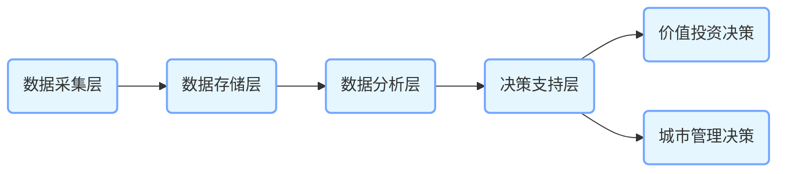

# 价值投资中的智能城市共享经济管理系统分析

> 关键词：价值投资、智能城市、共享经济、管理系统、数据分析、决策支持、可持续发展

> 摘要：本文围绕价值投资中的智能城市共享经济管理系统展开深入分析。首先阐述了该系统产生的背景，包括目的、预期读者等内容。接着详细剖析核心概念与联系，介绍系统的原理和架构，并通过Mermaid流程图进行直观展示。深入讲解核心算法原理及具体操作步骤，结合Python源代码进行说明。探讨相关数学模型和公式，通过举例加深理解。通过项目实战给出代码实际案例并详细解释。分析该系统在智能城市中的实际应用场景。推荐学习该系统相关的工具和资源，包括书籍、在线课程等。最后总结未来发展趋势与挑战，提供常见问题解答及扩展阅读和参考资料，旨在为智能城市共享经济管理系统的研究与应用提供全面而深入的指导。

## 1. 背景介绍 
### 1.1 目的和范围
在当今社会，智能城市的发展已成为一种趋势，而共享经济作为一种新兴的经济模式，在智能城市中发挥着越来越重要的作用。价值投资强调对具有长期价值的项目进行投资，智能城市共享经济管理系统旨在通过整合共享经济资源，提高资源利用效率，实现智能城市的可持续发展，为价值投资者提供更有价值的投资机会。本分析的范围涵盖智能城市共享经济管理系统的各个方面，包括系统的架构、算法、应用场景等。

### 1.2 预期读者
本文的预期读者包括价值投资者、智能城市规划者、共享经济从业者、相关领域的研究人员以及对智能城市和共享经济感兴趣的技术爱好者。

### 1.3 文档结构概述
本文首先介绍背景信息，包括目的、读者和文档结构。然后深入探讨核心概念与联系，详细讲解核心算法原理及操作步骤，介绍相关数学模型和公式。通过项目实战展示代码案例及解读。分析实际应用场景，推荐相关工具和资源。最后总结未来发展趋势与挑战，提供常见问题解答和扩展阅读参考资料。

### 1.4 术语表
#### 1.4.1 核心术语定义
- **价值投资**：一种投资策略，投资者通过对资产的内在价值进行评估，寻找被低估的资产进行投资，以获取长期的资本增值。
- **智能城市**：利用信息技术和通信技术手段感测、分析、整合城市运行核心系统的各项关键信息，从而对包括民生、环保、公共安全、城市服务、工商业活动在内的各种需求做出智能响应，为人类创造更美好的城市生活。
- **共享经济**：一种基于陌生人且存在物品使用权暂时转移的新型经济模式，其本质是整合线下的闲散物品、劳动力、教育医疗资源等。
- **智能城市共享经济管理系统**：用于管理智能城市中共享经济活动的信息系统，通过收集、分析和处理共享经济相关数据，实现资源的优化配置和管理决策的支持。

#### 1.4.2 相关概念解释
- **数据分析**：指用适当的统计分析方法对收集来的大量数据进行分析，提取有用信息和形成结论而对数据加以详细研究和概括总结的过程。在智能城市共享经济管理系统中，数据分析用于了解用户行为、资源使用情况等，为系统的优化和决策提供依据。
- **决策支持**：为决策者提供分析问题、建立模型、模拟决策过程和方案的环境，调用各种信息资源和分析工具，帮助决策者提高决策水平和质量。在本系统中，决策支持功能基于数据分析结果，为价值投资者和城市管理者提供投资决策和管理决策的建议。

#### 1.4.3 缩略词列表
- **GIS**：地理信息系统（Geographic Information System），用于采集、存储、管理、分析和显示地理空间数据的计算机系统，在智能城市共享经济管理系统中可用于共享资源的空间分布分析。
- **AI**：人工智能（Artificial Intelligence），在本系统中可用于数据分析、预测和决策支持等方面。
- **IoT**：物联网（Internet of Things），通过各种信息传感器、射频识别技术、全球定位系统、红外感应器、激光扫描器等各种装置与技术，实时采集任何需要监控、连接、互动的物体或过程，采集其声、光、热、电、力学、化学、生物、位置等各种需要的信息，通过各类可能的网络接入，实现物与物、物与人的泛在连接，实现对物品和过程的智能化感知、识别和管理。在智能城市共享经济管理系统中，物联网技术可用于共享设备的状态监测和数据采集。

## 2. 核心概念与联系 
智能城市共享经济管理系统的核心概念主要包括价值投资、智能城市、共享经济以及数据分析和决策支持等。这些概念之间相互关联，共同构成了系统的整体架构。

### 核心概念原理
价值投资的原理是基于对资产内在价值的评估，通过分析各种因素来确定资产的真实价值，并寻找被低估的投资机会。在智能城市共享经济管理系统中，价值投资者通过系统提供的数据和分析结果，评估共享经济项目的价值，从而做出投资决策。

智能城市的建设依赖于信息技术和通信技术的应用，通过整合城市的各种资源和信息，实现城市的智能化管理和运行。共享经济则是利用互联网平台，将闲置资源进行整合和共享，提高资源的利用效率。智能城市共享经济管理系统作为两者的结合点，通过收集和分析共享经济相关的数据，为智能城市的资源管理和决策提供支持。

数据分析是智能城市共享经济管理系统的重要组成部分，通过对大量的共享经济数据进行挖掘和分析，可以了解用户的需求和行为模式，预测资源的使用情况，为系统的优化和决策提供依据。决策支持则是基于数据分析的结果，为价值投资者和城市管理者提供投资决策和管理决策的建议。

### 架构的文本示意图
智能城市共享经济管理系统主要由数据采集层、数据存储层、数据分析层和决策支持层组成。

数据采集层通过物联网技术、传感器等手段收集共享经济相关的数据，包括共享设备的状态、用户的使用记录、地理位置信息等。这些数据被传输到数据存储层进行存储。

数据存储层采用数据库技术，将采集到的数据进行分类存储，以便后续的分析和处理。

数据分析层对存储的数据进行挖掘和分析，采用机器学习、数据挖掘等技术，提取有用的信息和知识。

决策支持层根据数据分析的结果，为价值投资者和城市管理者提供决策建议，包括投资项目的选择、资源的分配和管理策略的制定等。

### Mermaid 流程图


## 3. 核心算法原理 & 具体操作步骤 
### 核心算法原理
在智能城市共享经济管理系统中，常用的核心算法包括聚类算法、回归算法和预测算法等。

#### 聚类算法
聚类算法用于将相似的数据对象划分为不同的类别。在共享经济管理系统中，可以使用聚类算法对用户进行分类，了解不同用户群体的需求和行为模式。常用的聚类算法有K-Means算法。

K-Means算法的基本思想是：首先随机选择K个中心点，然后将每个数据点分配到距离最近的中心点所在的类别中，接着重新计算每个类别的中心点，重复这个过程直到中心点不再发生变化或达到最大迭代次数。

以下是Python实现的K-Means算法示例：
```python
import numpy as np

def kmeans(data, k, max_iterations=100):
    # 随机初始化中心点
    centers = data[np.random.choice(data.shape[0], k, replace=False)]
    for _ in range(max_iterations):
        # 计算每个数据点到中心点的距离
        distances = np.array([np.linalg.norm(data - center, axis=1) for center in centers])
        # 分配数据点到最近的中心点所在的类别
        labels = np.argmin(distances, axis=0)
        # 重新计算中心点
        new_centers = np.array([data[labels == i].mean(axis=0) for i in range(k)])
        # 判断中心点是否不再变化
        if np.allclose(new_centers, centers):
            break
        centers = new_centers
    return labels, centers
```

#### 回归算法
回归算法用于建立自变量和因变量之间的关系模型。在共享经济管理系统中，可以使用回归算法预测共享资源的使用量。常用的回归算法有线性回归算法。

线性回归算法的基本思想是：通过最小化误差的平方和来找到最佳的拟合直线。

以下是Python实现的线性回归算法示例：
```python
import numpy as np

class LinearRegression:
    def __init__(self):
        self.weights = None

    def fit(self, X, y):
        # 添加偏置项
        X = np.c_[np.ones((X.shape[0], 1)), X]
        # 计算权重
        self.weights = np.linalg.inv(X.T.dot(X)).dot(X.T).dot(y)

    def predict(self, X):
        # 添加偏置项
        X = np.c_[np.ones((X.shape[0], 1)), X]
        # 预测结果
        return X.dot(self.weights)
```

#### 预测算法
预测算法用于根据历史数据预测未来的趋势。在共享经济管理系统中，可以使用时间序列分析算法预测共享资源的需求。常用的时间序列分析算法有ARIMA算法。

ARIMA算法的基本思想是：将时间序列数据分解为自回归（AR）、差分（I）和移动平均（MA）三个部分，通过对这三个部分的建模来预测未来的值。

以下是使用`statsmodels`库实现的ARIMA算法示例：
```python
from statsmodels.tsa.arima.model import ARIMA
import pandas as pd

# 生成示例时间序列数据
data = pd.Series([1, 2, 3, 4, 5, 6, 7, 8, 9, 10])
# 拟合ARIMA模型
model = ARIMA(data, order=(1, 1, 1))
model_fit = model.fit()
# 预测未来值
forecast = model_fit.forecast(steps=3)
print(forecast)
```

### 具体操作步骤
1. **数据预处理**：对采集到的原始数据进行清洗、转换和归一化等处理，去除噪声和异常值，将数据转换为适合算法处理的格式。
2. **特征选择**：从预处理后的数据中选择与分析目标相关的特征，减少数据维度，提高算法的效率和准确性。
3. **模型训练**：使用选择的算法对训练数据进行训练，调整模型的参数，使模型的性能达到最优。
4. **模型评估**：使用测试数据对训练好的模型进行评估，计算模型的评估指标，如准确率、召回率、均方误差等，评估模型的性能。
5. **模型应用**：将训练好的模型应用到实际的共享经济管理系统中，进行预测、分类等任务，为决策提供支持。

## 4. 数学模型和公式 & 详细讲解 & 举例说明 
### 聚类算法的数学模型和公式
#### K-Means算法
K-Means算法的目标是最小化所有数据点到其所属类别中心点的距离之和，其数学模型可以表示为：
$$
\min_{C_1,C_2,\cdots,C_k} \sum_{i=1}^{k} \sum_{x_j \in C_i} \left\| x_j - \mu_i \right\|^2
$$
其中，$C_1,C_2,\cdots,C_k$ 表示 $k$ 个类别，$x_j$ 表示第 $j$ 个数据点，$\mu_i$ 表示第 $i$ 个类别的中心点。

具体步骤如下：
1. 随机初始化 $k$ 个中心点 $\mu_1,\mu_2,\cdots,\mu_k$。
2. 对于每个数据点 $x_j$，计算其到每个中心点的距离 $\left\| x_j - \mu_i \right\|^2$，将其分配到距离最近的中心点所在的类别 $C_i$ 中。
3. 重新计算每个类别的中心点 $\mu_i = \frac{1}{|C_i|} \sum_{x_j \in C_i} x_j$，其中 $|C_i|$ 表示类别 $C_i$ 中的数据点数量。
4. 重复步骤2和3，直到中心点不再发生变化或达到最大迭代次数。

**举例说明**：假设有以下5个数据点：$x_1=(1, 2)$，$x_2=(2, 3)$，$x_3=(4, 5)$，$x_4=(5, 6)$，$x_5=(7, 8)$，要将其分为2类。

首先随机初始化两个中心点，假设 $\mu_1=(1, 2)$，$\mu_2=(7, 8)$。

计算每个数据点到中心点的距离：
- $d(x_1, \mu_1) = \left\| (1, 2) - (1, 2) \right\|^2 = 0$，$d(x_1, \mu_2) = \left\| (1, 2) - (7, 8) \right\|^2 = 72$，所以 $x_1$ 属于类别 $C_1$。
- $d(x_2, \mu_1) = \left\| (2, 3) - (1, 2) \right\|^2 = 2$，$d(x_2, \mu_2) = \left\| (2, 3) - (7, 8) \right\|^2 = 50$，所以 $x_2$ 属于类别 $C_1$。
- $d(x_3, \mu_1) = \left\| (4, 5) - (1, 2) \right\|^2 = 18$，$d(x_3, \mu_2) = \left\| (4, 5) - (7, 8) \right\|^2 = 18$，假设将其分配到类别 $C_1$。
- $d(x_4, \mu_1) = \left\| (5, 6) - (1, 2) \right\|^2 = 32$，$d(x_4, \mu_2) = \left\| (5, 6) - (7, 8) \right\|^2 = 8$，所以 $x_4$ 属于类别 $C_2$。
- $d(x_5, \mu_1) = \left\| (7, 8) - (1, 2) \right\|^2 = 72$，$d(x_5, \mu_2) = \left\| (7, 8) - (7, 8) \right\|^2 = 0$，所以 $x_5$ 属于类别 $C_2$。

重新计算中心点：
- $\mu_1 = \frac{(1, 2) + (2, 3) + (4, 5)}{3} = (\frac{7}{3}, \frac{10}{3})$
- $\mu_2 = \frac{(5, 6) + (7, 8)}{2} = (6, 7)$

重复上述步骤，直到中心点不再发生变化。

### 回归算法的数学模型和公式
#### 线性回归算法
线性回归算法的数学模型可以表示为：
$$
y = \theta_0 + \theta_1 x_1 + \theta_2 x_2 + \cdots + \theta_n x_n + \epsilon
$$
其中，$y$ 表示因变量，$x_1,x_2,\cdots,x_n$ 表示自变量，$\theta_0,\theta_1,\cdots,\theta_n$ 表示模型的参数，$\epsilon$ 表示误差项。

线性回归的目标是最小化误差的平方和，即：
$$
\min_{\theta_0,\theta_1,\cdots,\theta_n} \sum_{i=1}^{m} (y_i - (\theta_0 + \theta_1 x_{i1} + \theta_2 x_{i2} + \cdots + \theta_n x_{in}))^2
$$
其中，$m$ 表示样本数量，$y_i$ 表示第 $i$ 个样本的因变量值，$x_{i1},x_{i2},\cdots,x_{in}$ 表示第 $i$ 个样本的自变量值。

可以使用最小二乘法求解模型的参数 $\theta$，其公式为：
$$
\theta = (X^T X)^{-1} X^T y
$$
其中，$X$ 是自变量矩阵，$y$ 是因变量向量。

**举例说明**：假设有以下数据集：
| $x$ | $y$ |
| --- | --- |
| 1 | 2 |
| 2 | 4 |
| 3 | 6 |

将其表示为矩阵形式：
$$
X = \begin{bmatrix}
1 & 1 \\
1 & 2 \\
1 & 3
\end{bmatrix}
$$
$$
y = \begin{bmatrix}
2 \\
4 \\
6
\end{bmatrix}
$$

计算 $(X^T X)^{-1} X^T y$：
$$
X^T X = \begin{bmatrix}
1 & 1 & 1 \\
1 & 2 & 3
\end{bmatrix}
\begin{bmatrix}