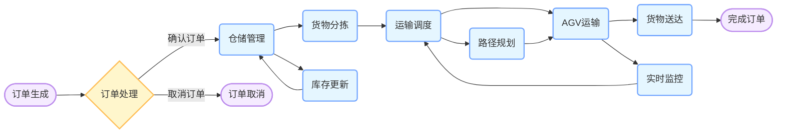

# 价值投资中的智能城市地下物流系统分析

> 关键词：价值投资、智能城市、地下物流系统、物流效率、可持续发展

> 摘要：本文聚焦于价值投资视角下的智能城市地下物流系统。首先介绍了研究的背景、目的、预期读者等内容。接着阐述了智能城市地下物流系统的核心概念、联系及架构，分析其核心算法原理并给出Python代码示例。通过数学模型和公式深入探讨系统的相关特性，并结合实际案例进行详细说明。介绍了该系统在不同场景的实际应用，推荐了相关的学习资源、开发工具框架和论文著作。最后总结了智能城市地下物流系统的未来发展趋势与挑战，解答了常见问题并提供了扩展阅读和参考资料，旨在为价值投资者和相关领域从业者提供全面深入的分析。

## 1. 背景介绍 
### 1.1 目的和范围
本研究的目的在于从价值投资的角度全面分析智能城市地下物流系统。在当今城市化进程不断加速的背景下，城市物流面临着交通拥堵、环境污染等诸多问题，智能城市地下物流系统作为一种创新的解决方案逐渐受到关注。本研究将深入探讨该系统的技术原理、应用场景、投资价值等方面，为投资者提供决策依据，同时也为相关领域的研究和实践提供参考。研究范围涵盖智能城市地下物流系统的各个环节，包括系统架构、核心算法、数学模型以及实际应用等。

### 1.2 预期读者
本文的预期读者主要包括价值投资者，他们希望通过了解智能城市地下物流系统的发展前景和投资潜力，寻找具有长期价值的投资项目；物流行业从业者，他们可以从本文中获取关于智能物流系统的最新技术和发展趋势，为企业的战略规划和业务拓展提供思路；城市规划者，他们可以参考本文的研究成果，将智能城市地下物流系统纳入城市规划中，提高城市的物流效率和可持续发展能力；以及对智能城市和物流技术感兴趣的研究人员和学者，他们可以通过本文深入了解该领域的研究现状和前沿动态。

### 1.3 文档结构概述
本文将按照以下结构进行阐述：首先介绍智能城市地下物流系统的背景信息，包括目的、预期读者和文档结构概述等；接着阐述核心概念与联系，包括系统的原理和架构，并通过文本示意图和Mermaid流程图进行直观展示；然后详细讲解核心算法原理和具体操作步骤，给出Python源代码示例；再通过数学模型和公式对系统进行深入分析，并举例说明；之后结合实际项目案例，介绍开发环境搭建、源代码实现和代码解读；接着探讨该系统的实际应用场景；推荐相关的工具和资源，包括学习资源、开发工具框架和论文著作；最后总结未来发展趋势与挑战，解答常见问题并提供扩展阅读和参考资料。

### 1.4 术语表
#### 1.4.1 核心术语定义
- **价值投资**：一种投资策略，投资者通过分析资产的内在价值，寻找被低估的投资标的，以获取长期的投资回报。
- **智能城市**：利用信息技术和通信技术，实现城市管理和服务的智能化、高效化和可持续发展的城市形态。
- **地下物流系统**：一种将物流运输活动转移到地下空间的物流系统，通过自动化设备和信息技术实现货物的高效运输和配送。
- **物流效率**：衡量物流系统在单位时间内完成物流任务的能力，包括货物运输速度、配送准确率等指标。
- **可持续发展**：满足当代人的需求，又不损害后代人满足其需求的能力的发展模式，强调经济、社会和环境的协调发展。

#### 1.4.2 相关概念解释
- **自动化仓储**：利用自动化设备和信息技术实现货物的存储、管理和出入库操作的仓储系统，提高仓储效率和准确性。
- **自动导引车（AGV）**：一种能够沿着预设路径自动行驶的运输设备，常用于物流运输和仓储作业中，提高物流自动化水平。
- **物联网（IoT）**：通过传感器、网络通信等技术，将各种物理设备连接到互联网，实现设备之间的信息交互和智能化管理。

#### 1.4.3 缩略词列表
- **AGV**：Automated Guided Vehicle（自动导引车）
- **IoT**：Internet of Things（物联网）
- **GIS**：Geographic Information System（地理信息系统）

## 2. 核心概念与联系 
### 核心概念原理
智能城市地下物流系统是一种将现代物流技术、信息技术和地下空间利用相结合的创新物流解决方案。其核心原理是利用地下空间建设专门的物流通道和设施，通过自动化设备和信息技术实现货物的高效运输和配送。系统主要由仓储子系统、运输子系统和信息管理子系统组成。

仓储子系统负责货物的存储和管理，采用自动化仓储技术，如自动化立体仓库、自动分拣系统等，实现货物的快速出入库和高效存储。运输子系统则利用自动导引车（AGV）、管道运输等方式，将货物从仓储子系统运输到目的地。信息管理子系统是整个系统的大脑，通过物联网（IoT）技术实时监控货物的位置、状态等信息，实现物流过程的可视化和智能化管理。

### 架构的文本示意图
智能城市地下物流系统的架构可以分为三个层次：物理层、数据层和应用层。

物理层包括地下物流通道、仓储设施、运输设备等实体基础设施。地下物流通道是货物运输的主要路径，采用管道、轨道等形式建设，确保货物的安全、高效运输。仓储设施用于货物的存储和中转，配备自动化仓储设备，提高仓储效率。运输设备包括AGV、管道运输装置等，负责货物的实际运输。

数据层主要负责数据的采集、传输和存储。通过物联网传感器，实时采集货物的位置、状态、环境参数等信息，并将这些信息传输到数据中心进行存储和处理。数据中心采用大数据技术，对海量数据进行分析和挖掘，为系统的决策和管理提供支持。

应用层是系统的用户界面，包括物流管理系统、配送调度系统、客户服务系统等。物流管理系统负责对整个物流过程进行监控和管理，包括订单处理、库存管理、运输调度等。配送调度系统根据货物的需求和运输资源的情况，制定最优的配送方案。客户服务系统为客户提供货物查询、订单跟踪等服务，提高客户满意度。

### Mermaid流程图


该流程图展示了智能城市地下物流系统的基本业务流程。订单生成后，首先进行订单处理，根据订单情况进行确认或取消。确认的订单进入仓储管理环节，进行货物分拣。然后通过运输调度制定运输方案，由AGV进行货物运输。货物送达后完成订单。在整个过程中，库存会实时更新，运输过程会进行实时监控，运输调度会根据实时情况进行调整。

## 3. 核心算法原理 & 具体操作步骤 
### 核心算法原理
智能城市地下物流系统涉及多个核心算法，其中路径规划算法和库存管理算法是比较关键的算法。

#### 路径规划算法
路径规划算法的目的是为AGV等运输设备找到最优的运输路径，以提高运输效率和降低成本。常用的路径规划算法有Dijkstra算法、A*算法等。

Dijkstra算法是一种经典的最短路径算法，它通过不断扩展节点，计算从起点到各个节点的最短距离，直到找到目标节点。算法的基本步骤如下：
1. 初始化所有节点的距离为无穷大，起点的距离为0。
2. 将起点加入优先队列。
3. 从优先队列中取出距离最小的节点。
4. 扩展该节点的所有邻接节点，更新邻接节点的距离。
5. 如果邻接节点的距离被更新，则将其加入优先队列。
6. 重复步骤3-5，直到找到目标节点或优先队列为空。

A*算法是一种启发式搜索算法，它在Dijkstra算法的基础上引入了启发式函数，通过估计从当前节点到目标节点的距离，引导搜索方向，从而更快地找到最优路径。

#### 库存管理算法
库存管理算法的目的是优化库存水平，确保货物的供应和需求平衡，同时降低库存成本。常用的库存管理算法有经济订货量（EOQ）模型、ABC分类法等。

经济订货量（EOQ）模型是一种经典的库存管理模型，它通过平衡订货成本和持有成本，确定最优的订货批量。模型的基本公式为：

$$EOQ = \sqrt{\frac{2DS}{H}}$$

其中，$D$ 是年需求量，$S$ 是每次订货的成本，$H$ 是单位货物的年持有成本。

ABC分类法是一种根据货物的重要性和价值对库存进行分类管理的方法。将货物分为A、B、C三类，A类货物是最重要、价值最高的货物，需要重点管理；B类货物次之；C类货物是最不重要、价值最低的货物，可以采用较为宽松的管理方式。

### 具体操作步骤
#### 路径规划算法的Python实现
```python
import heapq

def dijkstra(graph, start, end):
    # 初始化距离字典，所有节点的距离为无穷大
    distances = {node: float('inf') for node in graph}
    distances[start] = 0
    # 初始化优先队列
    priority_queue = [(0, start)]

    while priority_queue:
        # 从优先队列中取出距离最小的节点
        current_distance, current_node = heapq.heappop(priority_queue)

        # 如果已经到达目标节点，返回最短距离
        if current_node == end:
            return current_distance

        # 如果当前距离大于已记录的距离，跳过
        if current_distance > distances[current_node]:
            continue

        # 扩展当前节点的所有邻接节点
        for neighbor, weight in graph[current_node].items():
            distance = current_distance + weight

            # 如果新的距离小于已记录的距离，更新距离并加入优先队列
            if distance < distances[neighbor]:
                distances[neighbor] = distance
                heapq.heappush(priority_queue, (distance, neighbor))

    # 如果没有找到路径，返回无穷大
    return float('inf')

# 示例图
graph = {
    'A': {'B': 1, 'C': 4},
    'B': {'A': 1, 'C': 2, 'D': 5},
    'C': {'A': 4, 'B': 2, 'D': 1},
    'D': {'B': 5, 'C': 1}
}

start_node = 'A'
end_node = 'D'
shortest_distance = dijkstra(graph, start_node, end_node)
print(f"从 {start_node} 到 {end_node} 的最短距离是: {shortest_distance}")
```

#### 库存管理算法的Python实现
```python
def economic_order_quantity(D, S, H):
    # 计算经济订货量
    EOQ = ((2 * D * S) / H) ** 0.5
    return EOQ

# 示例参数
annual_demand = 1000  # 年需求量
ordering_cost = 50    # 每次订货的成本
holding_cost = 2      # 单位货物的年持有成本

eoq = economic_order_quantity(annual_demand, ordering_cost, holding_cost)
print(f"经济订货量是: {eoq}")
```

## 4. 数学模型和公式 & 详细讲解 & 举例说明 
### 路径规划算法的数学模型
#### Dijkstra算法的数学模型
Dijkstra算法的数学模型可以用图论的语言来描述。设 $G=(V, E)$ 是一个加权有向图，其中 $V$ 是节点集合，$E$ 是边集合。每条边 $(u, v) \in E$ 都有一个非负的权重 $w(u, v)$ 表示从节点 $u$ 到节点 $v$ 的距离。

设 $d(v)$ 表示从起点 $s$ 到节点 $v$ 的最短距离，初始时 $d(s)=0$，对于其他节点 $v \neq s$，$d(v)=\infty$。算法通过不断更新 $d(v)$ 的值，直到找到从起点到目标节点的最短路径。

更新规则如下：对于节点 $u$ 的所有邻接节点 $v$，如果 $d(u)+w(u, v)<d(v)$，则更新 $d(v)=d(u)+w(u, v)$。

#### A*算法的数学模型
A*算法在Dijkstra算法的基础上引入了启发式函数 $h(v)$，表示从节点 $v$ 到目标节点 $t$ 的估计距离。设 $f(v)=g(v)+h(v)$，其中 $g(v)$ 是从起点 $s$ 到节点 $v$ 的实际距离，$f(v)$ 是从起点 $s$ 经过节点 $v$ 到目标节点 $t$ 的估计总距离。

算法在扩展节点时，优先选择 $f(v)$ 值最小的节点进行扩展，以加快搜索速度。

### 库存管理算法的数学模型
#### 经济订货量（EOQ）模型
经济订货量（EOQ）模型的数学推导基于以下假设：
1. 年需求量 $D$ 是已知且恒定的。
2. 每次订货的成本 $S$ 是固定的。
3. 单位货物的年持有成本 $H$ 是固定的。
4. 货物的补货是瞬时完成的，即不存在缺货情况。

总成本 $TC$ 由订货成本和持有成本组成，公式为：

$$TC = \frac{D}{Q}S+\frac{Q}{2}H$$

其中，$Q$ 是订货批量。为了找到总成本最小的订货批量，对 $TC$ 求关于 $Q$ 的导数，并令导数为0：

$$\frac{dTC}{dQ}=-\frac{DS}{Q^2}+\frac{H}{2}=0$$

解得：

$$Q = \sqrt{\frac{2DS}{H}}$$

#### ABC分类法的数学模型
ABC分类法的数学模型主要基于货物的价值和需求量。设 $V_i$ 是第 $i$ 种货物的价值，$D_i$ 是第 $i$ 种货物的年需求量，则第 $i$ 种货物的年价值 $A_i = V_iD_i$。

将所有货物按照年价值从大到小排序，计算累计年价值占总年价值的比例。通常，将累计年价值占比前70%左右的货物划分为A类，占比70%-90%的货物划分为B类，占比90%-100%的货物划分为C类。

### 举例说明
#### 路径规划算法举例
假设有一个地下物流网络，由4个节点 A、B、C、D 组成，节点之间的距离如下表所示：

| 起点 | 终点 | 距离 |
|------|------|------|
| A    | B    | 1    |
| A    | C    | 4    |
| B    | A    | 1    |
| B    | C    | 2    |
| B    | D    | 5    |
| C    | A    | 4    |
| C    | B    | 2    |
| C    | D    | 1    |
| D    | B    | 5    |
| D    | C    | 1    |

使用Dijkstra算法计算从节点 A 到节点 D 的最短距离。根据前面的Python代码，计算得到最短距离为 4。

#### 库存管理算法举例
某企业每年需要采购某种货物 1000 件，每次订货的成本为 50 元，单位货物的年持有成本为 2 元。使用经济订货量（EOQ）模型计算最优的订货批量：

$$EOQ = \sqrt{\frac{2\times1000\times50}{2}}=\sqrt{50000}\approx224$$

即该企业每次订货的最优批量约为 224 件。

## 5. 项目实战：代码实际案例和详细解释说明 
### 5.1  开发环境搭建
#### 硬件环境
- 服务器：可以选择云服务器或本地服务器，推荐配置为 CPU 4 核以上，内存 8GB 以上，硬盘容量 100GB 以上。
- 传感器设备：如物联网传感器，用于采集货物的位置、状态等信息。
- 运输设备：如 AGV，用于货物的运输。

#### 软件环境
- 操作系统：可以选择 Linux 系统，如 Ubuntu、CentOS 等。
- 编程语言：Python，用于开发系统的核心算法和应用程序。
- 数据库：可以选择 MySQL、PostgreSQL 等关系型数据库，用于存储系统的数据。
- 框架和库：如 Flask、Django 等 Web 框架，用于开发系统的应用层；Pandas、NumPy 等数据分析库，用于数据处理和分析。

### 5.2  源代码详细实现和代码解读
#### 系统架构设计
我们设计一个简单的智能城市地下物流系统的架构，包括订单管理、仓储管理、运输调度和实时监控四个模块。

#### 订单管理模块
```python
class Order:
    def __init__(self, order_id, goods, destination):
        self.order_id = order_id
        self.goods = goods
        self.destination = destination
        self.status = 'pending'

    def confirm_order(self):
        self.status = 'confirmed'

    def cancel_order(self):
        self.status = 'cancelled'

class OrderManager:
    def __init__(self):
        self.orders = {}

    def create_order(self, order_id, goods, destination):
        order = Order(order_id, goods, destination)
        self.orders[order_id] = order
        return order

    def confirm_order(self, order_id):
        if order_id in self.orders:
            self.orders[order_id].confirm_order()
            return True
        return False

    def cancel_order(self, order_id):
        if order_id in self.orders:
            self.orders[order_id].cancel_order()
            return True
        return False
```

代码解读：
- `Order` 类表示一个订单，包含订单ID、货物信息、目的地和订单状态。`confirm_order` 方法用于确认订单，`cancel_order` 方法用于取消订单。
- `OrderManager` 类用于管理订单，`create_order` 方法用于创建新订单，`confirm_order` 方法用于确认订单，`cancel_order` 方法用于取消订单。

#### 仓储管理模块
```python
class Warehouse:
    def __init__(self, capacity):
        self.capacity = capacity
        self.inventory = {}

    def add_goods(self, goods, quantity):
        if goods in self.inventory:
            self.inventory[goods] += quantity
        else:
            self.inventory[goods] = quantity

    def remove_goods(self, goods, quantity):
        if goods in self.inventory and self.inventory[goods] >= quantity:
            self.inventory[goods] -= quantity
            return True
        return False

    def get_inventory(self):
        return self.inventory
```

代码解读：
- `Warehouse` 类表示一个仓库，包含仓库容量和库存信息。`add_goods` 方法用于添加货物到仓库，`remove_goods` 方法用于从仓库中移除货物，`get_inventory` 方法用于获取仓库的库存信息。

#### 运输调度模块
```python
import heapq

class TransportScheduler:
    def __init__(self, graph):
        self.graph = graph

    def dijkstra(self, start, end):
        distances = {node: float('inf') for node in self.graph}
        distances[start] = 0
        priority_queue = [(0, start)]

        while priority_queue:
            current_distance, current_node = heapq.heappop(priority_queue)

            if current_node == end:
                return current_distance

            if current_distance > distances[current_node]:
                continue

            for neighbor, weight in self.graph[current_node].items():
                distance = current_distance + weight

                if distance < distances[neighbor]:
                    distances[neighbor] = distance
                    heapq.heappush(priority_queue, (distance, neighbor))

        return float('inf')

    def schedule_transport(self, start, end):
        shortest_distance = self.dijkstra(start, end)
        if shortest_distance < float('inf'):
            return shortest_distance
        return None
```

代码解读：
- `TransportScheduler` 类用于运输调度，包含一个图表示地下物流网络。`dijkstra` 方法用于计算从起点到终点的最短距离，`schedule_transport` 方法用于调度运输任务，返回最短距离。

#### 实时监控模块
```python
class RealTimeMonitor:
    def __init__(self):
        self.monitoring_data = {}

    def add_monitoring_data(self, object_id, data):
        self.monitoring_data[object_id] = data

    def get_monitoring_data(self, object_id):
        return self.monitoring_data.get(object_id)
```

代码解读：
- `RealTimeMonitor` 类用于实时监控，包含一个字典用于存储监控数据。`add_monitoring_data` 方法用于添加监控数据，`get_monitoring_data` 方法用于获取指定对象的监控数据。

### 5.3  代码解读与分析
#### 模块之间的关系
订单管理模块负责订单的创建、确认和取消，仓储管理模块负责货物的存储和管理，运输调度模块根据订单信息和物流网络，计算最优的运输路径，实时监控模块则实时采集和展示货物的位置、状态等信息。各个模块之间通过数据交互实现协同工作。

#### 代码的可扩展性
代码采用面向对象的设计思想，各个模块之间的耦合度较低，具有较好的可扩展性。例如，如果需要添加新的订单类型，可以在 `Order` 类的基础上进行扩展；如果需要使用新的路径规划算法，可以在 `TransportScheduler` 类中替换 `dijkstra` 方法。

#### 性能优化
在路径规划算法中，可以根据实际情况选择更高效的算法，如A*算法，以提高运输调度的效率。在数据存储方面，可以使用缓存技术，减少数据库的访问次数，提高系统的响应速度。

## 6. 实际应用场景 
### 城市配送
智能城市地下物流系统可以用于城市内的货物配送，尤其是对于生鲜食品、药品等对时效性要求较高的货物。通过地下物流通道，货物可以避开地面交通拥堵，实现快速、准时的配送。例如，在一些大城市的商业区和居民区，可以建设地下物流网络，将货物从仓库直接运输到配送点，提高配送效率和服务质量。

### 工业园区物流
在工业园区内，智能城市地下物流系统可以实现原材料、零部件和成品的高效运输和配送。通过自动化仓储和运输设备，减少人工操作，提高物流效率和准确性。同时，地下物流系统可以减少地面交通流量，降低环境污染，提高园区的安全性和可持续发展能力。

### 机场和港口物流
机场和港口是货物运输的重要枢纽，智能城市地下物流系统可以用于机场和港口内部的货物运输和中转。通过地下物流通道，将货物从机场或港口的仓库快速运输到登机口或码头，提高货物的周转速度和运输效率。同时，地下物流系统可以减少地面交通拥堵，提高机场和港口的运营效率。

### 应急物资运输
在自然灾害、公共卫生事件等紧急情况下，智能城市地下物流系统可以快速、高效地运输应急物资。地下物流通道不受地面交通状况的影响，可以确保应急物资及时送达灾区或需求地点，为救援工作提供有力支持。

## 7. 工具和资源推荐
### 7.1 学习资源推荐
#### 7.1.1 书籍推荐
- 《物流管理概论》：全面介绍了物流管理的基本概念、原理和方法，包括物流系统规划、仓储管理、运输管理等内容，是学习物流管理的经典教材。
- 《智能城市：技术、应用与未来发展》：深入探讨了智能城市的相关技术和应用，包括物联网、大数据、人工智能等在城市管理和服务中的应用，对了解智能城市地下物流系统的背景和发展趋势有很大帮助。
- 《算法导论》：经典的算法教材，详细介绍了各种算法的原理、实现和应用，包括路径规划算法、排序算法等，对于学习智能城市地下物流系统的核心算法有重要参考价值。

#### 7.1.2 在线课程
- Coursera上的“物流与供应链管理”课程：由知名高校的教授授课，系统介绍了物流与供应链管理的理论和实践，包括物流战略规划、库存管理、运输优化等内容。
- edX上的“智能城市技术与应用”课程：讲解了智能城市的关键技术和应用案例，如物联网、大数据分析、智能交通等，对理解智能城市地下物流系统的技术架构有很大帮助。
- 中国大学MOOC上的“Python语言程序设计”课程：适合初学者学习Python编程语言，掌握Python的基本语法和常用库的使用，为开发智能城市地下物流系统的应用程序打下基础。

#### 7.1.3 技术博客和网站
- 物流沙龙：专注于物流行业的资讯和研究，提供物流技术、市场动态、案例分析等方面的文章，对了解物流行业的最新发展趋势有很大帮助。
- 智能城市网：关注智能城市的建设和发展，发布智能城市相关的技术、政策、案例等信息，是了解智能城市地下物流系统应用场景的重要渠道。
- Stack Overflow：全球最大的程序员社区，提供各种编程语言和技术的问题解答和讨论，对于解决开发过程中遇到的技术难题有很大帮助。

### 7.2 开发工具框架推荐
#### 7.2.1 IDE和编辑器
- PyCharm：专业的Python集成开发环境，提供代码编辑、调试、代码分析等功能，支持多种Python框架和库，是开发智能城市地下物流系统应用程序的首选工具。
- Visual Studio Code：轻量级的代码编辑器，支持多种编程语言和插件扩展，具有丰富的代码提示和调试功能，适合快速开发和调试Python代码。

#### 7.2.2 调试和性能分析工具
- Py-Spy：用于Python程序的性能分析工具，可以实时监测Python程序的CPU使用率、函数调用时间等信息，帮助开发者找出程序的性能瓶颈。
-pdb：Python自带的调试器，可以在代码中设置断点，逐步执行代码，查看变量的值和程序的执行流程，方便调试程序。

#### 7.2.3 相关框架和库
- Flask：轻量级的Python Web框架，适合快速开发小型的Web应用程序，如智能城市地下物流系统的应用层接口。
- Django：功能强大的Python Web框架，提供了丰富的功能和工具，如数据库管理、用户认证、模板引擎等，适合开发大型的Web应用程序。
- Pandas：用于数据处理和分析的Python库，提供了高效的数据结构和数据操作方法，方便对智能城市地下物流系统的数据进行处理和分析。

### 7.3 相关论文著作推荐
#### 7.3.1 经典论文
- “A Review of Underground Logistics Systems: Concepts, Technologies, and Challenges”：对地下物流系统的概念、技术和挑战进行了全面的综述，是研究地下物流系统的经典论文。
- “Intelligent Transportation Systems for Smart Cities: A Review”：探讨了智能交通系统在智能城市中的应用，包括智能物流运输系统，对了解智能城市地下物流系统的技术背景有重要参考价值。
- “Inventory Management Models: A Review”：对库存管理模型进行了综述，包括经济订货量（EOQ）模型、ABC分类法等，为智能城市地下物流系统的库存管理提供了理论基础。

#### 7.3.2 最新研究成果
- 关注《Transportation Research Part E: Logistics and Transportation Review》、《Journal of Intelligent Transportation Systems》等学术期刊，这些期刊经常发表关于物流运输和智能城市的最新研究成果。
- 参加国际物流与供应链管理会议、智能城市技术与应用会议等学术会议，了解该领域的最新研究动态和前沿技术。

#### 7.3.3 应用案例分析
- 分析国内外智能城市地下物流系统的实际应用案例，如荷兰的地下物流项目、日本的地下管道物流系统等，了解这些项目的建设背景、技术方案、运营模式和经济效益，为我国智能城市地下物流系统的建设提供参考。

## 8. 总结：未来发展趋势与挑战
### 未来发展趋势
#### 智能化和自动化程度不断提高
随着人工智能、物联网、大数据等技术的不断发展，智能城市地下物流系统的智能化和自动化程度将不断提高。例如，AGV将具备更强的自主决策能力和环境感知能力，能够自动避开障碍物，选择最优的运输路径；仓储系统将实现全自动化操作，货物的存储、分拣和出入库将更加高效和准确。

#### 与智能城市其他系统的融合
智能城市地下物流系统将与智能交通系统、智能能源系统等其他智能城市系统进行深度融合，实现信息共享和协同工作。例如，地下物流系统可以根据智能交通系统提供的实时交通信息，调整运输路线，避开拥堵路段；同时，地下物流系统的能源消耗可以与智能能源系统进行优化调度，降低能源消耗。

#### 绿色可持续发展
绿色可持续发展是未来智能城市建设的重要方向，智能城市地下物流系统也将朝着这个方向发展。例如，采用清洁能源作为动力源，减少碳排放；优化物流路径规划，降低运输成本和能源消耗；推广循环物流模式，提高资源利用率。

### 挑战
#### 技术难题
智能城市地下物流系统涉及到多种先进技术，如物联网、自动化控制、路径规划等，这些技术的应用还存在一些难题。例如，物联网传感器的可靠性和稳定性有待提高，自动化设备的维护和管理成本较高，路径规划算法在复杂环境下的效率和准确性还需要进一步优化。

#### 建设成本高
建设智能城市地下物流系统需要大量的资金投入，包括地下通道的建设、仓储设施的购置、运输设备的采购等。同时，系统的运营和维护成本也较高，这对于一些城市和企业来说是一个较大的挑战。

#### 法律法规和政策支持不足
目前，我国关于智能城市地下物流系统的法律法规和政策还不够完善，缺乏相应的标准和规范。这给系统的建设和运营带来了一定的困难，需要政府和相关部门加强法律法规和政策的制定和完善，为智能城市地下物流系统的发展提供保障。

## 9. 附录：常见问题与解答
### 问题1：智能城市地下物流系统的建设成本大概是多少？
解答：智能城市地下物流系统的建设成本因系统规模、技术方案、地理环境等因素而异。一般来说，建设成本包括地下通道建设费用、仓储设施购置费用、运输设备采购费用、信息技术系统建设费用等。小型的地下物流系统建设成本可能在数千万元，大型的地下物流系统建设成本可能高达数十亿元甚至更多。

### 问题2：智能城市地下物流系统对环境有哪些影响？
解答：智能城市地下物流系统对环境有积极的影响。首先，它可以减少地面交通流量，降低交通拥堵和尾气排放，改善空气质量；其次，地下物流系统采用自动化设备和清洁能源，能源利用效率高，碳排放低；此外，地下物流系统可以减少土地占用，保护城市的生态环境。

### 问题3：智能城市地下物流系统的安全性如何保障？
解答：智能城市地下物流系统的安全性可以从多个方面进行保障。在技术层面，采用先进的传感器和监控设备，实时监测货物的位置、状态和环境参数，及时发现和处理安全隐患；在管理层面，建立完善的安全管理制度和应急预案，加强对工作人员的培训和管理；在设计层面，优化系统的结构和布局，提高系统的可靠性和抗灾能力。

### 问题4：智能城市地下物流系统与传统物流系统相比有哪些优势？
解答：与传统物流系统相比，智能城市地下物流系统具有以下优势：一是不受地面交通拥堵的影响，运输效率高，能够实现货物的快速、准时配送；二是采用自动化设备和信息技术，减少人工操作，提高物流准确性和可靠性；三是对环境的影响小，符合绿色可持续发展的要求；四是可以充分利用地下空间，缓解城市土地资源紧张的问题。

## 10. 扩展阅读 & 参考资料
### 扩展阅读
- 《物流技术与应用》杂志：提供物流行业的最新技术和应用案例，对深入了解智能城市地下物流系统的技术发展和实际应用有很大帮助。
- 《智能城市》杂志：关注智能城市的建设和发展，涵盖智能交通、智能能源、智能物流等多个领域，是了解智能城市地下物流系统与其他智能城市系统融合发展的重要参考。
- 《城市轨道交通研究》杂志：研究城市轨道交通的规划、建设和运营，地下物流系统可以借鉴城市轨道交通的建设经验和技术，该杂志对了解地下物流系统的建设和运营有一定的参考价值。

### 参考资料
- 中华人民共和国交通运输部发布的相关政策文件，如《“十四五”现代综合交通运输体系发展规划》等，了解国家对物流行业和智能城市建设的政策导向。
- 国际标准化组织（ISO）发布的相关标准，如物流管理标准、物联网标准等，为智能城市地下物流系统的建设和运营提供标准和规范。
- 相关学术研究报告和论文，如国内外高校和科研机构发布的关于智能城市地下物流系统的研究成果，为本文的研究提供理论支持和数据参考。

作者：AI天才研究院/AI Genius Institute & 禅与计算机程序设计艺术 /Zen And The Art of Computer Programming