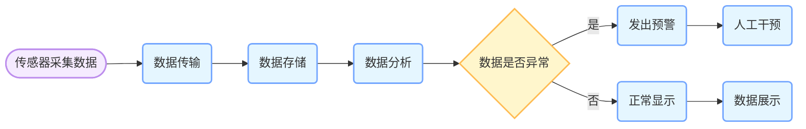

# 价值投资中的智能城市地下管网监测系统分析

> 关键词：价值投资、智能城市、地下管网监测系统、传感器技术、数据分析

> 摘要：本文聚焦于价值投资视角下的智能城市地下管网监测系统。首先介绍了该系统的背景，包括目的、预期读者等内容。接着深入剖析其核心概念与联系，阐述核心算法原理及具体操作步骤，运用数学模型和公式进行详细讲解与举例。通过项目实战展示代码实现与解读，探讨实际应用场景。推荐相关工具和资源，总结未来发展趋势与挑战，解答常见问题并提供扩展阅读与参考资料，旨在全面深入地分析智能城市地下管网监测系统，为价值投资者提供有价值的参考。

## 1. 背景介绍 
### 1.1 目的和范围
智能城市地下管网监测系统的目的在于保障城市地下管网的安全、高效运行。城市地下管网犹如城市的“生命线”，涵盖了供水、排水、燃气、热力、电力、通信等多种管线。然而，由于地下环境复杂、管线老化等原因，管网泄漏、破裂等事故时有发生，不仅影响城市正常运转，还可能造成环境污染和资源浪费。该监测系统通过实时采集管网运行数据，能够及时发现潜在问题并预警，为管网的维护和管理提供科学依据。

其范围包括对各类地下管网的压力、流量、温度、湿度、气体浓度等参数的监测，以及对管网设备状态的实时监控。同时，系统还应具备数据存储、分析、展示等功能，以便管理人员全面了解管网运行情况。

### 1.2 预期读者
本文的预期读者主要包括价值投资者、城市规划与管理者、管网运营维护人员、相关技术研发人员等。价值投资者希望通过了解智能城市地下管网监测系统的技术原理、应用前景和投资价值，做出明智的投资决策；城市规划与管理者可以从中获取系统建设和管理的思路，提升城市基础设施的智能化水平；管网运营维护人员能够借助系统的功能，提高管网维护效率和安全性；相关技术研发人员则可以在现有技术基础上进行创新和改进。

### 1.3 文档结构概述
本文将按照以下结构展开：首先介绍智能城市地下管网监测系统的背景信息，包括目的、预期读者和文档结构概述等；接着阐述核心概念与联系，通过文本示意图和 Mermaid 流程图展示系统的原理和架构；然后详细讲解核心算法原理及具体操作步骤，并使用 Python 源代码进行阐述；再介绍数学模型和公式，通过具体例子进行说明；之后进行项目实战，包括开发环境搭建、源代码实现和代码解读；探讨实际应用场景；推荐相关工具和资源；总结未来发展趋势与挑战；解答常见问题；最后提供扩展阅读与参考资料。

### 1.4 术语表
#### 1.4.1 核心术语定义
- **智能城市**：利用物联网、云计算、大数据等信息技术，对城市运行的各项数据进行全面感知、分析和管理，实现城市的智能化、可持续发展。
- **地下管网监测系统**：通过安装在地下管网中的各类传感器，实时采集管网运行数据，并将数据传输到监控中心进行分析和处理，以实现对地下管网的实时监测和管理的系统。
- **传感器**：一种能够感受被测量的信息，并将其按一定规律变换成为电信号或其他所需形式的信息输出，以满足信息的传输、处理、存储、显示、记录和控制等要求的检测装置。
- **物联网**：通过各种信息传感器、射频识别技术、全球定位系统、红外感应器、激光扫描器等各种装置与技术，实时采集任何需要监控、连接、互动的物体或过程，采集其声、光、热、电、力学、化学、生物、位置等各种需要的信息，通过各类可能的网络接入，实现物与物、物与人的泛在连接，实现对物品和过程的智能化感知、识别和管理。

#### 1.4.2 相关概念解释
- **数据采集**：从传感器等设备中获取管网运行数据的过程。
- **数据传输**：将采集到的数据通过有线或无线通信方式传输到监控中心的过程。
- **数据分析**：对采集到的数据进行处理、挖掘和分析，以提取有价值信息的过程。
- **预警机制**：根据数据分析结果，当管网运行参数超出正常范围时，及时发出警报的机制。

#### 1.4.3 缩略词列表
- **IoT**：Internet of Things（物联网）
- **GIS**：Geographic Information System（地理信息系统）
- **SCADA**：Supervisory Control and Data Acquisition（监控与数据采集系统）

## 2. 核心概念与联系 
智能城市地下管网监测系统主要由传感器层、数据传输层、数据处理层和应用层组成。其原理是通过传感器实时采集地下管网的运行数据，然后通过数据传输层将数据传输到数据处理层进行分析和处理，最后将处理结果呈现给应用层的用户，为管网的管理和决策提供支持。

### 文本示意图
```plaintext
智能城市地下管网监测系统
|-- 传感器层
|   |-- 压力传感器
|   |-- 流量传感器
|   |-- 温度传感器
|   |-- 湿度传感器
|   |-- 气体浓度传感器
|-- 数据传输层
|   |-- 有线通信
|   |-- 无线通信
|-- 数据处理层
|   |-- 数据存储
|   |-- 数据分析
|   |-- 数据挖掘
|-- 应用层
|   |-- 监控中心
|   |-- 移动端应用
|   |-- 决策支持系统
```

### Mermaid 流程图


## 3. 核心算法原理 & 具体操作步骤 
### 核心算法原理
在智能城市地下管网监测系统中，数据分析是核心环节之一，常用的算法包括异常检测算法和预测算法。这里以基于统计的异常检测算法为例进行讲解。

基于统计的异常检测算法的基本思想是通过对历史数据的统计分析，建立正常数据的分布模型，然后将实时采集的数据与该模型进行比较，若数据偏离正常范围，则认为是异常数据。

### 具体操作步骤
1. **数据预处理**：对采集到的原始数据进行清洗、去噪、归一化等处理，以提高数据质量。
2. **建立统计模型**：计算历史数据的均值 $\mu$ 和标准差 $\sigma$，假设数据服从正态分布 $N(\mu, \sigma^2)$。
3. **实时监测**：将实时采集的数据 $x$ 与统计模型进行比较，计算 $z$ 分数：$z = \frac{x - \mu}{\sigma}$。
4. **异常判断**：若 $|z| > k$（$k$ 为预设的阈值），则认为数据 $x$ 是异常数据。

### Python 源代码实现
```python
import numpy as np

# 模拟历史数据
historical_data = np.random.normal(loc=50, scale=10, size=1000)

# 计算均值和标准差
mean = np.mean(historical_data)
std = np.std(historical_data)

# 预设阈值
k = 3

# 模拟实时采集的数据
real_time_data = np.random.normal(loc=60, scale=10, size=10)

# 异常检测
for data in real_time_data:
    z_score = (data - mean) / std
    if abs(z_score) > k:
        print(f"数据 {data} 是异常数据")
    else:
        print(f"数据 {data} 是正常数据")
```

## 4. 数学模型和公式 & 详细讲解 & 举例说明 
### 数学模型
在智能城市地下管网监测系统中，许多问题可以用数学模型来描述。例如，在管网流量预测中，可以使用时间序列模型。时间序列模型是一种基于历史数据来预测未来值的统计模型，常用的时间序列模型包括自回归积分滑动平均模型（ARIMA）。

### ARIMA 模型公式
ARIMA 模型的一般形式为 $ARIMA(p, d, q)$，其中 $p$ 是自回归项的阶数，$d$ 是差分阶数，$q$ 是移动平均项的阶数。其数学表达式为：

$$\phi(B)(1 - B)^d Y_t = \theta(B)\epsilon_t$$

其中，$Y_t$ 是时间序列数据，$B$ 是滞后算子，$\phi(B) = 1 - \phi_1 B - \cdots - \phi_p B^p$ 是自回归多项式，$\theta(B) = 1 + \theta_1 B + \cdots + \theta_q B^q$ 是移动平均多项式，$\epsilon_t$ 是白噪声序列。

### 详细讲解
- **自回归项（AR）**：表示当前值与过去值之间的线性关系，阶数 $p$ 表示使用过去 $p$ 个时间点的值来预测当前值。
- **差分阶数（I）**：用于处理非平稳时间序列，通过差分将非平稳序列转换为平稳序列。
- **移动平均项（MA）**：表示当前值与过去预测误差之间的线性关系，阶数 $q$ 表示使用过去 $q$ 个时间点的预测误差来预测当前值。

### 举例说明
假设我们有一个城市某段供水管网的每日流量数据，我们可以使用 ARIMA 模型来预测未来几天的流量。以下是一个简单的 Python 示例：
```python
import pandas as pd
from statsmodels.tsa.arima.model import ARIMA

# 模拟流量数据
data = pd.Series([100, 102, 105, 103, 107, 106, 109, 108, 112, 110])

# 拟合 ARIMA 模型
model = ARIMA(data, order=(1, 1, 1))
model_fit = model.fit()

# 预测未来 3 天的流量
forecast = model_fit.get_forecast(steps=3)
print(forecast.predicted_mean)
```

## 5. 项目实战：代码实际案例和详细解释说明 
### 5.1  开发环境搭建
#### 硬件环境
- 传感器：根据监测需求选择合适的传感器，如压力传感器、流量传感器等。
- 数据传输设备：如无线传输模块、网关等。
- 服务器：用于存储和处理数据，可以选择云服务器或本地服务器。

#### 软件环境
- 操作系统：可以选择 Linux 或 Windows 操作系统。
- 数据库：如 MySQL、MongoDB 等，用于存储采集到的数据。
- 开发语言：Python 是一个不错的选择，因为它有丰富的数据分析和机器学习库。
- 开发框架：可以使用 Flask 或 Django 等 Web 框架来开发监控中心的 Web 应用。

### 5.2  源代码详细实现和代码解读
#### 数据采集模块
```python
import random
import time

# 模拟传感器数据采集
def collect_data():
    pressure = random.uniform(50, 100)  # 模拟压力数据
    flow = random.uniform(10, 50)  # 模拟流量数据
    return pressure, flow

# 定时采集数据
while True:
    pressure, flow = collect_data()
    print(f"压力: {pressure} Pa, 流量: {flow} m³/h")
    time.sleep(60)  # 每隔 60 秒采集一次数据
```
**代码解读**：该代码模拟了传感器数据的采集过程，通过 `random.uniform` 函数生成随机的压力和流量数据，并每隔 60 秒打印一次采集到的数据。

#### 数据传输模块
```python
import requests

# 模拟数据传输
def transmit_data(pressure, flow):
    url = "http://your_server_ip/api/data"  # 服务器接口地址
    data = {
        "pressure": pressure,
        "flow": flow
    }
    response = requests.post(url, json=data)
    if response.status_code == 200:
        print("数据传输成功")
    else:
        print("数据传输失败")
```
**代码解读**：该代码模拟了数据的传输过程，使用 `requests` 库将采集到的压力和流量数据发送到服务器的指定接口。

#### 数据处理模块
```python
import pandas as pd
from statsmodels.tsa.arima.model import ARIMA

# 模拟数据处理
def process_data(data):
    df = pd.DataFrame(data)
    # 假设对压力数据进行预测
    model = ARIMA(df['pressure'], order=(1, 1, 1))
    model_fit = model.fit()
    forecast = model_fit.get_forecast(steps=3)
    return forecast.predicted_mean
```
**代码解读**：该代码模拟了数据的处理过程，使用 ARIMA 模型对压力数据进行预测，并返回未来 3 个时间点的预测值。

### 5.3  代码解读与分析
- **数据采集模块**：该模块通过模拟传感器数据的采集，实现了数据的实时获取。在实际应用中，需要根据具体的传感器类型和接口协议进行数据采集。
- **数据传输模块**：该模块使用 `requests` 库将采集到的数据发送到服务器，实现了数据的远程传输。在实际应用中，需要考虑数据的安全性和可靠性，如使用加密传输、数据重传机制等。
- **数据处理模块**：该模块使用 ARIMA 模型对压力数据进行预测，实现了数据的分析和处理。在实际应用中，需要根据具体的需求选择合适的算法和模型，并进行参数调优。

## 6. 实际应用场景 
### 城市供水系统
在城市供水系统中，智能城市地下管网监测系统可以实时监测供水管网的压力、流量等参数，及时发现管网泄漏、爆管等事故，并发出预警。同时，通过对历史数据的分析和预测，可以合理调配水资源，提高供水效率。

### 城市排水系统
在城市排水系统中，该系统可以监测排水管网的水位、流量等参数，及时发现排水不畅、积水等问题，并采取相应的措施。例如，当水位超过警戒值时，自动启动排水泵，避免城市内涝。

### 城市燃气系统
在城市燃气系统中，智能城市地下管网监测系统可以实时监测燃气管网的压力、气体浓度等参数，及时发现燃气泄漏等安全隐患，并发出警报。同时，通过对燃气流量的分析和预测，可以合理调配燃气资源，提高供气安全性。

### 城市热力系统
在城市热力系统中，该系统可以监测热力管网的温度、压力、流量等参数，及时发现热力泄漏、供热不足等问题，并进行调整。例如，当温度低于设定值时，自动调节供热设备的功率，保证居民的供热需求。

## 7. 工具和资源推荐
### 7.1 学习资源推荐
#### 7.1.1 书籍推荐
- 《Python 数据分析实战》：介绍了 Python 在数据分析领域的应用，包括数据处理、可视化、机器学习等方面的内容。
- 《物联网技术与应用》：全面介绍了物联网的基本概念、技术原理和应用案例，对智能城市地下管网监测系统的学习有很大的帮助。
- 《时间序列分析及其应用》：详细讲解了时间序列分析的理论和方法，对于理解和应用 ARIMA 等时间序列模型有重要的指导作用。

#### 7.1.2 在线课程
- Coursera 上的 “Data Science Specialization”：由多所知名大学的教授授课，涵盖了数据科学的各个方面，包括数据分析、机器学习等。
- edX 上的 “Introduction to Internet of Things and Embedded Systems”：介绍了物联网和嵌入式系统的基本概念和技术，适合初学者学习。
- 中国大学 MOOC 上的 “传感器原理与应用”：系统讲解了传感器的原理、分类和应用，对于了解智能城市地下管网监测系统中的传感器技术有很大的帮助。

#### 7.1.3 技术博客和网站
- 博客园：有许多技术博主分享关于数据分析、物联网等领域的技术文章和经验。
- 开源中国：提供了丰富的开源项目和技术资讯，对于学习和实践智能城市地下管网监测系统有很大的帮助。
- 知乎：有许多关于智能城市、物联网等领域的讨论和分享，可以从中获取最新的技术动态和行业趋势。

### 7.2 开发工具框架推荐
#### 7.2.1 IDE和编辑器
- PyCharm：是一款专门为 Python 开发设计的集成开发环境，具有代码自动补全、调试等功能，适合 Python 开发者使用。
- Visual Studio Code：是一款轻量级的代码编辑器，支持多种编程语言，并且有丰富的插件扩展功能，适合快速开发和调试。

#### 7.2.2 调试和性能分析工具
- pdb：是 Python 自带的调试工具，可以帮助开发者定位代码中的问题。
- cProfile：是 Python 自带的性能分析工具，可以分析代码的运行时间和性能瓶颈。

#### 7.2.3 相关框架和库
- Flask：是一个轻量级的 Python Web 框架，适合快速开发 Web 应用。
- Django：是一个功能强大的 Python Web 框架，提供了丰富的功能和工具，适合开发大型 Web 应用。
- Pandas：是一个用于数据处理和分析的 Python 库，提供了丰富的数据结构和函数，方便进行数据清洗、转换和分析。
- Scikit-learn：是一个用于机器学习的 Python 库，提供了多种机器学习算法和工具，适合进行数据分析和预测。

### 7.3 相关论文著作推荐
#### 7.3.1 经典论文
- “A Survey on Internet of Things: Architecture, Enabling Technologies, Security and Privacy, and Applications”：全面介绍了物联网的架构、技术、安全和应用等方面的内容，是物联网领域的经典论文。
- “Time Series Forecasting Using ARIMA Model in Python”：详细介绍了使用 ARIMA 模型进行时间序列预测的方法和步骤，对于理解和应用 ARIMA 模型有重要的参考价值。

#### 7.3.2 最新研究成果
- 关注 IEEE Internet of Things Journal、ACM Transactions on Sensor Networks 等学术期刊，获取智能城市地下管网监测系统领域的最新研究成果。

#### 7.3.3 应用案例分析
- 可以参考一些实际的智能城市地下管网监测系统应用案例，了解系统的设计、实现和应用效果，从中获取经验和启示。

## 8. 总结：未来发展趋势与挑战
### 未来发展趋势
- **智能化程度不断提高**：随着人工智能、机器学习等技术的不断发展，智能城市地下管网监测系统将具备更强的数据分析和决策能力，实现更智能化的管网管理。
- **物联网技术的广泛应用**：物联网技术将进一步推动地下管网监测系统的发展，实现传感器的互联互通和数据的实时共享，提高系统的监测效率和准确性。
- **与其他系统的融合**：智能城市地下管网监测系统将与城市地理信息系统（GIS）、智慧城市管理平台等其他系统进行融合，实现数据的整合和共享，为城市的综合管理提供更全面的支持。

### 挑战
- **数据安全与隐私问题**：地下管网监测系统涉及大量的敏感数据，如管网布局、运行参数等，数据的安全和隐私保护是一个重要的挑战。
- **传感器的可靠性和稳定性**：传感器是地下管网监测系统的基础，其可靠性和稳定性直接影响系统的监测效果。如何提高传感器的性能和寿命是一个需要解决的问题。
- **系统的兼容性和互操作性**：由于地下管网监测系统涉及多个厂家的设备和系统，如何保证系统的兼容性和互操作性是一个挑战。

## 9. 附录：常见问题与解答
### 问题 1：智能城市地下管网监测系统的建设成本高吗？
解答：建设成本因系统规模、功能需求、传感器类型等因素而异。一般来说，大型的、功能复杂的系统建设成本相对较高，但从长期来看，该系统可以提高管网的管理效率，减少事故损失，具有较高的投资回报率。

### 问题 2：如何保证传感器数据的准确性？
解答：可以通过选择质量可靠的传感器、定期对传感器进行校准和维护、采用冗余设计等方法来保证传感器数据的准确性。

### 问题 3：智能城市地下管网监测系统可以与现有的管网管理系统集成吗？
解答：一般来说，通过开发相应的接口和协议，可以实现智能城市地下管网监测系统与现有的管网管理系统的集成，实现数据的共享和交互。

## 10. 扩展阅读 & 参考资料
- 《智能城市概论》
- 《传感器技术手册》
- IEEE 相关会议论文
- 各城市智能城市建设相关报告

作者：AI天才研究院/AI Genius Institute & 禅与计算机程序设计艺术 /Zen And The Art of Computer Programming