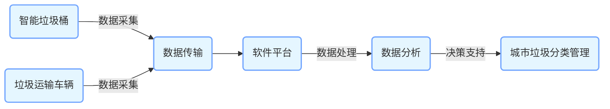

# 价值投资中的智能城市垃圾分类系统分析

> 关键词：价值投资、智能城市、垃圾分类系统、数据分析、物联网技术

> 摘要：本文围绕价值投资视角下的智能城市垃圾分类系统展开深入分析。首先介绍了该系统的背景，包括其目的、预期读者等。接着阐述了核心概念与联系，分析了核心算法原理及具体操作步骤，通过数学模型和公式进行理论支撑，并结合实际案例进行讲解。探讨了该系统的实际应用场景，推荐了相关工具和资源。最后总结了未来发展趋势与挑战，还包含常见问题解答和扩展阅读参考资料，旨在为关注智能城市垃圾分类系统的投资者、开发者等提供全面且深入的分析。

## 1. 背景介绍 
### 1.1 目的和范围
随着城市化进程的加速，城市垃圾的产生量日益增加，传统的垃圾分类处理方式已难以满足城市发展的需求。智能城市垃圾分类系统旨在利用先进的技术手段，实现垃圾的高效分类、收集和处理，提高资源利用率，减少环境污染。本分析的范围涵盖智能城市垃圾分类系统的各个方面，包括系统架构、技术原理、实际应用、投资价值等。

### 1.2 预期读者
本文的预期读者包括对智能城市建设、垃圾分类技术、价值投资等领域感兴趣的投资者、城市规划者、环保从业者、技术开发者以及相关研究人员。

### 1.3 文档结构概述
本文将首先介绍智能城市垃圾分类系统的背景知识，包括目的、预期读者等。然后阐述系统的核心概念与联系，分析核心算法原理和具体操作步骤，通过数学模型和公式进行理论支撑。接着通过项目实战案例详细说明系统的实现和代码解读。之后探讨系统的实际应用场景，推荐相关的工具和资源。最后总结未来发展趋势与挑战，提供常见问题解答和扩展阅读参考资料。

### 1.4 术语表
#### 1.4.1 核心术语定义
- **智能城市**：利用物联网、大数据、云计算等技术手段，实现城市管理智能化、高效化的城市发展模式。
- **垃圾分类系统**：将垃圾按照一定的标准进行分类收集、运输和处理的系统。
- **价值投资**：一种基于对资产内在价值的评估，寻找被低估的投资机会，以获取长期稳定收益的投资策略。
- **物联网（IoT）**：通过各种信息传感设备，将物品与互联网连接起来，实现物品的智能化识别、定位、跟踪、监控和管理的网络。
- **大数据**：指无法在一定时间范围内用常规软件工具进行捕捉、管理和处理的数据集合，是需要新处理模式才能具有更强的决策力、洞察发现力和流程优化能力的海量、高增长率和多样化的信息资产。

#### 1.4.2 相关概念解释
- **智能垃圾分类设备**：具备智能识别、自动分类等功能的设备，如智能垃圾桶、垃圾分类机器人等。
- **数据采集与传输**：通过传感器等设备采集垃圾相关数据，并将数据传输到后端服务器进行处理和分析。
- **数据分析与决策**：对采集到的垃圾数据进行分析，提取有价值的信息，为垃圾分类管理提供决策支持。

#### 1.4.3 缩略词列表
- **IoT**：Internet of Things（物联网）
- **AI**：Artificial Intelligence（人工智能）
- **ML**：Machine Learning（机器学习）
- **GIS**：Geographic Information System（地理信息系统）

## 2. 核心概念与联系 

智能城市垃圾分类系统主要由硬件设备、软件平台和数据分析三大部分组成。其核心概念原理和架构的文本示意图如下：

硬件设备包括智能垃圾桶、垃圾运输车辆等，这些设备通过传感器采集垃圾的重量、种类、位置等信息。软件平台负责接收和处理这些数据，实现对垃圾分类过程的管理和监控。数据分析则利用大数据和人工智能技术，对采集到的数据进行挖掘和分析，为城市垃圾分类管理提供决策支持。

Mermaid 流程图如下：


在这个系统中，各个部分相互关联、相互影响。硬件设备是数据采集的基础，软件平台是数据处理和管理的核心，数据分析则是系统发挥作用的关键。通过物联网技术，实现了硬件设备与软件平台之间的数据传输，使得整个系统能够实时、高效地运行。

## 3. 核心算法原理 & 具体操作步骤 

### 核心算法原理
智能城市垃圾分类系统中常用的核心算法包括机器学习算法和深度学习算法。以垃圾分类识别为例，我们可以使用卷积神经网络（Convolutional Neural Network，CNN）来实现垃圾图像的分类。

CNN 是一种专门用于处理具有网格结构数据的神经网络，如图像。它通过卷积层、池化层和全连接层等组件，自动提取图像的特征，并进行分类。

以下是一个简单的使用 Python 和 PyTorch 实现的 CNN 垃圾分类识别的代码示例：

```python
import torch
import torch.nn as nn
import torch.optim as optim
from torchvision import datasets, transforms
from torch.utils.data import DataLoader

# 定义数据预处理
transform = transforms.Compose([
    transforms.Resize((224, 224)),
    transforms.ToTensor(),
    transforms.Normalize(mean=[0.485, 0.456, 0.406], std=[0.229, 0.224, 0.225])
])

# 加载数据集
train_dataset = datasets.ImageFolder(root='train_data', transform=transform)
train_loader = DataLoader(train_dataset, batch_size=32, shuffle=True)

test_dataset = datasets.ImageFolder(root='test_data', transform=transform)
test_loader = DataLoader(test_dataset, batch_size=32, shuffle=False)

# 定义 CNN 模型
class GarbageClassifier(nn.Module):
    def __init__(self):
        super(GarbageClassifier, self).__init__()
        self.conv1 = nn.Conv2d(3, 16, kernel_size=3, padding=1)
        self.relu1 = nn.ReLU()
        self.pool1 = nn.MaxPool2d(2)
        self.conv2 = nn.Conv2d(16, 32, kernel_size=3, padding=1)
        self.relu2 = nn.ReLU()
        self.pool2 = nn.MaxPool2d(2)
        self.fc1 = nn.Linear(32 * 56 * 56, 128)
        self.relu3 = nn.ReLU()
        self.fc2 = nn.Linear(128, len(train_dataset.classes))

    def forward(self, x):
        x = self.pool1(self.relu1(self.conv1(x)))
        x = self.pool2(self.relu2(self.conv2(x)))
        x = x.view(-1, 32 * 56 * 56)
        x = self.relu3(self.fc1(x))
        x = self.fc2(x)
        return x

# 初始化模型、损失函数和优化器
model = GarbageClassifier()
criterion = nn.CrossEntropyLoss()
optimizer = optim.Adam(model.parameters(), lr=0.001)

# 训练模型
num_epochs = 10
for epoch in range(num_epochs):
    running_loss = 0.0
    for i, (images, labels) in enumerate(train_loader):
        optimizer.zero_grad()
        outputs = model(images)
        loss = criterion(outputs, labels)
        loss.backward()
        optimizer.step()
        running_loss += loss.item()
    print(f'Epoch {epoch + 1}, Loss: {running_loss / len(train_loader)}')

# 测试模型
correct = 0
total = 0
with torch.no_grad():
    for images, labels in test_loader:
        outputs = model(images)
        _, predicted = torch.max(outputs.data, 1)
        total += labels.size(0)
        correct += (predicted == labels).sum().item()

print(f'Accuracy: {100 * correct / total}%')
```

### 具体操作步骤
1. **数据采集**：使用智能垃圾桶上的摄像头等传感器采集垃圾的图像数据。
2. **数据预处理**：对采集到的图像数据进行裁剪、缩放、归一化等预处理操作，以提高模型的训练效果。
3. **模型训练**：使用预处理后的数据对 CNN 模型进行训练，调整模型的参数，使其能够准确地分类垃圾。
4. **模型部署**：将训练好的模型部署到智能垃圾桶或其他设备上，实现实时的垃圾分类识别。
5. **数据更新与优化**：随着垃圾种类的变化和数据的积累，不断更新训练数据，对模型进行优化，提高分类的准确性。

## 4. 数学模型和公式 & 详细讲解 & 举例说明 

### 数学模型
在智能城市垃圾分类系统中，我们可以使用概率模型来描述垃圾的分类过程。假设我们有 $n$ 种不同类型的垃圾，分别用 $C_1, C_2, \cdots, C_n$ 表示。对于一个给定的垃圾样本 $x$，我们希望计算它属于每种垃圾类型的概率 $P(C_i|x)$，其中 $i = 1, 2, \cdots, n$。

根据贝叶斯定理，我们有：

$$P(C_i|x) = \frac{P(x|C_i)P(C_i)}{P(x)}$$

其中，$P(x|C_i)$ 是在垃圾类型为 $C_i$ 的条件下，样本 $x$ 出现的概率，也称为似然概率；$P(C_i)$ 是垃圾类型 $C_i$ 出现的先验概率；$P(x)$ 是样本 $x$ 出现的概率，也称为证据概率。

### 详细讲解
- **似然概率 $P(x|C_i)$**：通常可以通过训练数据来估计。例如，在垃圾分类识别中，我们可以使用 CNN 模型来计算 $P(x|C_i)$，即模型预测样本 $x$ 属于垃圾类型 $C_i$ 的概率。
- **先验概率 $P(C_i)$**：可以根据历史数据或经验来估计。例如，如果在某个城市中，可回收垃圾的比例为 30%，有害垃圾的比例为 10%，厨余垃圾的比例为 50%，其他垃圾的比例为 10%，那么我们可以将这些比例作为相应垃圾类型的先验概率。
- **证据概率 $P(x)$**：可以通过对所有垃圾类型的似然概率和先验概率进行求和得到：

$$P(x) = \sum_{i=1}^{n}P(x|C_i)P(C_i)$$

### 举例说明
假设我们有三种垃圾类型：可回收垃圾（$C_1$）、厨余垃圾（$C_2$）和其他垃圾（$C_3$），它们的先验概率分别为 $P(C_1) = 0.3$，$P(C_2) = 0.5$，$P(C_3) = 0.2$。对于一个给定的垃圾样本 $x$，通过 CNN 模型计算得到的似然概率分别为 $P(x|C_1) = 0.6$，$P(x|C_2) = 0.3$，$P(x|C_3) = 0.1$。

首先，计算证据概率 $P(x)$：

$$P(x) = P(x|C_1)P(C_1) + P(x|C_2)P(C_2) + P(x|C_3)P(C_3)$$
$$= 0.6 \times 0.3 + 0.3 \times 0.5 + 0.1 \times 0.2$$
$$= 0.18 + 0.15 + 0.02$$
$$= 0.35$$

然后，计算样本 $x$ 属于每种垃圾类型的后验概率：

$$P(C_1|x) = \frac{P(x|C_1)P(C_1)}{P(x)} = \frac{0.6 \times 0.3}{0.35} \approx 0.514$$
$$P(C_2|x) = \frac{P(x|C_2)P(C_2)}{P(x)} = \frac{0.3 \times 0.5}{0.35} \approx 0.429$$
$$P(C_3|x) = \frac{P(x|C_3)P(C_3)}{P(x)} = \frac{0.1 \times 0.2}{0.35} \approx 0.057$$

根据后验概率，我们可以判断样本 $x$ 最有可能属于可回收垃圾类型。

## 5. 项目实战：代码实际案例和详细解释说明 

### 5.1  开发环境搭建
1. **安装 Python**：建议使用 Python 3.7 及以上版本，可以从 Python 官方网站（https://www.python.org/downloads/）下载并安装。
2. **安装 PyTorch**：根据自己的操作系统和 CUDA 版本，选择合适的安装命令。例如，在 Windows 系统上，使用以下命令安装 CPU 版本的 PyTorch：

```sh
pip install torch torchvision
```

3. **安装其他依赖库**：安装 `numpy`、`matplotlib` 等常用的 Python 库：

```sh
pip install numpy matplotlib
```

### 5.2  源代码详细实现和代码解读
以下是一个完整的智能城市垃圾分类系统的代码示例，包括数据采集、模型训练、模型评估等部分。

```python
import torch
import torch.nn as nn
import torch.optim as optim
from torchvision import datasets, transforms
from torch.utils.data import DataLoader
import numpy as np
import matplotlib.pyplot as plt

# 定义数据预处理
transform = transforms.Compose([
    transforms.Resize((224, 224)),
    transforms.ToTensor(),
    transforms.Normalize(mean=[0.485, 0.456, 0.406], std=[0.229, 0.224, 0.225])
])

# 加载数据集
train_dataset = datasets.ImageFolder(root='train_data', transform=transform)
train_loader = DataLoader(train_dataset, batch_size=32, shuffle=True)

test_dataset = datasets.ImageFolder(root='test_data', transform=transform)
test_loader = DataLoader(test_dataset, batch_size=32, shuffle=False)

# 定义 CNN 模型
class GarbageClassifier(nn.Module):
    def __init__(self):
        super(GarbageClassifier, self).__init__()
        self.conv1 = nn.Conv2d(3, 16, kernel_size=3, padding=1)
        self.relu1 = nn.ReLU()
        self.pool1 = nn.MaxPool2d(2)
        self.conv2 = nn.Conv2d(16, 32, kernel_size=3, padding=1)
        self.relu2 = nn.ReLU()
        self.pool2 = nn.MaxPool2d(2)
        self.fc1 = nn.Linear(32 * 56 * 56, 128)
        self.relu3 = nn.ReLU()
        self.fc2 = nn.Linear(128, len(train_dataset.classes))

    def forward(self, x):
        x = self.pool1(self.relu1(self.conv1(x)))
        x = self.pool2(self.relu2(self.conv2(x)))
        x = x.view(-1, 32 * 56 * 56)
        x = self.relu3(self.fc1(x))
        x = self.fc2(x)
        return x

# 初始化模型、损失函数和优化器
model = GarbageClassifier()
criterion = nn.CrossEntropyLoss()
optimizer = optim.Adam(model.parameters(), lr=0.001)

# 训练模型
num_epochs = 10
train_losses = []
for epoch in range(num_epochs):
    running_loss = 0.0
    for i, (images, labels) in enumerate(train_loader):
        optimizer.zero_grad()
        outputs = model(images)
        loss = criterion(outputs, labels)
        loss.backward()
        optimizer.step()
        running_loss += loss.item()
    train_loss = running_loss / len(train_loader)
    train_losses.append(train_loss)
    print(f'Epoch {epoch + 1}, Loss: {train_loss}')

# 绘制训练损失曲线
plt.plot(train_losses)
plt.xlabel('Epoch')
plt.ylabel('Loss')
plt.title('Training Loss')
plt.show()

# 测试模型
correct = 0
total = 0
with torch.no_grad():
    for images, labels in test_loader:
        outputs = model(images)
        _, predicted = torch.max(outputs.data, 1)
        total += labels.size(0)
        correct += (predicted == labels).sum().item()

print(f'Accuracy: {100 * correct / total}%')
```

### 代码解读与分析
1. **数据预处理**：使用 `transforms.Compose` 定义了一系列的数据预处理操作，包括图像的缩放、转换为张量和归一化。
2. **数据集加载**：使用 `datasets.ImageFolder` 加载训练集和测试集，并使用 `DataLoader` 进行数据的批量加载。
3. **模型定义**：定义了一个简单的 CNN 模型 `GarbageClassifier`，包括卷积层、池化层和全连接层。
4. **模型训练**：使用交叉熵损失函数和 Adam 优化器对模型进行训练，记录每个 epoch 的训练损失。
5. **训练损失曲线绘制**：使用 `matplotlib` 绘制训练损失曲线，直观地展示模型的训练过程。
6. **模型评估**：在测试集上评估模型的准确率，计算分类正确的样本数占总样本数的比例。

## 6. 实际应用场景 
### 城市社区
在城市社区中，智能城市垃圾分类系统可以安装在各个垃圾桶站点。居民投放垃圾时，智能垃圾桶可以自动识别垃圾的类型，并进行分类存储。同时，系统可以实时监测垃圾桶的装满程度，当垃圾桶快满时，及时通知垃圾运输车辆进行清理，提高垃圾收集的效率。

### 商业场所
在商场、超市、写字楼等商业场所，智能垃圾分类系统可以帮助商家更好地管理垃圾。例如，商场可以根据不同区域的垃圾产生情况，合理安排垃圾桶的数量和位置。同时，通过对垃圾数据的分析，商家可以了解消费者的消费习惯和行为模式，为商业决策提供参考。

### 工业园区
在工业园区中，智能垃圾分类系统可以对工业垃圾进行分类处理，提高资源的回收利用率。例如，对于可回收的金属、塑料等垃圾，可以进行回收再利用；对于有害垃圾，可以进行专门的处理，减少对环境的污染。

### 旅游景区
在旅游景区，智能垃圾分类系统可以提高游客的环保意识，促进景区的可持续发展。景区可以在各个景点设置智能垃圾桶，引导游客正确分类投放垃圾。同时，系统可以对景区的垃圾产生情况进行实时监测和分析，为景区的管理和规划提供数据支持。

## 7. 工具和资源推荐
### 7.1 学习资源推荐
#### 7.1.1 书籍推荐
- 《深度学习》（Ian Goodfellow、Yoshua Bengio 和 Aaron Courville 著）：全面介绍了深度学习的基本原理和算法，是深度学习领域的经典教材。
- 《Python 机器学习》（Sebastian Raschka 著）：详细介绍了使用 Python 进行机器学习的方法和技巧，适合初学者入门。
- 《智能城市：概念、技术与应用》（郑新奇 等著）：系统介绍了智能城市的概念、技术和应用，对智能城市垃圾分类系统的研究有一定的参考价值。

#### 7.1.2 在线课程
- Coursera 上的“深度学习专项课程”（Deep Learning Specialization）：由 Andrew Ng 教授授课，内容涵盖深度学习的各个方面，包括神经网络、卷积神经网络、循环神经网络等。
- edX 上的“人工智能基础”（Introduction to Artificial Intelligence）：介绍了人工智能的基本概念、算法和应用，是学习人工智能的入门课程。
- 中国大学 MOOC 上的“物联网技术与应用”：系统介绍了物联网的基本原理、技术和应用，对智能城市垃圾分类系统的技术实现有一定的帮助。

#### 7.1.3 技术博客和网站
- Medium：一个汇聚了众多技术专家和开发者的博客平台，上面有很多关于人工智能、物联网、智能城市等领域的技术文章和经验分享。
- 开源中国（https://www.oschina.net/）：国内知名的开源技术社区，提供了丰富的开源项目和技术资源。
- 智东西（https://www.zixiaomi.com/）：专注于智能科技领域的媒体平台，提供了智能城市、人工智能、物联网等领域的最新资讯和深度报道。

### 7.2 开发工具框架推荐
#### 7.2.1 IDE和编辑器
- PyCharm：一款专门为 Python 开发设计的集成开发环境（IDE），提供了丰富的功能和插件，方便开发者进行代码编写、调试和管理。
- Visual Studio Code：一款轻量级的代码编辑器，支持多种编程语言和插件扩展，具有强大的代码编辑和调试功能。
- Jupyter Notebook：一种交互式的开发环境，适合进行数据探索、模型训练和可视化等工作。

#### 7.2.2 调试和性能分析工具
- TensorBoard：TensorFlow 提供的可视化工具，可以帮助开发者可视化模型的训练过程、损失曲线、准确率等指标，方便进行模型调试和优化。
- PyTorch Profiler：PyTorch 提供的性能分析工具，可以帮助开发者分析模型的性能瓶颈，优化模型的运行效率。
- cProfile：Python 内置的性能分析工具，可以帮助开发者分析 Python 代码的性能瓶颈，找出耗时较长的函数和代码段。

#### 7.2.3 相关框架和库
- PyTorch：一个开源的深度学习框架，提供了丰富的深度学习模型和工具，支持 GPU 加速，方便开发者进行模型训练和部署。
- TensorFlow：另一个开源的深度学习框架，具有广泛的应用场景和社区支持，提供了丰富的深度学习模型和工具。
- Scikit-learn：一个开源的机器学习库，提供了各种机器学习算法和工具，适合进行数据预处理、模型选择和评估等工作。

### 7.3 相关论文著作推荐
#### 7.3.1 经典论文
- “ImageNet Classification with Deep Convolutional Neural Networks”（Alex Krizhevsky、Ilya Sutskever 和 Geoffrey E. Hinton 著）：介绍了 AlexNet 卷积神经网络，开创了深度学习在图像分类领域的先河。
- “Long Short-Term Memory”（Sepp Hochreiter 和 Jürgen Schmidhuber 著）：介绍了长短期记忆网络（LSTM），解决了传统循环神经网络中的梯度消失和梯度爆炸问题。
- “A Survey on Internet of Things: Architecture, Enabling Technologies, Security and Privacy, and Applications”（Jiankun Hu 等著）：对物联网的架构、技术、安全和应用等方面进行了全面的综述。

#### 7.3.2 最新研究成果
- 可以通过 IEEE Xplore、ACM Digital Library、ScienceDirect 等学术数据库，搜索关于智能城市、垃圾分类、物联网等领域的最新研究成果。

#### 7.3.3 应用案例分析
- 可以参考一些实际的智能城市垃圾分类系统的应用案例，了解系统的设计、实现和运营情况。例如，上海市的智能垃圾分类系统、新加坡的智能城市项目等。

## 8. 总结：未来发展趋势与挑战
### 未来发展趋势
- **智能化程度不断提高**：随着人工智能、物联网等技术的不断发展，智能城市垃圾分类系统的智能化程度将不断提高。例如，智能垃圾桶将具备更强大的识别能力和自主决策能力，能够自动处理复杂的垃圾情况。
- **数据驱动的决策支持**：通过对大量垃圾数据的分析和挖掘，智能城市垃圾分类系统将为城市管理部门提供更加科学、准确的决策支持。例如，根据垃圾产生的时间、地点、种类等信息，合理安排垃圾收集和处理的路线和时间。
- **与其他系统的融合**：智能城市垃圾分类系统将与城市的其他智能系统，如交通系统、能源系统等进行融合，实现城市的整体智能化管理。例如，通过与交通系统的融合，优化垃圾运输车辆的行驶路线，减少交通拥堵和能源消耗。
- **可持续发展理念的深入贯彻**：智能城市垃圾分类系统将更加注重可持续发展理念的贯彻，提高资源的回收利用率，减少对环境的污染。例如，开发更加高效的垃圾处理技术，将垃圾转化为可再生能源。

### 挑战
- **技术难题**：虽然人工智能、物联网等技术已经取得了很大的进展，但在智能城市垃圾分类系统中，仍然存在一些技术难题需要解决。例如，如何提高垃圾识别的准确率、如何保证数据的安全和隐私等。
- **成本问题**：智能城市垃圾分类系统的建设和运营需要大量的资金投入，包括硬件设备的采购、软件平台的开发、数据的存储和分析等。如何降低系统的成本，提高系统的性价比，是一个需要解决的问题。
- **用户习惯的改变**：推广智能城市垃圾分类系统需要改变居民的垃圾投放习惯，提高居民的环保意识。这需要政府、社区和媒体等多方面的宣传和教育，是一个长期而艰巨的任务。
- **政策法规的不完善**：目前，我国关于智能城市垃圾分类系统的政策法规还不够完善，缺乏统一的标准和规范。这给系统的建设和运营带来了一定的困难，需要政府加快相关政策法规的制定和完善。

## 9. 附录：常见问题与解答
### 1. 智能城市垃圾分类系统的准确率有多高？
智能城市垃圾分类系统的准确率取决于多种因素，如垃圾图像的质量、模型的训练数据和算法等。一般来说，经过优化的系统在实验室环境下的准确率可以达到 90% 以上，但在实际应用中，由于环境的复杂性和垃圾的多样性，准确率可能会有所下降。

### 2. 智能城市垃圾分类系统的成本高吗？
智能城市垃圾分类系统的成本包括硬件设备成本、软件平台开发成本、数据存储和分析成本等。具体成本取决于系统的规模和功能需求。一般来说，大型的智能城市垃圾分类系统的成本较高，但随着技术的发展和规模的扩大，成本会逐渐降低。

### 3. 如何保证智能城市垃圾分类系统的数据安全和隐私？
为了保证智能城市垃圾分类系统的数据安全和隐私，可以采取以下措施：
- 采用加密技术对数据进行加密处理，防止数据在传输和存储过程中被窃取。
- 建立严格的用户权限管理机制，只有授权用户才能访问和处理数据。
- 定期对系统进行安全漏洞扫描和修复，防止黑客攻击。

### 4. 智能城市垃圾分类系统对居民有什么好处？
智能城市垃圾分类系统对居民有以下好处：
- 提高生活环境质量：通过正确分类投放垃圾，可以减少垃圾对环境的污染，提高生活环境的质量。
- 促进资源回收利用：智能城市垃圾分类系统可以提高垃圾的分类准确率，促进资源的回收利用，减少资源的浪费。
- 增强环保意识：智能城市垃圾分类系统可以通过宣传和教育，增强居民的环保意识，培养居民的环保习惯。

## 10. 扩展阅读 & 参考资料
- 《智能城市建设与发展》
- 《物联网技术与应用案例分析》
- 相关行业报告和研究论文
- 智能城市垃圾分类系统的官方网站和技术文档

作者：AI天才研究院/AI Genius Institute & 禅与计算机程序设计艺术 /Zen And The Art of Computer Programming