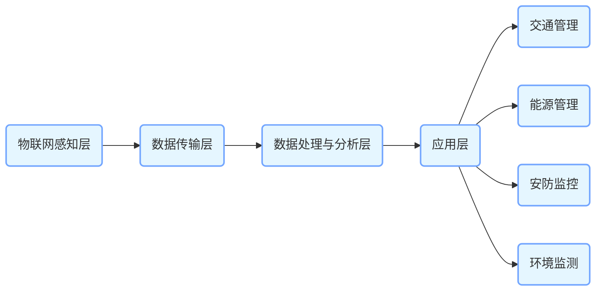

# 价值投资中的智能城市基础设施分析

> 关键词：价值投资、智能城市基础设施、数据分析、投资策略、技术架构、数学模型、实际应用

> 摘要：本文聚焦于价值投资领域中智能城市基础设施的分析。首先介绍了相关背景，包括目的、预期读者、文档结构和术语表。接着阐述了智能城市基础设施的核心概念与联系，展示了其原理和架构。详细讲解了核心算法原理及具体操作步骤，并运用Python代码进行说明。同时给出了数学模型和公式，并举例说明。通过项目实战，呈现了代码实际案例并进行详细解释。分析了智能城市基础设施在实际中的应用场景，推荐了学习、开发工具和相关论文著作。最后总结了未来发展趋势与挑战，还提供了常见问题解答和扩展阅读参考资料，旨在为投资者在智能城市基础设施领域的价值投资提供全面且深入的指导。

## 1. 背景介绍 
### 1.1 目的和范围
价值投资一直是金融领域的重要策略，而随着科技的发展，智能城市基础设施成为了一个极具潜力的投资方向。本文的目的在于深入分析价值投资中的智能城市基础设施，探讨如何通过科学的方法评估其投资价值，为投资者提供决策依据。范围涵盖智能城市基础设施的各个方面，包括但不限于交通、能源、通信、安防等领域的智能系统。

### 1.2 预期读者
本文预期读者主要包括金融投资者、投资分析师、智能城市建设相关的技术人员和管理人员。对于投资者而言，可从中获取关于智能城市基础设施投资的专业分析和策略建议；技术人员和管理人员则能了解价值投资视角下智能城市基础设施的发展需求和方向。

### 1.3 文档结构概述
本文将按照以下结构展开：首先介绍核心概念与联系，让读者对智能城市基础设施有清晰的认识；接着阐述核心算法原理和具体操作步骤，并用Python代码进行详细说明；然后给出数学模型和公式，并举例说明其应用；通过项目实战展示代码实际案例和详细解释；分析实际应用场景；推荐学习、开发工具和相关论文著作；最后总结未来发展趋势与挑战，提供常见问题解答和扩展阅读参考资料。

### 1.4 术语表
#### 1.4.1 核心术语定义
- **价值投资**：一种基于对资产内在价值评估的投资策略，投资者通过分析公司的财务状况、行业前景等因素，寻找被低估的资产进行投资。
- **智能城市基础设施**：利用现代信息技术，如物联网、大数据、人工智能等，对城市的交通、能源、通信、安防等基础设施进行智能化升级和管理，以提高城市的运行效率和居民的生活质量。
- **投资回报率（ROI）**：指投资所获得的收益与投资成本的比率，用于衡量投资的盈利能力。
- **数据挖掘**：从大量的数据中提取有价值的信息和知识的过程。

#### 1.4.2 相关概念解释
- **物联网（IoT）**：通过各种信息传感器、射频识别技术、全球定位系统等各种装置与技术，实时采集任何需要监控、 连接、互动的物体或过程，采集其声、光、热、电、力学、化学、生物、位置等各种需要的信息，通过各类可能的网络接入，实现物与物、物与人的泛在连接，实现对物品和过程的智能化感知、识别和管理。
- **大数据**：指无法在一定时间范围内用常规软件工具进行捕捉、管理和处理的数据集合，是需要新处理模式才能具有更强的决策力、洞察发现力和流程优化能力的海量、高增长率和多样化的信息资产。
- **人工智能（AI）**：研究、开发用于模拟、延伸和扩展人的智能的理论、方法、技术及应用系统的一门新的技术科学。

#### 1.4.3 缩略词列表
- **ROI**：Return on Investment（投资回报率）
- **IoT**：Internet of Things（物联网）
- **AI**：Artificial Intelligence（人工智能）
- **ML**：Machine Learning（机器学习）

## 2. 核心概念与联系 

### 智能城市基础设施的核心概念
智能城市基础设施是一个复杂的系统，它将信息技术与城市的物理基础设施相结合，实现城市运行的智能化和高效化。其核心概念包括以下几个方面：

#### 物联网感知层
物联网感知层是智能城市基础设施的基础，它通过各种传感器设备，如温度传感器、湿度传感器、压力传感器、摄像头等，实时采集城市运行中的各种数据，包括环境数据、交通数据、能源数据等。这些数据是智能城市决策和管理的重要依据。

#### 数据传输层
数据传输层负责将感知层采集到的数据传输到数据处理中心。常用的传输技术包括有线网络（如以太网、光纤等）和无线网络（如Wi-Fi、蓝牙、ZigBee、4G/5G等）。数据传输的稳定性和可靠性对于智能城市的正常运行至关重要。

#### 数据处理与分析层
数据处理与分析层是智能城市基础设施的核心。它利用大数据和人工智能技术，对采集到的数据进行存储、处理和分析，挖掘数据中的潜在价值，为城市管理和决策提供支持。常见的数据分析技术包括机器学习、深度学习、数据挖掘等。

#### 应用层
应用层是智能城市基础设施的最终体现，它将数据分析的结果应用到城市的各个领域，如交通管理、能源管理、安防监控、环境监测等，实现城市的智能化管理和服务。

### 核心概念的架构示意图


### 各概念之间的联系
物联网感知层是数据的来源，它为整个智能城市基础设施提供了基础数据。数据传输层将感知层采集到的数据准确、及时地传输到数据处理与分析层。数据处理与分析层对数据进行深入挖掘和分析，提取有价值的信息和知识。应用层则将这些信息和知识应用到具体的城市管理和服务中，实现智能城市的目标。各层之间相互依存、相互影响，共同构成了一个完整的智能城市基础设施体系。

## 3. 核心算法原理 & 具体操作步骤 

### 核心算法原理
在价值投资中的智能城市基础设施分析中，常用的核心算法包括机器学习算法和数据分析算法。这里以线性回归算法为例，介绍其原理。

线性回归是一种用于建立自变量和因变量之间线性关系的统计方法。假设我们有一组数据 $(x_1, y_1), (x_2, y_2), \cdots, (x_n, y_n)$，其中 $x_i$ 是自变量，$y_i$ 是因变量。线性回归的目标是找到一条直线 $y = \beta_0 + \beta_1x$，使得该直线能够最好地拟合这组数据。

线性回归的损失函数通常采用均方误差（MSE），即：

$$MSE = \frac{1}{n}\sum_{i = 1}^{n}(y_i - (\beta_0 + \beta_1x_i))^2$$

我们的目标是找到 $\beta_0$ 和 $\beta_1$ 的值，使得 MSE 最小。可以通过最小二乘法来求解 $\beta_0$ 和 $\beta_1$ 的值，其公式如下：

$$\beta_1 = \frac{\sum_{i = 1}^{n}(x_i - \bar{x})(y_i - \bar{y})}{\sum_{i = 1}^{n}(x_i - \bar{x})^2}$$

$$\beta_0 = \bar{y} - \beta_1\bar{x}$$

其中，$\bar{x}$ 和 $\bar{y}$ 分别是 $x$ 和 $y$ 的平均值。

### 具体操作步骤

#### 步骤1：数据收集
收集与智能城市基础设施相关的数据，如交通流量、能源消耗、安防事件等。数据可以来自传感器设备、数据库、网络爬虫等。

#### 步骤2：数据预处理
对收集到的数据进行预处理，包括数据清洗、数据转换、数据归一化等。数据清洗用于去除数据中的噪声和异常值；数据转换用于将数据转换为适合算法处理的格式；数据归一化用于将数据缩放到一个固定的范围内，提高算法的稳定性和准确性。

#### 步骤3：特征选择
从预处理后的数据中选择与投资价值相关的特征。特征选择可以通过相关性分析、方差分析等方法来实现，以减少数据的维度，提高算法的效率。

#### 步骤4：模型训练
使用选择好的特征和标签数据，对线性回归模型进行训练。训练过程中，通过最小化损失函数来更新模型的参数 $\beta_0$ 和 $\beta_1$。

#### 步骤5：模型评估
使用测试数据对训练好的模型进行评估，计算模型的评估指标，如均方误差（MSE）、均方根误差（RMSE）、决定系数（$R^2$）等。评估指标用于衡量模型的性能和预测能力。

#### 步骤6：投资决策
根据模型的预测结果，结合投资策略和风险偏好，做出投资决策。

### Python代码实现
```python
import numpy as np

# 步骤1：数据收集（这里使用示例数据）
x = np.array([1, 2, 3, 4, 5])
y = np.array([2, 4, 6, 8, 10])

# 步骤2：数据预处理（这里假设数据已经清洗和归一化）

# 步骤3：特征选择（这里使用全部特征）

# 步骤4：模型训练
n = len(x)
x_mean = np.mean(x)
y_mean = np.mean(y)

# 计算 β1
numerator = np.sum((x - x_mean) * (y - y_mean))
denominator = np.sum((x - x_mean) ** 2)
beta_1 = numerator / denominator

# 计算 β0
beta_0 = y_mean - beta_1 * x_mean

print(f"β0: {beta_0}, β1: {beta_1}")

# 步骤5：模型评估
y_pred = beta_0 + beta_1 * x
mse = np.mean((y - y_pred) ** 2)
print(f"均方误差 (MSE): {mse}")

# 步骤6：投资决策（这里只是示例，实际中需要结合更多因素）
if mse < 1:
    print("模型表现良好，可以考虑投资")
else:
    print("模型表现不佳，谨慎投资")
```

## 4. 数学模型和公式 & 详细讲解 & 举例说明 

### 线性回归数学模型
线性回归的数学模型可以表示为：

$$y = \beta_0 + \beta_1x_1 + \beta_2x_2 + \cdots + \beta_nx_n + \epsilon$$

其中，$y$ 是因变量，$x_1, x_2, \cdots, x_n$ 是自变量，$\beta_0, \beta_1, \cdots, \beta_n$ 是模型的参数，$\epsilon$ 是误差项。

### 最小二乘法公式推导
最小二乘法的目标是最小化均方误差（MSE），即：

$$MSE = \frac{1}{n}\sum_{i = 1}^{n}(y_i - (\beta_0 + \beta_1x_{i1} + \beta_2x_{i2} + \cdots + \beta_nx_{in}))^2$$

为了找到使 MSE 最小的 $\beta_0, \beta_1, \cdots, \beta_n$ 的值，我们对 MSE 分别求关于 $\beta_0, \beta_1, \cdots, \beta_n$ 的偏导数，并令其等于 0。

以简单线性回归（$n = 1$）为例，对 MSE 求关于 $\beta_0$ 和 $\beta_1$ 的偏导数：

$$\frac{\partial MSE}{\partial \beta_0} = -\frac{2}{n}\sum_{i = 1}^{n}(y_i - (\beta_0 + \beta_1x_i)) = 0$$

$$\frac{\partial MSE}{\partial \beta_1} = -\frac{2}{n}\sum_{i = 1}^{n}(y_i - (\beta_0 + \beta_1x_i))x_i = 0$$

解上述方程组，得到：

$$\beta_1 = \frac{\sum_{i = 1}^{n}(x_i - \bar{x})(y_i - \bar{y})}{\sum_{i = 1}^{n}(x_i - \bar{x})^2}$$

$$\beta_0 = \bar{y} - \beta_1\bar{x}$$

### 举例说明
假设我们要分析智能城市中交通流量与投资回报率之间的关系。我们收集了以下数据：

| 交通流量（千辆/天） | 投资回报率（%） |
|---------------------|------------------|
| 10                  | 5                |
| 20                  | 8                |
| 30                  | 12               |
| 40                  | 15               |
| 50                  | 20               |

我们可以使用线性回归模型来建立交通流量和投资回报率之间的关系。

```python
import numpy as np

# 数据
x = np.array([10, 20, 30, 40, 50])
y = np.array([5, 8, 12, 15, 20])

# 计算 β1
n = len(x)
x_mean = np.mean(x)
y_mean = np.mean(y)
numerator = np.sum((x - x_mean) * (y - y_mean))
denominator = np.sum((x - x_mean) ** 2)
beta_1 = numerator / denominator

# 计算 β0
beta_0 = y_mean - beta_1 * x_mean

print(f"β0: {beta_0}, β1: {beta_1}")

# 预测当交通流量为 60 千辆/天时的投资回报率
x_new = 60
y_pred = beta_0 + beta_1 * x_new
print(f"当交通流量为 {x_new} 千辆/天时，预测投资回报率为 {y_pred}%")
```

通过上述代码，我们可以得到线性回归模型的参数 $\beta_0$ 和 $\beta_1$，并预测当交通流量为 60 千辆/天时的投资回报率。

## 5. 项目实战：代码实际案例和详细解释说明 

### 5.1  开发环境搭建
#### 操作系统
可以选择 Windows、Linux 或 macOS 操作系统。这里以 Windows 为例进行说明。

#### Python 安装
从 Python 官方网站（https://www.python.org/downloads/） 下载并安装 Python 3.x 版本。安装过程中，记得勾选“Add Python to PATH”选项，以便在命令行中可以直接使用 Python。

#### 开发工具
推荐使用 PyCharm 作为开发工具。PyCharm 是一款功能强大的 Python 集成开发环境（IDE），提供了代码编辑、调试、版本控制等功能。可以从 JetBrains 官方网站（https://www.jetbrains.com/pycharm/download/） 下载并安装 PyCharm 社区版。

#### 第三方库安装
在命令行中使用以下命令安装所需的第三方库：

```sh
pip install numpy pandas scikit-learn matplotlib
```

### 5.2  源代码详细实现和代码解读
```python
import numpy as np
import pandas as pd
from sklearn.model_selection import train_test_split
from sklearn.linear_model import LinearRegression
from sklearn.metrics import mean_squared_error
import matplotlib.pyplot as plt

# 步骤1：数据收集
# 假设我们有一个包含智能城市基础设施相关数据的 CSV 文件
data = pd.read_csv('smart_city_data.csv')

# 步骤2：数据预处理
# 分离特征和标签
X = data.drop('investment_return', axis=1)
y = data['investment_return']

# 划分训练集和测试集
X_train, X_test, y_train, y_test = train_test_split(X, y, test_size=0.2, random_state=42)

# 步骤3：特征选择（这里暂时不进行特征选择）

# 步骤4：模型训练
model = LinearRegression()
model.fit(X_train, y_train)

# 步骤5：模型评估
y_pred = model.predict(X_test)
mse = mean_squared_error(y_test, y_pred)
print(f"均方误差 (MSE): {mse}")

# 步骤6：可视化结果
plt.scatter(y_test, y_pred)
plt.xlabel('实际投资回报率')
plt.ylabel('预测投资回报率')
plt.title('实际投资回报率 vs 预测投资回报率')
plt.show()
```

### 5.3  代码解读与分析
#### 数据收集
使用 `pandas` 库的 `read_csv` 函数读取包含智能城市基础设施相关数据的 CSV 文件。

#### 数据预处理
- 使用 `drop` 方法分离特征和标签。
- 使用 `train_test_split` 函数将数据划分为训练集和测试集，其中测试集占总数据的 20%。

#### 特征选择
这里暂时不进行特征选择，使用所有特征进行模型训练。

#### 模型训练
使用 `sklearn` 库的 `LinearRegression` 类创建线性回归模型，并使用训练集数据进行训练。

#### 模型评估
使用 `mean_squared_error` 函数计算模型在测试集上的均方误差（MSE），评估模型的性能。

#### 可视化结果
使用 `matplotlib` 库绘制实际投资回报率和预测投资回报率的散点图，直观展示模型的预测效果。

## 6. 实际应用场景 
### 交通领域
在智能城市的交通领域，价值投资中的智能城市基础设施分析可以应用于以下方面：

#### 交通流量预测
通过分析历史交通流量数据和相关因素（如天气、时间、事件等），使用机器学习算法建立交通流量预测模型。投资者可以根据预测结果，判断交通基础设施（如道路、桥梁、地铁等）的投资价值。例如，如果预测某条道路的交通流量将持续增长，那么对该道路的扩建或改造投资可能具有较高的回报率。

#### 智能交通系统投资
智能交通系统（ITS）包括交通信号控制、智能停车、交通信息发布等。投资者可以通过分析智能交通系统的应用效果和市场需求，评估相关企业的投资价值。例如，某家企业开发的智能停车系统能够有效解决城市停车难问题，提高停车效率，那么对该企业的投资可能具有较好的前景。

### 能源领域
在能源领域，智能城市基础设施分析可以帮助投资者做出以下决策：

#### 能源消耗预测
通过分析城市的能源消耗数据和相关因素（如季节、气温、经济活动等），建立能源消耗预测模型。投资者可以根据预测结果，判断能源基础设施（如发电厂、变电站、新能源设施等）的投资价值。例如，如果预测某地区的能源需求将持续增长，那么对该地区的能源基础设施投资可能具有较高的回报率。

#### 智能能源管理系统投资
智能能源管理系统（IEMS）可以实现能源的实时监测、优化调度和节能控制。投资者可以通过分析智能能源管理系统的应用效果和市场需求，评估相关企业的投资价值。例如，某家企业开发的智能能源管理系统能够有效降低能源消耗，提高能源利用效率，那么对该企业的投资可能具有较好的前景。

### 安防领域
在安防领域，智能城市基础设施分析可以用于以下方面：

#### 安防事件预测
通过分析历史安防事件数据和相关因素（如地理位置、时间、人员流动等），建立安防事件预测模型。投资者可以根据预测结果，判断安防基础设施（如监控摄像头、报警系统、门禁系统等）的投资价值。例如，如果预测某地区的安防事件发生率将上升，那么对该地区的安防基础设施投资可能具有较高的回报率。

#### 智能安防系统投资
智能安防系统（ISS）包括视频监控、人脸识别、行为分析等。投资者可以通过分析智能安防系统的应用效果和市场需求，评估相关企业的投资价值。例如，某家企业开发的智能安防系统能够有效提高安防效率，降低安防成本，那么对该企业的投资可能具有较好的前景。

## 7. 工具和资源推荐
### 7.1 学习资源推荐
#### 7.1.1 书籍推荐
- 《Python 数据分析实战》：本书详细介绍了使用 Python 进行数据分析的方法和技巧，包括数据清洗、数据可视化、机器学习等内容，适合初学者入门。
- 《机器学习实战》：通过实际案例介绍了机器学习的基本算法和应用，包括分类、回归、聚类等，帮助读者快速掌握机器学习的实际应用。
- 《智能城市：技术、应用与挑战》：全面介绍了智能城市的概念、技术和应用，包括物联网、大数据、人工智能等在智能城市中的应用，适合对智能城市感兴趣的读者。

#### 7.1.2 在线课程
- Coursera 上的“机器学习”课程：由斯坦福大学教授 Andrew Ng 讲授，是机器学习领域的经典课程，适合初学者系统学习机器学习的理论和方法。
- edX 上的“Python 数据科学”课程：介绍了使用 Python 进行数据科学的基本方法和工具，包括 NumPy、Pandas、Matplotlib 等，适合对数据分析感兴趣的读者。
- Udemy 上的“智能城市技术与应用”课程：详细介绍了智能城市的技术架构和应用案例，包括交通、能源、安防等领域的智能系统，适合对智能城市技术感兴趣的读者。

#### 7.1.3 技术博客和网站
- Medium：是一个技术博客平台，上面有很多关于数据分析、机器学习、智能城市等领域的优秀文章，可以帮助读者了解最新的技术动态和应用案例。
- Kaggle：是一个数据科学竞赛平台，上面有很多数据集和竞赛项目，可以帮助读者提高数据分析和机器学习的实践能力。
- IEEE 智能城市网站：IEEE 是国际电气和电子工程师协会，其智能城市网站提供了关于智能城市的最新研究成果和技术报告，适合对智能城市研究感兴趣的读者。

### 7.2 开发工具框架推荐
#### 7.2.1 IDE和编辑器
- PyCharm：是一款功能强大的 Python 集成开发环境（IDE），提供了代码编辑、调试、版本控制等功能，适合 Python 开发。
- Jupyter Notebook：是一个交互式的笔记本环境，可以在浏览器中编写和运行代码，支持多种编程语言，适合数据分析和机器学习。
- Visual Studio Code：是一款轻量级的代码编辑器，支持多种编程语言和插件，适合快速开发和调试。

#### 7.2.2 调试和性能分析工具
- PDB：是 Python 自带的调试工具，可以在代码中设置断点，单步执行代码，查看变量的值，帮助开发者调试代码。
- cProfile：是 Python 自带的性能分析工具，可以分析代码的运行时间和函数调用次数，帮助开发者优化代码性能。
- TensorBoard：是 TensorFlow 提供的可视化工具，可以可视化神经网络的训练过程和性能指标，帮助开发者调试和优化深度学习模型。

#### 7.2.3 相关框架和库
- NumPy：是 Python 中用于科学计算的基础库，提供了高效的多维数组对象和数学函数，适合进行数据分析和机器学习。
- Pandas：是 Python 中用于数据处理和分析的库，提供了数据结构（如 DataFrame 和 Series）和数据操作方法，适合处理结构化数据。
- Scikit-learn：是 Python 中用于机器学习的库，提供了各种机器学习算法和工具，包括分类、回归、聚类等，适合进行机器学习模型的开发和评估。
- TensorFlow：是 Google 开发的深度学习框架，提供了高效的神经网络计算和模型训练工具，适合进行深度学习模型的开发和训练。

### 7.3 相关论文著作推荐
#### 7.3.1 经典论文
- “The Digital City: Strategies for Building Smart Urban Communities”：该论文介绍了数字城市的概念和建设策略，探讨了信息技术在城市发展中的应用和影响。
- “Smart Cities: A Definition”：该论文对智能城市的概念进行了明确的定义和阐述，分析了智能城市的特征和发展趋势。
- “Machine Learning for Smart Cities: A Survey”：该论文对机器学习在智能城市中的应用进行了全面的综述，包括交通、能源、环境等领域的应用案例和研究成果。

#### 7.3.2 最新研究成果
- 在 IEEE Transactions on Smart Cities、ACM Transactions on Sensor Networks 等学术期刊上可以找到关于智能城市基础设施的最新研究成果，包括新技术、新方法和新应用。
- 在国际智能城市会议（如 IEEE International Conference on Smart Cities）上可以了解到智能城市领域的最新研究动态和发展趋势。

#### 7.3.3 应用案例分析
- 《Smart Cities: Big Data, Civic Hackers, and the Quest for a New Utopia》：该书通过实际案例分析了智能城市的建设和发展，包括数据驱动的城市管理、公民参与和创新等方面的应用案例。
- 《The Smart City: Sustainable Urban Development with Information and Communication Technologies》：该书介绍了智能城市的可持续发展理念和实践，通过实际案例分析了信息技术在城市能源、交通、环境等领域的应用和效果。

## 8. 总结：未来发展趋势与挑战
### 未来发展趋势
#### 技术融合趋势
未来，智能城市基础设施将更加注重多种技术的融合，如物联网、大数据、人工智能、区块链等。例如，物联网技术可以实现城市设施的互联互通和数据采集，大数据技术可以对采集到的数据进行存储和分析，人工智能技术可以实现智能决策和自动化控制，区块链技术可以保障数据的安全和可信。这种技术融合将使智能城市基础设施更加智能化、高效化和安全化。

#### 绿色可持续发展趋势
随着全球对环境保护和可持续发展的重视，智能城市基础设施将更加注重绿色可持续发展。例如，在能源领域，将更多地采用可再生能源，如太阳能、风能等，并通过智能能源管理系统实现能源的高效利用和优化调度；在交通领域，将推广电动汽车和公共交通，减少碳排放，并通过智能交通系统提高交通效率和安全性。

#### 以人为本的发展趋势
未来的智能城市基础设施将更加注重以人为本，满足居民的需求和提高居民的生活质量。例如，在城市规划和建设中，将更加注重公共空间的设计和利用，提供更多的休闲娱乐设施和文化活动场所；在公共服务领域，将通过智能技术实现服务的个性化和便捷化，如智能医疗、智能教育等。

### 挑战
#### 数据安全和隐私问题
智能城市基础设施涉及大量的个人数据和敏感信息，如居民的位置信息、健康信息、消费信息等。如何保障这些数据的安全和隐私是一个重要的挑战。一方面，需要加强数据安全技术的研发和应用，如加密技术、访问控制技术等；另一方面，需要建立健全的数据安全法律法规和监管机制，加强对数据使用和管理的规范和监督。

#### 技术标准和互操作性问题
目前，智能城市基础设施领域存在多种技术标准和协议，不同的设备和系统之间可能存在互操作性问题。这给智能城市的建设和管理带来了一定的困难。需要加强技术标准的制定和统一，推动不同设备和系统之间的互联互通和互操作性。

#### 投资回报和商业模式问题
智能城市基础设施的建设需要大量的资金投入，如何确保投资的回报和建立可持续的商业模式是一个重要的挑战。一方面，需要对智能城市基础设施的投资价值进行科学评估，合理规划投资项目和投资规模；另一方面，需要探索创新的商业模式，如政府与社会资本合作（PPP）模式、数据共享和交易模式等，提高投资的回报率和可持续性。

## 9. 附录：常见问题与解答
### 问题1：智能城市基础设施投资的风险有哪些？
智能城市基础设施投资的风险主要包括技术风险、市场风险、政策风险等。技术风险是指由于技术发展不成熟或技术更新换代快，导致投资项目的技术过时或无法实现预期目标；市场风险是指由于市场需求变化、竞争激烈等原因，导致投资项目的市场前景不佳或收益下降；政策风险是指由于政府政策的变化，如税收政策、补贴政策等，导致投资项目的成本增加或收益减少。

### 问题2：如何评估智能城市基础设施的投资价值？
评估智能城市基础设施的投资价值可以从以下几个方面入手：一是分析项目的市场需求和前景，了解市场对该项目的需求程度和增长趋势；二是评估项目的技术可行性和创新性，了解项目所采用的技术是否先进、成熟，是否具有创新性和竞争力；三是分析项目的经济效益和社会效益，了解项目的投资回报率、成本效益比等经济指标，以及对城市发展和居民生活的影响等社会效益指标；四是考虑项目的风险因素，如技术风险、市场风险、政策风险等，评估项目的风险程度和应对措施。

### 问题3：智能城市基础设施建设对城市发展有哪些影响？
智能城市基础设施建设对城市发展具有重要的影响，主要体现在以下几个方面：一是提高城市的运行效率，通过智能化的管理和控制，实现城市交通、能源、供水等基础设施的高效运行，减少资源浪费和环境污染；二是提升城市的服务质量，通过智能技术的应用，实现公共服务的个性化和便捷化，提高居民的生活质量和满意度；三是促进城市的经济发展，智能城市基础设施建设可以带动相关产业的发展，创造就业机会，促进城市的经济增长；四是增强城市的竞争力，智能城市的建设可以提升城市的形象和知名度，吸引人才和投资，增强城市的竞争力。

### 问题4：在智能城市基础设施建设中，如何保障数据的安全和隐私？
在智能城市基础设施建设中，保障数据的安全和隐私可以从以下几个方面入手：一是加强数据安全技术的研发和应用，如加密技术、访问控制技术、数据脱敏技术等，保障数据在传输和存储过程中的安全；二是建立健全的数据安全管理制度，明确数据的使用和管理权限，规范数据的采集、存储、使用和共享流程，加强对数据的安全审计和监督；三是加强对数据安全法律法规的宣传和教育，提高居民和企业的数据安全意识和法律意识，增强数据安全保护的自觉性和主动性；四是加强国际合作和交流，借鉴国外先进的数据安全管理经验和技术，共同应对数据安全挑战。

## 10. 扩展阅读 & 参考资料
### 扩展阅读
- 《未来城市：数字时代的城市发展与创新》
- 《智能交通系统：原理、技术与应用》
- 《能源互联网：概念、技术与应用》

### 参考资料
- 相关学术期刊和会议论文
- 政府发布的智能城市建设规划和政策文件
- 相关企业的技术报告和产品说明书

作者：AI天才研究院/AI Genius Institute & 禅与计算机程序设计艺术 /Zen And The Art of Computer Programming