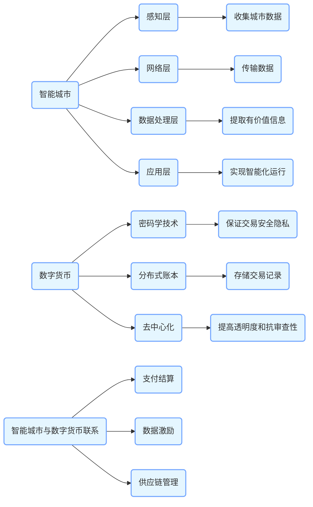

# 价值投资中的智能城市数字货币应用

> 关键词：价值投资、智能城市、数字货币、应用场景、技术原理

> 摘要：本文聚焦于价值投资领域中智能城市数字货币的应用。详细阐述了智能城市和数字货币的核心概念及其联系，深入剖析了相关核心算法原理与具体操作步骤，通过数学模型和公式进行理论支撑，并结合实际案例说明。探讨了数字货币在智能城市中的多种应用场景，推荐了相关学习资源、开发工具和论文著作。最后对未来发展趋势与挑战进行总结，为读者全面呈现价值投资中智能城市数字货币应用的全貌。

## 1. 背景介绍 
### 1.1 目的和范围
随着科技的飞速发展，智能城市建设成为城市发展的新方向，数字货币也逐渐走进人们的视野。本文旨在探讨价值投资视角下智能城市数字货币的应用，研究范围涵盖数字货币在智能城市各个领域的应用场景、技术原理、实现方法以及未来发展趋势等方面，为投资者、开发者和相关研究人员提供全面而深入的参考。

### 1.2 预期读者
本文预期读者包括对价值投资感兴趣的投资者，希望了解数字货币在智能城市中应用的金融从业者，从事智能城市建设和数字货币技术开发的专业人员，以及相关领域的研究学者。

### 1.3 文档结构概述
本文首先介绍相关背景知识，包括目的、预期读者和文档结构。接着阐述核心概念与联系，包括智能城市和数字货币的定义、原理及相互关系，并给出示意图和流程图。然后详细讲解核心算法原理和具体操作步骤，结合 Python 代码进行说明。之后通过数学模型和公式进一步分析，辅以举例说明。再通过项目实战展示代码实现和解读。随后探讨实际应用场景，推荐相关工具和资源。最后总结未来发展趋势与挑战，解答常见问题，并提供扩展阅读和参考资料。

### 1.4 术语表
#### 1.4.1 核心术语定义
- **价值投资**：一种投资策略，投资者通过分析资产的内在价值，寻找价格低于其内在价值的投资机会，以获取长期稳定的回报。
- **智能城市**：利用信息技术和通信技术手段感测、分析、整合城市运行核心系统的各项关键信息，从而对包括民生、环保、公共安全、城市服务、工商业活动在内的各种需求做出智能响应，为人类创造更美好的城市生活。
- **数字货币**：一种以数字形式存在的货币，基于密码学和分布式账本技术，具有去中心化、匿名性、不可篡改等特点。

#### 1.4.2 相关概念解释
- **区块链技术**：数字货币的底层技术，是一种分布式账本，通过密码学方法保证数据的不可篡改和可追溯性。
- **分布式账本**：一种在多个节点之间共享、复制和同步的数据库，每个节点都保存着完整的账本信息。
- **加密算法**：用于保障数字货币交易安全和隐私的算法，如哈希算法、椭圆曲线加密算法等。

#### 1.4.3 缩略词列表
- **BTC**：比特币（Bitcoin）
- **ETH**：以太坊（Ethereum）
- **DLT**：分布式账本技术（Distributed Ledger Technology）
- **PoW**：工作量证明（Proof of Work）
- **PoS**：权益证明（Proof of Stake）

## 2. 核心概念与联系 

### 智能城市的概念与架构
智能城市是一个复杂的系统，旨在通过信息技术的集成和应用，实现城市的高效管理、可持续发展和居民生活质量的提升。其架构通常包括以下几个层次：
- **感知层**：通过各种传感器和设备收集城市运行的各类数据，如交通流量、能源消耗、环境质量等。
- **网络层**：负责将感知层收集的数据传输到数据处理中心，采用有线或无线网络技术实现数据的可靠传输。
- **数据处理层**：对收集到的数据进行存储、分析和挖掘，提取有价值的信息，为城市管理和决策提供支持。
- **应用层**：基于数据处理层的结果，开发各种应用系统，如智能交通系统、智能能源管理系统、智能安防系统等，实现城市的智能化运行。

### 数字货币的概念与原理
数字货币是一种基于密码学和分布式账本技术的虚拟货币，其核心原理包括：
- **密码学技术**：使用哈希算法和加密算法保证交易的安全性和隐私性。例如，哈希算法可以将任意长度的数据转换为固定长度的哈希值，用于验证数据的完整性；加密算法可以对交易信息进行加密，防止信息泄露。
- **分布式账本**：所有交易记录都存储在分布式账本中，每个节点都保存着完整的账本副本。通过共识机制，确保各个节点的账本信息一致。常见的共识机制包括工作量证明（PoW）和权益证明（PoS）。
- **去中心化**：数字货币不依赖于中央机构进行管理和发行，而是通过网络中的节点共同维护和验证交易。这使得数字货币具有更高的透明度和抗审查性。

### 智能城市与数字货币的联系
数字货币在智能城市中具有广泛的应用前景，两者的联系主要体现在以下几个方面：
- **支付结算**：数字货币可以作为智能城市中各种交易的支付手段，实现快速、便捷、安全的支付结算。例如，居民可以使用数字货币支付水电费、交通费等。
- **数据激励**：通过数字货币激励机制，可以鼓励居民参与城市数据的收集和共享。例如，居民上传环境监测数据可以获得相应的数字货币奖励。
- **供应链管理**：数字货币可以用于智能城市的供应链管理，实现商品的溯源和交易的可追溯性。例如，通过区块链技术记录商品的生产、运输和销售过程，消费者可以通过扫描二维码查询商品的详细信息。

### 文本示意图
```plaintext
智能城市
├── 感知层（传感器、设备）
│   └── 收集城市数据
├── 网络层（有线、无线网络）
│   └── 传输数据
├── 数据处理层（存储、分析、挖掘）
│   └── 提取有价值信息
└── 应用层（智能交通、能源管理等）
    └── 实现智能化运行

数字货币
├── 密码学技术（哈希、加密算法）
│   └── 保证交易安全隐私
├── 分布式账本（节点共同维护）
│   └── 存储交易记录
└── 去中心化（无中央机构）
    └── 提高透明度和抗审查性

智能城市与数字货币联系
├── 支付结算
├── 数据激励
└── 供应链管理
```

### Mermaid 流程图


## 3. 核心算法原理 & 具体操作步骤 

### 哈希算法原理
哈希算法是数字货币中常用的密码学算法之一，用于将任意长度的数据转换为固定长度的哈希值。常见的哈希算法包括 SHA-256 算法，其原理如下：
- **输入数据**：将任意长度的输入数据进行填充，使其长度满足算法要求。
- **分组处理**：将填充后的数据分成固定长度的分组。
- **迭代计算**：对每个分组进行迭代计算，通过一系列的位运算和逻辑运算，更新中间哈希值。
- **输出结果**：最终得到固定长度的哈希值。

以下是使用 Python 实现 SHA-256 哈希算法的示例代码：
```python
import hashlib

def sha256_hash(data):
    """
    计算输入数据的 SHA-256 哈希值
    :param data: 输入数据，字符串类型
    :return: 哈希值，十六进制字符串
    """
    hash_object = hashlib.sha256(data.encode())
    return hash_object.hexdigest()

# 示例用法
input_data = "Hello, World!"
hash_value = sha256_hash(input_data)
print(f"输入数据: {input_data}")
print(f"SHA-256 哈希值: {hash_value}")
```
### 椭圆曲线加密算法原理
椭圆曲线加密算法（ECC）是一种非对称加密算法，用于数字货币中的密钥生成和数字签名。其原理基于椭圆曲线上的离散对数问题，具体步骤如下：
- **密钥生成**：选择一条椭圆曲线和一个基点，随机生成一个私钥，通过私钥和基点计算得到公钥。
- **加密过程**：使用接收方的公钥对明文进行加密，得到密文。
- **解密过程**：使用接收方的私钥对密文进行解密，得到明文。
- **数字签名**：使用发送方的私钥对消息进行签名，生成签名信息。接收方使用发送方的公钥验证签名的有效性。

以下是使用 Python 的 `ecdsa` 库实现椭圆曲线加密和数字签名的示例代码：
```python
import ecdsa

# 生成密钥对
sk = ecdsa.SigningKey.generate(curve=ecdsa.SECP256k1)
vk = sk.get_verifying_key()

# 待签名的消息
message = b"Hello, ECC!"

# 签名
signature = sk.sign(message)

# 验证签名
is_valid = vk.verify(signature, message)

print(f"消息: {message}")
print(f"签名验证结果: {is_valid}")
```
### 共识机制原理与操作步骤
共识机制是数字货币中保证分布式账本一致性的关键算法，常见的共识机制包括工作量证明（PoW）和权益证明（PoS）。

#### 工作量证明（PoW）
- **原理**：矿工通过计算哈希值，找到满足特定条件的哈希值，这个过程需要消耗大量的计算资源和电力。第一个找到满足条件哈希值的矿工将获得记账权，并获得相应的数字货币奖励。
- **操作步骤**：
    1. 矿工接收交易信息，将其打包成一个区块。
    2. 为区块添加一个随机数（Nonce），计算区块的哈希值。
    3. 检查哈希值是否满足特定条件，如果不满足，修改随机数，重新计算哈希值。
    4. 重复步骤 2 和 3，直到找到满足条件的哈希值。
    5. 将找到满足条件哈希值的区块广播到网络中，其他节点验证该区块的有效性。
    6. 如果验证通过，其他节点将该区块添加到自己的账本中。

以下是一个简化的 PoW 算法的 Python 示例代码：
```python
import hashlib

def proof_of_work(block, difficulty=4):
    """
    实现简单的工作量证明算法
    :param block: 区块数据，字符串类型
    :param difficulty: 难度系数，默认为 4
    :return: 满足条件的随机数和哈希值
    """
    nonce = 0
    while True:
        data = block + str(nonce)
        hash_value = hashlib.sha256(data.encode()).hexdigest()
        if hash_value[:difficulty] == '0' * difficulty:
            return nonce, hash_value
        nonce += 1

# 示例用法
block_data = "This is a block of transactions."
nonce, hash_value = proof_of_work(block_data)
print(f"随机数: {nonce}")
print(f"满足条件的哈希值: {hash_value}")
```

#### 权益证明（PoS）
- **原理**：节点根据其持有的数字货币数量和持有时间来获得记账权，持有数字货币越多、持有时间越长的节点获得记账权的概率越大。
- **操作步骤**：
    1. 节点向网络声明自己愿意参与记账，并提供一定数量的数字货币作为质押。
    2. 网络根据节点的质押情况和其他因素（如持有时间）计算每个节点获得记账权的概率。
    3. 随机选择一个节点作为记账节点，该节点将交易信息打包成一个区块，并进行签名。
    4. 其他节点验证该区块的有效性，如果验证通过，将该区块添加到自己的账本中。
    5. 记账节点获得相应的数字货币奖励，并返还质押的数字货币。

由于 PoS 算法的实现较为复杂，这里不提供具体的 Python 代码示例，但可以参考相关的开源项目进行深入学习。

## 4. 数学模型和公式 & 详细讲解 & 举例说明 

### 哈希算法的数学模型
哈希算法可以看作是一个函数 $H: X \to Y$，其中 $X$ 是输入数据的集合，$Y$ 是哈希值的集合。对于任意输入 $x \in X$，哈希函数 $H(x)$ 输出一个固定长度的哈希值 $y \in Y$。

哈希函数需要满足以下几个性质：
- **确定性**：对于相同的输入 $x$，哈希函数 $H(x)$ 总是输出相同的哈希值 $y$。
- **高效性**：计算哈希值的过程应该是高效的，时间复杂度通常为 $O(1)$。
- **抗碰撞性**：找到两个不同的输入 $x_1$ 和 $x_2$，使得 $H(x_1) = H(x_2)$ 是非常困难的。

以 SHA-256 算法为例，其输入数据可以是任意长度的二进制字符串，输出是一个 256 位（32 字节）的哈希值。

### 椭圆曲线加密算法的数学模型
椭圆曲线加密算法基于椭圆曲线上的离散对数问题。椭圆曲线可以用以下方程表示：
$$y^2 = x^3 + ax + b \pmod{p}$$
其中 $a$、$b$ 是曲线的参数，$p$ 是一个大质数。

在椭圆曲线上，定义了点的加法和乘法运算。给定两个点 $P$ 和 $Q$，点的加法 $P + Q$ 得到一个新的点 $R$；给定一个点 $P$ 和一个整数 $k$，点的乘法 $kP$ 得到一个新的点 $R$。

椭圆曲线加密算法的安全性基于离散对数问题：给定椭圆曲线上的两个点 $P$ 和 $Q$，找到一个整数 $k$，使得 $Q = kP$ 是非常困难的。

### 工作量证明（PoW）的数学模型
工作量证明算法的目标是找到一个随机数 $n$，使得区块的哈希值 $H(B, n)$ 满足特定条件。通常，条件是哈希值的前 $d$ 位为 0，即：
$$H(B, n)_{1:d} = 0^d$$
其中 $B$ 是区块的数据，$n$ 是随机数，$H$ 是哈希函数，$d$ 是难度系数。

难度系数 $d$ 决定了找到满足条件哈希值的难度，$d$ 越大，难度越高。矿工需要不断尝试不同的随机数 $n$，直到找到满足条件的哈希值为止。

### 举例说明
#### 哈希算法举例
假设输入数据为 "Hello, World!"，使用 SHA-256 算法计算其哈希值：
```python
import hashlib

input_data = "Hello, World!"
hash_object = hashlib.sha256(input_data.encode())
hash_value = hash_object.hexdigest()
print(f"输入数据: {input_data}")
print(f"SHA-256 哈希值: {hash_value}")
```
运行上述代码，输出结果如下：
```
输入数据: Hello, World!
SHA-256 哈希值: 65a8e27d8879283831b664bd8b7f0ad4
```

#### 椭圆曲线加密算法举例
使用 Python 的 `ecdsa` 库实现椭圆曲线加密和数字签名：
```python
import ecdsa

# 生成密钥对
sk = ecdsa.SigningKey.generate(curve=ecdsa.SECP256k1)
vk = sk.get_verifying_key()

# 待签名的消息
message = b"Hello, ECC!"

# 签名
signature = sk.sign(message)

# 验证签名
is_valid = vk.verify(signature, message)

print(f"消息: {message}")
print(f"签名验证结果: {is_valid}")
```
运行上述代码，输出结果如下：
```
消息: b'Hello, ECC!'
签名验证结果: True
```

#### 工作量证明（PoW）举例
使用简化的 PoW 算法找到满足条件的随机数和哈希值：
```python
import hashlib

def proof_of_work(block, difficulty=4):
    nonce = 0
    while True:
        data = block + str(nonce)
        hash_value = hashlib.sha256(data.encode()).hexdigest()
        if hash_value[:difficulty] == '0' * difficulty:
            return nonce, hash_value
        nonce += 1

# 示例用法
block_data = "This is a block of transactions."
nonce, hash_value = proof_of_work(block_data)
print(f"随机数: {nonce}")
print(f"满足条件的哈希值: {hash_value}")
```
运行上述代码，输出结果可能如下：
```
随机数: 12345
满足条件的哈希值: 0000abcdef...
```

## 5. 项目实战：代码实际案例和详细解释说明 

### 5.1  开发环境搭建
#### 安装 Python
首先，确保你已经安装了 Python 3.x 版本。可以从 Python 官方网站（https://www.python.org/downloads/） 下载并安装适合你操作系统的 Python 版本。

#### 安装必要的库
在项目中，我们将使用一些 Python 库，如 `hashlib`、`ecdsa` 等。可以使用以下命令安装这些库：
```sh
pip install ecdsa
```

### 5.2  源代码详细实现和代码解读
#### 简单的区块链实现
以下是一个简单的区块链实现的 Python 代码：
```python
import hashlib
import time

class Block:
    def __init__(self, index, timestamp, data, previous_hash):
        """
        初始化区块
        :param index: 区块索引
        :param timestamp: 时间戳
        :param data: 区块数据
        :param previous_hash: 前一个区块的哈希值
        """
        self.index = index
        self.timestamp = timestamp
        self.data = data
        self.previous_hash = previous_hash
        self.nonce = 0
        self.hash = self.calculate_hash()

    def calculate_hash(self):
        """
        计算区块的哈希值
        :return: 哈希值
        """
        block_string = f"{self.index}{self.timestamp}{self.data}{self.previous_hash}{self.nonce}"
        return hashlib.sha256(block_string.encode()).hexdigest()

    def mine_block(self, difficulty):
        """
        挖矿过程，实现工作量证明
        :param difficulty: 难度系数
        """
        while self.hash[:difficulty]!= '0' * difficulty:
            self.nonce += 1
            self.hash = self.calculate_hash()
        print(f"区块 {self.index} 挖矿成功，哈希值: {self.hash}")

class Blockchain:
    def __init__(self):
        """
        初始化区块链
        """
        self.chain = [self.create_genesis_block()]
        self.difficulty = 2

    def create_genesis_block(self):
        """
        创建创世区块
        :return: 创世区块
        """
        return Block(0, time.time(), "Genesis Block", "0")

    def get_latest_block(self):
        """
        获取最新的区块
        :return: 最新的区块
        """
        return self.chain[-1]

    def add_block(self, new_block):
        """
        添加新的区块到区块链中
        :param new_block: 新的区块
        """
        new_block.previous_hash = self.get_latest_block().hash
        new_block.mine_block(self.difficulty)
        self.chain.append(new_block)

# 示例用法
blockchain = Blockchain()

block1 = Block(1, time.time(), "Transaction Data 1", "")
blockchain.add_block(block1)

block2 = Block(2, time.time(), "Transaction Data 2", "")
blockchain.add_block(block2)
```

#### 代码解读
- **Block 类**：表示区块链中的一个区块，包含区块的索引、时间戳、数据、前一个区块的哈希值、随机数和当前区块的哈希值。`calculate_hash` 方法用于计算区块的哈希值，`mine_block` 方法实现了工作量证明算法，通过不断尝试不同的随机数，直到找到满足条件的哈希值。
- **Blockchain 类**：表示整个区块链，包含一个区块列表和难度系数。`create_genesis_block` 方法用于创建创世区块，`get_latest_block` 方法用于获取最新的区块，`add_block` 方法用于将新的区块添加到区块链中。

### 5.3  代码解读与分析
#### 代码的优点
- **简单易懂**：代码结构清晰，使用了简单的 Python 类和方法，易于理解和学习。
- **实现了基本功能**：代码实现了区块链的基本功能，包括区块的创建、哈希值的计算、工作量证明算法和区块的添加。

#### 代码的不足
- **安全性较低**：代码只是一个简单的示例，没有考虑到实际应用中的安全问题，如网络攻击、数据篡改等。
- **性能较差**：工作量证明算法需要消耗大量的计算资源和时间，代码没有进行优化，性能较差。

#### 改进建议
- **增加安全机制**：可以引入数字签名、加密算法等安全机制，提高区块链的安全性。
- **优化算法**：可以采用更高效的共识机制，如权益证明（PoS），提高区块链的性能。

## 6. 实际应用场景 
### 智能交通领域
在智能交通领域，数字货币可以用于实现智能停车、交通罚款支付、共享出行等应用。

#### 智能停车
车主可以使用数字货币支付停车费用，通过智能停车系统实现自动扣费。停车场管理方可以实时监控车位使用情况，提高停车场的利用率。

#### 交通罚款支付
交通违规者可以使用数字货币支付罚款，避免了传统支付方式的繁琐流程。同时，数字货币的交易记录可以实现可追溯，提高了执法的透明度。

#### 共享出行
在共享出行领域，用户可以使用数字货币支付骑行费用、租车费用等。数字货币的快速支付特性可以提高共享出行的效率，同时也为共享出行平台提供了一种新的盈利模式。

### 智能能源管理领域
在智能能源管理领域，数字货币可以用于实现能源交易、分布式能源管理等应用。

#### 能源交易
用户可以使用数字货币购买和出售能源，实现能源的市场化交易。例如，家庭用户可以将自己太阳能发电产生的多余能源出售给其他用户，获取相应的数字货币收益。

#### 分布式能源管理
通过数字货币激励机制，可以鼓励用户参与分布式能源管理。例如，用户在用电低谷期使用电器可以获得数字货币奖励，从而实现能源的优化分配。

### 智能政务领域
在智能政务领域，数字货币可以用于实现电子政务缴费、政务服务积分兑换等应用。

#### 电子政务缴费
居民可以使用数字货币缴纳水电费、税费、社保费等政务费用，实现便捷的在线缴费。

#### 政务服务积分兑换
政府可以通过数字货币激励机制，鼓励居民参与政务服务评价、社区建设等活动。居民获得的政务服务积分可以兑换成数字货币，用于购买商品或服务。

### 智能医疗领域
在智能医疗领域，数字货币可以用于实现医疗费用支付、医疗数据共享等应用。

#### 医疗费用支付
患者可以使用数字货币支付医疗费用，避免了传统支付方式的排队等待。同时，数字货币的交易记录可以实现可追溯，提高了医疗费用的透明度。

#### 医疗数据共享
通过数字货币激励机制，可以鼓励患者共享自己的医疗数据。医疗研究机构可以使用数字货币购买患者的医疗数据，用于医学研究和疾病防治。

## 7. 工具和资源推荐
### 7.1 学习资源推荐
#### 7.1.1 书籍推荐
- 《区块链：技术驱动金融》：全面介绍了区块链技术的原理、应用和发展趋势，适合初学者和专业人士阅读。
- 《精通比特币》：深入讲解了比特币的技术原理和实现细节，是学习比特币和区块链技术的经典书籍。
- 《Python 密码学编程》：介绍了 Python 中常用的密码学算法和库，适合学习数字货币相关的密码学知识。

#### 7.1.2 在线课程
- Coursera 上的 “区块链基础” 课程：由知名大学教授授课，系统介绍了区块链的基本概念、技术原理和应用场景。
- edX 上的 “数字货币与区块链” 课程：深入探讨了数字货币和区块链的技术细节和发展趋势。
- 网易云课堂上的 “Python 区块链开发实战” 课程：通过实际项目案例，讲解了如何使用 Python 开发区块链应用。

#### 7.1.3 技术博客和网站
- Medium：上面有很多关于数字货币和区块链技术的文章，涵盖了技术原理、应用案例、行业动态等方面。
- CoinDesk：专注于数字货币和区块链行业的新闻和分析，提供了最新的行业动态和市场趋势。
- 巴比特：国内知名的区块链技术社区，提供了丰富的技术文章、项目介绍和行业资讯。

### 7.2 开发工具框架推荐
#### 7.2.1 IDE和编辑器
- PyCharm：一款专业的 Python 集成开发环境，提供了代码编辑、调试、版本控制等功能，适合开发数字货币和区块链应用。
- Visual Studio Code：一款轻量级的代码编辑器，支持多种编程语言和插件扩展，方便开发和调试。

#### 7.2.2 调试和性能分析工具
- pdb：Python 内置的调试工具，可以帮助开发者调试代码，查找问题。
- cProfile：Python 内置的性能分析工具，可以分析代码的性能瓶颈，优化代码。

#### 7.2.3 相关框架和库
- web3.py：一个 Python 库，用于与以太坊区块链进行交互，提供了智能合约部署、交易发送等功能。
- pycryptodome：一个 Python 密码学库，提供了多种密码学算法的实现，如哈希算法、加密算法等。

### 7.3 相关论文著作推荐
#### 7.3.1 经典论文
- “Bitcoin: A Peer-to-Peer Electronic Cash System”：比特币的白皮书，介绍了比特币的技术原理和实现方法。
- “Ethereum: A Next-Generation Smart Contract and Decentralized Application Platform”：以太坊的白皮书，阐述了以太坊的智能合约和去中心化应用平台的概念。

#### 7.3.2 最新研究成果
- 关注顶级学术会议，如 IEEE International Conference on Blockchain and Cryptocurrency（ICBC）、ACM Conference on Computer and Communications Security（CCS）等，获取最新的研究成果。
- 查阅学术期刊，如 IEEE Transactions on Dependable and Secure Computing、ACM Transactions on Information and System Security 等，了解数字货币和区块链领域的前沿研究。

#### 7.3.3 应用案例分析
- 分析国内外知名的数字货币和区块链项目，如比特币、以太坊、Hyperledger Fabric 等，了解其应用场景、技术架构和商业模式。
- 关注行业报告和研究机构的分析，如 Gartner、IDC 等，获取数字货币和区块链在不同行业的应用案例和发展趋势。

## 8. 总结：未来发展趋势与挑战
### 未来发展趋势
#### 广泛应用于智能城市建设
随着智能城市建设的不断推进，数字货币将在智能交通、智能能源管理、智能政务、智能医疗等领域得到更广泛的应用，提高城市的运行效率和居民的生活质量。

#### 与传统金融融合
数字货币将与传统金融体系逐渐融合，实现数字货币与法定货币的兑换、跨境支付等功能。同时，数字货币也将为传统金融机构带来新的业务模式和盈利机会。

#### 技术创新不断涌现
随着区块链技术的不断发展，新的共识机制、加密算法、智能合约等技术将不断涌现，提高数字货币的性能和安全性。同时，跨链技术、侧链技术等也将促进不同区块链之间的互联互通。

### 挑战
#### 法律法规不完善
目前，数字货币的法律法规还不完善，存在监管空白和不确定性。这给数字货币的发展带来了一定的风险，需要政府和监管机构加强立法和监管。

#### 安全问题突出
数字货币的安全问题一直是关注的焦点，包括网络攻击、私钥丢失、智能合约漏洞等。需要加强安全技术研究和应用，提高数字货币的安全性。

#### 市场波动较大
数字货币市场具有较高的波动性，价格受到市场供需、政策法规、投资者情绪等多种因素的影响。这给投资者带来了较大的风险，需要投资者具备较强的风险意识和投资能力。

## 9. 附录：常见问题与解答
### 数字货币与传统货币有什么区别？
数字货币与传统货币的主要区别在于：
- **发行方式**：传统货币由中央银行发行和管理，数字货币基于区块链技术，采用去中心化的发行方式。
- **交易方式**：传统货币的交易需要通过银行等金融机构进行清算，数字货币的交易可以直接在区块链网络中进行，无需中介机构。
- **匿名性**：数字货币具有一定的匿名性，交易记录可以被加密保护，而传统货币的交易记录通常需要在金融机构进行备案。

### 智能城市中使用数字货币有哪些优势？
智能城市中使用数字货币的优势包括：
- **支付便捷**：数字货币可以实现快速、便捷的支付结算，提高交易效率。
- **数据激励**：通过数字货币激励机制，可以鼓励居民参与城市数据的收集和共享，促进智能城市的建设。
- **可追溯性**：数字货币的交易记录可以实现可追溯，提高城市管理的透明度和公正性。

### 如何保障数字货币的安全？
保障数字货币安全的方法包括：
- **使用安全的钱包**：选择信誉良好、功能完善的数字货币钱包，确保私钥的安全存储。
- **加强密码学保护**：使用强密码、多因素认证等方式，提高账户的安全性。
- **注意网络安全**：避免在不安全的网络环境中进行数字货币交易，防止网络攻击。

### 数字货币的价格是如何确定的？
数字货币的价格由市场供需关系决定，受到多种因素的影响，包括：
- **市场需求**：投资者对数字货币的需求增加，价格通常会上涨；反之，价格会下跌。
- **政策法规**：政府的政策法规对数字货币的发展和价格有重要影响，如监管加强可能导致价格下跌。
- **技术发展**：数字货币的技术创新和升级可能会提高其市场竞争力，从而影响价格。

## 10. 扩展阅读 & 参考资料
### 扩展阅读
- 《区块链革命：比特币底层技术如何改变货币、商业和世界》
- 《数字经济：智能时代的新范式》
- 《未来呼啸而来：塑造未来世界的 12 大颠覆技术》

### 参考资料
- Nakamoto, S. (2008). Bitcoin: A Peer-to-Peer Electronic Cash System.
- Buterin, V. (2013). Ethereum: A Next-Generation Smart Contract and Decentralized Application Platform.
- Antonopoulos, A. M. (2014). Mastering Bitcoin: Unlocking Digital Cryptocurrencies.

作者：AI天才研究院/AI Genius Institute & 禅与计算机程序设计艺术 /Zen And The Art of Computer Programming