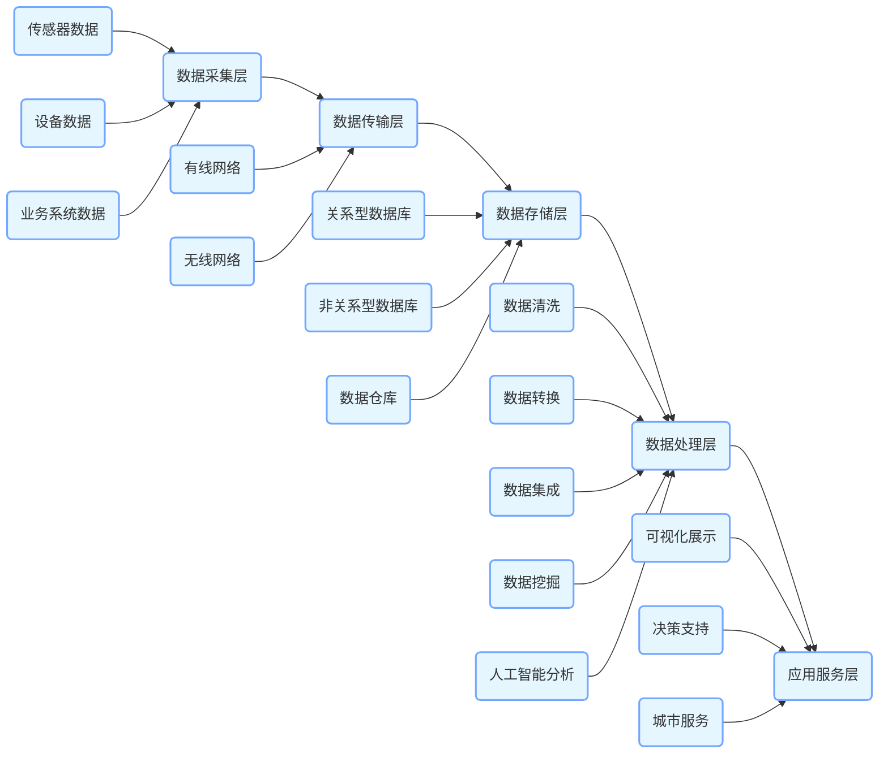

# 价值投资中的智能城市数据平台分析

> 关键词：价值投资、智能城市数据平台、数据挖掘、投资决策、城市发展

> 摘要：本文旨在深入探讨价值投资视角下的智能城市数据平台。通过对智能城市数据平台的核心概念、算法原理、数学模型等方面的详细分析，结合实际案例阐述其在投资决策中的应用。同时，介绍相关的工具和资源，分析未来发展趋势与挑战，为投资者和相关领域从业者提供全面的参考。

## 1. 背景介绍 
### 1.1 目的和范围
在当今数字化时代，智能城市的建设如火如荼。智能城市数据平台作为智能城市的核心基础设施之一，汇聚了城市各个领域的海量数据。从价值投资的角度来看，对智能城市数据平台进行深入分析有助于投资者发现潜在的投资机会，评估投资价值。本文的范围涵盖智能城市数据平台的基本概念、技术原理、实际应用以及在价值投资中的作用等方面。

### 1.2 预期读者
本文的预期读者包括价值投资者、金融分析师、智能城市建设相关的技术人员和管理人员、研究城市发展和投资领域的学者等。对于希望了解智能城市数据平台如何影响投资决策以及如何挖掘其投资价值的人士具有重要的参考价值。

### 1.3 文档结构概述
本文将首先介绍智能城市数据平台的核心概念和相关联系，包括其原理和架构。接着详细阐述核心算法原理和具体操作步骤，并给出相应的 Python 代码示例。然后介绍数学模型和公式，并通过举例进行说明。在项目实战部分，将展示代码实际案例并进行详细解释。之后分析智能城市数据平台的实际应用场景，推荐相关的工具和资源。最后总结未来发展趋势与挑战，解答常见问题并提供扩展阅读和参考资料。

### 1.4 术语表
#### 1.4.1 核心术语定义
- **价值投资**：一种投资策略，通过对资产的内在价值进行评估，寻找被低估的资产进行投资，以获取长期的投资回报。
- **智能城市数据平台**：集成了城市各个领域（如交通、能源、环境等）的数据，通过数据处理、分析和挖掘技术，为城市管理、决策和服务提供支持的平台。
- **数据挖掘**：从大量的数据中提取有价值的信息和知识的过程。

#### 1.4.2 相关概念解释
- **大数据**：指数据量巨大、类型多样、产生速度快的数据集合。智能城市数据平台处理的往往是大数据，需要采用专门的技术和工具进行管理和分析。
- **人工智能**：使计算机能够模拟人类智能的技术，包括机器学习、深度学习等。在智能城市数据平台中，人工智能技术可用于数据预测、异常检测等。

#### 1.4.3 缩略词列表
- **AI**：Artificial Intelligence，人工智能
- **ML**：Machine Learning，机器学习
- **DL**：Deep Learning，深度学习
- **IoT**：Internet of Things，物联网

## 2. 核心概念与联系 

### 2.1 智能城市数据平台的原理
智能城市数据平台的原理基于数据的采集、传输、存储、处理和分析。首先，通过各种传感器（如交通传感器、环境监测传感器等）和设备（如智能电表、摄像头等）采集城市各个领域的数据。这些数据通过网络传输到数据中心进行存储。在数据中心，对数据进行清洗、转换和集成等预处理操作，以提高数据的质量。然后，利用数据挖掘和人工智能技术对数据进行分析，提取有价值的信息和知识，为城市管理、决策和服务提供支持。

### 2.2 智能城市数据平台的架构
智能城市数据平台的架构通常包括以下几个层次：
- **数据采集层**：负责采集城市各个领域的数据，包括传感器数据、设备数据、业务系统数据等。
- **数据传输层**：将采集到的数据传输到数据中心，可采用有线网络、无线网络等方式。
- **数据存储层**：存储采集到的数据，可采用关系型数据库、非关系型数据库、数据仓库等。
- **数据处理层**：对存储的数据进行清洗、转换、集成等预处理操作，以及数据挖掘和人工智能分析。
- **应用服务层**：将分析结果以可视化的方式呈现给用户，为城市管理、决策和服务提供支持。

### 2.3 文本示意图
智能城市数据平台的架构可以用以下文本示意图表示：

```plaintext
智能城市数据平台
|-- 数据采集层
|   |-- 传感器数据
|   |-- 设备数据
|   |-- 业务系统数据
|-- 数据传输层
|   |-- 有线网络
|   |-- 无线网络
|-- 数据存储层
|   |-- 关系型数据库
|   |-- 非关系型数据库
|   |-- 数据仓库
|-- 数据处理层
|   |-- 数据清洗
|   |-- 数据转换
|   |-- 数据集成
|   |-- 数据挖掘
|   |-- 人工智能分析
|-- 应用服务层
|   |-- 可视化展示
|   |-- 决策支持
|   |-- 城市服务
```

### 2.4 Mermaid 流程图


## 3. 核心算法原理 & 具体操作步骤 

### 3.1 数据挖掘算法 - 关联规则挖掘
关联规则挖掘是数据挖掘中的一种重要算法，用于发现数据集中不同项之间的关联关系。在智能城市数据平台中，关联规则挖掘可以用于发现城市各个领域之间的潜在关系，例如交通流量与空气质量之间的关系。

#### 3.1.1 算法原理
关联规则挖掘的核心是寻找频繁项集，即经常同时出现的项的集合。常用的算法是 Apriori 算法。Apriori 算法基于逐层搜索的思想，通过不断生成候选项集并筛选出频繁项集。

#### 3.1.2 具体操作步骤
1. **初始化**：设定最小支持度和最小置信度。支持度表示项集在数据集中出现的频率，置信度表示在一个项集出现的条件下，另一个项集出现的概率。
2. **生成 1 - 项集**：扫描数据集，统计每个项的出现次数，筛选出支持度大于等于最小支持度的项，构成 1 - 项集。
3. **生成候选项集**：由 k - 项集生成 k + 1 - 项集。
4. **筛选频繁项集**：扫描数据集，统计候选项集的支持度，筛选出支持度大于等于最小支持度的项集，构成 k + 1 - 频繁项集。
5. **生成关联规则**：从频繁项集中生成关联规则，计算规则的置信度，筛选出置信度大于等于最小置信度的规则。

#### 3.1.3 Python 代码实现
```python
from itertools import chain, combinations
from collections import defaultdict

def powerset(iterable):
    s = list(iterable)
    return chain.from_iterable(combinations(s, r) for r in range(len(s)+1))

def get_support(itemset, transactions):
    count = 0
    for transaction in transactions:
        if set(itemset).issubset(set(transaction)):
            count += 1
    return count / len(transactions)

def apriori(transactions, min_support):
    items = set(chain(*transactions))
    frequent_itemsets = []
    # 生成 1 - 项集
    one_itemsets = [(item,) for item in items if get_support((item,), transactions) >= min_support]
    frequent_itemsets.extend(one_itemsets)
    k = 2
    current_itemsets = one_itemsets
    while current_itemsets:
        candidate_itemsets = []
        for i in range(len(current_itemsets)):
            for j in range(i + 1, len(current_itemsets)):
                itemset1 = current_itemsets[i]
                itemset2 = current_itemsets[j]
                if itemset1[:-1] == itemset2[:-1]:
                    new_itemset = tuple(sorted(set(itemset1 + itemset2)))
                    candidate_itemsets.append(new_itemset)
        frequent_k_itemsets = []
        for candidate in candidate_itemsets:
            if get_support(candidate, transactions) >= min_support:
                frequent_k_itemsets.append(candidate)
        frequent_itemsets.extend(frequent_k_itemsets)
        current_itemsets = frequent_k_itemsets
        k += 1
    return frequent_itemsets

def generate_rules(frequent_itemsets, transactions, min_confidence):
    rules = []
    for itemset in frequent_itemsets:
        if len(itemset) > 1:
            subsets = list(powerset(itemset))
            for subset in subsets:
                if subset and len(subset) < len(itemset):
                    antecedent = subset
                    consequent = tuple(set(itemset) - set(subset))
                    support_antecedent = get_support(antecedent, transactions)
                    support_itemset = get_support(itemset, transactions)
                    confidence = support_itemset / support_antecedent
                    if confidence >= min_confidence:
                        rules.append((antecedent, consequent, confidence))
    return rules

# 示例数据集
transactions = [
    ['apple', 'banana', 'cherry'],
    ['apple', 'banana'],
    ['apple', 'cherry'],
    ['banana', 'cherry']
]

min_support = 0.5
min_confidence = 0.7

# 挖掘频繁项集
frequent_itemsets = apriori(transactions, min_support)
print("频繁项集:", frequent_itemsets)

# 生成关联规则
rules = generate_rules(frequent_itemsets, transactions, min_confidence)
print("关联规则:", rules)
```

### 3.2 机器学习算法 - 线性回归
线性回归是一种常用的机器学习算法，用于建立自变量和因变量之间的线性关系。在智能城市数据平台中，线性回归可以用于预测城市的某些指标，例如用电量与气温之间的关系。

#### 3.2.1 算法原理
线性回归的目标是找到一条直线（在多元线性回归中是超平面），使得所有数据点到该直线的误差平方和最小。对于简单线性回归，模型可以表示为 $y = \beta_0 + \beta_1x + \epsilon$，其中 $y$ 是因变量，$x$ 是自变量，$\beta_0$ 和 $\beta_1$ 是模型的参数，$\epsilon$ 是误差项。

#### 3.2.2 具体操作步骤
1. **数据准备**：收集自变量和因变量的数据，并进行预处理，例如数据清洗、归一化等。
2. **模型训练**：使用最小二乘法估计模型的参数 $\beta_0$ 和 $\beta_1$。
3. **模型评估**：使用评估指标（如均方误差、决定系数等）评估模型的性能。
4. **模型预测**：使用训练好的模型对新的数据进行预测。

#### 3.2.3 Python 代码实现
```python
import numpy as np
from sklearn.linear_model import LinearRegression
from sklearn.metrics import mean_squared_error, r2_score
from sklearn.model_selection import train_test_split

# 生成示例数据
np.random.seed(0)
X = 2 * np.random.rand(100, 1)
y = 4 + 3 * X + np.random.randn(100, 1)

# 划分训练集和测试集
X_train, X_test, y_train, y_test = train_test_split(X, y, test_size=0.2, random_state=42)

# 创建线性回归模型
model = LinearRegression()

# 模型训练
model.fit(X_train, y_train)

# 模型预测
y_pred = model.predict(X_test)

# 模型评估
mse = mean_squared_error(y_test, y_pred)
r2 = r2_score(y_test, y_pred)

print("均方误差:", mse)
print("决定系数:", r2)

# 打印模型参数
print("截距:", model.intercept_)
print("斜率:", model.coef_)
```

## 4. 数学模型和公式 & 详细讲解 & 举例说明 

### 4.1 关联规则挖掘的数学模型和公式
#### 4.1.1 支持度
支持度表示项集在数据集中出现的频率，计算公式为：
$$
\text{Support}(X) = \frac{\text{Number of transactions containing } X}{\text{Total number of transactions}}
$$
其中，$X$ 是项集。

#### 4.1.2 置信度
置信度表示在一个项集出现的条件下，另一个项集出现的概率，计算公式为：
$$
\text{Confidence}(X \rightarrow Y) = \frac{\text{Support}(X \cup Y)}{\text{Support}(X)}
$$
其中，$X$ 和 $Y$ 是项集。

#### 4.1.3 举例说明
假设数据集如下：
| 交易编号 | 商品列表 |
| ---- | ---- |
| 1 | {apple, banana, cherry} |
| 2 | {apple, banana} |
| 3 | {apple, cherry} |
| 4 | {banana, cherry} |

计算项集 {apple, banana} 的支持度：
支持度 = $\frac{\text{包含 \{apple, banana\} 的交易数}}{\text{总交易数}} = \frac{2}{4} = 0.5$

计算关联规则 {apple} $\rightarrow$ {banana} 的置信度：
支持度({apple}) = $\frac{\text{包含 \{apple\} 的交易数}}{\text{总交易数}} = \frac{3}{4} = 0.75$
支持度({apple, banana}) = 0.5
置信度 = $\frac{\text{Support}(\{apple, banana\})}{\text{Support}(\{apple\})} = \frac{0.5}{0.75} \approx 0.67$

### 4.2 线性回归的数学模型和公式
#### 4.2.1 简单线性回归模型
简单线性回归模型可以表示为：
$$
y = \beta_0 + \beta_1x + \epsilon
$$
其中，$y$ 是因变量，$x$ 是自变量，$\beta_0$ 是截距，$\beta_1$ 是斜率，$\epsilon$ 是误差项。

#### 4.2.2 最小二乘法估计参数
最小二乘法的目标是使误差平方和最小，误差平方和的计算公式为：
$$
S(\beta_0, \beta_1) = \sum_{i=1}^{n}(y_i - (\beta_0 + \beta_1x_i))^2
$$
通过对 $S(\beta_0, \beta_1)$ 分别求关于 $\beta_0$ 和 $\beta_1$ 的偏导数，并令偏导数为 0，可以得到参数的估计值：
$$
\hat{\beta}_1 = \frac{\sum_{i=1}^{n}(x_i - \bar{x})(y_i - \bar{y})}{\sum_{i=1}^{n}(x_i - \bar{x})^2}
$$
$$
\hat{\beta}_0 = \bar{y} - \hat{\beta}_1\bar{x}
$$
其中，$\bar{x}$ 和 $\bar{y}$ 分别是 $x$ 和 $y$ 的均值。

#### 4.2.3 举例说明
假设我们有以下数据：
| $x$ | $y$ |
| ---- | ---- |
| 1 | 3 |
| 2 | 5 |
| 3 | 7 |
| 4 | 9 |

首先计算均值：
$\bar{x} = \frac{1 + 2 + 3 + 4}{4} = 2.5$
$\bar{y} = \frac{3 + 5 + 7 + 9}{4} = 6$

然后计算 $\hat{\beta}_1$：
$\sum_{i=1}^{4}(x_i - \bar{x})(y_i - \bar{y}) = (1 - 2.5)(3 - 6) + (2 - 2.5)(5 - 6) + (3 - 2.5)(7 - 6) + (4 - 2.5)(9 - 6) = 10$
$\sum_{i=1}^{4}(x_i - \bar{x})^2 = (1 - 2.5)^2 + (2 - 2.5)^2 + (3 - 2.5)^2 + (4 - 2.5)^2 = 5$
$\hat{\beta}_1 = \frac{10}{5} = 2$

最后计算 $\hat{\beta}_0$：
$\hat{\beta}_0 = 6 - 2 \times 2.5 = 1$

所以，线性回归模型为 $y = 1 + 2x$。

## 5. 项目实战：代码实际案例和详细解释说明 

### 5.1  开发环境搭建
#### 5.1.1 安装 Python
首先，需要安装 Python 环境。可以从 Python 官方网站（https://www.python.org/downloads/）下载适合自己操作系统的 Python 版本，并按照安装向导进行安装。

#### 5.1.2 安装必要的库
使用以下命令安装必要的 Python 库：
```sh
pip install numpy pandas scikit-learn matplotlib
```
- `numpy`：用于数值计算。
- `pandas`：用于数据处理和分析。
- `scikit-learn`：提供了丰富的机器学习算法和工具。
- `matplotlib`：用于数据可视化。

### 5.2  源代码详细实现和代码解读
#### 5.2.1 项目背景
假设我们要分析智能城市中交通流量和空气质量之间的关系，并预测空气质量。我们有一个包含交通流量和空气质量数据的数据集。

#### 5.2.2 代码实现
```python
import pandas as pd
import numpy as np
from sklearn.model_selection import train_test_split
from sklearn.linear_model import LinearRegression
from sklearn.metrics import mean_squared_error, r2_score
import matplotlib.pyplot as plt

# 加载数据
data = pd.read_csv('traffic_air_quality.csv')

# 提取特征和目标变量
X = data[['traffic_flow']].values
y = data['air_quality'].values

# 划分训练集和测试集
X_train, X_test, y_train, y_test = train_test_split(X, y, test_size=0.2, random_state=42)

# 创建线性回归模型
model = LinearRegression()

# 模型训练
model.fit(X_train, y_train)

# 模型预测
y_pred = model.predict(X_test)

# 模型评估
mse = mean_squared_error(y_test, y_pred)
r2 = r2_score(y_test, y_pred)

print("均方误差:", mse)
print("决定系数:", r2)

# 打印模型参数
print("截距:", model.intercept_)
print("斜率:", model.coef_)

# 可视化结果
plt.scatter(X_test, y_test, color='blue', label='Actual')
plt.plot(X_test, y_pred, color='red', linewidth=2, label='Predicted')
plt.xlabel('Traffic Flow')
plt.ylabel('Air Quality')
plt.title('Traffic Flow vs Air Quality')
plt.legend()
plt.show()
```

#### 5.2.3 代码解读
1. **数据加载**：使用 `pandas` 库的 `read_csv` 函数加载包含交通流量和空气质量数据的 CSV 文件。
2. **特征提取**：从数据集中提取交通流量作为特征 `X`，空气质量作为目标变量 `y`。
3. **数据集划分**：使用 `train_test_split` 函数将数据集划分为训练集和测试集，测试集占比为 20%。
4. **模型创建**：创建一个线性回归模型 `LinearRegression`。
5. **模型训练**：使用训练集数据对模型进行训练。
6. **模型预测**：使用训练好的模型对测试集数据进行预测。
7. **模型评估**：使用均方误差和决定系数评估模型的性能。
8. **可视化结果**：使用 `matplotlib` 库绘制实际值和预测值的散点图和拟合直线。

### 5.3  代码解读与分析
#### 5.3.1 模型性能分析
均方误差（MSE）衡量了预测值与实际值之间的平均误差平方。MSE 越小，说明模型的预测效果越好。决定系数（$R^2$）表示模型对数据的拟合程度，取值范围为 $[0, 1]$，$R^2$ 越接近 1，说明模型的拟合效果越好。

#### 5.3.2 模型参数分析
截距表示当交通流量为 0 时的空气质量预测值。斜率表示交通流量每增加一个单位，空气质量的变化量。通过分析模型参数，可以了解交通流量对空气质量的影响程度。

#### 5.3.3 可视化分析
通过绘制实际值和预测值的散点图和拟合直线，可以直观地观察模型的预测效果。如果拟合直线能够较好地穿过散点，说明模型的预测效果较好。

## 6. 实际应用场景 
### 6.1 城市规划与建设
智能城市数据平台可以为城市规划与建设提供重要的数据支持。通过分析城市的人口分布、交通流量、土地利用等数据，可以合理规划城市的基础设施建设，如道路、桥梁、公共交通等。例如，根据交通流量数据可以确定哪些区域需要增加道路容量，以缓解交通拥堵。

### 6.2 环境保护与管理
智能城市数据平台可以实时监测城市的环境质量，如空气质量、水质、噪音等。通过对环境数据的分析，可以及时发现环境问题，并采取相应的措施进行治理。例如，当空气质量监测数据显示某一区域的污染指数超标时，可以及时采取措施减少污染源的排放。

### 6.3 公共安全与应急管理
智能城市数据平台可以集成城市的安防监控、消防、医疗等数据，为公共安全与应急管理提供支持。通过对这些数据的分析，可以及时发现安全隐患，并采取相应的措施进行防范。例如，当监控摄像头检测到某一区域发生异常事件时，可以及时通知相关部门进行处理。

### 6.4 能源管理与优化
智能城市数据平台可以实时监测城市的能源消耗情况，如电力、燃气、水等。通过对能源数据的分析，可以优化能源的分配和使用，提高能源利用效率。例如，根据电力消耗数据可以调整电网的负荷，避免电力浪费。

### 6.5 价值投资决策
从价值投资的角度来看，智能城市数据平台可以为投资者提供有关城市发展潜力和投资机会的信息。例如，通过分析城市的经济增长数据、人口流动数据等，可以评估城市的发展前景，从而选择有潜力的投资项目。同时，智能城市数据平台还可以帮助投资者评估投资项目的风险，例如通过分析市场需求、竞争状况等数据。

## 7. 工具和资源推荐
### 7.1 学习资源推荐
#### 7.1.1 书籍推荐
- 《智能城市：概念、技术与应用》：全面介绍了智能城市的概念、技术和应用，对于了解智能城市数据平台的背景和应用场景有很大帮助。
- 《数据挖掘：概念与技术》：详细介绍了数据挖掘的各种算法和技术，对于学习智能城市数据平台中的数据挖掘算法非常有用。
- 《Python 机器学习》：介绍了使用 Python 进行机器学习的方法和技术，对于实现智能城市数据平台中的机器学习算法有很大帮助。

#### 7.1.2 在线课程
- Coursera 上的 “智能城市技术与应用” 课程：由知名高校的教授授课，系统地介绍了智能城市的相关技术和应用。
- edX 上的 “数据挖掘基础” 课程：讲解了数据挖掘的基本概念和算法，适合初学者学习。
- Udemy 上的 “Python 数据分析实战” 课程：通过实际案例介绍了使用 Python 进行数据分析的方法和技巧。

#### 7.1.3 技术博客和网站
- 开源中国（https://www.oschina.net/）：提供了丰富的开源技术资源和技术文章，对于了解智能城市数据平台的开源框架和技术有很大帮助。
- 博客园（https://www.cnblogs.com/）：有很多技术博主分享自己的技术经验和心得，对于学习智能城市数据平台的相关技术有很大启发。
- 机器之心（https://www.alldatasheet.com/）：专注于人工智能和机器学习领域的资讯和技术文章，对于了解智能城市数据平台中的人工智能技术有很大帮助。

### 7.2 开发工具框架推荐
#### 7.2.1 IDE和编辑器
- PyCharm：一款专业的 Python 集成开发环境，提供了丰富的代码编辑、调试和项目管理功能，适合开发智能城市数据平台的 Python 代码。
- Jupyter Notebook：一种交互式的开发环境，适合进行数据探索和模型实验，对于智能城市数据平台的数据分析和模型开发非常有用。
- Visual Studio Code：一款轻量级的代码编辑器，支持多种编程语言，具有丰富的插件扩展功能，适合开发智能城市数据平台的前端和后端代码。

#### 7.2.2 调试和性能分析工具
- Py-Spy：一款用于 Python 程序性能分析的工具，可以帮助开发者找出程序中的性能瓶颈。
-pdb：Python 自带的调试工具，可以帮助开发者调试 Python 代码。
- TensorBoard：用于可视化深度学习模型的训练过程和性能指标，对于智能城市数据平台中的深度学习模型开发非常有用。

#### 7.2.3 相关框架和库
- Pandas：用于数据处理和分析的 Python 库，提供了丰富的数据结构和数据操作方法，适合处理智能城市数据平台中的大规模数据。
- Scikit-learn：提供了丰富的机器学习算法和工具，适合实现智能城市数据平台中的机器学习模型。
- TensorFlow：一个开源的深度学习框架，适合开发智能城市数据平台中的深度学习模型。

### 7.3 相关论文著作推荐
#### 7.3.1 经典论文
- “The Intelligent City: A Conceptual Framework”：提出了智能城市的概念框架，对于理解智能城市的本质和内涵有重要意义。
- “Data Mining: The Next Generation of Challenges and Opportunities”：探讨了数据挖掘领域的未来发展趋势和挑战，对于了解智能城市数据平台中的数据挖掘技术有很大帮助。
- “Machine Learning for Smart Cities: A Survey”：对智能城市中机器学习技术的应用进行了全面的综述，对于了解智能城市数据平台中的机器学习应用有很大参考价值。

#### 7.3.2 最新研究成果
- 关注顶级学术会议（如 ACM SIGKDD、IEEE ICDM 等）和学术期刊（如 Journal of Artificial Intelligence Research、ACM Transactions on Intelligent Systems and Technology 等）上的最新研究成果，了解智能城市数据平台领域的最新技术和方法。

#### 7.3.3 应用案例分析
- 参考一些实际的智能城市项目案例，如新加坡的智能城市项目、巴塞罗那的智能交通项目等，了解智能城市数据平台在实际应用中的经验和教训。

## 8. 总结：未来发展趋势与挑战
### 8.1 未来发展趋势
#### 8.1.1 数据融合与共享
未来，智能城市数据平台将更加注重不同领域数据的融合与共享。通过打破数据壁垒，实现城市各个领域数据的互联互通，可以挖掘出更多有价值的信息和知识，为城市的发展提供更全面的支持。

#### 8.1.2 人工智能与机器学习的深度应用
随着人工智能和机器学习技术的不断发展，智能城市数据平台将更加广泛地应用这些技术。例如，使用深度学习算法进行图像识别和视频分析，提高城市安防监控的效率；使用强化学习算法进行交通流量优化，提高城市交通的运行效率。

#### 8.1.3 边缘计算与物联网的结合
边缘计算可以将数据处理和分析的任务靠近数据源进行，减少数据传输的延迟和带宽消耗。未来，智能城市数据平台将更加注重边缘计算与物联网的结合，实现数据的实时处理和分析，提高城市的响应速度和智能化水平。

#### 8.1.4 开放平台与生态系统建设
为了促进智能城市数据平台的发展，未来将出现更多的开放平台和生态系统。这些平台和生态系统将吸引更多的开发者和企业参与，共同推动智能城市的建设和发展。

### 8.2 挑战
#### 8.2.1 数据安全与隐私保护
智能城市数据平台涉及大量的个人隐私和敏感信息，数据安全与隐私保护是一个重要的挑战。需要采取有效的技术和管理措施，确保数据的安全性和隐私性。

#### 8.2.2 数据质量与标准统一
智能城市数据平台中的数据来源广泛，数据质量参差不齐。同时，不同领域的数据缺乏统一的标准，给数据的融合和共享带来了困难。需要建立数据质量评估和管理体系，推动数据标准的统一。

#### 8.2.3 技术人才短缺
智能城市数据平台的建设和发展需要大量的技术人才，包括数据科学家、人工智能工程师、软件开发工程师等。目前，相关技术人才短缺是一个普遍的问题，需要加强人才培养和引进。

#### 8.2.4 投资回报与商业模式创新
智能城市数据平台的建设需要大量的投资，如何实现投资回报是一个重要的问题。同时，需要创新商业模式，探索适合智能城市数据平台的盈利模式。

## 9. 附录：常见问题与解答
### 9.1 智能城市数据平台与传统数据平台有什么区别？
智能城市数据平台与传统数据平台的主要区别在于数据来源和应用场景。智能城市数据平台的数据来源更加广泛，包括城市各个领域的传感器数据、设备数据、业务系统数据等。其应用场景也更加多样化，主要用于城市的管理、决策和服务。而传统数据平台的数据来源相对单一，应用场景也主要集中在企业内部的管理和决策。

### 9.2 如何确保智能城市数据平台的数据安全？
确保智能城市数据平台的数据安全需要采取多方面的措施。首先，要建立完善的数据安全管理制度，包括数据访问控制、数据加密、数据备份等。其次，要采用先进的技术手段，如防火墙、入侵检测系统、加密算法等，保护数据的安全性。此外，还要加强员工的安全意识培训，防止人为因素导致的数据安全事故。

### 9.3 智能城市数据平台对价值投资有什么帮助？
智能城市数据平台可以为价值投资提供有关城市发展潜力和投资机会的信息。通过分析城市的经济增长数据、人口流动数据、基础设施建设数据等，可以评估城市的发展前景，从而选择有潜力的投资项目。同时，智能城市数据平台还可以帮助投资者评估投资项目的风险，例如通过分析市场需求、竞争状况等数据。

### 9.4 学习智能城市数据平台需要具备哪些知识和技能？
学习智能城市数据平台需要具备一定的计算机科学、数学和统计学知识。具体来说，需要掌握编程语言（如 Python）、数据处理和分析技术（如 Pandas、Scikit-learn）、机器学习和人工智能算法（如线性回归、决策树、神经网络等）。此外，还需要了解智能城市的相关概念和应用场景。

## 10. 扩展阅读 & 参考资料
### 10.1 扩展阅读
- 《智慧城市：大数据、物联网和云计算之应用》
- 《人工智能：现代方法》
- 《大数据时代：生活、工作与思维的大变革》

### 10.2 参考资料
- 相关的学术论文和研究报告
- 智能城市建设的相关政策和规划文件
- 智能城市数据平台的开源项目和技术文档

作者：AI天才研究院/AI Genius Institute & 禅与计算机程序设计艺术 /Zen And The Art of Computer Programming