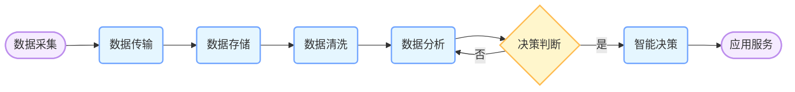

# 价值投资中的智能城市水资源管理系统分析

> 关键词：价值投资、智能城市、水资源管理系统、数据分析、可持续发展

> 摘要：本文聚焦于价值投资视角下的智能城市水资源管理系统。首先介绍了该系统相关的背景信息，包括目的范围、预期读者等。接着阐述了核心概念及其联系，详细说明了核心算法原理与具体操作步骤，并给出相应的Python代码。通过数学模型和公式进一步剖析系统的内在逻辑，同时结合项目实战案例，从开发环境搭建到源代码实现与解读进行了深入分析。探讨了系统的实际应用场景，推荐了相关的工具和资源，最后总结了系统未来的发展趋势与挑战，还提供了常见问题解答及扩展阅读参考资料，旨在为价值投资者和相关技术人员全面深入了解智能城市水资源管理系统提供有价值的参考。

## 1. 背景介绍 
### 1.1 目的和范围
在当今城市化进程加速的背景下，城市水资源的合理管理变得至关重要。智能城市水资源管理系统旨在利用先进的信息技术和数据分析手段，实现对城市水资源的高效监测、调配和利用，以提高水资源的利用效率，保障城市的可持续发展。本文章的范围涵盖了智能城市水资源管理系统的核心概念、算法原理、数学模型、项目实战、应用场景以及相关的工具和资源等方面，为价值投资者和相关技术人员提供全面的了解和分析。

### 1.2 预期读者
本文的预期读者包括价值投资者，他们希望通过了解智能城市水资源管理系统的技术和市场潜力，寻找有价值的投资机会；城市规划者和水资源管理部门的工作人员，他们可以从系统的设计和实现中获取灵感，优化城市水资源管理策略；以及对智能城市和水资源管理技术感兴趣的技术人员，他们可以深入学习系统的核心算法和实现细节。

### 1.3 文档结构概述
本文将按照以下结构进行组织：首先介绍智能城市水资源管理系统的背景信息，包括目的范围、预期读者等；接着阐述系统的核心概念及其联系，给出相应的文本示意图和Mermaid流程图；然后详细说明系统的核心算法原理与具体操作步骤，并使用Python代码进行实现；通过数学模型和公式进一步剖析系统的内在逻辑，并举例说明；结合项目实战案例，从开发环境搭建到源代码实现与解读进行深入分析；探讨系统的实际应用场景；推荐相关的工具和资源；最后总结系统未来的发展趋势与挑战，提供常见问题解答及扩展阅读参考资料。

### 1.4 术语表
#### 1.4.1 核心术语定义
- **智能城市**：指利用信息技术和数据分析手段，实现城市基础设施智能化、管理精细化、服务高效化的城市发展模式。
- **水资源管理系统**：对水资源的开发、利用、保护等进行全面管理的系统，包括水资源监测、调配、污水处理等环节。
- **价值投资**：一种投资策略，通过对资产的内在价值进行评估，寻找被低估的资产进行投资。
- **数据分析**：对大量数据进行收集、整理、分析和挖掘，以发现数据中的规律和价值。

#### 1.4.2 相关概念解释
- **物联网（IoT）**：通过各种传感器和设备，实现物体之间的互联互通和数据传输，为智能城市水资源管理系统提供数据采集的基础。
- **云计算**：一种基于互联网的计算模式，提供强大的计算能力和存储空间，支持智能城市水资源管理系统的大数据处理和分析。
- **机器学习**：让计算机通过数据学习和模型训练，自动发现数据中的规律和模式，为智能城市水资源管理系统的决策提供支持。

#### 1.4.3 缩略词列表
- **IoT**：Internet of Things（物联网）
- **AI**：Artificial Intelligence（人工智能）
- **ML**：Machine Learning（机器学习）
- **GIS**：Geographic Information System（地理信息系统）

## 2. 核心概念与联系 
### 核心概念原理
智能城市水资源管理系统主要基于物联网、云计算、数据分析和机器学习等技术，实现对城市水资源的全面监测、实时分析和智能决策。系统通过部署在城市各个角落的传感器，实时采集水资源的相关数据，如水位、水质、流量等。这些数据通过物联网传输到云计算平台，在平台上进行存储、处理和分析。利用数据分析和机器学习算法，对采集到的数据进行挖掘和建模，预测水资源的变化趋势，提供科学的决策支持。例如，根据历史数据和实时监测数据，预测未来一段时间内的用水量，合理调配水资源，避免水资源的浪费和短缺。

### 架构的文本示意图
智能城市水资源管理系统的架构主要包括数据采集层、数据传输层、数据处理层和应用层。
- **数据采集层**：由各种传感器组成，如水位传感器、水质传感器、流量传感器等，负责实时采集水资源的相关数据。
- **数据传输层**：通过物联网技术，将采集到的数据传输到云计算平台。常见的物联网通信技术包括LoRa、ZigBee、NB-IoT等。
- **数据处理层**：在云计算平台上，对采集到的数据进行存储、清洗、分析和挖掘。利用大数据处理技术和机器学习算法，构建水资源预测模型和决策模型。
- **应用层**：为用户提供各种应用服务，如水资源监测、水资源调配、水质预警等。用户可以通过Web界面或移动应用程序访问系统，获取实时的水资源信息和决策建议。

### Mermaid流程图


该流程图展示了智能城市水资源管理系统的基本工作流程。首先进行数据采集，然后将采集到的数据传输到系统中进行存储和清洗。经过数据分析后，进行决策判断，如果满足条件则进行智能决策，最后将决策结果应用到实际的水资源管理中。

## 3. 核心算法原理 & 具体操作步骤 
### 核心算法原理
在智能城市水资源管理系统中，常用的核心算法包括时间序列分析算法和机器学习算法。时间序列分析算法用于对水资源数据的时间序列进行建模和预测，如ARIMA（自回归积分滑动平均模型）。机器学习算法则可以用于构建水资源预测模型和决策模型，如神经网络、支持向量机等。

以ARIMA算法为例，其基本原理是通过对时间序列数据的自回归、差分和移动平均操作，建立一个能够描述时间序列变化规律的模型。ARIMA模型的一般形式为$ARIMA(p, d, q)$，其中$p$表示自回归阶数，$d$表示差分阶数，$q$表示移动平均阶数。

### 具体操作步骤
#### 步骤1：数据准备
首先，需要收集和整理历史水资源数据，如水位、流量等。将数据按照时间顺序排列，形成时间序列数据。

#### 步骤2：数据预处理
对收集到的数据进行预处理，包括缺失值处理、异常值处理和数据归一化等。缺失值可以采用插值法进行填充，异常值可以通过统计方法进行识别和处理，数据归一化可以将数据缩放到一个固定的范围内，便于模型的训练和预测。

#### 步骤3：模型选择和训练
根据数据的特点和预测需求，选择合适的ARIMA模型阶数$p$、$d$、$q$。可以使用网格搜索等方法，在一定的范围内搜索最优的模型参数。然后，使用训练数据对ARIMA模型进行训练，得到模型的参数估计值。

#### 步骤4：模型评估和优化
使用测试数据对训练好的模型进行评估，常用的评估指标包括均方误差（MSE）、均方根误差（RMSE）和平均绝对误差（MAE）等。如果模型的评估结果不理想，可以对模型进行优化，如调整模型参数、增加训练数据等。

#### 步骤5：预测和决策
使用训练好的模型对未来的水资源数据进行预测，根据预测结果进行智能决策，如水资源调配、水质预警等。

### Python源代码实现
```python
import pandas as pd
import numpy as np
from statsmodels.tsa.arima.model import ARIMA
from sklearn.metrics import mean_squared_error
import matplotlib.pyplot as plt

# 步骤1：数据准备
# 假设已经有一个包含时间序列数据的CSV文件
data = pd.read_csv('water_data.csv', index_col='date', parse_dates=True)
# 提取需要预测的变量，如水位
water_level = data['water_level']

# 步骤2：数据预处理
# 处理缺失值
water_level = water_level.fillna(method='ffill')

# 步骤3：模型选择和训练
# 划分训练集和测试集
train_size = int(len(water_level) * 0.8)
train_data, test_data = water_level[:train_size], water_level[train_size:]

# 选择ARIMA模型的参数
p, d, q = 1, 1, 1
model = ARIMA(train_data, order=(p, d, q))
model_fit = model.fit()

# 步骤4：模型评估和优化
# 进行预测
predictions = model_fit.predict(start=len(train_data), end=len(train_data)+len(test_data)-1, typ='levels')

# 计算均方误差
mse = mean_squared_error(test_data, predictions)
print(f"均方误差: {mse}")

# 可视化预测结果
plt.plot(test_data.index, test_data.values, label='实际值')
plt.plot(test_data.index, predictions.values, label='预测值')
plt.xlabel('日期')
plt.ylabel('水位')
plt.title('水位预测结果')
plt.legend()
plt.show()

# 步骤5：预测和决策
# 预测未来一段时间的水位
future_steps = 10
future_predictions = model_fit.get_forecast(steps=future_steps)
future_mean = future_predictions.predicted_mean
print(f"未来 {future_steps} 天的水位预测值: {future_mean}")
```

以上代码实现了一个简单的ARIMA模型用于水位预测。首先，读取并处理历史水位数据，然后划分训练集和测试集，选择合适的ARIMA模型参数进行训练。通过计算均方误差评估模型的性能，并可视化预测结果。最后，使用训练好的模型预测未来一段时间的水位。

## 4. 数学模型和公式 & 详细讲解 & 举例说明 
### ARIMA模型的数学公式
ARIMA$(p, d, q)$模型的数学公式可以表示为：

$$
\phi(B)(1 - B)^d Y_t = \theta(B) \epsilon_t
$$

其中：
- $Y_t$ 是时间序列在时刻 $t$ 的观测值。
- $B$ 是滞后算子，$B Y_t = Y_{t - 1}$。
- $(1 - B)^d$ 表示 $d$ 阶差分算子，用于将非平稳时间序列转换为平稳时间序列。
- $\phi(B) = 1 - \phi_1 B - \phi_2 B^2 - \cdots - \phi_p B^p$ 是自回归多项式，$\phi_i$ 是自回归系数。
- $\theta(B) = 1 + \theta_1 B + \theta_2 B^2 + \cdots + \theta_q B^q$ 是移动平均多项式，$\theta_i$ 是移动平均系数。
- $\epsilon_t$ 是白噪声序列，均值为 0，方差为 $\sigma^2$。

### 详细讲解
- **自回归部分（AR）**：自回归部分表示当前时刻的观测值 $Y_t$ 可以由过去 $p$ 个时刻的观测值线性组合得到，即：
$$
Y_t = \phi_1 Y_{t - 1} + \phi_2 Y_{t - 2} + \cdots + \phi_p Y_{t - p} + \epsilon_t
$$
自回归系数 $\phi_i$ 反映了过去观测值对当前观测值的影响程度。

- **差分部分（I）**：差分部分用于处理非平稳时间序列。通过对时间序列进行 $d$ 阶差分，将其转换为平稳时间序列。例如，一阶差分可以表示为：
$$
\nabla Y_t = Y_t - Y_{t - 1}
$$

- **移动平均部分（MA）**：移动平均部分表示当前时刻的观测值 $Y_t$ 可以由过去 $q$ 个时刻的白噪声序列线性组合得到，即：
$$
Y_t = \epsilon_t + \theta_1 \epsilon_{t - 1} + \theta_2 \epsilon_{t - 2} + \cdots + \theta_q \epsilon_{t - q}
$$
移动平均系数 $\theta_i$ 反映了过去白噪声对当前观测值的影响程度。

### 举例说明
假设我们有一个水位时间序列数据 $Y_t$，经过分析发现该序列是非平稳的，需要进行一阶差分处理，即 $d = 1$。通过自相关函数（ACF）和偏自相关函数（PACF）分析，确定自回归阶数 $p = 1$，移动平均阶数 $q = 1$，则该时间序列可以用 ARIMA$(1, 1, 1)$ 模型进行建模。

ARIMA$(1, 1, 1)$ 模型的具体形式为：
$$
(1 - \phi_1 B)(1 - B) Y_t = (1 + \theta_1 B) \epsilon_t
$$

展开可得：
$$
Y_t - Y_{t - 1} - \phi_1 (Y_{t - 1} - Y_{t - 2}) = \epsilon_t + \theta_1 \epsilon_{t - 1}
$$

即：
$$
Y_t = (1 + \phi_1) Y_{t - 1} - \phi_1 Y_{t - 2} + \epsilon_t + \theta_1 \epsilon_{t - 1}
$$

通过训练数据估计出 $\phi_1$ 和 $\theta_1$ 的值，就可以使用该模型对未来的水位进行预测。

## 5. 项目实战：代码实际案例和详细解释说明 
### 5.1  开发环境搭建
#### 操作系统
可以选择常见的操作系统，如Windows、Linux（如Ubuntu）或macOS。本文以Ubuntu 20.04为例进行说明。

#### Python环境
Python是实现智能城市水资源管理系统的主要编程语言。建议使用Python 3.7及以上版本。可以通过以下命令安装Python：
```bash
sudo apt update
sudo apt install python3 python3-pip
```

#### 依赖库安装
智能城市水资源管理系统需要使用一些Python库，如pandas、numpy、statsmodels、matplotlib等。可以使用以下命令安装这些库：
```bash
pip3 install pandas numpy statsmodels matplotlib
```

### 5.2  源代码详细实现和代码解读
以下是一个完整的智能城市水资源管理系统的项目实战代码，用于水位预测和水资源调配决策：

```python
import pandas as pd
import numpy as np
from statsmodels.tsa.arima.model import ARIMA
from sklearn.metrics import mean_squared_error
import matplotlib.pyplot as plt

# 步骤1：数据准备
# 读取水位数据
data = pd.read_csv('water_level_data.csv', index_col='date', parse_dates=True)
water_level = data['water_level']

# 步骤2：数据预处理
# 处理缺失值
water_level = water_level.fillna(method='ffill')

# 步骤3：模型选择和训练
# 划分训练集和测试集
train_size = int(len(water_level) * 0.8)
train_data, test_data = water_level[:train_size], water_level[train_size:]

# 选择ARIMA模型的参数
p, d, q = 1, 1, 1
model = ARIMA(train_data, order=(p, d, q))
model_fit = model.fit()

# 步骤4：模型评估和优化
# 进行预测
predictions = model_fit.predict(start=len(train_data), end=len(train_data)+len(test_data)-1, typ='levels')

# 计算均方误差
mse = mean_squared_error(test_data, predictions)
print(f"均方误差: {mse}")

# 可视化预测结果
plt.plot(test_data.index, test_data.values, label='实际值')
plt.plot(test_data.index, predictions.values, label='预测值')
plt.xlabel('日期')
plt.ylabel('水位')
plt.title('水位预测结果')
plt.legend()
plt.show()

# 步骤5：预测和决策
# 预测未来一段时间的水位
future_steps = 10
future_predictions = model_fit.get_forecast(steps=future_steps)
future_mean = future_predictions.predicted_mean
print(f"未来 {future_steps} 天的水位预测值: {future_mean}")

# 水资源调配决策
threshold = 10  # 水位阈值
if future_mean.iloc[-1] > threshold:
    print("未来水位将超过阈值，建议增加排水力度。")
else:
    print("未来水位在安全范围内，无需特殊处理。")
```

### 代码解读与分析
#### 数据准备
通过`pandas`库读取水位数据文件`water_level_data.csv`，并将日期列作为索引，确保数据按时间顺序排列。

#### 数据预处理
使用`fillna`方法处理缺失值，采用前向填充的方式，即用前一个非缺失值填充当前缺失值。

#### 模型选择和训练
将数据划分为训练集和测试集，比例为8:2。选择ARIMA$(1, 1, 1)$模型进行训练，使用`fit`方法估计模型参数。

#### 模型评估和优化
使用`predict`方法对测试集进行预测，计算预测值与实际值之间的均方误差，评估模型的性能。通过`matplotlib`库可视化预测结果，直观地观察模型的预测效果。

#### 预测和决策
使用`get_forecast`方法预测未来10天的水位。设置一个水位阈值，根据预测结果判断未来水位是否超过阈值，从而做出水资源调配决策。

## 6. 实际应用场景 
### 水资源监测与预警
智能城市水资源管理系统可以实时监测城市各个区域的水位、水质和流量等信息。通过数据分析和机器学习算法，对水资源的变化趋势进行预测，当水位超过预警阈值或水质出现异常时，及时发出警报，提醒相关部门采取措施，避免发生洪涝灾害或水污染事件。

### 水资源调配
根据水资源的实时监测数据和预测结果，智能城市水资源管理系统可以优化水资源的调配方案。例如，在干旱时期，合理分配水资源，优先保障居民生活用水和重要工业用水；在丰水时期，将多余的水资源储存起来，以备不时之需。

### 污水处理与再生利用
智能城市水资源管理系统可以对污水处理厂的运行情况进行实时监测，包括污水的流量、水质和处理效果等。通过数据分析和优化算法，提高污水处理效率，降低处理成本。同时，系统可以对再生水的利用情况进行管理，如将再生水用于城市绿化、工业冷却等领域，提高水资源的循环利用率。

### 城市规划与建设
在城市规划和建设过程中，智能城市水资源管理系统可以提供水资源相关的决策支持。例如，根据城市的水资源承载能力，合理规划城市的人口规模和产业布局；在新建建筑中，推广雨水收集和中水回用等节水技术，减少对城市水资源的依赖。

## 7. 工具和资源推荐
### 7.1 学习资源推荐
#### 7.1.1 书籍推荐
- 《智能城市：物联网、大数据与智慧城市的未来》：本书介绍了智能城市的概念、技术和应用，包括物联网、大数据、云计算等方面的内容，对智能城市水资源管理系统的学习有很大的帮助。
- 《时间序列分析：预测与控制》：详细介绍了时间序列分析的理论和方法，包括ARIMA模型、季节性模型等，是学习智能城市水资源管理系统中时间序列预测的经典教材。
- 《机器学习实战》：通过实际案例介绍了机器学习的基本算法和应用，如神经网络、支持向量机等，有助于理解智能城市水资源管理系统中机器学习算法的原理和实现。

#### 7.1.2 在线课程
- Coursera上的“Data Science Specialization”：该课程涵盖了数据科学的各个方面，包括数据采集、清洗、分析和可视化等，对智能城市水资源管理系统中的数据分析有很大的帮助。
- edX上的“Artificial Intelligence”：介绍了人工智能的基本概念、算法和应用，包括机器学习、深度学习等，有助于深入理解智能城市水资源管理系统中的人工智能技术。
- Udemy上的“Python for Data Science and Machine Learning Bootcamp”：通过Python语言介绍了数据科学和机器学习的基础知识和实践，适合初学者快速入门。

#### 7.1.3 技术博客和网站
- Medium：是一个技术博客平台，上面有很多关于智能城市、水资源管理、数据分析等方面的文章，可以从中获取最新的技术动态和实践经验。
- Towards Data Science：专注于数据科学和机器学习领域的技术博客，提供了大量的优质文章和案例分析，对智能城市水资源管理系统的学习有很大的启发。
- Kaggle：是一个数据科学竞赛平台，上面有很多与水资源管理相关的数据集和竞赛项目，可以通过参与竞赛提高自己的数据分析和建模能力。

### 7.2 开发工具框架推荐
#### 7.2.1 IDE和编辑器
- PyCharm：是一款专业的Python集成开发环境（IDE），提供了丰富的代码编辑、调试和项目管理功能，适合开发智能城市水资源管理系统的Python代码。
- Jupyter Notebook：是一个交互式的开发环境，支持Python、R等多种编程语言，适合进行数据探索、模型训练和可视化等工作。
- Visual Studio Code：是一款轻量级的代码编辑器，支持多种编程语言和插件扩展，具有强大的代码编辑和调试功能，也可以用于开发智能城市水资源管理系统。

#### 7.2.2 调试和性能分析工具
- pdb：是Python自带的调试器，可以在代码中设置断点，逐步执行代码，查看变量的值和程序的执行流程，帮助调试代码。
- cProfile：是Python的性能分析工具，可以分析代码的执行时间和函数调用情况，找出代码中的性能瓶颈，进行优化。
- TensorBoard：是TensorFlow的可视化工具，可以用于可视化深度学习模型的训练过程和性能指标，帮助优化模型。

#### 7.2.3 相关框架和库
- pandas：是一个强大的数据处理和分析库，提供了高效的数据结构和数据操作方法，适合处理智能城市水资源管理系统中的结构化数据。
- numpy：是Python的数值计算库，提供了高效的多维数组和数学函数，是进行数据分析和机器学习的基础库。
- statsmodels：是一个统计建模和计量经济学库，提供了多种统计模型和方法，包括ARIMA模型、线性回归等，适合用于智能城市水资源管理系统中的时间序列分析和建模。
- scikit-learn：是一个常用的机器学习库，提供了多种机器学习算法和工具，如分类、回归、聚类等，适合用于智能城市水资源管理系统中的数据分析和预测。

### 7.3 相关论文著作推荐
#### 7.3.1 经典论文
- "A New Approach to Linear Filtering and Prediction Problems" by R. E. Kalman：介绍了卡尔曼滤波算法，是时间序列预测和信号处理领域的经典论文，对智能城市水资源管理系统中的数据滤波和预测有重要的参考价值。
- "Gradient-Based Learning Applied to Document Recognition" by Y. LeCun, L. Bottou, Y. Bengio, and P. Haffner：介绍了卷积神经网络（CNN）的基本原理和应用，是深度学习领域的经典论文，对智能城市水资源管理系统中的图像识别和数据分析有一定的启示。
- "The Elements of Statistical Learning: Data Mining, Inference, and Prediction" by T. Hastie, R. Tibshirani, and J. Friedman：是统计学习领域的经典著作，详细介绍了各种统计学习方法和算法，对智能城市水资源管理系统中的数据分析和建模有很大的帮助。

#### 7.3.2 最新研究成果
- 可以通过IEEE Xplore、ACM Digital Library等学术数据库搜索关于智能城市水资源管理系统的最新研究论文，了解该领域的最新技术和发展趋势。
- 关注相关的学术会议，如IEEE International Conference on Smart Cities（ISC2）、ACM SIGSPATIAL International Conference on Advances in Geographic Information Systems（ACM SIGSPATIAL）等，获取最新的研究成果和实践经验。

#### 7.3.3 应用案例分析
- 可以查阅一些城市的智能水资源管理项目报告和案例分析，了解实际应用中的系统设计、实施和效果评估等方面的经验。例如，新加坡的智能水资源管理系统、巴塞罗那的智能城市项目等，都是比较成功的应用案例。

## 8. 总结：未来发展趋势与挑战
### 未来发展趋势
#### 智能化程度不断提高
随着人工智能和机器学习技术的不断发展，智能城市水资源管理系统将越来越智能化。系统将能够自动学习和适应水资源的变化规律，实现更加精准的预测和决策。例如，利用深度学习算法对大量的水资源数据进行分析和挖掘，发现隐藏的模式和规律，为水资源管理提供更加科学的决策支持。

#### 与其他系统的融合
智能城市水资源管理系统将与城市的其他智能系统，如智能交通系统、智能能源系统等进行深度融合。通过数据共享和协同工作，实现城市资源的优化配置和高效利用。例如，将水资源管理与城市绿化系统相结合，根据天气情况和土壤湿度自动调整灌溉水量，提高水资源的利用效率。

#### 物联网技术的广泛应用
物联网技术将在智能城市水资源管理系统中得到更广泛的应用。更多的传感器将被部署在城市的各个角落，实时采集水资源的相关数据，实现对水资源的全面监测和管理。同时，物联网技术将实现设备之间的互联互通和自动化控制，提高水资源管理的效率和可靠性。

#### 大数据和云计算的支持
大数据和云计算技术将为智能城市水资源管理系统提供强大的支持。通过大数据技术，可以对海量的水资源数据进行存储、处理和分析，挖掘数据中的价值。云计算技术则可以提供强大的计算能力和存储空间，支持系统的大规模部署和运行。

### 挑战
#### 数据安全和隐私问题
智能城市水资源管理系统涉及大量的敏感数据，如居民的用水信息、水质监测数据等。如何保障这些数据的安全和隐私是一个重要的挑战。需要采用先进的加密技术和安全机制，防止数据泄露和恶意攻击。

#### 技术标准和规范的缺乏
目前，智能城市水资源管理系统的技术标准和规范还不够完善，不同的系统之间可能存在兼容性问题。需要制定统一的技术标准和规范，促进系统的互联互通和互操作性。

#### 人才短缺
智能城市水资源管理系统需要具备多学科知识的复合型人才，如计算机科学、水资源工程、统计学等。目前，这类人才相对短缺，需要加强相关专业的人才培养和引进。

#### 投资成本高
建设和维护智能城市水资源管理系统需要大量的资金投入，包括传感器设备的采购、数据中心的建设、软件开发和维护等。对于一些经济欠发达地区来说，投资成本可能是一个较大的障碍。

## 9. 附录：常见问题与解答
### 问题1：智能城市水资源管理系统需要哪些硬件设备？
智能城市水资源管理系统需要的硬件设备主要包括传感器、数据采集器、通信设备和服务器等。传感器用于实时采集水资源的相关数据，如水位、水质、流量等；数据采集器用于收集传感器的数据，并进行初步处理；通信设备用于将采集到的数据传输到服务器；服务器用于存储、处理和分析数据，并提供应用服务。

### 问题2：如何选择合适的ARIMA模型参数？
选择合适的ARIMA模型参数可以通过自相关函数（ACF）和偏自相关函数（PACF）分析来确定。ACF和PACF图可以帮助我们判断时间序列的自相关性和偏自相关性，从而确定自回归阶数$p$和移动平均阶数$q$。差分阶数$d$可以通过观察时间序列的平稳性来确定，如果时间序列是非平稳的，则需要进行差分处理，直到序列变为平稳序列。此外，还可以使用网格搜索等方法，在一定的范围内搜索最优的模型参数。

### 问题3：智能城市水资源管理系统的实施难度大吗？
智能城市水资源管理系统的实施难度相对较大，主要体现在以下几个方面：一是需要涉及多个领域的知识和技术，如物联网、数据分析、机器学习等，需要具备多学科知识的复合型人才；二是需要进行大量的硬件设备安装和调试工作，包括传感器的部署、通信网络的建设等；三是需要与城市的现有水资源管理系统进行集成和对接，确保系统的兼容性和稳定性。但是，随着技术的不断发展和成熟，实施难度也在逐渐降低。

### 问题4：智能城市水资源管理系统的投资回报率如何？
智能城市水资源管理系统的投资回报率取决于多个因素，如系统的建设成本、运行成本、水资源的节约效益、减少灾害损失等。一般来说，通过提高水资源的利用效率、减少水资源的浪费和污染、降低灾害损失等方式，可以获得显著的经济效益和社会效益。同时，随着技术的不断进步和成本的不断降低，投资回报率也会逐渐提高。

## 10. 扩展阅读 & 参考资料
### 扩展阅读
- 《智慧城市：数字化转型的实践与创新》：本书介绍了智慧城市的建设理念、技术和实践案例，对智能城市水资源管理系统的建设有一定的参考价值。
- 《水资源经济学》：从经济学的角度探讨了水资源的价值、管理和利用问题，有助于深入理解智能城市水资源管理系统的经济意义。
- 《物联网技术与应用》：详细介绍了物联网的技术原理、应用场景和发展趋势，对智能城市水资源管理系统中的物联网应用有更深入的了解。

### 参考资料
- 相关的学术论文和研究报告，可以通过IEEE Xplore、ACM Digital Library、Google Scholar等学术数据库进行搜索。
- 智能城市水资源管理系统的相关标准和规范，如ISO、IEEE等组织发布的标准。
- 政府部门和行业协会发布的关于城市水资源管理的政策文件和统计数据。

作者：AI天才研究院/AI Genius Institute & 禅与计算机程序设计艺术 /Zen And The Art of Computer Programming