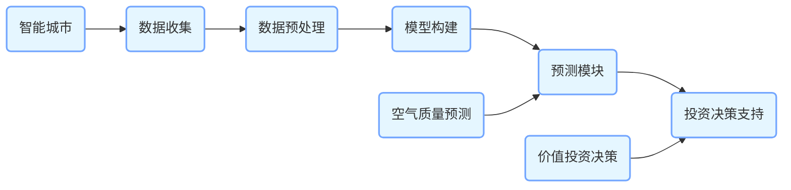

# 价值投资中的智能城市空气质量预测系统分析

> 关键词：价值投资、智能城市、空气质量预测系统、数据分析、机器学习

> 摘要：本文聚焦于价值投资视角下的智能城市空气质量预测系统。首先介绍了该系统研究的背景、目的、预期读者等内容。接着阐述了核心概念及其联系，包括空气质量预测、价值投资等概念及它们之间的关联，并给出相应的文本示意图和Mermaid流程图。详细讲解了核心算法原理，结合Python源代码说明操作步骤。同时给出相关数学模型和公式，并举例说明。通过项目实战，展示开发环境搭建、源代码实现及解读。分析了该系统的实际应用场景，推荐了学习资源、开发工具框架和相关论文著作。最后总结了未来发展趋势与挑战，还设置了常见问题解答和扩展阅读参考资料。

## 1. 背景介绍 
### 1.1 目的和范围
在当今社会，随着城市化进程的加速，城市空气质量问题日益受到关注。对于价值投资者而言，空气质量不仅关乎环境质量，还与众多行业的发展和投资机会紧密相连。智能城市空气质量预测系统旨在通过先进的技术手段，准确预测城市空气质量，为价值投资决策提供科学依据。本研究的范围涵盖了空气质量数据的收集、处理、分析以及预测模型的构建和应用，同时探讨该系统在价值投资领域的具体应用和影响。

### 1.2 预期读者
本文预期读者主要包括价值投资者、城市规划者、环境科学家、数据分析师以及对智能城市和空气质量预测感兴趣的技术爱好者。价值投资者可以通过该系统了解空气质量变化对投资标的的影响，城市规划者可以依据预测结果优化城市布局和环境管理，环境科学家可以深入研究空气质量的变化规律，数据分析师可以学习系统中的数据分析和建模方法，技术爱好者则可以了解该领域的前沿技术和应用。

### 1.3 文档结构概述
本文将按照以下结构进行阐述：首先介绍背景信息，包括目的、预期读者和文档结构概述；接着讲解核心概念与联系，明确相关概念的定义和它们之间的关系；然后详细说明核心算法原理和具体操作步骤，结合Python代码进行讲解；给出数学模型和公式，并举例说明；通过项目实战展示系统的开发和实现过程；分析实际应用场景；推荐相关的工具和资源；总结未来发展趋势与挑战；设置常见问题解答；最后提供扩展阅读和参考资料。

### 1.4 术语表
#### 1.4.1 核心术语定义
- **价值投资**：一种基于对资产内在价值评估的投资策略，投资者通过分析公司的基本面、财务状况等因素，寻找被低估的资产进行投资。
- **智能城市**：利用信息技术和通信技术，实现城市的智能化管理和运行，提高城市的效率和可持续发展能力。
- **空气质量预测系统**：通过收集和分析空气质量相关数据，运用数学模型和算法，对未来一段时间内的空气质量进行预测的系统。

#### 1.4.2 相关概念解释
- **空气质量指数（AQI）**：定量描述空气质量状况的无量纲指数，数值越大、级别越高，说明空气污染状况越严重。
- **机器学习**：一门多领域交叉学科，涉及概率论、统计学、逼近论、凸分析、算法复杂度理论等多门学科。它专门研究计算机怎样模拟或实现人类的学习行为，以获取新的知识或技能，重新组织已有的知识结构使之不断改善自身的性能。

#### 1.4.3 缩略词列表
- **AQI**：Air Quality Index（空气质量指数）
- **ML**：Machine Learning（机器学习）
- **LSTM**：Long Short-Term Memory（长短期记忆网络）

## 2. 核心概念与联系 
### 核心概念原理
#### 空气质量预测
空气质量预测是根据历史空气质量数据、气象数据、污染源排放数据等多源数据，运用数学模型和算法，对未来一段时间内的空气质量进行预测的过程。其原理基于大气物理学、统计学和机器学习等理论，通过分析数据中的规律和模式，建立预测模型。

#### 价值投资
价值投资的核心原理是寻找被市场低估的资产，通过对公司的基本面、财务状况、行业前景等因素进行分析，评估资产的内在价值。当市场价格低于内在价值时，投资者认为该资产具有投资价值，从而进行买入操作。

#### 智能城市
智能城市是利用物联网、云计算、大数据、人工智能等技术，实现城市的智能化管理和运行。在空气质量方面，智能城市可以通过安装传感器网络，实时收集空气质量数据，并将其传输到数据中心进行分析和处理，从而实现对空气质量的实时监测和预测。

### 架构的文本示意图
```plaintext
价值投资 <-- 智能城市空气质量预测系统 --> 空气质量预测

智能城市空气质量预测系统：
|-- 数据收集模块（空气质量数据、气象数据、污染源数据）
|-- 数据预处理模块（清洗、归一化、特征提取）
|-- 模型构建模块（机器学习模型、深度学习模型）
|-- 预测模块（生成空气质量预测结果）
|-- 投资决策支持模块（结合预测结果提供投资建议）
```

### Mermaid流程图


## 3. 核心算法原理 & 具体操作步骤 

### 核心算法原理
在智能城市空气质量预测系统中，常用的算法包括机器学习算法和深度学习算法。这里以长短期记忆网络（LSTM）为例进行介绍。

LSTM是一种特殊的循环神经网络（RNN），它能够处理序列数据中的长期依赖关系。传统的RNN在处理长序列时会出现梯度消失或梯度爆炸的问题，而LSTM通过引入门控机制，有效地解决了这个问题。

LSTM单元包含三个门：输入门（$i_t$）、遗忘门（$f_t$）和输出门（$o_t$），以及一个细胞状态（$C_t$）。其核心原理可以通过以下公式表示：

遗忘门：
$$f_t = \sigma(W_f[h_{t-1}, x_t] + b_f)$$

输入门：
$$i_t = \sigma(W_i[h_{t-1}, x_t] + b_i)$$
$$\tilde{C}_t = \tanh(W_C[h_{t-1}, x_t] + b_C)$$

细胞状态更新：
$$C_t = f_t \odot C_{t-1} + i_t \odot \tilde{C}_t$$

输出门：
$$o_t = \sigma(W_o[h_{t-1}, x_t] + b_o)$$
$$h_t = o_t \odot \tanh(C_t)$$

其中，$\sigma$ 是 sigmoid 函数，$\tanh$ 是双曲正切函数，$W$ 是权重矩阵，$b$ 是偏置向量，$\odot$ 表示逐元素相乘，$h_{t-1}$ 是上一时刻的隐藏状态，$x_t$ 是当前时刻的输入。

### 具体操作步骤及Python源代码

#### 步骤1：数据收集和预处理
```python
import pandas as pd
import numpy as np
from sklearn.preprocessing import MinMaxScaler

# 假设已经有空气质量数据文件 air_quality.csv
data = pd.read_csv('air_quality.csv')

# 提取需要的特征列
features = data[['AQI', 'temperature', 'humidity', 'wind_speed']]

# 数据归一化
scaler = MinMaxScaler()
scaled_features = scaler.fit_transform(features)

# 划分训练集和测试集
train_size = int(len(scaled_features) * 0.8)
train_data = scaled_features[:train_size]
test_data = scaled_features[train_size:]

# 准备训练数据和标签
def create_sequences(data, seq_length):
    xs, ys = [], []
    for i in range(len(data) - seq_length):
        x = data[i:i+seq_length]
        y = data[i+seq_length, 0]  # 以 AQI 作为预测目标
        xs.append(x)
        ys.append(y)
    return np.array(xs), np.array(ys)

seq_length = 10
X_train, y_train = create_sequences(train_data, seq_length)
X_test, y_test = create_sequences(test_data, seq_length)
```

#### 步骤2：构建LSTM模型
```python
from tensorflow.keras.models import Sequential
from tensorflow.keras.layers import LSTM, Dense

model = Sequential()
model.add(LSTM(50, return_sequences=True, input_shape=(seq_length, X_train.shape[2])))
model.add(LSTM(50, return_sequences=False))
model.add(Dense(25))
model.add(Dense(1))

model.compile(optimizer='adam', loss='mean_squared_error')
```

#### 步骤3：模型训练
```python
model.fit(X_train, y_train, batch_size=32, epochs=50)
```

#### 步骤4：模型预测
```python
predictions = model.predict(X_test)

# 反归一化
predictions = scaler.inverse_transform(np.hstack((predictions, test_data[seq_length:, 1:])))[:, 0]
y_test = scaler.inverse_transform(test_data[seq_length:])[:, 0]
```

## 4. 数学模型和公式 & 详细讲解 & 举例说明 

### 数学模型
在空气质量预测中，除了LSTM模型，还可以使用其他数学模型，如线性回归模型。线性回归模型是一种简单而有效的预测模型，其基本形式为：

$$y = \beta_0 + \beta_1x_1 + \beta_2x_2 + \cdots + \beta_nx_n + \epsilon$$

其中，$y$ 是预测目标（如AQI），$x_1, x_2, \cdots, x_n$ 是输入特征（如温度、湿度、风速等），$\beta_0, \beta_1, \cdots, \beta_n$ 是模型的系数，$\epsilon$ 是误差项。

### 公式详细讲解
#### 线性回归模型的系数求解
线性回归模型的系数可以通过最小二乘法来求解。最小二乘法的目标是使预测值与实际值之间的误差平方和最小，即：

$$\min_{\beta_0, \beta_1, \cdots, \beta_n} \sum_{i=1}^{m} (y_i - (\beta_0 + \beta_1x_{i1} + \beta_2x_{i2} + \cdots + \beta_nx_{in}))^2$$

其中，$m$ 是样本数量，$y_i$ 是第 $i$ 个样本的实际值，$x_{i1}, x_{i2}, \cdots, x_{in}$ 是第 $i$ 个样本的输入特征。

通过对上述目标函数求偏导数并令其为零，可以得到系数的解析解：

$$\hat{\beta} = (X^T X)^{-1} X^T y$$

其中，$\hat{\beta}$ 是系数向量，$X$ 是输入特征矩阵，$y$ 是目标向量。

### 举例说明
假设我们有以下空气质量数据：

| AQI | Temperature | Humidity | Wind Speed |
|-----|-------------|----------|------------|
| 50  | 20          | 60       | 5          |
| 60  | 22          | 55       | 6          |
| 70  | 25          | 50       | 7          |

我们使用线性回归模型来预测AQI，输入特征为温度、湿度和风速。首先，将数据转换为矩阵形式：

$$X = \begin{bmatrix}
1 & 20 & 60 & 5 \\
1 & 22 & 55 & 6 \\
1 & 25 & 50 & 7
\end{bmatrix}$$

$$y = \begin{bmatrix}
50 \\
60 \\
70
\end{bmatrix}$$

然后，计算 $(X^T X)^{-1} X^T y$ 得到系数向量 $\hat{\beta}$。最后，对于新的输入特征 $(x_1, x_2, x_3)$，可以通过公式 $y = \hat{\beta}_0 + \hat{\beta}_1x_1 + \hat{\beta}_2x_2 + \hat{\beta}_3x_3$ 预测AQI。

## 5. 项目实战：代码实际案例和详细解释说明 

### 5.1  开发环境搭建
#### 安装Python
首先需要安装Python，建议使用Python 3.7及以上版本。可以从Python官方网站（https://www.python.org/downloads/）下载并安装。

#### 安装必要的库
使用以下命令安装必要的Python库：
```sh
pip install pandas numpy scikit-learn tensorflow matplotlib
```

### 5.2  源代码详细实现和代码解读
```python
import pandas as pd
import numpy as np
from sklearn.preprocessing import MinMaxScaler
from tensorflow.keras.models import Sequential
from tensorflow.keras.layers import LSTM, Dense
import matplotlib.pyplot as plt

# 数据收集和预处理
data = pd.read_csv('air_quality.csv')
features = data[['AQI', 'temperature', 'humidity', 'wind_speed']]
scaler = MinMaxScaler()
scaled_features = scaler.fit_transform(features)

train_size = int(len(scaled_features) * 0.8)
train_data = scaled_features[:train_size]
test_data = scaled_features[train_size:]

def create_sequences(data, seq_length):
    xs, ys = [], []
    for i in range(len(data) - seq_length):
        x = data[i:i+seq_length]
        y = data[i+seq_length, 0]
        xs.append(x)
        ys.append(y)
    return np.array(xs), np.array(ys)

seq_length = 10
X_train, y_train = create_sequences(train_data, seq_length)
X_test, y_test = create_sequences(test_data, seq_length)

# 构建LSTM模型
model = Sequential()
model.add(LSTM(50, return_sequences=True, input_shape=(seq_length, X_train.shape[2])))
model.add(LSTM(50, return_sequences=False))
model.add(Dense(25))
model.add(Dense(1))

model.compile(optimizer='adam', loss='mean_squared_error')

# 模型训练
model.fit(X_train, y_train, batch_size=32, epochs=50)

# 模型预测
predictions = model.predict(X_test)
predictions = scaler.inverse_transform(np.hstack((predictions, test_data[seq_length:, 1:])))[:, 0]
y_test = scaler.inverse_transform(test_data[seq_length:])[:, 0]

# 可视化结果
plt.plot(y_test, label='Actual AQI')
plt.plot(predictions, label='Predicted AQI')
plt.xlabel('Time')
plt.ylabel('AQI')
plt.title('Air Quality Prediction')
plt.legend()
plt.show()
```

### 代码解读与分析
- **数据收集和预处理**：使用 `pandas` 读取空气质量数据文件，提取需要的特征列，然后使用 `MinMaxScaler` 对数据进行归一化处理。将数据划分为训练集和测试集，并使用 `create_sequences` 函数将数据转换为适合LSTM模型输入的序列形式。
- **模型构建**：使用 `Sequential` 模型构建LSTM模型，包含两个LSTM层和两个全连接层。使用 `adam` 优化器和均方误差损失函数进行模型编译。
- **模型训练**：使用 `fit` 方法对模型进行训练，设置批量大小为32，训练轮数为50。
- **模型预测**：使用训练好的模型对测试数据进行预测，然后将预测结果反归一化。
- **可视化结果**：使用 `matplotlib` 库将实际AQI和预测AQI进行可视化展示，方便观察模型的预测效果。

## 6. 实际应用场景 
### 价值投资决策
智能城市空气质量预测系统可以为价值投资者提供重要的参考信息。例如，空气质量的变化会影响到环保、新能源、医疗等行业的发展。当预测到空气质量将恶化时，投资者可以考虑增加对环保设备制造、新能源汽车等行业的投资；反之，当预测到空气质量将改善时，可以关注传统能源、化工等行业的投资机会。

### 城市规划和环境管理
城市规划者可以根据空气质量预测结果，合理规划城市的产业布局、交通网络和绿化区域。例如，在空气质量较差的区域减少高污染企业的布局，增加公共交通设施的建设，提高城市的绿化率。环境管理者可以根据预测结果提前采取措施，如限制工业排放、实施交通管制等，以改善空气质量。

### 公众健康管理
空气质量与公众健康密切相关。智能城市空气质量预测系统可以为公众提供及时的空气质量信息，帮助公众合理安排户外活动，采取必要的防护措施。例如，当预测到空气质量将达到重度污染时，公众可以减少户外活动，佩戴口罩等。

## 7. 工具和资源推荐
### 7.1 学习资源推荐
#### 7.1.1 书籍推荐
- 《Python机器学习》：全面介绍了Python在机器学习领域的应用，包括数据预处理、模型选择、评估等内容。
- 《深度学习》：由深度学习领域的三位先驱Ian Goodfellow、Yoshua Bengio和Aaron Courville撰写，是深度学习领域的经典教材。
- 《空气质量监测与评价》：系统介绍了空气质量监测的方法、技术和评价标准，对于理解空气质量数据有很大帮助。

#### 7.1.2 在线课程
- Coursera上的“机器学习”课程：由斯坦福大学教授Andrew Ng主讲，是机器学习领域的经典课程。
- edX上的“深度学习基础”课程：介绍了深度学习的基本概念、算法和应用。
- 中国大学MOOC上的“环境科学概论”课程：涵盖了环境科学的各个方面，包括空气质量问题。

#### 7.1.3 技术博客和网站
- Medium：上面有很多关于机器学习、数据分析和空气质量预测的技术文章。
- Kaggle：一个数据科学竞赛平台，上面有很多关于空气质量预测的数据集和优秀的解决方案。
- 中国环境监测总站网站：提供了全国各大城市的空气质量实时监测数据。

### 7.2 开发工具框架推荐
#### 7.2.1 IDE和编辑器
- PyCharm：一款专业的Python集成开发环境，提供了丰富的代码编辑、调试和分析功能。
- Jupyter Notebook：一个交互式的开发环境，适合进行数据分析和模型实验。
- Visual Studio Code：一款轻量级的代码编辑器，支持多种编程语言和插件扩展。

#### 7.2.2 调试和性能分析工具
- TensorBoard：TensorFlow提供的可视化工具，可以帮助用户监控模型的训练过程、查看模型的结构和性能指标。
- Py-Spy：一个用于Python代码性能分析的工具，可以帮助用户找出代码中的性能瓶颈。

#### 7.2.3 相关框架和库
- TensorFlow：一个开源的机器学习框架，广泛应用于深度学习领域。
- PyTorch：另一个流行的深度学习框架，具有动态图和易于使用的特点。
- Scikit-learn：一个用于机器学习的Python库，提供了丰富的机器学习算法和工具。

### 7.3 相关论文著作推荐
#### 7.3.1 经典论文
- 《Long Short-Term Memory》：介绍了LSTM的基本原理和结构，是LSTM领域的经典论文。
- 《Gradient-based learning applied to document recognition》：提出了卷积神经网络（CNN）的概念，对深度学习的发展产生了重要影响。

#### 7.3.2 最新研究成果
- 关注顶级学术会议如NeurIPS、ICML、CVPR等上关于空气质量预测和机器学习的最新研究成果。
- 查阅相关学术期刊如《Atmospheric Environment》、《Environmental Science & Technology》等上的最新论文。

#### 7.3.3 应用案例分析
- 一些大型科技公司如Google、Microsoft等的技术博客上会分享他们在空气质量预测和智能城市领域的应用案例。
- 政府部门和环保组织发布的关于空气质量改善和智能城市建设的报告中也包含了很多实际应用案例。

## 8. 总结：未来发展趋势与挑战
### 未来发展趋势
- **多源数据融合**：未来的智能城市空气质量预测系统将融合更多类型的数据，如卫星遥感数据、物联网传感器数据、社交媒体数据等，以提高预测的准确性和可靠性。
- **人工智能技术的深度应用**：除了现有的机器学习和深度学习算法，未来还将应用更多先进的人工智能技术，如强化学习、迁移学习等，以优化预测模型和提高系统的自适应能力。
- **与其他系统的集成**：空气质量预测系统将与城市的交通管理系统、能源管理系统、公共健康管理系统等进行集成，实现数据共享和协同决策，提高城市的整体运行效率和可持续发展能力。

### 挑战
- **数据质量和隐私问题**：多源数据的收集和融合面临着数据质量参差不齐、数据格式不统一等问题，同时还需要解决数据隐私和安全问题。
- **模型可解释性**：深度学习模型虽然在空气质量预测中取得了较好的效果，但模型的可解释性较差，难以理解模型的决策过程和依据，这在实际应用中可能会受到一定的限制。
- **技术成本和人才短缺**：开发和维护智能城市空气质量预测系统需要投入大量的技术成本，同时也需要具备专业知识和技能的人才，目前相关领域的人才短缺问题较为突出。

## 9. 附录：常见问题与解答
### 问题1：空气质量预测系统的预测准确性如何保证？
答：为了保证预测准确性，需要从多个方面入手。首先，要收集高质量、多源的数据，包括空气质量数据、气象数据、污染源数据等。其次，选择合适的预测模型，并进行充分的模型训练和优化。此外，还可以采用集成学习的方法，将多个不同的模型进行融合，以提高预测的准确性。

### 问题2：价值投资与空气质量预测系统有什么具体的联系？
答：空气质量的变化会对众多行业的发展产生影响，从而影响相关企业的业绩和股价。通过空气质量预测系统，价值投资者可以提前了解空气质量的变化趋势，从而调整投资组合，选择具有投资价值的企业进行投资。

### 问题3：智能城市空气质量预测系统的建设成本高吗？
答：建设成本的高低取决于系统的规模和功能需求。一般来说，系统需要涉及数据收集设备的采购、数据中心的建设、模型开发和维护等方面的费用。但随着技术的发展和成本的降低，建设成本也在逐渐下降。同时，该系统带来的经济效益和社会效益也是不可忽视的。

### 问题4：如何选择适合的机器学习算法进行空气质量预测？
答：选择适合的机器学习算法需要考虑多个因素，如数据的特点、预测的时间尺度、模型的可解释性等。对于短期空气质量预测，LSTM等深度学习算法通常具有较好的效果；对于长期趋势预测，线性回归等传统机器学习算法可能更为合适。此外，还可以通过实验和比较不同算法的性能，选择最优的算法。

## 10. 扩展阅读 & 参考资料
### 扩展阅读
- 《智能城市：创新发展与实践》：介绍了智能城市的发展理念、技术应用和实践案例。
- 《环境经济学》：探讨了环境与经济之间的关系，对于理解空气质量对经济的影响有很大帮助。

### 参考资料
- 中国环境监测总站官方网站：https://www.cnemc.cn/
- TensorFlow官方文档：https://www.tensorflow.org/
- Scikit-learn官方文档：https://scikit-learn.org/

作者：AI天才研究院/AI Genius Institute & 禅与计算机程序设计艺术 /Zen And The Art of Computer Programming