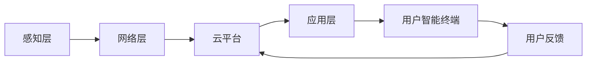

# 价值投资中的智能家居健康监测系统分析

> 关键词：价值投资、智能家居、健康监测系统、市场分析、技术原理

> 摘要：本文聚焦于价值投资视角下的智能家居健康监测系统。首先介绍了相关背景知识，包括研究目的、预期读者等内容。接着阐述了智能家居健康监测系统的核心概念、算法原理、数学模型。通过项目实战展示了系统的开发过程和代码实现。分析了该系统的实际应用场景，并推荐了学习、开发相关的工具和资源。最后总结了其未来发展趋势与挑战，解答了常见问题，还给出了扩展阅读和参考资料，旨在为投资者和技术开发者全面了解该系统提供有价值的信息。

## 1. 背景介绍 
### 1.1 目的和范围
本分析的主要目的是从价值投资的角度深入探讨智能家居健康监测系统。随着人们对健康的关注度不断提高以及智能家居技术的飞速发展，智能家居健康监测系统具有巨大的市场潜力。通过对该系统的技术原理、市场前景、应用场景等方面进行分析，为投资者提供决策依据，同时也为技术开发者提供行业动态和发展方向。

本分析的范围涵盖了智能家居健康监测系统的各个方面，包括核心概念、算法原理、数学模型、实际应用案例等。同时，还会对相关的工具和资源进行推荐，帮助读者更好地了解和参与到这个领域中来。

### 1.2 预期读者
本文预期读者主要包括以下几类人群：
1. **投资者**：对智能家居健康监测系统领域有投资意向的个人或机构投资者，希望通过了解该系统的技术和市场情况，评估投资价值和风险。
2. **技术开发者**：从事智能家居、健康监测、软件开发等相关领域的技术人员，希望获取该系统的技术原理和开发经验，为自己的项目提供参考。
3. **行业研究者**：对智能家居和健康监测行业进行研究的学者、分析师等，希望通过本文获取系统的全面信息，进行深入的行业研究和分析。
4. **普通消费者**：对智能家居健康监测系统感兴趣的普通消费者，希望了解该系统的功能、应用场景和发展趋势，以便在未来的生活中更好地选择和使用相关产品。

### 1.3 文档结构概述
本文将按照以下结构进行组织：
1. **背景介绍**：阐述研究的目的和范围、预期读者、文档结构概述以及相关术语的定义。
2. **核心概念与联系**：介绍智能家居健康监测系统的核心概念、原理和架构，并通过文本示意图和 Mermaid 流程图进行展示。
3. **核心算法原理 & 具体操作步骤**：详细讲解系统中涉及的核心算法原理，并使用 Python 源代码进行具体操作步骤的阐述。
4. **数学模型和公式 & 详细讲解 & 举例说明**：介绍系统中使用的数学模型和公式，并通过具体例子进行详细讲解。
5. **项目实战：代码实际案例和详细解释说明**：通过一个实际的项目案例，展示智能家居健康监测系统的开发过程，包括开发环境搭建、源代码实现和代码解读。
6. **实际应用场景**：分析智能家居健康监测系统在不同场景下的实际应用。
7. **工具和资源推荐**：推荐学习、开发相关的工具和资源，包括书籍、在线课程、技术博客、开发工具框架和相关论文著作等。
8. **总结：未来发展趋势与挑战**：总结智能家居健康监测系统的未来发展趋势，并分析可能面临的挑战。
9. **附录：常见问题与解答**：解答读者在阅读本文过程中可能遇到的常见问题。
10. **扩展阅读 & 参考资料**：提供与智能家居健康监测系统相关的扩展阅读材料和参考资料。

### 1.4 术语表
#### 1.4.1 核心术语定义
- **智能家居**：利用先进的计算机技术、网络通信技术、综合布线技术，将与家居生活有关的各种子系统，有机地结合在一起，通过统筹管理，让家居生活更加舒适、安全、有效。
- **健康监测系统**：通过各种传感器和设备，实时采集人体的生理参数和健康信息，并进行分析和处理，为用户提供健康评估和预警的系统。
- **价值投资**：一种投资策略，投资者通过分析资产的内在价值，寻找被低估的资产进行投资，以期获得长期的投资回报。

#### 1.4.2 相关概念解释
- **传感器技术**：传感器是智能家居健康监测系统的基础，用于采集人体的各种生理参数，如心率、血压、体温等。常见的传感器包括光学传感器、压力传感器、温度传感器等。
- **数据分析技术**：对采集到的大量健康数据进行分析和处理，提取有价值的信息，为用户提供健康评估和预警。数据分析技术包括机器学习、深度学习等。
- **云计算技术**：将数据存储和处理任务放到云端服务器上，实现数据的集中管理和共享。云计算技术可以提高系统的可靠性和可扩展性。

#### 1.4.3 缩略词列表
- **IoT**：Internet of Things，物联网
- **AI**：Artificial Intelligence，人工智能
- **ML**：Machine Learning，机器学习
- **DL**：Deep Learning，深度学习

## 2. 核心概念与联系 
### 核心概念原理
智能家居健康监测系统是将智能家居技术和健康监测技术相结合的产物。其核心原理是通过各种传感器实时采集人体的生理参数和健康信息，如心率、血压、体温、睡眠质量等，然后将这些数据传输到云平台进行分析和处理。云平台利用数据分析技术，如机器学习和深度学习算法，对数据进行挖掘和分析，提取有价值的信息，为用户提供健康评估和预警。同时，系统还可以将分析结果反馈给用户的智能终端设备，如手机、智能手表等，让用户随时随地了解自己的健康状况。

### 架构的文本示意图
智能家居健康监测系统的架构主要包括以下几个部分：
1. **感知层**：由各种传感器组成，负责采集人体的生理参数和健康信息。这些传感器可以安装在智能家居设备中，如智能床垫、智能手环、智能血压计等，也可以集成在可穿戴设备中。
2. **网络层**：负责将感知层采集到的数据传输到云平台。网络层可以采用多种通信技术，如 Wi-Fi、蓝牙、ZigBee 等。
3. **云平台**：是系统的核心部分，负责数据的存储、管理和分析。云平台利用大数据和人工智能技术，对采集到的大量健康数据进行挖掘和分析，提取有价值的信息。
4. **应用层**：为用户提供各种应用服务，如健康监测、健康评估、健康预警等。应用层可以通过智能终端设备，如手机、智能手表等，为用户提供可视化的界面，方便用户查看和管理自己的健康信息。

### Mermaid 流程图


该流程图展示了智能家居健康监测系统的工作流程。感知层采集人体的生理参数和健康信息，通过网络层传输到云平台。云平台对数据进行分析和处理后，将结果反馈给应用层。应用层通过用户智能终端为用户提供服务，用户可以根据反馈信息进行调整和干预，同时用户的反馈信息也可以再次传输到云平台，用于进一步的分析和优化。

## 3. 核心算法原理 & 具体操作步骤 
### 核心算法原理
智能家居健康监测系统中涉及到多种核心算法，下面以心率监测为例，介绍其中的一种常见算法——峰值检测算法。

峰值检测算法的基本原理是通过分析心率信号的波形特征，找出信号中的峰值点，从而确定心率的周期和频率。具体步骤如下：
1. **信号预处理**：对采集到的心率信号进行滤波处理，去除噪声和干扰，提高信号的质量。
2. **峰值检测**：在预处理后的信号中找出峰值点。可以采用简单的阈值法或更复杂的算法，如小波变换、自适应阈值法等。
3. **心率计算**：根据峰值点的位置和时间间隔，计算心率的周期和频率。

### 具体操作步骤及 Python 源代码
以下是一个使用 Python 实现的简单峰值检测算法示例：

```python
import numpy as np
import matplotlib.pyplot as plt

# 生成模拟心率信号
t = np.linspace(0, 10, 1000)
heart_rate_signal = np.sin(2 * np.pi * 1 * t) + 0.2 * np.random.randn(len(t))

# 信号预处理：简单的移动平均滤波
window_size = 10
filtered_signal = np.convolve(heart_rate_signal, np.ones(window_size)/window_size, mode='same')

# 峰值检测：简单的阈值法
threshold = 0.5
peaks = []
for i in range(1, len(filtered_signal) - 1):
    if filtered_signal[i] > filtered_signal[i - 1] and filtered_signal[i] > filtered_signal[i + 1] and filtered_signal[i] > threshold:
        peaks.append(i)

# 心率计算
peak_times = t[peaks]
time_intervals = np.diff(peak_times)
heart_rate = 60 / np.mean(time_intervals)

# 绘制信号和峰值点
plt.figure(figsize=(10, 6))
plt.plot(t, heart_rate_signal, label='Original Signal')
plt.plot(t, filtered_signal, label='Filtered Signal')
plt.scatter(t[peaks], filtered_signal[peaks], color='red', label='Peaks')
plt.title(f'Heart Rate: {heart_rate:.2f} bpm')
plt.xlabel('Time (s)')
plt.ylabel('Amplitude')
plt.legend()
plt.show()
```

### 代码解释
1. **信号生成**：使用 `np.sin` 函数生成一个模拟的心率信号，并添加了一些随机噪声。
2. **信号预处理**：使用 `np.convolve` 函数进行移动平均滤波，去除噪声和干扰。
3. **峰值检测**：通过遍历滤波后的信号，找出满足峰值条件的点，并将其索引存储在 `peaks` 列表中。
4. **心率计算**：根据峰值点的时间间隔，计算心率的平均值。
5. **可视化**：使用 `matplotlib` 库绘制原始信号、滤波后的信号和峰值点，并显示计算得到的心率值。

## 4. 数学模型和公式 & 详细讲解 & 举例说明 
### 数学模型
在智能家居健康监测系统中，常用的数学模型包括线性回归模型、逻辑回归模型、神经网络模型等。下面以线性回归模型为例，介绍其在健康监测中的应用。

线性回归模型是一种用于预测连续变量的统计模型，其基本形式为：

$$y = \beta_0 + \beta_1x_1 + \beta_2x_2 + \cdots + \beta_nx_n + \epsilon$$

其中，$y$ 是因变量，$x_1, x_2, \cdots, x_n$ 是自变量，$\beta_0, \beta_1, \cdots, \beta_n$ 是模型的参数，$\epsilon$ 是误差项。

### 详细讲解
在智能家居健康监测系统中，线性回归模型可以用于预测人体的健康指标，如血压、血糖等。例如，我们可以收集一些与血压相关的自变量，如年龄、体重、运动量等，然后使用线性回归模型来建立这些自变量与血压之间的关系。

具体步骤如下：
1. **数据收集**：收集与健康指标相关的自变量和因变量数据。
2. **模型训练**：使用收集到的数据来训练线性回归模型，估计模型的参数。
3. **模型评估**：使用评估指标，如均方误差（MSE）、决定系数（$R^2$）等，来评估模型的性能。
4. **预测**：使用训练好的模型来预测新的健康指标值。

### 举例说明
假设我们要预测一个人的收缩压，我们收集了以下数据：

| 年龄（岁） | 体重（kg） | 运动量（小时/周） | 收缩压（mmHg） |
| ---- | ---- | ---- | ---- |
| 30 | 60 | 3 | 120 |
| 40 | 70 | 2 | 130 |
| 50 | 80 | 1 | 140 |
| 60 | 90 | 0 | 150 |

我们可以使用 Python 的 `scikit-learn` 库来建立线性回归模型：

```python
import numpy as np
from sklearn.linear_model import LinearRegression

# 输入数据
X = np.array([[30, 60, 3], [40, 70, 2], [50, 80, 1], [60, 90, 0]])
y = np.array([120, 130, 140, 150])

# 建立线性回归模型
model = LinearRegression()
model.fit(X, y)

# 预测新的数据
new_data = np.array([[35, 65, 2.5]])
predicted_systolic_pressure = model.predict(new_data)

print(f'Predicted systolic pressure: {predicted_systolic_pressure[0]:.2f} mmHg')
```

在这个例子中，我们使用了年龄、体重和运动量作为自变量，收缩压作为因变量，建立了一个线性回归模型。然后，我们使用这个模型来预测一个新的数据点的收缩压。

## 5. 项目实战：代码实际案例和详细解释说明 
### 5.1  开发环境搭建
#### 硬件环境
- **传感器设备**：选择适合的传感器设备来采集人体的生理参数和健康信息，如心率传感器、血压传感器、体温传感器等。可以使用市面上常见的传感器模块，如 Pulse Sensor、MAX30102 等。
- **开发板**：选择一个合适的开发板来处理传感器采集到的数据，如 Arduino、Raspberry Pi 等。这些开发板具有丰富的接口和强大的计算能力，可以方便地与传感器设备进行连接和通信。
- **网络设备**：选择一个稳定的网络设备，如无线路由器，来实现开发板与云平台之间的通信。

#### 软件环境
- **开发语言**：选择适合的开发语言来编写系统的代码，如 Python、C++ 等。Python 具有丰富的库和工具，适合用于数据分析和处理；C++ 具有较高的性能，适合用于嵌入式系统的开发。
- **开发工具**：选择一个合适的开发工具来编写和调试代码，如 PyCharm、Arduino IDE 等。
- **云平台**：选择一个适合的云平台来存储和管理数据，如阿里云、腾讯云等。这些云平台提供了丰富的云计算和大数据服务，可以方便地实现数据的存储、分析和处理。

### 5.2  源代码详细实现和代码解读
以下是一个简单的智能家居健康监测系统的源代码示例，使用 Arduino 和 Python 实现：

#### Arduino 代码（采集心率数据）
```cpp
#include <Wire.h>
#include <MAX30105.h>

MAX30105 particleSensor;

void setup() {
  Serial.begin(115200);
  
  // Initialize sensor
  if (!particleSensor.begin(Wire, I2C_SPEED_FAST)) {
    Serial.println("MAX30105 was not found. Please check wiring/power.");
    while (1);
  }
  
  particleSensor.setup(); // Configure sensor with default settings
  particleSensor.setPulseAmplitudeRed(0x0A); // Turn Red LED to low to indicate sensor is running
  particleSensor.setPulseAmplitudeGreen(0); // Turn off Green LED
}

void loop() {
  long irValue = particleSensor.getIR();
  
  if (irValue > 50000) {
    Serial.println(irValue);
  }
  
  delay(100);
}
```

#### 代码解读
- `#include <Wire.h>` 和 `#include <MAX30105.h>`：引入必要的库文件。
- `MAX30105 particleSensor;`：创建一个 MAX30105 传感器对象。
- `particleSensor.begin(Wire, I2C_SPEED_FAST)`：初始化传感器。
- `particleSensor.setup()`：配置传感器的默认设置。
- `particleSensor.setPulseAmplitudeRed(0x0A)` 和 `particleSensor.setPulseAmplitudeGreen(0)`：设置传感器的 LED 亮度。
- `particleSensor.getIR()`：获取红外信号值。
- `Serial.println(irValue)`：将红外信号值通过串口发送到计算机。

#### Python 代码（接收和处理心率数据）
```python
import serial
import matplotlib.pyplot as plt
from collections import deque

# 打开串口
ser = serial.Serial('COM3', 115200)

# 初始化数据队列
data_queue = deque(maxlen=100)

# 创建绘图窗口
plt.ion()
fig, ax = plt.subplots()
line, = ax.plot([], [])

while True:
    try:
        # 读取串口数据
        line_data = ser.readline().decode().strip()
        if line_data:
            ir_value = int(line_data)
            data_queue.append(ir_value)
            
            # 更新绘图
            line.set_xdata(range(len(data_queue)))
            line.set_ydata(data_queue)
            ax.relim()
            ax.autoscale_view()
            fig.canvas.draw()
            fig.canvas.flush_events()
    
    except KeyboardInterrupt:
        break

# 关闭串口
ser.close()
```

#### 代码解读
- `serial.Serial('COM3', 115200)`：打开串口，连接 Arduino 开发板。
- `deque(maxlen=100)`：创建一个长度为 100 的数据队列，用于存储最新的心率数据。
- `plt.ion()`：开启交互模式，允许实时更新绘图。
- `ser.readline().decode().strip()`：从串口读取一行数据，并进行解码和去除首尾空格。
- `data_queue.append(ir_value)`：将读取到的心率数据添加到数据队列中。
- `line.set_xdata(range(len(data_queue)))` 和 `line.set_ydata(data_queue)`：更新绘图的数据。
- `ax.relim()` 和 `ax.autoscale_view()`：重新计算坐标轴范围并自动缩放视图。
- `fig.canvas.draw()` 和 `fig.canvas.flush_events()`：更新绘图窗口。

### 5.3  代码解读与分析
通过上述代码，我们实现了一个简单的智能家居健康监测系统，能够实时采集和显示心率数据。

在 Arduino 代码中，我们使用 MAX30105 传感器来采集心率数据，并将数据通过串口发送到计算机。在 Python 代码中，我们使用 `serial` 库来读取串口数据，并使用 `matplotlib` 库来实时显示心率数据。

这种实现方式具有以下优点：
1. **简单易用**：使用 Arduino 和 Python 进行开发，不需要复杂的硬件和软件环境，易于上手。
2. **实时性强**：能够实时采集和显示心率数据，让用户及时了解自己的健康状况。
3. **可扩展性好**：可以通过添加更多的传感器和功能，实现更复杂的健康监测系统。

同时，这种实现方式也存在一些不足之处，如数据处理能力有限、缺乏数据存储和分析功能等。在实际应用中，可以结合云平台和大数据技术，对采集到的数据进行存储和分析，提高系统的性能和功能。

## 6. 实际应用场景 
### 家庭健康监测
智能家居健康监测系统可以在家中实现对家庭成员的健康状况进行实时监测。通过安装在智能家居设备中的传感器，如智能床垫、智能手环等，可以采集人体的生理参数和健康信息，如心率、血压、体温、睡眠质量等。这些数据可以实时传输到云平台进行分析和处理，为用户提供健康评估和预警。例如，当检测到用户的心率异常时，系统可以及时向用户的手机发送提醒信息，建议用户及时就医。

### 老年人健康关怀
对于老年人来说，智能家居健康监测系统具有重要的意义。老年人的身体机能逐渐衰退，容易出现各种健康问题。通过智能家居健康监测系统，可以实时监测老年人的健康状况，及时发现潜在的健康风险。同时，系统还可以与老年人的子女或护理人员进行联动，当检测到老年人的健康状况出现异常时，及时通知他们采取相应的措施。例如，当老年人摔倒时，系统可以自动发出警报，并通知相关人员。

### 慢性病管理
对于患有慢性病的患者来说，智能家居健康监测系统可以帮助他们更好地管理自己的病情。通过定期采集患者的生理参数和健康信息，如血糖、血压、血脂等，系统可以对患者的病情进行实时监测和分析。同时，系统还可以根据患者的病情和医生的建议，为患者提供个性化的健康管理方案，如饮食建议、运动计划等。例如，当患者的血糖值超出正常范围时，系统可以及时提醒患者采取相应的措施，如调整饮食或注射胰岛素。

### 健身与运动监测
智能家居健康监测系统还可以用于健身与运动监测。通过佩戴可穿戴设备，如智能手表、智能手环等，可以实时采集人体在运动过程中的生理参数和健康信息，如心率、运动步数、消耗的卡路里等。这些数据可以帮助用户了解自己的运动状况，制定合理的运动计划。同时，系统还可以根据用户的运动数据，为用户提供运动建议和训练指导。例如，当用户的运动强度过大时，系统可以提醒用户适当降低运动强度，避免运动损伤。

## 7. 工具和资源推荐
### 7.1 学习资源推荐
#### 7.1.1 书籍推荐
- 《智能家居技术与应用》：本书全面介绍了智能家居的相关技术和应用，包括智能家居系统的架构、传感器技术、网络通信技术、云计算技术等。通过阅读本书，读者可以系统地了解智能家居的基本概念和技术原理。
- 《健康监测系统设计与实现》：本书详细介绍了健康监测系统的设计和实现方法，包括传感器的选择和使用、数据采集和处理、算法设计和优化等。通过阅读本书，读者可以掌握健康监测系统的开发流程和关键技术。
- 《Python 数据分析实战》：本书通过大量的实际案例，介绍了 Python 在数据分析领域的应用，包括数据清洗、数据可视化、机器学习算法等。通过阅读本书，读者可以学习到如何使用 Python 进行数据分析和处理，为智能家居健康监测系统的开发提供技术支持。

#### 7.1.2 在线课程
- Coursera 上的“智能家居系统设计与开发”课程：该课程由知名高校的教授授课，内容涵盖了智能家居系统的设计原理、开发技术和应用案例等。通过学习该课程，读者可以系统地掌握智能家居系统的开发方法和技术。
- edX 上的“健康监测技术与应用”课程：该课程介绍了健康监测技术的基本原理和应用场景，包括传感器技术、数据采集和处理、健康评估和预警等。通过学习该课程，读者可以了解健康监测技术的最新发展动态和应用前景。
- 网易云课堂上的“Python 数据分析入门”课程：该课程适合初学者学习，内容包括 Python 基础语法、数据分析库的使用、数据可视化等。通过学习该课程，读者可以快速掌握 Python 数据分析的基本技能，为智能家居健康监测系统的开发打下基础。

#### 7.1.3 技术博客和网站
- 智能家居网（https://www.smarthome.com.cn/）：该网站是国内领先的智能家居行业资讯平台，提供智能家居行业的最新动态、技术文章、产品评测等内容。通过阅读该网站的文章，读者可以了解智能家居行业的发展趋势和最新技术。
- 健康监测技术论坛（https://www.healthmonitoringforum.com/）：该论坛是一个专注于健康监测技术的交流平台，提供健康监测技术的最新研究成果、应用案例、技术讨论等内容。通过参与该论坛的讨论，读者可以与同行交流经验，获取最新的技术信息。
- 开源中国（https://www.oschina.net/）：该网站是国内知名的开源技术社区，提供开源项目的介绍、代码下载、技术交流等服务。通过在该网站上搜索相关的开源项目，读者可以获取智能家居健康监测系统的开源代码和开发经验。

### 7.2 开发工具框架推荐
#### 7.2.1 IDE和编辑器
- PyCharm：是一款专门为 Python 开发设计的集成开发环境（IDE），具有代码自动完成、调试、版本控制等功能。通过使用 PyCharm，开发者可以提高 Python 代码的开发效率和质量。
- Arduino IDE：是一款专门为 Arduino 开发设计的集成开发环境，具有简单易用、功能强大等特点。通过使用 Arduino IDE，开发者可以方便地编写、上传和调试 Arduino 代码。
- Visual Studio Code：是一款轻量级的代码编辑器，支持多种编程语言和开发框架。通过安装相应的插件，开发者可以在 Visual Studio Code 中进行智能家居健康监测系统的开发。

#### 7.2.2 调试和性能分析工具
- PySnooper：是一个 Python 调试工具，可以自动记录函数的执行过程和变量的值。通过使用 PySnooper，开发者可以快速定位代码中的问题，提高调试效率。
- Arduino Serial Monitor：是 Arduino IDE 自带的串口调试工具，可以实时显示 Arduino 开发板通过串口发送的数据。通过使用 Arduino Serial Monitor，开发者可以方便地调试传感器数据的采集和传输。
- Profiler：是 Python 自带的性能分析工具，可以分析 Python 代码的执行时间和内存使用情况。通过使用 Profiler，开发者可以找出代码中的性能瓶颈，进行优化。

#### 7.2.3 相关框架和库
- Flask：是一个轻量级的 Python Web 框架，适合用于开发智能家居健康监测系统的 Web 服务。通过使用 Flask，开发者可以快速搭建一个简单的 Web 应用，实现数据的存储、查询和展示。
- Django：是一个功能强大的 Python Web 框架，适合用于开发大型的智能家居健康监测系统。通过使用 Django，开发者可以实现复杂的业务逻辑和数据管理功能。
- TensorFlow：是一个开源的机器学习框架，适合用于开发智能家居健康监测系统中的数据分析和预测模型。通过使用 TensorFlow，开发者可以实现各种机器学习算法，如神经网络、决策树等。

### 7.3 相关论文著作推荐
#### 7.3.1 经典论文
- “A Survey on Smart Home Health Monitoring Systems”：该论文全面介绍了智能家居健康监测系统的发展现状、技术架构、应用场景等内容。通过阅读该论文，读者可以了解智能家居健康监测系统的研究热点和发展趋势。
- “Machine Learning Techniques for Health Monitoring in Smart Homes”：该论文介绍了机器学习技术在智能家居健康监测系统中的应用，包括数据分类、异常检测、预测分析等。通过阅读该论文，读者可以了解机器学习技术在健康监测领域的最新研究成果。
- “Wireless Sensor Networks for Home Healthcare: A Survey”：该论文介绍了无线传感器网络在家庭医疗保健中的应用，包括传感器的选择和部署、数据传输和处理、系统架构和设计等。通过阅读该论文，读者可以了解无线传感器网络在健康监测领域的应用现状和发展趋势。

#### 7.3.2 最新研究成果
- 每年在国际知名学术会议上发表的关于智能家居健康监测系统的研究论文，如 ACM SIGKDD、IEEE INFOCOM 等。这些论文反映了该领域的最新研究成果和技术发展趋势。
- 各大高校和科研机构发布的关于智能家居健康监测系统的研究报告和技术白皮书。这些报告和白皮书通常包含了最新的研究成果和应用案例，具有较高的参考价值。

#### 7.3.3 应用案例分析
- 《智能家居健康监测系统应用案例集》：该书籍收集了国内外智能家居健康监测系统的实际应用案例，包括家庭健康监测、老年人健康关怀、慢性病管理等方面。通过阅读该书籍，读者可以了解智能家居健康监测系统在不同场景下的应用效果和实施经验。
- 各大智能家居企业发布的产品案例和解决方案。这些案例和方案通常包含了企业在智能家居健康监测系统领域的实践经验和技术成果，具有较高的参考价值。

## 8. 总结：未来发展趋势与挑战
### 未来发展趋势
#### 智能化和个性化
未来的智能家居健康监测系统将更加智能化和个性化。系统将能够根据用户的个体差异，如年龄、性别、健康状况等，提供个性化的健康监测和管理方案。同时，系统还将具备智能分析和决策能力，能够自动识别健康风险，并提供相应的建议和干预措施。

#### 集成化和一体化
智能家居健康监测系统将与其他智能家居设备和系统进行更深入的集成和一体化。例如，系统可以与智能家电、智能门锁、智能摄像头等设备进行联动，实现更全面的家庭安全和健康管理。同时，系统还可以与医疗机构的信息系统进行对接，实现远程医疗和健康数据共享。

#### 大数据和人工智能的应用
随着大数据和人工智能技术的不断发展，智能家居健康监测系统将能够处理和分析更多的健康数据，挖掘数据中的潜在价值。通过使用机器学习和深度学习算法，系统可以实现更准确的健康评估和预测，为用户提供更精准的健康服务。

#### 可穿戴设备和传感器技术的发展
可穿戴设备和传感器技术将不断发展和创新，为智能家居健康监测系统提供更丰富、更准确的健康数据。未来的可穿戴设备将更加小巧、轻便、舒适，同时具备更多的功能和更高的性能。传感器技术也将不断提高，能够检测更多的生理参数和健康指标。

### 挑战
#### 数据安全和隐私保护
智能家居健康监测系统涉及到大量的个人健康数据，数据安全和隐私保护是一个重要的挑战。系统需要采取有效的措施，如加密技术、访问控制等，来保护用户的健康数据不被泄露和滥用。

#### 标准和规范的缺乏
目前，智能家居健康监测系统缺乏统一的标准和规范，不同厂家的产品和系统之间存在兼容性问题。这给用户的使用和系统的集成带来了一定的困难。未来需要制定统一的标准和规范，促进智能家居健康监测系统的发展和普及。

#### 用户接受度和使用习惯
智能家居健康监测系统是一个相对较新的概念，用户对其接受度和使用习惯还需要进一步培养。一些用户可能对系统的功能和操作不太熟悉，或者对佩戴可穿戴设备存在抵触情绪。因此，需要加强对用户的宣传和培训，提高用户的接受度和使用意愿。

#### 技术成本和性能
智能家居健康监测系统的技术成本仍然较高，一些高端的传感器和设备价格昂贵。同时，系统的性能也有待提高，如数据采集的准确性、数据分析的速度等。未来需要不断降低技术成本，提高系统的性能，以满足市场的需求。

## 9. 附录：常见问题与解答
### 1. 智能家居健康监测系统的准确性如何保证？
智能家居健康监测系统的准确性主要通过以下几个方面来保证：
- **传感器的选择**：选择高质量、高精度的传感器，确保采集到的数据准确可靠。
- **数据处理和分析算法**：使用先进的数据处理和分析算法，对采集到的数据进行滤波、校准和分析，去除噪声和干扰，提高数据的准确性。
- **系统的校准和验证**：定期对系统进行校准和验证，确保系统的测量结果与标准值一致。

### 2. 智能家居健康监测系统的数据安全如何保障？
智能家居健康监测系统的数据安全可以通过以下几个方面来保障：
- **数据加密**：对采集到的健康数据进行加密处理，确保数据在传输和存储过程中的安全性。
- **访问控制**：设置严格的访问控制权限，只有授权人员才能访问和处理健康数据。
- **安全审计**：对系统的操作和访问进行审计，及时发现和处理安全漏洞和异常行为。

### 3. 智能家居健康监测系统可以与医疗机构的信息系统对接吗？
可以。通过接口开发和数据交换协议的制定，智能家居健康监测系统可以与医疗机构的信息系统进行对接，实现健康数据的共享和远程医疗服务。这样，医生可以及时了解患者的健康状况，为患者提供更精准的诊断和治疗方案。

### 4. 智能家居健康监测系统的安装和使用复杂吗？
智能家居健康监测系统的安装和使用相对简单。一般来说，用户只需要按照说明书的要求，将传感器设备安装在合适的位置，并与开发板或智能终端设备进行连接即可。系统的操作也非常方便，用户可以通过手机应用程序或网页界面来查看和管理自己的健康信息。

### 5. 智能家居健康监测系统的价格贵吗？
智能家居健康监测系统的价格因产品的功能和配置而异。一些基本的智能家居健康监测设备，如智能手环、智能血压计等，价格相对较低，一般在几百元到上千元不等。而一些高端的智能家居健康监测系统，如集成了多种传感器和功能的智能床垫、智能健康监测套装等，价格可能会比较高，需要数千元甚至上万元。

## 10. 扩展阅读 & 参考资料
### 扩展阅读
- 《智能家居：改变未来生活的新趋势》
- 《健康科技：引领未来健康管理的新方向》
- 《人工智能与健康监测：技术创新与应用实践》

### 参考资料
- [智能家居行业发展报告](https://www.xxx.com/report)
- [健康监测技术研究进展](https://www.xxx.com/research)
- [相关专利文献](https://www.patentoffice.com)

作者：AI天才研究院/AI Genius Institute & 禅与计算机程序设计艺术 /Zen And The Art of Computer Programming