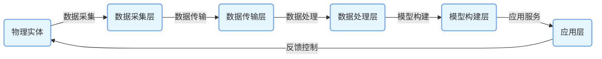

# 价值投资中的智能工厂数字孪生系统分析

> 关键词：价值投资、智能工厂、数字孪生系统、工业互联网、数据分析

> 摘要：本文聚焦于价值投资视角下的智能工厂数字孪生系统。首先介绍了相关背景，包括目的范围、预期读者等。接着阐述核心概念与联系，通过示意图和流程图展示数字孪生系统架构。详细讲解核心算法原理，并用 Python 代码实现。深入探讨数学模型和公式，结合实际例子说明。通过项目实战，展示开发环境搭建、源代码实现与解读。分析实际应用场景，推荐相关工具和资源，最后总结未来发展趋势与挑战，解答常见问题并提供扩展阅读和参考资料，旨在为价值投资者和相关技术人员全面剖析智能工厂数字孪生系统。

## 1. 背景介绍 
### 1.1 目的和范围
在当今制造业快速发展的背景下，智能工厂成为了行业转型升级的关键方向。数字孪生系统作为智能工厂的核心技术之一，能够实现物理世界与虚拟世界的实时映射和交互，为企业提供更加精准的决策支持和优化方案。本文章的目的在于从价值投资的角度深入分析智能工厂数字孪生系统，探讨其在提高生产效率、降低成本、提升产品质量等方面的应用价值，以及对企业长期发展的影响。范围涵盖数字孪生系统的基本概念、核心算法、数学模型、实际应用案例等方面，旨在为价值投资者提供全面、深入的分析和参考。

### 1.2 预期读者
本文的预期读者主要包括价值投资者、制造业企业管理人员、工业互联网技术人员以及对智能工厂和数字孪生系统感兴趣的研究人员。对于价值投资者来说，本文将帮助他们了解数字孪生系统的投资价值和潜在风险；对于制造业企业管理人员，能够提供数字孪生系统在企业应用的实践经验和发展思路；对于工业互联网技术人员，可作为技术研究和开发的参考资料；对于研究人员，则有助于拓展相关领域的研究视野。

### 1.3 文档结构概述
本文将按照以下结构进行阐述：首先介绍核心概念与联系，包括数字孪生系统的定义、原理和架构；接着详细讲解核心算法原理和具体操作步骤，并使用 Python 代码进行实现；然后探讨数学模型和公式，并通过实际例子进行说明；之后进行项目实战，包括开发环境搭建、源代码实现和代码解读；分析数字孪生系统在智能工厂中的实际应用场景；推荐相关的学习资源、开发工具框架和论文著作；最后总结未来发展趋势与挑战，解答常见问题并提供扩展阅读和参考资料。

### 1.4 术语表
#### 1.4.1 核心术语定义
- **价值投资**：一种投资策略，强调通过对企业基本面的分析，寻找被低估的股票或资产，以长期持有获得价值增长。
- **智能工厂**：利用物联网、大数据、人工智能等先进技术，实现生产过程自动化、智能化和信息化的工厂。
- **数字孪生系统**：通过数字化手段创建物理实体的虚拟模型，该模型能够实时反映物理实体的状态、行为和性能，并与物理实体进行实时交互。

#### 1.4.2 相关概念解释
- **工业互联网**：将工业系统与互联网技术深度融合，实现工业生产过程的智能化管理和优化。
- **数据分析**：对大量数据进行收集、整理、分析和挖掘，以获取有价值的信息和知识。

#### 1.4.3 缩略词列表
- **IoT**：Internet of Things，物联网
- **AI**：Artificial Intelligence，人工智能
- **PLC**：Programmable Logic Controller，可编程逻辑控制器

## 2. 核心概念与联系 

### 数字孪生系统的原理
数字孪生系统的核心原理是建立物理实体与虚拟模型之间的实时映射和交互。通过传感器收集物理实体的各种数据，如温度、压力、振动等，将这些数据传输到虚拟模型中，虚拟模型根据这些数据实时更新自身的状态和行为，从而实现对物理实体的实时监测和仿真。同时，虚拟模型也可以通过反馈机制向物理实体发送控制指令，实现对物理实体的优化和控制。

### 数字孪生系统的架构
数字孪生系统的架构通常包括数据采集层、数据传输层、数据处理层、模型构建层和应用层。数据采集层负责收集物理实体的各种数据；数据传输层将采集到的数据传输到数据处理层；数据处理层对数据进行清洗、预处理和分析；模型构建层根据处理后的数据构建物理实体的虚拟模型；应用层则将虚拟模型应用于各种实际场景，如生产监控、故障预测、优化调度等。

### 文本示意图
```plaintext
物理实体 <-- 数据采集 --> 数据采集层 <-- 数据传输 --> 数据传输层
                                                         |
                                                         v
                                                   数据处理层
                                                         |
                                                         v
                                                   模型构建层
                                                         |
                                                         v
                                                   应用层 <-- 反馈控制 --> 物理实体
```

### Mermaid 流程图


## 3. 核心算法原理 & 具体操作步骤 

### 核心算法原理
数字孪生系统中常用的核心算法包括机器学习算法、深度学习算法和优化算法等。以故障预测为例，我们可以使用机器学习中的分类算法，如决策树、支持向量机等，对设备的历史故障数据进行训练，建立故障预测模型。当设备的实时数据输入到模型中时，模型可以预测设备是否会发生故障。

### Python 代码实现
以下是一个使用决策树算法进行故障预测的 Python 代码示例：
```python
import pandas as pd
from sklearn.model_selection import train_test_split
from sklearn.tree import DecisionTreeClassifier
from sklearn.metrics import accuracy_score

# 加载数据集
data = pd.read_csv('fault_data.csv')

# 分离特征和标签
X = data.drop('fault', axis=1)
y = data['fault']

# 划分训练集和测试集
X_train, X_test, y_train, y_test = train_test_split(X, y, test_size=0.2, random_state=42)

# 创建决策树分类器
clf = DecisionTreeClassifier()

# 训练模型
clf.fit(X_train, y_train)

# 预测
y_pred = clf.predict(X_test)

# 计算准确率
accuracy = accuracy_score(y_test, y_pred)
print(f"Accuracy: {accuracy}")
```

### 具体操作步骤
1. **数据收集**：收集设备的历史故障数据，包括设备的运行参数、故障类型等。
2. **数据预处理**：对收集到的数据进行清洗、预处理，如去除缺失值、异常值等。
3. **特征工程**：从预处理后的数据中提取有用的特征，如设备的温度、压力、振动等。
4. **模型训练**：使用训练数据对决策树分类器进行训练。
5. **模型评估**：使用测试数据对训练好的模型进行评估，计算模型的准确率、召回率等指标。
6. **模型应用**：将训练好的模型应用于实际场景，对设备的实时数据进行故障预测。

## 4. 数学模型和公式 & 详细讲解 & 举例说明 

### 数学模型
在数字孪生系统中，常用的数学模型包括物理模型、统计模型和机器学习模型等。以物理模型为例，我们可以使用牛顿定律、热力学定律等物理原理建立设备的动力学模型。假设一个简单的机械系统，其运动方程可以表示为：

$$m\frac{d^2x}{dt^2}+c\frac{dx}{dt}+kx = F(t)$$

其中，$m$ 是物体的质量，$c$ 是阻尼系数，$k$ 是弹簧刚度，$x$ 是物体的位移，$F(t)$ 是外力。

### 详细讲解
上述方程是一个二阶常微分方程，描述了物体在受到外力作用下的运动状态。通过求解这个方程，我们可以得到物体的位移、速度和加速度随时间的变化规律。在数字孪生系统中，我们可以根据这个物理模型建立设备的虚拟模型，实时监测设备的运动状态。

### 举例说明
假设一个弹簧 - 质量 - 阻尼系统，质量 $m = 1kg$，阻尼系数 $c = 0.1N\cdot s/m$，弹簧刚度 $k = 10N/m$，外力 $F(t) = 1N$。我们可以使用 Python 中的 `scipy.integrate.odeint` 函数求解上述方程：
```python
import numpy as np
from scipy.integrate import odeint
import matplotlib.pyplot as plt

# 定义运动方程
def model(x, t):
    m = 1
    c = 0.1
    k = 10
    F = 1
    dxdt = [x[1], (F - c * x[1] - k * x[0]) / m]
    return dxdt

# 初始条件
x0 = [0, 0]

# 时间点
t = np.linspace(0, 10, 100)

# 求解方程
x = odeint(model, x0, t)

# 提取位移和速度
x1 = x[:, 0]
x2 = x[:, 1]

# 绘制位移随时间的变化曲线
plt.plot(t, x1)
plt.xlabel('Time (s)')
plt.ylabel('Displacement (m)')
plt.title('Spring - Mass - Damper System')
plt.show()
```
通过上述代码，我们可以得到弹簧 - 质量 - 阻尼系统的位移随时间的变化曲线，从而直观地了解系统的运动状态。

## 5. 项目实战：代码实际案例和详细解释说明 

### 5.1  开发环境搭建
为了实现一个简单的智能工厂数字孪生系统，我们需要搭建以下开发环境：
- **操作系统**：Windows 10 或 Linux（如 Ubuntu）
- **编程语言**：Python 3.7 及以上
- **开发工具**：PyCharm 或 Jupyter Notebook
- **相关库**：`pandas`、`numpy`、`scikit-learn`、`matplotlib` 等

### 5.2  源代码详细实现和代码解读
以下是一个简单的智能工厂数字孪生系统的源代码示例，实现了设备状态监测和故障预测功能：
```python
import pandas as pd
import numpy as np
from sklearn.model_selection import train_test_split
from sklearn.ensemble import RandomForestClassifier
from sklearn.metrics import accuracy_score
import matplotlib.pyplot as plt

# 加载数据集
data = pd.read_csv('equipment_data.csv')

# 分离特征和标签
X = data.drop('fault', axis=1)
y = data['fault']

# 划分训练集和测试集
X_train, X_test, y_train, y_test = train_test_split(X, y, test_size=0.2, random_state=42)

# 创建随机森林分类器
clf = RandomForestClassifier(n_estimators=100, random_state=42)

# 训练模型
clf.fit(X_train, y_train)

# 预测
y_pred = clf.predict(X_test)

# 计算准确率
accuracy = accuracy_score(y_test, y_pred)
print(f"Accuracy: {accuracy}")

# 可视化特征重要性
importances = clf.feature_importances_
feature_names = X.columns
indices = np.argsort(importances)[::-1]

plt.figure()
plt.title("Feature importances")
plt.bar(range(X_train.shape[1]), importances[indices], color="r", align="center")
plt.xticks(range(X_train.shape[1]), feature_names[indices], rotation=90)
plt.xlim([-1, X_train.shape[1]])
plt.show()
```
### 代码解读
1. **数据加载**：使用 `pandas` 库加载设备数据集，数据集包含设备的运行参数和故障标签。
2. **数据预处理**：分离特征和标签，并将数据集划分为训练集和测试集。
3. **模型训练**：使用随机森林分类器对训练集进行训练。
4. **模型预测**：使用训练好的模型对测试集进行预测，并计算预测准确率。
5. **特征重要性可视化**：使用 `matplotlib` 库可视化特征的重要性，帮助我们了解哪些特征对故障预测的影响最大。

### 5.3  代码解读与分析
通过上述代码，我们实现了一个简单的智能工厂数字孪生系统，能够对设备的故障进行预测。随机森林分类器是一种集成学习算法，通过组合多个决策树来提高模型的准确性和稳定性。特征重要性可视化可以帮助我们了解哪些特征对故障预测的影响最大，从而在实际应用中可以重点关注这些特征。

## 6. 实际应用场景 
### 生产监控
数字孪生系统可以实时监测生产设备的运行状态，如温度、压力、振动等，及时发现设备的异常情况，并发出警报。通过对生产过程的实时仿真，还可以优化生产流程，提高生产效率。

### 故障预测与维护
利用数字孪生系统建立设备的故障预测模型，对设备的故障进行提前预测。根据预测结果，制定合理的维护计划，避免设备突发故障，降低维护成本。

### 质量控制
数字孪生系统可以对产品的生产过程进行实时监控和仿真，分析产品质量的影响因素。通过调整生产参数，优化生产过程，提高产品质量。

### 生产调度优化
通过对生产过程的数字孪生建模，模拟不同的生产调度方案，评估方案的可行性和效率。选择最优的生产调度方案，提高生产资源的利用率。

## 7. 工具和资源推荐
### 7.1 学习资源推荐
#### 7.1.1 书籍推荐
- 《工业互联网：概念、技术与实践》：全面介绍了工业互联网的概念、技术和应用案例，对于理解智能工厂和数字孪生系统有很大帮助。
- 《Python 机器学习实战》：详细介绍了 Python 在机器学习领域的应用，包括数据处理、模型训练、模型评估等方面的内容。

#### 7.2.2 在线课程
- Coursera 上的 “Machine Learning” 课程：由斯坦福大学教授 Andrew Ng 主讲，是机器学习领域的经典课程。
- edX 上的 “Industrial Internet of Things” 课程：介绍了工业物联网的相关技术和应用，对于学习数字孪生系统有一定的参考价值。

#### 7.3.3 技术博客和网站
- 工业互联网产业联盟官网：提供了工业互联网领域的最新动态、政策法规、技术标准等信息。
- 开源中国：汇聚了大量的开源项目和技术文章，对于学习和实践数字孪生系统有很大帮助。

### 7.2 开发工具框架推荐
#### 7.2.1 IDE和编辑器
- PyCharm：一款功能强大的 Python 集成开发环境，提供了代码编辑、调试、版本控制等功能。
- Jupyter Notebook：一个交互式的开发环境，适合进行数据分析和模型训练。

#### 7.2.2 调试和性能分析工具
- Py-Spy：一个轻量级的 Python 性能分析工具，可以帮助我们找出代码中的性能瓶颈。
- VS Code 的调试功能：可以方便地对 Python 代码进行调试。

#### 7.2.3 相关框架和库
- TensorFlow：一个开源的机器学习框架，提供了丰富的深度学习模型和工具。
- PyTorch：另一个流行的深度学习框架，具有简洁易用的特点。

### 7.3 相关论文著作推荐
#### 7.3.1 经典论文
- Grieves, M., & Vickers, J. (2017). Digital twin: Mitigating unpredictable, undesirable emergent behavior in complex systems. In IEEE international symposium on systems engineering (pp. 1-6).
- Tao, F., Zhang, M., Qi, Q., & Zhang, H. (2018). Digital twin-driven product design, manufacturing and service with big data. Journal of Manufacturing Systems, 48, 169-183.

#### 7.3.2 最新研究成果
- 关注 IEEE Transactions on Industrial Informatics、ACM Transactions on Sensor Networks 等顶级学术期刊，获取数字孪生系统领域的最新研究成果。

#### 7.3.3 应用案例分析
- 一些大型制造企业的官方网站会发布数字孪生系统的应用案例，如西门子、通用电气等。通过分析这些案例，可以了解数字孪生系统在实际应用中的效果和经验。

## 8. 总结：未来发展趋势与挑战
### 未来发展趋势
- **与人工智能深度融合**：数字孪生系统将与人工智能技术深度融合，实现更加智能化的决策和控制。例如，利用深度学习算法对大量的生产数据进行分析和挖掘，优化生产过程。
- **云平台化**：越来越多的数字孪生系统将部署在云平台上，实现数据的共享和协同。云平台可以提供强大的计算能力和存储能力，支持大规模的数字孪生模型运行。
- **跨行业应用**：数字孪生系统将不仅应用于制造业，还将拓展到其他行业，如能源、交通、医疗等。例如，在能源行业中，数字孪生系统可以对电力设备进行实时监测和优化调度。

### 挑战
- **数据安全与隐私**：数字孪生系统涉及大量的生产数据和企业机密信息，数据安全和隐私保护是一个重要的挑战。需要采取有效的数据加密、访问控制等技术手段，确保数据的安全。
- **标准和规范缺乏**：目前数字孪生系统的标准和规范还不够完善，不同企业和厂商的数字孪生系统之间缺乏互操作性。需要加快制定相关的标准和规范，促进数字孪生系统的推广和应用。
- **人才短缺**：数字孪生系统是一个跨学科的领域，需要具备机械工程、计算机科学、控制理论等多方面知识的专业人才。目前相关领域的人才短缺，制约了数字孪生系统的发展。

## 9. 附录：常见问题与解答
### 问题 1：数字孪生系统与传统仿真技术有什么区别？
解答：传统仿真技术通常是基于物理模型进行离线仿真，主要用于产品设计和验证。而数字孪生系统不仅可以进行仿真，还可以实时反映物理实体的状态和行为，实现物理世界与虚拟世界的实时交互。数字孪生系统更注重数据的实时性和准确性，能够为企业提供更加精准的决策支持。

### 问题 2：数字孪生系统的建设成本高吗？
解答：数字孪生系统的建设成本取决于多个因素，如系统的规模、功能复杂度、数据采集设备的数量等。一般来说，建设一个完整的数字孪生系统需要一定的前期投入，包括硬件设备采购、软件开发、数据采集和处理等方面的费用。但是，从长期来看，数字孪生系统可以提高生产效率、降低成本、提升产品质量，为企业带来显著的经济效益。

### 问题 3：数字孪生系统对企业的技术水平要求高吗？
解答：数字孪生系统是一个涉及多学科知识的复杂系统，对企业的技术水平有一定的要求。企业需要具备一定的数据分析、机器学习、物联网等方面的技术能力，以及机械工程、自动化控制等方面的专业知识。但是，随着技术的不断发展和普及，一些开源的工具和平台可以帮助企业降低技术门槛，快速搭建数字孪生系统。

## 10. 扩展阅读 & 参考资料
### 扩展阅读
- 《工业 4.0：即将来袭的第四次工业革命》：介绍了工业 4.0 的概念、技术和发展趋势，与智能工厂和数字孪生系统密切相关。
- 《大数据时代：生活、工作与思维的大变革》：探讨了大数据对社会和企业的影响，对于理解数字孪生系统中的数据处理和分析有一定的帮助。

### 参考资料
- IEEE 工业信息化协会官方网站：提供了工业互联网和数字孪生系统领域的最新研究成果和技术标准。
- 国际标准化组织（ISO）关于工业 4.0 和数字孪生的相关标准文件。

作者：AI天才研究院/AI Genius Institute & 禅与计算机程序设计艺术 /Zen And The Art of Computer Programming