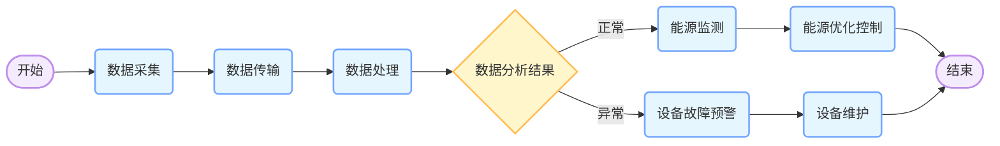

# 价值投资中的智能工厂能源管理系统分析

> 关键词：价值投资、智能工厂、能源管理系统、数据分析、成本控制

> 摘要：本文围绕价值投资视角下的智能工厂能源管理系统展开深入分析。首先介绍了研究的背景、目的、预期读者和文档结构等内容。接着阐述了智能工厂能源管理系统的核心概念与联系，包括其原理和架构，并通过 Mermaid 流程图进行直观展示。详细讲解了核心算法原理及具体操作步骤，给出了 Python 源代码示例。探讨了相关数学模型和公式，并结合实例说明。通过项目实战，从开发环境搭建到源代码实现与解读，全面展示了系统的实际应用。分析了该系统在不同场景下的实际应用，推荐了学习资源、开发工具框架以及相关论文著作。最后总结了未来发展趋势与挑战，解答了常见问题，并提供了扩展阅读和参考资料，旨在为价值投资者和相关从业者提供全面且深入的技术和投资参考。

## 1. 背景介绍 
### 1.1 目的和范围
在当今全球能源紧张和环保要求日益提高的背景下，智能工厂的能源管理变得至关重要。对于价值投资者而言，关注智能工厂能源管理系统不仅有助于评估企业的长期投资价值，还能推动企业实现可持续发展。本文的目的在于深入分析智能工厂能源管理系统在价值投资中的应用和意义，探讨其技术原理、实际应用场景以及未来发展趋势。

研究范围涵盖智能工厂能源管理系统的各个方面，包括系统架构、核心算法、数学模型、实际案例分析等。同时，结合价值投资的理念，分析该系统如何影响企业的成本控制、生产效率和市场竞争力，为投资者提供决策依据。

### 1.2 预期读者
本文预期读者包括价值投资者、智能工厂领域的技术人员、企业管理者以及对能源管理和智能制造感兴趣的研究人员。对于投资者，本文将帮助他们了解智能工厂能源管理系统的投资价值和潜在风险；对于技术人员，提供系统的技术原理和实现细节，为系统的开发和优化提供参考；对于企业管理者，有助于他们认识到能源管理系统对企业发展的重要性，制定合理的能源管理策略；对于研究人员，提供了一个跨领域研究的视角和丰富的研究素材。

### 1.3 文档结构概述
本文共分为十个部分。第一部分为背景介绍，阐述研究的目的、范围、预期读者和文档结构。第二部分介绍智能工厂能源管理系统的核心概念与联系，包括系统原理和架构，并通过流程图展示。第三部分详细讲解核心算法原理及具体操作步骤，给出 Python 源代码示例。第四部分探讨相关数学模型和公式，并结合实例说明。第五部分通过项目实战，从开发环境搭建到源代码实现与解读，全面展示系统的实际应用。第六部分分析该系统在不同场景下的实际应用。第七部分推荐学习资源、开发工具框架以及相关论文著作。第八部分总结未来发展趋势与挑战。第九部分解答常见问题。第十部分提供扩展阅读和参考资料。

### 1.4 术语表
#### 1.4.1 核心术语定义
- **价值投资**：一种投资策略，强调通过对企业基本面的分析，寻找被低估的股票或资产进行投资，以获取长期稳定的回报。
- **智能工厂**：利用先进的信息技术和自动化技术，实现生产过程的智能化、自动化和数字化管理的工厂。
- **能源管理系统**：用于监测、控制和优化能源使用的系统，通过收集和分析能源数据，实现能源的高效利用和成本控制。
- **数据分析**：对大量数据进行收集、整理、分析和挖掘，以发现数据中的规律和价值的过程。
- **成本控制**：通过采取一系列措施，降低企业的生产成本，提高企业的经济效益。

#### 1.4.2 相关概念解释
- **物联网（IoT）**：通过各种信息传感器、射频识别技术、全球定位系统等技术和装置，实时采集任何需要监控、连接、互动的物体或过程，采集其声、光、热、电、力学、化学、生物、位置等各种需要的信息，通过各类可能的网络接入，实现物与物、物与人的泛在连接，实现对物品和过程的智能化感知、识别和管理。在智能工厂能源管理系统中，物联网技术用于连接各种能源设备，实现数据的实时采集和传输。
- **大数据**：指无法在一定时间范围内用常规软件工具进行捕捉、管理和处理的数据集合，是需要新处理模式才能具有更强的决策力、洞察发现力和流程优化能力的海量、高增长率和多样化的信息资产。在能源管理系统中，大数据技术用于存储和分析大量的能源数据，挖掘数据中的潜在价值。
- **人工智能（AI）**：研究、开发用于模拟、延伸和扩展人的智能的理论、方法、技术及应用系统的一门新的技术科学。在智能工厂能源管理系统中，人工智能技术用于实现能源预测、优化控制等功能。

#### 1.4.3 缩略词列表
- **EMS**：Energy Management System，能源管理系统
- **IoT**：Internet of Things，物联网
- **AI**：Artificial Intelligence，人工智能
- **PLC**：Programmable Logic Controller，可编程逻辑控制器
- **SCADA**：Supervisory Control and Data Acquisition，数据采集与监视控制系统

## 2. 核心概念与联系 
### 2.1 智能工厂能源管理系统原理
智能工厂能源管理系统的核心原理是通过物联网技术将各种能源设备连接起来，实时采集能源数据，如电量、水量、气量等。然后，利用大数据和人工智能技术对采集到的数据进行分析和处理，挖掘数据中的潜在价值。通过建立能源模型和优化算法，实现对能源使用的实时监测、控制和优化，从而提高能源利用效率，降低能源成本。

### 2.2 系统架构
智能工厂能源管理系统通常由数据采集层、数据传输层、数据处理层和应用层组成。
- **数据采集层**：主要负责采集各种能源设备的运行数据，包括电量、水量、气量、温度、压力等。采集设备可以是传感器、智能电表、PLC 等。
- **数据传输层**：将采集到的数据传输到数据处理中心。传输方式可以是有线传输（如以太网、RS485 等）或无线传输（如 Wi-Fi、ZigBee、LoRa 等）。
- **数据处理层**：对传输过来的数据进行清洗、存储和分析。数据处理中心通常采用大数据平台，如 Hadoop、Spark 等。通过数据分析算法，挖掘数据中的潜在价值，如能源消耗趋势、设备故障预警等。
- **应用层**：为用户提供各种应用服务，如能源监测、能源分析、能源优化控制等。用户可以通过 Web 界面或移动应用程序访问这些服务。

### 2.3 文本示意图
```plaintext
智能工厂能源管理系统
|-- 数据采集层
|   |-- 传感器
|   |-- 智能电表
|   |-- PLC
|-- 数据传输层
|   |-- 有线传输（以太网、RS485）
|   |-- 无线传输（Wi-Fi、ZigBee、LoRa）
|-- 数据处理层
|   |-- 大数据平台（Hadoop、Spark）
|   |-- 数据分析算法
|-- 应用层
|   |-- 能源监测
|   |-- 能源分析
|   |-- 能源优化控制
```

### 2.4 Mermaid 流程图


## 3. 核心算法原理 & 具体操作步骤 
### 3.1 能源预测算法原理
能源预测是智能工厂能源管理系统的重要功能之一，它可以帮助企业提前规划能源使用，降低能源成本。常用的能源预测算法有时间序列分析、机器学习算法等。

#### 3.1.1 时间序列分析
时间序列分析是一种基于历史数据预测未来数据的方法。它假设数据在时间上具有一定的规律性，通过对历史数据的分析和建模，预测未来的能源消耗情况。常用的时间序列分析模型有 ARIMA（Autoregressive Integrated Moving Average）模型。

ARIMA 模型的基本形式为：
$$
\phi(B)(1 - B)^dY_t = \theta(B)\epsilon_t
$$
其中，$Y_t$ 是时间序列数据，$B$ 是滞后算子，$\phi(B)$ 是自回归多项式，$\theta(B)$ 是移动平均多项式，$d$ 是差分阶数，$\epsilon_t$ 是白噪声序列。

#### 3.1.2 机器学习算法
机器学习算法可以通过对大量历史数据的学习，建立能源消耗与各种影响因素之间的关系模型，从而预测未来的能源消耗情况。常用的机器学习算法有线性回归、决策树、神经网络等。

以线性回归为例，其基本形式为：
$$
y = \beta_0 + \beta_1x_1 + \beta_2x_2 + \cdots + \beta_nx_n + \epsilon
$$
其中，$y$ 是能源消耗值，$x_1, x_2, \cdots, x_n$ 是影响能源消耗的因素，$\beta_0, \beta_1, \cdots, \beta_n$ 是回归系数，$\epsilon$ 是误差项。

### 3.2 Python 源代码实现
以下是一个使用 Python 实现 ARIMA 模型进行能源预测的示例代码：
```python
import pandas as pd
import numpy as np
from statsmodels.tsa.arima.model import ARIMA
import matplotlib.pyplot as plt

# 生成示例数据
np.random.seed(0)
date_rng = pd.date_range(start='2023-01-01', end='2023-12-31', freq='D')
energy_consumption = np.random.randint(100, 200, size=(len(date_rng)))
df = pd.DataFrame(date_rng, columns=['date'])
df['energy_consumption'] = energy_consumption
df.set_index('date', inplace=True)

# 划分训练集和测试集
train_size = int(len(df) * 0.8)
train_data = df[:train_size]
test_data = df[train_size:]

# 训练 ARIMA 模型
model = ARIMA(train_data['energy_consumption'], order=(1, 1, 1))
model_fit = model.fit()

# 进行预测
predictions = model_fit.get_forecast(steps=len(test_data))
predicted_mean = predictions.predicted_mean

# 绘制结果
plt.figure(figsize=(12, 6))
plt.plot(train_data.index, train_data['energy_consumption'], label='Training Data')
plt.plot(test_data.index, test_data['energy_consumption'], label='Actual Data')
plt.plot(test_data.index, predicted_mean, label='Predicted Data', color='r')
plt.title('Energy Consumption Prediction using ARIMA')
plt.xlabel('Date')
plt.ylabel('Energy Consumption')
plt.legend()
plt.show()
```
### 3.3 具体操作步骤
1. **数据准备**：收集历史能源消耗数据，并进行清洗和预处理。
2. **模型选择**：根据数据的特点和预测需求，选择合适的预测模型，如 ARIMA 模型或机器学习模型。
3. **模型训练**：使用训练数据对模型进行训练，调整模型参数，使模型达到最佳性能。
4. **模型评估**：使用测试数据对训练好的模型进行评估，计算预测误差，如均方误差（MSE）、平均绝对误差（MAE）等。
5. **预测应用**：使用训练好的模型对未来的能源消耗情况进行预测，并根据预测结果制定能源管理策略。

## 4. 数学模型和公式 & 详细讲解 & 举例说明 
### 4.1 能源消耗模型
能源消耗模型是智能工厂能源管理系统的核心数学模型之一，它可以帮助企业了解能源消耗的规律和影响因素，从而实现能源的优化控制。常见的能源消耗模型有线性模型、非线性模型等。

#### 4.1.1 线性模型
线性模型假设能源消耗与影响因素之间存在线性关系。以电力消耗为例，其线性模型可以表示为：
$$
P = \beta_0 + \beta_1T + \beta_2H + \beta_3L + \epsilon
$$
其中，$P$ 是电力消耗功率，$T$ 是环境温度，$H$ 是环境湿度，$L$ 是生产负荷，$\beta_0, \beta_1, \beta_2, \beta_3$ 是回归系数，$\epsilon$ 是误差项。

#### 4.1.2 非线性模型
非线性模型可以更好地描述能源消耗与影响因素之间的复杂关系。常见的非线性模型有神经网络模型、支持向量机模型等。以神经网络模型为例，其基本结构包括输入层、隐藏层和输出层。输入层接收影响能源消耗的因素，如温度、湿度、生产负荷等；隐藏层对输入数据进行非线性变换；输出层输出能源消耗的预测值。

### 4.2 能源优化模型
能源优化模型的目标是在满足生产需求的前提下，最小化能源消耗成本。常见的能源优化模型有线性规划模型、动态规划模型等。

#### 4.2.1 线性规划模型
线性规划模型是一种在一组线性约束条件下，求解线性目标函数最优解的数学模型。以电力分配为例，其线性规划模型可以表示为：
$$
\begin{aligned}
\min_{x_1, x_2, \cdots, x_n} &\sum_{i = 1}^{n} c_ix_i \\
\text{s.t.} &\sum_{i = 1}^{n} x_i = P_{total} \\
&x_i \geq 0, i = 1, 2, \cdots, n
\end{aligned}
$$
其中，$x_i$ 是分配给第 $i$ 个设备的电力，$c_i$ 是第 $i$ 个设备的单位电力成本，$P_{total}$ 是总电力供应量。

#### 4.2.2 动态规划模型
动态规划模型是一种将复杂问题分解为多个子问题，并通过求解子问题的最优解来得到原问题最优解的数学模型。以能源存储系统的充放电控制为例，其动态规划模型可以表示为：
$$
\begin{aligned}
V_t(S_t) &= \max_{u_t \in U_t(S_t)} \left\{ r_t(S_t, u_t) + \gamma V_{t + 1}(S_{t + 1}) \right\} \\
S_{t + 1} &= f(S_t, u_t)
\end{aligned}
$$
其中，$V_t(S_t)$ 是在状态 $S_t$ 下的最优价值函数，$u_t$ 是控制变量，$U_t(S_t)$ 是在状态 $S_t$ 下的可行控制集合，$r_t(S_t, u_t)$ 是在状态 $S_t$ 下采取控制 $u_t$ 的即时奖励，$\gamma$ 是折扣因子，$S_{t + 1}$ 是下一个状态，$f(S_t, u_t)$ 是状态转移函数。

### 4.3 举例说明
假设某智能工厂有三个设备，其单位电力成本分别为 $c_1 = 0.5$ 元/度，$c_2 = 0.6$ 元/度，$c_3 = 0.7$ 元/度，总电力供应量为 $P_{total} = 100$ 度。为了最小化电力成本，我们可以使用线性规划模型进行电力分配。

根据线性规划模型的约束条件和目标函数，我们可以得到以下数学表达式：
$$
\begin{aligned}
\min_{x_1, x_2, x_3} &0.5x_1 + 0.6x_2 + 0.7x_3 \\
\text{s.t.} &x_1 + x_2 + x_3 = 100 \\
&x_1 \geq 0, x_2 \geq 0, x_3 \geq 0
\end{aligned}
$$
使用 Python 的 `pulp` 库可以求解该线性规划问题，代码如下：
```python
from pulp import LpMinimize, LpProblem, LpVariable

# 创建线性规划问题
prob = LpProblem("Energy_Allocation", LpMinimize)

# 定义决策变量
x1 = LpVariable("x1", lowBound=0)
x2 = LpVariable("x2", lowBound=0)
x3 = LpVariable("x3", lowBound=0)

# 定义目标函数
prob += 0.5 * x1 + 0.6 * x2 + 0.7 * x3

# 定义约束条件
prob += x1 + x2 + x3 == 100

# 求解线性规划问题
prob.solve()

# 输出结果
print("Status:", prob.status)
print("Optimal Solution:")
print("x1 =", x1.value())
print("x2 =", x2.value())
print("x3 =", x3.value())
print("Minimum Cost =", prob.objective.value())
```
运行上述代码，我们可以得到最优的电力分配方案和最小的电力成本。

## 5. 项目实战：代码实际案例和详细解释说明 
### 5.1  开发环境搭建
#### 5.1.1 硬件环境
- **服务器**：选择性能稳定、配置较高的服务器，如戴尔 PowerEdge R740xd，用于部署数据处理中心和应用服务。
- **传感器**：根据需要采集的能源数据类型，选择合适的传感器，如电量传感器、水量传感器、温度传感器等。
- **网络设备**：包括路由器、交换机等，用于实现设备之间的网络连接。

#### 5.1.2 软件环境
- **操作系统**：选择 Linux 操作系统，如 Ubuntu Server 20.04 LTS，具有稳定性高、安全性好等优点。
- **数据库**：选择关系型数据库 MySQL 或非关系型数据库 MongoDB，用于存储能源数据。
- **大数据平台**：选择 Hadoop 和 Spark 大数据平台，用于数据存储和分析。
- **开发语言和框架**：选择 Python 作为开发语言，使用 Flask 框架开发 Web 应用程序。

### 5.2  源代码详细实现和代码解读
#### 5.2.1 数据采集模块
```python
import serial
import time

# 配置串口参数
ser = serial.Serial('/dev/ttyUSB0', 9600, timeout=1)

def read_sensor_data():
    try:
        # 读取传感器数据
        data = ser.readline().decode('utf-8').strip()
        return data
    except Exception as e:
        print(f"Error reading sensor data: {e}")
        return None

while True:
    sensor_data = read_sensor_data()
    if sensor_data:
        print(f"Sensor data: {sensor_data}")
    time.sleep(1)
```
代码解读：该代码实现了通过串口读取传感器数据的功能。首先，使用 `serial.Serial` 函数配置串口参数。然后，定义 `read_sensor_data` 函数，用于读取传感器数据。最后，使用一个无限循环不断读取传感器数据，并打印输出。

#### 5.2.2 数据传输模块
```python
import requests

def send_data_to_server(data):
    url = 'http://server_ip:port/api/data'
    try:
        # 发送数据到服务器
        response = requests.post(url, json=data)
        if response.status_code == 200:
            print("Data sent successfully")
        else:
            print(f"Failed to send data: {response.text}")
    except Exception as e:
        print(f"Error sending data to server: {e}")

# 示例数据
sensor_data = {'temperature': 25, 'humidity': 60}
send_data_to_server(sensor_data)
```
代码解读：该代码实现了将传感器数据发送到服务器的功能。使用 `requests.post` 函数将数据以 JSON 格式发送到服务器的指定 API 接口。根据服务器的响应状态码判断数据是否发送成功。

#### 5.2.3 数据处理模块
```python
from pyspark.sql import SparkSession
from pyspark.sql.functions import col

# 创建 SparkSession
spark = SparkSession.builder.appName("EnergyDataProcessing").getOrCreate()

# 读取数据
data = spark.read.json('hdfs://localhost:9000/path/to/data.json')

# 数据清洗
cleaned_data = data.filter(col('energy_consumption').isNotNull())

# 数据分析
average_energy = cleaned_data.agg({'energy_consumption': 'avg'}).collect()[0][0]
print(f"Average energy consumption: {average_energy}")

# 停止 SparkSession
spark.stop()
```
代码解读：该代码使用 PySpark 实现了数据处理和分析的功能。首先，创建 `SparkSession` 对象。然后，使用 `spark.read.json` 函数读取存储在 HDFS 上的 JSON 格式数据。接着，使用 `filter` 函数进行数据清洗，过滤掉能源消耗值为空的数据。最后，使用 `agg` 函数计算平均能源消耗，并打印输出。

#### 5.2.4 应用服务模块
```python
from flask import Flask, jsonify

app = Flask(__name__)

# 模拟能源数据
energy_data = {'date': '2023-10-01', 'energy_consumption': 100}

@app.route('/api/energy', methods=['GET'])
def get_energy_data():
    return jsonify(energy_data)

if __name__ == '__main__':
    app.run(host='0.0.0.0', port=5000)
```
代码解读：该代码使用 Flask 框架实现了一个简单的 Web 应用程序，提供能源数据的查询接口。定义了一个 `/api/energy` 的 GET 请求接口，返回模拟的能源数据。

### 5.3  代码解读与分析
通过上述代码示例，我们可以看到智能工厂能源管理系统的各个模块的实现原理和代码结构。数据采集模块负责从传感器读取能源数据，数据传输模块将数据发送到服务器，数据处理模块对数据进行清洗和分析，应用服务模块提供能源数据的查询接口。

在实际应用中，我们可以根据具体需求对代码进行扩展和优化。例如，在数据采集模块中，可以增加数据校验和异常处理功能；在数据处理模块中，可以使用更复杂的数据分析算法，如机器学习算法，进行能源预测和优化控制。

## 6. 实际应用场景 
### 6.1 工业制造
在工业制造领域，智能工厂能源管理系统可以实时监测生产设备的能源消耗情况，优化设备的运行参数，提高能源利用效率。例如，通过对机床的能源消耗进行监测和分析，调整机床的切削参数，减少能源浪费。同时，系统可以根据生产计划和能源价格，合理安排设备的运行时间，降低能源成本。

### 6.2 商业建筑
在商业建筑领域，智能工厂能源管理系统可以对建筑物的照明、空调、电梯等设备进行集中控制和管理。通过实时监测室内外环境参数，如温度、湿度、光照强度等，自动调节设备的运行状态，实现能源的优化使用。例如，当室内光照强度足够时，自动关闭部分照明设备；当室内温度达到设定值时，自动调节空调的运行功率。

### 6.3 数据中心
在数据中心领域，智能工厂能源管理系统可以对服务器、制冷设备等进行能源管理。通过实时监测服务器的负载情况和温度变化，动态调整服务器的功率和制冷设备的运行参数，降低数据中心的能源消耗。同时，系统可以对能源使用情况进行分析和预测，提前规划能源供应，确保数据中心的稳定运行。

## 7. 工具和资源推荐
### 7.1 学习资源推荐
#### 7.1.1 书籍推荐
- 《智能工厂：原理、技术与应用》：全面介绍了智能工厂的相关概念、技术和应用案例，对智能工厂能源管理系统有深入的阐述。
- 《能源管理系统：原理与应用》：详细讲解了能源管理系统的原理、架构和实现方法，提供了丰富的案例和实践经验。
- 《Python 数据分析实战》：介绍了 Python 在数据分析领域的应用，包括数据采集、清洗、分析和可视化等方面的内容，对于智能工厂能源管理系统的数据处理和分析有很大的帮助。

#### 7.1.2 在线课程
- Coursera 上的 “Smart Manufacturing and Industry 4.0” 课程：由知名高校教授授课，介绍了智能制造和工业 4.0 的相关知识，包括智能工厂能源管理系统的应用。
- edX 上的 “Energy Management and Efficiency” 课程：提供了能源管理和节能的理论和实践知识，对于理解智能工厂能源管理系统的原理和方法有很大的帮助。
- 中国大学 MOOC 上的 “Python 数据分析与应用” 课程：详细讲解了 Python 在数据分析领域的应用，适合初学者学习。

#### 7.1.3 技术博客和网站
- 物联网智库（https://www.iot101.com/）：提供物联网领域的最新技术和应用案例，包括智能工厂能源管理系统的相关内容。
- 能源管理网（https://www.energymanagement.org.cn/）：专注于能源管理领域的资讯和技术交流，有很多关于能源管理系统的文章和案例。
- 开源中国（https://www.oschina.net/）：提供开源技术和项目的介绍和交流平台，有很多与智能工厂能源管理系统相关的开源项目和代码。

### 7.2 开发工具框架推荐
#### 7.2.1 IDE和编辑器
- PyCharm：一款专业的 Python 集成开发环境，提供代码编辑、调试、版本控制等功能，适合开发智能工厂能源管理系统的 Python 代码。
- Visual Studio Code：一款轻量级的代码编辑器，支持多种编程语言和插件扩展，具有丰富的代码编辑和调试功能。
- IntelliJ IDEA：一款功能强大的 Java 集成开发环境，也支持 Python 开发，适合开发智能工厂能源管理系统的后端服务。

#### 7.2.2 调试和性能分析工具
- Py-Spy：一款 Python 性能分析工具，可以实时监测 Python 程序的 CPU 使用率和函数调用情况，帮助开发者找出性能瓶颈。
- VisualVM：一款 Java 性能分析工具，可以对 Java 程序进行内存分析、线程分析和性能监测，适合调试智能工厂能源管理系统的后端服务。
- Wireshark：一款网络协议分析工具，可以捕获和分析网络数据包，帮助开发者调试数据传输模块。

#### 7.2.3 相关框架和库
- Flask：一款轻量级的 Python Web 框架，适合开发智能工厂能源管理系统的应用服务模块。
- Django：一款功能强大的 Python Web 框架，提供了丰富的功能和工具，适合开发大型的智能工厂能源管理系统。
- TensorFlow：一款开源的机器学习框架，提供了丰富的机器学习算法和工具，适合开发智能工厂能源管理系统的能源预测和优化控制模块。

### 7.3 相关论文著作推荐
#### 7.3.1 经典论文
- “Smart Grid: The New and Improved Power Grid”：介绍了智能电网的概念、技术和应用，对于理解智能工厂能源管理系统与智能电网的关系有很大的帮助。
- “Energy Management in Smart Buildings: A Review”：对智能建筑能源管理的相关技术和方法进行了综述，提供了很多有价值的参考。
- “Machine Learning for Energy Management in Smart Grids: A Review”：介绍了机器学习在智能电网能源管理中的应用，对于智能工厂能源管理系统的能源预测和优化控制有一定的启示。

#### 7.3.2 最新研究成果
- 近年来，关于智能工厂能源管理系统的研究主要集中在能源预测、优化控制、物联网技术应用等方面。可以通过 IEEE Xplore、ACM Digital Library 等学术数据库查找最新的研究成果。
- 一些知名学术会议，如 IEEE International Conference on Smart Grid Communications (SmartGridComm)、ACM SIGKDD Conference on Knowledge Discovery and Data Mining (KDD) 等，也会发布关于智能工厂能源管理系统的最新研究成果。

#### 7.3.3 应用案例分析
- 可以通过一些行业报告和案例分析网站，如 Gartner、Forrester 等，了解智能工厂能源管理系统在不同行业的应用案例和实践经验。
- 一些企业的官方网站也会发布其智能工厂能源管理系统的应用案例，如西门子、ABB 等。

## 8. 总结：未来发展趋势与挑战
### 8.1 未来发展趋势
#### 8.1.1 智能化程度不断提高
随着人工智能、机器学习等技术的不断发展，智能工厂能源管理系统的智能化程度将不断提高。系统将能够自动学习和适应不同的生产环境和能源需求，实现更加精准的能源预测和优化控制。

#### 8.1.2 与其他系统的集成更加紧密
智能工厂能源管理系统将与企业的生产管理系统、供应链管理系统等进行更加紧密的集成，实现数据的共享和协同工作。例如，根据生产计划自动调整能源供应，提高生产效率和能源利用效率。

#### 8.1.3 能源互联网的融合
智能工厂能源管理系统将与能源互联网进行融合，实现能源的双向流动和优化配置。企业可以通过能源互联网与其他企业进行能源交易，降低能源成本。

### 8.2 挑战
#### 8.2.1 数据安全和隐私问题
智能工厂能源管理系统涉及大量的能源数据和企业生产数据，数据安全和隐私问题是一个重要的挑战。需要采取有效的数据加密、访问控制等措施，确保数据的安全和隐私。

#### 8.2.2 技术标准和规范不完善
目前，智能工厂能源管理系统的技术标准和规范还不完善，不同企业和系统之间的数据格式和接口不统一，导致系统之间的互操作性和集成难度较大。需要加强技术标准和规范的制定，促进系统的互联互通。

#### 8.2.3 人才短缺
智能工厂能源管理系统涉及多个领域的知识和技术，如物联网、大数据、人工智能等，目前相关领域的专业人才短缺，制约了系统的发展和应用。需要加强人才培养，提高从业人员的技术水平和综合素质。

## 9. 附录：常见问题与解答
### 9.1 智能工厂能源管理系统的投资回报率如何？
智能工厂能源管理系统的投资回报率取决于多个因素，如能源成本节约、生产效率提高、设备维护成本降低等。一般来说，通过实施能源管理系统，企业可以降低能源成本 10% - 30%，提高生产效率 5% - 15%。根据不同的行业和企业情况，投资回报率通常在 1 - 3 年左右。

### 9.2 智能工厂能源管理系统对企业的生产运营有哪些影响？
智能工厂能源管理系统可以实时监测和控制能源使用情况，优化生产流程，提高生产效率。通过对能源数据的分析和预测，企业可以提前规划能源供应，避免能源短缺和浪费。同时，系统可以及时发现设备故障和能源异常，提醒企业进行维护和调整，减少设备停机时间，提高设备的可靠性和使用寿命。

### 9.3 智能工厂能源管理系统的实施难度大吗？
智能工厂能源管理系统的实施难度取决于企业的现有基础和系统的复杂程度。一般来说，实施过程包括设备安装、数据采集、系统集成、数据分析等多个环节。对于一些已经具备一定信息化基础的企业，实施难度相对较小；对于一些传统企业，可能需要进行一定的技术改造和人员培训。在实施过程中，选择合适的供应商和合作伙伴，制定合理的实施计划，可以有效降低实施难度。

## 10. 扩展阅读 & 参考资料
### 10.1 扩展阅读
- 《工业 4.0：即将来袭的第四次工业革命》：介绍了工业 4.0 的概念、技术和发展趋势，对于理解智能工厂能源管理系统在工业 4.0 背景下的应用有很大的帮助。
- 《物联网：技术、应用与创新》：详细讲解了物联网的相关技术和应用案例，包括智能工厂能源管理系统中物联网技术的应用。
- 《大数据时代：生活、工作与思维的大变革》：阐述了大数据时代的特点和影响，对于理解智能工厂能源管理系统中大数据技术的应用有一定的启示。

### 10.2 参考资料
- IEEE 标准协会（https://ieeexplore.ieee.org/）：提供了大量关于智能电网、物联网、能源管理等领域的标准和技术文献。
- 国际能源署（https://www.iea.org/）：发布了全球能源市场的最新动态和研究报告，对于了解能源行业的发展趋势有很大的帮助。
- 工业互联网产业联盟（https://www.aii-alliance.org/）：致力于推动工业互联网的发展和应用，发布了很多关于智能工厂和能源管理系统的研究报告和案例分析。

作者：AI天才研究院/AI Genius Institute & 禅与计算机程序设计艺术 /Zen And The Art of Computer Programming