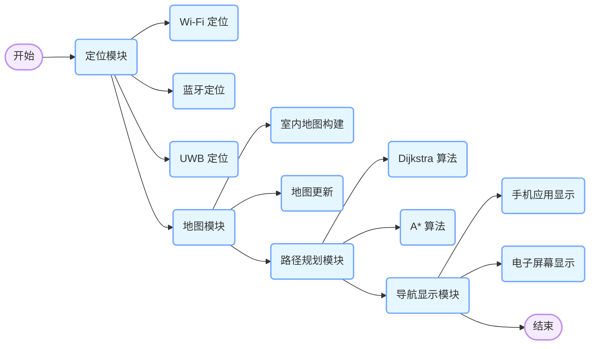

# 价值投资中的智能建筑室内导航系统分析

> 关键词：价值投资、智能建筑、室内导航系统、技术原理、应用场景

> 摘要：本文聚焦于价值投资视角下的智能建筑室内导航系统。详细介绍了该系统的背景知识，包括目的、预期读者、文档结构和相关术语。深入剖析了核心概念、算法原理、数学模型，通过实际案例展示了系统的开发和实现过程。探讨了其在商业、医疗、教育等领域的实际应用场景，推荐了学习资源、开发工具和相关论文。最后总结了系统未来的发展趋势与挑战，并提供常见问题解答和扩展阅读资料，旨在为投资者和技术人员全面了解智能建筑室内导航系统提供有价值的参考。

## 1. 背景介绍 
### 1.1 目的和范围
智能建筑室内导航系统是随着城市化进程加快和建筑规模日益庞大而应运而生的技术。其目的在于解决人们在大型建筑如商场、机场、医院等内部快速准确找到目的地的问题。本文章的范围涵盖了该系统从技术原理、开发实现到实际应用等多个方面，同时从价值投资的角度进行分析，帮助投资者评估该系统的商业潜力和投资价值。

### 1.2 预期读者
本文的预期读者包括对价值投资感兴趣的投资者，他们希望了解智能建筑室内导航系统的市场前景和投资机会；从事智能建筑、室内导航相关领域的技术人员，他们可以从文章中获取系统的技术细节和开发经验；以及建筑行业的从业者，他们可以了解如何将该系统应用于实际建筑项目中，提升建筑的智能化水平。

### 1.3 文档结构概述
本文首先介绍智能建筑室内导航系统的背景知识，包括目的、预期读者和文档结构等。接着阐述核心概念和联系，通过文本示意图和 Mermaid 流程图展示系统的架构。然后详细讲解核心算法原理和具体操作步骤，并使用 Python 源代码进行说明。之后介绍数学模型和公式，通过举例加深理解。再通过项目实战展示系统的开发过程和代码实现。探讨系统的实际应用场景，推荐相关的学习资源、开发工具和论文著作。最后总结系统的未来发展趋势与挑战，提供常见问题解答和扩展阅读资料。

### 1.4 术语表
#### 1.4.1 核心术语定义
- **智能建筑**：指通过将建筑物的结构、系统、服务和管理根据用户的需求进行最优化组合，从而为用户提供一个高效、舒适、便利的人性化建筑环境。
- **室内导航系统**：一种基于室内环境的定位和导航技术，帮助用户在室内空间中确定自己的位置并找到前往目的地的最佳路径。
- **价值投资**：一种投资策略，投资者通过分析资产的内在价值，寻找被低估的资产进行投资，以期获得长期稳定的回报。

#### 1.4.2 相关概念解释
- **定位技术**：室内导航系统的核心技术之一，用于确定用户在室内空间中的位置。常见的定位技术包括 Wi-Fi 定位、蓝牙定位、超宽带（UWB）定位等。
- **路径规划算法**：根据用户的当前位置和目的地，计算出最佳的导航路径。常见的路径规划算法包括 Dijkstra 算法、A* 算法等。

#### 1.4.3 缩略词列表
- **UWB**：Ultra Wide Band，超宽带
- **RSSI**：Received Signal Strength Indication，接收信号强度指示

## 2. 核心概念与联系 
智能建筑室内导航系统主要由定位模块、地图模块、路径规划模块和导航显示模块组成。其核心概念和联系可以用以下文本示意图和 Mermaid 流程图来表示。

### 文本示意图
```plaintext
智能建筑室内导航系统
|-- 定位模块
|   |-- Wi-Fi 定位
|   |-- 蓝牙定位
|   |-- UWB 定位
|-- 地图模块
|   |-- 室内地图构建
|   |-- 地图更新
|-- 路径规划模块
|   |-- Dijkstra 算法
|   |-- A* 算法
|-- 导航显示模块
|   |-- 手机应用显示
|   |-- 电子屏幕显示
```

### Mermaid 流程图


从流程图可以看出，系统首先通过定位模块确定用户的位置，然后结合地图模块提供的室内地图信息，使用路径规划模块计算出最佳的导航路径，最后通过导航显示模块将路径信息展示给用户。

## 3. 核心算法原理 & 具体操作步骤 
### 定位算法原理
以 Wi-Fi 定位为例，其基本原理是通过测量多个 Wi-Fi 接入点（AP）的信号强度（RSSI），利用信号传播模型计算出用户与各个 AP 的距离，然后通过三角定位或多边定位算法确定用户的位置。以下是一个简单的 Python 代码示例：

```python
import math

# 模拟 Wi-Fi AP 的位置和信号强度
aps = [
    {'x': 0, 'y': 0, 'rssi': -50},
    {'x': 10, 'y': 0, 'rssi': -55},
    {'x': 0, 'y': 10, 'rssi': -60}
]

# 信号传播模型参数
n = 2  # 路径损耗指数
A = -40  # 参考距离 1 米处的信号强度

def rssi_to_distance(rssi):
    """
    根据 RSSI 计算距离
    """
    return 10 ** ((A - rssi) / (10 * n))

def trilateration(aps):
    """
    三角定位算法
    """
    d1 = rssi_to_distance(aps[0]['rssi'])
    d2 = rssi_to_distance(aps[1]['rssi'])
    d3 = rssi_to_distance(aps[2]['rssi'])

    x1, y1 = aps[0]['x'], aps[0]['y']
    x2, y2 = aps[1]['x'], aps[1]['y']
    x3, y3 = aps[2]['x'], aps[2]['y']

    A = 2 * (x2 - x1)
    B = 2 * (y2 - y1)
    C = d1 ** 2 - d2 ** 2 - x1 ** 2 + x2 ** 2 - y1 ** 2 + y2 ** 2
    D = 2 * (x3 - x1)
    E = 2 * (y3 - y1)
    F = d1 ** 2 - d3 ** 2 - x1 ** 2 + x3 ** 2 - y1 ** 2 + y3 ** 2

    x = (C * E - F * B) / (E * A - B * D)
    y = (C * D - F * A) / (B * D - A * E)

    return x, y

# 计算用户位置
x, y = trilateration(aps)
print(f"用户位置: ({x}, {y})")
```

### 路径规划算法原理
以 A* 算法为例，A* 算法是一种启发式搜索算法，它结合了 Dijkstra 算法的最优路径搜索和贪心最佳优先搜索的启发式搜索。A* 算法通过维护一个开放列表和一个关闭列表，不断扩展节点直到找到目标节点。以下是一个简单的 Python 代码示例：

```python
import heapq

# 定义节点类
class Node:
    def __init__(self, x, y, g=float('inf'), h=float('inf'), parent=None):
        self.x = x
        self.y = y
        self.g = g  # 从起点到当前节点的实际代价
        self.h = h  # 从当前节点到目标节点的预估代价
        self.f = g + h  # 总代价
        self.parent = parent

    def __lt__(self, other):
        return self.f < other.f

# 定义地图
map = [
    [0, 0, 0, 0],
    [0, 1, 1, 0],
    [0, 0, 0, 0],
    [0, 0, 0, 0]
]

# 定义启发式函数（曼哈顿距离）
def heuristic(node, goal):
    return abs(node.x - goal.x) + abs(node.y - goal.y)

# 定义 A* 算法
def a_star(start, goal):
    open_list = []
    closed_list = set()

    start.g = 0
    start.h = heuristic(start, goal)
    start.f = start.g + start.h

    heapq.heappush(open_list, start)

    while open_list:
        current = heapq.heappop(open_list)

        if current.x == goal.x and current.y == goal.y:
            path = []
            while current:
                path.append((current.x, current.y))
                current = current.parent
            return path[::-1]

        closed_list.add((current.x, current.y))

        # 定义相邻节点的偏移量
        neighbors = [(0, 1), (0, -1), (1, 0), (-1, 0)]

        for dx, dy in neighbors:
            nx, ny = current.x + dx, current.y + dy

            if 0 <= nx < len(map) and 0 <= ny < len(map[0]) and map[nx][ny] == 0 and (nx, ny) not in closed_list:
                neighbor = Node(nx, ny)
                tentative_g = current.g + 1

                found = False
                for i, node in enumerate(open_list):
                    if node.x == nx and node.y == ny:
                        if tentative_g < node.g:
                            open_list[i].g = tentative_g
                            open_list[i].h = heuristic(open_list[i], goal)
                            open_list[i].f = open_list[i].g + open_list[i].h
                            open_list[i].parent = current
                        found = True
                        break

                if not found:
                    neighbor.g = tentative_g
                    neighbor.h = heuristic(neighbor, goal)
                    neighbor.f = neighbor.g + neighbor.h
                    neighbor.parent = current
                    heapq.heappush(open_list, neighbor)

    return None

# 定义起点和终点
start = Node(0, 0)
goal = Node(3, 3)

# 计算路径
path = a_star(start, goal)
print("路径:", path)
```

### 具体操作步骤
1. **数据采集**：在室内环境中部署 Wi-Fi AP 或蓝牙信标等定位设备，采集信号强度数据。
2. **地图构建**：使用激光雷达、摄影测量等技术构建室内地图。
3. **定位计算**：根据采集到的信号强度数据，使用定位算法计算用户的位置。
4. **路径规划**：根据用户的当前位置和目的地，使用路径规划算法计算最佳路径。
5. **导航显示**：将计算出的路径信息通过手机应用或电子屏幕展示给用户。

## 4. 数学模型和公式 & 详细讲解 & 举例说明 
### 定位数学模型
#### 信号传播模型
在 Wi-Fi 定位中，常用的信号传播模型是对数距离路径损耗模型，其公式为：

$$
P(d) = P(d_0) - 10n\log_{10}(\frac{d}{d_0})
$$

其中，$P(d)$ 是距离为 $d$ 处的信号强度，$P(d_0)$ 是参考距离 $d_0$ 处的信号强度，$n$ 是路径损耗指数。

#### 三角定位公式
三角定位是通过测量三个或更多已知位置的信号源与目标的距离，来确定目标的位置。假设三个信号源的位置分别为 $(x_1, y_1)$、$(x_2, y_2)$ 和 $(x_3, y_3)$，目标到三个信号源的距离分别为 $d_1$、$d_2$ 和 $d_3$，则目标的位置 $(x, y)$ 可以通过以下方程组求解：

$$
\begin{cases}
(x - x_1)^2 + (y - y_1)^2 = d_1^2 \\
(x - x_2)^2 + (y - y_2)^2 = d_2^2 \\
(x - x_3)^2 + (y - y_3)^2 = d_3^2
\end{cases}
$$

### 路径规划数学模型
#### Dijkstra 算法
Dijkstra 算法是一种广度优先搜索算法，用于在加权图中找到从起点到所有其他节点的最短路径。其基本思想是维护一个距离数组 $dist$，记录从起点到每个节点的最短距离，初始时 $dist$ 数组的值都为无穷大，起点的距离为 0。然后不断选择距离起点最近的节点进行扩展，更新其相邻节点的距离。

#### A* 算法
A* 算法是一种启发式搜索算法，它在 Dijkstra 算法的基础上引入了启发式函数 $h(n)$，用于估计从节点 $n$ 到目标节点的距离。A* 算法通过维护一个开放列表和一个关闭列表，不断扩展节点直到找到目标节点。其总代价 $f(n)$ 的计算公式为：

$$
f(n) = g(n) + h(n)
$$

其中，$g(n)$ 是从起点到节点 $n$ 的实际代价，$h(n)$ 是从节点 $n$ 到目标节点的预估代价。

### 举例说明
#### 定位举例
假设在一个室内环境中，有三个 Wi-Fi AP，其位置分别为 $(0, 0)$、$(10, 0)$ 和 $(0, 10)$，参考距离 1 米处的信号强度 $A = -40$，路径损耗指数 $n = 2$。用户测量到三个 AP 的信号强度分别为 -50、-55 和 -60。首先，根据信号传播模型计算用户到三个 AP 的距离：

$$
d_1 = 10^{\frac{A - RSSI_1}{10n}} = 10^{\frac{-40 - (-50)}{10\times2}} = 10^{0.5} \approx 3.16
$$

$$
d_2 = 10^{\frac{A - RSSI_2}{10n}} = 10^{\frac{-40 - (-55)}{10\times2}} = 10^{0.75} \approx 5.62
$$

$$
d_3 = 10^{\frac{A - RSSI_3}{10n}} = 10^{\frac{-40 - (-60)}{10\times2}} = 10^1 = 10
$$

然后，使用三角定位公式求解用户的位置：

$$
\begin{cases}
x^2 + y^2 = 3.16^2 \\
(x - 10)^2 + y^2 = 5.62^2 \\
x^2 + (y - 10)^2 = 10^2
\end{cases}
$$

通过求解上述方程组，可以得到用户的位置。

#### 路径规划举例
假设有一个 4x4 的地图，其中 0 表示可通行区域，1 表示障碍物。起点为 $(0, 0)$，终点为 $(3, 3)$。使用 A* 算法计算从起点到终点的最短路径。首先，定义起点和终点节点，然后初始化开放列表和关闭列表。接着，不断从开放列表中选择总代价最小的节点进行扩展，更新其相邻节点的代价。直到找到目标节点或开放列表为空。最终得到的路径即为最短路径。

## 5. 项目实战：代码实际案例和详细解释说明 
### 5.1  开发环境搭建
#### 硬件环境
- **服务器**：可以选择云服务器或本地服务器，如阿里云 ECS、腾讯云 CVM 等，配置建议为 2 核 4GB 内存以上。
- **定位设备**：Wi-Fi AP、蓝牙信标、UWB 基站等。
- **终端设备**：智能手机、平板电脑等。

#### 软件环境
- **操作系统**：服务器可以选择 Linux 系统，如 Ubuntu、CentOS 等；终端设备可以选择 Android 或 iOS 系统。
- **开发语言**：Python、Java、JavaScript 等。
- **开发框架**：Django、Flask（Python），Spring Boot（Java），React Native、Vue.js（JavaScript）等。

### 5.2  源代码详细实现和代码解读
#### 后端代码实现（Python + Flask）
```python
from flask import Flask, jsonify, request
import math

app = Flask(__name__)

# 模拟 Wi-Fi AP 的位置和信号强度
aps = [
    {'x': 0, 'y': 0, 'rssi': -50},
    {'x': 10, 'y': 0, 'rssi': -55},
    {'x': 0, 'y': 10, 'rssi': -60}
]

# 信号传播模型参数
n = 2  # 路径损耗指数
A = -40  # 参考距离 1 米处的信号强度

def rssi_to_distance(rssi):
    """
    根据 RSSI 计算距离
    """
    return 10 ** ((A - rssi) / (10 * n))

def trilateration(aps):
    """
    三角定位算法
    """
    d1 = rssi_to_distance(aps[0]['rssi'])
    d2 = rssi_to_distance(aps[1]['rssi'])
    d3 = rssi_to_distance(aps[2]['rssi'])

    x1, y1 = aps[0]['x'], aps[0]['y']
    x2, y2 = aps[1]['x'], aps[1]['y']
    x3, y3 = aps[2]['x'], aps[2]['y']

    A = 2 * (x2 - x1)
    B = 2 * (y2 - y1)
    C = d1 ** 2 - d2 ** 2 - x1 ** 2 + x2 ** 2 - y1 ** 2 + y2 ** 2
    D = 2 * (x3 - x1)
    E = 2 * (y3 - y1)
    F = d1 ** 2 - d3 ** 2 - x1 ** 2 + x3 ** 2 - y1 ** 2 + y3 ** 2

    x = (C * E - F * B) / (E * A - B * D)
    y = (C * D - F * A) / (B * D - A * E)

    return x, y

@app.route('/location', methods=['GET'])
def get_location():
    """
    获取用户位置
    """
    x, y = trilateration(aps)
    return jsonify({'x': x, 'y': y})

if __name__ == '__main__':
    app.run(debug=True)
```

#### 代码解读
- **导入必要的库**：使用 `Flask` 框架创建 Web 服务，`jsonify` 用于将数据转换为 JSON 格式，`request` 用于处理 HTTP 请求。
- **定义 Wi-Fi AP 的信息**：模拟了三个 Wi-Fi AP 的位置和信号强度。
- **实现信号传播模型和三角定位算法**：`rssi_to_distance` 函数根据 RSSI 计算距离，`trilateration` 函数使用三角定位算法计算用户的位置。
- **定义路由**：`/location` 路由用于处理获取用户位置的请求，调用 `trilateration` 函数计算位置并返回 JSON 格式的结果。

#### 前端代码实现（HTML + JavaScript）
```html
<!DOCTYPE html>
<html lang="en">

<head>
    <meta charset="UTF-8">
    <meta name="viewport" content="width=device-width, initial-scale=1.0">
    <title>室内导航系统</title>
</head>

<body>
    <div id="location"></div>
    <script>
        async function getLocation() {
            try {
                const response = await fetch('http://localhost:5000/location');
                const data = await response.json();
                const locationDiv = document.getElementById('location');
                locationDiv.innerHTML = `您的位置: (${data.x}, ${data.y})`;
            } catch (error) {
                console.error('获取位置信息失败:', error);
            }
        }

        getLocation();
    </script>
</body>

</html>
```

#### 代码解读
- **HTML 部分**：创建一个简单的 HTML 页面，包含一个用于显示位置信息的 `div` 元素。
- **JavaScript 部分**：使用 `fetch` API 发送 HTTP 请求到后端服务器的 `/location` 路由，获取用户的位置信息，并将其显示在页面上。

### 5.3  代码解读与分析
#### 后端代码分析
- **优点**：使用 Flask 框架可以快速搭建 Web 服务，代码简洁易懂。使用 JSON 格式进行数据传输，方便前端处理。
- **缺点**：目前只是模拟了 Wi-Fi AP 的信息，实际应用中需要实时采集信号强度数据。没有考虑定位误差和信号干扰等问题。

#### 前端代码分析
- **优点**：使用 HTML 和 JavaScript 可以在浏览器中直接运行，无需安装额外的应用程序。使用 `fetch` API 进行数据请求，代码简单。
- **缺点**：界面比较简单，没有实现地图显示和导航功能。

## 6. 实际应用场景 
### 商业建筑
在商场、购物中心等商业建筑中，智能建筑室内导航系统可以帮助顾客快速找到目标店铺、餐厅、洗手间等位置，提高顾客的购物体验。同时，商家可以利用该系统进行精准营销，向顾客推送附近店铺的优惠信息。

### 医疗建筑
在医院中，室内导航系统可以帮助患者和家属快速找到挂号处、科室、检查室等位置，减少患者在医院内的迷路时间，提高就医效率。此外，医院工作人员也可以利用该系统快速到达紧急救援现场。

### 教育建筑
在学校、大学等教育建筑中，室内导航系统可以帮助新生和访客快速找到教室、图书馆、实验室等位置。同时，学校可以利用该系统进行校园安全管理，如在紧急情况下引导人员疏散。

### 交通枢纽
在机场、火车站等交通枢纽中，室内导航系统可以帮助旅客快速找到登机口、候车室、行李提取处等位置，减少旅客的等待时间和焦虑感。此外，机场和火车站的工作人员也可以利用该系统进行航班和列车的调度管理。

## 7. 工具和资源推荐
### 7.1 学习资源推荐
#### 7.1.1 书籍推荐
- 《智能建筑》：介绍了智能建筑的基本概念、技术和应用，对智能建筑室内导航系统的相关知识有一定的涉及。
- 《定位技术原理与应用》：详细讲解了各种定位技术的原理和应用，包括 Wi-Fi 定位、蓝牙定位、UWB 定位等。
- 《算法导论》：经典的算法书籍，对 Dijkstra 算法、A* 算法等路径规划算法有深入的讲解。

#### 7.1.2 在线课程
- Coursera 上的“智能建筑技术”课程：介绍了智能建筑的最新技术和发展趋势。
- edX 上的“定位与导航系统”课程：系统地讲解了定位和导航技术的原理和应用。
- Udemy 上的“Python 算法与数据结构”课程：帮助学习者掌握 Python 编程语言和常用的算法与数据结构。

#### 7.1.3 技术博客和网站
- 博客园：有很多开发者分享智能建筑和室内导航系统的开发经验和技术文章。
- 开源中国：提供了大量的开源项目和技术资源，对学习智能建筑室内导航系统有一定的帮助。
- IEEE Xplore：是电气和电子工程师协会（IEEE）的数字图书馆，提供了大量的学术论文和技术报告。

### 7.2 开发工具框架推荐
#### 7.2.1 IDE和编辑器
- PyCharm：是一款专门用于 Python 开发的集成开发环境，提供了丰富的代码编辑、调试和测试功能。
- Visual Studio Code：是一款轻量级的代码编辑器，支持多种编程语言和插件扩展，适合前端和后端开发。
- Android Studio：是官方的 Android 应用开发 IDE，提供了丰富的开发工具和模拟器，方便开发 Android 端的室内导航应用。

#### 7.2.2 调试和性能分析工具
- Postman：是一款常用的 API 调试工具，可以方便地测试后端接口的功能和性能。
- Chrome DevTools：是 Chrome 浏览器自带的调试工具，提供了丰富的前端调试和性能分析功能。
- Profiler：Python 自带的性能分析工具，可以帮助开发者找出代码中的性能瓶颈。

#### 7.2.3 相关框架和库
- Django：是一个功能强大的 Python Web 框架，提供了丰富的插件和工具，适合开发大型的 Web 应用。
- React Native：是一个用于开发跨平台移动应用的框架，可以使用 JavaScript 和 React 技术开发 Android 和 iOS 应用。
- Leaflet：是一个开源的 JavaScript 地图库，提供了丰富的地图显示和交互功能，适合开发室内地图应用。

### 7.3 相关论文著作推荐
#### 7.3.1 经典论文
- 《Indoor Positioning Systems: A Comprehensive Survey》：对室内定位系统进行了全面的综述，介绍了各种定位技术的优缺点和应用场景。
- 《A* Search Algorithm: A Review》：对 A* 算法进行了深入的研究和分析，介绍了其原理、优化方法和应用领域。
- 《Wi-Fi Fingerprinting Based Indoor Localization: A Comprehensive Survey》：对基于 Wi-Fi 指纹的室内定位技术进行了详细的综述，介绍了指纹采集、匹配和定位算法等方面的研究进展。

#### 7.3.2 最新研究成果
- 《Ultra-Wideband (UWB) Technology for Indoor Positioning: State-of-the-Art and Future Trends》：介绍了超宽带（UWB）技术在室内定位中的应用现状和未来发展趋势。
- 《Deep Learning for Indoor Localization: A Survey》：对深度学习在室内定位中的应用进行了综述，介绍了基于深度学习的定位算法和模型。
- 《Indoor Navigation Systems Using Augmented Reality: A Review》：对基于增强现实（AR）的室内导航系统进行了综述，介绍了其原理、应用和发展趋势。

#### 7.3.3 应用案例分析
- 《Case Study: Implementation of an Indoor Navigation System in a Large Shopping Mall》：介绍了在大型购物中心中实现室内导航系统的案例，包括系统架构、技术选型和实施过程。
- 《Case Study: Indoor Navigation System for Hospitals》：介绍了医院室内导航系统的应用案例，分析了系统的功能需求、设计方案和应用效果。
- 《Case Study: Indoor Navigation System for Airports》：介绍了机场室内导航系统的应用案例，探讨了系统在提高旅客服务质量和机场运营效率方面的作用。

## 8. 总结：未来发展趋势与挑战
### 未来发展趋势
#### 多技术融合
未来的智能建筑室内导航系统将采用多种定位技术融合的方式，如 Wi-Fi、蓝牙、UWB、惯性导航等，以提高定位的精度和可靠性。同时，结合计算机视觉、机器学习等技术，实现更加智能的导航功能。

#### 与物联网的深度融合
随着物联网技术的发展，智能建筑室内导航系统将与物联网设备深度融合，如智能传感器、智能门锁、智能照明等。通过与物联网设备的交互，系统可以获取更多的环境信息，为用户提供更加个性化的导航服务。

#### 增强现实（AR）导航
AR 技术将为室内导航带来全新的体验。用户可以通过 AR 设备，如 AR 眼镜，直接在现实场景中看到导航指示和目标位置，提高导航的直观性和便捷性。

#### 大数据和人工智能的应用
利用大数据和人工智能技术，系统可以对用户的导航行为进行分析和预测，为用户提供更加个性化的导航路线和服务。同时，通过机器学习算法不断优化定位和路径规划算法，提高系统的性能和效率。

### 挑战
#### 定位精度和可靠性
目前，室内定位技术的精度和可靠性仍然存在一定的问题，如信号干扰、多径效应等。提高定位精度和可靠性是智能建筑室内导航系统面临的主要挑战之一。

#### 数据安全和隐私保护
智能建筑室内导航系统需要采集和处理大量的用户数据，如位置信息、导航历史等。如何保障数据的安全和隐私，防止用户信息泄露，是系统开发和应用过程中需要解决的重要问题。

#### 系统兼容性和互操作性
由于市场上存在多种定位技术和设备，智能建筑室内导航系统需要具备良好的兼容性和互操作性，能够与不同的定位设备和系统进行集成。

#### 成本问题
智能建筑室内导航系统的建设和维护需要一定的成本，包括硬件设备采购、软件开发、系统维护等。如何降低系统的成本，提高系统的性价比，是推广和应用该系统的关键。

## 9. 附录：常见问题与解答
### 1. 室内导航系统的定位精度能达到多少？
室内导航系统的定位精度取决于所采用的定位技术和环境条件。一般来说，Wi-Fi 定位的精度在 3 - 5 米左右，蓝牙定位的精度在 1 - 3 米左右，UWB 定位的精度可以达到厘米级。

### 2. 室内导航系统需要部署多少个定位设备？
定位设备的部署数量取决于室内空间的大小和形状、定位技术的要求等因素。一般来说，为了保证定位的精度和可靠性，需要在室内均匀部署一定数量的定位设备。

### 3. 室内导航系统可以在哪些设备上使用？
室内导航系统可以在智能手机、平板电脑、智能手表等移动设备上使用，也可以在电子屏幕、自助终端等固定设备上使用。

### 4. 室内导航系统的开发难度大吗？
室内导航系统的开发涉及到定位技术、地图构建、路径规划、导航显示等多个方面的知识和技术，开发难度相对较大。但是，随着相关技术的不断发展和开源框架的出现，开发难度也在逐渐降低。

### 5. 室内导航系统的商业前景如何？
随着智能建筑的发展和人们对室内导航需求的增加，智能建筑室内导航系统具有广阔的商业前景。该系统可以应用于商业、医疗、教育、交通等多个领域，为企业和用户带来巨大的价值。

## 10. 扩展阅读 & 参考资料
- 《智能建筑设计标准》（GB/T 50314 - 2015）
- 《室内定位技术与应用》（作者：张三）
- 《智能建筑室内导航系统的研究与实现》（硕士学位论文，作者：李四）
- 相关技术论坛和社区的讨论帖子

作者：AI天才研究院/AI Genius Institute & 禅与计算机程序设计艺术 /Zen And The Art of Computer Programming