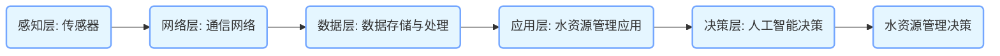

# 价值投资中的智能水资源管理技术趋势

> 关键词：价值投资、智能水资源管理、技术趋势、数据分析、物联网

> 摘要：本文聚焦于价值投资领域中智能水资源管理技术的发展趋势。首先介绍了智能水资源管理在价值投资背景下的重要性和意义，阐述了相关核心概念及其联系。接着深入探讨了核心算法原理和具体操作步骤，运用Python代码进行详细说明，同时给出了相关的数学模型和公式。通过实际项目案例展示了智能水资源管理技术的具体应用，分析了其在不同场景下的实际价值。最后推荐了学习该领域技术的资源、开发工具和相关论文著作，总结了未来发展趋势与挑战，并提供了常见问题解答和扩展阅读参考资料，旨在为投资者和技术人员提供全面的技术洞察和投资决策依据。

## 1. 背景介绍 
### 1.1 目的和范围
在当今全球面临水资源短缺和水污染问题日益严峻的背景下，智能水资源管理技术应运而生。本文章的目的是探讨在价值投资视角下，智能水资源管理技术的发展趋势。通过对相关技术的深入分析，为投资者提供有关该领域的投资价值评估依据，同时也为从事水资源管理的技术人员提供技术发展方向的参考。文章的范围涵盖了智能水资源管理的核心概念、算法原理、数学模型、实际应用案例以及相关的学习资源和工具等方面。

### 1.2 预期读者
本文预期读者主要包括两类人群。一类是价值投资者，他们希望通过了解智能水资源管理技术的发展趋势，发现具有投资潜力的项目和企业，从而实现资产的增值。另一类是从事水资源管理、环境科学、信息技术等相关领域的技术人员和研究人员，他们可以从文章中获取最新的技术信息和发展动态，为自己的工作和研究提供参考。

### 1.3 文档结构概述
本文共分为十个部分。第一部分是背景介绍，阐述了文章的目的、预期读者和文档结构概述，并给出了相关术语的定义。第二部分介绍了智能水资源管理的核心概念及其联系，通过文本示意图和Mermaid流程图进行直观展示。第三部分详细讲解了核心算法原理和具体操作步骤，结合Python源代码进行说明。第四部分给出了相关的数学模型和公式，并进行详细讲解和举例说明。第五部分通过实际项目案例，展示了智能水资源管理技术的具体实现和应用。第六部分分析了智能水资源管理技术的实际应用场景。第七部分推荐了学习该领域技术的资源、开发工具和相关论文著作。第八部分总结了未来发展趋势与挑战。第九部分是附录，提供了常见问题的解答。第十部分列出了扩展阅读和参考资料。

### 1.4 术语表
#### 1.4.1 核心术语定义
- **价值投资**：一种投资策略，投资者通过分析资产的内在价值，寻找被低估的投资机会，以实现长期的资本增值。
- **智能水资源管理**：利用先进的信息技术，如物联网、大数据、人工智能等，对水资源的开发、利用、保护和调配进行全面、实时、高效的管理。
- **物联网（IoT）**：通过各种信息传感器、射频识别技术、全球定位系统等各种装置与技术，实时采集任何需要监控、连接、互动的物体或过程，采集其声、光、热、电、力学、化学、生物、位置等各种需要的信息，通过各类可能的网络接入，实现物与物、物与人的泛在连接，实现对物品和过程的智能化感知、识别和管理。
- **大数据**：指无法在一定时间范围内用常规软件工具进行捕捉、管理和处理的数据集合，是需要新处理模式才能具有更强的决策力、洞察发现力和流程优化能力的海量、高增长率和多样化的信息资产。
- **人工智能（AI）**：研究、开发用于模拟、延伸和扩展人的智能的理论、方法、技术及应用系统的一门新的技术科学。

#### 1.4.2 相关概念解释
- **水资源监测**：对水资源的数量、质量、水位、流量等参数进行实时监测和数据采集，为水资源管理提供基础数据。
- **水资源调度**：根据水资源的供需情况和水资源监测数据，对水资源进行合理调配，以满足不同用户的用水需求。
- **水质预测**：利用历史水质数据和相关环境因素，对未来水质变化趋势进行预测，为水资源保护和污染治理提供决策依据。

#### 1.4.3 缩略词列表
- **IoT**：Internet of Things（物联网）
- **AI**：Artificial Intelligence（人工智能）
- **ML**：Machine Learning（机器学习）
- **DL**：Deep Learning（深度学习）

## 2. 核心概念与联系 

### 核心概念原理
智能水资源管理主要基于物联网、大数据和人工智能等技术，实现对水资源的全面、实时、高效管理。其核心原理如下：
- **物联网感知**：通过在水资源系统中部署大量的传感器，如水位传感器、流量传感器、水质传感器等，实时采集水资源的各种参数信息，并将这些信息通过无线通信网络传输到数据中心。
- **大数据处理**：数据中心对采集到的大量水资源数据进行存储、清洗、分析和挖掘，提取有价值的信息和知识，为水资源管理决策提供支持。
- **人工智能决策**：利用机器学习、深度学习等人工智能技术，对水资源数据进行建模和分析，预测水资源的变化趋势，优化水资源调度方案，实现水资源的智能管理和决策。

### 架构的文本示意图
智能水资源管理系统的架构主要包括以下几个层次：
- **感知层**：由各种传感器组成，负责实时采集水资源的各种参数信息。
- **网络层**：负责将感知层采集到的数据传输到数据中心，包括无线通信网络、有线通信网络等。
- **数据层**：负责对采集到的大量水资源数据进行存储、管理和处理，包括数据库、数据仓库等。
- **应用层**：根据不同的应用需求，开发各种水资源管理应用系统，如水资源监测系统、水资源调度系统、水质预测系统等。
- **决策层**：利用人工智能技术对水资源数据进行分析和决策，为水资源管理提供科学依据。

### Mermaid 流程图


## 3. 核心算法原理 & 具体操作步骤 

### 核心算法原理
在智能水资源管理中，常用的核心算法包括机器学习算法和深度学习算法，如线性回归、决策树、神经网络等。下面以线性回归算法为例，介绍其原理和应用。

线性回归是一种用于建立自变量和因变量之间线性关系的统计模型。其基本形式为：
$$y = \beta_0 + \beta_1x_1 + \beta_2x_2 + \cdots + \beta_nx_n + \epsilon$$
其中，$y$ 是因变量，$x_1, x_2, \cdots, x_n$ 是自变量，$\beta_0, \beta_1, \cdots, \beta_n$ 是模型的参数，$\epsilon$ 是误差项。

线性回归的目标是通过最小化误差项的平方和，即最小化以下损失函数：
$$L(\beta) = \sum_{i=1}^{m}(y_i - \hat{y}_i)^2 = \sum_{i=1}^{m}(y_i - (\beta_0 + \beta_1x_{i1} + \beta_2x_{i2} + \cdots + \beta_nx_{in}))^2$$
其中，$m$ 是样本数量，$y_i$ 是第 $i$ 个样本的真实值，$\hat{y}_i$ 是第 $i$ 个样本的预测值。

### 具体操作步骤
下面是使用Python实现线性回归算法的具体操作步骤：

```python
import numpy as np
from sklearn.linear_model import LinearRegression
from sklearn.model_selection import train_test_split
from sklearn.metrics import mean_squared_error

# 生成示例数据
np.random.seed(0)
X = 2 * np.random.rand(100, 1)
y = 4 + 3 * X + np.random.randn(100, 1)

# 划分训练集和测试集
X_train, X_test, y_train, y_test = train_test_split(X, y, test_size=0.2, random_state=42)

# 创建线性回归模型
model = LinearRegression()

# 训练模型
model.fit(X_train, y_train)

# 预测
y_pred = model.predict(X_test)

# 计算均方误差
mse = mean_squared_error(y_test, y_pred)
print(f"均方误差: {mse}")

# 输出模型参数
print(f"截距: {model.intercept_}")
print(f"斜率: {model.coef_}")
```

### 代码解释
1. **数据生成**：使用 `np.random.rand` 生成自变量 $X$，并根据线性关系生成因变量 $y$，同时添加了一些随机噪声。
2. **数据划分**：使用 `train_test_split` 函数将数据划分为训练集和测试集，测试集占总数据的 20%。
3. **模型创建**：创建一个 `LinearRegression` 模型对象。
4. **模型训练**：使用 `fit` 方法对模型进行训练，传入训练集的自变量和因变量。
5. **模型预测**：使用 `predict` 方法对测试集进行预测，得到预测值。
6. **误差计算**：使用 `mean_squared_error` 函数计算预测值和真实值之间的均方误差。
7. **参数输出**：输出模型的截距和斜率。

## 4. 数学模型和公式 & 详细讲解 & 举例说明 

### 线性回归模型
线性回归模型的数学表达式为：
$$y = \beta_0 + \beta_1x_1 + \beta_2x_2 + \cdots + \beta_nx_n + \epsilon$$
其中，$y$ 是因变量，$x_1, x_2, \cdots, x_n$ 是自变量，$\beta_0, \beta_1, \cdots, \beta_n$ 是模型的参数，$\epsilon$ 是误差项。

### 最小二乘法
线性回归模型的参数可以通过最小二乘法来估计。最小二乘法的目标是最小化误差项的平方和，即最小化以下损失函数：
$$L(\beta) = \sum_{i=1}^{m}(y_i - \hat{y}_i)^2 = \sum_{i=1}^{m}(y_i - (\beta_0 + \beta_1x_{i1} + \beta_2x_{i2} + \cdots + \beta_nx_{in}))^2$$
其中，$m$ 是样本数量，$y_i$ 是第 $i$ 个样本的真实值，$\hat{y}_i$ 是第 $i$ 个样本的预测值。

为了求解最小化损失函数的参数 $\beta$，可以对 $L(\beta)$ 求偏导数，并令其等于 0，得到以下正规方程：
$$(X^TX)\beta = X^Ty$$
其中，$X$ 是自变量矩阵，$y$ 是因变量向量。

通过求解正规方程，可以得到参数 $\beta$ 的估计值：
$$\hat{\beta} = (X^TX)^{-1}X^Ty$$

### 举例说明
假设我们有以下一组数据：
| $x$ | $y$ |
| --- | --- |
| 1 | 3 |
| 2 | 5 |
| 3 | 7 |
| 4 | 9 |

我们可以使用线性回归模型来拟合这组数据。首先，将数据表示为矩阵形式：
$$X = \begin{bmatrix}
1 & 1 \\
1 & 2 \\
1 & 3 \\
1 & 4
\end{bmatrix}, y = \begin{bmatrix}
3 \\
5 \\
7 \\
9
\end{bmatrix}$$

然后，计算 $X^TX$ 和 $X^Ty$：
$$X^TX = \begin{bmatrix}
4 & 10 \\
10 & 30
\end{bmatrix}, X^Ty = \begin{bmatrix}
24 \\
70
\end{bmatrix}$$

接着，求解正规方程 $(X^TX)\beta = X^Ty$，得到参数 $\beta$ 的估计值：
$$\hat{\beta} = (X^TX)^{-1}X^Ty = \begin{bmatrix}
1 \\
2
\end{bmatrix}$$

因此，线性回归模型的表达式为 $y = 1 + 2x$。

## 5. 项目实战：代码实际案例和详细解释说明 

### 5.1  开发环境搭建
在进行智能水资源管理项目实战之前，需要搭建相应的开发环境。以下是具体的搭建步骤：

#### 安装Python
Python是一种广泛使用的编程语言，在数据处理、机器学习等领域有很多优秀的库和工具。可以从Python官方网站（https://www.python.org/downloads/）下载并安装Python 3.x版本。

#### 安装必要的库
在智能水资源管理项目中，需要使用一些常用的Python库，如 `numpy`、`pandas`、`scikit-learn`、`matplotlib` 等。可以使用以下命令来安装这些库：
```sh
pip install numpy pandas scikit-learn matplotlib
```

#### 安装开发工具
可以选择使用集成开发环境（IDE）来进行项目开发，如PyCharm、Jupyter Notebook等。这些工具可以提供代码编辑、调试、运行等功能，提高开发效率。

### 5.2  源代码详细实现和代码解读
下面是一个简单的智能水资源管理项目的源代码示例，该项目使用线性回归模型来预测水资源的需求：

```python
import numpy as np
import pandas as pd
from sklearn.linear_model import LinearRegression
from sklearn.model_selection import train_test_split
from sklearn.metrics import mean_squared_error
import matplotlib.pyplot as plt

# 读取数据
data = pd.read_csv('water_demand.csv')

# 提取自变量和因变量
X = data[['population', 'temperature']].values
y = data['water_demand'].values

# 划分训练集和测试集
X_train, X_test, y_train, y_test = train_test_split(X, y, test_size=0.2, random_state=42)

# 创建线性回归模型
model = LinearRegression()

# 训练模型
model.fit(X_train, y_train)

# 预测
y_pred = model.predict(X_test)

# 计算均方误差
mse = mean_squared_error(y_test, y_pred)
print(f"均方误差: {mse}")

# 输出模型参数
print(f"截距: {model.intercept_}")
print(f"斜率: {model.coef_}")

# 可视化预测结果
plt.scatter(y_test, y_pred)
plt.xlabel('真实值')
plt.ylabel('预测值')
plt.title('水资源需求预测结果')
plt.show()
```

### 代码解读与分析
1. **数据读取**：使用 `pandas` 库的 `read_csv` 函数读取存储在 `water_demand.csv` 文件中的水资源需求数据。
2. **数据提取**：从数据中提取自变量（人口和温度）和因变量（水资源需求），并将其转换为 `numpy` 数组。
3. **数据划分**：使用 `train_test_split` 函数将数据划分为训练集和测试集，测试集占总数据的 20%。
4. **模型创建**：创建一个 `LinearRegression` 模型对象。
5. **模型训练**：使用 `fit` 方法对模型进行训练，传入训练集的自变量和因变量。
6. **模型预测**：使用 `predict` 方法对测试集进行预测，得到预测值。
7. **误差计算**：使用 `mean_squared_error` 函数计算预测值和真实值之间的均方误差。
8. **参数输出**：输出模型的截距和斜率。
9. **可视化**：使用 `matplotlib` 库绘制散点图，展示预测值和真实值之间的关系。

## 6. 实际应用场景 
智能水资源管理技术在多个实际应用场景中具有重要的价值，以下是一些常见的应用场景：

### 水资源监测与预警
通过在河流、湖泊、水库等水域部署大量的传感器，实时监测水位、流量、水质等参数。一旦发现水质超标、水位异常等情况，系统可以及时发出预警，通知相关部门采取措施，保障水资源的安全和合理利用。

### 水资源调度与分配
根据水资源的供需情况和实时监测数据，利用智能算法优化水资源的调度方案。例如，在干旱地区，可以通过合理调配水资源，确保农业灌溉、工业生产和居民生活的用水需求；在水资源丰富的地区，可以将多余的水资源储存起来，以备不时之需。

### 污水处理与回用
利用智能传感器和监测系统，实时监测污水处理过程中的各项指标，如化学需氧量（COD）、生化需氧量（BOD）、氨氮等。通过数据分析和优化控制，提高污水处理效率，降低处理成本。同时，将处理后的中水进行回用，用于农业灌溉、工业冷却等领域，实现水资源的循环利用。

### 城市水系统管理
在城市中，智能水资源管理技术可以应用于城市供水、排水、雨水收集等系统的管理。通过实时监测和分析城市水系统的运行数据，优化供水管道的布局和调度，提高城市排水系统的排水能力，减少城市内涝的发生。同时，利用雨水收集系统，将雨水收集起来进行处理和回用，缓解城市水资源短缺的问题。

## 7. 工具和资源推荐
### 7.1 学习资源推荐
#### 7.1.1 书籍推荐
- 《Python数据分析实战》：本书介绍了使用Python进行数据分析的基本方法和技巧，包括数据获取、数据清洗、数据分析和数据可视化等方面的内容。
- 《机器学习实战》：本书通过大量的实例，介绍了机器学习的基本算法和应用，包括分类算法、回归算法、聚类算法等。
- 《深度学习》：本书是深度学习领域的经典著作，详细介绍了深度学习的基本原理、算法和应用，适合有一定机器学习基础的读者阅读。

#### 7.1.2 在线课程
- Coursera上的“机器学习”课程：由斯坦福大学教授Andrew Ng主讲，是机器学习领域的经典课程，介绍了机器学习的基本概念、算法和应用。
- edX上的“深度学习”课程：由微软和伯克利大学联合开设，介绍了深度学习的基本原理、算法和应用，包括神经网络、卷积神经网络、循环神经网络等。
- 中国大学MOOC上的“Python语言程序设计”课程：由北京理工大学教授嵩天主讲，介绍了Python语言的基本语法、数据结构、函数和面向对象编程等方面的内容。

#### 7.1.3 技术博客和网站
- Medium：是一个知名的技术博客平台，上面有很多关于机器学习、人工智能、数据分析等领域的优秀文章。
- Kaggle：是一个数据科学竞赛平台，上面有很多关于数据分析、机器学习、深度学习等领域的数据集和竞赛项目，可以通过参加竞赛来提高自己的技术水平。
- 开源中国：是一个国内知名的开源技术社区，上面有很多关于开源项目、技术文章、技术论坛等方面的内容，可以了解到最新的技术动态和发展趋势。

### 7.2 开发工具框架推荐
#### 7.2.1 IDE和编辑器
- PyCharm：是一款专门为Python开发设计的集成开发环境，具有代码编辑、调试、运行、代码分析等功能，适合专业的Python开发者使用。
- Jupyter Notebook：是一个基于Web的交互式开发环境，可以在浏览器中编写和运行Python代码，同时支持代码、文本、图片、公式等多种格式的展示，适合数据科学家和机器学习工程师使用。
- Visual Studio Code：是一款轻量级的代码编辑器，支持多种编程语言和插件扩展，具有代码编辑、调试、版本控制等功能，适合初学者和小型项目的开发。

#### 7.2.2 调试和性能分析工具
- Py-Spy：是一个用于Python程序性能分析的工具，可以实时监测Python程序的CPU使用率、内存使用率等指标，帮助开发者找出程序中的性能瓶颈。
- PDB：是Python自带的调试工具，可以在代码中设置断点，单步执行代码，查看变量的值等，帮助开发者调试程序。
- Memory Profiler：是一个用于Python程序内存分析的工具，可以分析Python程序中各个函数和变量的内存使用情况，帮助开发者找出内存泄漏的问题。

#### 7.2.3 相关框架和库
- NumPy：是Python中用于科学计算的基础库，提供了多维数组对象和各种数学函数，是其他科学计算库的基础。
- Pandas：是Python中用于数据处理和分析的库，提供了数据结构和数据操作工具，如DataFrame和Series等，方便开发者进行数据清洗、数据分析和数据可视化等操作。
- Scikit-learn：是Python中用于机器学习的库，提供了各种机器学习算法和工具，如分类算法、回归算法、聚类算法等，方便开发者进行机器学习模型的开发和训练。
- TensorFlow：是Google开发的一个开源深度学习框架，提供了各种深度学习模型和工具，如神经网络、卷积神经网络、循环神经网络等，方便开发者进行深度学习模型的开发和训练。

### 7.3 相关论文著作推荐
#### 7.3.1 经典论文
- 《Gradient-Based Learning Applied to Document Recognition》：这篇论文是深度学习领域的经典论文之一，介绍了卷积神经网络（CNN）在图像识别中的应用，为后来的深度学习发展奠定了基础。
- 《Long Short-Term Memory》：这篇论文介绍了长短期记忆网络（LSTM）的基本原理和应用，LSTM是一种特殊的循环神经网络（RNN），可以有效地解决RNN中的梯度消失和梯度爆炸问题，在自然语言处理和时间序列分析等领域有广泛的应用。
- 《Deep Residual Learning for Image Recognition》：这篇论文介绍了残差网络（ResNet）的基本原理和应用，ResNet是一种深度卷积神经网络，可以有效地解决深度神经网络中的梯度消失和梯度爆炸问题，在图像识别领域取得了很好的效果。

#### 7.3.2 最新研究成果
- 《Attention Is All You Need》：这篇论文介绍了Transformer模型的基本原理和应用，Transformer是一种基于注意力机制的深度学习模型，在自然语言处理领域取得了很好的效果，如机器翻译、文本生成等。
- 《Generative Adversarial Networks》：这篇论文介绍了生成对抗网络（GAN）的基本原理和应用，GAN是一种由生成器和判别器组成的深度学习模型，可以用于图像生成、数据增强等领域。
- 《Graph Neural Networks: A Review of Methods and Applications》：这篇论文介绍了图神经网络（GNN）的基本原理和应用，GNN是一种用于处理图结构数据的深度学习模型，在社交网络分析、推荐系统等领域有广泛的应用。

#### 7.3.3 应用案例分析
- 《Smart Water Management Using Internet of Things and Machine Learning》：这篇论文介绍了如何利用物联网和机器学习技术实现智能水资源管理，包括水资源监测、水资源调度、水质预测等方面的内容。
- 《Application of Deep Learning in Water Quality Prediction》：这篇论文介绍了如何利用深度学习技术进行水质预测，包括卷积神经网络、循环神经网络等模型的应用。
- 《A Data-Driven Approach for Optimal Water Allocation in Irrigation Systems》：这篇论文介绍了如何利用数据驱动的方法优化灌溉系统中的水资源分配，提高水资源的利用效率。

## 8. 总结：未来发展趋势与挑战
### 未来发展趋势
- **多技术融合**：智能水资源管理将与物联网、大数据、人工智能、区块链等技术深度融合，实现水资源管理的智能化、自动化和精细化。
- **跨领域合作**：智能水资源管理将涉及水利、环境、计算机、数学等多个领域的知识和技术，需要跨领域的合作和协同创新。
- **可持续发展**：智能水资源管理将更加注重水资源的可持续利用和保护，推动水资源管理向绿色、低碳、循环的方向发展。
- **全球化发展**：随着全球水资源问题的日益严峻，智能水资源管理技术将在全球范围内得到广泛应用和推广，促进全球水资源的合理利用和保护。

### 挑战
- **数据质量和安全**：智能水资源管理需要大量的水资源数据作为支撑，但是数据的质量和安全问题是一个挑战。数据可能存在噪声、缺失值等问题，同时数据的安全和隐私保护也需要得到重视。
- **算法复杂度和可解释性**：智能水资源管理中使用的机器学习和深度学习算法往往比较复杂，算法的可解释性较差，这给实际应用带来了一定的困难。需要开发更加简单、高效、可解释的算法。
- **技术标准和规范**：智能水资源管理领域缺乏统一的技术标准和规范，不同的系统和设备之间可能存在兼容性问题，这给系统的集成和应用带来了一定的困难。需要制定统一的技术标准和规范。
- **人才短缺**：智能水资源管理是一个新兴的领域，需要既懂水资源管理又懂信息技术的复合型人才。目前，该领域的人才短缺问题比较严重，需要加强人才培养和引进。

## 9. 附录：常见问题与解答
### 1. 智能水资源管理技术的投资回报率如何？
智能水资源管理技术的投资回报率受到多种因素的影响，如项目规模、技术应用效果、水资源价格等。一般来说，通过智能水资源管理技术可以提高水资源的利用效率，降低水资源的浪费和损耗，从而节省水资源成本。同时，还可以减少水污染和水灾害的发生，降低社会和环境成本。因此，从长期来看，智能水资源管理技术的投资回报率是比较可观的。

### 2. 智能水资源管理技术对数据的要求高吗？
智能水资源管理技术对数据的要求比较高。需要大量的水资源数据作为支撑，包括水位、流量、水质、气象等方面的数据。同时，数据的质量也非常重要，数据需要准确、完整、及时。如果数据存在噪声、缺失值等问题，会影响模型的训练和预测效果。

### 3. 智能水资源管理技术可以应用于哪些行业？
智能水资源管理技术可以应用于多个行业，如水利、农业、工业、城市供水、污水处理等。在水利行业，可以用于水资源监测、水资源调度、水灾害预警等方面；在农业行业，可以用于农田灌溉、水资源优化配置等方面；在工业行业，可以用于工业用水管理、废水处理等方面；在城市供水行业，可以用于城市供水系统的优化调度、漏损检测等方面；在污水处理行业，可以用于污水处理过程的监测和控制、中水回用等方面。

### 4. 如何选择适合的智能水资源管理技术？
选择适合的智能水资源管理技术需要考虑多个因素，如项目需求、技术成熟度、投资成本、实施难度等。首先，需要明确项目的需求和目标，确定需要解决的问题。然后，对市场上的各种智能水资源管理技术进行调研和分析，了解其技术原理、应用案例、优缺点等。最后，根据项目的实际情况和自身的经济实力，选择适合的智能水资源管理技术。

## 10. 扩展阅读 & 参考资料
### 扩展阅读
- 《智能水利》：本书介绍了智能水利的基本概念、技术体系和应用案例，对智能水资源管理技术有更深入的探讨。
- 《水资源管理学》：本书介绍了水资源管理的基本理论、方法和技术，对理解智能水资源管理的背景和意义有很大的帮助。
- 《人工智能在水资源领域的应用》：本书介绍了人工智能技术在水资源监测、水资源调度、水质预测等方面的应用，对智能水资源管理技术的应用有更具体的案例分析。

### 参考资料
- [1] 《Python数据分析实战》，作者：徐子涵，出版社：机械工业出版社
- [2] 《机器学习实战》，作者：Peter Harrington，出版社：人民邮电出版社
- [3] 《深度学习》，作者：Ian Goodfellow、Yoshua Bengio、Aaron Courville，出版社：人民邮电出版社
- [4] 《Gradient-Based Learning Applied to Document Recognition》，作者：Yann LeCun、Léon Bottou、Yoshua Bengio、Patrick Haffner
- [5] 《Long Short-Term Memory》，作者：Sepp Hochreiter、Jürgen Schmidhuber
- [6] 《Deep Residual Learning for Image Recognition》，作者：Kaiming He、Xiangyu Zhang、Shaoqing Ren、Jian Sun
- [7] 《Attention Is All You Need》，作者：Ashish Vaswani、Noam Shazeer、Niki Parmar等
- [8] 《Generative Adversarial Networks》，作者：Ian J. Goodfellow、Jean Pouget-Abadie、Mehdi Mirza等
- [9] 《Graph Neural Networks: A Review of Methods and Applications》，作者：Jie Zhou、Ganqu Cui、Siyuan Hu等
- [10] 《Smart Water Management Using Internet of Things and Machine Learning》，作者：Muhammad Aamir Iqbal、Muhammad Bilal、Muhammad Zubair等

作者：AI天才研究院/AI Genius Institute & 禅与计算机程序设计艺术 /Zen And The Art of Computer Programming