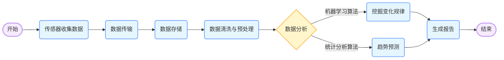

# 价值投资中的智能海洋环境监测系统分析

> 关键词：价值投资、智能海洋环境监测系统、数据分析、传感器技术、投资回报

> 摘要：本文聚焦于价值投资视角下的智能海洋环境监测系统。首先介绍智能海洋环境监测系统的背景，包括其目的、适用读者、文档结构及相关术语。接着阐述核心概念与联系，涵盖系统的原理和架构，并给出相应的示意图和流程图。详细讲解核心算法原理与操作步骤，用 Python 代码进行说明。通过数学模型和公式进一步剖析系统，并举例加深理解。通过项目实战，展示开发环境搭建、源代码实现及解读。探讨系统在实际中的应用场景，推荐学习资源、开发工具框架和相关论文著作。最后总结系统未来发展趋势与挑战，解答常见问题，并提供扩展阅读与参考资料，旨在为价值投资者提供全面深入的分析。

## 1. 背景介绍 
### 1.1 目的和范围
智能海洋环境监测系统在当今海洋研究、海洋经济发展以及海洋生态保护等方面具有至关重要的作用。本分析的目的在于从价值投资的角度深入探讨该系统，评估其在市场中的投资价值和潜力。范围涵盖智能海洋环境监测系统的技术原理、应用场景、市场前景、投资回报等多个方面，旨在为投资者提供全面、科学的决策依据。

### 1.2 预期读者
本文预期读者主要包括对价值投资感兴趣的个人投资者、投资机构的专业分析师、海洋环境监测领域的科研人员以及相关企业的决策者。个人投资者可以通过本文了解智能海洋环境监测系统的投资机会，投资机构分析师可获取系统的详细信息用于投资策略制定，科研人员能从技术层面得到新的启发，企业决策者则可以参考本文的分析来规划企业的发展方向。

### 1.3 文档结构概述
本文将按照以下结构展开：首先介绍智能海洋环境监测系统的核心概念与联系，包括其原理和架构；接着阐述核心算法原理和具体操作步骤，并用 Python 代码详细说明；然后介绍相关的数学模型和公式，并举例说明；通过项目实战展示系统的实际开发过程；探讨系统的实际应用场景；推荐学习该系统相关的工具和资源；总结系统未来的发展趋势与挑战；在附录中解答常见问题；最后提供扩展阅读和参考资料。

### 1.4 术语表
#### 1.4.1 核心术语定义
- **智能海洋环境监测系统**：利用先进的传感器技术、数据通信技术和数据分析算法，对海洋环境的各种参数进行实时、自动监测和分析的系统。
- **价值投资**：一种基于对资产内在价值的评估，通过长期持有低估资产以获取投资回报的投资策略。
- **传感器网络**：由大量分布在海洋中的传感器节点组成的网络，用于收集海洋环境数据。
- **数据融合**：将来自多个传感器的数据进行综合处理，以提高数据的准确性和可靠性。

#### 1.4.2 相关概念解释
- **海洋环境参数**：包括海水温度、盐度、酸碱度、溶解氧、叶绿素含量等，这些参数反映了海洋的物理、化学和生物特性。
- **实时监测**：对海洋环境参数进行连续、不间断的监测，以便及时发现环境变化。
- **数据分析算法**：用于处理和分析海洋环境数据的算法，如机器学习算法、统计分析算法等。

#### 1.4.3 缩略词列表
- **IoT**：Internet of Things，物联网
- **AI**：Artificial Intelligence，人工智能
- **ML**：Machine Learning，机器学习
- **GIS**：Geographic Information System，地理信息系统

## 2. 核心概念与联系 
### 核心概念原理
智能海洋环境监测系统的核心原理是通过分布在海洋中的各种传感器收集海洋环境数据，这些传感器可以实时感知海水的温度、盐度、酸碱度等参数。传感器将收集到的数据通过无线通信网络传输到数据中心，数据中心对这些数据进行存储、处理和分析。在处理过程中，会运用到数据融合技术，将多个传感器的数据进行综合，以提高数据的准确性和可靠性。同时，利用数据分析算法，如机器学习算法，对数据进行挖掘和分析，以发现海洋环境的变化规律和趋势。

### 架构的文本示意图
智能海洋环境监测系统主要由以下几个部分组成：
- **传感器层**：包括各种类型的传感器，如温度传感器、盐度传感器、溶解氧传感器等，分布在海洋的不同位置，负责收集海洋环境数据。
- **数据传输层**：采用无线通信技术，如卫星通信、水声通信等，将传感器收集到的数据传输到数据中心。
- **数据处理层**：对传输过来的数据进行存储、清洗、预处理和分析，运用数据融合和数据分析算法。
- **应用层**：为用户提供各种服务，如海洋环境预报、海洋生态评估、海洋灾害预警等。

### Mermaid 流程图


## 3. 核心算法原理 & 具体操作步骤 
### 核心算法原理
在智能海洋环境监测系统中，常用的核心算法包括数据融合算法和机器学习算法。

#### 数据融合算法
数据融合算法的目的是将来自多个传感器的数据进行综合处理，以提高数据的准确性和可靠性。常见的数据融合算法有加权平均法、卡尔曼滤波法等。以加权平均法为例，假设我们有 $n$ 个传感器对同一海洋环境参数进行测量，测量值分别为 $x_1, x_2, \cdots, x_n$，对应的权重分别为 $w_1, w_2, \cdots, w_n$，则融合后的测量值 $x$ 为：
$$x = \frac{\sum_{i=1}^{n} w_i x_i}{\sum_{i=1}^{n} w_i}$$

#### 机器学习算法
机器学习算法可以用于对海洋环境数据进行分类、预测等。以决策树算法为例，决策树是一种基于树结构进行决策的算法，它通过对数据的特征进行分析，构建一个决策树模型，用于对新的数据进行分类或预测。

### 具体操作步骤
#### 数据收集
使用各种传感器收集海洋环境数据，确保数据的准确性和完整性。

#### 数据传输
将收集到的数据通过无线通信网络传输到数据中心。

#### 数据预处理
对传输过来的数据进行清洗，去除噪声和异常值，然后进行归一化处理，使数据具有可比性。

#### 数据融合
使用数据融合算法对多个传感器的数据进行融合，得到更准确的测量值。

#### 机器学习建模
使用机器学习算法对融合后的数据进行建模，训练模型以发现海洋环境的变化规律和趋势。

#### 模型评估与优化
使用测试数据对训练好的模型进行评估，根据评估结果对模型进行优化。

### Python 代码实现
```python
import numpy as np
from sklearn.tree import DecisionTreeClassifier
from sklearn.model_selection import train_test_split
from sklearn.metrics import accuracy_score

# 模拟传感器数据
sensor_data_1 = np.random.rand(100, 5)  # 传感器 1 的数据
sensor_data_2 = np.random.rand(100, 5)  # 传感器 2 的数据

# 数据融合（加权平均法）
weights = [0.6, 0.4]
fused_data = weights[0] * sensor_data_1 + weights[1] * sensor_data_2

# 模拟标签数据
labels = np.random.randint(0, 2, 100)

# 划分训练集和测试集
X_train, X_test, y_train, y_test = train_test_split(fused_data, labels, test_size=0.2, random_state=42)

# 构建决策树模型
model = DecisionTreeClassifier()

# 训练模型
model.fit(X_train, y_train)

# 预测
y_pred = model.predict(X_test)

# 评估模型
accuracy = accuracy_score(y_test, y_pred)
print(f"模型准确率: {accuracy}")
```

## 4. 数学模型和公式 & 详细讲解 & 举例说明 
### 数据融合数学模型
如前面所述，加权平均法的数据融合公式为：
$$x = \frac{\sum_{i=1}^{n} w_i x_i}{\sum_{i=1}^{n} w_i}$$
其中，$x_i$ 是第 $i$ 个传感器的测量值，$w_i$ 是第 $i$ 个传感器的权重。权重的选择通常根据传感器的可靠性、精度等因素来确定。

例如，假设有两个传感器对海水温度进行测量，传感器 1 的测量值为 $25^{\circ}C$，权重为 0.6，传感器 2 的测量值为 $26^{\circ}C$，权重为 0.4，则融合后的温度值为：
$$x = \frac{0.6 \times 25 + 0.4 \times 26}{0.6 + 0.4} = \frac{15 + 10.4}{1} = 25.4^{\circ}C$$

### 机器学习模型数学原理
以决策树算法为例，决策树的构建过程是基于信息增益的概念。信息增益是指在划分数据集前后信息熵的变化量，信息熵用于衡量数据的不确定性。

设数据集 $D$ 包含 $m$ 个样本，属于 $n$ 个不同的类别，第 $i$ 个类别的样本数为 $m_i$，则数据集 $D$ 的信息熵为：
$$H(D) = -\sum_{i=1}^{n} \frac{m_i}{m} \log_2 \frac{m_i}{m}$$

假设使用特征 $A$ 对数据集 $D$ 进行划分，将数据集 $D$ 划分为 $k$ 个子集 $D_1, D_2, \cdots, D_k$，每个子集 $D_j$ 包含的样本数为 $m_j$，则使用特征 $A$ 划分后的信息熵为：
$$H(D|A) = \sum_{j=1}^{k} \frac{m_j}{m} H(D_j)$$

信息增益为：
$$Gain(D, A) = H(D) - H(D|A)$$

决策树在构建过程中，会选择信息增益最大的特征进行划分，直到满足停止条件。

例如，假设有一个数据集包含 10 个样本，分为 2 个类别，其中类别 1 有 6 个样本，类别 2 有 4 个样本，则数据集的信息熵为：
$$H(D) = -\frac{6}{10} \log_2 \frac{6}{10} - \frac{4}{10} \log_2 \frac{4}{10} \approx 0.971$$

假设使用某个特征将数据集划分为两个子集，子集 1 包含 4 个样本，其中类别 1 有 3 个样本，类别 2 有 1 个样本；子集 2 包含 6 个样本，其中类别 1 有 3 个样本，类别 2 有 3 个样本。则子集 1 的信息熵为：
$$H(D_1) = -\frac{3}{4} \log_2 \frac{3}{4} - \frac{1}{4} \log_2 \frac{1}{4} \approx 0.811$$

子集 2 的信息熵为：
$$H(D_2) = -\frac{3}{6} \log_2 \frac{3}{6} - \frac{3}{6} \log_2 \frac{3}{6} = 1$$

使用该特征划分后的信息熵为：
$$H(D|A) = \frac{4}{10} \times 0.811 + \frac{6}{10} \times 1 \approx 0.924$$

信息增益为：
$$Gain(D, A) = 0.971 - 0.924 = 0.047$$

## 5. 项目实战：代码实际案例和详细解释说明 
### 5.1  开发环境搭建
#### 安装 Python
首先需要安装 Python 环境，建议使用 Python 3.7 及以上版本。可以从 Python 官方网站（https://www.python.org/downloads/）下载安装包，按照安装向导进行安装。

#### 安装必要的库
使用以下命令安装必要的 Python 库：
```sh
pip install numpy scikit-learn
```
`numpy` 用于数值计算，`scikit-learn` 提供了丰富的机器学习算法和工具。

### 5.2  源代码详细实现和代码解读
```python
import numpy as np
from sklearn.tree import DecisionTreeClassifier
from sklearn.model_selection import train_test_split
from sklearn.metrics import accuracy_score

# 模拟传感器数据
# 生成 100 个样本，每个样本有 5 个特征
sensor_data_1 = np.random.rand(100, 5)  
sensor_data_2 = np.random.rand(100, 5)  

# 数据融合（加权平均法）
weights = [0.6, 0.4]
# 按照加权平均的公式进行数据融合
fused_data = weights[0] * sensor_data_1 + weights[1] * sensor_data_2

# 模拟标签数据
# 随机生成 100 个 0 或 1 的标签
labels = np.random.randint(0, 2, 100)

# 划分训练集和测试集
# 将融合后的数据和标签按照 80:20 的比例划分为训练集和测试集
X_train, X_test, y_train, y_test = train_test_split(fused_data, labels, test_size=0.2, random_state=42)

# 构建决策树模型
# 创建一个决策树分类器对象
model = DecisionTreeClassifier()

# 训练模型
# 使用训练集的数据和标签对模型进行训练
model.fit(X_train, y_train)

# 预测
# 使用训练好的模型对测试集的数据进行预测
y_pred = model.predict(X_test)

# 评估模型
# 计算预测结果的准确率
accuracy = accuracy_score(y_test, y_pred)
print(f"模型准确率: {accuracy}")
```

### 5.3  代码解读与分析
- **数据模拟**：使用 `np.random.rand` 函数生成模拟的传感器数据，使用 `np.random.randint` 函数生成模拟的标签数据。
- **数据融合**：使用加权平均法对两个传感器的数据进行融合，得到更准确的测量值。
- **数据集划分**：使用 `train_test_split` 函数将融合后的数据和标签划分为训练集和测试集，以便对模型进行训练和评估。
- **模型构建与训练**：使用 `DecisionTreeClassifier` 构建决策树模型，并使用训练集的数据和标签对模型进行训练。
- **模型预测与评估**：使用训练好的模型对测试集的数据进行预测，使用 `accuracy_score` 函数计算预测结果的准确率。

## 6. 实际应用场景 
### 海洋生态保护
智能海洋环境监测系统可以实时监测海洋生态环境的变化，如海水温度、盐度、酸碱度等参数的变化。通过对这些数据的分析，可以及时发现海洋生态系统的异常情况，如赤潮、海洋污染等，为海洋生态保护提供科学依据。例如，当监测到海水温度异常升高时，可能预示着赤潮的发生，相关部门可以及时采取措施进行防范和治理。

### 海洋资源开发
在海洋石油、天然气等资源的开发过程中，智能海洋环境监测系统可以实时监测海洋环境的变化，确保开发活动的安全进行。例如，监测海水的流速、波浪高度等参数，为海洋平台的设计和运营提供参考。同时，通过对海洋生物资源的监测，可以合理规划渔业捕捞活动，实现海洋资源的可持续利用。

### 海洋灾害预警
智能海洋环境监测系统可以对海洋灾害进行实时监测和预警，如海啸、风暴潮等。通过对海洋环境数据的分析和预测，可以提前发出灾害预警，为沿海地区的居民和相关部门提供足够的时间进行防范和应对，减少灾害造成的损失。

### 海洋科学研究
智能海洋环境监测系统为海洋科学研究提供了大量的实时数据，有助于科学家深入了解海洋的物理、化学和生物特性，研究海洋环境的变化规律和趋势。例如，通过对长期的海洋温度数据进行分析，可以研究全球气候变化对海洋的影响。

## 7. 工具和资源推荐
### 7.1 学习资源推荐
#### 7.1.1 书籍推荐
- 《海洋环境监测技术》：全面介绍了海洋环境监测的各种技术和方法，包括传感器技术、数据采集与处理技术等。
- 《机器学习实战》：通过实际案例介绍了机器学习的各种算法和应用，有助于读者深入理解机器学习在智能海洋环境监测系统中的应用。
- 《Python 数据分析实战》：详细介绍了使用 Python 进行数据分析的方法和技巧，对于处理海洋环境数据非常有帮助。

#### 7.1.2 在线课程
- Coursera 上的“海洋科学导论”：该课程介绍了海洋科学的基本概念和研究方法，对于了解海洋环境监测的背景知识非常有帮助。
- edX 上的“机器学习基础”：系统地介绍了机器学习的基本理论和算法，适合初学者学习。
- 中国大学 MOOC 上的“Python 数据分析与可视化”：讲解了使用 Python 进行数据分析和可视化的方法，对于处理和展示海洋环境数据很有帮助。

#### 7.1.3 技术博客和网站
- 海洋在线（https://www.oceanol.com.cn/）：提供了丰富的海洋科学研究和海洋环境监测的相关信息。
- 博客园（https://www.cnblogs.com/）：有很多开发者分享的关于数据分析、机器学习等方面的技术文章，对于学习智能海洋环境监测系统的技术实现很有帮助。
- Medium（https://medium.com/）：有很多关于科技、数据科学等领域的文章，其中不乏关于智能海洋环境监测系统的最新研究成果和应用案例。

### 7.2 开发工具框架推荐
#### 7.2.1 IDE和编辑器
- PyCharm：一款专业的 Python 集成开发环境，提供了丰富的代码编辑、调试和项目管理功能，适合开发智能海洋环境监测系统的 Python 代码。
- Jupyter Notebook：一种交互式的开发环境，支持 Python 代码的编写、运行和可视化，非常适合进行数据分析和模型训练。

#### 7.2.2 调试和性能分析工具
- pdb：Python 自带的调试工具，可以帮助开发者定位代码中的问题。
- cProfile：Python 的性能分析工具，可以分析代码的运行时间和内存使用情况，帮助开发者优化代码性能。

#### 7.2.3 相关框架和库
- TensorFlow：一个开源的机器学习框架，提供了丰富的深度学习算法和工具，可用于构建复杂的海洋环境预测模型。
- Keras：一个高级神经网络 API，基于 TensorFlow 等后端，使用简单，适合快速搭建和训练机器学习模型。
- Pandas：一个强大的数据分析库，提供了数据结构和数据分析工具，方便处理和分析海洋环境数据。

### 7.3 相关论文著作推荐
#### 7.3.1 经典论文
- “A Survey on Sensor Networks”：该论文对传感器网络的基本概念、技术和应用进行了全面的综述，对于理解智能海洋环境监测系统中的传感器网络有很大的帮助。
- “Machine Learning in Oceanography”：介绍了机器学习在海洋学中的应用，包括海洋环境预测、海洋生物分类等方面。

#### 7.3.2 最新研究成果
- 关注 IEEE Journal of Oceanic Engineering、Journal of Marine Systems 等期刊，这些期刊经常发表关于智能海洋环境监测系统的最新研究成果。
- 参加相关的国际会议，如 Oceans Conference，了解智能海洋环境监测系统领域的最新研究动态。

#### 7.3.3 应用案例分析
- 研究一些实际的智能海洋环境监测系统项目案例，如欧洲的 Copernicus Marine Environment Monitoring Service（CMEMS），分析其系统架构、技术实现和应用效果，为自己的项目提供参考。

## 8. 总结：未来发展趋势与挑战
### 未来发展趋势
#### 多传感器融合技术的发展
未来的智能海洋环境监测系统将采用更多种类的传感器，如高分辨率的光学传感器、先进的声学传感器等，并将这些传感器的数据进行深度融合，以获取更全面、准确的海洋环境信息。

#### 人工智能技术的广泛应用
人工智能技术，如深度学习、强化学习等，将在智能海洋环境监测系统中得到更广泛的应用。通过人工智能算法，可以对海量的海洋环境数据进行更深入的分析和挖掘，实现更精准的海洋环境预测和预警。

#### 物联网与云计算的结合
智能海洋环境监测系统将与物联网和云计算技术紧密结合，实现传感器数据的实时传输和高效处理。通过云计算平台，可以存储和处理大量的海洋环境数据，并提供强大的计算能力支持复杂的数据分析和模型训练。

#### 系统的智能化和自动化
未来的智能海洋环境监测系统将更加智能化和自动化，能够自动调整监测策略、自动诊断故障，并自动生成决策建议。例如，当监测到海洋环境异常时，系统可以自动启动应急响应机制。

### 挑战
#### 数据传输与通信问题
海洋环境复杂，传感器与数据中心之间的通信面临着诸多挑战，如信号衰减、干扰等。如何实现稳定、高效的数据传输是一个亟待解决的问题。

#### 数据安全与隐私保护
智能海洋环境监测系统涉及大量的敏感数据，如海洋资源分布、海洋军事信息等。如何保障数据的安全和隐私，防止数据泄露和恶意攻击是一个重要的挑战。

#### 系统可靠性与维护
海洋环境恶劣，传感器和设备容易受到损坏和故障。如何提高系统的可靠性，降低维护成本，确保系统长期稳定运行是一个关键问题。

#### 跨学科人才短缺
智能海洋环境监测系统涉及海洋科学、传感器技术、计算机科学、数据分析等多个学科领域，需要具备跨学科知识和技能的人才。目前，这类人才相对短缺，制约了系统的发展。

## 9. 附录：常见问题与解答
### 智能海洋环境监测系统的成本高吗？
智能海洋环境监测系统的成本受到多种因素的影响，如传感器的类型和数量、数据传输方式、系统的规模等。一般来说，大规模、高精度的监测系统成本较高，但随着技术的发展和成本的降低，智能海洋环境监测系统的成本也在逐渐下降。同时，从长远来看，智能海洋环境监测系统带来的经济效益和社会效益远远超过其成本。

### 智能海洋环境监测系统的数据准确性如何保证？
为了保证数据的准确性，智能海洋环境监测系统采用了多种技术手段。首先，选用高精度、高可靠性的传感器，并对传感器进行定期校准和维护。其次，采用数据融合技术，将多个传感器的数据进行综合处理，提高数据的准确性和可靠性。此外，还会对数据进行质量控制和验证，去除噪声和异常值。

### 智能海洋环境监测系统的使用寿命有多长？
智能海洋环境监测系统的使用寿命受到多种因素的影响，如设备的质量、海洋环境的恶劣程度、维护情况等。一般来说，传感器的使用寿命在 3 - 5 年左右，其他设备的使用寿命可能更长。通过定期维护和更换损坏的设备，可以延长系统的使用寿命。

### 智能海洋环境监测系统对海洋生态有影响吗？
智能海洋环境监测系统本身对海洋生态的影响较小。传感器的安装和使用通常不会对海洋生物造成明显的伤害。然而，在系统的建设和维护过程中，可能会对海洋生态产生一定的影响，如施工过程中的噪声、废弃物排放等。因此，在建设和维护智能海洋环境监测系统时，需要采取相应的环保措施，减少对海洋生态的影响。

## 10. 扩展阅读 & 参考资料
### 扩展阅读
- 《海洋大数据》：深入介绍了海洋大数据的概念、处理方法和应用，对于理解智能海洋环境监测系统中的数据处理和分析有很大的帮助。
- 《人工智能与海洋科学》：探讨了人工智能在海洋科学各个领域的应用，包括海洋环境监测、海洋灾害预警等。

### 参考资料
- 传感器技术手册，详细介绍了各种传感器的原理、性能和应用。
- 相关的国家标准和行业规范，如海洋环境监测规范等，为智能海洋环境监测系统的设计和建设提供了标准和依据。

作者：AI天才研究院/AI Genius Institute & 禅与计算机程序设计艺术 /Zen And The Art of Computer Programming