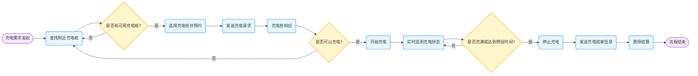

# 价值投资中的智能电动汽车充电网络分析

> 关键词：价值投资、智能电动汽车、充电网络、投资分析、市场趋势

> 摘要：本文聚焦于价值投资视角下的智能电动汽车充电网络。首先介绍了相关背景，包括研究目的、预期读者、文档结构和术语表。接着阐述了智能电动汽车充电网络的核心概念、联系及架构，深入分析了核心算法原理和具体操作步骤，给出了相关数学模型和公式并举例说明。通过项目实战展示了充电网络的代码实现和解读。探讨了智能电动汽车充电网络的实际应用场景，推荐了学习资源、开发工具框架和相关论文著作。最后总结了未来发展趋势与挑战，提供了常见问题解答和扩展阅读参考资料，旨在为价值投资者全面剖析智能电动汽车充电网络的投资价值和发展前景。

## 1. 背景介绍 
### 1.1 目的和范围
本研究的主要目的是从价值投资的角度对智能电动汽车充电网络进行全面分析。随着电动汽车市场的迅猛发展，充电网络作为其重要的基础设施，对于电动汽车的普及和推广起着关键作用。价值投资者关注的是资产的内在价值和长期增长潜力，因此分析智能电动汽车充电网络的投资价值、市场前景、技术发展趋势等方面具有重要意义。本研究的范围涵盖了智能电动汽车充电网络的各个方面，包括其技术原理、市场需求、商业模式、投资风险等。

### 1.2 预期读者
本文预期读者主要包括价值投资者、金融分析师、电动汽车行业从业者、技术研发人员以及对智能电动汽车充电网络感兴趣的相关人士。价值投资者可以通过本文了解充电网络的投资价值和潜在回报，为投资决策提供参考；金融分析师可以获取充电网络市场的详细信息，进行市场评估和预测；电动汽车行业从业者可以深入了解充电网络的技术和市场动态，为企业的战略规划提供支持；技术研发人员可以借鉴本文中的技术原理和算法，推动充电网络技术的创新和发展；对充电网络感兴趣的相关人士可以通过本文全面了解这一领域的知识和发展趋势。

### 1.3 文档结构概述
本文将按照以下结构进行阐述：首先介绍智能电动汽车充电网络的背景信息，包括研究目的、预期读者、文档结构和术语表；接着详细阐述核心概念与联系，包括充电网络的原理、架构和流程；然后深入分析核心算法原理和具体操作步骤，通过 Python 代码进行详细阐述；之后给出相关数学模型和公式，并通过举例说明其应用；再通过项目实战展示充电网络的代码实现和解读；探讨智能电动汽车充电网络的实际应用场景；推荐学习资源、开发工具框架和相关论文著作；最后总结未来发展趋势与挑战，提供常见问题解答和扩展阅读参考资料。

### 1.4 术语表
#### 1.4.1 核心术语定义
- **价值投资**：一种投资策略，通过对资产的内在价值进行评估，寻找被低估的资产进行投资，以获取长期的投资回报。
- **智能电动汽车**：具备智能化功能的电动汽车，能够实现自动驾驶、智能互联等功能。
- **充电网络**：由多个充电设施组成的网络，为电动汽车提供充电服务。
- **充电桩**：一种为电动汽车充电的设备，可分为交流充电桩和直流充电桩。
- **充电运营商**：负责运营和管理充电网络的企业或机构。

#### 1.4.2 相关概念解释
- **电动汽车渗透率**：指电动汽车在汽车市场中的占比，反映了电动汽车的普及程度。
- **充电负荷**：指充电设施在某一时刻所承担的充电功率。
- **峰谷电价**：电力部门根据不同时间段的用电需求，制定不同的电价政策，低谷时段电价较低，高峰时段电价较高。

#### 1.4.3 缩略词列表
- **EV**：Electric Vehicle，电动汽车
- **EVSE**：Electric Vehicle Supply Equipment，电动汽车供电设备，即充电桩
- **SOE**：State of Energy，电池剩余能量状态

## 2. 核心概念与联系 

### 2.1 智能电动汽车充电网络原理
智能电动汽车充电网络的核心原理是通过信息技术和通信技术，将充电桩、电动汽车和充电运营商的管理系统进行连接，实现充电过程的智能化管理和控制。具体来说，当电动汽车需要充电时，驾驶员可以通过手机 APP 或其他终端设备查找附近的充电桩，并进行预约和支付。充电桩接收到充电请求后，会与电动汽车进行通信，获取电池的状态信息，如剩余电量、充电需求等。然后，充电桩根据这些信息，调整充电参数，为电动汽车提供安全、高效的充电服务。同时，充电运营商的管理系统可以实时监控充电桩的运行状态、充电负荷、电量消耗等信息，进行远程控制和管理，实现资源的优化配置和高效利用。

### 2.2 智能电动汽车充电网络架构
智能电动汽车充电网络的架构主要包括以下几个部分：
- **充电桩层**：由分布在不同地理位置的充电桩组成，是直接为电动汽车提供充电服务的设备。充电桩可以分为交流充电桩和直流充电桩，交流充电桩功率相对较小，充电速度较慢，适用于家庭和公共停车场等场所；直流充电桩功率较大，充电速度快，适用于高速公路服务区、快速充电站等场所。
- **通信网络层**：负责充电桩与充电运营商管理系统之间的数据传输和通信。通信网络可以采用有线通信（如以太网、光纤等）或无线通信（如 GPRS、4G、5G 等）方式，确保数据的实时性和稳定性。
- **管理系统层**：是智能电动汽车充电网络的核心，负责对充电桩的运行状态、充电业务、用户信息等进行集中管理和控制。管理系统可以实现充电桩的远程监控、故障诊断、计费结算、用户管理等功能，为充电运营商提供决策支持和运营管理服务。
- **用户层**：包括电动汽车驾驶员和充电运营商的管理人员。驾驶员可以通过手机 APP 或其他终端设备查找充电桩、预约充电、支付费用等；管理人员可以通过管理系统对充电网络进行管理和维护。

### 2.3 智能电动汽车充电网络流程
智能电动汽车充电网络的工作流程主要包括以下几个步骤：
1. **充电需求发起**：电动汽车驾驶员通过手机 APP 或其他终端设备查找附近的充电桩，并选择合适的充电桩进行预约。
2. **充电请求发送**：驾驶员将充电请求发送到充电桩和充电运营商的管理系统。
3. **充电桩响应**：充电桩接收到充电请求后，与电动汽车进行通信，获取电池的状态信息，并判断是否可以进行充电。
4. **充电开始**：如果充电桩判断可以进行充电，则开始为电动汽车充电。在充电过程中，充电桩实时监测电池的状态信息和充电参数，并将这些信息反馈给管理系统。
5. **充电结束**：当电池充满电或达到预设的充电时间时，充电桩停止充电，并向管理系统发送充电结束信息。
6. **费用结算**：管理系统根据充电时间和电量消耗等信息，计算充电费用，并与驾驶员进行结算。

### 2.4 核心概念的 Mermaid 流程图


## 3. 核心算法原理 & 具体操作步骤 

### 3.1 充电调度算法原理
充电调度算法是智能电动汽车充电网络的核心算法之一，其主要目的是在满足电动汽车充电需求的前提下，优化充电资源的分配，降低充电成本，提高充电效率。常见的充电调度算法包括基于规则的调度算法、基于优化模型的调度算法和基于智能算法的调度算法。

#### 3.1.1 基于规则的调度算法
基于规则的调度算法是一种简单直观的调度方法，它根据预先设定的规则来分配充电资源。例如，可以根据充电桩的空闲状态、电动汽车的充电优先级等规则来决定哪个电动汽车先进行充电。以下是一个基于规则的充电调度算法的 Python 代码示例：

```python
# 定义充电桩类
class ChargingPile:
    def __init__(self, id, status="idle"):
        self.id = id
        self.status = status

    def start_charging(self):
        self.status = "charging"

    def stop_charging(self):
        self.status = "idle"

# 定义电动汽车类
class ElectricVehicle:
    def __init__(self, id, priority):
        self.id = id
        self.priority = priority

# 基于规则的充电调度算法
def rule_based_scheduling(charging_piles, electric_vehicles):
    for ev in electric_vehicles:
        for pile in charging_piles:
            if pile.status == "idle":
                pile.start_charging()
                print(f"电动汽车 {ev.id} 在充电桩 {pile.id} 开始充电")
                break

# 示例使用
charging_piles = [ChargingPile(1), ChargingPile(2), ChargingPile(3)]
electric_vehicles = [ElectricVehicle(1, 1), ElectricVehicle(2, 2), ElectricVehicle(3, 3)]

rule_based_scheduling(charging_piles, electric_vehicles)
```

#### 3.1.2 基于优化模型的调度算法
基于优化模型的调度算法是通过建立数学优化模型来求解最优的充电调度方案。常见的优化目标包括最小化充电成本、最大化充电效率等。以下是一个简单的基于线性规划的充电调度优化模型的 Python 代码示例，使用 `pulp` 库来求解：

```python
from pulp import LpMaximize, LpProblem, LpVariable

# 定义问题
prob = LpProblem("Charging_Scheduling", LpMaximize)

# 定义变量
# 假设有 3 个充电桩和 3 辆电动汽车
num_piles = 3
num_evs = 3
x = [[LpVariable(f"x_{i}_{j}", cat='Binary') for j in range(num_evs)] for i in range(num_piles)]

# 定义目标函数
# 假设每个充电组合有一个收益值
revenue = [[10, 20, 30], [40, 50, 60], [70, 80, 90]]
prob += sum(revenue[i][j] * x[i][j] for i in range(num_piles) for j in range(num_evs))

# 定义约束条件
# 每个充电桩最多同时为一辆电动汽车充电
for i in range(num_piles):
    prob += sum(x[i][j] for j in range(num_evs)) <= 1

# 每辆电动汽车最多只能在一个充电桩充电
for j in range(num_evs):
    prob += sum(x[i][j] for i in range(num_piles)) <= 1

# 求解问题
prob.solve()

# 输出结果
for i in range(num_piles):
    for j in range(num_evs):
        if x[i][j].value() == 1:
            print(f"电动汽车 {j + 1} 在充电桩 {i + 1} 充电")
```

#### 3.1.3 基于智能算法的调度算法
基于智能算法的调度算法是利用智能算法（如遗传算法、粒子群算法等）来搜索最优的充电调度方案。这些算法具有较强的全局搜索能力，能够在复杂的问题空间中找到较优的解。以下是一个简单的基于遗传算法的充电调度算法的 Python 代码示例，使用 `deap` 库来实现：

```python
import random
from deap import base, creator, tools

# 定义问题的参数
num_piles = 3
num_evs = 3

# 定义适应度函数和个体类型
creator.create("FitnessMax", base.Fitness, weights=(1.0,))
creator.create("Individual", list, fitness=creator.FitnessMax)

# 定义遗传算法的工具箱
toolbox = base.Toolbox()
toolbox.register("attr_bool", random.randint, 0, 1)
toolbox.register("individual", tools.initRepeat, creator.Individual, toolbox.attr_bool, num_piles * num_evs)
toolbox.register("population", tools.initRepeat, list, toolbox.individual)

# 定义适应度函数
def fitness(individual):
    revenue = [[10, 20, 30], [40, 50, 60], [70, 80, 90]]
    total_revenue = 0
    for i in range(num_piles):
        for j in range(num_evs):
            if individual[i * num_evs + j] == 1:
                total_revenue += revenue[i][j]
    return total_revenue,

toolbox.register("evaluate", fitness)
toolbox.register("mate", tools.cxTwoPoint)
toolbox.register("mutate", tools.mutFlipBit, indpb=0.05)
toolbox.register("select", tools.selTournament, tournsize=3)

# 初始化种群
pop = toolbox.population(n=50)

# 遗传算法的进化过程
NGEN = 40
for gen in range(NGEN):
    offspring = toolbox.select(pop, len(pop))
    offspring = list(map(toolbox.clone, offspring))

    for child1, child2 in zip(offspring[::2], offspring[1::2]):
        if random.random() < 0.5:
            toolbox.mate(child1, child2)
            del child1.fitness.values
            del child2.fitness.values

    for mutant in offspring:
        if random.random() < 0.2:
            toolbox.mutate(mutant)
            del mutant.fitness.values

    invalid_ind = [ind for ind in offspring if not ind.fitness.valid]
    fitnesses = map(toolbox.evaluate, invalid_ind)
    for ind, fit in zip(invalid_ind, fitnesses):
        ind.fitness.values = fit

    pop[:] = offspring

# 输出最优个体
best_ind = tools.selBest(pop, 1)[0]
for i in range(num_piles):
    for j in range(num_evs):
        if best_ind[i * num_evs + j] == 1:
            print(f"电动汽车 {j + 1} 在充电桩 {i + 1} 充电")
```

### 3.2 充电负荷预测算法原理
充电负荷预测算法是智能电动汽车充电网络的另一个重要算法，其主要目的是预测未来一段时间内的充电负荷，以便充电运营商提前做好资源调配和管理。常见的充电负荷预测算法包括时间序列分析方法、机器学习方法和深度学习方法。

#### 3.2.1 时间序列分析方法
时间序列分析方法是通过对历史充电负荷数据进行分析，建立时间序列模型来预测未来的充电负荷。常见的时间序列模型包括 ARIMA 模型、SARIMA 模型等。以下是一个使用 `statsmodels` 库实现的 ARIMA 模型进行充电负荷预测的 Python 代码示例：

```python
import pandas as pd
from statsmodels.tsa.arima.model import ARIMA

# 生成示例数据
data = [10, 20, 30, 40, 50, 60, 70, 80, 90, 100]
index = pd.date_range(start='2023-01-01', periods=len(data), freq='D')
series = pd.Series(data, index=index)

# 拟合 ARIMA 模型
model = ARIMA(series, order=(1, 1, 1))
model_fit = model.fit()

# 进行预测
forecast = model_fit.forecast(steps=3)
print(forecast)
```

#### 3.2.2 机器学习方法
机器学习方法是利用机器学习算法（如线性回归、决策树、支持向量机等）来建立充电负荷预测模型。以下是一个使用 `scikit-learn` 库实现的线性回归模型进行充电负荷预测的 Python 代码示例：

```python
import numpy as np
from sklearn.linear_model import LinearRegression

# 生成示例数据
X = np.array([[1], [2], [3], [4], [5], [6], [7], [8], [9], [10]])
y = np.array([10, 20, 30, 40, 50, 60, 70, 80, 90, 100])

# 拟合线性回归模型
model = LinearRegression()
model.fit(X, y)

# 进行预测
new_X = np.array([[11], [12], [13]])
forecast = model.predict(new_X)
print(forecast)
```

#### 3.2.3 深度学习方法
深度学习方法是利用深度学习模型（如神经网络、循环神经网络等）来进行充电负荷预测。以下是一个使用 `tensorflow` 库实现的简单神经网络模型进行充电负荷预测的 Python 代码示例：

```python
import tensorflow as tf
import numpy as np

# 生成示例数据
X = np.array([[1], [2], [3], [4], [5], [6], [7], [8], [9], [10]])
y = np.array([10, 20, 30, 40, 50, 60, 70, 80, 90, 100])

# 构建神经网络模型
model = tf.keras.Sequential([
    tf.keras.layers.Dense(10, activation='relu', input_shape=(1,)),
    tf.keras.layers.Dense(1)
])

# 编译模型
model.compile(optimizer='adam', loss='mse')

# 训练模型
model.fit(X, y, epochs=100)

# 进行预测
new_X = np.array([[11], [12], [13]])
forecast = model.predict(new_X)
print(forecast)
```

## 4. 数学模型和公式 & 详细讲解 & 举例说明 

### 4.1 充电成本优化模型
#### 4.1.1 模型建立
假设一个充电网络中有 $N$ 个充电桩和 $M$ 辆电动汽车，每个充电桩 $i$ 的充电功率为 $P_i$，充电价格为 $C_i$，每辆电动汽车 $j$ 的充电需求为 $E_j$。我们的目标是在满足所有电动汽车充电需求的前提下，最小化总的充电成本。

设 $x_{ij}$ 为一个二进制变量，如果电动汽车 $j$ 在充电桩 $i$ 充电，则 $x_{ij}=1$，否则 $x_{ij}=0$。则充电成本优化模型可以表示为：

$$
\begin{aligned}
\min &\sum_{i=1}^{N}\sum_{j=1}^{M} C_i x_{ij} \\
\text{s.t.} &\sum_{i=1}^{N} x_{ij} = 1, \quad j = 1, 2, \cdots, M \\
&\sum_{j=1}^{M} x_{ij} \leq 1, \quad i = 1, 2, \cdots, N \\
&\sum_{i=1}^{N} P_i x_{ij} \geq E_j, \quad j = 1, 2, \cdots, M \\
&x_{ij} \in \{0, 1\}, \quad i = 1, 2, \cdots, N; j = 1, 2, \cdots, M
\end{aligned}
$$

#### 4.1.2 公式解释
- 目标函数 $\sum_{i=1}^{N}\sum_{j=1}^{M} C_i x_{ij}$ 表示总的充电成本，通过最小化这个目标函数，我们可以找到最优的充电分配方案，使得总的充电成本最小。
- 约束条件 $\sum_{i=1}^{N} x_{ij} = 1$ 表示每辆电动汽车只能在一个充电桩充电。
- 约束条件 $\sum_{j=1}^{M} x_{ij} \leq 1$ 表示每个充电桩最多只能同时为一辆电动汽车充电。
- 约束条件 $\sum_{i=1}^{N} P_i x_{ij} \geq E_j$ 表示每辆电动汽车的充电需求必须得到满足。
- 变量 $x_{ij} \in \{0, 1\}$ 表示 $x_{ij}$ 是一个二进制变量。

#### 4.1.3 举例说明
假设一个充电网络中有 2 个充电桩和 2 辆电动汽车，充电桩 1 的充电功率为 50kW，充电价格为 1 元/kWh，充电桩 2 的充电功率为 100kW，充电价格为 1.2 元/kWh。电动汽车 1 的充电需求为 30kWh，电动汽车 2 的充电需求为 60kWh。

则目标函数为：

$$
\min 1 \times (x_{11} + x_{12}) + 1.2 \times (x_{21} + x_{22})
$$

约束条件为：

$$
\begin{aligned}
x_{11} + x_{21} &= 1 \\
x_{12} + x_{22} &= 1 \\
x_{11} + x_{12} &\leq 1 \\
x_{21} + x_{22} &\leq 1 \\
50x_{11} + 100x_{21} &\geq 30 \\
50x_{12} + 100x_{22} &\geq 60 \\
x_{ij} &\in \{0, 1\}, \quad i = 1, 2; j = 1, 2
\end{aligned}
$$

通过求解这个线性规划问题，我们可以得到最优的充电分配方案。

### 4.2 充电负荷预测模型
#### 4.2.1 时间序列模型（ARIMA）
ARIMA（Autoregressive Integrated Moving Average）模型是一种常用的时间序列预测模型，其一般形式为 $ARIMA(p, d, q)$，其中 $p$ 是自回归阶数，$d$ 是差分阶数，$q$ 是移动平均阶数。

ARIMA 模型的数学公式可以表示为：

$$
\phi(B)(1 - B)^d y_t = \theta(B) \epsilon_t
$$

其中，$y_t$ 是时间序列数据，$B$ 是滞后算子，即 $B y_t = y_{t - 1}$，$\phi(B) = 1 - \phi_1 B - \cdots - \phi_p B^p$ 是自回归多项式，$\theta(B) = 1 + \theta_1 B + \cdots + \theta_q B^q$ 是移动平均多项式，$\epsilon_t$ 是白噪声序列。

#### 4.2.2 公式解释
- $(1 - B)^d$ 表示对时间序列进行 $d$ 阶差分，目的是使时间序列变得平稳。
- $\phi(B)$ 表示自回归部分，它描述了当前值与过去值之间的关系。
- $\theta(B)$ 表示移动平均部分，它描述了当前值与过去误差之间的关系。

#### 4.2.3 举例说明
假设我们有一个时间序列数据 $y_t$，通过观察数据的自相关函数和偏自相关函数，我们确定 $p = 1$，$d = 1$，$q = 1$，则 ARIMA(1, 1, 1) 模型的具体形式为：

$$
(1 - \phi_1 B)(1 - B) y_t = (1 + \theta_1 B) \epsilon_t
$$

展开可得：

$$
y_t - y_{t - 1} - \phi_1 (y_{t - 1} - y_{t - 2}) = \epsilon_t + \theta_1 \epsilon_{t - 1}
$$

通过拟合这个模型，我们可以对未来的充电负荷进行预测。

## 5. 项目实战：代码实际案例和详细解释说明 

### 5.1  开发环境搭建
#### 5.1.1 操作系统
本项目可以在 Windows、Linux 或 macOS 操作系统上进行开发，建议使用 Linux 系统，因为它在开发和部署方面具有更好的稳定性和兼容性。

#### 5.1.2 Python 环境
安装 Python 3.7 及以上版本，可以从 Python 官方网站（https://www.python.org/downloads/） 下载并安装。

#### 5.1.3 依赖库安装
使用 `pip` 命令安装项目所需的依赖库，以下是一些主要的依赖库：
```sh
pip install pandas numpy scikit-learn tensorflow pulp deap statsmodels
```

### 5.2  源代码详细实现和代码解读
#### 5.2.1 充电调度系统实现
以下是一个简单的充电调度系统的 Python 代码实现：

```python
import random
from pulp import LpMaximize, LpProblem, LpVariable

# 定义充电桩类
class ChargingPile:
    def __init__(self, id, power, price):
        self.id = id
        self.power = power
        self.price = price
        self.status = "idle"

    def start_charging(self):
        self.status = "charging"

    def stop_charging(self):
        self.status = "idle"

# 定义电动汽车类
class ElectricVehicle:
    def __init__(self, id, charge_demand):
        self.id = id
        self.charge_demand = charge_demand

# 基于线性规划的充电调度算法
def linear_programming_scheduling(charging_piles, electric_vehicles):
    num_piles = len(charging_piles)
    num_evs = len(electric_vehicles)

    # 定义问题
    prob = LpProblem("Charging_Scheduling", LpMaximize)

    # 定义变量
    x = [[LpVariable(f"x_{i}_{j}", cat='Binary') for j in range(num_evs)] for i in range(num_piles)]

    # 定义目标函数
    cost = sum(charging_piles[i].price * electric_vehicles[j].charge_demand * x[i][j] for i in range(num_piles) for j in range(num_evs))
    prob += -cost  # 最小化成本

    # 定义约束条件
    # 每个充电桩最多同时为一辆电动汽车充电
    for i in range(num_piles):
        prob += sum(x[i][j] for j in range(num_evs)) <= 1

    # 每辆电动汽车最多只能在一个充电桩充电
    for j in range(num_evs):
        prob += sum(x[i][j] for i in range(num_piles)) == 1

    # 每辆电动汽车的充电需求必须得到满足
    for j in range(num_evs):
        prob += sum(charging_piles[i].power * x[i][j] for i in range(num_piles)) >= electric_vehicles[j].charge_demand

    # 求解问题
    prob.solve()

    # 输出结果
    for i in range(num_piles):
        for j in range(num_evs):
            if x[i][j].value() == 1:
                charging_piles[i].start_charging()
                print(f"电动汽车 {electric_vehicles[j].id} 在充电桩 {charging_piles[i].id} 充电，成本: {charging_piles[i].price * electric_vehicles[j].charge_demand} 元")

# 示例使用
charging_piles = [
    ChargingPile(1, 50, 1),
    ChargingPile(2, 100, 1.2)
]

electric_vehicles = [
    ElectricVehicle(1, 30),
    ElectricVehicle(2, 60)
]

linear_programming_scheduling(charging_piles, electric_vehicles)
```

#### 5.2.2 代码解读
- **充电桩类（`ChargingPile`）**：定义了充电桩的基本属性，包括充电桩的 ID、充电功率、充电价格和状态。提供了开始充电和停止充电的方法。
- **电动汽车类（`ElectricVehicle`）**：定义了电动汽车的基本属性，包括电动汽车的 ID 和充电需求。
- **线性规划调度算法（`linear_programming_scheduling`）**：使用 `pulp` 库建立线性规划模型，求解最优的充电分配方案。目标函数是最小化总的充电成本，约束条件包括每个充电桩最多同时为一辆电动汽车充电、每辆电动汽车最多只能在一个充电桩充电以及每辆电动汽车的充电需求必须得到满足。
- **示例使用**：创建了 2 个充电桩和 2 辆电动汽车的示例数据，调用线性规划调度算法进行充电调度，并输出调度结果。

### 5.3  代码解读与分析
#### 5.3.1 代码优点
- **模块化设计**：代码采用了模块化设计，将充电桩和电动汽车分别封装成类，提高了代码的可维护性和可扩展性。
- **使用线性规划求解**：使用线性规划方法求解最优的充电分配方案，能够在满足约束条件的前提下，最小化总的充电成本。
- **易于理解和修改**：代码结构清晰，注释详细，易于理解和修改。

#### 5.3.2 代码不足
- **模型简化**：代码中的模型进行了一定的简化，例如假设每个充电桩的充电功率和充电价格是固定的，实际情况可能更加复杂。
- **缺乏异常处理**：代码中缺乏异常处理机制，当输入数据不符合要求或求解过程中出现错误时，可能会导致程序崩溃。
- **可扩展性有限**：代码的可扩展性有限，例如如果需要考虑更多的约束条件或优化目标，可能需要对代码进行较大的修改。

#### 5.3.3 改进建议
- **完善模型**：考虑更多的实际因素，如充电桩的实时状态、电动汽车的充电速度变化等，完善模型的准确性。
- **添加异常处理**：在代码中添加异常处理机制，提高程序的健壮性。
- **优化代码结构**：采用更灵活的代码结构，提高代码的可扩展性，例如使用配置文件来配置模型的参数和约束条件。

## 6. 实际应用场景 
### 6.1 公共停车场
在公共停车场安装智能电动汽车充电桩，可以为前来停车的电动汽车提供充电服务。公共停车场通常具有较大的人流量和车流量，能够满足更多电动汽车的充电需求。同时，通过智能充电网络的管理系统，可以实现充电桩的远程监控和管理，提高充电服务的效率和质量。例如，驾驶员可以通过手机 APP 提前预约充电桩，避免到达停车场后找不到空闲充电桩的情况。

### 6.2 高速公路服务区
高速公路服务区是电动汽车长途旅行的重要补给点，在高速公路服务区安装快速充电桩，可以为长途行驶的电动汽车提供快速充电服务，解决电动汽车的里程焦虑问题。智能充电网络可以根据高速公路的车流量和电动汽车的充电需求，合理安排充电桩的使用，提高充电设施的利用率。例如，在节假日等车流量较大的时期，可以通过调整充电策略，优先为长途行驶的电动汽车提供充电服务。

### 6.3 住宅小区
在住宅小区安装充电桩，可以为居民的电动汽车提供便捷的充电服务。居民可以在晚上将电动汽车停放在小区内进行充电，利用低谷电价降低充电成本。智能充电网络可以与小区的物业管理系统进行集成，实现充电桩的智能化管理和计费结算。例如，居民可以通过小区的物业管理 APP 进行充电缴费和查询充电记录。

### 6.4 商业中心
商业中心通常具有较高的人流量和消费能力，在商业中心安装充电桩，可以吸引更多的电动汽车消费者前来购物和消费。同时，商业中心的充电桩可以与商业活动相结合，例如推出充电优惠活动、赠送购物优惠券等，提高消费者的充电积极性和消费体验。智能充电网络可以实时监控商业中心的充电桩使用情况，根据需求进行合理的资源调配。

## 7. 工具和资源推荐
### 7.1 学习资源推荐
#### 7.1.1 书籍推荐
- 《电动汽车技术与应用》：本书全面介绍了电动汽车的技术原理、发展现状和应用前景，包括电动汽车的电池技术、电机技术、充电技术等方面的内容，适合对电动汽车技术感兴趣的读者阅读。
- 《智能电网技术》：智能电网是智能电动汽车充电网络的重要支撑，本书介绍了智能电网的基本概念、技术原理和应用案例，对于理解智能电动汽车充电网络的架构和运行机制具有重要的参考价值。
- 《运筹学导论》：运筹学是解决充电调度、负荷预测等问题的重要工具，本书系统介绍了运筹学的基本理论和方法，包括线性规划、整数规划、动态规划等内容，适合对优化算法感兴趣的读者阅读。

#### 7.1.2 在线课程
- Coursera 上的“电动汽车工程”课程：该课程由知名高校的教授授课，介绍了电动汽车的设计、开发和应用等方面的知识，包括电动汽车的动力系统、电池管理系统、充电系统等内容。
- edX 上的“智能电网基础”课程：该课程系统介绍了智能电网的基本概念、技术原理和应用案例，包括智能电网的通信技术、分布式能源、需求响应等内容，对于理解智能电动汽车充电网络与智能电网的融合具有重要的帮助。
- 中国大学 MOOC 上的“运筹学”课程：该课程由国内高校的教师授课，详细讲解了运筹学的基本理论和方法，包括线性规划、非线性规划、图论等内容，适合初学者学习。

#### 7.1.3 技术博客和网站
- 电动汽车观察家（https://www.chinadaily.com.cn/hqgj/jryw/2018-07/12/content_34978807.htm）：该网站专注于电动汽车行业的新闻报道和分析，提供了大量关于电动汽车技术、市场动态、政策法规等方面的信息，对于了解电动汽车行业的发展趋势具有重要的参考价值。
- 中国电力新闻网（https://www.cpnn.com.cn/）：该网站是电力行业的权威媒体，提供了关于智能电网、新能源、电力市场等方面的新闻报道和技术文章，对于了解智能电动汽车充电网络与电力系统的关系具有重要的帮助。
- 知乎（https://www.zhihu.com/）：知乎上有很多关于电动汽车、智能充电网络等方面的讨论和问答，用户可以在上面获取到不同的观点和见解，拓宽自己的知识面。

### 7.2 开发工具框架推荐
#### 7.2.1 IDE和编辑器
- PyCharm：是一款专门为 Python 开发设计的集成开发环境（IDE），具有代码自动补全、调试、版本控制等功能，能够提高开发效率。
- Visual Studio Code：是一款轻量级的代码编辑器，支持多种编程语言，具有丰富的插件扩展功能，可以根据需要安装不同的插件来实现代码编辑、调试、版本控制等功能。

#### 7.2.2 调试和性能分析工具
- Py-Spy：是一个用于 Python 程序性能分析的工具，可以实时监测 Python 程序的 CPU 使用率、函数调用情况等信息，帮助开发者找出程序中的性能瓶颈。
- pdb：是 Python 内置的调试器，可以在代码中设置断点，单步执行代码，查看变量的值等，帮助开发者调试程序。

#### 7.2.3 相关框架和库
- TensorFlow：是一个开源的深度学习框架，提供了丰富的深度学习模型和工具，可用于充电负荷预测等问题的建模和求解。
- Scikit-learn：是一个用于机器学习的 Python 库，提供了各种机器学习算法和工具，如线性回归、决策树、支持向量机等，可用于充电调度、负荷预测等问题的建模和求解。
- Pulp：是一个用于线性规划和整数规划的 Python 库，可用于建立充电调度的优化模型，并求解最优解。

### 7.3 相关论文著作推荐
#### 7.3.1 经典论文
- "A Review of Charging Infrastructure for Electric Vehicles: Technologies and Standards"：该论文全面回顾了电动汽车充电基础设施的技术和标准，包括充电方式、充电接口、通信协议等方面的内容，对于了解电动汽车充电技术的发展历程和现状具有重要的参考价值。
- "Optimal Scheduling of Electric Vehicle Charging with Vehicle-to-Grid Technology"：该论文研究了基于车网互动（V2G）技术的电动汽车充电优化调度问题，提出了一种考虑电网负荷平衡和电动汽车用户需求的优化调度算法，对于解决电动汽车充电对电网的影响具有重要的意义。
- "Load Forecasting for Electric Vehicle Charging Stations: A Review"：该论文对电动汽车充电站的负荷预测方法进行了综述，包括时间序列分析方法、机器学习方法、深度学习方法等，对于了解电动汽车充电负荷预测的研究现状和发展趋势具有重要的参考价值。

#### 7.3.2 最新研究成果
- "Deep Reinforcement Learning for Electric Vehicle Charging Scheduling in Smart Grids"：该论文提出了一种基于深度强化学习的电动汽车充电调度方法，通过智能体与环境的交互学习，实现了电动汽车充电的最优调度，提高了充电效率和电网的稳定性。
- "A Hybrid Model for Electric Vehicle Charging Load Forecasting Based on Variational Mode Decomposition and Long Short-Term Memory Network"：该论文提出了一种基于变分模态分解（VMD）和长短期记忆网络（LSTM）的混合模型，用于电动汽车充电负荷预测，提高了负荷预测的准确性。

#### 7.3.3 应用案例分析
- "Case Study of a Smart Electric Vehicle Charging Network in a Residential Community"：该论文通过一个住宅小区的智能电动汽车充电网络案例，分析了充电网络的建设、运营和管理情况，总结了经验和教训，对于其他地区的充电网络建设具有重要的借鉴意义。
- "Analysis of the Impact of Electric Vehicle Charging on the Power Grid in a Commercial Area"：该论文通过对一个商业区域的电动汽车充电对电网的影响进行分析，提出了相应的解决方案和建议，对于解决商业区域电动汽车充电与电网协调发展的问题具有重要的参考价值。

## 8. 总结：未来发展趋势与挑战
### 8.1 未来发展趋势
#### 8.1.1 充电技术创新
未来，智能电动汽车充电网络将不断推动充电技术的创新。例如，无线充电技术将逐渐成熟并得到广泛应用，使电动汽车的充电更加便捷。同时，快速充电技术也将不断发展，缩短电动汽车的充电时间，提高充电效率。

#### 8.1.2 与智能电网深度融合
智能电动汽车充电网络将与智能电网实现深度融合，实现车网互动（V2G）。电动汽车可以作为分布式储能设备，在电网负荷低谷时充电，在电网负荷高峰时向电网放电，参与电网的调峰调频，提高电网的稳定性和可靠性。

#### 8.1.3 智能化管理水平提升
随着人工智能、大数据、物联网等技术的不断发展，智能电动汽车充电网络的智能化管理水平将不断提升。充电运营商可以通过数据分析和预测，优化充电资源的分配，提高充电设施的利用率。同时，智能充电网络还可以实现与电动汽车的智能交互，为用户提供更加个性化的充电服务。

#### 8.1.4 商业模式创新
未来，智能电动汽车充电网络的商业模式将不断创新。除了传统的按电量计费模式外，还可能出现按时间计费、会员制、增值服务等多种商业模式。同时，充电运营商还可以与汽车制造商、能源供应商、房地产开发商等合作，拓展业务领域，实现共赢发展。

### 8.2 挑战
#### 8.2.1 充电基础设施建设不足
目前，智能电动汽车充电网络的基础设施建设还存在不足，充电桩的数量和分布还不能满足电动汽车的快速发展需求。特别是在一些偏远地区和农村地区，充电桩的覆盖率较低，限制了电动汽车的普及和推广。

#### 8.2.2 电网压力增大
随着电动汽车的普及，大量电动汽车同时充电将对电网造成较大的压力。特别是在高峰时段，可能会导致电网负荷过载，影响电网的安全稳定运行。因此，需要采取有效的措施来解决电动汽车充电与电网协调发展的问题。

#### 8.2.3 标准不统一
目前，智能电动汽车充电网络的标准还不统一，不同品牌的电动汽车和充电桩之间可能存在兼容性问题。这不仅给用户带来了不便，也影响了充电网络的建设和发展。因此，需要加快制定统一的充电标准，促进充电网络的互联互通。

#### 8.2.4 数据安全和隐私保护
智能电动汽车充电网络涉及大量的用户数据和电网数据，数据安全和隐私保护是一个重要的问题。如果数据被泄露或滥用，可能会给用户和电网带来安全隐患。因此，需要加强数据安全和隐私保护技术的研究和应用，确保数据的安全可靠。

## 9. 附录：常见问题与解答
### 9.1 智能电动汽车充电网络的投资回报率如何？
智能电动汽车充电网络的投资回报率受到多种因素的影响，如充电桩的建设成本、充电价格、充电利用率、运营成本等。一般来说，在充电桩利用率较高、充电价格合理的情况下，投资回报率可以达到 10% - 20% 左右。但是，由于充电网络的建设和运营需要大量的资金和技术投入，且市场竞争激烈，投资回报率也存在一定的不确定性。

### 9.2 如何解决电动汽车充电与电网协调发展的问题？
解决电动汽车充电与电网协调发展的问题可以从以下几个方面入手：
- **优化充电调度**：通过智能充电调度算法，合理安排电动汽车的充电时间和充电功率，避免大量电动汽车同时充电对电网造成冲击。
- **建设分布式储能系统**：在充电网络中建设分布式储能系统，如电池储能电站、超级电容器等，在电网负荷低谷时储存电能，在电网负荷高峰时释放电能，缓解电网压力。
- **推广车网互动（V2G）技术**：鼓励电动汽车用户参与车网互动，在电网负荷高峰时向电网放电，获取一定的经济收益，同时提高电网的稳定性和可靠性。
- **加强电网建设和改造**：加大对电网的建设和改造力度，提高电网的容量和供电能力，满足电动汽车充电的需求。

### 9.3 智能电动汽车充电网络的未来发展前景如何？
智能电动汽车充电网络的未来发展前景广阔。随着电动汽车市场的不断扩大和普及，对充电网络的需求也将不断增加。同时，充电技术的不断创新和智能化管理水平的提升，将进一步提高充电网络的服务质量和效率。此外，政府也将出台一系列支持政策，推动智能电动汽车充电网络的建设和发展。因此，智能电动汽车充电网络具有巨大的市场潜力和发展空间。

### 9.4 如何选择合适的充电运营商？
选择合适的充电运营商可以从以下几个方面考虑：
- **充电桩数量和分布**：选择充电桩数量多、分布广的充电运营商，能够方便用户在不同的地点找到充电桩进行充电。
- **充电价格**：比较不同充电运营商的充电价格，选择价格合理的充电运营商。
- **服务质量**：了解充电运营商的服务质量，如充电桩的维护情况、故障处理速度、用户投诉处理情况等。
- **支付方式**：选择支持多种支付方式的充电运营商，如微信支付、支付宝支付、银行卡支付等，方便用户进行缴费。

## 10. 扩展阅读 & 参考资料
### 10.1 扩展阅读
- 《电动汽车充电基础设施发展白皮书》：该白皮书详细介绍了电动汽车充电基础设施的发展现状、技术趋势、政策法规等方面的内容，对于深入了解电动汽车充电网络具有重要的参考价值。
- 《智能电网发展战略研究》：该研究报告对智能电网的发展战略进行了深入分析，包括智能电网的技术架构、应用场景、发展模式等方面的内容，对于理解智能电动汽车