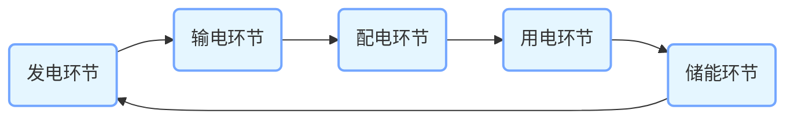

# 价值投资中的智能电网技术发展趋势

> 关键词：价值投资、智能电网技术、发展趋势、能源互联网、电力系统

> 摘要：本文聚焦于价值投资视角下的智能电网技术发展趋势。首先介绍了智能电网技术在当前能源领域的重要性及研究背景，详细阐述了智能电网的核心概念、相关联系和架构。接着深入剖析了智能电网涉及的核心算法原理，结合 Python 代码进行说明，同时给出了相关的数学模型和公式。通过实际项目案例，展示了智能电网技术的具体应用和实现细节。探讨了智能电网在多个领域的实际应用场景，并推荐了学习智能电网技术的工具、资源和相关论文著作。最后总结了智能电网技术未来的发展趋势与挑战，为价值投资者和相关技术人员提供了全面而深入的参考。

## 1. 背景介绍 
### 1.1 目的和范围
随着全球能源需求的不断增长和对清洁能源的追求，智能电网技术应运而生。智能电网作为未来电力系统的发展方向，具有提高能源利用效率、增强电网可靠性和灵活性等诸多优势。本文章的目的在于从价值投资的角度深入分析智能电网技术的发展趋势，探讨其在未来能源市场中的投资价值和应用前景。范围涵盖智能电网的核心概念、算法原理、数学模型、实际应用案例以及相关的工具和资源等方面。

### 1.2 预期读者
本文预期读者包括价值投资者，他们希望通过了解智能电网技术的发展趋势，寻找具有潜力的投资项目；电力系统工程师和技术人员，他们可以从文章中获取智能电网技术的最新知识和应用案例；能源领域的研究人员，他们可以参考文章中的数学模型和算法原理进行深入研究；以及对智能电网技术感兴趣的普通读者，他们可以通过本文初步了解智能电网技术的相关知识。

### 1.3 文档结构概述
本文共分为十个部分。第一部分为背景介绍，阐述了文章的目的、范围、预期读者和文档结构。第二部分介绍智能电网的核心概念与联系，包括原理和架构，并给出相应的文本示意图和 Mermaid 流程图。第三部分详细讲解智能电网的核心算法原理和具体操作步骤，使用 Python 代码进行说明。第四部分给出智能电网的数学模型和公式，并进行详细讲解和举例说明。第五部分通过项目实战，展示智能电网技术的代码实际案例和详细解释。第六部分探讨智能电网的实际应用场景。第七部分推荐学习智能电网技术的工具和资源，包括学习资源、开发工具框架和相关论文著作。第八部分总结智能电网技术未来的发展趋势与挑战。第九部分为附录，解答常见问题。第十部分提供扩展阅读和参考资料。

### 1.4 术语表
#### 1.4.1 核心术语定义
- **智能电网**：是将先进的传感测量技术、通信技术、信息技术、计算机技术和控制技术与物理电网高度集成而形成的新型电网。它能够实现电力系统的智能化管理和运行，提高电网的可靠性、安全性和效率。
- **价值投资**：是一种投资策略，投资者通过分析资产的内在价值，寻找被低估的资产进行投资，以获取长期的投资回报。
- **分布式能源资源**：指分布在用户侧的能源综合利用系统，包括太阳能、风能、水能等可再生能源发电设备，以及储能装置等。
- **能源互联网**：是一种将互联网技术与能源生产、传输、存储、消费等环节深度融合的能源系统，旨在实现能源的高效利用和优化配置。

#### 1.4.2 相关概念解释
- **电力市场**：是电力商品交易的场所和机制，包括发电企业、输电企业、配电企业和电力用户等市场主体，通过市场机制实现电力的生产、传输和消费。
- **需求响应**：是指电力用户根据电力价格信号或激励机制，调整自身的电力消费行为，以响应电力系统的供需变化，提高电力系统的稳定性和效率。
- **微电网**：是一种由分布式能源资源、储能装置、负荷和控制系统组成的小型电力系统，能够在孤岛运行或与大电网联网运行，为局部区域提供电力供应。

#### 1.4.3 缩略词列表
- **SCADA**：Supervisory Control and Data Acquisition，数据采集与监视控制系统
- **AMI**：Advanced Metering Infrastructure，高级量测体系
- **DER**：Distributed Energy Resource，分布式能源资源
- **HVDC**：High Voltage Direct Current，高压直流输电

## 2. 核心概念与联系 
### 核心概念原理
智能电网的核心原理是通过先进的信息技术和通信技术，实现电力系统的实时监测、控制和优化。它将传统的电力系统与现代的信息技术相结合，形成一个智能化的电力网络。智能电网的主要组成部分包括发电、输电、配电、用电和储能等环节，各个环节之间通过通信网络实现信息的交互和共享。

在发电环节，智能电网可以实现对分布式能源资源的高效管理和调度，提高可再生能源的接入比例。在输电环节，智能电网可以通过实时监测和控制，提高输电线路的利用率和可靠性。在配电环节，智能电网可以实现对配电网的自动化管理和故障快速定位，提高供电质量。在用电环节，智能电网可以通过需求响应机制，引导用户合理用电，降低用电成本。在储能环节，智能电网可以通过储能装置的充放电控制，平衡电力系统的供需关系，提高电网的稳定性。

### 架构示意图
以下是智能电网的架构示意图：

```plaintext
+---------------------+
|       发电环节      |
|  传统电源 + DER     |
+---------------------+
        |
        v
+---------------------+
|       输电环节      |
|  高压输电线路       |
|  SCADA 监测控制     |
+---------------------+
        |
        v
+---------------------+
|       配电环节      |
|  配电网自动化       |
|  故障定位与恢复     |
+---------------------+
        |
        v
+---------------------+
|       用电环节      |
|  智能电表 + AMI     |
|  需求响应机制       |
+---------------------+
        |
        v
+---------------------+
|       储能环节      |
|  电池储能 + 其他    |
|  充放电控制         |
+---------------------+
```

### Mermaid 流程图


该流程图展示了智能电网各个环节之间的相互关系。发电环节产生的电力通过输电环节输送到配电环节，再分配给用电环节。用电环节的信息可以反馈给发电环节和储能环节，储能环节可以在电力供需不平衡时进行充放电调节，形成一个闭环的智能电力系统。

## 3. 核心算法原理 & 具体操作步骤 
### 算法原理讲解
智能电网中涉及到许多核心算法，如负荷预测算法、分布式电源优化调度算法、需求响应算法等。这里以负荷预测算法为例，介绍其原理和实现。

负荷预测是智能电网中的重要环节，它可以帮助电力企业合理安排发电计划，提高电网的运行效率。常见的负荷预测方法有时间序列分析法、神经网络法、支持向量机法等。这里我们使用时间序列分析法中的 ARIMA（Autoregressive Integrated Moving Average）模型进行负荷预测。

ARIMA 模型是一种广泛应用于时间序列预测的统计模型，它结合了自回归（AR）、差分（I）和移动平均（MA）三个部分。ARIMA 模型的一般形式为 $ARIMA(p, d, q)$，其中 $p$ 是自回归阶数，$d$ 是差分阶数，$q$ 是移动平均阶数。

### Python 代码实现
```python
import pandas as pd
import numpy as np
from statsmodels.tsa.arima.model import ARIMA
import matplotlib.pyplot as plt

# 生成示例数据
np.random.seed(0)
date_rng = pd.date_range(start='2023-01-01', end='2023-12-31', freq='D')
data = np.random.randint(100, 200, size=(len(date_rng)))
df = pd.DataFrame(data, columns=['load'], index=date_rng)

# 划分训练集和测试集
train_size = int(len(df) * 0.8)
train_data = df[:train_size]
test_data = df[train_size:]

# 拟合 ARIMA 模型
p, d, q = 1, 1, 1  # 定义 ARIMA 模型的阶数
model = ARIMA(train_data['load'], order=(p, d, q))
model_fit = model.fit()

# 进行预测
forecast = model_fit.get_forecast(steps=len(test_data))
forecast_mean = forecast.predicted_mean

# 绘制结果
plt.figure(figsize=(12, 6))
plt.plot(train_data.index, train_data['load'], label='Training Data')
plt.plot(test_data.index, test_data['load'], label='Actual Data')
plt.plot(test_data.index, forecast_mean, label='Forecast Data', color='r')
plt.title('Load Forecasting using ARIMA Model')
plt.xlabel('Date')
plt.ylabel('Load')
plt.legend()
plt.show()
```

### 具体操作步骤
1. **数据准备**：收集历史负荷数据，并将其转换为时间序列数据。可以使用 Pandas 库来处理和分析数据。
2. **数据划分**：将时间序列数据划分为训练集和测试集，通常训练集占总数据的 80%，测试集占 20%。
3. **模型选择和拟合**：选择合适的 ARIMA 模型阶数 $(p, d, q)$，并使用训练集数据进行模型拟合。可以使用 `statsmodels` 库中的 `ARIMA` 类来实现。
4. **模型预测**：使用拟合好的模型对测试集数据进行预测，并获取预测结果。
5. **结果评估和可视化**：使用评估指标（如均方误差、平均绝对误差等）评估预测结果的准确性，并使用 Matplotlib 库将预测结果可视化。

## 4. 数学模型和公式 & 详细讲解 & 举例说明 
### ARIMA 模型数学公式
ARIMA 模型的一般形式可以表示为：

$$
(1 - \phi_1 B - \cdots - \phi_p B^p)(1 - B)^d Y_t = (1 + \theta_1 B + \cdots + \theta_q B^q) \epsilon_t
$$

其中：
- $Y_t$ 是时间序列在 $t$ 时刻的值。
- $B$ 是后移算子，即 $B Y_t = Y_{t - 1}$。
- $\phi_1, \cdots, \phi_p$ 是自回归系数。
- $d$ 是差分阶数，$(1 - B)^d$ 表示对时间序列进行 $d$ 阶差分。
- $\theta_1, \cdots, \theta_q$ 是移动平均系数。
- $\epsilon_t$ 是白噪声序列，均值为 0，方差为 $\sigma^2$。

### 详细讲解
- **自回归部分（AR）**：自回归部分表示当前时刻的时间序列值 $Y_t$ 可以由过去 $p$ 个时刻的值 $Y_{t - 1}, \cdots, Y_{t - p}$ 线性组合得到，即：

$$
Y_t = \phi_1 Y_{t - 1} + \cdots + \phi_p Y_{t - p} + \epsilon_t
$$

- **差分部分（I）**：差分部分用于处理非平稳时间序列。通过对时间序列进行 $d$ 阶差分，可以将其转换为平稳时间序列。例如，一阶差分可以表示为：

$$
\nabla Y_t = Y_t - Y_{t - 1}
$$

- **移动平均部分（MA）**：移动平均部分表示当前时刻的时间序列值 $Y_t$ 可以由过去 $q$ 个时刻的白噪声 $\epsilon_{t - 1}, \cdots, \epsilon_{t - q}$ 线性组合得到，即：

$$
Y_t = \epsilon_t + \theta_1 \epsilon_{t - 1} + \cdots + \theta_q \epsilon_{t - q}
$$

### 举例说明
假设我们有一个时间序列 $Y = [10, 12, 15, 13, 16, 18]$，我们要使用 $ARIMA(1, 1, 1)$ 模型进行预测。

首先，进行一阶差分：

$$
\nabla Y = [12 - 10, 15 - 12, 13 - 15, 16 - 13, 18 - 16] = [2, 3, -2, 3, 2]
$$

然后，假设我们已经拟合好模型，得到自回归系数 $\phi_1 = 0.5$，移动平均系数 $\theta_1 = 0.3$。

对于 $t = 6$ 的预测值，我们可以根据 ARIMA 模型的公式进行计算：

$$
(1 - 0.5 B)(1 - B) Y_6 = (1 + 0.3 B) \epsilon_6
$$

由于我们不知道 $\epsilon_6$ 的值，我们可以使用历史数据进行估计。具体计算过程可以使用 Python 代码实现，如前面所示。

## 5. 项目实战：代码实际案例和详细解释说明 
### 5.1  开发环境搭建
- **操作系统**：推荐使用 Windows、Linux 或 macOS 操作系统。
- **Python 环境**：安装 Python 3.7 及以上版本。可以从 Python 官方网站（https://www.python.org/downloads/）下载并安装。
- **Python 库**：安装必要的 Python 库，如 Pandas、NumPy、Statsmodels、Matplotlib 等。可以使用以下命令进行安装：

```bash
pip install pandas numpy statsmodels matplotlib
```

### 5.2  源代码详细实现和代码解读
以下是一个完整的智能电网负荷预测项目的代码示例：

```python
import pandas as pd
import numpy as np
from statsmodels.tsa.arima.model import ARIMA
import matplotlib.pyplot as plt
from sklearn.metrics import mean_squared_error

# 读取数据
data = pd.read_csv('load_data.csv', index_col='date', parse_dates=True)

# 划分训练集和测试集
train_size = int(len(data) * 0.8)
train_data = data[:train_size]
test_data = data[train_size:]

# 拟合 ARIMA 模型
p, d, q = 1, 1, 1  # 定义 ARIMA 模型的阶数
model = ARIMA(train_data['load'], order=(p, d, q))
model_fit = model.fit()

# 进行预测
forecast = model_fit.get_forecast(steps=len(test_data))
forecast_mean = forecast.predicted_mean

# 计算均方误差
mse = mean_squared_error(test_data['load'], forecast_mean)
print(f"Mean Squared Error: {mse}")

# 绘制结果
plt.figure(figsize=(12, 6))
plt.plot(train_data.index, train_data['load'], label='Training Data')
plt.plot(test_data.index, test_data['load'], label='Actual Data')
plt.plot(test_data.index, forecast_mean, label='Forecast Data', color='r')
plt.title('Load Forecasting using ARIMA Model')
plt.xlabel('Date')
plt.ylabel('Load')
plt.legend()
plt.show()
```

### 代码解读与分析
1. **数据读取**：使用 `pandas` 库的 `read_csv` 函数读取历史负荷数据，并将日期列作为索引，同时解析日期格式。
2. **数据划分**：将数据集划分为训练集和测试集，训练集占总数据的 80%，测试集占 20%。
3. **模型拟合**：选择 $ARIMA(1, 1, 1)$ 模型，并使用训练集数据进行模型拟合。
4. **模型预测**：使用拟合好的模型对测试集数据进行预测，并获取预测结果。
5. **误差计算**：使用 `sklearn` 库的 `mean_squared_error` 函数计算预测结果的均方误差，评估模型的准确性。
6. **结果可视化**：使用 `matplotlib` 库将训练数据、实际数据和预测数据可视化，直观展示模型的预测效果。

## 6. 实际应用场景 
### 电力系统调度
智能电网技术可以实时监测电力系统的运行状态，包括发电、输电、配电和用电等环节的信息。通过负荷预测算法，电力调度人员可以提前了解电力需求的变化趋势，合理安排发电计划，优化电力资源的分配，提高电力系统的运行效率和可靠性。

### 分布式能源接入
随着可再生能源的快速发展，分布式能源资源（如太阳能、风能等）的接入比例不断增加。智能电网技术可以实现对分布式能源资源的实时监测和控制，解决分布式能源的间歇性和波动性问题，提高分布式能源的消纳能力，促进可再生能源的大规模应用。

### 需求响应管理
智能电网可以通过高级量测体系（AMI）实时获取用户的用电信息，并通过需求响应机制引导用户合理用电。例如，在电力高峰期，电力企业可以通过价格信号或激励机制，鼓励用户减少用电负荷，从而降低电网的峰荷压力，提高电力系统的稳定性。

### 微电网运行
微电网是一种小型的电力系统，它可以在孤岛运行或与大电网联网运行。智能电网技术可以实现对微电网的自动化控制和优化调度，提高微电网的供电可靠性和能源利用效率。例如，在孤岛运行时，微电网可以通过储能装置和分布式能源资源的协调控制，保证对重要负荷的持续供电。

### 电力市场交易
智能电网技术可以为电力市场交易提供支持，实现电力的实时定价和交易。通过实时监测电力系统的供需关系和市场价格，电力企业和用户可以根据自身的需求和利益进行电力交易，提高电力市场的效率和灵活性。

## 7. 工具和资源推荐
### 7.1 学习资源推荐
#### 7.1.1 书籍推荐
- 《智能电网基础》：本书全面介绍了智能电网的基本概念、技术原理和应用场景，是学习智能电网的入门书籍。
- 《电力系统分析》：详细讲解了电力系统的基本理论和分析方法，对于理解智能电网的运行原理和控制策略有很大帮助。
- 《机器学习与电力系统应用》：介绍了机器学习在电力系统中的应用，包括负荷预测、故障诊断、分布式电源优化调度等方面。

#### 7.1.2 在线课程
- Coursera 平台上的 “Smart Grid Technologies” 课程：由国外知名高校教授授课，系统介绍了智能电网的技术体系和发展趋势。
- edX 平台上的 “Introduction to Electric Power Systems” 课程：讲解了电力系统的基本原理和运行机制，为学习智能电网打下基础。
- 中国大学 MOOC 平台上的 “智能电网技术” 课程：由国内高校教师授课，结合国内智能电网的发展现状，介绍了智能电网的关键技术和应用案例。

#### 7.1.3 技术博客和网站
- IEEE Power & Energy Society 官网：提供了电力系统和智能电网领域的最新研究成果、技术标准和行业动态。
- 中国电力企业联合会官网：发布了国内电力行业的政策法规、统计数据和技术报告，对于了解国内智能电网的发展情况有很大帮助。
- 北极星电力网：是国内知名的电力行业网站，提供了电力市场、智能电网、新能源等方面的新闻资讯和技术文章。

### 7.2 开发工具框架推荐
#### 7.2.1 IDE和编辑器
- PyCharm：是一款专业的 Python 集成开发环境，具有代码编辑、调试、版本控制等功能，适合开发智能电网相关的 Python 程序。
- Visual Studio Code：是一款轻量级的代码编辑器，支持多种编程语言和插件扩展，可用于开发智能电网的前端和后端应用程序。
- Jupyter Notebook：是一种交互式的编程环境，适合进行数据探索、模型训练和结果可视化，在智能电网的数据分析和机器学习应用中广泛使用。

#### 7.2.2 调试和性能分析工具
- Py-Spy：是一个用于 Python 程序的性能分析工具，可以实时监测 Python 程序的 CPU 使用率和函数调用情况，帮助开发者找出性能瓶颈。
- TensorBoard：是 TensorFlow 框架提供的可视化工具，可用于可视化深度学习模型的训练过程和性能指标，在智能电网的机器学习应用中非常有用。
- Wireshark：是一款网络协议分析工具，可用于捕获和分析智能电网通信网络中的数据包，帮助开发者调试和优化通信协议。

#### 7.2.3 相关框架和库
- Pandas：是一个强大的数据分析库，提供了高效的数据结构和数据处理工具，在智能电网的数据处理和分析中广泛使用。
- NumPy：是 Python 的科学计算基础库，提供了高效的多维数组对象和数学函数，用于智能电网的数值计算和模型实现。
- TensorFlow 和 PyTorch：是深度学习领域的两大主流框架，可用于智能电网的负荷预测、故障诊断等机器学习应用。

### 7.3 相关论文著作推荐
#### 7.3.1 经典论文
- “The Future of the Electric Grid”：该论文探讨了未来电力系统的发展趋势和挑战，提出了智能电网的概念和架构。
- “Smart Grid: The New and Improved Power Grid”：详细介绍了智能电网的关键技术和应用场景，分析了智能电网对电力行业的影响。
- “Distributed Energy Resources and the Future of the Electric Grid”：研究了分布式能源资源在智能电网中的应用和发展前景，提出了分布式能源资源的优化调度策略。

#### 7.3.2 最新研究成果
- 在 IEEE Transactions on Smart Grid、Applied Energy 等国际知名期刊上发表的关于智能电网的最新研究论文，涵盖了智能电网的各个领域，如分布式能源管理、需求响应、电力市场等。
- 国内的《中国电机工程学报》、《电网技术》等期刊也发表了许多关于智能电网的研究成果，反映了国内智能电网的研究动态和发展水平。

#### 7.3.3 应用案例分析
- 国内外一些智能电网示范项目的案例分析报告，如美国的 GridWise 项目、欧洲的 SmartGrids 项目、中国的张北可再生能源柔性直流电网试验示范工程等。这些案例分析可以帮助读者了解智能电网技术在实际项目中的应用情况和效果。

## 8. 总结：未来发展趋势与挑战
### 未来发展趋势
- **能源互联网融合**：智能电网将与能源互联网深度融合，实现能源的跨领域、跨行业协同优化配置。通过能源互联网，不同能源形式（如电力、天然气、热能等）可以实现互联互通和相互转换，提高能源利用效率和综合效益。
- **分布式能源大规模接入**：随着可再生能源技术的不断进步和成本的降低，分布式能源资源将大规模接入智能电网。未来，分布式能源将成为电力系统的重要组成部分，智能电网需要具备更强的分布式能源管理和消纳能力。
- **人工智能技术广泛应用**：人工智能技术将在智能电网中得到广泛应用，如负荷预测、故障诊断、优化调度等方面。通过人工智能算法，可以实现电力系统的智能化决策和控制，提高电网的运行效率和可靠性。
- **电力市场改革深化**：电力市场改革将不断深化，智能电网将为电力市场的发展提供技术支持。未来，电力市场将更加开放和灵活，用户可以更加自由地参与电力交易，实现电力资源的优化配置。

### 挑战
- **数据安全与隐私保护**：智能电网涉及大量的电力数据和用户信息，数据安全和隐私保护面临严峻挑战。需要加强数据加密、访问控制和安全审计等技术手段，保障数据的安全和隐私。
- **通信网络可靠性**：智能电网的运行依赖于高效可靠的通信网络。然而，通信网络可能会受到自然灾害、网络攻击等因素的影响，导致通信中断或数据传输错误。需要加强通信网络的建设和维护，提高通信网络的可靠性和抗干扰能力。
- **标准规范不统一**：目前，智能电网的标准规范还不够统一，不同厂家的设备和系统之间可能存在兼容性问题。需要加强标准规范的制定和推广，促进智能电网设备和系统的互联互通和互操作性。
- **技术创新和人才培养**：智能电网技术发展迅速，需要不断进行技术创新和人才培养。目前，智能电网领域的专业人才相对短缺，需要加强高校和企业的合作，培养更多的智能电网专业人才。

## 9. 附录：常见问题与解答
### 问题 1：智能电网和传统电网有什么区别？
解答：智能电网与传统电网相比，具有以下几个方面的区别：
- **智能化程度更高**：智能电网通过先进的信息技术和通信技术，实现了电力系统的实时监测、控制和优化，能够自动感知和响应电网的运行状态变化。
- **分布式能源接入能力更强**：智能电网可以更好地适应分布式能源资源的接入，解决分布式能源的间歇性和波动性问题，提高可再生能源的消纳能力。
- **用户参与度更高**：智能电网通过需求响应机制，引导用户合理用电，提高用户的参与度和用电效率。
- **可靠性和安全性更高**：智能电网可以实现故障的快速定位和恢复，提高电网的可靠性和安全性。

### 问题 2：智能电网的建设需要哪些技术支持？
解答：智能电网的建设需要以下几个方面的技术支持：
- **传感测量技术**：用于实时监测电力系统的运行状态，如电压、电流、功率等参数。
- **通信技术**：用于实现电力系统各个环节之间的信息交互和共享，如光纤通信、无线通信等。
- **信息技术**：用于处理和分析电力系统的大量数据，如大数据分析、云计算等。
- **控制技术**：用于实现电力系统的自动化控制和优化调度，如分布式控制、智能算法等。
- **储能技术**：用于平衡电力系统的供需关系，提高电网的稳定性，如电池储能、超级电容储能等。

### 问题 3：如何评估智能电网项目的投资价值？
解答：评估智能电网项目的投资价值可以从以下几个方面考虑：
- **技术可行性**：评估项目所采用的技术是否成熟、可靠，是否具有创新性和竞争力。
- **经济效益**：分析项目的投资成本、运营成本和收益情况，计算项目的投资回报率、净现值等经济指标。
- **社会效益**：考虑项目对社会的贡献，如提高能源利用效率、减少环境污染、促进经济发展等。
- **政策环境**：了解国家和地方政府对智能电网项目的政策支持力度，政策的稳定性和可持续性。
- **市场前景**：分析智能电网项目的市场需求和发展趋势，判断项目的市场前景和竞争力。

## 10. 扩展阅读 & 参考资料
### 扩展阅读
- 《能源互联网：概念、技术与应用》：深入介绍了能源互联网的概念、技术体系和应用案例，对于理解智能电网与能源互联网的融合发展有很大帮助。
- 《大数据在电力系统中的应用》：探讨了大数据技术在电力系统中的应用场景和方法，为智能电网的数据分析和决策提供了新思路。
- 《区块链与能源互联网》：研究了区块链技术在能源互联网中的应用潜力，如电力交易、分布式能源管理等方面。

### 参考资料
- IEEE 标准协会发布的智能电网相关标准，如 IEEE 2030、IEEE 1547 等。
- 国家能源局发布的智能电网发展规划和政策文件，如《智能电网发展行动计划（2019 - 2020 年）》等。
- 相关学术期刊和会议上发表的研究论文，如 IEEE Transactions on Smart Grid、IEEE Power & Energy Society General Meeting 等。

作者：AI天才研究院/AI Genius Institute & 禅与计算机程序设计艺术 /Zen And The Art of Computer Programming