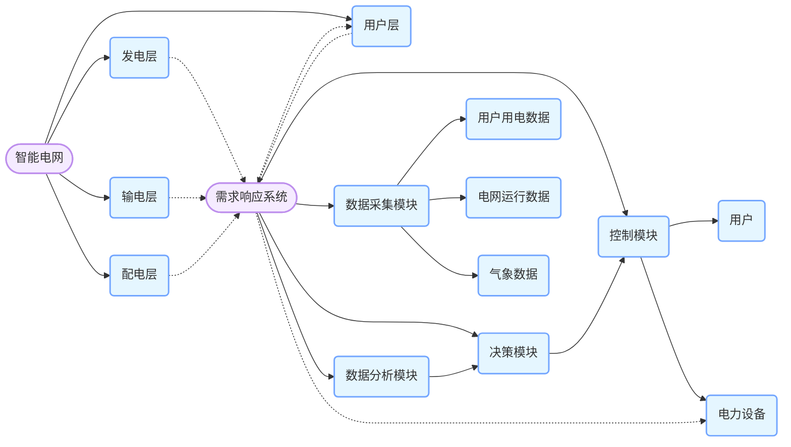

# 价值投资中的智能电网需求响应系统分析

> 关键词：价值投资、智能电网、需求响应系统、电力市场、数据分析

> 摘要：本文聚焦于价值投资视角下的智能电网需求响应系统。首先介绍了相关背景，明确目的、预期读者、文档结构及术语。接着阐述了核心概念与联系，包括智能电网和需求响应系统的原理与架构。通过Python代码详细讲解了核心算法原理和具体操作步骤，并给出数学模型和公式。以实际项目为例，展示了开发环境搭建、源代码实现与解读。探讨了系统在不同场景的实际应用，推荐了学习、开发相关的工具和资源，包括书籍、在线课程、开发框架等。最后总结了系统未来发展趋势与挑战，还提供了常见问题解答和扩展阅读参考资料，旨在为价值投资者和相关技术人员全面剖析智能电网需求响应系统。

## 1. 背景介绍 
### 1.1 目的和范围
随着全球能源需求的不断增长和对可持续能源的追求，智能电网作为未来电力系统的发展方向，正逐渐成为研究和投资的热点。需求响应系统作为智能电网的重要组成部分，能够通过激励用户调整用电行为，实现电力资源的优化配置，提高电网的可靠性和效率。本文的目的是从价值投资的角度，对智能电网需求响应系统进行深入分析，探讨其投资价值和发展前景。

本文的研究范围主要包括智能电网需求响应系统的核心概念、算法原理、数学模型、实际应用场景等方面。同时，还将结合实际案例，分析系统的开发和实施过程，为投资者提供参考。

### 1.2 预期读者
本文的预期读者包括价值投资者、电力行业从业者、能源研究人员以及对智能电网和需求响应系统感兴趣的技术人员。通过阅读本文，读者可以了解智能电网需求响应系统的基本原理和应用价值，为投资决策和技术研究提供参考。

### 1.3 文档结构概述
本文将按照以下结构进行组织：
1. **背景介绍**：介绍本文的目的、范围、预期读者和文档结构。
2. **核心概念与联系**：阐述智能电网和需求响应系统的核心概念，分析它们之间的联系和相互作用。
3. **核心算法原理 & 具体操作步骤**：详细介绍需求响应系统中常用的算法原理，并给出具体的操作步骤。
4. **数学模型和公式 & 详细讲解 & 举例说明**：建立需求响应系统的数学模型，推导相关公式，并通过具体例子进行说明。
5. **项目实战：代码实际案例和详细解释说明**：结合实际项目，展示需求响应系统的开发过程，包括开发环境搭建、源代码实现和代码解读。
6. **实际应用场景**：探讨智能电网需求响应系统在不同场景下的实际应用，分析其应用效果和投资价值。
7. **工具和资源推荐**：推荐相关的学习资源、开发工具和框架，以及经典论文和最新研究成果。
8. **总结：未来发展趋势与挑战**：总结智能电网需求响应系统的发展趋势，分析面临的挑战和机遇。
9. **附录：常见问题与解答**：列出常见问题，并给出详细解答。
10. **扩展阅读 & 参考资料**：提供相关的扩展阅读材料和参考资料。

### 1.4 术语表
#### 1.4.1 核心术语定义
- **智能电网（Smart Grid）**：将先进的信息技术、通信技术、控制技术与电力系统相结合，实现电力系统的智能化运行和管理的新一代电网。
- **需求响应（Demand Response, DR）**：电力用户根据电力市场价格信号或激励机制，主动调整其用电行为，以达到降低用电成本、提高电网可靠性和效率的目的。
- **需求响应系统（Demand Response System, DRS）**：用于实现需求响应功能的系统，包括数据采集、分析、决策和控制等模块。
- **负荷预测（Load Forecasting）**：根据历史负荷数据、气象数据等信息，对未来一段时间内的电力负荷进行预测。
- **实时电价（Real - Time Pricing, RTP）**：电力市场根据实时的电力供需情况，动态调整电价的定价方式。

#### 1.4.2 相关概念解释
- **分布式能源资源（Distributed Energy Resources, DERs）**：分布在用户侧的小型发电装置，如太阳能光伏、风力发电、储能装置等。
- **微电网（Microgrid）**：由分布式能源资源、负荷和控制装置组成的小型电力系统，可以独立运行或与大电网联网运行。
- **电力市场（Electricity Market）**：进行电力交易的市场，包括发电企业、供电企业、用户等市场主体。

#### 1.4.3 缩略词列表
| 缩略词 | 英文全称 | 中文全称 |
| ---- | ---- | ---- |
| SG | Smart Grid | 智能电网 |
| DR | Demand Response | 需求响应 |
| DRS | Demand Response System | 需求响应系统 |
| LF | Load Forecasting | 负荷预测 |
| RTP | Real - Time Pricing | 实时电价 |
| DERs | Distributed Energy Resources | 分布式能源资源 |
| MG | Microgrid | 微电网 |
| EM | Electricity Market | 电力市场 |

## 2. 核心概念与联系 

### 2.1 智能电网的原理和架构
智能电网是一个复杂的系统，它集成了先进的传感器、通信网络、计算机技术和控制算法，旨在实现电力系统的高效、可靠、安全和可持续运行。智能电网的架构主要包括以下几个层次：
- **发电层**：包括传统的火力发电、水力发电、核能发电等，以及可再生能源发电，如太阳能光伏、风力发电等。
- **输电层**：负责将发电厂产生的电力输送到各个地区，包括高压输电线路、变电站等。
- **配电层**：将输电层输送来的电力分配到各个用户，包括中低压配电线路、配电变压器等。
- **用户层**：包括居民用户、商业用户和工业用户等，用户可以通过智能电表等设备与电网进行交互。

智能电网的原理是通过实时监测和分析电力系统的运行状态，采用先进的控制算法对电力设备进行优化控制，实现电力资源的合理分配和高效利用。例如，当电网负荷过高时，智能电网可以通过调节发电设备的输出功率、调整用户的用电行为等方式，降低电网的负荷压力。

### 2.2 需求响应系统的原理和架构
需求响应系统的主要原理是通过向用户提供电价信号或激励机制，引导用户调整其用电行为，以达到降低用电成本、提高电网可靠性和效率的目的。需求响应系统的架构主要包括以下几个部分：
- **数据采集模块**：负责采集用户的用电数据、电网的运行数据、气象数据等信息。
- **数据分析模块**：对采集到的数据进行分析和处理，预测用户的用电需求和电网的负荷情况。
- **决策模块**：根据数据分析结果，制定需求响应策略，如调整电价、发送激励信号等。
- **控制模块**：将决策模块制定的策略发送给用户和电力设备，实现对用户用电行为和电力设备运行状态的控制。

### 2.3 智能电网与需求响应系统的联系
智能电网为需求响应系统提供了技术支持和平台保障，而需求响应系统则是智能电网实现电力资源优化配置的重要手段。具体来说，智能电网的以下特点为需求响应系统的实施提供了便利：
- **实时监测和通信**：智能电网可以实时监测电力系统的运行状态，并通过通信网络将信息传输给需求响应系统，使需求响应系统能够及时了解电网的负荷情况和用户的用电需求。
- **智能电表和分布式能源资源**：智能电表可以实现用户用电数据的实时采集和传输，分布式能源资源可以根据需求响应策略进行灵活调节，为需求响应系统的实施提供了数据基础和调节手段。
- **自动化控制**：智能电网的自动化控制功能可以根据需求响应策略，自动调节电力设备的运行状态，实现对用户用电行为的有效控制。

### 2.4 文本示意图
智能电网与需求响应系统的联系可以用以下文本示意图表示：

智能电网由发电层、输电层、配电层和用户层组成，通过实时监测和通信技术，实现电力系统的智能化运行。需求响应系统通过数据采集模块收集用户用电数据、电网运行数据和气象数据等信息，经过数据分析模块进行处理和预测，决策模块根据分析结果制定需求响应策略，控制模块将策略发送给用户和电力设备，实现对用户用电行为和电力设备运行状态的控制。智能电网为需求响应系统提供技术支持和平台保障，需求响应系统则是智能电网实现电力资源优化配置的重要手段。

### 2.5 Mermaid 流程图


## 3. 核心算法原理 & 具体操作步骤 

### 3.1 负荷预测算法原理
负荷预测是需求响应系统中的关键环节，它可以为需求响应策略的制定提供依据。常见的负荷预测算法包括时间序列分析、神经网络、支持向量机等。这里以时间序列分析中的ARIMA（Autoregressive Integrated Moving Average）模型为例，介绍负荷预测的算法原理。

ARIMA模型是一种广泛应用于时间序列预测的统计模型，它结合了自回归（AR）、差分（I）和移动平均（MA）三个部分。ARIMA(p, d, q)模型的一般形式为：

$$
\phi(B)(1 - B)^d y_t = \theta(B) \epsilon_t
$$

其中，$y_t$ 是时间序列数据，$B$ 是滞后算子，$\phi(B) = 1 - \phi_1 B - \phi_2 B^2 - \cdots - \phi_p B^p$ 是自回归多项式，$\theta(B) = 1 + \theta_1 B + \theta_2 B^2 + \cdots + \theta_q B^q$ 是移动平均多项式，$\epsilon_t$ 是白噪声序列，$p$ 是自回归阶数，$d$ 是差分阶数，$q$ 是移动平均阶数。

### 3.2 负荷预测算法的Python实现
以下是使用Python的`statsmodels`库实现ARIMA模型进行负荷预测的代码示例：
```python
import pandas as pd
import numpy as np
from statsmodels.tsa.arima.model import ARIMA
import matplotlib.pyplot as plt

# 生成示例数据
np.random.seed(0)
date_rng = pd.date_range(start='2023-01-01', end='2023-12-31', freq='D')
load_data = np.random.randint(100, 200, size=len(date_rng))
df = pd.DataFrame({'date': date_rng, 'load': load_data})
df.set_index('date', inplace=True)

# 划分训练集和测试集
train_size = int(len(df) * 0.8)
train_data = df[:train_size]
test_data = df[train_size:]

# 训练ARIMA模型
p, d, q = 1, 1, 1  # ARIMA模型的参数
model = ARIMA(train_data['load'], order=(p, d, q))
model_fit = model.fit()

# 进行预测
forecast = model_fit.forecast(steps=len(test_data))

# 可视化结果
plt.figure(figsize=(12, 6))
plt.plot(train_data.index, train_data['load'], label='Train Data')
plt.plot(test_data.index, test_data['load'], label='Actual Data')
plt.plot(test_data.index, forecast, label='Forecast Data')
plt.title('Load Forecasting with ARIMA Model')
plt.xlabel('Date')
plt.ylabel('Load')
plt.legend()
plt.show()
```

### 3.3 具体操作步骤
1. **数据准备**：收集历史负荷数据，并进行数据清洗和预处理，确保数据的质量和一致性。
2. **模型选择**：根据数据的特点和需求，选择合适的负荷预测模型，如ARIMA模型。
3. **参数估计**：使用训练数据对模型的参数进行估计，可以采用最大似然估计等方法。
4. **模型评估**：使用测试数据对模型的预测性能进行评估，常用的评估指标包括均方误差（MSE）、平均绝对误差（MAE）等。
5. **预测应用**：使用训练好的模型对未来的负荷进行预测，并将预测结果应用于需求响应策略的制定。

### 3.4 需求响应策略优化算法
需求响应策略优化的目标是在满足用户用电需求的前提下，最小化用电成本或最大化电网的经济效益。常见的需求响应策略优化算法包括线性规划、遗传算法、粒子群算法等。这里以线性规划为例，介绍需求响应策略优化的算法原理。

假设用户的用电需求可以分为多个时段，每个时段的电价不同。用户可以通过调整每个时段的用电量来降低用电成本。设 $x_i$ 表示第 $i$ 个时段的用电量，$p_i$ 表示第 $i$ 个时段的电价，$D_i$ 表示第 $i$ 个时段的最低用电需求，$U_i$ 表示第 $i$ 个时段的最高用电需求。则需求响应策略优化问题可以表示为以下线性规划模型：

$$
\min \sum_{i = 1}^{n} p_i x_i
$$

$$
\text{s.t. } D_i \leq x_i \leq U_i, \quad i = 1, 2, \cdots, n
$$

### 3.5 需求响应策略优化算法的Python实现
以下是使用Python的`pulp`库实现线性规划进行需求响应策略优化的代码示例：
```python
from pulp import LpMinimize, LpProblem, LpVariable

# 定义参数
n = 24  # 时段数
prices = [10, 12, 15, 18, 20, 22, 25, 28, 30, 32, 35, 38, 40, 42, 45, 48, 50, 52, 55, 58, 60, 55, 50, 45]  # 每个时段的电价
D = [5] * n  # 每个时段的最低用电需求
U = [20] * n  # 每个时段的最高用电需求

# 创建线性规划问题
prob = LpProblem("Demand_Response_Optimization", LpMinimize)

# 定义决策变量
x = [LpVariable(f"x_{i}", lowBound=D[i], upBound=U[i]) for i in range(n)]

# 定义目标函数
prob += sum(prices[i] * x[i] for i in range(n))

# 求解线性规划问题
prob.solve()

# 输出结果
print("最优用电策略：")
for i in range(n):
    print(f"时段 {i + 1}: 用电量 = {x[i].value()}")
print(f"最低用电成本: {prob.objective.value()}")
```

### 3.6 具体操作步骤
1. **问题建模**：根据需求响应的实际问题，建立线性规划模型，包括目标函数和约束条件。
2. **数据输入**：将电价、最低用电需求、最高用电需求等参数输入到模型中。
3. **模型求解**：使用线性规划求解器求解模型，得到最优的用电策略。
4. **结果分析**：分析求解结果，评估需求响应策略的效果。

## 4. 数学模型和公式 & 详细讲解 & 举例说明 

### 4.1 负荷预测的数学模型
#### 4.1.1 ARIMA模型的详细推导
ARIMA(p, d, q)模型可以通过以下步骤推导得到：

1. **差分处理**：对于非平稳的时间序列 $y_t$，通过 $d$ 阶差分将其转换为平稳时间序列 $z_t$，即：
$$
z_t=(1 - B)^d y_t
$$

其中，$(1 - B)^d$ 是差分算子，例如，一阶差分 $(1 - B)y_t=y_t - y_{t - 1}$。

2. **自回归模型**：平稳时间序列 $z_t$ 可以表示为自回归模型 AR(p) 的形式：
$$
z_t=\phi_1 z_{t - 1}+\phi_2 z_{t - 2}+\cdots+\phi_p z_{t - p}+\epsilon_t
$$

其中，$\phi_i$ 是自回归系数，$\epsilon_t$ 是白噪声序列。

3. **移动平均模型**：为了进一步提高模型的拟合能力，可以将自回归模型与移动平均模型 MA(q) 相结合，得到 ARMA(p, q) 模型：
$$
z_t=\phi_1 z_{t - 1}+\phi_2 z_{t - 2}+\cdots+\phi_p z_{t - p}+\epsilon_t+\theta_1 \epsilon_{t - 1}+\theta_2 \epsilon_{t - 2}+\cdots+\theta_q \epsilon_{t - q}
$$

其中，$\theta_i$ 是移动平均系数。

4. **ARIMA模型**：将差分处理和 ARMA(p, q) 模型相结合，得到 ARIMA(p, d, q) 模型：
$$
\phi(B)(1 - B)^d y_t=\theta(B) \epsilon_t
$$

#### 4.1.2 举例说明
假设我们有一个时间序列 $y_t$，其数据如下：
| t | y_t |
| ---- | ---- |
| 1 | 10 |
| 2 | 12 |
| 3 | 15 |
| 4 | 18 |
| 5 | 20 |

我们可以使用ARIMA(1, 1, 1)模型对其进行预测。首先进行一阶差分：
$$
z_t=y_t - y_{t - 1}
$$

得到差分后的序列 $z_t$：
| t | z_t |
| ---- | ---- |
| 2 | 2 |
| 3 | 3 |
| 4 | 3 |
| 5 | 2 |

假设ARIMA(1, 1, 1)模型的参数为 $\phi_1 = 0.5$，$\theta_1 = 0.3$，则模型可以表示为：
$$
(1 - 0.5B)(1 - B)y_t=(1 + 0.3B)\epsilon_t
$$

### 4.2 需求响应策略优化的数学模型
#### 4.2.1 线性规划模型的详细讲解
需求响应策略优化的线性规划模型可以进一步扩展，考虑更多的约束条件，如用户的舒适度约束、电网的功率平衡约束等。

假设用户的用电设备可以分为多个类型，每种类型的设备有不同的功率和运行时间限制。设 $x_{ij}$ 表示第 $i$ 个时段第 $j$ 种设备的用电量，$p_i$ 表示第 $i$ 个时段的电价，$D_{ij}$ 表示第 $j$ 种设备在第 $i$ 个时段的最低用电需求，$U_{ij}$ 表示第 $j$ 种设备在第 $i$ 个时段的最高用电需求，$C_j$ 表示第 $j$ 种设备的舒适度权重。则需求响应策略优化问题可以表示为以下线性规划模型：

$$
\min \sum_{i = 1}^{n} \sum_{j = 1}^{m} p_i x_{ij}+\sum_{j = 1}^{m} C_j f_j(x_{ij})
$$

$$
\text{s.t. } D_{ij} \leq x_{ij} \leq U_{ij}, \quad i = 1, 2, \cdots, n; j = 1, 2, \cdots, m
$$

$$
\sum_{j = 1}^{m} x_{ij} \leq P_i, \quad i = 1, 2, \cdots, n
$$

其中，$f_j(x_{ij})$ 是第 $j$ 种设备的舒适度函数，$P_i$ 是第 $i$ 个时段的电网功率上限。

#### 4.2.2 举例说明
假设用户有两种用电设备：空调和冰箱。每个时段的电价如下：
| 时段 | 电价 |
| ---- | ---- |
| 1 | 10 |
| 2 | 12 |
| 3 | 15 |

空调和冰箱的最低和最高用电需求如下：
| 设备 | 时段 1 | 时段 2 | 时段 3 |
| ---- | ---- | ---- | ---- |
| 空调 | [2, 5] | [2, 5] | [2, 5] |
| 冰箱 | [1, 3] | [1, 3] | [1, 3] |

电网每个时段的功率上限为 6。空调和冰箱的舒适度权重分别为 0.5 和 0.3。则需求响应策略优化问题可以表示为以下线性规划模型：

$$
\min 10(x_{11}+x_{12}) + 12(x_{21}+x_{22}) + 15(x_{31}+x_{32})+0.5f_1(x_{ij}) + 0.3f_2(x_{ij})
$$

$$
\text{s.t. } 2 \leq x_{11} \leq 5, \quad 1 \leq x_{12} \leq 3
$$

$$
2 \leq x_{21} \leq 5, \quad 1 \leq x_{22} \leq 3
$$

$$
2 \leq x_{31} \leq 5, \quad 1 \leq x_{32} \leq 3
$$

$$
x_{11}+x_{12} \leq 6
$$

$$
x_{21}+x_{22} \leq 6
$$

$$
x_{31}+x_{32} \leq 6
$$

## 5. 项目实战：代码实际案例和详细解释说明 

### 5.1  开发环境搭建
#### 5.1.1 操作系统
本项目可以在Windows、Linux或Mac OS等操作系统上进行开发。建议使用Linux系统，如Ubuntu，因为它具有良好的开源软件支持和稳定性。

#### 5.1.2 Python环境
本项目使用Python进行开发，建议使用Python 3.7及以上版本。可以使用Anaconda来管理Python环境，具体步骤如下：
1. 下载并安装Anaconda：从Anaconda官方网站（https://www.anaconda.com/products/individual）下载适合自己操作系统的Anaconda安装包，并按照安装向导进行安装。
2. 创建虚拟环境：打开Anaconda Prompt（Windows）或终端（Linux/Mac OS），输入以下命令创建一个新的虚拟环境：
```bash
conda create -n drs python=3.8
```
其中，`drs` 是虚拟环境的名称，可以根据自己的喜好进行修改。

3. 激活虚拟环境：输入以下命令激活虚拟环境：
```bash
conda activate drs
```

#### 5.1.3 安装必要的库
在激活的虚拟环境中，使用以下命令安装本项目所需的库：
```bash
pip install pandas numpy statsmodels pulp matplotlib
```

### 5.2  源代码详细实现和代码解读
#### 5.2.1 负荷预测模块
```python
import pandas as pd
import numpy as np
from statsmodels.tsa.arima.model import ARIMA
import matplotlib.pyplot as plt

# 生成示例数据
np.random.seed(0)
date_rng = pd.date_range(start='2023-01-01', end='2023-12-31', freq='D')
load_data = np.random.randint(100, 200, size=len(date_rng))
df = pd.DataFrame({'date': date_rng, 'load': load_data})
df.set_index('date', inplace=True)

# 划分训练集和测试集
train_size = int(len(df) * 0.8)
train_data = df[:train_size]
test_data = df[train_size:]

# 训练ARIMA模型
p, d, q = 1, 1, 1  # ARIMA模型的参数
model = ARIMA(train_data['load'], order=(p, d, q))
model_fit = model.fit()

# 进行预测
forecast = model_fit.forecast(steps=len(test_data))

# 可视化结果
plt.figure(figsize=(12, 6))
plt.plot(train_data.index, train_data['load'], label='Train Data')
plt.plot(test_data.index, test_data['load'], label='Actual Data')
plt.plot(test_data.index, forecast, label='Forecast Data')
plt.title('Load Forecasting with ARIMA Model')
plt.xlabel('Date')
plt.ylabel('Load')
plt.legend()
plt.show()
```
**代码解读**：
1. **数据生成**：使用`numpy`和`pandas`生成示例负荷数据，并将其转换为`DataFrame`格式。
2. **数据划分**：将数据划分为训练集和测试集，训练集占80%，测试集占20%。
3. **模型训练**：使用`statsmodels`库的`ARIMA`类训练ARIMA模型。
4. **预测**：使用训练好的模型对测试集进行预测。
5. **可视化**：使用`matplotlib`库将训练数据、实际数据和预测数据进行可视化展示。

#### 5.2.2 需求响应策略优化模块
```python
from pulp import LpMinimize, LpProblem, LpVariable

# 定义参数
n = 24  # 时段数
prices = [10, 12, 15, 18, 20, 22, 25, 28, 30, 32, 35, 38, 40, 42, 45, 48, 50, 52, 55, 58, 60, 55, 50, 45]  # 每个时段的电价
D = [5] * n  # 每个时段的最低用电需求
U = [20] * n  # 每个时段的最高用电需求

# 创建线性规划问题
prob = LpProblem("Demand_Response_Optimization", LpMinimize)

# 定义决策变量
x = [LpVariable(f"x_{i}", lowBound=D[i], upBound=U[i]) for i in range(n)]

# 定义目标函数
prob += sum(prices[i] * x[i] for i in range(n))

# 求解线性规划问题
prob.solve()

# 输出结果
print("最优用电策略：")
for i in range(n):
    print(f"时段 {i + 1}: 用电量 = {x[i].value()}")
print(f"最低用电成本: {prob.objective.value()}")
```
**代码解读**：
1. **参数定义**：定义时段数、每个时段的电价、最低用电需求和最高用电需求。
2. **问题创建**：使用`pulp`库的`LpProblem`类创建一个线性规划问题，目标是最小化用电成本。
3. **决策变量定义**：使用`LpVariable`类定义决策变量，即每个时段的用电量。
4. **目标函数定义**：定义目标函数为每个时段的电价乘以用电量的总和。
5. **问题求解**：使用`prob.solve()`方法求解线性规划问题。
6. **结果输出**：输出最优用电策略和最低用电成本。

### 5.3  代码解读与分析
#### 5.3.1 负荷预测模块分析
- **优点**：ARIMA模型是一种经典的时间序列预测模型，具有较好的预测效果和稳定性。使用`statsmodels`库可以方便地实现ARIMA模型的训练和预测。
- **缺点**：ARIMA模型对数据的平稳性要求较高，需要进行差分处理。同时，模型的参数选择需要一定的经验和技巧。

#### 5.3.2 需求响应策略优化模块分析
- **优点**：线性规划是一种成熟的优化算法，可以有效地解决需求响应策略优化问题。使用`pulp`库可以方便地实现线性规划模型的建模和求解。
- **缺点**：线性规划模型假设目标函数和约束条件都是线性的，对于一些复杂的问题可能无法准确描述。

## 6. 实际应用场景 
### 6.1 居民用户场景
在居民用户场景中，智能电网需求响应系统可以通过实时电价信号，引导用户调整用电行为，降低用电成本。例如，在用电高峰期，电价较高，用户可以选择减少使用高功率电器，如空调、电热水器等；在用电低谷期，电价较低，用户可以选择开启这些电器。

此外，需求响应系统还可以与智能家居设备相结合，实现自动化的需求响应。例如，当电价升高时，智能家居系统可以自动关闭不必要的电器设备；当电价降低时，智能家居系统可以自动开启充电设备，如电动汽车充电桩。

### 6.2 商业用户场景
商业用户通常具有较大的用电负荷和较高的用电成本，因此需求响应系统对商业用户具有更大的吸引力。在商业用户场景中，需求响应系统可以帮助企业优化用电策略，降低用电成本。例如，企业可以根据实时电价信号，调整生产计划，将高耗能的生产环节安排在用电低谷期进行。

同时，需求响应系统还可以提高商业用户的能源管理水平。通过实时监测用电数据，企业可以了解自身的用电情况，发现潜在的节能机会，采取相应的节能措施。

### 6.3 工业用户场景
工业用户是电力系统的主要负荷之一，其用电行为对电网的稳定性和可靠性具有重要影响。在工业用户场景中，需求响应系统可以帮助企业实现电力资源的优化配置，提高生产效率。例如，企业可以根据实时电价信号和生产需求，调整生产设备的运行状态，实现负荷的平滑调节。

此外，需求响应系统还可以促进工业用户与电网的互动。工业用户可以通过参与需求响应项目，获得相应的经济补偿，同时也为电网的稳定运行做出贡献。

### 6.4 微电网场景
微电网是由分布式能源资源、负荷和控制装置组成的小型电力系统，可以独立运行或与大电网联网运行。在微电网场景中，需求响应系统可以实现微电网内部的电力供需平衡，提高微电网的可靠性和稳定性。例如，当微电网内部的发电功率不足时，需求响应系统可以通过调整用户的用电行为，减少用电负荷；当微电网内部的发电功率过剩时，需求响应系统可以通过储能装置将多余的电能储存起来。

同时，需求响应系统还可以促进微电网与大电网的互动。微电网可以通过参与需求响应项目，向大电网提供辅助服务，如调频、调压等，获得相应的经济收益。

## 7. 工具和资源推荐
### 7.1 学习资源推荐
#### 7.1.1 书籍推荐
- 《智能电网技术》：本书全面介绍了智能电网的基本概念、关键技术和应用案例，是学习智能电网的经典教材。
- 《电力系统负荷预测理论与方法》：本书系统阐述了电力系统负荷预测的基本原理、方法和模型，是学习负荷预测的重要参考书籍。
- 《运筹学：原理与算法》：本书介绍了运筹学的基本概念、理论和算法，包括线性规划、整数规划、动态规划等，是学习需求响应策略优化的重要参考书籍。

#### 7.1.2 在线课程
- Coursera平台上的“Smart Grid Technologies”课程：该课程由知名高校的教授授课，系统介绍了智能电网的技术原理和应用。
- edX平台上的“Electric Power Systems”课程：该课程涵盖了电力系统的基本概念、运行原理和控制技术，对理解智能电网和需求响应系统有很大帮助。
- 中国大学MOOC平台上的“运筹学”课程：该课程详细讲解了运筹学的基本理论和算法，包括线性规划、非线性规划等，适合学习需求响应策略优化的学习者。

#### 7.1.3 技术博客和网站
- IEEE Smart Grid Initiative（https://smartgrid.ieee.org/）：该网站是IEEE关于智能电网的官方网站，提供了智能电网的最新技术、研究成果和行业动态。
- 中国电力企业联合会（https://www.cec.org.cn/）：该网站是中国电力行业的权威网站，提供了电力行业的政策法规、统计数据和技术标准等信息。
- 开源电力系统分析平台（https://www.power-system-analysis.org/）：该网站提供了开源的电力系统分析工具和模型，方便学习者进行实践和研究。

### 7.2 开发工具框架推荐
#### 7.2.1 IDE和编辑器
- PyCharm：是一款专门为Python开发设计的集成开发环境（IDE），具有强大的代码编辑、调试和自动补全功能。
- Jupyter Notebook：是一个交互式的开发环境，适合进行数据分析和模型实验。可以在浏览器中直接编写和运行Python代码，并将代码、文本和可视化结果整合在一起。
- Visual Studio Code：是一款轻量级的代码编辑器，支持多种编程语言，具有丰富的插件扩展功能。可以通过安装Python插件来进行Python开发。

#### 7.2.2 调试和性能分析工具
- pdb：是Python内置的调试工具，可以在代码中设置断点，逐行执行代码，查看变量的值和程序的执行流程。
- cProfile：是Python的性能分析工具，可以统计代码的运行时间和函数调用次数，帮助开发者找出代码中的性能瓶颈。
- Py-Spy：是一个轻量级的Python性能分析工具，可以实时监测Python程序的运行状态，找出性能热点。

#### 7.2.3 相关框架和库
- Pandas：是一个强大的数据处理和分析库，提供了高效的数据结构和数据操作方法，适合处理电力系统的历史数据。
- NumPy：是Python的数值计算库，提供了多维数组对象和各种数学函数，是进行科学计算和数据分析的基础库。
- Scikit-learn：是一个常用的机器学习库，提供了各种机器学习算法和工具，如分类、回归、聚类等，可用于负荷预测和需求响应策略优化。
- TensorFlow和PyTorch：是深度学习框架，可用于构建更复杂的负荷预测模型，如神经网络模型。

### 7.3 相关论文著作推荐
#### 7.3.1 经典论文
- “Smart Grid - The New and Improved Power Grid: A Survey”：该论文全面介绍了智能电网的概念、关键技术和发展趋势，是智能电网领域的经典论文之一。
- “Load Forecasting in Power Systems: A Review”：该论文对电力系统负荷预测的方法和模型进行了全面的综述，为负荷预测的研究提供了重要的参考。
- “Demand Response in Smart Grids: A Survey”：该论文对智能电网中的需求响应技术进行了详细的介绍和分析，包括需求响应的概念、分类、策略和实施方法等。

#### 7.3.2 最新研究成果
- 可以通过IEEE Xplore、ACM Digital Library、ScienceDirect等学术数据库，搜索关于智能电网需求响应系统的最新研究成果。关注相关领域的顶级会议和期刊，如IEEE Transactions on Smart Grid、IEEE Transactions on Power Systems等。

#### 7.3.3 应用案例分析
- 可以参考一些实际的智能电网需求响应项目案例，了解系统的实施过程、应用效果和经济效益。例如，美国的PJM电力市场、欧洲的FLEXITOTAL项目等。

## 8. 总结：未来发展趋势与挑战
### 8.1 未来发展趋势
#### 8.1.1 与分布式能源资源的深度融合
随着分布式能源资源（如太阳能光伏、风力发电等）的大规模接入，智能电网需求响应系统将与分布式能源资源进行深度融合。需求响应系统可以根据分布式能源资源的发电情况，动态调整用户的用电行为，实现电力的就地消纳和优化配置。

#### 8.1.2 人工智能和大数据技术的广泛应用
人工智能和大数据技术将在智能电网需求响应系统中得到广泛应用。通过机器学习、深度学习等算法，可以对大量的用电数据和电网运行数据进行分析和挖掘，提高负荷预测的准确性和需求响应策略的优化水平。

#### 8.1.3 多能源系统的协同优化
未来的能源系统将向多能源协同的方向发展，包括电力、天然气、热力等多种能源形式。智能电网需求响应系统将与其他能源系统进行协同优化，实现能源的综合利用和高效转换。

#### 8.1.4 用户参与度的提高
随着用户对能源管理意识的提高和技术手段的不断完善，用户将更加积极地参与到需求响应项目中。需求响应系统将更加注重用户体验，提供更加个性化的需求响应策略，提高用户的参与度和满意度。

### 8.2 挑战
#### 8.2.1 数据安全和隐私问题
智能电网需求响应系统需要收集和处理大量的用户用电数据和电网运行数据，这些数据涉及用户的隐私和电网的安全。因此，如何保障数据的安全和隐私是一个重要的挑战。

#### 8.2.2 技术标准和规范的统一
目前，智能电网需求响应系统的技术标准和规范还不够统一，不同地区和不同企业的系统之间存在兼容性问题。因此，需要加强技术标准和规范的制定和统一，促进系统的互联互通和互操作性。

#### 8.2.3 商业模式的创新
智能电网需求响应系统的推广和应用需要建立合理的商业模式，以激励各方参与。目前，需求响应的商业模式还不够成熟，需要进一步探索和创新，如建立需求响应市场、完善补偿机制等。

#### 8.2.4 用户接受度和参与意愿
用户对需求响应项目的接受度和参与意愿是影响系统实施效果的重要因素。部分用户可能对需求响应项目存在疑虑，担心影响自身的用电舒适度和生活质量。因此，需要加强宣传和教育，提高用户的认知度和参与意愿。

## 9. 附录：常见问题与解答
### 9.1 智能电网需求响应系统的实施需要哪些条件？
智能电网需求响应系统的实施需要以下条件：
- **先进的通信技术**：实现电网与用户之间的实时通信，确保电价信号和控制指令的及时传输。
- **智能电表和传感设备**：实时采集用户的用电数据和电网的运行数据，为需求响应策略的制定提供依据。
- **数据分析和决策支持系统**：对采集到的数据进行分析和处理，制定合理的需求响应策略。
- **用户的参与和配合**：用户需要理解和接受需求响应的理念，愿意根据电价信号和激励机制调整用电行为。

### 9.2 需求响应系统对用户的用电舒适度有影响吗？
需求响应系统在设计和实施过程中，会充分考虑用户的用电舒适度。通过合理的策略制定和优化，可以在降低用电成本的同时，尽量减少对用户用电舒适度的影响。例如，在用电高峰期，可以通过提前通知用户、提供多种响应方式等手段，让用户有足够的时间和选择来调整用电行为。

### 9.3 如何评估需求响应系统的效果？
可以从以下几个方面评估需求响应系统的效果：
- **用电成本降低**：比较实施需求响应前后用户的用电成本，评估成本降低的幅度。
- **负荷调节效果**：分析需求响应实施后电网的负荷曲线变化，评估负荷调节的效果。
- **电网可靠性提高**：统计需求响应实施后电网的停电次数和停电时间，评估电网可靠性的提高程度。
- **用户满意度**：通过问卷调查等方式，了解用户对需求响应系统的满意度。

### 9.4 智能电网需求响应系统与传统电网有什么区别？
智能电网需求响应系统与传统电网的主要区别在于：
- **互动性**：智能电网需求响应系统可以实现电网与用户之间的双向互动，用户可以根据电价信号和激励机制主动调整用电行为；而传统电网主要是单向供电，用户的用电行为相对被动。
- **智能化程度**：智能电网需求响应系统采用了先进的信息技术、通信技术和控制技术，具有更高的智能化程度，可以实现实时监测、分析和决策；而传统电网的自动化和智能化水平相对较低。
- **能源利用效率**：智能电网需求响应系统可以通过优化用户的用电行为，实现电力资源的优化配置，提高能源利用效率；而传统电网的能源利用效率相对较低。

## 10. 扩展阅读 & 参考资料
### 10.1 扩展阅读
- 《能源互联网：从理念到实践》：本书介绍了能源互联网的概念、技术和应用，对理解智能电网和需求响应系统在能源互联网中的地位和作用有很大帮助。
- 《分布式能源系统优化与控制》：本书详细阐述了分布式能源系统的优化和控制方法，为智能电网需求响应系统与分布式能源资源的融合提供了理论支持。
- 《电力市场运营与风险管理》：本书介绍了电力市场的运营机制和风险管理方法，对理解需求响应系统在电力市场中的应用有重要意义。

### 10.2 参考资料
- IEEE标准：如IEEE 2030系列标准，为智能电网的设计、建设和运行提供了技术规范。
- 国家能源局相关政策文件：了解我国智能电网和需求响应系统的发展政策和规划。
- 相关企业和研究机构的报告和论文：关注行业内的最新研究成果和实践经验。

作者：AI天才研究院/AI Genius Institute & 禅与计算机程序设计艺术 /Zen And The Art of Computer Programming