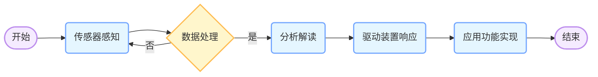

# 价值投资中的智能纺织品技术发展趋势

> 关键词：价值投资、智能纺织品技术、发展趋势、市场应用、技术创新

> 摘要：本文聚焦于价值投资视角下智能纺织品技术的发展趋势。首先介绍了智能纺织品技术的背景，包括目的和范围、预期读者等内容。详细阐述了智能纺织品的核心概念、相关算法原理、数学模型等基础知识。通过项目实战案例，展示了智能纺织品技术的实际应用。分析了智能纺织品在多个领域的实际应用场景，并推荐了学习、开发所需的工具和资源。最后总结了智能纺织品技术未来的发展趋势与挑战，为价值投资者和相关从业者提供了全面而深入的参考。

## 1. 背景介绍 
### 1.1 目的和范围
本文章旨在深入探讨价值投资领域中智能纺织品技术的发展趋势。从价值投资的角度出发，研究智能纺织品技术的现状、潜在的市场价值以及未来的发展方向。范围涵盖了智能纺织品技术的各个方面，包括其核心概念、算法原理、数学模型、实际应用场景等，同时分析这些技术如何影响投资决策以及市场的长期发展。

### 1.2 预期读者
本文预期读者主要包括价值投资者、纺织品行业从业者、技术研发人员、对智能纺织品技术感兴趣的研究人员以及相关领域的学生等。价值投资者可以从本文中获取有关智能纺织品技术的市场潜力和投资价值的信息；行业从业者可以了解技术发展趋势，为企业的战略规划提供参考；技术研发人员可以从中获取灵感，推动技术的创新和发展；研究人员和学生可以作为学习和研究的资料，深入了解智能纺织品技术的全貌。

### 1.3 文档结构概述
本文将按照以下结构进行阐述：首先介绍智能纺织品技术的背景信息，包括目的、预期读者和文档结构概述等。接着详细讲解智能纺织品的核心概念以及各概念之间的联系，并通过文本示意图和 Mermaid 流程图进行直观展示。然后深入分析核心算法原理和具体操作步骤，使用 Python 源代码进行详细阐述。同时介绍相关的数学模型和公式，并举例说明。通过项目实战，展示代码实际案例并进行详细解释。分析智能纺织品在不同领域的实际应用场景。推荐学习、开发所需的工具和资源，包括书籍、在线课程、开发工具等。最后总结智能纺织品技术未来的发展趋势与挑战，并提供常见问题的解答和扩展阅读参考资料。

### 1.4 术语表
#### 1.4.1 核心术语定义
- **智能纺织品**：是指将传感、驱动、信息处理等功能集成到纺织品中，使其具有感知外界环境变化并做出相应反应的能力的纺织品。例如，能够监测人体生理参数的智能运动服装，或者根据环境温度自动调节温度的智能家纺产品。
- **价值投资**：一种投资策略，强调通过对资产的内在价值进行评估，寻找价格低于其内在价值的投资机会，以获取长期的投资回报。在智能纺织品领域，价值投资关注的是技术的发展潜力、市场需求以及企业的盈利能力等因素。
- **传感器**：一种能够感知外界物理量、化学量或生物量等信息，并将其转换为电信号或其他形式信号的装置。在智能纺织品中，传感器用于感知人体的生理参数（如心率、体温等）、环境的温度、湿度等信息。
- **数据处理算法**：用于对传感器采集到的数据进行分析、处理和解读的算法。例如，通过对心率数据进行分析，可以判断人体的运动状态和健康状况。

#### 1.4.2 相关概念解释
- **可穿戴设备**：是指可以直接穿戴在身体上的设备，通常具有一定的计算和通信功能。智能纺织品可以作为可穿戴设备的一种形式，与传统的可穿戴设备相比，具有更好的舒适性和隐蔽性。
- **物联网（IoT）**：是指通过各种信息传感设备，如传感器、射频识别技术、全球定位系统等，将任何物品与互联网相连接，进行信息交换和通信，以实现智能化识别、定位、跟踪、监控和管理的一种网络。智能纺织品可以作为物联网的终端设备，通过与其他设备的连接，实现数据的共享和交互。

#### 1.4.3 缩略词列表
- **IoT**：Internet of Things，物联网
- **MEMS**：Micro-Electro-Mechanical Systems，微机电系统
- **NFC**：Near Field Communication，近场通信

## 2. 核心概念与联系 

### 核心概念原理
智能纺织品的核心概念基于将先进的技术与传统的纺织品相结合，实现纺织品的智能化。其原理主要涉及以下几个方面：
- **传感原理**：利用各种传感器来感知外界环境的变化或人体的生理参数。例如，使用压力传感器可以感知人体的运动状态，使用温度传感器可以监测环境的温度变化。传感器的工作原理基于物理、化学或生物效应，将外界的信号转换为电信号或其他可测量的信号。
- **驱动原理**：根据传感器感知到的信息，驱动装置可以做出相应的反应。例如，当温度传感器检测到环境温度较低时，加热装置可以启动，提高纺织品的温度。驱动装置通常采用电、热、光等能量形式来实现其功能。
- **信息处理原理**：传感器采集到的数据需要经过信息处理系统进行分析和解读。信息处理系统可以采用微处理器、单片机等设备，通过编写相应的算法来处理数据。例如，通过对心率数据进行分析，可以判断人体的运动强度和健康状况。

### 架构的文本示意图
智能纺织品的架构可以分为三个层次：感知层、传输层和应用层。
- **感知层**：主要由各种传感器组成，用于感知外界环境的变化或人体的生理参数。传感器可以直接集成到纺织品中，也可以通过可拆卸的方式与纺织品连接。
- **传输层**：负责将传感器采集到的数据传输到信息处理系统或其他设备。传输方式可以采用有线或无线通信技术，如蓝牙、Wi-Fi、NFC 等。
- **应用层**：根据处理后的数据，实现各种应用功能。例如，将心率数据显示在手机应用上，或者根据环境温度自动调节纺织品的温度。

### Mermaid 流程图


## 3. 核心算法原理 & 具体操作步骤 

### 核心算法原理
在智能纺织品中，常用的核心算法包括数据采集算法、数据处理算法和决策算法。

#### 数据采集算法
数据采集算法主要用于控制传感器的采样频率和数据传输。例如，对于心率传感器，为了准确测量心率，需要以一定的频率采集数据。以下是一个简单的 Python 代码示例，模拟心率传感器的数据采集：
```python
import time

# 模拟心率传感器
def heart_rate_sensor():
    import random
    return random.randint(60, 120)

# 数据采集函数
def data_collection(duration, sampling_rate):
    data = []
    num_samples = int(duration * sampling_rate)
    for i in range(num_samples):
        heart_rate = heart_rate_sensor()
        data.append(heart_rate)
        time.sleep(1 / sampling_rate)
    return data

# 采集数据 10 秒，采样频率为 1Hz
duration = 10
sampling_rate = 1
heart_rate_data = data_collection(duration, sampling_rate)
print("采集到的心率数据:", heart_rate_data)
```
#### 数据处理算法
数据处理算法用于对采集到的数据进行滤波、降噪、特征提取等操作。以心率数据为例，常用的滤波算法有移动平均滤波。以下是一个简单的 Python 代码示例：
```python
def moving_average_filter(data, window_size):
    filtered_data = []
    for i in range(len(data)):
        if i < window_size:
            filtered_data.append(sum(data[:i + 1]) / (i + 1))
        else:
            filtered_data.append(sum(data[i - window_size + 1:i + 1]) / window_size)
    return filtered_data

# 对采集到的心率数据进行移动平均滤波，窗口大小为 3
window_size = 3
filtered_heart_rate_data = moving_average_filter(heart_rate_data, window_size)
print("滤波后的心率数据:", filtered_heart_rate_data)
```
#### 决策算法
决策算法根据处理后的数据做出相应的决策。例如，当心率超过一定阈值时，发出警报。以下是一个简单的 Python 代码示例：
```python
def decision_algorithm(data, threshold):
    alerts = []
    for heart_rate in data:
        if heart_rate > threshold:
            alerts.append(1)
        else:
            alerts.append(0)
    return alerts

# 设置心率阈值为 100
threshold = 100
alerts = decision_algorithm(filtered_heart_rate_data, threshold)
print("警报信息:", alerts)
```

### 具体操作步骤
1. **传感器选择与集成**：根据智能纺织品的应用需求，选择合适的传感器，并将其集成到纺织品中。例如，对于运动监测智能服装，选择心率传感器、加速度传感器等。
2. **数据采集**：使用数据采集算法控制传感器的采样频率和数据传输，采集所需的数据。
3. **数据处理**：对采集到的数据进行滤波、降噪、特征提取等操作，提高数据的质量和可用性。
4. **决策与响应**：根据处理后的数据，使用决策算法做出相应的决策，并驱动装置做出响应。
5. **应用功能实现**：将处理后的数据和决策结果应用到具体的功能中，如显示数据、发出警报、调节温度等。

## 4. 数学模型和公式 & 详细讲解 & 举例说明 

### 数学模型和公式
#### 移动平均滤波公式
移动平均滤波是一种常用的平滑滤波方法，其公式为：
$$
y_n = \frac{1}{N} \sum_{i = 0}^{N - 1} x_{n - i}
$$
其中，$y_n$ 是滤波后的第 $n$ 个数据点，$x_{n - i}$ 是原始数据的第 $n - i$ 个数据点，$N$ 是窗口大小。

#### 心率计算公式
心率可以通过测量相邻两个心跳之间的时间间隔来计算。假设相邻两个心跳之间的时间间隔为 $T$（单位：秒），则心率 $HR$（单位：次/分钟）可以通过以下公式计算：
$$
HR = \frac{60}{T}
$$

### 详细讲解
#### 移动平均滤波
移动平均滤波的原理是通过计算一定窗口内数据的平均值来平滑数据，减少噪声的影响。窗口大小 $N$ 决定了滤波的效果，$N$ 越大，滤波后的曲线越平滑，但也会导致数据的响应速度变慢。

#### 心率计算
心率计算的原理是根据心跳的周期性，通过测量相邻两个心跳之间的时间间隔，将其转换为每分钟的心跳次数。在实际应用中，通常需要采集多个心跳间隔的数据，然后取平均值来提高心率计算的准确性。

### 举例说明
#### 移动平均滤波举例
假设原始心率数据为 $[70, 72, 75, 78, 80]$，窗口大小 $N = 3$。则滤波后的第一个数据点为：
$$
y_0 = \frac{70}{1} = 70
$$
第二个数据点为：
$$
y_1 = \frac{70 + 72}{2} = 71
$$
第三个数据点为：
$$
y_2 = \frac{70 + 72 + 75}{3} = 72.33
$$
第四个数据点为：
$$
y_3 = \frac{72 + 75 + 78}{3} = 75
$$
第五个数据点为：
$$
y_4 = \frac{75 + 78 + 80}{3} = 77.67
$$
所以，滤波后的心率数据为 $[70, 71, 72.33, 75, 77.67]$。

#### 心率计算举例
假设测量得到相邻两个心跳之间的时间间隔分别为 $0.8$ 秒、$0.9$ 秒、$0.85$ 秒。则平均时间间隔为：
$$
T = \frac{0.8 + 0.9 + 0.85}{3} = 0.85 \text{ 秒}
$$
根据心率计算公式，可得心率为：
$$
HR = \frac{60}{0.85} \approx 70.59 \text{ 次/分钟}
$$

## 5. 项目实战：代码实际案例和详细解释说明 

### 5.1  开发环境搭建
#### 硬件环境
- **传感器模块**：选择合适的传感器模块，如心率传感器、温度传感器等。可以使用市面上常见的传感器开发板，如 Arduino 传感器扩展板。
- **开发板**：选择一款适合的开发板，如 Arduino Uno、Raspberry Pi 等。这些开发板具有丰富的接口和强大的计算能力，可以方便地连接传感器和进行数据处理。
- **纺织品**：选择合适的纺织品作为载体，将传感器和开发板集成到纺织品中。可以使用普通的织物或具有特殊功能的织物，如导电织物。

#### 软件环境
- **开发工具**：选择合适的开发工具，如 Arduino IDE、Python 开发环境等。Arduino IDE 可以方便地进行 Arduino 开发板的编程，Python 开发环境可以进行数据处理和算法实现。
- **库文件**：根据需要安装相应的库文件，如传感器驱动库、通信库等。这些库文件可以简化开发过程，提高开发效率。

### 5.2  源代码详细实现和代码解读
以下是一个基于 Arduino 和 Python 的智能纺织品项目示例，实现心率监测和数据显示功能。

#### Arduino 代码
```cpp
#include <Wire.h>
#include <Adafruit_MCP9808.h>
#include <MAX30105.h>

MAX30105 particleSensor;
Adafruit_MCP9808 tempsensor;

void setup() {
  Serial.begin(115200);
  
  // 初始化心率传感器
  if (!particleSensor.begin(Wire, I2C_SPEED_FAST)) {
    Serial.println("MAX30105 was not found. Please check wiring/power.");
    while (1);
  }
  particleSensor.setup();
  particleSensor.setPulseAmplitudeRed(0x0A);
  particleSensor.setPulseAmplitudeGreen(0);
  
  // 初始化温度传感器
  if (!tempsensor.begin()) {
    Serial.println("Couldn't find MCP9808! Check your connections and I2C address!");
    while (1);
  }
}

void loop() {
  // 读取心率数据
  uint32_t irValue = particleSensor.getIR();
  if (irValue > 50000) {
    byte pulseRate = particleSensor.getHeartRate();
    Serial.print("Heart Rate: ");
    Serial.println(pulseRate);
  }
  
  // 读取温度数据
  float temperature = tempsensor.readTempC();
  Serial.print("Temperature: ");
  Serial.println(temperature);
  
  delay(1000);
}
```
**代码解读**：
- `setup()` 函数：初始化串口通信、心率传感器和温度传感器。如果传感器初始化失败，会输出错误信息并进入无限循环。
- `loop()` 函数：循环读取心率数据和温度数据，并通过串口发送到计算机。如果心率传感器检测到有效信号，则读取心率值并输出；同时读取温度传感器的温度值并输出。每次读取数据后，延迟 1 秒。

#### Python 代码
```python
import serial
import matplotlib.pyplot as plt
from matplotlib.animation import FuncAnimation

# 打开串口
ser = serial.Serial('COM3', 115200)

# 初始化数据列表
heart_rate_data = []
temperature_data = []

# 创建图形
fig, axs = plt.subplots(2)
fig.suptitle('Heart Rate and Temperature Monitoring')

# 更新函数
def update(frame):
    try:
        # 读取串口数据
        line = ser.readline().decode('utf-8').strip()
        if "Heart Rate" in line:
            heart_rate = int(line.split(": ")[1])
            heart_rate_data.append(heart_rate)
            axs[0].clear()
            axs[0].plot(heart_rate_data)
            axs[0].set_ylabel('Heart Rate')
        elif "Temperature" in line:
            temperature = float(line.split(": ")[1])
            temperature_data.append(temperature)
            axs[1].clear()
            axs[1].plot(temperature_data)
            axs[1].set_ylabel('Temperature')
    except Exception as e:
        print(e)

# 动画更新
ani = FuncAnimation(fig, update, interval=1000)

# 显示图形
plt.show()
```
**代码解读**：
- 打开串口通信，连接到 Arduino 开发板。
- 初始化心率数据和温度数据列表。
- 创建一个包含两个子图的图形，分别用于显示心率数据和温度数据。
- `update()` 函数：循环读取串口数据，解析心率数据和温度数据，并更新图形。如果读取到心率数据，则将其添加到心率数据列表中，并更新心率子图；如果读取到温度数据，则将其添加到温度数据列表中，并更新温度子图。
- 使用 `FuncAnimation()` 函数实现动画更新，每隔 1 秒调用一次 `update()` 函数。
- 最后显示图形。

### 5.3  代码解读与分析
#### Arduino 代码分析
- **传感器初始化**：在 `setup()` 函数中，首先初始化串口通信，然后分别初始化心率传感器和温度传感器。如果传感器初始化失败，会输出错误信息并进入无限循环，确保程序的稳定性。
- **数据读取**：在 `loop()` 函数中，循环读取心率数据和温度数据。通过判断心率传感器的红外值是否大于 50000，来确定是否检测到有效信号。如果检测到有效信号，则读取心率值并输出；同时读取温度传感器的温度值并输出。每次读取数据后，延迟 1 秒，避免数据读取过于频繁。

#### Python 代码分析
- **串口通信**：使用 `serial.Serial()` 函数打开串口通信，连接到 Arduino 开发板。
- **数据解析**：在 `update()` 函数中，循环读取串口数据，解析心率数据和温度数据。通过判断数据中是否包含 "Heart Rate" 或 "Temperature" 关键字，来确定读取的数据类型。如果读取到心率数据，则将其转换为整数并添加到心率数据列表中；如果读取到温度数据，则将其转换为浮点数并添加到温度数据列表中。
- **图形更新**：使用 `matplotlib` 库创建图形，并使用 `FuncAnimation()` 函数实现动画更新。每隔 1 秒调用一次 `update()` 函数，更新图形中的数据。

## 6. 实际应用场景 
### 医疗保健领域
- **健康监测**：智能纺织品可以集成各种生理传感器，如心率传感器、血压传感器、体温传感器等，实时监测人体的生理参数。例如，智能运动服装可以监测运动员的心率、运动强度等信息，为运动员的训练和健康管理提供数据支持；智能睡衣可以监测睡眠者的心率、呼吸等信息，帮助用户了解自己的睡眠质量。
- **疾病诊断**：通过对长期监测的生理数据进行分析，可以辅助医生进行疾病诊断。例如，通过监测心率变异性可以判断心脏疾病的风险；通过监测体温变化可以早期发现感染性疾病。
- **康复治疗**：智能纺织品可以用于康复治疗，如智能压力袜可以通过调节压力，促进血液循环，帮助患者康复；智能康复服可以监测患者的运动状态，为康复训练提供指导。

### 运动健身领域
- **运动监测**：智能运动服装可以实时监测运动员的运动状态，如运动强度、运动距离、运动速度等。例如，智能跑鞋可以监测跑步者的步幅、步频等信息，帮助跑步者优化跑步姿势，提高运动效果。
- **运动安全**：智能纺织品可以提供运动安全保障，如智能骑行服可以集成反光材料和警示灯，提高骑行者的可见性，减少交通事故的发生；智能滑雪服可以监测滑雪者的速度和姿态，当滑雪者发生危险时，及时发出警报。
- **运动训练**：智能纺织品可以根据运动员的运动状态和目标，提供个性化的训练方案。例如，智能健身衣可以根据用户的运动强度和心率，调整训练难度，提高训练效果。

### 军事国防领域
- **士兵健康监测**：智能军装可以集成各种生理传感器，实时监测士兵的生理参数，如心率、血压、体温等。当士兵出现健康问题时，及时发出警报，为士兵的健康保障提供支持。
- **战场环境监测**：智能纺织品可以集成环境传感器，监测战场环境的温度、湿度、气压等信息。例如，智能帐篷可以根据环境温度自动调节内部温度，为士兵提供舒适的居住环境。
- **伪装与隐身**：智能纺织品可以实现伪装与隐身功能，如智能迷彩服可以根据环境颜色自动调整颜色，提高士兵的隐蔽性；智能隐身衣可以通过反射或吸收电磁波，降低士兵的雷达反射面积，实现隐身效果。

### 智能家居领域
- **环境监测**：智能家纺产品可以集成环境传感器，监测室内环境的温度、湿度、空气质量等信息。例如，智能窗帘可以根据室内光照强度自动调节开合程度；智能床垫可以根据人体的睡眠姿势自动调整硬度，提高睡眠舒适度。
- **家电控制**：智能纺织品可以与智能家居系统连接，实现家电的远程控制。例如，智能沙发可以通过触摸或语音控制家电设备，如电视、空调、灯光等。
- **能源管理**：智能纺织品可以用于能源管理，如智能窗户可以根据室外光照强度自动调节透光率，减少室内能源消耗；智能地毯可以通过收集人体运动产生的能量，为智能家居设备供电。

## 7. 工具和资源推荐
### 7.1 学习资源推荐
#### 7.1.1 书籍推荐
- 《智能纺织品技术与应用》：本书系统介绍了智能纺织品的基本概念、技术原理和应用领域，是学习智能纺织品技术的入门书籍。
- 《可穿戴设备设计与开发》：本书涵盖了可穿戴设备的设计、开发、测试等方面的知识，对于理解智能纺织品作为可穿戴设备的一种形式具有重要的参考价值。
- 《传感器技术基础》：本书详细介绍了各种传感器的工作原理、性能特点和应用场景，是学习智能纺织品中传感器技术的重要参考书籍。

#### 7.1.2 在线课程
- Coursera 上的“智能纺织品技术与创新”课程：该课程由知名高校的教授授课，内容涵盖智能纺织品的技术原理、设计方法和应用案例等方面。
- edX 上的“可穿戴计算与健康监测”课程：该课程介绍了可穿戴计算技术在健康监测领域的应用，包括传感器技术、数据处理算法和系统设计等方面的知识。
- Udemy 上的“传感器技术与应用”课程：该课程详细讲解了各种传感器的工作原理和应用场景，通过实际案例让学员掌握传感器技术的应用方法。

#### 7.1.3 技术博客和网站
- IEEE Spectrum：该网站是电气和电子工程师协会（IEEE）的官方网站，提供了大量关于智能纺织品、可穿戴设备等领域的最新技术文章和研究成果。
- TechCrunch：该网站是一家知名的科技媒体，报道了智能纺织品、可穿戴设备等领域的最新产品和创业公司的动态。
- 中国智能纺织品网：该网站是国内专注于智能纺织品领域的专业网站，提供了智能纺织品的技术资讯、市场动态、产品展示等方面的信息。

### 7.2 开发工具框架推荐
#### 7.2.1 IDE和编辑器
- Arduino IDE：是一款专门用于 Arduino 开发板编程的集成开发环境，具有简单易用、功能强大等特点。
- PyCharm：是一款专业的 Python 集成开发环境，提供了代码编辑、调试、版本控制等功能，适合用于智能纺织品的数据处理和算法实现。
- Visual Studio Code：是一款轻量级的代码编辑器，支持多种编程语言和插件扩展，可用于智能纺织品的开发和调试。

#### 7.2.2 调试和性能分析工具
- Serial Monitor：是 Arduino IDE 自带的串口调试工具，可以方便地查看 Arduino 开发板发送的串口数据。
- PySerial：是 Python 的串口通信库，可以用于 Python 程序与 Arduino 开发板之间的串口通信调试。
- Profiler：是 Python 的性能分析工具，可以分析 Python 程序的性能瓶颈，提高程序的运行效率。

#### 7.2.3 相关框架和库
- TensorFlow：是一款开源的机器学习框架，可用于智能纺织品的数据处理和算法实现，如心率预测、运动状态识别等。
- OpenCV：是一款开源的计算机视觉库，可用于智能纺织品的图像识别和处理，如服装图案识别、人体姿态检测等。
- MQTT：是一种轻量级的消息传输协议，可用于智能纺织品与物联网平台之间的数据通信。

### 7.3 相关论文著作推荐
#### 7.3.1 经典论文
- "A Review of Smart Textiles for Healthcare Applications"：该论文对智能纺织品在医疗保健领域的应用进行了全面的综述，分析了智能纺织品的技术现状、应用案例和发展趋势。
- "Wearable Sensors for Monitoring Physiological Parameters"：该论文介绍了可穿戴传感器在生理参数监测方面的应用，包括传感器技术、数据处理算法和系统设计等方面的知识。
- "Smart Textiles: A New Generation of Functional Materials"：该论文探讨了智能纺织品作为新一代功能材料的发展前景和应用潜力，分析了智能纺织品的技术挑战和解决方案。

#### 7.3.2 最新研究成果
- 每年在 IEEE International Conference on Wearable and Implantable Body Sensor Networks（BSN）、ACM International Conference on Ubiquitous Computing（UbiComp）等会议上发表的关于智能纺织品、可穿戴设备等领域的最新研究成果。
- 在《Advanced Materials》、《Nature Materials》等顶级学术期刊上发表的关于智能纺织品材料、传感器技术等方面的最新研究论文。

#### 7.3.3 应用案例分析
- 各大科技公司和研究机构发布的智能纺织品应用案例报告，如 Google 的智能眼镜、Apple 的 Apple Watch 等产品的技术分析和应用案例。
- 行业研究机构发布的智能纺织品市场研究报告，分析了智能纺织品在不同领域的应用现状和市场前景。

## 8. 总结：未来发展趋势与挑战
### 未来发展趋势
#### 技术创新
- **材料创新**：未来智能纺织品将采用更加先进的材料，如纳米材料、生物材料等，提高纺织品的性能和功能。例如，纳米材料可以提高传感器的灵敏度和稳定性；生物材料可以实现纺织品的生物相容性和可降解性。
- **传感器技术创新**：传感器将朝着更小、更灵敏、更节能的方向发展。例如，微机电系统（MEMS）传感器可以实现传感器的微型化和集成化；光学传感器可以实现对多种物理量的同时测量。
- **数据处理和算法创新**：随着人工智能和机器学习技术的发展，智能纺织品将具备更强大的数据处理和分析能力。例如，通过深度学习算法可以实现对生理数据的精准分析和疾病预测。

#### 应用拓展
- **医疗保健领域拓展**：智能纺织品将在医疗保健领域发挥更加重要的作用，如远程医疗、个性化医疗等。例如，智能纺织品可以实现对患者的长期健康监测和远程诊断，为患者提供更加便捷的医疗服务。
- **消费市场拓展**：随着消费者对健康和生活品质的关注度不断提高，智能纺织品将在消费市场得到更广泛的应用。例如，智能运动服装、智能家纺产品等将成为消费者的热门选择。
- **工业和军事领域拓展**：智能纺织品将在工业和军事领域得到更多的应用，如工业监测、军事侦察等。例如，智能纺织品可以用于监测工业设备的运行状态，提高工业生产的安全性和效率；智能军装可以提高士兵的战斗力和生存能力。

#### 产业融合
- **与物联网融合**：智能纺织品将与物联网技术深度融合，实现设备之间的互联互通和数据共享。例如，智能纺织品可以与智能家居系统、智能手机等设备连接，实现远程控制和数据交互。
- **与时尚产业融合**：智能纺织品将与时尚产业相结合，开发出更加美观、舒适的智能时尚产品。例如，智能服装可以实现个性化定制，根据用户的喜好和需求进行设计。
- **与医疗产业融合**：智能纺织品将与医疗产业深度合作，共同开发医疗保健产品和解决方案。例如，智能纺织品可以与医疗机构合作，开展临床试验和研究，推动智能纺织品在医疗领域的应用。

### 挑战
#### 技术挑战
- **传感器集成难题**：将传感器集成到纺织品中需要解决传感器与纺织品的兼容性、稳定性和可靠性等问题。例如，传感器的尺寸和重量可能会影响纺织品的舒适度和外观；传感器在纺织品中的安装和固定方式也需要进一步优化。
- **数据安全与隐私保护**：智能纺织品采集的大量个人生理数据涉及到用户的隐私和安全问题。如何保障数据的安全传输和存储，防止数据泄露和滥用，是智能纺织品技术面临的重要挑战。
- **能源供应问题**：智能纺织品需要持续的能源供应来维持其正常运行。目前，大多数智能纺织品采用电池供电，存在电池续航时间短、充电不便等问题。如何开发高效、可持续的能源供应技术，是智能纺织品技术发展的关键。

#### 市场挑战
- **消费者认知度和接受度低**：由于智能纺织品是一种新兴的产品，消费者对其认知度和接受度相对较低。如何提高消费者对智能纺织品的了解和信任，推广智能纺织品的应用，是市场面临的主要挑战。
- **产品价格较高**：目前，智能纺织品的生产成本较高，导致产品价格也相对较高。如何降低生产成本，提高产品的性价比，是智能纺织品进入大众市场的关键。
- **标准和规范缺失**：智能纺织品作为一种新兴的产品，目前还缺乏统一的标准和规范。如何制定相关的标准和规范，保障产品的质量和安全性，是智能纺织品市场健康发展的重要保障。

## 9. 附录：常见问题与解答
### 智能纺织品的使用寿命有多长？
智能纺织品的使用寿命受到多种因素的影响，如传感器的质量、使用环境、维护方式等。一般来说，传感器的使用寿命在 1 - 3 年左右，纺织品的使用寿命则取决于其材质和使用频率。为了延长智能纺织品的使用寿命，建议按照产品说明书进行正确的使用和维护。

### 智能纺织品是否安全？
智能纺织品在设计和生产过程中会充分考虑安全性问题。传感器和电子元件通常采用低电压、低功耗的设计，不会对人体造成伤害。同时，产品会经过严格的质量检测和认证，确保符合相关的安全标准。但是，在使用智能纺织品时，仍然需要注意正确的使用方法，避免因不当使用而导致安全问题。

### 智能纺织品的数据如何保护？
智能纺织品的数据保护是一个重要的问题。在数据传输过程中，通常会采用加密技术，确保数据的安全传输。在数据存储方面，会采用安全的服务器和数据库，对数据进行加密存储。同时，企业会遵守相关的法律法规，严格保护用户的隐私和数据安全。用户也可以通过设置密码、权限等方式，进一步保护自己的数据安全。

### 智能纺织品的清洗和保养方法有哪些？
不同类型的智能纺织品清洗和保养方法可能会有所不同。一般来说，在清洗前需要将传感器和电子元件取出，避免水洗。对于纺织品部分，可以按照普通纺织品的清洗方法进行清洗。在保养方面，建议避免阳光直射、高温烘烤等，保持纺织品的干燥和清洁。具体的清洗和保养方法可以参考产品说明书。

## 10. 扩展阅读 & 参考资料
### 扩展阅读
- 《物联网：技术、应用与产业发展》：本书介绍了物联网的技术原理、应用场景和产业发展趋势，对于理解智能纺织品与物联网的融合具有重要的参考价值。
- 《人工智能：现代方法》：本书是人工智能领域的经典教材，介绍了人工智能的基本概念、算法和应用，对于理解智能纺织品中的数据处理和算法应用具有重要的参考价值。
- 《材料科学与工程基础》：本书介绍了材料科学的基本概念、材料的性能和应用，对于理解智能纺织品中的材料创新具有重要的参考价值。

### 参考资料
- IEEE Xplore Digital Library：该数据库收录了大量关于智能纺织品、可穿戴设备等领域的学术论文和会议文章。
- ACM Digital Library：该数据库提供了计算机科学领域的学术文献，包括智能纺织品的数据处理、算法实现等方面的研究成果。
- 中国知网：该数据库收录了国内关于智能纺织品的学术论文、研究报告等文献资料。

作者：AI天才研究院/AI Genius Institute & 禅与计算机程序设计艺术 /Zen And The Art of Computer Programming