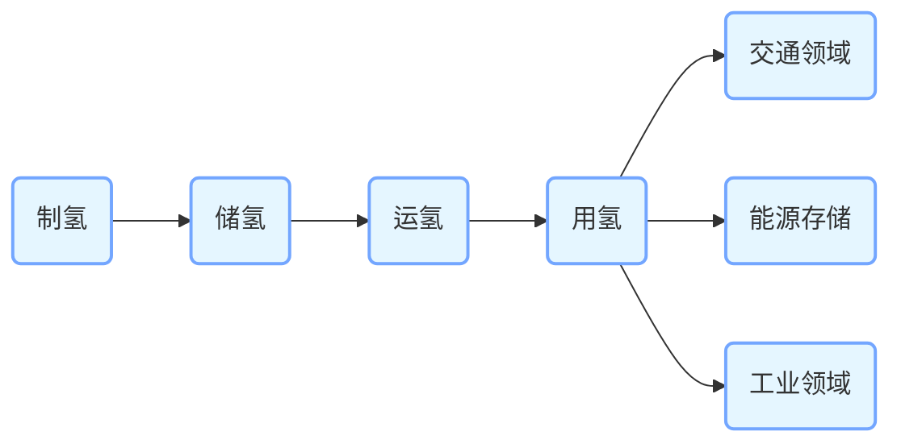

# 价值投资中的氢能源产业链分析

> 关键词：价值投资、氢能源产业链、制氢技术、储氢运输、应用场景

> 摘要：本文聚焦于价值投资视角下的氢能源产业链分析。首先介绍了研究的背景、目的、预期读者、文档结构和相关术语。接着深入剖析氢能源产业链的核心概念与联系，包括制氢、储氢、运氢和用氢等环节及其相互关系。详细阐述了核心算法原理，如制氢成本计算，并给出Python代码示例。通过数学模型和公式进一步分析产业链中的关键指标，如能量转换效率。在项目实战部分，搭建开发环境，给出源代码并进行解读。探讨了氢能源产业链在交通、能源存储等方面的实际应用场景。推荐了学习资源、开发工具框架和相关论文著作。最后总结了氢能源产业链的未来发展趋势与挑战，并对常见问题进行解答，为价值投资者提供全面深入的氢能源产业链分析。

## 1. 背景介绍 
### 1.1 目的和范围
随着全球对清洁能源的需求不断增长，氢能源作为一种具有巨大潜力的能源载体，受到了广泛关注。本分析的目的在于从价值投资的角度，全面深入地研究氢能源产业链，包括产业链的各个环节、技术发展趋势、市场前景以及潜在的投资机会和风险。范围涵盖了氢能源产业链的上游（制氢）、中游（储氢、运氢）和下游（用氢），以及相关的技术研发、政策环境等方面。

### 1.2 预期读者
本文预期读者主要包括对氢能源产业感兴趣的价值投资者，包括个人投资者、机构投资者等。同时，也适用于从事氢能源技术研究、产业规划、政策制定等领域的专业人士，以及希望了解氢能源产业发展动态的普通读者。

### 1.3 文档结构概述
本文将按照以下结构进行阐述：首先介绍氢能源产业链的核心概念与联系，包括各个环节的原理和相互关系；接着详细讲解核心算法原理和具体操作步骤，并给出Python代码示例；然后通过数学模型和公式对产业链中的关键指标进行分析；在项目实战部分，搭建开发环境，给出源代码并进行解读；探讨氢能源产业链的实际应用场景；推荐相关的学习资源、开发工具框架和论文著作；最后总结未来发展趋势与挑战，解答常见问题，并提供扩展阅读和参考资料。

### 1.4 术语表
#### 1.4.1 核心术语定义
- **氢能源**：以氢气为载体的一种二次能源，具有高能量密度、无污染等优点。
- **制氢**：通过各种技术手段将含氢物质转化为氢气的过程。
- **储氢**：将氢气储存起来，以便在需要时使用的技术。
- **运氢**：将氢气从生产地运输到使用地的过程。
- **用氢**：将氢气应用于各个领域，如交通、能源存储等。

#### 1.4.2 相关概念解释
- **灰氢**：通过化石燃料（如煤炭、天然气）制取的氢气，制取过程中会产生大量的碳排放。
- **蓝氢**：在灰氢制取过程中，采用碳捕集、利用与封存（CCUS）技术，减少碳排放后得到的氢气。
- **绿氢**：通过可再生能源（如太阳能、风能、水能）电解水制取的氢气，制取过程中几乎不产生碳排放。

#### 1.4.3 缩略词列表
- **CCUS**：Carbon Capture, Utilization and Storage，碳捕集、利用与封存。
- **PEM**：Proton Exchange Membrane，质子交换膜。
- **SOEC**：Solid Oxide Electrolysis Cell，固体氧化物电解池。

## 2. 核心概念与联系 

氢能源产业链主要由制氢、储氢、运氢和用氢四个核心环节组成，各环节相互关联、相互影响，形成一个完整的产业体系。以下是氢能源产业链的文本示意图：

|环节|描述|
|----|----|
|制氢|通过不同技术将含氢物质转化为氢气，包括化石燃料制氢、电解水制氢、生物质制氢等。|
|储氢|将制取的氢气储存起来，以保证氢气的供应稳定性和安全性，常见的储氢方式有高压气态储氢、低温液态储氢、固态储氢等。|
|运氢|将储存的氢气运输到使用地点，运输方式包括气态运输、液态运输、管道运输等。|
|用氢|将氢气应用于各个领域，如交通运输（燃料电池汽车、氢内燃机汽车等）、能源存储（储能电站）、工业领域（化工原料、冶金等）。|

下面是用Mermaid绘制的氢能源产业链流程图：


从流程图可以看出，制氢是产业链的起点，为后续的储氢、运氢和用氢提供氢气来源。储氢是保证氢气稳定供应的关键环节，不同的储氢方式会影响运氢的效率和成本。运氢将氢气从生产地运输到使用地，其运输方式的选择取决于氢气的需求量、运输距离等因素。用氢则是产业链的终端，将氢气转化为实际的应用价值，不同的应用领域对氢气的质量、压力等要求也有所不同。

## 3. 核心算法原理 & 具体操作步骤 

在氢能源产业链中，制氢成本是一个关键指标，下面以电解水制氢为例，详细讲解制氢成本的计算原理和具体操作步骤，并给出Python代码示例。

### 制氢成本计算原理
电解水制氢的成本主要由电费、设备投资成本、运维成本等组成。其计算公式如下：

$C_{total} = C_{electricity} + C_{investment} + C_{maintenance}$

其中，$C_{total}$ 为制氢总成本，$C_{electricity}$ 为电费成本，$C_{investment}$ 为设备投资成本分摊到每立方米氢气的费用，$C_{maintenance}$ 为运维成本分摊到每立方米氢气的费用。

- **电费成本计算**：
$C_{electricity} = P \times E \times C_{e}$

其中，$P$ 为电解槽的功率（kW），$E$ 为制取每立方米氢气所需的电量（kWh/m³），$C_{e}$ 为电价（元/kWh）。

- **设备投资成本分摊计算**：
$C_{investment} = \frac{I}{N \times V}$

其中，$I$ 为设备总投资（元），$N$ 为设备的使用寿命（年），$V$ 为每年制取氢气的体积（m³/年）。

- **运维成本分摊计算**：
$C_{maintenance} = \frac{M}{V}$

其中，$M$ 为每年的运维成本（元）。

### 具体操作步骤
1. 确定电解槽的功率 $P$、制取每立方米氢气所需的电量 $E$、电价 $C_{e}$、设备总投资 $I$、设备的使用寿命 $N$、每年制取氢气的体积 $V$ 和每年的运维成本 $M$。
2. 根据上述公式分别计算电费成本 $C_{electricity}$、设备投资成本分摊 $C_{investment}$ 和运维成本分摊 $C_{maintenance}$。
3. 将三者相加得到制氢总成本 $C_{total}$。

### Python代码示例
```python
# 输入参数
P = 100  # 电解槽功率 (kW)
E = 5  # 制取每立方米氢气所需电量 (kWh/m³)
C_e = 0.5  # 电价 (元/kWh)
I = 1000000  # 设备总投资 (元)
N = 10  # 设备使用寿命 (年)
V = 10000  # 每年制取氢气的体积 (m³/年)
M = 10000  # 每年的运维成本 (元)

# 计算电费成本
C_electricity = P * E * C_e

# 计算设备投资成本分摊
C_investment = I / (N * V)

# 计算运维成本分摊
C_maintenance = M / V

# 计算制氢总成本
C_total = C_electricity + C_investment + C_maintenance

print(f"制氢总成本: {C_total} 元/m³")
```

### 代码解释
1. 首先定义了输入参数，包括电解槽功率、制取每立方米氢气所需电量、电价、设备总投资、设备使用寿命、每年制取氢气的体积和每年的运维成本。
2. 根据上述公式分别计算电费成本、设备投资成本分摊和运维成本分摊。
3. 将三者相加得到制氢总成本，并使用 `print` 函数输出结果。

## 4. 数学模型和公式 & 详细讲解 & 举例说明 

### 能量转换效率模型
在氢能源产业链中，能量转换效率是一个重要的指标，它反映了从能源输入到氢气输出或氢气应用过程中的能量利用效率。下面以电解水制氢为例，介绍能量转换效率的数学模型和公式。

#### 公式定义
电解水制氢的能量转换效率 $\eta_{electrolysis}$ 可以用以下公式表示：

$$\eta_{electrolysis} = \frac{H_{HV} \times m_{H_2}}{E_{input}}$$

其中：
- $\eta_{electrolysis}$ 是电解水制氢的能量转换效率，通常以百分比表示。
- $H_{HV}$ 是氢气的高位发热量，单位为 $kJ/kg$。氢气的高位发热量约为 $141,800 kJ/kg$。
- $m_{H_2}$ 是制取的氢气质量，单位为 $kg$。
- $E_{input}$ 是输入的电能，单位为 $kJ$。

#### 详细讲解
这个公式的含义是，将制取的氢气所蕴含的能量（通过氢气质量和高位发热量计算得到）与输入的电能进行比较，得到的比值就是能量转换效率。能量转换效率越高，说明在电解水制氢过程中，电能转化为氢气化学能的比例越高，能源利用越有效。

#### 举例说明
假设一个电解水制氢装置输入的电能为 $1000 kWh$，换算成 $kJ$ 为：

$E_{input} = 1000 \times 3600 = 3.6 \times 10^6 kJ$

该装置制取的氢气质量为 $20 kg$，则根据公式计算能量转换效率：

$\eta_{electrolysis} = \frac{141800 \times 20}{3.6 \times 10^6} \approx 0.7878$

将结果转化为百分比，能量转换效率约为 $78.78\%$。

### 氢气存储密度模型
氢气的存储是氢能源产业链中的关键环节，存储密度是衡量氢气存储技术优劣的重要指标。下面介绍高压气态储氢和低温液态储氢的存储密度模型。

#### 高压气态储氢
高压气态储氢是将氢气压缩到高压容器中进行存储。其存储密度 $\rho_{gas}$ 可以用理想气体状态方程进行近似计算：

$$\rho_{gas} = \frac{P \times M}{R \times T}$$

其中：
- $\rho_{gas}$ 是高压气态氢气的存储密度，单位为 $kg/m^3$。
- $P$ 是氢气的压力，单位为 $Pa$。
- $M$ 是氢气的摩尔质量，约为 $2 \times 10^{-3} kg/mol$。
- $R$ 是理想气体常数，约为 $8.314 J/(mol \cdot K)$。
- $T$ 是氢气的温度，单位为 $K$。

#### 详细讲解
该公式基于理想气体状态方程，描述了在一定压力和温度下，氢气的密度与压力成正比，与温度成反比。在实际应用中，由于氢气在高压下会偏离理想气体状态，需要使用更精确的状态方程进行修正。

#### 举例说明
假设氢气存储在压力为 $35 MPa$（$35 \times 10^6 Pa$）、温度为 $298 K$ 的容器中，则根据公式计算存储密度：

$\rho_{gas} = \frac{35 \times 10^6 \times 2 \times 10^{-3}}{8.314 \times 298} \approx 28.2 kg/m^3$

#### 低温液态储氢
低温液态储氢是将氢气冷却到沸点以下，使其变为液态进行存储。液态氢气的密度 $\rho_{liquid}$ 相对稳定，在标准大气压下约为 $70.8 kg/m^3$。

### 燃料电池效率模型
燃料电池是氢能源在交通等领域应用的关键部件，其效率 $\eta_{fuel\_cell}$ 可以用以下公式表示：

$$\eta_{fuel\_cell} = \frac{P_{out}}{H_{HV} \times m_{H_2}}$$

其中：
- $\eta_{fuel\_cell}$ 是燃料电池的效率，通常以百分比表示。
- $P_{out}$ 是燃料电池输出的电功率，单位为 $W$。
- $H_{HV}$ 是氢气的高位发热量，单位为 $kJ/kg$。
- $m_{H_2}$ 是燃料电池消耗的氢气质量，单位为 $kg$。

#### 详细讲解
该公式表示燃料电池将氢气的化学能转化为电能的效率。输出的电功率与氢气所蕴含的能量的比值越高，说明燃料电池的效率越高。

#### 举例说明
假设一个燃料电池输出的电功率为 $100 kW$，在一小时内消耗的氢气质量为 $1 kg$，则根据公式计算效率：

$\eta_{fuel\_cell} = \frac{100 \times 1000 \times 3600}{141800 \times 1000} \approx 0.254$

将结果转化为百分比，燃料电池的效率约为 $25.4\%$。

## 5. 项目实战：代码实际案例和详细解释说明 

### 5.1  开发环境搭建
为了实现氢能源产业链相关的项目实战，我们选择使用Python作为开发语言，以下是开发环境搭建的具体步骤：

#### 安装Python
首先，你需要从Python官方网站（https://www.python.org/downloads/）下载并安装Python。根据你的操作系统选择合适的版本，安装过程中注意勾选“Add Python to PATH”选项，以便在命令行中可以直接使用Python。

#### 创建虚拟环境
为了避免不同项目之间的依赖冲突，建议使用虚拟环境。在命令行中执行以下命令创建并激活虚拟环境：

```bash
# 创建虚拟环境
python -m venv hydrogen_env

# 激活虚拟环境（Windows）
hydrogen_env\Scripts\activate

# 激活虚拟环境（Linux/Mac）
source hydrogen_env/bin/activate
```

#### 安装必要的库
在虚拟环境中，安装项目所需的库，如 `numpy`、`pandas` 等：

```bash
pip install numpy pandas
```

### 5.2  源代码详细实现和代码解读
以下是一个综合的代码示例，结合了制氢成本计算、能量转换效率计算和氢气存储密度计算：

```python
import numpy as np

# 制氢成本计算函数
def calculate_hydrogen_production_cost(P, E, C_e, I, N, V, M):
    """
    计算电解水制氢的总成本
    :param P: 电解槽功率 (kW)
    :param E: 制取每立方米氢气所需电量 (kWh/m³)
    :param C_e: 电价 (元/kWh)
    :param I: 设备总投资 (元)
    :param N: 设备使用寿命 (年)
    :param V: 每年制取氢气的体积 (m³/年)
    :param M: 每年的运维成本 (元)
    :return: 制氢总成本 (元/m³)
    """
    # 计算电费成本
    C_electricity = P * E * C_e
    # 计算设备投资成本分摊
    C_investment = I / (N * V)
    # 计算运维成本分摊
    C_maintenance = M / V
    # 计算制氢总成本
    C_total = C_electricity + C_investment + C_maintenance
    return C_total

# 能量转换效率计算函数
def calculate_energy_conversion_efficiency(m_H2, E_input):
    """
    计算电解水制氢的能量转换效率
    :param m_H2: 制取的氢气质量 (kg)
    :param E_input: 输入的电能 (kJ)
    :return: 能量转换效率
    """
    H_HV = 141800  # 氢气的高位发热量 (kJ/kg)
    efficiency = (H_HV * m_H2) / E_input
    return efficiency

# 高压气态储氢存储密度计算函数
def calculate_gas_storage_density(P, T):
    """
    计算高压气态氢气的存储密度
    :param P: 氢气的压力 (Pa)
    :param T: 氢气的温度 (K)
    :return: 高压气态氢气的存储密度 (kg/m³)
    """
    M = 2e-3  # 氢气的摩尔质量 (kg/mol)
    R = 8.314  # 理想气体常数 (J/(mol·K))
    density = (P * M) / (R * T)
    return density

# 输入参数
P = 100  # 电解槽功率 (kW)
E = 5  # 制取每立方米氢气所需电量 (kWh/m³)
C_e = 0.5  # 电价 (元/kWh)
I = 1000000  # 设备总投资 (元)
N = 10  # 设备使用寿命 (年)
V = 10000  # 每年制取氢气的体积 (m³/年)
M = 10000  # 每年的运维成本 (元)
m_H2 = 20  # 制取的氢气质量 (kg)
E_input = 1000 * 3600  # 输入的电能 (kJ)
P_gas = 35e6  # 氢气的压力 (Pa)
T_gas = 298  # 氢气的温度 (K)

# 计算制氢成本
production_cost = calculate_hydrogen_production_cost(P, E, C_e, I, N, V, M)
print(f"制氢总成本: {production_cost} 元/m³")

# 计算能量转换效率
energy_efficiency = calculate_energy_conversion_efficiency(m_H2, E_input)
print(f"能量转换效率: {energy_efficiency * 100:.2f}%")

# 计算高压气态储氢存储密度
gas_density = calculate_gas_storage_density(P_gas, T_gas)
print(f"高压气态氢气存储密度: {gas_density:.2f} kg/m³")
```

### 5.3  代码解读与分析
#### 函数定义部分
- `calculate_hydrogen_production_cost` 函数：该函数接受电解槽功率、制取每立方米氢气所需电量、电价、设备总投资、设备使用寿命、每年制取氢气的体积和每年的运维成本作为输入参数，根据制氢成本计算原理，计算并返回制氢总成本。
- `calculate_energy_conversion_efficiency` 函数：该函数接受制取的氢气质量和输入的电能作为输入参数，根据能量转换效率的公式，计算并返回能量转换效率。
- `calculate_gas_storage_density` 函数：该函数接受氢气的压力和温度作为输入参数，根据理想气体状态方程，计算并返回高压气态氢气的存储密度。

#### 主程序部分
- 定义了输入参数，包括制氢相关参数、能量转换相关参数和氢气存储相关参数。
- 调用上述三个函数分别计算制氢成本、能量转换效率和高压气态储氢存储密度，并使用 `print` 函数输出结果。

通过这个代码示例，我们可以方便地计算氢能源产业链中的关键指标，为价值投资决策提供数据支持。

## 6. 实际应用场景 
氢能源产业链在多个领域具有广泛的应用场景，下面分别介绍其在交通、能源存储和工业领域的应用。

### 交通领域
#### 燃料电池汽车
燃料电池汽车以氢气为燃料，通过燃料电池将氢气的化学能转化为电能，驱动电动机运转，从而实现车辆的行驶。与传统燃油汽车相比，燃料电池汽车具有零排放、能量转换效率高、续航里程长等优点。目前，国内外许多汽车制造商都在积极研发和推广燃料电池汽车，如丰田的Mirai、本田的Clarity Fuel Cell等。

#### 氢内燃机汽车
氢内燃机汽车是在传统内燃机的基础上进行改造，使其能够使用氢气作为燃料。氢内燃机汽车的优点是技术相对成熟，对现有汽车产业的兼容性好。但其能量转换效率相对较低，排放物中仍含有少量的氮氧化物。

#### 轨道交通
氢能源在轨道交通领域也有应用前景，如氢燃料电池列车。氢燃料电池列车可以在无接触网的线路上运行，具有噪音低、无污染等优点，适用于城市轨道交通、旅游专线等场景。

### 能源存储领域
#### 储能电站
氢能源可以作为一种储能介质，用于储能电站。当可再生能源（如太阳能、风能）发电过剩时，将多余的电能用于电解水制氢，将氢气储存起来。当电力需求高峰时，通过燃料电池将氢气转化为电能，输送到电网中，实现电力的平衡调节。

#### 分布式能源系统
在分布式能源系统中，氢能源可以与其他能源（如太阳能、天然气）相结合，形成多能互补的能源供应模式。例如，在居民小区或工业园区建设分布式氢能源系统，通过电解水制氢和燃料电池发电，为用户提供电力、热力和冷气等能源服务。

### 工业领域
#### 化工原料
氢气是许多化工产品的重要原料，如合成氨、甲醇等。在化工生产中使用氢能源，可以减少对传统化石原料的依赖，降低碳排放。

#### 冶金
在冶金行业，氢气可以作为还原剂，用于铁矿石的直接还原。与传统的高炉炼铁工艺相比，氢气直接还原铁工艺具有能耗低、碳排放少等优点。

## 7. 工具和资源推荐
### 7.1 学习资源推荐
#### 7.1.1 书籍推荐
- 《氢能源：未来能源新宠》：本书全面介绍了氢能源的发展现状、技术原理、应用前景等方面的内容，适合对氢能源感兴趣的初学者阅读。
- 《燃料电池技术原理与应用》：详细讲解了燃料电池的工作原理、关键技术和应用案例，对于深入了解氢能源在燃料电池领域的应用具有重要参考价值。
- 《可再生能源制氢技术》：专注于可再生能源制氢的技术和方法，包括太阳能制氢、风能制氢等，为从事氢能源技术研发的专业人士提供了技术支持。

#### 7.1.2 在线课程
- Coursera上的“Hydrogen and Fuel Cells”：由知名高校教授授课，系统介绍了氢能源和燃料电池的基础知识、技术原理和应用案例。
- edX上的“Renewable Energy: Hydrogen and Fuel Cells”：该课程深入探讨了可再生能源与氢能源的结合，以及燃料电池的最新发展趋势。

#### 7.1.3 技术博客和网站
- 中国氢能联盟官网（https://www.china-hydrogen.org/）：提供了氢能源产业的政策法规、行业动态、技术研发等方面的信息。
- 国际氢能协会官网（https://www.ih2a.org/）：国际权威的氢能源行业组织网站，发布了全球氢能源领域的最新研究成果和行业发展趋势。

### 7.2 开发工具框架推荐
#### 7.2.1 IDE和编辑器
- PyCharm：一款功能强大的Python集成开发环境，提供了代码编辑、调试、版本控制等功能，适合开发氢能源相关的Python项目。
- Visual Studio Code：轻量级的代码编辑器，支持多种编程语言，通过安装插件可以实现Python代码的开发和调试。

#### 7.2.2 调试和性能分析工具
- PDB：Python自带的调试工具，可以帮助开发者定位代码中的问题，进行单步调试、查看变量值等操作。
- cProfile：Python的性能分析工具，可以统计代码中各个函数的执行时间和调用次数，帮助开发者优化代码性能。

#### 7.2.3 相关框架和库
- NumPy：Python的科学计算库，提供了高效的数组操作和数学函数，在氢能源数据处理和算法实现中具有广泛应用。
- Pandas：用于数据处理和分析的Python库，提供了数据结构和数据操作方法，方便对氢能源相关数据进行清洗、整理和分析。

### 7.3 相关论文著作推荐
#### 7.3.1 经典论文
- “A review of hydrogen production technologies”：该论文全面回顾了各种氢气制取技术的原理、优缺点和发展趋势，是氢能源制氢领域的经典文献。
- “Fuel cell systems explained”：详细解释了燃料电池系统的工作原理、组成结构和性能特点，对燃料电池的研究和应用具有重要指导意义。

#### 7.3.2 最新研究成果
- 在Science、Nature等顶级学术期刊上搜索关于氢能源的最新研究论文，了解氢能源领域的前沿技术和创新成果。
- 关注国际氢能会议（World Hydrogen Energy Conference）等学术会议的论文集，获取氢能源领域的最新研究动态。

#### 7.3.3 应用案例分析
- 《氢能源应用案例集》：收集了国内外氢能源在交通、能源存储、工业等领域的应用案例，通过实际案例分析，为氢能源的推广和应用提供参考。

## 8. 总结：未来发展趋势与挑战
### 未来发展趋势
#### 技术创新推动成本下降
随着制氢、储氢、运氢和用氢技术的不断创新和进步，氢能源产业链的成本将逐渐降低。例如，可再生能源制氢技术的发展将使绿氢的制取成本大幅下降；新型储氢材料和技术的研发将提高氢气的存储密度和安全性，降低储氢成本。

#### 应用领域不断拓展
氢能源的应用领域将不断拓展，除了交通、能源存储和工业领域外，还将在建筑、航空航天等领域得到应用。例如，氢能源在建筑领域可以用于供暖、制冷和发电，实现建筑的能源自给自足。

#### 产业规模化发展
随着氢能源市场需求的不断增加，氢能源产业链将实现规模化发展。产业规模化将带来成本的进一步降低和技术的不断完善，形成良性循环，推动氢能源产业的快速发展。

### 挑战
#### 技术瓶颈
目前，氢能源产业链仍存在一些技术瓶颈，如可再生能源制氢的效率和成本问题、储氢材料的性能和成本问题、燃料电池的耐久性和成本问题等。这些技术瓶颈需要通过持续的研发投入和技术创新来突破。

#### 基础设施建设不足
氢能源的发展需要完善的基础设施支持，如制氢厂、加氢站、氢气运输管道等。目前，全球范围内的氢能源基础设施建设还相对滞后，这限制了氢能源的大规模应用和推广。

#### 政策支持和市场机制不完善
氢能源产业的发展离不开政策的支持和完善的市场机制。目前，虽然各国政府都出台了一些支持氢能源发展的政策，但政策的力度和持续性还不够。同时，氢能源市场的价格机制、交易机制等还不完善，需要进一步建立和完善。

## 9. 附录：常见问题与解答
### 1. 氢能源是否安全？
氢能源在使用过程中存在一定的安全风险，如氢气易燃易爆等。但只要采取合理的安全措施，如严格的设计标准、安全监测系统、操作规程等，氢能源的安全性是可以得到保障的。目前，许多国家和地区都制定了严格的氢能源安全标准和规范。

### 2. 氢能源的成本何时能够与传统能源竞争？
氢能源的成本与传统能源竞争的时间取决于多种因素，如技术进步速度、市场需求规模、政策支持力度等。随着技术的不断创新和产业的规模化发展，预计在未来10-20年内，氢能源的成本将逐渐与传统能源竞争。

### 3. 氢能源产业链的发展对环境有哪些影响？
氢能源产业链的发展对环境的影响主要取决于制氢方式。如果采用化石燃料制氢，会产生一定的碳排放；而采用可再生能源制氢，则几乎不产生碳排放。此外，氢能源的应用可以减少对传统化石能源的依赖，降低污染物排放，对改善环境质量具有积极作用。

### 4. 个人投资者如何参与氢能源产业链的投资？
个人投资者可以通过以下方式参与氢能源产业链的投资：
- 投资氢能源相关的上市公司股票，如制氢设备制造商、燃料电池制造商等。
- 投资氢能源主题基金，通过基金间接投资氢能源产业链的企业。
- 关注氢能源产业的创业项目，参与风险投资。

## 10. 扩展阅读 & 参考资料
### 扩展阅读
- 《氢能经济：未来能源新图景》
- 《氢社会：清洁能源的未来》

### 参考资料
- 中国氢能联盟发布的《中国氢能源及燃料电池产业白皮书》
- 国际能源署（IEA）发布的《Hydrogen and Fuel Cells Technology Roadmap》
- 相关学术期刊和会议论文，如《Journal of Power Sources》、《International Journal of Hydrogen Energy》等。

作者：AI天才研究院/AI Genius Institute & 禅与计算机程序设计艺术 /Zen And The Art of Computer Programming